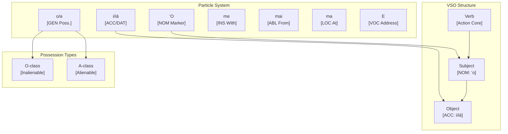

# Hawaiian (ʻŌlelo Hawaiʻi) Language and CEREBRUM Case Mapping

Hawaiian is a Polynesian language spoken in the Hawaiian Islands. As an endangered language with intensive revitalization efforts, it features a VSO word order, extensive reduplication, and grammatical particles that express case-like relationships.

## 1. Overview of Hawaiian Grammar

Hawaiian linguistic features relevant to CEREBRUM case mapping:

- **VSO Word Order**: Verb-Subject-Object as default structure
- **Particle-Based Grammar**: Grammatical relationships marked by particles rather than inflection
- **No Grammatical Cases**: Uses particles and word order instead
- **Reduplication**: Morphological process for intensification and pluralization
- **Vowel-Heavy Phonology**: 13 phonemes (8 consonants, 5 vowels)
- **Endangered Status**: ~24,000 speakers; Hawaiian Immersion (Kaiapuni) schools active
- **Official Language**: Recognized alongside English in Hawaiʻi state constitution

## 2. Hawaiian Particles and Case Relationships

Hawaiian expresses grammatical relationships through particles (like prepositions and markers):

| Hawaiian Particle | Function | CEREBRUM Mapping | Precision |
|------------------|----------|------------------|-----------|
| **ʻO** (subject marker) | Marks subject/topic | **NOM** | 1.5 |
| **i/iā** (object marker) | Marks direct object | **ACC** | 1.2 |
| **i/iā** (dative) | Marks recipient | **DAT** | 1.3 |
| **o/a** (possessive) | Marks possession | **GEN** | 1.0 |
| **me** | "with" - instrument/accompaniment | **INS** | 0.8 |
| **mai** | "from" - source | **ABL** | 1.1 |
| **ma/i** (locative) | Location marker | **LOC** | 0.9 |
| **E** (vocative) | Direct address | **VOC** | 2.0 |

## 3. Hawaiian Sentence Structures

### Basic VSO Structure

```
Ua   hele   ʻo   Keoni   i   ke   kula
PERF  go    SUBJ Keoni  OBJ  the  school
"Keoni went to school"

Case analysis:
- Keoni: NOM (agent, marked by ʻo)
- ke kula: LOC (location, marked by i)
```

### Nominative (Subject) Marking with ʻO

```
ʻO   Malia   ke   kumu
SUBJ Malia  the  teacher
"Malia is the teacher"

- ʻO Malia: NOM (subject/topic marker)
```

### Accusative (Object) Marking with i/iā

```
Ua   ʻai    ʻo   Kimo   i   ka   ʻai
PERF  eat   SUBJ Kimo  OBJ the  food
"Kimo ate the food"

- Kimo: NOM (agent)
- ka ʻai: ACC (patient, marked by i)
```

### Genitive (Possession) with o/a

Hawaiian distinguishes two types of possession:

```
O-class (inalienable, things not acquired by effort):
ko    Malia    makuahine
POSS  Malia   mother
"Malia's mother"

A-class (alienable, acquired things):
kā    Keoni   puke
POSS  Keoni  book  
"Keoni's book"
```

### Instrumental with me

```
E     hoʻokani  ʻo   Leilani  me    ka   ʻukulele
IMP    play    SUBJ Leilani  with  the  ukulele
"Leilani plays with the ukulele"

- Leilani: NOM (agent)
- ka ʻukulele: INS (instrument)
```

### Ablative with mai

```
Ua   hele   mai   ʻo   Kainoa   mai   Maui   mai
PERF  come  DIR  SUBJ  Kainoa  from  Maui   DIR
"Kainoa came from Maui"

- Kainoa: NOM (agent)
- Maui: ABL (source/origin)
```

## 4. Hawaiian Case Mapping Table

| CEREBRUM Case | Hawaiian Marker | Example | Gloss |
|---------------|----------------|---------|-------|
| **NOM** | ʻO | ʻO Malia ke kahu | "Malia is the guardian" |
| **ACC** | i/iā | Nānā iā Keoni | "Look at Keoni" |
| **DAT** | i/iā/nā | Hāʻawi iā Malia | "Give to Malia" |
| **GEN** | o/a/ko/kā | Ko Keoni hale | "Keoni's house" |
| **INS** | me | Me ka hana | "With work" |
| **ABL** | mai | Mai Honolulu | "From Honolulu" |
| **LOC** | ma/i | Ma ke kai | "At the sea" |
| **VOC** | E | E Keoni! | "Hey Keoni!" |

## 5. Active Inference Implementation

```python
from enum import Enum
from dataclasses import dataclass, field
from typing import List, Dict, Optional, Tuple
import math

class HawaiianCase(Enum):
    """Hawaiian case roles with precision modifiers for Active Inference."""
    NOM = ("Nominative", 1.5, "ʻO", "Subject marker")
    ACC = ("Accusative", 1.2, "i/iā", "Object marker")
    DAT = ("Dative", 1.3, "i/iā/nā", "Recipient marker")
    GEN = ("Genitive", 1.0, "o/a", "Possessive marker")
    INS = ("Instrumental", 0.8, "me", "With/accompaniment")
    ABL = ("Ablative", 1.1, "mai", "Source/from")
    LOC = ("Locative", 0.9, "ma/i", "Location marker")
    VOC = ("Vocative", 2.0, "E", "Direct address")
    
    def __init__(self, label: str, precision: float, particle: str, description: str):
        self.label = label
        self.precision = precision
        self.particle = particle
        self.description = description
    
    @property
    def valid_transitions(self) -> List['HawaiianCase']:
        transitions = {
            HawaiianCase.NOM: [HawaiianCase.ACC, HawaiianCase.GEN],
            HawaiianCase.ACC: [HawaiianCase.GEN, HawaiianCase.DAT],
            HawaiianCase.ABL: [HawaiianCase.NOM],
            HawaiianCase.LOC: [HawaiianCase.ABL],
        }
        return transitions.get(self, [])

@dataclass
class HawaiianPhrase:
    """Represents a Hawaiian phrase with case marking."""
    text: str  # Hawaiian text
    gloss: str  # English translation
    case_role: HawaiianCase
    particle: str = ""
    precision: float = field(default=1.0)
    
    @property
    def effective_precision(self) -> float:
        return self.precision * self.case_role.precision

@dataclass 
class BeliefState:
    """Bayesian belief state for Active Inference."""
    mean: float
    precision: float
    
    @property
    def variance(self) -> float:
        return 1.0 / self.precision if self.precision > 0 else float('inf')
    
    def update(self, observation: float, obs_precision: float) -> 'BeliefState':
        total_precision = self.precision + obs_precision
        new_mean = (self.precision * self.mean + obs_precision * observation) / total_precision
        return BeliefState(mean=new_mean, precision=total_precision)

class HawaiianSentenceAnalyzer:
    """Active Inference agent for Hawaiian sentence analysis."""
    
    def __init__(self):
        self.belief = BeliefState(mean=0.0, precision=1.0)
        self.phrases: List[HawaiianPhrase] = []
        self.sentence_structure: List[Dict] = []
    
    def analyze_sentence(self, sentence_parts: List[Tuple[str, str, HawaiianCase, str]]) -> Dict:
        """
        Analyze a Hawaiian sentence by case-marked components.
        
        Args:
            sentence_parts: List of (hawaiian_text, gloss, case_role, particle)
        """
        self.phrases = []
        self.belief = BeliefState(mean=0.0, precision=1.0)
        
        for text, gloss, case, particle in sentence_parts:
            phrase = HawaiianPhrase(
                text=text,
                gloss=gloss,
                case_role=case,
                particle=particle
            )
            self.phrases.append(phrase)
            
            # Update belief with case-weighted precision
            self.belief = self.belief.update(
                observation=len(self.phrases),
                obs_precision=phrase.effective_precision
            )
            
            self.sentence_structure.append({
                'text': text,
                'gloss': gloss,
                'case': case.name,
                'particle': particle,
                'effective_precision': phrase.effective_precision
            })
        
        return {
            'phrase_count': len(self.phrases),
            'case_distribution': self._case_distribution(),
            'structure': self.sentence_structure,
            'final_belief': {
                'mean': self.belief.mean,
                'precision': self.belief.precision
            }
        }
    
    def _case_distribution(self) -> Dict[str, int]:
        """Count phrases by case role."""
        dist = {}
        for p in self.phrases:
            case_name = p.case_role.name
            dist[case_name] = dist.get(case_name, 0) + 1
        return dist
    
    def free_energy(self, observation: float) -> float:
        """Calculate variational free energy."""
        pred_error = observation - self.belief.mean
        return (pred_error ** 2 * self.belief.precision) / 2.0

# Example usage
def demonstrate_hawaiian_analysis():
    analyzer = HawaiianSentenceAnalyzer()
    
    # Analyze: "Ua hāʻawi ʻo Malia i ka lei iā Keoni me ke aloha"
    # "Malia gave the lei to Keoni with love"
    sentence = [
        ("ʻo Malia", "Malia", HawaiianCase.NOM, "ʻo"),
        ("i ka lei", "the lei", HawaiianCase.ACC, "i"),
        ("iā Keoni", "to Keoni", HawaiianCase.DAT, "iā"),
        ("me ke aloha", "with love", HawaiianCase.INS, "me"),
    ]
    
    result = analyzer.analyze_sentence(sentence)
    print(f"Hawaiian Sentence Analysis: {result}")
    return result

if __name__ == "__main__":
    demonstrate_hawaiian_analysis()
```

## 6. Hawaiian Revitalization and CEREBRUM

### Hawaiian Language Revitalization Programs

| Program | Description | CEREBRUM Role |
|---------|-------------|---------------|
| **Pūnana Leo** | Hawaiian immersion preschools | LOC context for acquisition |
| **Kaiapuni** | K-12 Hawaiian immersion schools | INS tool for teaching |
| **ʻAha Pūnana Leo** | Language advocacy organization | NOM agent of change |
| **UH Hilo Hawaiian Studies** | University language programs | GEN source of knowledge |
| **Duolingo Hawaiian** | Mobile language learning | INS accessible tool |

### Language Transmission Model

```python
class HawaiianRevitalizationModel:
    """Model Hawaiian language revitalization dynamics."""
    
    def __init__(self):
        self.speaker_count = 24000  # Approximate current speakers
        self.immersion_students: List[HawaiianSentenceAnalyzer] = []
        self.community_belief = BeliefState(mean=0.5, precision=0.2)
    
    def enroll_student(self, initial_proficiency: float = 0.1) -> int:
        """Add a student to immersion program."""
        student = HawaiianSentenceAnalyzer()
        student.belief = BeliefState(mean=initial_proficiency, precision=0.5)
        self.immersion_students.append(student)
        
        # Update community belief
        self.community_belief = self.community_belief.update(
            observation=initial_proficiency,
            obs_precision=0.3
        )
        
        return len(self.immersion_students) - 1
    
    def immersion_session(self, student_idx: int, exposure_intensity: float) -> Dict:
        """Simulate an immersion learning session."""
        if student_idx >= len(self.immersion_students):
            return {"error": "Student not found"}
        
        student = self.immersion_students[student_idx]
        # Immersion updates belief with high precision (intensive exposure)
        student.belief = student.belief.update(
            observation=exposure_intensity,
            obs_precision=HawaiianCase.VOC.precision  # Direct address = high engagement
        )
        
        return {
            'student_proficiency': student.belief.mean,
            'confidence': student.belief.precision
        }
    
    def community_metric(self) -> Dict:
        """Calculate overall revitalization metrics."""
        if not self.immersion_students:
            return {'status': 'No active students'}
        
        avg_proficiency = sum(
            s.belief.mean for s in self.immersion_students
        ) / len(self.immersion_students)
        
        return {
            'total_students': len(self.immersion_students),
            'average_proficiency': avg_proficiency,
            'community_belief': self.community_belief.mean,
            'estimated_new_speakers': int(len(self.immersion_students) * avg_proficiency)
        }
```

## 7. Hawaiian Phonology and Orthography

### The 13 Hawaiian Phonemes

| Letter | IPA | Example | Meaning |
|--------|-----|---------|---------|
| A/a | [a] | aloha | love/greeting |
| E/e | [e] | hele | go |
| I/i | [i] | ipu | gourd |
| O/o | [o] | ono | delicious |
| U/u | [u] | ulu | grow |
| H/h | [h] | hale | house |
| K/k | [k] | kai | sea |
| L/l | [l] | lei | garland |
| M/m | [m] | mana | power |
| N/n | [n] | nui | big |
| P/p | [p] | pua | flower |
| W/w | [w]/[v] | wai | water |
| ʻ (ʻokina) | [ʔ] | paʻa | firm |

### Long Vowels (Kahakō)

Long vowels marked with macron (kahakō) distinguish meanings:

```
kau = to place (short a)
kāu = yours (long ā) 
ko = sugarcane (short o)
kō = to fulfill (long ō)
```

## 8. Mermaid Diagram: Hawaiian Case Flow



## 9. Cultural Integration

Hawaiian language is deeply connected to cultural concepts:

| Concept | Hawaiian | Case Context | Cultural Meaning |
|---------|----------|--------------|------------------|
| **Aloha** | ke aloha | GEN/INS | Love, compassion, connection |
| **ʻOhana** | ka ʻohana | GEN/LOC | Family, community |
| **Mana** | ka mana | GEN/ABL | Spiritual power |
| **Kuleana** | ke kuleana | NOM/GEN | Responsibility, privilege |
| **Pono** | ka pono | NOM/GEN | Righteousness, balance |

## 10. Conclusion

Hawaiian's particle-based grammar maps elegantly to CEREBRUM's case system:

1. **Clear Markers**: Particles like ʻo, i, me, mai provide explicit case-like relationships
2. **Possession Distinction**: O-class vs. A-class provides nuanced GEN semantics
3. **Revitalization Context**: Active Inference models can support language learning
4. **Cultural Integration**: Case relationships connect to Hawaiian cultural values

The Hawaiian language revitalization movement demonstrates how endangered languages can be computationally modeled to support preservation and transmission.

## 11. References

1. Pukui, M., & Elbert, S. (1986). Hawaiian Dictionary. University of Hawaiʻi Press.
2. Hopkins, A. (1992). Ka Lei Haʻaheo: Beginning Hawaiian. University of Hawaiʻi Press.
3. Wilson, W. H. (1998). "The sociopolitical context of establishing Hawaiian-medium education." In Language, Culture and Curriculum.
4. ʻAha Pūnana Leo. (2023). Hawaiian Language Revitalization.
5. Friston, K. (2010). The free-energy principle. Nature Reviews Neuroscience.
6. Hawaiian Lexicon Committee. (2003). Māmaka Kaiao: A Modern Hawaiian Vocabulary.
