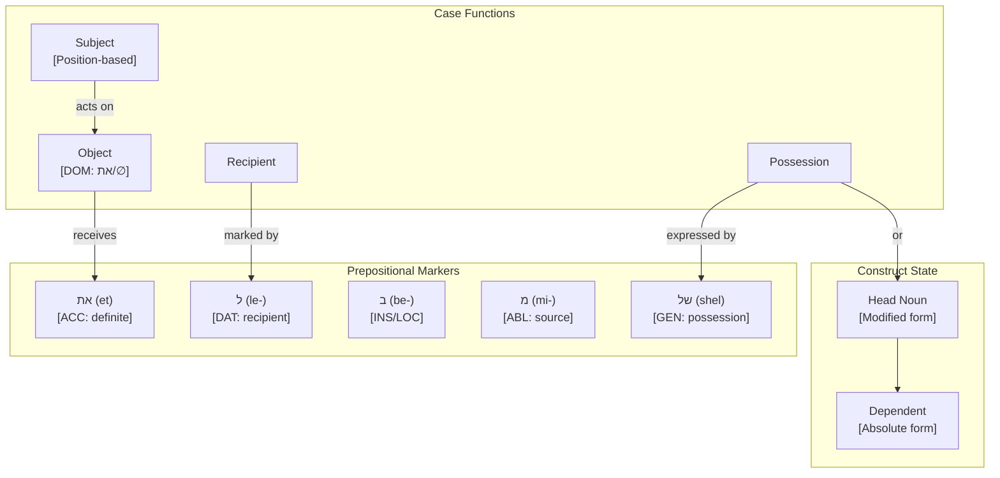

# Hebrew's Construct State System and CEREBRUM Mapping

## Overview of Hebrew's Approach to Case Functions

Modern Hebrew, a Semitic language, offers a distinctive approach to expressing grammatical relationships that differs substantially from traditional case systems. Rather than using morphological case markers on nouns, Hebrew primarily employs two main strategies: the construct state (סמיכות, smichut) for possessive relationships, and prepositions for most other grammatical functions. This structural approach provides an instructive contrast to case-marking languages, demonstrating how CEREBRUM implementations might handle relationship encoding in environments where minimalist marking and structural configurations are preferable to explicit case morphology.

While ancient Biblical Hebrew had a more developed case system, Modern Hebrew has largely abandoned morphological case marking, using word order (typically SVO), prepositions, and the construct state to express grammatical relationships. This evolution offers a compelling model for CEREBRUM implementations requiring streamlined relationship marking while maintaining functional clarity.

## Functional Equivalents to Cases in Hebrew

Hebrew utilizes the following mechanisms to express relationships that would be handled by cases in other languages:

1. **Construct State (סמיכות, smichut)** - Used for possessive and attributive relationships
   - The possessed noun (head) appears in a special construct form
   - The possessor noun (dependent) follows in its absolute form without a linking element
   - Often involves vowel reduction or stress shift in the head noun
   - Examples:
     - בית הספר (beit ha-sefer) - "the school" (lit. "house of the book")
     - דלת הבית (delet ha-bayit) - "the door of the house"

2. **Prepositions** - Used for various grammatical relationships
   - **ל (le-)** - Dative function; marks recipients, beneficiaries, purpose
   - **ב (be-)** - Locative function; marks locations and temporal settings
   - **מ (mi-)** - Ablative function; marks origins, sources, and comparatives
   - **את (et)** - Marks definite direct objects (accusative function)
   - **עם (im)** - Comitative function; marks accompaniment ("with")
   - **של (shel)** - Genitive function; alternative to construct state for possession
   - Examples:
     - נתתי את הספר לדני (natati et ha-sefer le-Dani) - "I gave the book to Dani"
     - אני גר בתל אביב (ani gar be-Tel Aviv) - "I live in Tel Aviv"

3. **Word Order** - Basic SVO (Subject-Verb-Object) order establishes core grammatical relationships

4. **Verbal Suffixes** - Pronominal objects can be expressed through suffixes on verbs
   - Example: ראיתיו (re'itiv) - "I saw him"

5. **Definiteness Marking** - The definite article הַ (ha-) plays a role in construct state and direct object marking

## Mapping to CEREBRUM Cases

Hebrew's structural mechanisms can be mapped to CEREBRUM's eight standard cases as follows:

| CEREBRUM Case | Hebrew Equivalent | Implementation Notes |
|---------------|------------------|----------------------|
| **[NOM]** Nominative | Preverbal position (typically) | Models in [NOM] should occupy subject position; no explicit marking needed |
| **[ACC]** Accusative | את (et) + definite object, or unmarked indefinite object | Models in [ACC] should implement definiteness-sensitive marking |
| **[GEN]** Genitive | Construct state relationship, or של (shel) prepositional phrase | Models in [GEN] should implement either the head-modification pattern of construct state or של prepositional linking |
| **[DAT]** Dative | ל (le-) prepositional phrase | Models in [DAT] should be preceded by dative marker in the data flow |
| **[INS]** Instrumental | ב (be-) in instrumental sense, or עם (im) | Models in [INS] should be preceded by appropriate preposition based on context |
| **[LOC]** Locative | ב (be-) prepositional phrase | Models in [LOC] should be preceded by locative marker |
| **[ABL]** Ablative | מ (mi-) prepositional phrase | Models in [ABL] should be preceded by source marker |
| **[VOC]** Vocative | Direct address, optional use of interjections like הי (hey) | Models in [VOC] should implement direct address patterns |

## Unique Features

Hebrew's approach to grammatical relationships offers several unique features relevant to CEREBRUM:

1. **Construct State Relationship**

   The Hebrew construct state creates a tight bond between two nouns (typically expressing possession or attribution) without requiring a separate possessive marker between them. Instead, the first noun (the head) undergoes changes to form a construct state. This provides a model for CEREBRUM implementations where relationship encoding modifies the model itself rather than adding external markers.

   ```
   ספר (sefer) - "book" (absolute state)
   ספר ילדים (sefer yeladim) - "children's book" (lit. "book of children")
   
   בית (bayit) - "house" (absolute state)
   בית המלך (beit ha-melech) - "the king's house" (construct "house of" + "the king")
   ```

   Note how the first noun בית (bayit, "house") changes to בית (beit) in the construct state.

2. **Definiteness Spread in Construct Chains**

   In Hebrew construct chains, definiteness is marked only on the final noun but spreads to the entire phrase. This provides a model for CEREBRUM to implement feature propagation in relational chains.

   ```
   בית ספר (beit sefer) - "school" (lit. "house of book") - indefinite
   בית הספר (beit ha-sefer) - "the school" (lit. "house of the book") - definite
   ```

   The definite article הַ (ha-) appears only on the second noun but makes the entire phrase definite.

3. **Differential Object Marking**

   Hebrew marks direct objects with את (et) only when they are definite. This provides a model for CEREBRUM implementations where relationship marking depends on the inherent properties of the model being marked.

   ```
   אני קורא ספר (ani kore sefer) - "I am reading a book" (indefinite, unmarked)
   אני קורא את הספר (ani kore et ha-sefer) - "I am reading the book" (definite, marked)
   ```

4. **Multi-Function Prepositions**

   Hebrew prepositions often serve multiple grammatical functions depending on context. This provides a model for CEREBRUM implementations where relationship markers are contextually interpreted.

   ```
   הלכתי בדרך (halachti ba-derech) - "I walked on the road" (locative)
   כתבתי בעט (katavti be-et) - "I wrote with a pen" (instrumental)
   ```

   The same preposition ב (be-) serves different functions based on context.

## Extension Opportunities

Hebrew's system suggests several extension opportunities for CEREBRUM:

1. **Construct State Architecture**

   Inspired by Hebrew's construct state, CEREBRUM could implement a "modified head" architecture where the head model in a relationship undergoes internal modification rather than receiving an external case marker, creating tighter coupling between related models.

2. **Definiteness-Sensitive Case Marking**

   Based on Hebrew's differential object marking, CEREBRUM could implement definiteness-sensitive relationship marking where models receive different markers based on their specificity, uniqueness, or prominence.

3. **Feature Propagation in Model Chains**

   Drawing from Hebrew's definiteness spread in construct chains, CEREBRUM could implement feature propagation in model chains where properties marked on one model automatically affect connected models.

4. **Contextual Interpretation of Relationship Markers**

   Inspired by Hebrew's multi-function prepositions, CEREBRUM could implement context-sensitive interpretation of relationship markers, where the same marker can express different relationships based on the semantic properties of the connected models.

5. **Double Genitive System**

   Based on Hebrew's dual genitive strategies (construct state and של "shel"), CEREBRUM could implement complementary genitive patterns with different semantic implications - one for intrinsic/inherent relationships (like construct state) and another for contingent relationships.

## Example Sentences

Below are example sentences in Hebrew with their CEREBRUM parallels:

1. **Nominative [NOM]** (Subject position)

   **Hebrew:** הילד קורא ספר (ha-yeled kore sefer)
   The-boy reads book
   "The boy reads a book."

   **CEREBRUM:** Boy_Model[NOM] performs reading operation on Book_Model.

2. **Accusative [ACC]** (Direct object with differential marking)

   **Hebrew:** ראיתי את הכלב (ra'iti et ha-kelev)
   Saw.1SG ACC the-dog
   "I saw the dog."

   **CEREBRUM:** I_Model[NOM] perceives Dog_Model[ACC:definite] through visual channel.

   **Hebrew:** ראיתי כלב (ra'iti kelev)
   Saw.1SG dog
   "I saw a dog."

   **CEREBRUM:** I_Model[NOM] perceives Dog_Model[ACC:indefinite] through visual channel.

3. **Genitive [GEN]** (Construct state)

   **Hebrew:** בית המורה גדול (beit ha-moreh gadol)
   House.CONST the-teacher big
   "The teacher's house is big."

   **CEREBRUM:** House_Model[modified-head] derived from Teacher_Model[GEN:dependent] has large-scale property.

4. **Genitive [GEN]** (של "shel" construction)

   **Hebrew:** הבית של המורה גדול (ha-bayit shel ha-moreh gadol)
   The-house of the-teacher big
   "The teacher's house is big."

   **CEREBRUM:** House_Model derived from Teacher_Model[GEN:shel] has large-scale property.

5. **Dative [DAT]** (ל "le-" preposition)

   **Hebrew:** נתתי את הספר לילד (natati et ha-sefer la-yeled)
   Gave.1SG ACC the-book to-the-boy
   "I gave the book to the boy."

   **CEREBRUM:** I_Model[NOM] transfers Book_Model[ACC] to Boy_Model[DAT:le].

6. **Instrumental [INS]** (ב "be-" preposition)

   **Hebrew:** חתכתי את הלחם בסכין (chatachti et ha-lechem be-sakin)
   Cut.1SG ACC the-bread with-knife
   "I cut the bread with a knife."

   **CEREBRUM:** I_Model[NOM] utilizes Knife_Model[INS:be] to transform Bread_Model[ACC].

7. **Locative [LOC]** (ב "be-" preposition)

   **Hebrew:** הספר נמצא בשולחן (ha-sefer nimtsa ba-shulchan)
   The-book located on-the-table
   "The book is on the table."

   **CEREBRUM:** Book_Model exists on Table_Model[LOC:be] with surface position.

8. **Ablative [ABL]** (מ "mi-" preposition)

   **Hebrew:** הרכבת מגיעה מירושלים (ha-rakevet magi'a mi-Yerushalayim)
   The-train arrives from-Jerusalem
   "The train arrives from Jerusalem."

   **CEREBRUM:** Train_Model performs arrival operation originating from Jerusalem_Model[ABL:mi].

9. **Vocative [VOC]** (Direct address)

   **Hebrew:** דני, בוא הנה! (Dani, bo hena!)
   Dani, come here!
   "Dani, come here!"

   **CEREBRUM:** Direct invocation of Dani_Model[VOC] with proximity instruction.

10. **Construct Chain** (Extension pattern)

    **Hebrew:** דלת בית הספר אדומה (delet beit ha-sefer aduma)
    Door.CONST house.CONST the-book red
    "The school door is red." (lit. "Door of house of the book is red")

    **CEREBRUM:** Door_Model[modified-head1] derived from [School_Model[modified-head2] derived from Book_Model[GEN:dependent]] has red-color property.

These examples demonstrate how Hebrew's structural patterns can be systematically mapped to CEREBRUM's case framework, even in the absence of a traditional case system.

## Implications for CEREBRUM Design

Hebrew's approach to grammatical relationships offers valuable insights for CEREBRUM implementations:

1. **Modification-Based Relationship Encoding**

   CEREBRUM could implement a modification-based relationship encoding system inspired by Hebrew's construct state, where relationships are expressed through internal modifications to the head model rather than external case markers.

2. **Definiteness-Driven Processing Architecture**

   Based on Hebrew's differential object marking, CEREBRUM could implement a definiteness-driven processing architecture where the specificity and identifiability of models affect how they are processed and related to other models.

3. **Feature Propagation System**

   Inspired by Hebrew's definiteness spread, CEREBRUM could implement automated feature propagation where properties marked on one model in a relationship chain automatically propagate to connected models according to systematic rules.

These Hebrew-inspired approaches would be particularly valuable for CEREBRUM implementations focusing on internal model modification rather than external case marking, potentially creating more streamlined and contextually adaptive relationship architectures.

## 6. Active Inference Implementation

### Construct State and Precision Modifiers

```python
from enum import Enum
from dataclasses import dataclass, field
from typing import List, Dict, Optional, Tuple

class HebrewMarker(Enum):
    """Hebrew grammatical markers with precision modifiers for Active Inference."""
    NOM = ("Nominative", 1.5, "—", "Subject position")
    ACC = ("Accusative", 1.2, "את", "Definite object marker")
    DAT = ("Dative", 1.3, "ל", "Recipient marker")
    GEN = ("Genitive", 1.0, "של/construct", "Possession marker")
    INS = ("Instrumental", 0.8, "ב", "Means marker")
    LOC = ("Locative", 0.9, "ב", "Location marker")
    ABL = ("Ablative", 1.1, "מ", "Source marker")
    VOC = ("Vocative", 2.0, "—", "Direct address")
    
    def __init__(self, label: str, precision: float, particle: str, role: str):
        self.label = label
        self.precision = precision
        self.particle = particle
        self.role = role
    
    @property
    def valid_transitions(self) -> List['HebrewMarker']:
        transitions = {
            HebrewMarker.NOM: [HebrewMarker.ACC, HebrewMarker.GEN],
            HebrewMarker.ACC: [HebrewMarker.GEN, HebrewMarker.DAT],
            HebrewMarker.ABL: [HebrewMarker.NOM],
            HebrewMarker.LOC: [HebrewMarker.ABL],
        }
        return transitions.get(self, [])

@dataclass
class BeliefState:
    """Bayesian belief state for Active Inference."""
    mean: float
    precision: float
    
    @property
    def variance(self) -> float:
        return 1.0 / self.precision if self.precision > 0 else float('inf')
    
    def update(self, observation: float, obs_precision: float) -> 'BeliefState':
        """Bayesian belief update."""
        total_precision = self.precision + obs_precision
        new_mean = (self.precision * self.mean + obs_precision * observation) / total_precision
        return BeliefState(mean=new_mean, precision=total_precision)

@dataclass
class HebrewPhrase:
    """Represents a Hebrew phrase with grammatical marking."""
    text: str  # Hebrew text
    transliteration: str
    marker: HebrewMarker
    is_definite: bool = False
    is_construct: bool = False
    precision: float = field(default=1.0)
    
    @property
    def effective_precision(self) -> float:
        base = self.precision * self.marker.precision
        # Definite objects have higher precision (explicit marking)
        if self.is_definite and self.marker == HebrewMarker.ACC:
            base *= 1.2
        return base

class HebrewActiveInferenceAgent:
    """Active Inference agent for Hebrew sentence processing."""
    
    def __init__(self, initial_mean: float = 0.0):
        self.belief = BeliefState(mean=initial_mean, precision=1.0)
        self.phrases: List[HebrewPhrase] = []
        self.analysis_history: List[Dict] = []
    
    def process_phrase(self, phrase: HebrewPhrase) -> None:
        """Process a phrase and update beliefs with marker-weighted precision."""
        effective_precision = phrase.effective_precision
        self.belief = self.belief.update(
            observation=len(self.phrases),
            obs_precision=effective_precision
        )
        self.phrases.append(phrase)
        self.analysis_history.append({
            'text': phrase.text,
            'transliteration': phrase.transliteration,
            'marker': phrase.marker.name,
            'particle': phrase.marker.particle,
            'definite': phrase.is_definite,
            'precision': effective_precision,
            'belief_mean': self.belief.mean
        })
    
    def free_energy(self, observation: float) -> float:
        """Calculate variational free energy."""
        pred_error = observation - self.belief.mean
        return (pred_error ** 2 * self.belief.precision) / 2.0
    
    def analyze_sentence(self, phrases: List[HebrewPhrase]) -> Dict:
        """Analyze a Hebrew sentence by grammatical structure."""
        self.phrases = []
        self.belief = BeliefState(mean=0.0, precision=1.0)
        
        for phrase in phrases:
            self.process_phrase(phrase)
        
        return {
            'phrase_count': len(self.phrases),
            'marker_distribution': self._marker_distribution(),
            'definiteness_ratio': self._definiteness_ratio(),
            'final_belief': {'mean': self.belief.mean, 'precision': self.belief.precision}
        }
    
    def _marker_distribution(self) -> Dict[str, int]:
        dist = {}
        for p in self.phrases:
            marker = p.marker.name
            dist[marker] = dist.get(marker, 0) + 1
        return dist
    
    def _definiteness_ratio(self) -> float:
        if not self.phrases:
            return 0.0
        definite = sum(1 for p in self.phrases if p.is_definite)
        return definite / len(self.phrases)

# Example usage
def demonstrate_hebrew_analysis():
    agent = HebrewActiveInferenceAgent()
    
    # Sentence: נתתי את הספר לילד
    # "I gave the book to the child"
    phrases = [
        HebrewPhrase("הספר", "ha-sefer", HebrewMarker.ACC, is_definite=True),
        HebrewPhrase("לילד", "la-yeled", HebrewMarker.DAT, is_definite=True),
    ]
    
    result = agent.analyze_sentence(phrases)
    print(f"Hebrew Sentence Analysis: {result}")
    return result

if __name__ == "__main__":
    demonstrate_hebrew_analysis()
```

### Construct State Chain Processing

```python
class ConstructChainProcessor:
    """Process Hebrew construct state (smichut) chains."""
    
    def __init__(self):
        self.chain: List[HebrewPhrase] = []
        self.definiteness_propagated: bool = False
    
    def build_chain(self, phrases: List[HebrewPhrase]) -> Dict:
        """
        Build a construct state chain with definiteness propagation.
        
        In Hebrew, definiteness on the final noun propagates to entire chain:
        בית ספר (beit sefer) = "a school" (indefinite)
        בית הספר (beit ha-sefer) = "the school" (definite)
        """
        self.chain = phrases
        
        # Check if final noun is definite
        if phrases and phrases[-1].is_definite:
            self.definiteness_propagated = True
            # Propagate to all members
            for phrase in phrases:
                phrase.is_definite = True
        
        return {
            'chain_length': len(self.chain),
            'definite': self.definiteness_propagated,
            'head': phrases[0].text if phrases else None,
            'dependent': phrases[-1].text if phrases else None
        }
```

### Differential Object Marking

```python
class DifferentialObjectMarker:
    """Handle Hebrew's differential object marking (DOM)."""
    
    @staticmethod
    def mark_object(phrase: HebrewPhrase) -> str:
        """
        Apply appropriate object marking based on definiteness.
        
        Hebrew uses את (et) only for definite direct objects:
        - ראיתי ספר (ra'iti sefer) = "I saw a book" (no marker)
        - ראיתי את הספר (ra'iti et ha-sefer) = "I saw the book" (with marker)
        """
        if phrase.marker == HebrewMarker.ACC and phrase.is_definite:
            return f"את {phrase.text}"
        else:
            return phrase.text
```

## 7. Mermaid Diagram: Hebrew Marker Architecture



## 8. Possession Systems Comparison

| System | Marker | Example | Semantic Nuance | Precision |
|--------|--------|---------|-----------------|-----------|
| **Construct State** | Modified form | בית המורה | Inherent/close | 1.2 |
| **של (shel)** | Preposition | הבית של המורה | Contingent/loose | 1.0 |

The dual genitive system allows CEREBRUM to model different relationship types:

- Construct state for intrinsic relationships (higher precision)
- של for contingent/alienable relationships (baseline precision)

## 9. References

1. Glinert, L. (1989). The Grammar of Modern Hebrew. Cambridge University Press.
2. Aronson, H. I. (1985). Modern Hebrew. Croom Helm.
3. Friston, K. (2010). The free-energy principle. Nature Reviews Neuroscience.
4. Berman, R. A. (1978). Modern Hebrew Structure. Tel Aviv University.
5. Arad, M. (2005). Roots and Patterns: Hebrew Morpho-syntax. Springer.
