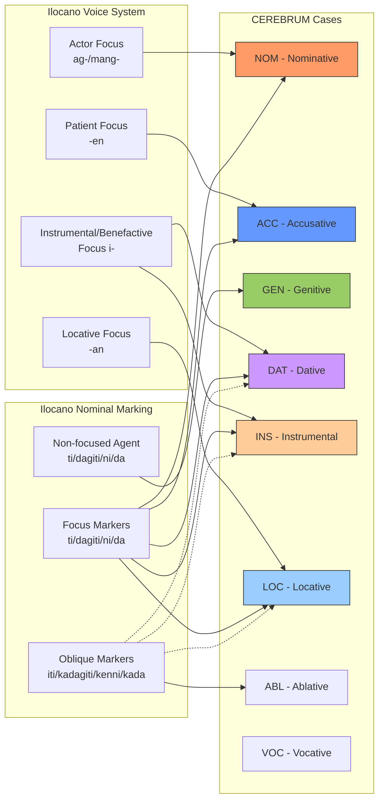
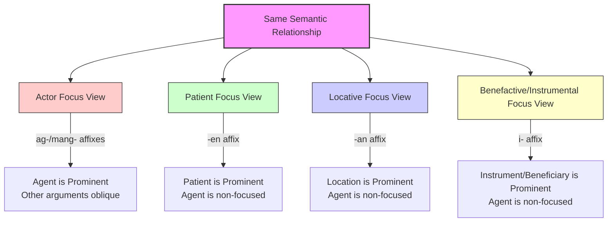
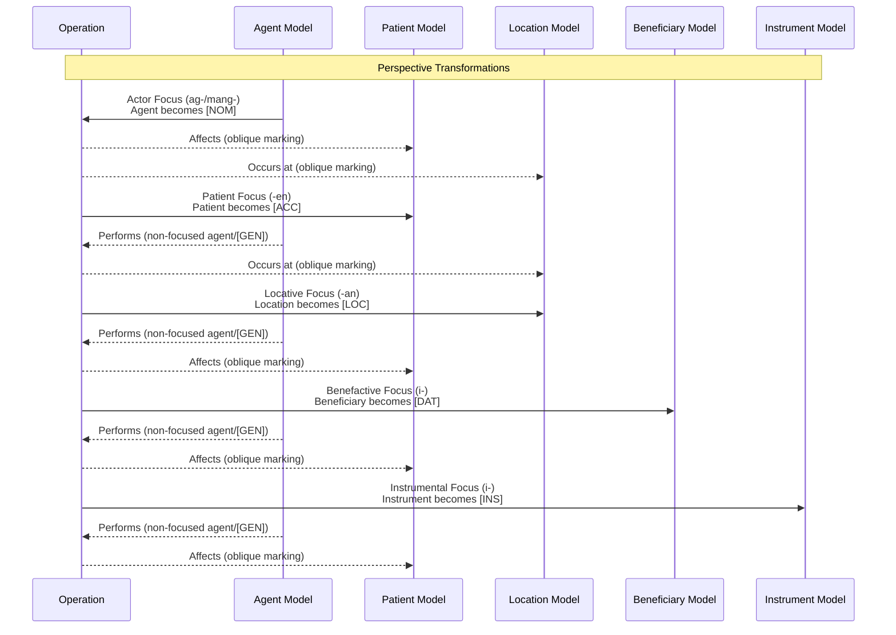
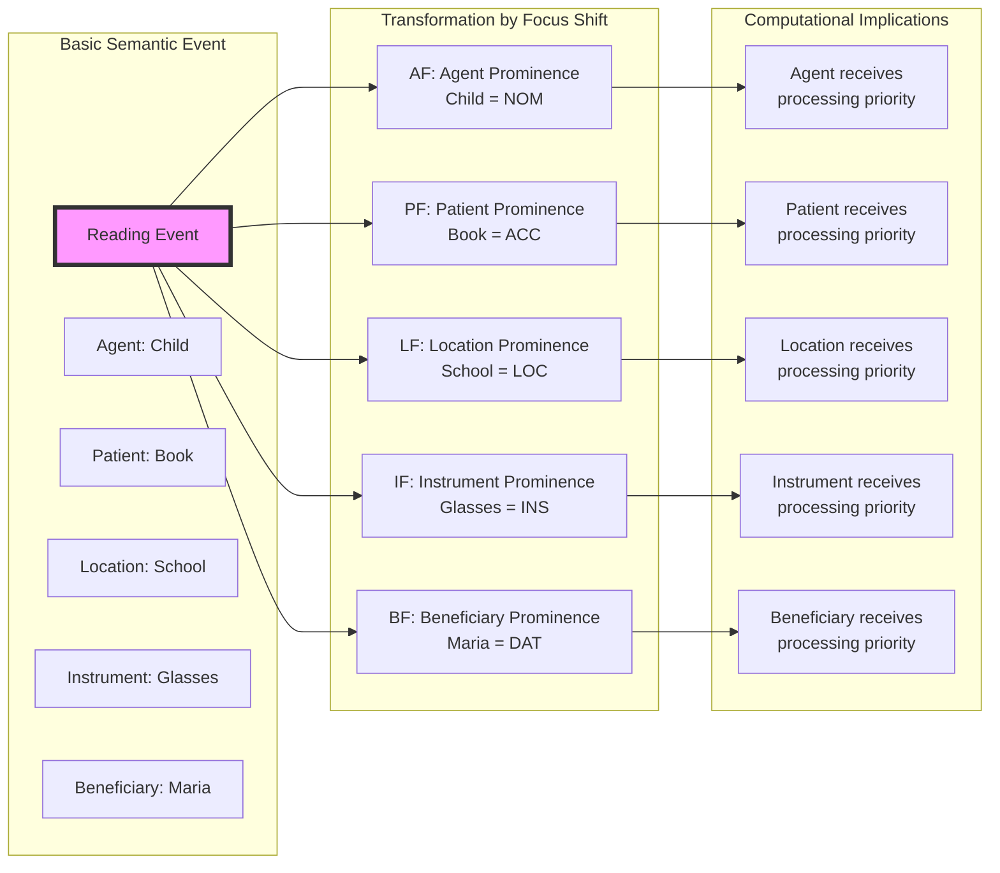

# Ilocano Case System and CEREBRUM Mapping

## Overview of Ilocano's Approach to Grammatical Relations

Ilocano (Iloko), a Philippine Austronesian language spoken primarily in Northern Luzon in the Philippines, employs a complex system of voice/focus and markers to indicate grammatical relationships. Like other Philippine languages, Ilocano features a symmetrical voice system where verbal affixes determine which argument is in focus, rather than using traditional case inflections. This alignment system provides a valuable perspective for CEREBRUM implementations by demonstrating how grammatical relationships can be encoded through verbal morphology and specialized markers.

In Ilocano, the focused argument (equivalent to the subject in English) is marked with specific particles, while non-focused arguments receive different markers based on their semantic roles. The verbal morphology indicates which argument is in focus, creating a system where different semantic roles can be promoted to syntactic prominence. This focus-based approach offers an alternative model for CEREBRUM where operational relevance can be dynamically shifted across different participating models.

```mermaid
graph TD
    A[Ilocano Grammatical System]
    A --> B[Verbal Voice System]
    A --> C[Nominal Case Marking]
    
    B --> B1[Actor Focus ag-/mang-]
    B --> B2[Patient Focus -en]
    B --> B3[Locative Focus -an]
    B --> B4[Instrumental/Benefactive Focus i-]
    
    C --> C1[Focus Markers ti/dagiti/ni/da]
    C --> C2[Oblique Markers iti/kadagiti/kenni/kada]
    C --> C3[Non-focused Agent ti/dagiti/ni/da]
    
    B1 --- D1[Focused Agent/Actor]
    B2 --- D2[Focused Patient/Object]
    B3 --- D3[Focused Location]
    B4 --- D4[Focused Instrument/Beneficiary]
    
    C1 --- D1
    C1 --- D2
    C1 --- D3
    C1 --- D4
    C2 --- D5[Non-focused Non-agent]
    C3 --- D6[Non-focused Agent]
    
    D1 --- E[CEREBRUM [NOM\]]
    D2 --- F[CEREBRUM [ACC\]]
    D3 --- G[CEREBRUM [LOC\]]
    D4 --- H1[CEREBRUM [INS\]]
    D4 --- H2[CEREBRUM [DAT\]]
    D6 --- I[CEREBRUM [GEN\]]
    D5 --- J[Other CEREBRUM Cases]
```

## Functional Equivalents to Cases in Ilocano

Ilocano employs the following markers and structures to express relationships that would be handled by cases in other languages:

1. **Focus/Voice Affixes on Verbs** - Indicate which argument is in focus
   - **ag-/mang-** Actor Focus: Focuses on the agent/actor
   - **-en** Patient/Object Focus: Focuses on the patient/undergoer
   - **-an** Locative/Directional Focus: Focuses on the location
   - **i-** Benefactive/Instrumental Focus: Focuses on beneficiary or instrument

2. **Noun Markers** - Function somewhat like case markers
   - **ti/dagiti** - Common noun marker (singular/plural) for focused arguments
   - **ni/da** - Personal noun marker (singular/plural) for focused arguments
   - **iti/kadagiti** - Common noun marker (singular/plural) for oblique arguments
   - **kenni/kada** - Personal noun marker (singular/plural) for oblique arguments
   - **ti/dagiti** - Used for non-focused common noun agents in non-actor focus constructions
   - **ni/da** - Used for non-focused personal noun agents in non-actor focus constructions

3. **Word Order** - Typically Verb-Subject-Object, but flexible based on focus

4. **Genitive Markers** - Indicate possession relationships
   - **ti/dagiti** - For common nouns
   - **ni/da** - For personal names

## Mapping to CEREBRUM Cases

Ilocano's focus system and markers can be mapped to CEREBRUM's eight standard cases as follows:

| CEREBRUM Case | Ilocano Equivalent | Implementation Notes |
|---------------|------------------|----------------------|
| **[NOM]** Nominative | Focused argument (ti/dagiti/ni/da) + Actor Focus verb (ag-/mang-) | Models in [NOM] should implement focus marking with actor focus verbal operation |
| **[ACC]** Accusative | Focused argument (ti/dagiti/ni/da) + Patient Focus verb (-en) | Models in [ACC] should implement focus marking with patient focus verbal operation |
| **[GEN]** Genitive | Non-focused agent in non-actor focus clauses or possessive marker (ti/dagiti/ni/da) | Models in [GEN] should implement non-focused agent relation or possessive relation |
| **[DAT]** Dative | Focused argument (ti/dagiti/ni/da) + Benefactive Focus verb (i-) or oblique marking (iti/kadagiti/kenni/kada) | Models in [DAT] should implement either focus or oblique marking based on prominence |
| **[INS]** Instrumental | Focused argument (ti/dagiti/ni/da) + Instrumental Focus verb (i-) or oblique marking (iti/kadagiti/kenni/kada) | Models in [INS] should implement focus or oblique marking based on prominence |
| **[LOC]** Locative | Focused argument (ti/dagiti/ni/da) + Locative Focus verb (-an) or oblique marking (iti/kadagiti/kenni/kada) | Models in [LOC] should implement focus or oblique marking based on prominence |
| **[ABL]** Ablative | Oblique marking (iti/kadagiti/kenni/kada) with appropriate motion verbs | Models in [ABL] should implement oblique marker with source semantics |
| **[VOC]** Vocative | Direct address, often with "ading" (friend) or other address terms | Models in [VOC] should implement direct address patterns |



## Unique Features

Ilocano's grammatical system offers several unique features relevant to CEREBRUM:

1. **Focus/Voice System**
   
   In Ilocano, the verbal morphology determines which argument receives syntactic prominence, creating a system where grammatical relations are marked primarily through verb forms rather than noun case marking. This provides a model for CEREBRUM implementations where operations can dynamically reassign prominence to different participating models.

   ```
   Nagluto ti babai iti karne.
   AF-cook DET woman OBL meat
   "The woman cooked meat." (Actor in focus)
   
   Linuto ti babai ti karne.
   PF-cook DET woman DET meat
   "The woman cooked the meat." (Patient in focus)
   ```

   Both sentences describe the same event but differ in which participant is syntactically prominent.

2. **Common vs. Personal Noun Distinction**

   Ilocano maintains a systematic distinction between common nouns and personal names in its marking system. This provides a model for CEREBRUM to implement entity-type distinctions in its relationship marking.

   ```
   Nakita ni Juan ti ubing.
   PF-see PERS Juan DET child
   "Juan saw the child."
   
   Nakita ti ubing ni Juan.
   PF-see DET child PERS Juan
   "The child saw Juan."
   ```

   The markers distinguish between personal names and common nouns.

3. **Clitic Pronouns**

   Ilocano employs a system of clitic pronouns that encode both person and case, attaching to the verb or other elements in the clause. This provides a model for CEREBRUM to implement compact, attached reference systems.

   ```
   Kitaen na ka.
   see-PF 3SG.GEN 2SG.ABS
   "He/She sees you."
   ```

   The clitics `na` (3rd person singular genitive) and `ka` (2nd person singular absolutive) compactly encode both person and case information.

4. **Verbal Aspect System**

   Ilocano verbs encode complex aspectual distinctions through affixation, providing models for temporal relationship encoding in CEREBRUM.

   ```
   Agluto-ak. (Incomplete/future)
   "I will cook."
   
   Nagluto-ak. (Completed)
   "I cooked."
   
   Aglutluto-ak. (Progressive/ongoing)
   "I am cooking."
   ```



## Extension Opportunities

Ilocano's focus system suggests several extension opportunities for CEREBRUM:

1. **Dynamic Focus Operation Architecture**
   
   Inspired by Ilocano's symmetrical voice system, CEREBRUM could implement a dynamic focus operation architecture where the same basic operation can be viewed from different participant perspectives without altering the underlying relationship.

2. **Entity Type-Sensitive Marking**
   
   Based on Ilocano's distinction between common and personal nouns, CEREBRUM could implement entity type-sensitive marking where relationship indicators adapt based on the nature of the related entities.

3. **Compact Reference System**
   
   Drawing from Ilocano's clitic pronoun system, CEREBRUM could implement a compact reference system where relationship markers incorporate entity references in a minimized form.

4. **Aspect-Enriched Operations**
   
   Inspired by Ilocano's verbal aspect system, CEREBRUM could implement aspect-enriched operations where temporal status (completed, ongoing, future) is integrated into operational specifications.

5. **Oblique Relationship Marking**
   
   Based on Ilocano's oblique marking system, CEREBRUM could implement a generalized oblique relationship marker for non-core participants in operations.



## Example Sentences

Below are example sentences in Ilocano with their CEREBRUM parallels:

1. **Actor Focus [NOM]**

   **Ilocano:** Agbasa ti ubing iti libro.
   AF-read DET child OBL book
   "The child reads a book." (Actor in focus)
   
   **CEREBRUM:** Child_Model[NOM:AF] performs reading operation on Book_Model[OBL].

2. **Patient Focus [ACC]**

   **Ilocano:** Basaen ti ubing ti libro.
   PF-read DET child DET book
   "The child reads the book." (Patient in focus)
   
   **CEREBRUM:** Book_Model[ACC:PF] undergoes reading operation by Child_Model[GEN].

3. **Locative Focus [LOC]**

   **Ilocano:** Basaan ti ubing ti libro ti eskuela.
   LF-read DET child DET book DET school
   "The child reads the book at school." (Location in focus)
   
   **CEREBRUM:** School_Model[LOC:LF] hosts reading operation with Child_Model[GEN] as agent and Book_Model as theme.

4. **Benefactive Focus [DAT]**

   **Ilocano:** Ibasa ti ubing ti libro para kenni Maria.
   BF-read DET child DET book for OBL Maria
   "The child reads the book for Maria." (Beneficiary in focus)
   
   **CEREBRUM:** Maria_Model[DAT:BF] benefits from reading operation performed by Child_Model[GEN] on Book_Model.

5. **Instrumental Focus [INS]**

   **Ilocano:** Ipangbasa ti ubing ti libro ti salamin.
   IF-read DET child DET book DET glasses
   "The child reads the book with the glasses." (Instrument in focus)
   
   **CEREBRUM:** Glasses_Model[INS:IF] facilitates reading operation performed by Child_Model[GEN] on Book_Model.

6. **Possession [GEN]**

   **Ilocano:** Ti balay ni Juan
   DET house PERS Juan
   "Juan's house"
   
   **CEREBRUM:** House_Model is possessed by Juan_Model[GEN].

7. **Directional [ABL]**

   **Ilocano:** Naggapu iti Manila.
   AF-come from OBL Manila
   "He/She came from Manila."
   
   **CEREBRUM:** He/She_Model originates from Manila_Model[ABL] with motion trajectory.

8. **Vocative [VOC]**

   **Ilocano:** Ading, umayka ditoy!
   Friend, come-2SG here
   "Friend, come here!"
   
   **CEREBRUM:** Direct invocation of Friend_Model[VOC] with proximity instruction.

```mermaid
graph TB
    subgraph "Ilocano Reading Event"
        Reading[Reading Event]
        Child[Child]
        Book[Book]
        School[School]
        Glasses[Glasses]
        Maria[Maria]
    end
    
    subgraph "Different Focus Perspectives"
        AF[Actor Focus<br>agbasa]
        PF[Patient Focus<br>basaen]
        LF[Locative Focus<br>basaan]
        BF[Benefactive Focus<br>ibasa]
        IF[Instrumental Focus<br>ipangbasa]
    end
    
    subgraph "CEREBRUM Cases"
        NOM[Child_Model[NOM:AF]]
        ACC[Book_Model[ACC:PF]]
        LOC[School_Model[LOC:LF]]
        DAT[Maria_Model[DAT:BF]]
        INS[Glasses_Model[INS:IF]]
        GEN[Child_Model[GEN]]
    end
    
    Child --- AF
    AF --- NOM
    
    Book --- PF
    PF --- ACC
    
    School --- LF
    LF --- LOC
    
    Maria --- BF
    BF --- DAT
    
    Glasses --- IF
    IF --- INS
    
    Child --- GEN
    
    style Reading fill:#f9f,stroke:#333,stroke-width:2px
    style AF fill:#fcc,stroke:#333
    style PF fill:#cfc,stroke:#333
    style LF fill:#ccf,stroke:#333
    style BF fill:#ffc,stroke:#333
    style IF fill:#fcf,stroke:#333
```

## Implications for CEREBRUM Design

Ilocano's focus system offers valuable insights for CEREBRUM implementations:

1. **Operation-Determined Prominence**
   
   CEREBRUM could implement an operation-determined prominence system where the operation itself determines which participating models receive syntactic prominence, rather than relying on inherent properties of the models.

2. **Type-Sensitive Relationship Marking**
   
   Inspired by Ilocano's distinction between common and personal nouns, CEREBRUM could implement relationship markers that adapt based on entity types, creating more nuanced relationship encoding.

3. **Multi-Perspective Operational View**
   
   Based on Ilocano's focus system, CEREBRUM could implement multiple operational views of the same underlying process, allowing users to reframe operations based on which aspect is most relevant to current needs.



These Ilocano-inspired approaches would be particularly valuable for CEREBRUM implementations requiring flexible perspective assignment and entity-sensitive relationship marking across model ecosystems. 