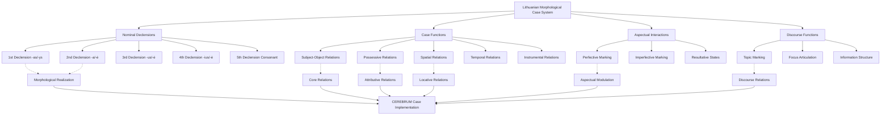

# Lithuanian Case System and CEREBRUM Mapping

## Overview of Lithuanian's Complex Case System

Lithuanian (lietuvių kalba) represents one of the most archaic Indo-European languages still spoken today, providing CEREBRUM with a sophisticated model of case relationships through extensive morphological inflection. As the most conservative Baltic language, Lithuanian preserves complex case distinctions, intricate declension patterns, and aspectual interactions that offer invaluable insights for CEREBRUM implementations requiring rich relational specification and morphological precision.

Lithuanian's seven-case system demonstrates how CEREBRUM could implement comprehensive morphological case marking with systematic paradigmatic organization, aspectual sensitivity, and discourse-functional flexibility. The language's preservation of archaic Indo-European features provides unique opportunities for understanding fundamental case relationships that have been lost or simplified in most other Indo-European languages.

## Historical Significance and Archaic Features

### Indo-European Conservatism

Lithuanian preserves numerous archaic Indo-European features:

1. **Complex Vowel System** - Retains Indo-European length distinctions and tone
2. **Rich Morphology** - Extensive case and aspectual marking
3. **Archaic Vocabulary** - Many words directly descended from Proto-Indo-European
4. **Complex Accent System** - Mobile stress with grammatical functions
5. **Aspectual Distinctions** - Systematic perfective/imperfective marking

### Relationship to Other Baltic Languages

Lithuanian is closely related to Latvian but more conservative:

```
Proto-Baltic
├── East Baltic
│   ├── Lithuanian (conservative)
│   └── Latvian (simplified 6-case system)
└── West Baltic (extinct)
    ├── Old Prussian (7-case system, documented)
    └── Other West Baltic languages
```

## Morphological Case System

Lithuanian employs seven morphological cases with extensive paradigmatic variation:

### Case Inventory

| Case | Lithuanian Name | Primary Functions |
|------|----------------|-------------------|
| **NOM** | vardininkas | Subject, predicate nominative |
| **GEN** | kilmininkas | Possessor, partitive object, negation |
| **DAT** | naudininkas | Indirect object, experiencer, purpose |
| **ACC** | galininkas | Direct object, direction, time extent |
| **INS** | įnagininkas | Instrument, means, accompaniment |
| **LOC** | vietininkas | Location, time, object of emotion |
| **VOC** | šauksmininkas | Direct address |

### Declension Classes

Lithuanian has five major declension classes with extensive subvariation:

#### First Declension (Masculine -as/-ys)
```
vỹras "man" (mobile stress)
NOM: vỹr-as
GEN: výr-o  
DAT: výr-ui
ACC: výr-ą
INS: výr-u
LOC: vyr-ė̃
VOC: výr-e

nãmas "house" (fixed stress)
NOM: nãm-as
GEN: nãm-o
DAT: nãm-ui  
ACC: nãm-ą
INS: nãm-u
LOC: nam-ė̃
VOC: nãm-e
```

#### Second Declension (Feminine -a/-ė)
```
móter-is "woman" (irregular)
NOM: móter-is
GEN: móter-s
DAT: móter-iai
ACC: móter-į
INS: móter-imi
LOC: móter-yje
VOC: móter-ie

galv-à "head"
NOM: galv-à
GEN: galv-õs
DAT: galv-ái
ACC: galv-ą̃
INS: galv-à
LOC: galv-oj-è
VOC: galv-à
```

#### Third Declension (Various endings)
```
sūn-ùs "son"
NOM: sūn-ùs
GEN: sūn-aũs
DAT: sūn-ui
ACC: sūn-ų̃
INS: sūn-umi
LOC: sūn-uj-è
VOC: sūn-au

dukt-ė̃ "daughter"  
NOM: dukt-ė̃
GEN: dukt-er-s
DAT: dukt-er-iai
ACC: dukt-er-į
INS: dukt-er-imi
LOC: dukt-er-yje
VOC: dukt-er-ie
```

## Mapping to CEREBRUM Cases

Lithuanian's morphological system provides direct correspondence to CEREBRUM cases:

| CEREBRUM Case | Lithuanian Case | Morphological Markers | Implementation Notes |
|---------------|-----------------|----------------------|----------------------|
| **[NOM]** | vardininkas | -as, -is, -us, -ė, etc. | Models in [NOM] should implement subject agreement and predicate marking |
| **[GEN]** | kilmininkas | -o, -ės, -ių, -ų, etc. | Models in [GEN] should implement possessive and partitive functions |
| **[DAT]** | naudininkas | -ui, -ei, -iai, -ams, etc. | Models in [DAT] should implement recipient and experiencer roles |
| **[ACC]** | galininkas | -ą, -į, -ų, -us, etc. | Models in [ACC] should implement direct object and directional marking |
| **[INS]** | įnagininkas | -u, -imi, -ais, -omis, etc. | Models in [INS] should implement instrumental and comitative functions |
| **[LOC]** | vietininkas | -e, -yje, -oje, -uose, etc. | Models in [LOC] should implement locative and temporal relations |
| **[VOC]** | šauksmininkas | -e, -ie, -au, -ai, etc. | Models in [VOC] should implement direct address marking |



## Complex Case Functions

### Genitive Case (kilmininkas) - Multiple Functions

#### Possessive Genitive
```
vyro namas (man.GEN house.NOM)
"the man's house"

moters knyga (woman.GEN book.NOM)
"the woman's book"
```

#### Partitive Genitive  
```
Pirkau duonos. (buy.PST.1SG bread.GEN)
"I bought some bread."

Gėriau vandens. (drink.PST.1SG water.GEN)
"I drank some water."
```

#### Genitive of Negation
```
Neturiu pinigų. (NEG.have.PRS.1SG money.GEN)
"I don't have money."

Nemačiau brolio. (NEG.see.PST.1SG brother.GEN)
"I didn't see my brother."
```

#### Temporal Genitive
```
vasaros (summer.GEN) "during summer"
nakties (night.GEN) "during the night"
```

### Dative Case (naudininkas) - Experiencer and Goal

#### Recipient Dative
```
Daviau knygą draugui. (give.PST.1SG book.ACC friend.DAT)
"I gave a book to my friend."
```

#### Experiencer Dative
```
Man šalta. (I.DAT cold.NEUT)
"I am cold."

Jam patinka muzika. (he.DAT like.PRS.3 music.NOM)
"He likes music."
```

#### Purpose Dative
```
einu mokyklai (go.PRS.1SG school.DAT)
"I go to school" (for school purposes)
```

### Instrumental Case (įnagininkas) - Means and Manner

#### Instrument
```
Rašau pieštuku. (write.PRS.1SG pencil.INS)
"I write with a pencil."
```

#### Means of Transportation
```
Važiuoju autobusu. (travel.PRS.1SG bus.INS)
"I travel by bus."
```

#### Manner/Way
```
Eina greitai žingsniu. (walk.PRS.3 fast.INS step.INS)
"He walks with a fast step."
```

#### Time Expression
```
naktimi (night.INS) "at night, by night"
```

### Locative Case (vietininkas) - Location and Time

#### Location
```
Gyvenu name. (live.PRS.1SG house.LOC)
"I live in the house."

sode (garden.LOC) "in the garden"
```

#### Time
```
Gimiau penktadienį. (be.born.PST.1SG Friday.LOC)
"I was born on Friday."
```

#### Object of Emotion
```
Džiaugiuosi tavo sėkme. (rejoice.PRS.1SG your.INS success.LOC)
"I rejoice in your success."
```

## Aspectual Interactions with Case

Lithuanian aspectual marking interacts systematically with case assignment:

### Perfective vs. Imperfective Objects

#### Perfective (Completive) - Accusative
```
Perskaičiau knygą. (through.read.PST.1SG book.ACC)
"I read through the book." (completely)
```

#### Imperfective (Ongoing) - Genitive/Accusative
```
Skaičiau knygos. (read.PST.1SG book.GEN)
"I was reading some of the book." (partially)

Skaičiau knygą. (read.PST.1SG book.ACC)
"I was reading the book." (definite object)
```

### Resultative Constructions

```
Namas pastatytas. (house.NOM build.PASS.PTCP)
"The house is built." (resultative state)

Statytojas pastatė namą. (builder.NOM build.PST.3 house.ACC)
"The builder built a house." (active accomplishment)
```

## Computational Implementation for CEREBRUM

### 1. Morphological Case Analyzer

```python
class LithuanianCaseAnalyzer:
    def __init__(self):
        self.declension_patterns = {
            # First declension masculine
            'masc_1': {
                'NOM': ['-as', '-ys'],
                'GEN': ['-o'],
                'DAT': ['-ui'],
                'ACC': ['-ą'],
                'INS': ['-u'],
                'LOC': ['-e'],
                'VOC': ['-e', '-ai']
            },
            
            # Second declension feminine
            'fem_2': {
                'NOM': ['-a', '-ė'],
                'GEN': ['-os', '-ės'],
                'DAT': ['-ai', '-ei'],
                'ACC': ['-ą', '-ę'],
                'INS': ['-a', '-e'],
                'LOC': ['-oje', '-ėje'],
                'VOC': ['-a', '-e']
            },
            
            # Third declension
            'mixed_3': {
                'NOM': ['-us', '-ė', '-is'],
                'GEN': ['-aus', '-ės', '-ies'],
                'DAT': ['-ui', '-ei', '-iai'],
                'ACC': ['-ų', '-ę', '-į'],
                'INS': ['-umi', '-e', '-imi'],
                'LOC': ['-uje', '-ėje', '-yje'],
                'VOC': ['-au', '-e', '-ie']
            }
        }
        
        self.stress_patterns = {
            'mobile': 'stress_shifts_across_paradigm',
            'fixed_root': 'stress_remains_on_root',
            'fixed_ending': 'stress_remains_on_ending'
        }
    
    def analyze_case_morphology(self, word_form, lemma, declension_class):
        endings = self.declension_patterns.get(declension_class, {})
        
        for case, possible_endings in endings.items():
            for ending in possible_endings:
                if word_form.endswith(ending):
                    return {
                        'case': getattr(Case, case),
                        'ending': ending,
                        'stem': word_form[:-len(ending)] if ending else word_form,
                        'declension': declension_class,
                        'morphological_analysis': f"stem + {ending} = {case}"
                    }
        
        return None
    
    def assign_case_function(self, case, semantic_context, aspectual_context):
        """Assign case function based on morphological case and context"""
        case_functions = {
            Case.NOM: ['subject', 'predicate_nominative'],
            Case.GEN: self._determine_genitive_function(semantic_context),
            Case.DAT: self._determine_dative_function(semantic_context),
            Case.ACC: self._determine_accusative_function(aspectual_context),
            Case.INS: self._determine_instrumental_function(semantic_context),
            Case.LOC: self._determine_locative_function(semantic_context),
            Case.VOC: ['direct_address']
        }
        
        return case_functions.get(case, ['unknown'])
    
    def _determine_genitive_function(self, context):
        if context.get('negation'):
            return ['genitive_of_negation']
        elif context.get('possession'):
            return ['possessive_genitive']
        elif context.get('partitive'):
            return ['partitive_genitive']
        elif context.get('temporal'):
            return ['temporal_genitive']
        return ['attributive_genitive']
    
    def _determine_dative_function(self, context):
        if context.get('recipient'):
            return ['recipient_dative']
        elif context.get('experiencer'):
            return ['experiencer_dative']
        elif context.get('purpose'):
            return ['purpose_dative']
        elif context.get('beneficiary'):
            return ['beneficiary_dative']
        return ['indirect_object']
    
    def _determine_accusative_function(self, aspectual_context):
        if aspectual_context.get('perfective'):
            return ['direct_object_perfective']
        elif aspectual_context.get('directional'):
            return ['directional_accusative']
        elif aspectual_context.get('temporal_extent'):
            return ['temporal_accusative']
        return ['direct_object']
    
    def _determine_instrumental_function(self, context):
        if context.get('instrument'):
            return ['instrumental_proper']
        elif context.get('means'):
            return ['means_instrumental']
        elif context.get('manner'):
            return ['manner_instrumental']
        elif context.get('temporal'):
            return ['temporal_instrumental']
        elif context.get('comitative'):
            return ['comitative_instrumental']
        return ['instrumental']
    
    def _determine_locative_function(self, context):
        if context.get('location'):
            return ['locative_proper']
        elif context.get('temporal'):
            return ['temporal_locative']
        elif context.get('emotion_object'):
            return ['locative_of_emotion']
        return ['locative']
```

### 2. Aspectual-Case Interaction System

```python
class AspectualCaseInteraction:
    def __init__(self):
        self.aspect_case_patterns = {
            'perfective': {
                'transitive_object': Case.ACC,
                'completion_focus': True,
                'boundedness': 'bounded'
            },
            'imperfective': {
                'transitive_object': [Case.ACC, Case.GEN],  # Context-dependent
                'process_focus': True,
                'boundedness': 'unbounded'
            },
            'resultative': {
                'logical_subject': Case.NOM,
                'state_focus': True,
                'perfectivity': 'resultative'
            }
        }
    
    def apply_aspectual_case_interaction(self, verb, aspect, arguments):
        aspect_pattern = self.aspect_case_patterns.get(aspect, {})
        
        modified_case_assignments = {}
        
        for arg in arguments:
            base_case = arg.get('case')
            semantic_role = arg.get('semantic_role')
            
            # Apply aspectual modifications
            if semantic_role == 'patient' and aspect == 'perfective':
                # Perfective aspect strongly favors accusative for patients
                modified_case_assignments[arg['id']] = {
                    **arg,
                    'case': Case.ACC,
                    'aspectual_marking': 'perfective_patient',
                    'completion_implication': True
                }
            
            elif semantic_role == 'patient' and aspect == 'imperfective':
                # Imperfective allows genitive for partial affectedness
                if arg.get('definiteness') == 'indefinite':
                    modified_case_assignments[arg['id']] = {
                        **arg,
                        'case': Case.GEN,
                        'aspectual_marking': 'imperfective_partitive',
                        'partial_affectedness': True
                    }
                else:
                    modified_case_assignments[arg['id']] = {
                        **arg,
                        'case': Case.ACC,
                        'aspectual_marking': 'imperfective_definite'
                    }
            
            else:
                modified_case_assignments[arg['id']] = arg
        
        return modified_case_assignments
```

### 3. Complex Declension Handler

```python
class LithuanianDeclensionHandler:
    def __init__(self):
        self.irregular_nouns = {
            'žmogus': {  # "person" - highly irregular
                'NOM': 'žmogus',
                'GEN': 'žmogaus', 
                'DAT': 'žmogui',
                'ACC': 'žmogų',
                'INS': 'žmogumi',
                'LOC': 'žmoguje',
                'VOC': 'žmogau'
            },
            'motė': {  # "woman" - suppletive
                'NOM': 'moteris',
                'GEN': 'moters',
                'DAT': 'moteriai', 
                'ACC': 'moterį',
                'INS': 'moterim',
                'LOC': 'moteryje',
                'VOC': 'moterie'
            }
        }
        
        self.stress_mobility_rules = {
            'mobile_paradigm': self._apply_mobile_stress,
            'fixed_paradigm': self._apply_fixed_stress
        }
    
    def decline_noun(self, lemma, target_case, number='singular'):
        if lemma in self.irregular_nouns:
            return self.irregular_nouns[lemma].get(target_case.name)
        
        return self._apply_regular_declension(lemma, target_case, number)
    
    def _apply_regular_declension(self, lemma, target_case, number):
        # Determine declension class
        declension_class = self._identify_declension_class(lemma)
        
        # Get appropriate endings
        endings = self.declension_patterns[declension_class]
        target_ending = endings[target_case.name][0]  # Use first option
        
        # Extract stem
        stem = self._extract_stem(lemma, declension_class)
        
        # Apply phonological rules
        declined_form = self._apply_phonological_rules(stem, target_ending)
        
        return declined_form
    
    def _apply_mobile_stress(self, stem, ending, case):
        # Implement Lithuanian mobile stress patterns
        if case in [Case.GEN, Case.DAT, Case.LOC]:
            return f"{stem}́{ending}"  # Stress on stem
        else:
            return f"{stem}{ending}́"  # Stress on ending
    
    def _apply_fixed_stress(self, stem, ending, case):
        # Fixed stress remains on the same position
        return f"{stem}́{ending}"  # Simplified representation
```

## Example Sentences with Detailed Analysis

### 1. Basic Nominative-Accusative [NOM-ACC]

**Lithuanian:** Vyras skaito knygą.

**Morphological Analysis:**
- *Vyras* - vyras.NOM.SG.MASC "man"
- *skaito* - skaityti.PRS.3 "reads"
- *knygą* - knyga.ACC.SG.FEM "book"

**CEREBRUM:** Man_Model[NOM] performs reading_operation on Book_Model[ACC].

### 2. Genitive Possession [GEN]

**Lithuanian:** Vyro namas yra didelis.

**Morphological Analysis:**
- *Vyro* - vyras.GEN.SG.MASC "man's"
- *namas* - namas.NOM.SG.MASC "house"
- *yra* - būti.PRS.3 "is"
- *didelis* - didelis.NOM.SG.MASC "big"

**CEREBRUM:** House_Model[NOM] derived from Man_Model[GEN] exhibits large_property.

### 3. Dative Experiencer [DAT]

**Lithuanian:** Berniukui patinka žaislai.

**Morphological Analysis:**
- *Berniukui* - berniukas.DAT.SG.MASC "boy"
- *patinka* - patikti.PRS.3 "likes"
- *žaislai* - žaislas.NOM.PL.MASC "toys"

**CEREBRUM:** Boy_Model[DAT] experiences liking_operation regarding Toys_Model[NOM].

### 4. Instrumental Means [INS]

**Lithuanian:** Rašau pieštuku.

**Morphological Analysis:**
- *Rašau* - rašyti.PRS.1SG "I write"
- *pieštuku* - pieštukAS.INS.SG.MASC "with pencil"

**CEREBRUM:** I_Model[NOM:implied] performs writing_operation using Pencil_Model[INS].

### 5. Locative Location [LOC]

**Lithuanian:** Katė miega kambaryje.

**Morphological Analysis:**
- *Katė* - katė.NOM.SG.FEM "cat"
- *miega* - miegoti.PRS.3 "sleeps"
- *kambaryje* - kambarys.LOC.SG.MASC "in room"

**CEREBRUM:** Cat_Model[NOM] performs sleeping_operation within Room_Model[LOC].

### 6. Partitive Genitive [GEN:PART]

**Lithuanian:** Pirkau duonos.

**Morphological Analysis:**
- *Pirkau* - pirkti.PST.1SG "I bought"
- *duonos* - duona.GEN.SG.FEM "some bread"

**CEREBRUM:** I_Model[NOM:implied] performs buying_operation on Bread_Model[GEN:partitive].

### 7. Complex Aspectual Interaction

**Lithuanian:** Perskaičiau visą knygą.

**Morphological Analysis:**
- *Perskaičiau* - per-skaityti.PST.1SG "I read through"
- *visą* - visas.ACC.SG.FEM "whole"
- *knygą* - knyga.ACC.SG.FEM "book"

**CEREBRUM:** I_Model[NOM:implied] performs perfective_reading_operation on Whole_Book_Model[ACC:perfective].

### 8. Genitive of Negation [GEN:NEG]

**Lithuanian:** Neturiu pinigų.

**Morphological Analysis:**
- *Neturiu* - ne-turėti.PRS.1SG "I don't have"
- *pinigų* - pinigai.GEN.PL.MASC "money"

**CEREBRUM:** I_Model[NOM:implied] performs negated_having_operation regarding Money_Model[GEN:negation].

### 9. Vocative Address [VOC]

**Lithuanian:** Labas, Jonai!

**Morphological Analysis:**
- *Labas* - labas.NOM.SG.MASC "hello"
- *Jonai* - Jonas.VOC.SG.MASC "Jonas"

**CEREBRUM:** Greeting_Model directed to Jonas_Model[VOC].

### 10. Multiple Case Complex Sentence

**Lithuanian:** Duodu vaikui knygą dovanai.

**Morphological Analysis:**
- *Duodu* - duoti.PRS.1SG "I give"
- *vaikui* - vaikas.DAT.SG.MASC "to child"
- *knygą* - knyga.ACC.SG.FEM "book"
- *dovanai* - dovana.DAT.SG.FEM "as gift"

**CEREBRUM:** I_Model[NOM:implied] performs giving_operation transferring Book_Model[ACC] to Child_Model[DAT] for Gift_Purpose_Model[DAT].

## Extension Opportunities for CEREBRUM

### 1. Aspectual Case Sensitivity

Based on Lithuanian's aspect-case interactions, CEREBRUM could implement aspectual case modification:

```python
class AspectualCaseSensitivity:
    def modify_case_based_on_aspect(self, base_case, aspect_info, semantic_role):
        if aspect_info.get('type') == 'perfective' and semantic_role == 'patient':
            return {
                'case': Case.ACC,
                'aspectual_properties': {
                    'completion': True,
                    'boundedness': 'bounded',
                    'result_state': 'achieved'
                }
            }
        elif aspect_info.get('type') == 'imperfective' and semantic_role == 'patient':
            return {
                'case': Case.GEN if base_case.get('indefinite') else Case.ACC,
                'aspectual_properties': {
                    'process_focus': True,
                    'boundedness': 'unbounded',
                    'partial_affectedness': True
                }
            }
        
        return base_case
```

### 2. Mobile Stress Integration

Lithuanian's mobile stress patterns could inspire stress-sensitive CEREBRUM implementations:

```python
class StressSensitiveCaseSystem:
    def assign_case_with_stress(self, model, case, paradigm_type):
        if paradigm_type == 'mobile':
            stress_position = self._calculate_mobile_stress(case)
        else:
            stress_position = self._calculate_fixed_stress(case)
        
        return {
            'case': case,
            'stress_pattern': stress_position,
            'paradigm_mobility': paradigm_type
        }
```

### 3. Rich Morphological Encoding

Based on Lithuanian's extensive morphology, CEREBRUM could implement rich morphological case encoding:

```python
class RichMorphologicalCaseEncoding:
    def encode_morphological_case(self, model, case, declension_class, number, gender):
        return {
            'case': case,
            'morphological_realization': {
                'declension_class': declension_class,
                'number': number,
                'gender': gender,
                'ending': self._get_appropriate_ending(case, declension_class, number, gender),
                'stem_modifications': self._get_stem_modifications(case, declension_class)
            },
            'paradigmatic_relations': self._get_paradigmatic_relations(case, declension_class)
        }
```

These Lithuanian-inspired approaches would be particularly valuable for CEREBRUM implementations requiring sophisticated morphological case systems with aspectual sensitivity and paradigmatic organization.

## Implications for CEREBRUM Design

Lithuanian provides crucial insights for CEREBRUM implementations emphasizing morphological richness and systematic organization:

1. **Morphological Complexity**: Lithuanian demonstrates how CEREBRUM could implement comprehensive morphological case marking with systematic paradigmatic organization.

2. **Aspectual Integration**: The interaction between aspect and case suggests how CEREBRUM could integrate temporal/aspectual information with relational marking at a morphological level.

3. **Functional Specificity**: Lithuanian's multiple functions per case show how CEREBRUM could implement context-sensitive case interpretation within morphological categories.

4. **Archaic Feature Preservation**: The preservation of Indo-European archaisms suggests how CEREBRUM could maintain historical/foundational case relationships while allowing for innovation.

5. **Paradigmatic Systematicity**: The extensive declension system provides models for organized morphological case implementation in CEREBRUM.

## References

1. Ambrazas, V. (Ed.). (1997). *Lithuanian Grammar*. Vilnius: Baltos lankos.

2. Mathiassen, T. (1996). *A Short Grammar of Lithuanian*. Slavica Publishers.

3. Klimas, A. (1991). *Lithuanian for Beginners*. Franciscan Fathers Press.

4. Petit, D. (2010). *Unaccusative Subject and Genitive Object in Baltic*. Oxford University Press.

5. Holvoet, A., & Nau, N. (Eds.). (2015). *Voice and Argument Structure in Baltic*. John Benjamins.

6. Stundžia, B. (1995). *Lietuvių kalbos link-snių sistemos raida* [*Development of the Lithuanian Case System*]. Lietuvių kalbos institutas.

7. Kazlauskas, J. (1968). *Lietuvių kalbos istorinė gramatika* [*Historical Grammar of Lithuanian*]. Mintis.

8. Endzelīns, J. (1971). *Comparative Phonology and Morphology of the Baltic Languages*. Mouton. 