# Mongolian Case System and CEREBRUM Mapping

## Overview of Mongolian's Agglutinative Case System

Mongolian (Монгол хэл, Mongol khel) provides CEREBRUM with a sophisticated model of case relationship expression through extensive agglutinative morphology, systematic vowel harmony, and a rich case inventory that encompasses spatial, temporal, and abstract relationships. As the primary representative of the Mongolic language family, Mongolian demonstrates how CEREBRUM could implement comprehensive morphological case marking with systematic phonological organization and productive case extension patterns.

Mongolian's case system offers valuable insights for CEREBRUM implementations requiring rich relational specification, phonological systematicity, and morphological productivity. The language's eight primary cases, combined with extensive secondary case marking and systematic vowel harmony, provides a model for how CEREBRUM could achieve high expressive precision through morphological organization and systematic sound-meaning correspondences.

## Historical and Typological Context

### Mongolic Language Family

Mongolian represents the largest and most extensively documented Mongolic language:

```
Mongolic Languages
├── Central Mongolic
│   ├── Mongolian (Mongolia, China, Russia)
│   ├── Buryat (Russia)
│   └── Kalmyk (Russia)
├── Eastern Mongolic
│   ├── Dagur
│   └── Monguor
└── Western Mongolic
    ├── Oirat
    └── Moghol (Afghanistan)
```

### Typological Characteristics

Mongolian exhibits:

1. **Agglutinative Morphology** - Systematic suffixation for grammatical marking
2. **Extensive Case System** - Eight primary cases with numerous secondary cases
3. **Vowel Harmony** - Front/back and rounded/unrounded harmony systems
4. **SOV Word Order** - Subject-Object-Verb with modifier-head ordering
5. **Rich Verbal Morphology** - Complex aspectual and evidential marking
6. **Productive Derivation** - Extensive morphological word formation

## Primary Case System (8 Cases)

Mongolian employs eight primary morphological cases:

### Case Inventory

| Case | Mongolian Name | Primary Functions | Typical Endings |
|------|----------------|-------------------|-----------------|
| **NOM** | Нэрийн тийн ялгал | Subject, predicate nominative | -∅ (unmarked) |
| **GEN** | Харьяалалын тийн ялгал | Possessor, attribute | -ын/-ийн/-ны/-ний |
| **ACC** | Заахын тийн ялгал | Direct object (definite) | -ыг/-ийг/-г |
| **DAT/LOC** | Өгөх, заахын тийн ялгал | Indirect object, location, time | -д/-т |
| **ABL** | Гарахын тийн ялгал | Source, origin, comparison | -аас/-ээс/-оос/-өөс |
| **INS** | Хэрэгслийн тийн ялгал | Instrument, means, accompaniment | -аар/-ээр/-оор/-өөр |
| **COM** | Хамтын тийн ялгал | Accompaniment, cooperation | -тай/-тэй/-той/-төй |
| **DIR** | Чиглэлийн тийн ялгал | Direction, goal | -руу/-рүү |

### Vowel Harmony in Case Marking

Mongolian case endings follow systematic vowel harmony:

#### Back Vowel Harmony (а, о, у)
```
ах "brother"
NOM: ах
GEN: ахын  
ACC: ахыг
DAT: ахад
ABL: ахаас
INS: ахаар
COM: ахтай
DIR: ахруу
```

#### Front Vowel Harmony (э, ө, ү)
```
эгч "sister"
NOM: эгч
GEN: эгчийн
ACC: эгчийг  
DAT: эгчид
ABL: эгчээс
INS: эгчээр
COM: эгчтэй
DIR: эгчрүү
```

#### Mixed Vowel Harmony (и)
```
багш "teacher"
NOM: багш
GEN: багшийн
ACC: багшийг
DAT: багшид
ABL: багшаас
INS: багшаар
COM: багштай
DIR: багшируу
```

### Detailed Case Functions

#### Nominative Case (Нэрийн тийн ялгал)

**Subject Function:**
```
Хүү сургуульд явна.
boy school.DAT go.FUT
"The boy will go to school."
```

**Predicate Nominative:**
```
Тэр багш юм.
he teacher COP
"He is a teacher."
```

#### Genitive Case (Харьяалалын тийн ялгал)

**Possessive Genitive:**
```
багшийн ном
teacher.GEN book
"the teacher's book"
```

**Subjective Genitive:**
```
хүүхдийн инээд
child.GEN laughter
"the child's laughter"
```

**Objective Genitive:**
```
дүүгийн хайр
younger.sibling.GEN love
"love for younger sibling"
```

**Material Genitive:**
```
модон шүүхээд
wood.GEN cup.REFL
"wooden cup"
```

#### Accusative Case (Заахын тийн ялгал)

**Definite Direct Object:**
```
Би номыг уншив.
I book.ACC read.PST
"I read the book."
```

**Temporal Extension:**
```
Бид долоо хоногийг тэнд өнгөрүүлэв.
we week.ACC there spend.PST
"We spent the week there."
```

#### Dative-Locative Case (Өгөх, заахын тийн ялгал)

**Indirect Object:**
```
Эх хүүд бэлэг өгөв.
mother boy.DAT gift give.PST
"Mother gave a gift to the boy."
```

**Location:**
```
Ном ширээн дээр байна.
book table top.DAT be.PRS
"The book is on the table."
```

**Time:**
```
Би өглөөд ирнэ.
I morning.DAT come.FUT
"I will come in the morning."
```

#### Ablative Case (Гарахын тийн ялгал)

**Source/Origin:**
```
Тэр гэрээсээ гарав.
he house.ABL.REFL exit.PST
"He left his house."
```

**Comparison:**
```
Энэ тэрээс сайн.
this that.ABL good
"This is better than that."
```

**Temporal Starting Point:**
```
Өнөөдөөс эхлэж
today.ABL start.CVB
"starting from today"
```

#### Instrumental Case (Хэрэгслийн тийн ялгал)

**Instrument:**
```
Тэр үзгээр бичив.
he pen.INS write.PST
"He wrote with a pen."
```

**Means of Transportation:**
```
машинаар явах
car.INS go.INF
"to go by car"
```

**Manner:**
```
тэвчээртэй хариулах
patience.INS answer.INF
"to answer patiently"
```

#### Comitative Case (Хамтын тийн ялгал)

**Accompaniment:**
```
Би найзтайгаа явна.
I friend.COM.REFL go.FUT
"I will go with my friend."
```

**Possession (with copula):**
```
Тэр мөнгөтэй.
he money.COM
"He has money."
```

#### Directive Case (Чиглэлийн тийн ялгал)

**Direction/Goal:**
```
Бид тэнд рүү явна.
we there DIR go.FUT
"We will go there."
```

**Purpose:**
```
ажилруу явах
work.DIR go.INF
"to go to work"
```

## Mapping to CEREBRUM Cases

Mongolian's morphological system provides systematic correspondence to CEREBRUM cases:

| CEREBRUM Case | Mongolian Case | Morphological Markers | Implementation Notes |
|---------------|----------------|----------------------|----------------------|
| **[NOM]** | Нэрийн | -∅ (unmarked) | Models in [NOM] should implement subject agreement and predicate marking |
| **[GEN]** | Харьяалалын | -ын/-ийн/-ны/-ний | Models in [GEN] should implement possessive and attributive functions with vowel harmony |
| **[ACC]** | Заахын | -ыг/-ийг/-г | Models in [ACC] should implement definite direct object marking |
| **[DAT]** | Өгөх, заахын | -д/-т | Models in [DAT] should implement recipient and goal functions |
| **[INS]** | Хэрэгслийн | -аар/-ээр/-оор/-өөр | Models in [INS] should implement instrumental and manner marking |
| **[LOC]** | Өгөх, заахын | -д/-т | Models in [LOC] should implement locative and temporal relations |
| **[ABL]** | Гарахын | -аас/-ээс/-оос/-өөс | Models in [ABL] should implement source and comparative functions |
| **[VOC]** | Дуудахын | -аа/-ээ/-оо/-өө | Models in [VOC] should implement direct address with harmony |

```mermaid
graph TD
    A[Mongolian Agglutinative Case System]
    A --> B[Primary Case Morphology]
    A --> C[Vowel Harmony System]
    A --> D[Case Function Distribution]
    A --> E[Secondary Case Extensions]
    
    B --> B1[Nominative Unmarked]
    B --> B2[Genitive -ын/-ийн]
    B --> B3[Accusative -ыг/-ийг]
    B --> B4[Dative-Locative -д/-т]
    B --> B5[Ablative -аас/-ээс]
    B --> B6[Instrumental -аар/-ээр]
    B --> B7[Comitative -тай/-тэй]
    B --> B8[Directive -руу/-рүү]
    
    C --> C1[Back Vowel Harmony а/о/у]
    C --> C2[Front Vowel Harmony э/ө/ү]
    C --> C3[Neutral Vowel и]
    
    D --> D1[Core Argument Marking]
    D --> D2[Spatial Relations]
    D --> D3[Temporal Relations]
    D --> D4[Abstract Relations]
    
    E --> E1[Reflexive Possessive]
    E --> E2[Collective Marking]
    E --> E3[Diminutive Extensions]
    
    B1 -.-> F1[Subject Relations]
    B2 -.-> F2[Possessive Relations]
    B3 -.-> F3[Object Relations]
    B4 -.-> F4[Goal/Location Relations]
    B5 -.-> F5[Source Relations]
    B6 -.-> F6[Instrumental Relations]
    C1 -.-> F7[Phonological Harmony]
    D1 -.-> F8[Argument Structure]
    
    F1 --> G[CEREBRUM Case Implementation]
    F2 --> G
    F3 --> G
    F4 --> G
    F5 --> G
    F6 --> G
    F7 --> G
    F8 --> G
```



## Secondary Case Markings

Mongolian has additional morphological markers that extend the basic case system:

### Reflexive Possessive

The reflexive possessive suffix -ээ/-аа/-оо can combine with case markers:

```
Тэр гэрээсээ гарав.
he house.ABL.REFL exit.PST
"He left his (own) house."

Би номоо уншиж байна.
I book.ACC.REFL read.PROG be.PRS
"I am reading my (own) book."
```

### Collective Case

The collective suffix -ууд/-үүд can combine with case markings:

```
хүүхдүүдэд
children.COLL.DAT
"to the children"

багш нарын
teachers COLL.GEN
"of the teachers"
```

### Emphatic and Intensive Markings

```
яг тэрийг л
exactly that.ACC EMPH
"exactly that one"

зөвхөн энийг
only this.ACC
"only this"
```

## Computational Implementation for CEREBRUM

### 1. Vowel Harmony Case Assignment

```python
class MongolianVowelHarmonyCaseSystem:
    def __init__(self):
        self.vowel_classes = {
            'back': ['а', 'о', 'у'],
            'front': ['э', 'ө', 'ү'],
            'neutral': ['и']
        }
        
        self.case_endings = {
            Case.GEN: {
                'back': '-ын',
                'front': '-ийн',
                'mixed': '-ийн'  # with neutral vowels
            },
            Case.ACC: {
                'back': '-ыг',
                'front': '-ийг',
                'mixed': '-ийг'
            },
            Case.DAT: {
                'back': '-д',
                'front': '-д',
                'mixed': '-д'  # No harmony variation
            },
            Case.ABL: {
                'back': '-аас',
                'front': '-ээс',
                'mixed': '-ээс'
            },
            Case.INS: {
                'back': '-аар',
                'front': '-ээр',
                'mixed': '-ээр'
            },
            Case.COM: {
                'back': '-тай',
                'front': '-тэй',
                'mixed': '-тэй'
            },
            Case.DIR: {
                'back': '-руу',
                'front': '-рүү',
                'mixed': '-рүү'
            }
        }
        
        self.harmony_exceptions = {
            # Loanwords and exceptions that don't follow harmony
            'компьютер': 'mixed',
            'автобус': 'back'
        }
    
    def assign_case_with_harmony(self, word, case, context=None):
        # Determine vowel harmony class of word
        harmony_class = self._determine_harmony_class(word)
        
        # Get appropriate case ending
        case_endings = self.case_endings.get(case, {})
        ending = case_endings.get(harmony_class, case_endings.get('mixed', ''))
        
        # Apply morphophonological rules
        final_form = self._apply_morphophonological_rules(word, ending)
        
        return {
            'case': case,
            'base_form': word,
            'case_ending': ending,
            'inflected_form': final_form,
            'harmony_class': harmony_class,
            'morphophonological_process': self._describe_process(word, ending, final_form)
        }
    
    def _determine_harmony_class(self, word):
        if word in self.harmony_exceptions:
            return self.harmony_exceptions[word]
        
        # Analyze vowels in the word
        vowels_in_word = [char for char in word if char in 
                         self.vowel_classes['back'] + self.vowel_classes['front'] + self.vowel_classes['neutral']]
        
        if not vowels_in_word:
            return 'mixed'
        
        # Check for back vowels
        has_back = any(v in self.vowel_classes['back'] for v in vowels_in_word)
        has_front = any(v in self.vowel_classes['front'] for v in vowels_in_word)
        
        if has_back and not has_front:
            return 'back'
        elif has_front and not has_back:
            return 'front'
        else:
            return 'mixed'
    
    def _apply_morphophonological_rules(self, stem, ending):
        # Handle consonant cluster simplification
        if stem.endswith('г') and ending.startswith('д'):
            return stem + ending[1:]  # гд → д
        
        # Handle vowel deletion in certain contexts
        if stem.endswith('а') and ending.startswith('а'):
            return stem[:-1] + ending
        
        # Default concatenation
        return stem + ending
```

### 2. Multi-functional Case Handler

```python
class MongolianMultiFunctionalCaseHandler:
    def __init__(self):
        self.case_functions = {
            Case.GEN: {
                'possessive': self._handle_possessive_genitive,
                'attributive': self._handle_attributive_genitive,
                'subjective': self._handle_subjective_genitive,
                'objective': self._handle_objective_genitive,
                'material': self._handle_material_genitive
            },
            
            Case.DAT: {
                'recipient': self._handle_recipient_dative,
                'location': self._handle_locative_dative,
                'time': self._handle_temporal_dative,
                'purpose': self._handle_purpose_dative
            },
            
            Case.ABL: {
                'source': self._handle_source_ablative,
                'comparison': self._handle_comparative_ablative,
                'temporal_starting_point': self._handle_temporal_ablative,
                'cause': self._handle_causal_ablative
            },
            
            Case.INS: {
                'instrument': self._handle_instrumental_proper,
                'means': self._handle_means_instrumental,
                'manner': self._handle_manner_instrumental,
                'transportation': self._handle_transportation_instrumental
            },
            
            Case.COM: {
                'accompaniment': self._handle_accompaniment_comitative,
                'possession': self._handle_possessive_comitative,
                'material': self._handle_material_comitative
            }
        }
    
    def assign_functional_case(self, model, case, semantic_context, syntactic_context):
        if case in self.case_functions:
            function_type = semantic_context.get('function_type')
            
            if function_type in self.case_functions[case]:
                handler = self.case_functions[case][function_type]
                return handler(model, semantic_context, syntactic_context)
        
        # Default case assignment
        return self._default_case_assignment(model, case)
    
    def _handle_possessive_genitive(self, model, semantic_context, syntactic_context):
        return {
            'case': Case.GEN,
            'function': 'possessive',
            'possessor': model,
            'possessed': syntactic_context.get('head_noun'),
            'possession_type': semantic_context.get('possession_type', 'alienable')
        }
    
    def _handle_comparative_ablative(self, model, semantic_context, syntactic_context):
        return {
            'case': Case.ABL,
            'function': 'comparative',
            'standard_of_comparison': model,
            'comparative_property': syntactic_context.get('comparative_adjective'),
            'comparison_type': semantic_context.get('comparison_type', 'superiority')
        }
    
    def _handle_manner_instrumental(self, model, semantic_context, syntactic_context):
        return {
            'case': Case.INS,
            'function': 'manner',
            'manner_specification': model,
            'modified_action': syntactic_context.get('verb'),
            'adverbial_type': 'manner'
        }
```

### 3. Reflexive Possessive Integration

```python
class MongolianReflexivePossessiveSystem:
    def __init__(self):
        self.reflexive_endings = {
            'back': '-аа',
            'front': '-ээ',
            'mixed': '-ээ'
        }
    
    def apply_reflexive_possessive(self, base_case_assignment, reflexive_context):
        if reflexive_context.get('reflexive_possessor'):
            base_form = base_case_assignment['inflected_form']
            harmony_class = base_case_assignment['harmony_class']
            
            # Insert reflexive possessive before case ending
            reflexive_ending = self.reflexive_endings[harmony_class]
            
            # Parse out case ending
            case_ending = base_case_assignment['case_ending']
            stem = base_case_assignment['base_form']
            
            # Construct reflexive possessive form
            reflexive_form = stem + reflexive_ending + case_ending
            
            return {
                **base_case_assignment,
                'reflexive_possessive': True,
                'reflexive_ending': reflexive_ending,
                'inflected_form': reflexive_form,
                'possessor_coreference': reflexive_context['reflexive_possessor']
            }
        
        return base_case_assignment
```

### 4. SOV Word Order Case Integration

```python
class MongolianSOVCaseIntegration:
    def __init__(self):
        self.sov_positions = {
            'subject': 0,
            'indirect_object': 1,
            'direct_object': 2,
            'adverbials': 3,
            'verb': 4
        }
        
        self.case_position_preferences = {
            Case.NOM: 'subject',
            Case.DAT: 'indirect_object',
            Case.ACC: 'direct_object',
            Case.INS: 'adverbials',
            Case.ABL: 'adverbials',
            Case.LOC: 'adverbials'
        }
    
    def integrate_case_with_word_order(self, case_assignments, verb_frame):
        ordered_arguments = []
        
        # Group arguments by case
        case_groups = {}
        for arg_id, case_info in case_assignments.items():
            case = case_info['case']
            if case not in case_groups:
                case_groups[case] = []
            case_groups[case].append((arg_id, case_info))
        
        # Order according to SOV principles
        for case in [Case.NOM, Case.DAT, Case.ACC, Case.INS, Case.ABL, Case.LOC, Case.COM]:
            if case in case_groups:
                position = self.case_position_preferences.get(case, 'adverbials')
                for arg_id, case_info in case_groups[case]:
                    ordered_arguments.append({
                        'argument_id': arg_id,
                        'case_info': case_info,
                        'word_order_position': position,
                        'sov_compliance': True
                    })
        
        return ordered_arguments
```

## Example Sentences with Detailed Analysis

### 1. Basic SOV [NOM-ACC]

**Mongolian:** Хүүхэд номыг уншина.

**Morphological Analysis:**
- *Хүүхэд* - child.NOM (unmarked)
- *номыг* - book.ACC (-ыг, back vowel harmony)
- *уншина* - read.FUT.3

**CEREBRUM:** Child_Model[NOM:unmarked] performs reading_operation on Book_Model[ACC:back_harmony].

### 2. Genitive Possession [GEN]

**Mongolian:** Багшийн ном энд байна.

**Morphological Analysis:**
- *Багшийн* - teacher.GEN (-ийн, front vowel harmony)
- *ном* - book.NOM (unmarked)
- *энд* - here.LOC
- *байна* - be.PRS.3

**CEREBRUM:** Book_Model[NOM] derived from Teacher_Model[GEN:front_harmony] located Here_Model[LOC].

### 3. Dative Recipient [DAT]

**Mongolian:** Би найздаа бэлэг өгнө.

**Morphological Analysis:**
- *Би* - I.NOM
- *найздаа* - friend.DAT.REFL (-д + -аа, dative + reflexive possessive)
- *бэлэг* - gift.ACC (unmarked for indefinite)
- *өгнө* - give.FUT.1SG

**CEREBRUM:** I_Model[NOM] performs giving_operation transferring Gift_Model[ACC:indefinite] to Friend_Model[DAT:reflexive_possessive].

### 4. Instrumental Means [INS]

**Mongolian:** Тэр үзгээр бичлээ.

**Morphological Analysis:**
- *Тэр* - he.NOM
- *үзгээр* - pen.INS (-ээр, front vowel harmony)
- *бичлээ* - write.PST.3

**CEREBRUM:** He_Model[NOM] performs writing_operation using Pen_Model[INS:front_harmony].

### 5. Ablative Source [ABL]

**Mongolian:** Тэр гэрээсээ гарлаа.

**Morphological Analysis:**
- *Тэр* - he.NOM
- *гэрээсээ* - house.ABL.REFL (-ээс + -ээ, ablative + reflexive possessive)
- *гарлаа* - exit.PST.3

**CEREBRUM:** He_Model[NOM] performs exiting_operation from House_Model[ABL:reflexive_possessive].

### 6. Comitative Accompaniment [COM]

**Mongolian:** Би ахтайгаа явна.

**Morphological Analysis:**
- *Би* - I.NOM
- *ахтайгаа* - brother.COM.REFL (-тай + -гаа, comitative + reflexive possessive)
- *явна* - go.FUT.1SG

**CEREBRUM:** I_Model[NOM] performs going_operation with Brother_Model[COM:reflexive_possessive].

### 7. Directive Goal [DIR]

**Mongolian:** Бид сургуулируу явна.

**Morphological Analysis:**
- *Бид* - we.NOM
- *сургуулируу* - school.DIR (-руу, back vowel harmony)
- *явна* - go.FUT.1PL

**CEREBRUM:** We_Model[NOM] perform going_operation toward School_Model[DIR:back_harmony].

### 8. Complex Multi-Case Construction

**Mongolian:** Багш хүүхдүүдэд номын тухай өгүүлэв.

**Morphological Analysis:**
- *Багш* - teacher.NOM
- *хүүхдүүдэд* - children.COLL.DAT (-үүд + -эд, collective + dative)
- *номын* - book.GEN (-ын, back vowel harmony)
- *тухай* - about.POST
- *өгүүлэв* - tell.PST.3

**CEREBRUM:** Teacher_Model[NOM] performs telling_operation to Children_Model[DAT:collective] about Book_Model[GEN:topic].

### 9. Comparative Construction [ABL]

**Mongolian:** Энэ тэрээс хурдан.

**Morphological Analysis:**
- *Энэ* - this.NOM
- *тэрээс* - that.ABL (-ээс, front vowel harmony)
- *хурдан* - fast.ADJ

**CEREBRUM:** This_Model[NOM] exhibits faster_degree relative to That_Model[ABL:comparative_standard].

### 10. Temporal Construction [DAT/ABL]

**Mongolian:** Би өглөөнөөс оройд хүртэл ажиллана.

**Morphological Analysis:**
- *Би* - I.NOM
- *өглөөнөөс* - morning.ABL (-ээс, temporal starting point)
- *оройд* - evening.DAT (temporal endpoint)
- *хүртэл* - until.POST
- *ажиллана* - work.FUT.1SG

**CEREBRUM:** I_Model[NOM] perform working_operation from Morning_Model[ABL:temporal] until Evening_Model[DAT:temporal].

## Extension Opportunities for CEREBRUM

### 1. Vowel Harmony Integration

Based on Mongolian's systematic vowel harmony, CEREBRUM could implement phonological case harmony:

```python
class PhonologicalCaseHarmony:
    def assign_harmonized_case(self, model, base_case, phonological_context):
        harmony_class = self._determine_phonological_class(model.phonological_form)
        
        harmonized_case = {
            'base_case': base_case,
            'phonological_class': harmony_class,
            'harmonized_marking': self._apply_harmony_rules(base_case, harmony_class),
            'phonological_constraints': self._get_harmony_constraints(harmony_class)
        }
        
        return harmonized_case
```

### 2. Agglutinative Case Stacking

Mongolian's agglutinative morphology could inspire case stacking in CEREBRUM:

```python
class AgglutinativeCaseStacking:
    def stack_case_markers(self, model, primary_case, secondary_markers, discourse_context):
        stacked_case = {
            'primary_case': primary_case,
            'secondary_markers': secondary_markers,
            'stacking_order': self._determine_stacking_order(secondary_markers),
            'integrated_meaning': self._integrate_stacked_meanings(primary_case, secondary_markers)
        }
        
        return stacked_case
```

### 3. Reflexive Possessive Case System

Based on Mongolian reflexive possessives, CEREBRUM could implement coreference-sensitive case marking:

```python
class ReflexivePossessiveCaseSystem:
    def assign_reflexive_possessive_case(self, model, base_case, coreference_context):
        if coreference_context.get('reflexive_possessor'):
            return {
                'base_case': base_case,
                'reflexive_possessive': True,
                'possessor_coreference': coreference_context['reflexive_possessor'],
                'integrated_marking': self._integrate_reflexive_case(base_case, coreference_context)
            }
        return base_case
```

### 4. Multi-functional Case Resolution

Based on Mongolian's multi-functional cases, CEREBRUM could implement context-sensitive case interpretation:

```python
class MultiFunctionalCaseResolution:
    def resolve_case_function(self, model, morphological_case, semantic_context, syntactic_context):
        possible_functions = self._get_possible_functions(morphological_case)
        
        resolved_function = self._select_function_based_on_context(
            possible_functions, semantic_context, syntactic_context
        )
        
        return {
            'morphological_case': morphological_case,
            'semantic_function': resolved_function,
            'context_factors': self._extract_context_factors(semantic_context, syntactic_context),
            'resolution_confidence': self._calculate_resolution_confidence(resolved_function, context)
        }
```

These Mongolian-inspired approaches would be particularly valuable for CEREBRUM implementations requiring systematic morphological organization, phonological harmony integration, and multi-functional case systems with agglutinative morphology.

## Implications for CEREBRUM Design

Mongolian provides crucial insights for CEREBRUM implementations emphasizing systematic morphological organization and phonological integration:

1. **Phonological Systematicity**: Mongolian's vowel harmony demonstrates how CEREBRUM could implement systematic phonological organization in case marking.

2. **Agglutinative Productivity**: The extensive suffixation system shows how CEREBRUM could implement productive morphological case marking with systematic combination patterns.

3. **Multi-functional Case Economy**: Mongolian's use of the same morphological cases for multiple functions suggests how CEREBRUM could implement economical yet expressive case systems.

4. **Reflexive Integration**: The reflexive possessive system provides models for how CEREBRUM could integrate coreference tracking with case assignment.

5. **Morphological Systematicity**: The extensive paradigmatic organization demonstrates how CEREBRUM could implement comprehensive morphological case systems with systematic organization.

## References

1. Poppe, N. (1964). *Grammar of Written Mongolian*. Harrassowitz.

2. Janhunen, J. (2012). *Mongolian*. John Benjamins.

3. Svantesson, J.-O., Tsendina, A., Karlsson, A., & Franzén, V. (2005). *The Phonology of Mongolian*. Oxford University Press.

4. Guntsetseg, D. (2016). *Differential Case Marking in Mongolian*. De Gruyter Mouton.

5. Sechenbaatar, B. (2003). *The Chakhar Dialect of Mongol*. CNEAS, Tohoku University.

6. Rybatzki, V. (2003). *Middle Mongol*. In J. Janhunen (Ed.), *The Mongolic Languages* (pp. 57-82). Routledge.

7. Binnick, R. I. (1979). *Modern Mongolian: A Transformational Syntax*. University of Toronto Press.

8. Beffa, M.-L., & Hamayon, R. (1975). *Éléments de grammaire mongole*. Dunod. 