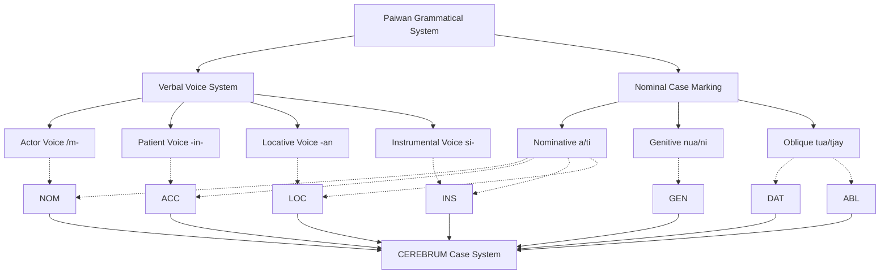
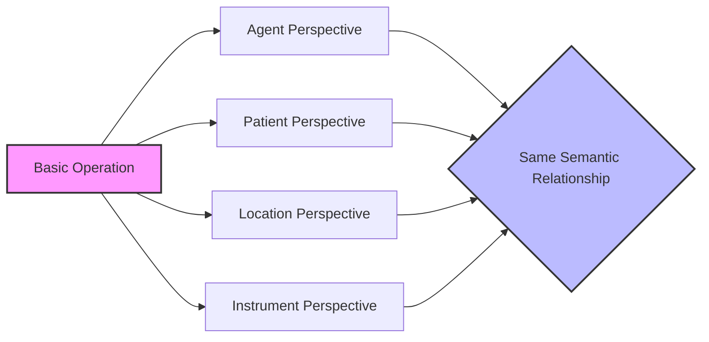
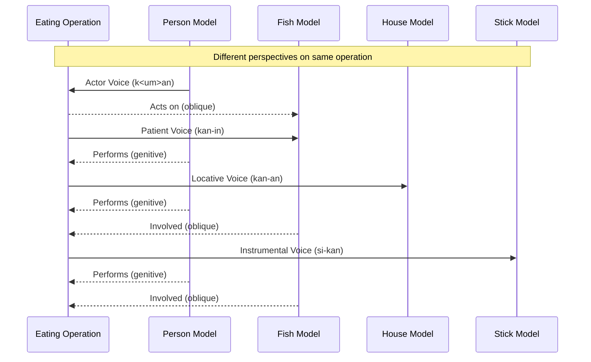

# Paiwan Case System and CEREBRUM Mapping

## Overview of Paiwan's Approach to Grammatical Relations

Paiwan, an Austronesian language indigenous to southern Taiwan, employs a sophisticated voice system and case-marking particles to express grammatical relationships. As one of the larger Formosan languages, Paiwan exemplifies the Philippine-type alignment system where verbal morphology indicates which argument is in focus (the "pivot"), while case markers show the semantic and syntactic roles of the participants. This integrated marking system provides an excellent model for CEREBRUM implementations, illustrating how grammatical relationships can be systematically encoded through both verbal operations and nominal markers working in concert.

In Paiwan, the focused argument (the pivot) receives a specific nominative case marker, while non-focused arguments are marked differently according to their semantic roles. The verbal voice morphology determines which semantic role is brought into focus, allowing the same event to be viewed from different participant perspectives without altering its basic semantics. This perspective-shifting system offers valuable insights for CEREBRUM implementations seeking to implement flexible, context-dependent operations across model ecosystems.

## Functional Equivalents to Cases in Paiwan

Paiwan employs the following markers and structures to express relationships that would be handled by cases in other languages:

1. **Voice/Focus Affixes on Verbs** - Indicate which argument is in focus
   - **\<um\>/m-** Actor Voice (AV): Focuses on the agent/actor
   - **-in-** Patient Voice (PV): Focuses on the patient/undergoer
   - **-an** Locative Voice (LV): Focuses on the location or direction
   - **si-** Instrumental Voice (IV): Focuses on the instrument or means

2. **Case Markers** - Function like case markers for noun phrases
   - **a/ti** - Nominative case markers for the focused argument (common/personal)
   - **nua/ni** - Genitive case markers for possessors and agents in non-actor voice (common/personal)
   - **tua/tjay** - Oblique case markers for non-focused, non-agent arguments (common/personal)

3. **Word Order** - Typically Verb-Subject-Object (VSO), but flexible based on discourse

4. **Noun Classes** - Some nouns have special status and receive distinct marking (e.g., personal names vs. common nouns)

5. **Aspect Marking** - Verbal morphology also encodes aspectual distinctions

## Mapping to CEREBRUM Cases

Paiwan's voice system and case markers can be mapped to CEREBRUM's eight standard cases as follows:

| CEREBRUM Case | Paiwan Equivalent | Implementation Notes |
|---------------|------------------|----------------------|
| **[NOM]** Nominative | Focused argument (a/ti) + Actor Voice verb (\<um\>/m-) | Models in [NOM] should implement focus marking with actor voice verbal operation |
| **[ACC]** Accusative | Focused argument (a/ti) + Patient Voice verb (-in-) | Models in [ACC] should implement focus marking with patient voice verbal operation |
| **[GEN]** Genitive | Non-focused agent in non-actor voice clauses (nua/ni) or possessive relation | Models in [GEN] should implement non-focused agent relation or possessive relation |
| **[DAT]** Dative | Focused argument (a/ti) + beneficiary role or oblique marking (tua/tjay) | Models in [DAT] should implement focus or oblique marking based on prominence |
| **[INS]** Instrumental | Focused argument (a/ti) + Instrumental Voice verb (si-) or oblique marking (tua/tjay) | Models in [INS] should implement focus or oblique marking based on prominence |
| **[LOC]** Locative | Focused argument (a/ti) + Locative Voice verb (-an) or oblique marking (tua/tjay) | Models in [LOC] should implement focus or oblique marking based on prominence |
| **[ABL]** Ablative | Oblique marking (tua/tjay) with appropriate directional verbs | Models in [ABL] should implement oblique marker with source semantics |
| **[VOC]** Vocative | Direct address, minimal or no specific marking | Models in [VOC] should implement direct address patterns |



## Unique Features

Paiwan's grammatical system offers several unique features relevant to CEREBRUM:

1. **Four-Voice System with Focus Alignment**
   
   Paiwan employs a four-voice system that allows different semantic roles to be brought into focus through verbal morphology. This provides a model for CEREBRUM implementations where operations can dynamically reassign prominence to different participating models.

   ```
   K<um>an a caucau tua vutjuq.
   <AV>eat NOM person OBL fish
   "The person eats fish." (Actor in focus)
   
   Kan-in nua caucau a vutjuq.
   eat-PV GEN person NOM fish
   "The person eats the fish." (Patient in focus)
   ```

   Both sentences describe the same event but differ in which participant is syntactically prominent.

2. **Social Status Distinction in Personal Markers**

   Paiwan society has a hierarchical structure, and this is reflected in how personal names are marked, with noble names receiving special markers. This provides a model for CEREBRUM to implement status-sensitive relationship marking.

   ```
   Markers for common nobles vs. ordinary personal names can differ
   ```

3. **Noun Class Distinction**

   Paiwan maintains distinctions between common nouns and personal names in its case-marking system. This provides a model for CEREBRUM to implement entity-type distinctions in its relationship marking.

   ```
   K<um>an ti Kalalu tua vutjuq.
   <AV>eat NOM.P Kalalu OBL fish
   "Kalalu eats fish."
   
   K<um>an a caucau tua vutjuq.
   <AV>eat NOM person OBL fish
   "The person eats fish."
   ```

   Note the different case markers: `ti` for the personal name "Kalalu" and `a` for the common noun "caucau" (person).

4. **Stative vs. Dynamic Verb Distinction**

   Paiwan encodes a clear distinction between stative and dynamic verbs through different morphological patterns. This provides a model for CEREBRUM to implement state-change awareness in its operations.

   ```
   Ma-qati a caucau. (Stative)
   STAT-hunger NOM person
   "The person is hungry."
   
   K<um>an a caucau. (Dynamic)
   <AV>eat NOM person
   "The person eats."
   ```

## Extension Opportunities

Paiwan's voice and case system suggests several extension opportunities for CEREBRUM:

1. **Perspective-Shifting Operation Architecture**
   
   Inspired by Paiwan's four-voice system, CEREBRUM could implement a perspective-shifting operation architecture where the same basic operation can be viewed from agent, patient, locative, and instrumental perspectives without altering the underlying relationship.

2. **Status-Sensitive Relationship Marking**
   
   Based on Paiwan's distinction between noble and ordinary personal names, CEREBRUM could implement status-sensitive relationship marking where interactions between models reflect hierarchical relationships and access privileges.

3. **Entity Type-Differentiated Processing**
   
   Drawing from Paiwan's distinction between common and personal nouns, CEREBRUM could implement entity type-differentiated processing where relationship patterns adapt based on the nature of the related entities.

4. **State-Change Aware Operations**
   
   Inspired by Paiwan's stative/dynamic verb distinction, CEREBRUM could implement state-change aware operations that explicitly encode whether an operation represents a state or a dynamic process.

5. **Hierarchy-Respecting Operations**
   
   Based on Paiwan's social hierarchy reflections in grammar, CEREBRUM could implement hierarchy-respecting operations that maintain awareness of relative status between interacting models.



## Example Sentences

Below are example sentences in Paiwan with their CEREBRUM parallels:

1. **Actor Voice [NOM]**

   **Paiwan:** K<um>an a caucau tua vutjuq.
   <AV>eat NOM person OBL fish
   "The person eats fish." (Actor in focus)
   
   **CEREBRUM:** Person_Model[NOM:AV] performs eating operation on Fish_Model[OBL].

2. **Patient Voice [ACC]**

   **Paiwan:** Kan-in nua caucau a vutjuq.
   eat-PV GEN person NOM fish
   "The person eats the fish." (Patient in focus)
   
   **CEREBRUM:** Fish_Model[ACC:PV] undergoes eating operation by Person_Model[GEN].

3. **Locative Voice [LOC]**

   **Paiwan:** Kan-an nua caucau a umaq.
   eat-LV GEN person NOM house
   "The person eats at the house." (Location in focus)
   
   **CEREBRUM:** House_Model[LOC:LV] hosts eating operation with Person_Model[GEN] as agent.

4. **Instrumental Voice [INS]**

   **Paiwan:** Si-kan nua caucau tua vutjuq a kasiw.
   IV-eat GEN person OBL fish NOM stick
   "The person eats fish with the stick." (Instrument in focus)
   
   **CEREBRUM:** Stick_Model[INS:IV] facilitates eating operation performed by Person_Model[GEN] on Fish_Model[OBL].

5. **Possession [GEN]**

   **Paiwan:** A umaq nua caucau
   NOM house GEN person
   "The person's house"
   
   **CEREBRUM:** House_Model is possessed by Person_Model[GEN].

6. **Stative Predicate**

   **Paiwan:** Ma-qati a caucau.
   STAT-hunger NOM person
   "The person is hungry."
   
   **CEREBRUM:** Person_Model[NOM:STAT] exists in hungry state without dynamic change.

7. **Directional [ABL]**

   **Paiwan:** S<em>ematacu a caucau tua umaq.
   <AV>come.from NOM person OBL house
   "The person comes from the house."
   
   **CEREBRUM:** Person_Model[NOM:AV] moves with House_Model[ABL] as source.

8. **Social Status Marking**

   **Paiwan:** K<um>an ti Kalalu tua vutjuq.
   <AV>eat NOM.P Kalalu OBL fish
   "Kalalu eats fish."
   
   **CEREBRUM:** Kalalu_Model[NOM:AV:HIGH_STATUS] performs eating operation on Fish_Model[OBL].



## Implications for CEREBRUM Design

Paiwan's voice system offers valuable insights for CEREBRUM implementations:

1. **Multi-Perspective Processing Architecture**
   
   CEREBRUM could implement a multi-perspective processing architecture where operations can be viewed from four distinct participant perspectives (agent, patient, locative, instrumental), enabling flexible framing of model relationships based on computational priorities.

2. **Hierarchical Status-Aware Relationships**
   
   Inspired by Paiwan's status-sensitive noun marking, CEREBRUM could implement hierarchical status-aware relationships where interactions between models are influenced by their relative status, potentially providing a foundation for access control and privilege management.

3. **State/Process Distinction**
   
   Based on Paiwan's stative/dynamic verb distinction, CEREBRUM could implement a fundamental state/process distinction where operations are explicitly categorized as either state descriptions or dynamic processes, enabling more nuanced temporal reasoning.

4. **Entity Class-Sensitive Processing**
   
   Drawing from Paiwan's noun class system, CEREBRUM could implement entity class-sensitive processing where different types of models receive specialized handling based on their inherent properties.

These Paiwan-inspired approaches would be particularly valuable for CEREBRUM implementations requiring perspective flexibility, status-sensitive operations, and clear state/process distinctions across model ecosystems. 