# Sámi Concepts and CEREBRUM Integration - Technical Figures

This document presents a series of Mermaid diagrams illustrating the connections between Sámi concepts and the CEREBRUM framework.

## Core Sámi Concepts Harmony

```mermaid
mindmap
  root((Sámi<br>Concepts))
    (Eana & Meahcci):::land
      (Land/Earth)
      (Wilderness)
      (Sacred places)
      (Biodiversity)
    (Siida):::community
      (Family group)
      (Communal structure)
      (Traditional governance)
    (Boazodoallu):::reindeer
      (Reindeer herding)
      (Migration patterns)
      (Traditional knowledge)
    (Árbediehtu):::knowledge
      (Traditional knowledge)
      (Intergenerational wisdom)
      (Ecological understanding)
    (Duodji):::craft
      (Traditional crafts)
      (Design)
      (Cultural expression)
    (Joik):::sound
      (Traditional song)
      (Soundscape)
      (Cultural memory)

classDef land fill:#8EA476,stroke:#5C754F,color:white
classDef community fill:#AE7FB6,stroke:#8B5894,color:white
classDef reindeer fill:#C19A6B,stroke:#8D6C4B,color:white 
classDef knowledge fill:#609CE1,stroke:#3E7BBD,color:white
classDef craft fill:#EAAA45,stroke:#BB872C,color:white
classDef sound fill:#F5CFA4,stroke:#D6AB7C,color:black
```

## The Essence of Eana (Land/Earth)

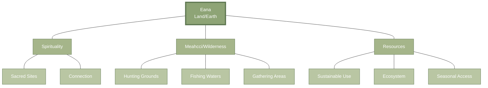

## Sámi Eight Seasons and Temporal Knowledge

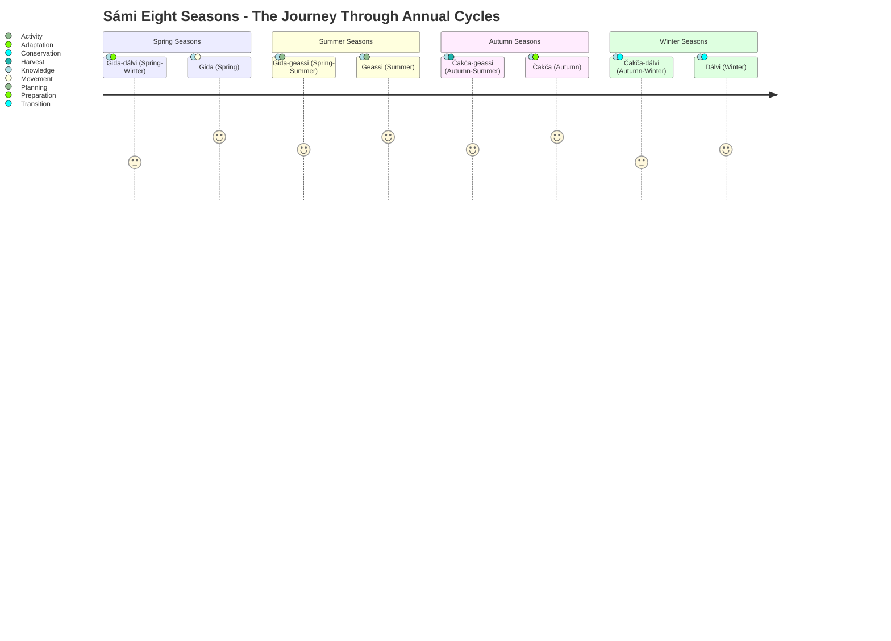

## Siida - The Sámi Community System

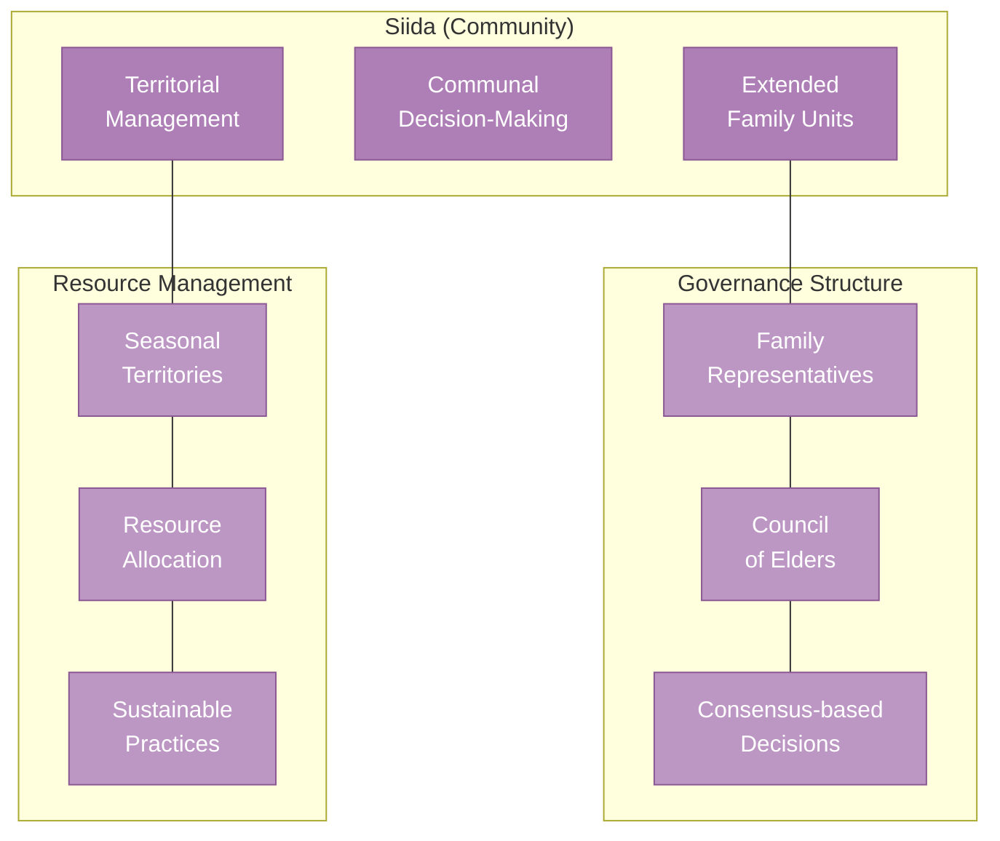

## Boazodoallu: Reindeer Herding Knowledge System

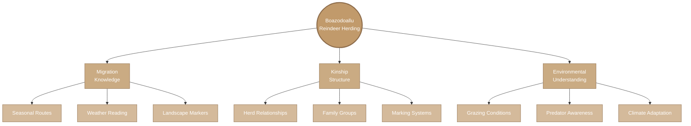

## Árbediehtu: Traditional Knowledge Transfer

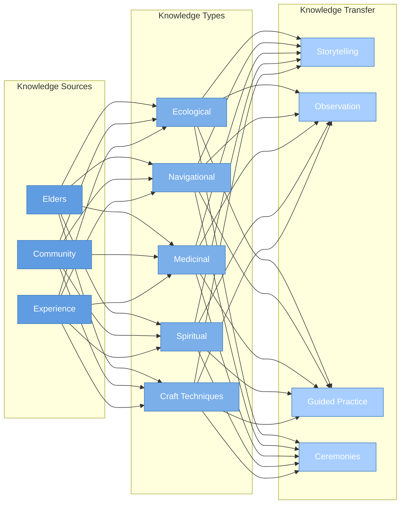

## Duodji: Sámi Handicraft as Embodied Knowledge

```mermaid
mindmap
    root((Duodji<br>Handicraft))
        (Materials):::materials
            (Reindeer Antler & Bone)
            (Wood/Birch)
            (Leather/Hide)
            (Plant fibers)
            (Wool/Textiles)
        (Techniques):::techniques
            (Carving)
            (Weaving)
            (Embroidery)
            (Leatherwork)
        (Functions):::functions
            (Practical Tools)
            (Clothing)
            (Containers)
            (Ceremonial Items)
        (Symbolism):::symbols
            (Cultural Markers)
            (Family Patterns)
            (Regional Identity)
            (Spiritual Significance)

    classDef materials fill:#EAAA45,stroke:#BB872C,color:white
    classDef techniques fill:#EDB868,stroke:#BB872C,color:white
    classDef functions fill:#F0C68A,stroke:#BB872C,color:black
    classDef symbols fill:#F4D6AD,stroke:#BB872C,color:black
```

## Sámi Language Family and Structure

```mermaid
graph TD
    SL[Sámi Languages]:::root --- NS[Northern Sámi]:::north
    SL --- ES[Eastern Sámi]:::east
    SL --- SS[Southern Sámi]:::south
    
    NS --- NS1[North Sámi]:::north1
    NS --- NS2[Lule Sámi]:::north1
    NS --- NS3[Pite Sámi]:::north1
    
    ES --- ES1[Inari Sámi]:::east1
    ES --- ES2[Skolt Sámi]:::east1
    ES --- ES3[Kildin Sámi]:::east1
    ES --- ES4[Ter Sámi]:::east1
    
    SS --- SS1[Ume Sámi]:::south1
    SS --- SS2[South Sámi]:::south1
    
    subgraph "Grammar Features"
        GF1[Case System]:::grammar
        GF2[Three Numbers<br>(Singular, Dual, Plural)]:::grammar
        GF3[Consonant Gradation]:::grammar
        GF4[Vowel Harmony]:::grammar
    end
    
    NS1 --- GF1 & GF2 & GF3 & GF4
    
    classDef root fill:#435F8F,stroke:#2E4065,color:white
    classDef north fill:#6A8CC0,stroke:#435F8F,color:white
    classDef east fill:#5F82B5,stroke:#435F8F,color:white
    classDef south fill:#5476A8,stroke:#435F8F,color:white
    classDef north1 fill:#8CA8D1,stroke:#435F8F,color:white
    classDef east1 fill:#8CA8D1,stroke:#435F8F,color:white
    classDef south1 fill:#8CA8D1,stroke:#435F8F,color:white
    classDef grammar fill:#A9BFE1,stroke:#435F8F,color:black
```

## Sámi-CEREBRUM Case Resonance

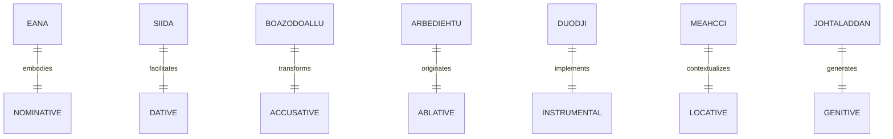

## Sámi Language Cases and CEREBRUM

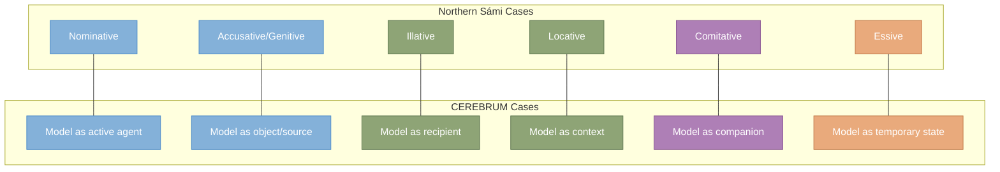

## The Eight Seasons Cycle and CEREBRUM State Transitions

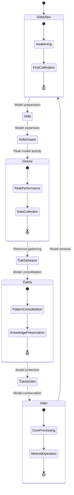

## Joik as Semiotic Model Transfer

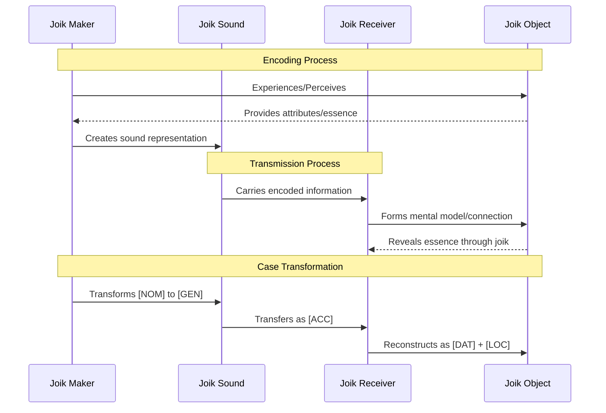

## Sámi Ecological Zonation and CEREBRUM Hierarchies

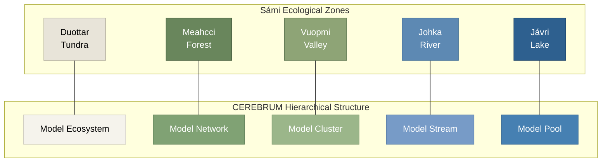

## Árbediehtu Knowledge Structure and CEREBRUM Case Mapping

```mermaid
erDiagram
    ARBEDIEHTU ||--|| KNOWLEDGE-SYSTEMS : encompasses
    
    ARBEDIEHTU {
        string guardianship "Cultural stewardship"
        string continuity "Intergenerational transfer"
        string adaptation "Environmental response"
    }
    
    KNOWLEDGE-SYSTEMS {
        string ecological "Environmental knowledge"
        string social "Community structures"
        string technological "Practical techniques"
        string spiritual "Cosmological understanding"
    }
    
    ECOLOGICAL-KNOWLEDGE ||--o{ NOMINATIVE-CASE : functions-as
    ECOLOGICAL-KNOWLEDGE {
        string seasons "Eight-season cycle"
        string animal_behavior "Wildlife patterns"
        string plant_knowledge "Flora utilization"
        string weather_reading "Climate prediction"
    }
    
    NOMINATIVE-CASE {
        string active_prediction "Generative model"
        string decision_process "Action selection"
        string adaptive_response "Environmental interaction"
    }
    
    SOCIAL-KNOWLEDGE ||--o{ DATIVE-CASE : functions-as
    SOCIAL-KNOWLEDGE {
        string siida_system "Community organization"
        string kinship "Family relationships"
        string conflict_resolution "Governance methods"
        string resource_sharing "Collective management"
    }
    
    DATIVE-CASE {
        string information_reception "Input processing"
        string resource_allocation "Distribution mechanisms"
        string benefit_reception "Value acquisition"
    }
    
    TECHNOLOGICAL-KNOWLEDGE ||--o{ INSTRUMENTAL-CASE : functions-as
    TECHNOLOGICAL-KNOWLEDGE {
        string duodji "Handicraft techniques"
        string shelter_building "Construction methods"
        string navigation "Wayfinding systems"
        string food_preservation "Storage methods"
    }
    
    INSTRUMENTAL-CASE {
        string method_implementation "Process execution"
        string tool_operation "Functional application"
        string technique_application "Procedural knowledge"
    }
    
    SPIRITUAL-KNOWLEDGE ||--o{ LOCATIVE-CASE : functions-as
    SPIRITUAL-KNOWLEDGE {
        string sacred_sites "Place-based spirituality"
        string ritual_practices "Ceremonial knowledge"
        string cosmology "World understanding"
        string healing_practices "Medicinal knowledge"
    }
    
    LOCATIVE-CASE {
        string contextual_framing "Environmental embedding"
        string situational_awareness "Locational intelligence"
        string boundary_definition "Spatial delineation"
    }
```

## Sámi Snow Terminology and Cognitive Model Precision

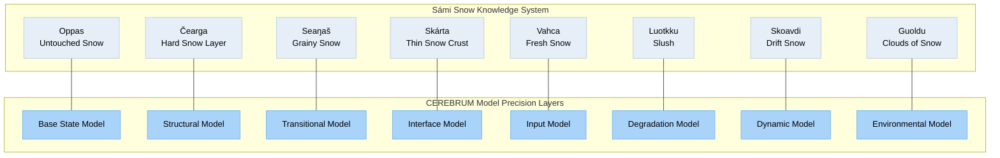

## Sámi Ecological Knowledge and Active Inference

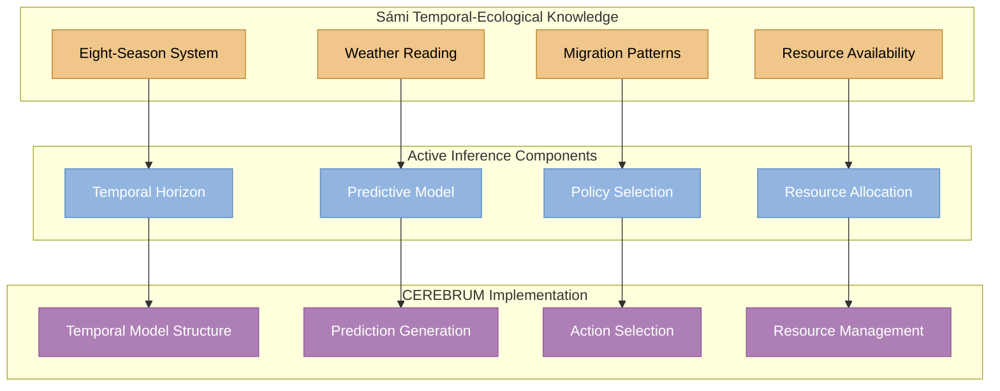

## Johtaladdan (Migration) Model in CEREBRUM

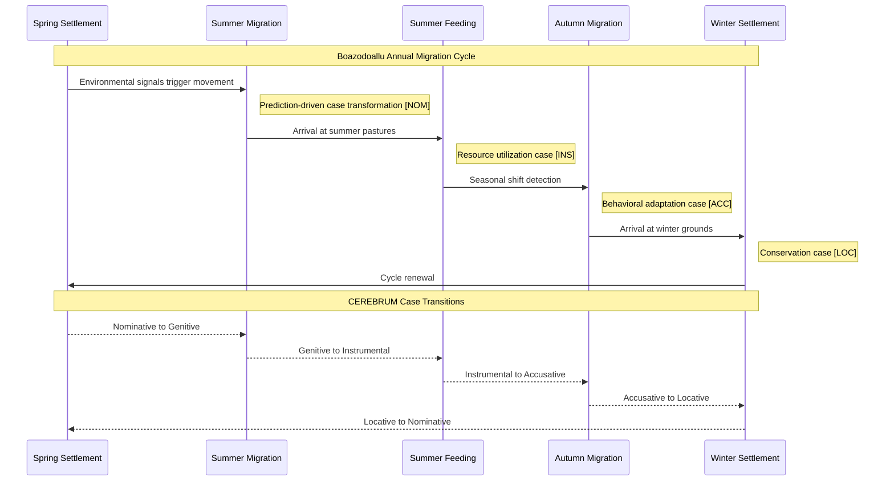

## Comprehensive Sámi-CEREBRUM Integration Matrix

```mermaid
graph TB
    %% Main concepts
    subgraph "Sámi Cultural Concepts"
        direction TB
        SC1[Eana & Meahcci<br>Land & Wilderness]:::sami1
        SC2[Siida<br>Community Structure]:::sami2
        SC3[Boazodoallu<br>Reindeer Herding]:::sami3
        SC4[Jahkodagat<br>Eight Seasons]:::sami4
        SC5[Arbediehtu<br>Traditional Knowledge]:::sami5
        SC6[Duodji<br>Handicraft]:::sami6
    end
    
    subgraph "CEREBRUM Framework"
        direction TB
        CF1[Case Structure<br>Syntactic Roles]:::cerebrum1
        CF2[Active Inference<br>Predictive Processing]:::cerebrum2
        CF3[Morphisms<br>Transformations]:::cerebrum3
        CF4[Free Energy<br>Optimization]:::cerebrum4
        CF5[Knowledge Transfer<br>Model Sharing]:::cerebrum5
        CF6[Implementation<br>Practical Application]:::cerebrum6
    end
    
    %% Detailed connections
    subgraph "Integration Points"
        direction TB
        %% Land and Case Structure
        IP1[Spatial Understanding<br>Place-Based Knowledge]:::detail
        IP2[Syntactic Roles<br>Functional Positioning]:::detail
        SC1 --> IP1
        CF1 --> IP2
        IP1 --- IP2
        
        %% Siida and Active Inference
        IP3[Collective Decision-Making<br>Social Coordination]:::detail
        IP4[Predictive Community Models<br>Policy Selection]:::detail
        SC2 --> IP3
        CF2 --> IP4
        IP3 --- IP4
        
        %% Reindeer Herding and Morphisms
        IP5[Migration Patterns<br>Seasonal Transformations]:::detail
        IP6[State Transitions<br>Case Transformations]:::detail
        SC3 --> IP5
        CF3 --> IP6
        IP5 --- IP6
        
        %% Eight Seasons and Free Energy
        IP7[Seasonal Adaptation<br>Resource Optimization]:::detail
        IP8[Energy Conservation<br>Predictive Efficiency]:::detail
        SC4 --> IP7
        CF4 --> IP8
        IP7 --- IP8
        
        %% Knowledge and Knowledge Transfer
        IP9[Intergenerational Learning<br>Cultural Continuity]:::detail
        IP10[Model Sharing<br>Knowledge Distribution]:::detail
        SC5 --> IP9
        CF5 --> IP10
        IP9 --- IP10
        
        %% Handicraft and Implementation
        IP11[Practical Techniques<br>Material Knowledge]:::detail
        IP12[Applied Methods<br>Functional Implementation]:::detail
        SC6 --> IP11
        CF6 --> IP12
        IP11 --- IP12
    end
    
    %% Style definitions
    classDef sami1 fill:#8EA476,stroke:#5C754F,color:white
    classDef sami2 fill:#AE7FB6,stroke:#8B5894,color:white
    classDef sami3 fill:#C19A6B,stroke:#8D6C4B,color:white
    classDef sami4 fill:#F0C68A,stroke:#BB872C,color:black
    classDef sami5 fill:#609CE1,stroke:#3E7BBD,color:white
    classDef sami6 fill:#EAAA45,stroke:#BB872C,color:white
    
    classDef cerebrum1 fill:#D42A2E,stroke:#8C1D1F,color:white
    classDef cerebrum2 fill:#E9967A,stroke:#BE7A62,color:black
    classDef cerebrum3 fill:#9C27B0,stroke:#7B1FA2,color:white
    classDef cerebrum4 fill:#FF6B6B,stroke:#CC5555,color:white
    classDef cerebrum5 fill:#6A5ACD,stroke:#483D8B,color:white
    classDef cerebrum6 fill:#4ECDC4,stroke:#3BA39B,color:white
    
    classDef detail fill:#A3CEF1,stroke:#6A8EB2,color:black
```

## Sámi Ecological Adaptation Cycle as Free Energy Minimization

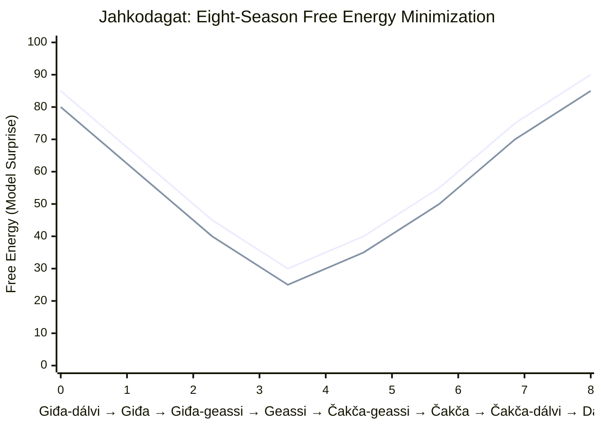

## Sámi Linguistic Features and CEREBRUM Case Implementation

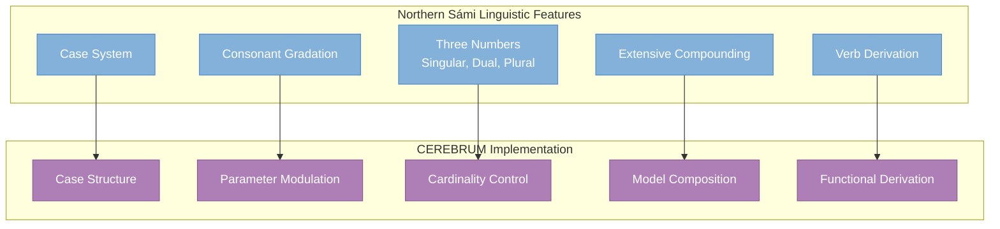

## Noaidi (Shamanic) Knowledge System and Model Transformations

```mermaid
graph TB
    subgraph "Noaidi Knowledge System"
        N1[Spiritual Navigation]:::noaidi
        N2[Divination]:::noaidi
        N3[Healing Practices]:::noaidi
        N4[Mediation Between Worlds]:::noaidi
        N5[Ritual Knowledge]:::noaidi
    end
    
    subgraph "CEREBRUM Case Transformations"
        T1[Nominative→Locative]:::trans
        T2[Locative→Ablative]:::trans
        T3[Instrumental→Dative]:::trans
        T4[Ablative→Dative]:::trans
        T5[Vocative→Nominative]:::trans
    end
    
    N1 --> T1
    N2 --> T2
    N3 --> T3
    N4 --> T4
    N5 --> T5
    
    subgraph "Functional Operations"
        F1[Environment Mapping]:::func
        F2[Source Identification]:::func
        F3[Remediation Transfer]:::func
        F4[Knowledge Translation]:::func
        F5[System Initialization]:::func
    end
    
    T1 --> F1
    T2 --> F2
    T3 --> F3
    T4 --> F4
    T5 --> F5
    
    classDef noaidi fill:#9A77B8,stroke:#774D96,color:white
    classDef trans fill:#E55354,stroke:#B6292A,color:white
    classDef func fill:#60C689,stroke:#37A363,color:white
```

## Sámi Landscape Reading and Markov Blanket Structures

```mermaid
erDiagram
    LANDSCAPE-READING ||--|| MARKOV-BLANKET : implements
    
    LANDSCAPE-READING {
        string meahcci "Forest/wilderness reading"
        string duottar "Tundra reading"
        string johka "River reading"
        string jávri "Lake reading"
        string várri "Mountain reading"
    }
    
    MARKOV-BLANKET {
        string perception "Environmental sensing"
        string boundary "Interface definition"
        string internal_model "Knowledge representation"
        string action "Response generation"
    }
    
    MEAHCCI-READING ||--o{ PERCEPTION : informs
    MEAHCCI-READING {
        string animal_tracks "Wildlife presence"
        string plant_conditions "Resource availability"
        string forest_density "Navigability assessment"
        string sound_patterns "Ecological indicators"
    }
    
    PERCEPTION {
        string environmental_sensors "Input channels"
        string pattern_recognition "Feature detection"
        string predictive_sensing "Anticipatory detection"
    }
    
    VÁRRI-READING ||--o{ BOUNDARY : defines
    VÁRRI-READING {
        string elevation_indicators "Height assessment"
        string geological_features "Formation types"
        string weather_patterns "Climate indicators"
        string visibility_factors "Viewshed assessment"
    }
    
    BOUNDARY {
        string interface_definition "System boundaries"
        string information_filtering "Selective perception"
        string causal_separation "Domain partitioning"
    }
    
    JOHKA-READING ||--o{ ACTION : guides
    JOHKA-READING {
        string flow_patterns "Current assessment"
        string crossing_points "Traversability"
        string fish_populations "Resource indicators"
        string seasonal_changes "Temporal variations"
    }
    
    ACTION {
        string policy_selection "Decision-making"
        string resource_engagement "Utilization patterns"
        string movement_planning "Navigation strategy"
    }
    
    DUOTTAR-READING ||--o{ INTERNAL-MODEL : structures
    DUOTTAR-READING {
        string snow_conditions "Surface assessment"
        string vegetation_patterns "Resource mapping"
        string terrain_features "Topographical knowledge"
        string exposure_factors "Safety assessment"
    }
    
    INTERNAL-MODEL {
        string belief_states "Knowledge representation"
        string causal_models "Relationship mapping"
        string predictive_frameworks "Forecasting capacity"
    }
```

## Sámi Color Terminology and Perceptual Precision

```mermaid
pie
    title "Sámi Specialized Color Systems"
    "Reindeer Coat Colors" : 35
    "Snow/Ice Conditions" : 25
    "Landscape Features" : 20
    "Sky/Weather Indicators" : 15
    "Seasonal Plant Changes" : 5
```

## Ecological Knowledge Systems and CEREBRUM Case Frameworks

```mermaid
flowchart TD
    subgraph "Sámi Environmental Knowledge Domains"
        EK1[Guohtun<br>Grazing Conditions]:::ecology1
        EK2[Muohta<br>Snow Knowledge]:::ecology2
        EK3[Bivdu<br>Hunting Knowledge]:::ecology3
        EK4[Meahcásteapmi<br>Gathering Knowledge]:::ecology4
        EK5[Guolásteapmi<br>Fishing Knowledge]:::ecology5
    end

    subgraph "CEREBRUM Case Applications"
        CA1[Nominative<br>Active Prediction]:::case1
        CA2[Instrumental<br>Method Implementation]:::case2
        CA3[Accusative<br>Target Identification]:::case3
        CA4[Genitive<br>Resource Generation]:::case4
        CA5[Locative<br>Context Establishment]:::case5
    end

    EK1 --> CA1
    EK2 --> CA2
    EK3 --> CA3
    EK4 --> CA4
    EK5 --> CA5

    subgraph "Active Inference Implementation"
        AI1[Predictive Models]:::ai1
        AI2[Method Selection]:::ai2
        AI3[Bayesian Updating]:::ai3
        AI4[Resource Models]:::ai4
        AI5[Context Models]:::ai5
    end

    CA1 --> AI1
    CA2 --> AI2
    CA3 --> AI3
    CA4 --> AI4
    CA5 --> AI5

    classDef ecology1 fill:#8EA476,stroke:#5C754F,color:white
    classDef ecology2 fill:#E6EFF8,stroke:#B3C9DD,color:black
    classDef ecology3 fill:#C19A6B,stroke:#8D6C4B,color:white
    classDef ecology4 fill:#A9D3F9,stroke:#65AFEC,color:black
    classDef ecology5 fill:#5D89B3,stroke:#3E6C95,color:white

    classDef case1 fill:#D42A2E,stroke:#8C1D1F,color:white
    classDef case2 fill:#4ECDC4,stroke:#3BA39B,color:white
    classDef case3 fill:#F4A261,stroke:#D47A39,color:black
    classDef case4 fill:#E76F51,stroke:#BC3F23,color:white
    classDef case5 fill:#4682B4,stroke:#1E5599,color:white

    classDef ai1 fill:#FF6B6B,stroke:#CC5555,color:white
    classDef ai2 fill:#80FFDB,stroke:#57D9B7,color:black
    classDef ai3 fill:#FFB347,stroke:#CC7A00,color:black
    classDef ai4 fill:#FF7F50,stroke:#FF6347,color:white
    classDef ai5 fill:#6A8CC0,stroke:#435F8F,color:white
```

## Reindeer Terminology and Morphological Cases

```mermaid
graph TB
    subgraph "Reindeer Classification System"
        R1[Miessi<br>Calf]:::rcalf
        R2[Čearpmat<br>Young Buck]:::ryoung
        R3[Varit<br>Young Doe]:::ryoung
        R4[Vuobis<br>Male 3-5 yrs]:::rmale
        R5[Gottas<br>Male 5-6 yrs]:::rmale
        R6[Nammaláhpat<br>Male 6-7 yrs]:::rmale
        R7[Máhkan<br>Old Buck]:::rold
        R8[Áldu<br>Breeding Female]:::rfemale
        R9[Rotnu<br>Barren Female]:::rfemale
    end

    subgraph "Morphological Case Integration"
        C1[Nominative<br>Primary Agent]:::cnominative
        C2[Accusative<br>Action Target]:::caccusative
        C3[Genitive<br>Resource Source]:::cgenitive
        C4[Illative<br>Goal Direction]:::cillative
        C5[Locative<br>State Context]:::clocative
        C6[Comitative<br>Accompaniment]:::ccomitative
    end

    R1 --> C1
    R2 & R3 --> C4
    R4 & R5 & R6 --> C3 & C6
    R7 --> C5
    R8 --> C1 & C3
    R9 --> C2

    subgraph "CEREBRUM Application"
        A1[Model as Agent]:::amodel
        A2[Model as Target]:::amodel
        A3[Model as Source]:::amodel
        A4[Model as Goal]:::amodel
        A5[Model as Context]:::amodel
        A6[Model as Companion]:::amodel
    end

    C1 --- A1
    C2 --- A2
    C3 --- A3
    C4 --- A4
    C5 --- A5
    C6 --- A6

    classDef rcalf fill:#F9E79F,stroke:#C4B454,color:black
    classDef ryoung fill:#F0C68A,stroke:#BB872C,color:black
    classDef rmale fill:#C19A6B,stroke:#8D6C4B,color:white
    classDef rold fill:#8D6C4B,stroke:#634B34,color:white
    classDef rfemale fill:#D4BA9B,stroke:#8D6C4B,color:black

    classDef cnominative fill:#D42A2E,stroke:#8C1D1F,color:white
    classDef caccusative fill:#F4A261,stroke:#D47A39,color:black
    classDef cgenitive fill:#E76F51,stroke:#BC3F23,color:white
    classDef cillative fill:#2A9D8F,stroke:#176D63,color:white
    classDef clocative fill:#4682B4,stroke:#1E5599,color:white
    classDef ccomitative fill:#9A77B8,stroke:#774D96,color:white

    classDef amodel fill:#A3CEF1,stroke:#6A8EB2,color:black
```

## Sámi Wind Knowledge and Model Precision

```mermaid
quadrantChart
    title Sámi Wind Knowledge and CEREBRUM Precision Weighting
    x-axis Low Predictability --> High Predictability
    y-axis Low Impact --> High Impact
    quadrant-1 Significant but Unpredictable
    quadrant-2 Critical Knowledge (High Precision)
    quadrant-3 Low Priority Knowledge
    quadrant-4 Reliable Constant
    "Davvi/North Wind": [0.8, 0.7]
    "Lulli/South Wind": [0.6, 0.5]
    "Oarji/West Wind": [0.7, 0.8]
    "Nuortti/East Wind": [0.5, 0.6]
    "Gárasj/Strong Squall": [0.3, 0.9]
    "Biegga/General Wind": [0.6, 0.4]
    "CEREBRUM Precision Weighting": [0.7, 0.7]
    "Active Inference Prediction": [0.8, 0.8]
```

## Sacred Sites (Sieiddit) and Model Locative Case

```mermaid
mindmap
    root((Sieiddit<br>Sacred Sites))
        (Geographical Types):::types
            (Várri/Mountain Sites)
            (Geađgi/Stone Formations)
            (Jávri/Lake Sites)
            (Suolo/Island Sites)
        (Functional Roles):::roles
            (Offering Places)
            (Ritual Locations)
            (Boundary Markers)
            (Knowledge Repositories)
        (Model Integration):::models
            (Locative Case Anchors)
            (Boundary Definitions)
            (Context Providers)
            (Spatial Reference Points)
        (Knowledge Systems):::knowledge
            (Inter-Generational Transfer)
            (Environmental Association)
            (Spiritual Navigation)
            (Cultural Memory)

    classDef types fill:#8EA476,stroke:#5C754F,color:white
    classDef roles fill:#AE7FB6,stroke:#8B5894,color:white
    classDef models fill:#609CE1,stroke:#3E7BBD,color:white
    classDef knowledge fill:#EAAA45,stroke:#BB872C,color:white
```

## Sámi Environmental Transition Knowledge and Markov Blankets

```mermaid
graph LR
    subgraph "Environmental Transitions"
        ET1[Gaskavahkku<br>Transition Periods]:::transition
        ET2[Mearragátti<br>Coastal-Inland]:::transition
        ET3[Duottar-Vuovdi<br>Tundra-Forest]:::transition
        ET4[Jiekŋa-Čáhci<br>Ice-Water]:::transition
    end
    
    subgraph "Markov Blanket Components"
        MB1[Boundary State]:::blanket
        MB2[Sensory State]:::blanket
        MB3[Active State]:::blanket
        MB4[Internal State]:::blanket
    end
    
    ET1 --> MB1 & MB3
    ET2 --> MB1 & MB2
    ET3 --> MB2 & MB4
    ET4 --> MB3 & MB4
    
    subgraph "CEREBRUM Implementation"
        CI1[Interface Definition]:::implementation
        CI2[Information Filtering]:::implementation
        CI3[Action Selection]:::implementation
        CI4[Belief Updating]:::implementation
    end
    
    MB1 --> CI1
    MB2 --> CI2
    MB3 --> CI3
    MB4 --> CI4
    
    classDef transition fill:#A9D3F9,stroke:#65AFEC,color:black
    classDef blanket fill:#FFCF96,stroke:#FFAD5B,color:black
    classDef implementation fill:#9C27B0,stroke:#7B1FA2,color:white
```

## Sámi River Knowledge and Flow-Based Case Structure

```mermaid
flowchart TB
    subgraph "River Knowledge System"
        J1[Johka<br>River]:::river0
        
        subgraph "Physical Components"
            J2[Gohppi<br>Deep Pool]:::river1
            J3[Njabbi<br>Long Pool]:::river1
            J4[Čázádat<br>Current]:::river1
            J5[Bavttat<br>Rapids]:::river1
            J6[Gorži<br>Waterfall]:::river1
        end
        
        subgraph "Navigation Knowledge"
            N1[Crossing Points]:::river2
            N2[Ice Conditions]:::river2
            N3[Seasonal Changes]:::river2
            N4[Fishing Locations]:::river2
        end
    end
    
    subgraph "CEREBRUM Case Structure"
        C1[Container<br>Locative Case]:::case1
        C2[Source<br>Ablative Case]:::case2
        C3[Path<br>Instrumental Case]:::case3
        C4[Destination<br>Illative Case]:::case4
    end
    
    J2 & J3 --> C1
    J4 --> C3
    J5 & J6 --> C2
    N1 & N4 --> C4
    
    subgraph "Implementation"
        I1[Context Models]:::impl1
        I2[Origin Models]:::impl2
        I3[Process Models]:::impl3
        I4[Target Models]:::impl4
    end
    
    C1 --> I1
    C2 --> I2
    C3 --> I3
    C4 --> I4

    classDef river0 fill:#5D89B3,stroke:#3E6C95,color:white
    classDef river1 fill:#779BC7,stroke:#5D81AB,color:white
    classDef river2 fill:#A9D3F9,stroke:#65AFEC,color:black
    
    classDef case1 fill:#4682B4,stroke:#1E5599,color:white
    classDef case2 fill:#9A77B8,stroke:#774D96,color:white
    classDef case3 fill:#4ECDC4,stroke:#3BA39B,color:white
    classDef case4 fill:#2A9D8F,stroke:#176D63,color:white
    
    classDef impl1 fill:#6A8CC0,stroke:#435F8F,color:white
    classDef impl2 fill:#AE7FB6,stroke:#8B5894,color:white
    classDef impl3 fill:#80FFDB,stroke:#57D9B7,color:black
    classDef impl4 fill:#06D6A0,stroke:#04A57B,color:white
```

## Plant Knowledge and Genitive Case Function

```mermaid
erDiagram
    PLANT-KNOWLEDGE ||--|| GENITIVE-CASE : implements
    
    PLANT-KNOWLEDGE {
        string medicinal "Healing properties"
        string nutritional "Food sources"
        string material "Craft resources"
        string indicator "Environmental signals"
        string seasonal "Temporal markers"
    }
    
    GENITIVE-CASE {
        string source_function "Origin of information"
        string production "Resource generation"
        string possession "Knowledge ownership"
        string derivation "Knowledge lineage"
    }
    
    MEDICINAL-PLANTS ||--o{ SOURCE-FUNCTION : categorized-as
    MEDICINAL-PLANTS {
        string rievssatmuorji "Alpinebearer"
        string boska "Angelica"
        string juopmu "Wild garlic"
        string cáhppesmuorji "Crowberry"
        string sarat "Sedges"
    }
    
    SOURCE-FUNCTION {
        string healing_source "Medicinal generation"
        string knowledge_origin "Traditional source"
        string practice_basis "Treatment foundation"
    }
    
    NUTRITIONAL-PLANTS ||--o{ PRODUCTION : categorized-as
    NUTRITIONAL-PLANTS {
        string luomi "Cloudberry"
        string jonjat "Lingonberry"
        string sarrit "Blueberry"
        string jieknjat "Cranberry"
        string visttit "Wild roots"
    }
    
    PRODUCTION {
        string food_generation "Nutritional output"
        string seasonal_yield "Temporal production"
        string sustainable_harvest "Resource management"
    }
    
    MATERIAL-PLANTS ||--o{ POSSESSION : categorized-as
    MATERIAL-PLANTS {
        string soahki "Birch"
        string beahci "Pine"
        string guossa "Spruce"
        string leavga "Sallow/Willow"
        string sissat "Fireweed"
    }
    
    POSSESSION {
        string resource_ownership "Usage rights"
        string territorial_association "Place-based knowledge"
        string community_sharing "Distributed possession"
    }
    
    INDICATOR-PLANTS ||--o{ DERIVATION : categorized-as
    INDICATOR-PLANTS {
        string suoidni "Grass types"
        string jeagil "Lichen species"
        string samil "Moss varieties"
        string muorra_lasta "Tree leaves"
        string vuovdegearddit "Forest layers"
    }
    
    DERIVATION {
        string knowledge_lineage "Information source"
        string historical_context "Temporal relevance"
        string predictive_basis "Forecasting foundation"
    }
```

## Animal Behavior Knowledge and Active Inference

```mermaid
stateDiagram-v2
    [*] --> ObservationState
    
    ObservationState --> PredictionState: Pattern recognition
    PredictionState --> ActionState: Decision making
    ActionState --> ValidationState: Implementation
    ValidationState --> ObservationState: Feedback loop
    
    state ObservationState {
        [*] --> WildlifeTracking
        WildlifeTracking --> BehavioralAnalysis
        BehavioralAnalysis --> [*]
        
        note right of WildlifeTracking
            NOMINATIVE CASE
            Animal behavior as active agent
            Primary knowledge source
        end note
    }
    
    state PredictionState {
        [*] --> ForecastGeneration
        ForecastGeneration --> ResourceAllocation
        ResourceAllocation --> [*]
        
        note right of ForecastGeneration
            GENITIVE CASE
            Animal behavior as knowledge source
            Generating predictive models
        end note
    }
    
    state ActionState {
        [*] --> HuntingStrategy
        HuntingStrategy --> MovementPlanning
        MovementPlanning --> [*]
        
        note right of HuntingStrategy
            INSTRUMENTAL CASE
            Animal knowledge as method
            Tool for survival action
        end note
    }
    
    state ValidationState {
        [*] --> OutcomeAssessment
        OutcomeAssessment --> KnowledgeRefinement
        KnowledgeRefinement --> [*]
        
        note right of OutcomeAssessment
            ACCUSATIVE CASE
            Knowledge as object of refinement
            Target of updating process
        end note
    }
```

## Sámi Weather Reading System and Precision-Weighted Inference

```mermaid
graph TB
    subgraph "Weather Reading Knowledge"
        W1[Albmi<br>Sky Patterns]:::weather1
        W2[Balvvit<br>Cloud Formations]:::weather2
        W3[Biegga<br>Wind Behaviors]:::weather3
        W4[Arvi/Muohta<br>Precipitation Types]:::weather4
        W5[Temperatuvra<br>Temperature Indicators]:::weather5
    end

    subgraph "Predictive Timeframes"
        T1[Immediate<br>< 1 hour]:::time1
        T2[Short-term<br>1-12 hours]:::time2
        T3[Medium-term<br>12-48 hours]:::time3
        T4[Long-term<br>Seasonal indicators]:::time4
    end

    W1 --> T1 & T2
    W2 --> T2 & T3
    W3 --> T1 & T2 & T3
    W4 --> T2 & T3
    W5 --> T3 & T4

    subgraph "CEREBRUM Precision Weighting"
        P1[Critical Precision<br>High Priority]:::prec1
        P2[Standard Precision<br>Medium Priority]:::prec2
        P3[Background Precision<br>Low Priority]:::prec3
    end

    T1 --> P1
    T2 --> P1
    T3 --> P2
    T4 --> P3

    subgraph "Active Inference Implementation"
        AI1[Immediate Response<br>High Learning Rate]:::ai1
        AI2[Tactical Planning<br>Medium Learning Rate]:::ai2
        AI3[Strategic Planning<br>Low Learning Rate]:::ai3
    end

    P1 --> AI1
    P2 --> AI2
    P3 --> AI3

    classDef weather1 fill:#A5B1C2,stroke:#697786,color:white
    classDef weather2 fill:#D9E3F0,stroke:#A5B1C2,color:black
    classDef weather3 fill:#87CEEB,stroke:#5DA8DC,color:white
    classDef weather4 fill:#B0DBE3,stroke:#7BB2BD,color:black
    classDef weather5 fill:#FF9AA2,stroke:#E56D77,color:white

    classDef time1 fill:#FFB347,stroke:#CC7A00,color:black
    classDef time2 fill:#FFCC80,stroke:#CDA066,color:black
    classDef time3 fill:#FFE0B2,stroke:#CCB38E,color:black
    classDef time4 fill:#FFF3E0,stroke:#CCB38E,color:black

    classDef prec1 fill:#FF6B6B,stroke:#CC5555,color:white
    classDef prec2 fill:#FF9AA2,stroke:#CC7A82,color:white
    classDef prec3 fill:#FFCDD2,stroke:#CCA4A8,color:black

    classDef ai1 fill:#9C27B0,stroke:#7B1FA2,color:white
    classDef ai2 fill:#BA68C8,stroke:#9951A0,color:white
    classDef ai3 fill:#E1BEE7,stroke:#B498BC,color:black
``` 