# Sanskrit Case System and CEREBRUM Mapping

Sanskrit, one of the oldest documented members of the Indo-European language family, possesses an elaborate and systematic case structure that provides deep insights into grammatical relations. This document examines the relationship between Sanskrit's rich case system and CEREBRUM's computational case framework.

## 1. Overview of Sanskrit Case System

Sanskrit features eight grammatical cases (vibhakti) that meticulously define the relationships between nouns and other elements in a sentence. Known for its systematic and comprehensive approach to grammar, formalized by Pāṇini in the 4th century BCE, Sanskrit's case structure serves as an excellent exemplar for understanding CEREBRUM's case-based approach to cognitive models.

Sanskrit's case system is particularly notable for its:
- Complete differentiation of instrumental, locative, and ablative functions
- Distinct dative case for recipients and beneficiaries
- Comprehensive rules for case transformations and sandhi (sound changes at word boundaries)
- Philosophical exploration of the case relationships in traditional vyākaraṇa (grammar) texts

## 2. Sanskrit Case Inventory

In Sanskrit, the eight cases (aṣṭau vibhaktayaḥ) are:

| № | Sanskrit Case Name | Western Equivalent | Primary Function | Example (Singular) |
|---|-------------------|-------------------|-------------------|-------------------|
| 1 | **Prathamā** | Nominative | Subject; predicate noun | देवः (devaḥ) "god" |
| 2 | **Dvitīyā** | Accusative | Direct object; goal of motion | देवम् (devam) "god" |
| 3 | **Tṛtīyā** | Instrumental | Instrument; means; accompaniment | देवेन (devena) "by/with a god" |
| 4 | **Caturthī** | Dative | Indirect object; purpose; beneficiary | देवाय (devāya) "for/to a god" |
| 5 | **Pañcamī** | Ablative | Source; cause; comparison | देवात् (devāt) "from a god" |
| 6 | **Ṣaṣṭhī** | Genitive | Possession; relation | देवस्य (devasya) "of a god" |
| 7 | **Saptamī** | Locative | Location in space or time | देवे (deve) "in/on a god" |
| 8 | **Sambodhana** | Vocative | Direct address | देव (deva) "O god!" |

### Example Paradigm: Complete Declension of "Deva" (God)

| Case | Sanskrit Term | Singular | Dual | Plural |
|------|--------------|----------|------|--------|
| **Nominative** | Prathamā | देवः (devaḥ) | देवौ (devau) | देवाः (devāḥ) |
| **Accusative** | Dvitīyā | देवम् (devam) | देवौ (devau) | देवान् (devān) |
| **Instrumental** | Tṛtīyā | देवेन (devena) | देवाभ्याम् (devābhyām) | देवैः (devaiḥ) |
| **Dative** | Caturthī | देवाय (devāya) | देवाभ्याम् (devābhyām) | देवेभ्यः (devebhyaḥ) |
| **Ablative** | Pañcamī | देवात् (devāt) | देवाभ्याम् (devābhyām) | देवेभ्यः (devebhyaḥ) |
| **Genitive** | Ṣaṣṭhī | देवस्य (devasya) | देवयोः (devayoḥ) | देवानाम् (devānām) |
| **Locative** | Saptamī | देवे (deve) | देवयोः (devayoḥ) | देवेषु (deveṣu) |
| **Vocative** | Sambodhana | देव (deva) | देवौ (devau) | देवाः (devāḥ) |

## 3. Mapping CEREBRUM Cases to Sanskrit Cases

### Direct Correspondences

| CEREBRUM Case | Sanskrit Case | Sanskrit Term | Correspondence Strength | Functional Alignment |
|---------------|--------------|---------------|------------------------|---------------------|
| **Nominative [NOM]** | Nominative | Prathamā | Strong | Both mark the primary agent; main actor in a system |
| **Accusative [ACC]** | Accusative | Dvitīyā | Strong | Both mark the object of action; entity receiving transformation |
| **Instrumental [INS]** | Instrumental | Tṛtīyā | Strong | Both mark the means/method; entity through which action occurs |
| **Dative [DAT]** | Dative | Caturthī | Strong | Both mark recipients; entity receiving benefit or data |
| **Ablative [ABL]** | Ablative | Pañcamī | Strong | Both mark origin/cause; source of derivation |
| **Genitive [GEN]** | Genitive | Ṣaṣṭhī | Strong | Both mark possession/source; entity from which something derives |
| **Locative [LOC]** | Locative | Saptamī | Strong | Both mark location/context; situational environment |
| **Vocative [VOC]** | Vocative | Sambodhana | Strong | Both mark direct address; entity being called upon |

### Detailed Function Comparison

| Function | CEREBRUM Implementation | Sanskrit Implementation | Notes |
|----------|------------------------|-------------------------|-------|
| **Active agency** | Nominative case [NOM] marks model as active agent producing predictions | Prathamā (Nominative) marks the kartā (agent/doer) | Direct parallel in agency function; central to both systems |
| **Object of process** | Accusative case [ACC] marks model receiving updates/transformations | Dvitīyā (Accusative) marks the karma (object/patient) of action | Conceptual alignment in receiving action |
| **Method/tool** | Instrumental case [INS] marks model serving as tool/method | Tṛtīyā (Instrumental) marks the karaṇa (instrument) of action | Perfect alignment; both systems have dedicated instrumental case |
| **Recipient** | Dative case [DAT] marks model receiving data flows | Caturthī (Dative) marks the sampradāna (recipient) of action | Direct parallel in recipient function |
| **Origin/source** | Ablative case [ABL] marks model as origin of historical data | Pañcamī (Ablative) marks the apādāna (source) of action | Strong alignment in source/origin function |
| **Production/source** | Genitive case [GEN] marks model generating outputs | Ṣaṣṭhī (Genitive) marks sambandha (relation/connection) | Alignment in source/relation function |
| **Context/location** | Locative case [LOC] marks model providing contextual parameters | Saptamī (Locative) marks the adhikaraṇa (location/context) | Strong alignment in contextual function |
| **Addressable interface** | Vocative case [VOC] marks directly callable interface | Sambodhana (Vocative) marks direct address | Direct parallel in address function |

## 4. Kāraka Theory and CEREBRUM

Sanskrit grammar includes a sophisticated theory of kārakas (factors of action), which provides additional insights for CEREBRUM:

| Sanskrit Kāraka | Typical Case | CEREBRUM Parallel | Implementation Insight |
|-----------------|--------------|-------------------|------------------------|
| **Kartā** (agent) | Nominative | Nominative [NOM] | Primary predictive agent in system |
| **Karma** (patient/object) | Accusative | Accusative [ACC] | Target of optimization/updates |
| **Karaṇa** (instrument) | Instrumental | Instrumental [INS] | Method implementation |
| **Sampradāna** (recipient) | Dative | Dative [DAT] | Data flow recipient |
| **Apādāna** (source) | Ablative | Ablative [ABL] | Historical data source |
| **Adhikaraṇa** (location) | Locative | Locative [LOC] | Context provider |

Kāraka theory distinguishes between semantic roles and their grammatical expressions, providing a framework that aligns with CEREBRUM's separation of model function from implementation details.

## 5. Example Sentences with Case Mappings

### Sanskrit Examples with CEREBRUM Parallels

| Sanskrit Sentence | Transliteration | Translation | Case Usage | CEREBRUM Parallel |
|-------------------|----------------|-------------|------------|-------------------|
| **रामः** फलं खादति | **Rāmaḥ** phalaṃ khādati | "Rama eats the fruit." | Rāmaḥ = Nominative (agent) | Model[NOM] actively generating predictions |
| रामः **फलं** खादति | Rāmaḥ **phalaṃ** khādati | "Rama eats the fruit." | phalaṃ = Accusative (object) | Model[ACC] receiving updates/optimization |
| रामः **हस्तेन** फलं खादति | Rāmaḥ **hastena** phalaṃ khādati | "Rama eats the fruit with his hand." | hastena = Instrumental (means) | Model[INS] serving as computational method |
| रामः **सीतायै** फलं यच्छति | Rāmaḥ **Sītāyai** phalaṃ yacchati | "Rama gives the fruit to Sita." | Sītāyai = Dative (recipient) | Model[DAT] receiving data inputs |
| रामः **वृक्षात्** फलं गृह्णाति | Rāmaḥ **vṛkṣāt** phalaṃ gṛhṇāti | "Rama takes the fruit from the tree." | vṛkṣāt = Ablative (source) | Model[ABL] serving as data source |
| **रामस्य** फलम् | **Rāmasya** phalam | "Rama's fruit." | Rāmasya = Genitive (possession) | Model[GEN] generating artifacts/outputs |
| रामः **वने** वसति | Rāmaḥ **vane** vasati | "Rama lives in the forest." | vane = Locative (location) | Model[LOC] providing environmental context |
| **राम**, अत्र आगच्छ | **Rāma**, atra āgaccha | "Rama, come here!" | Rāma = Vocative (address) | Model[VOC] as directly addressable interface |

### Computational Implementation Examples

```python
# Nominative (agent) - like Sanskrit kartā "Rāmaḥ" in "Rāmaḥ phalaṃ khādati"
nlp_model[NOM].generate_text(prompt)  # Model actively generating output

# Accusative (object) - like Sanskrit karma "phalaṃ" in "Rāmaḥ phalaṃ khādati"
nlp_model[ACC].fine_tune(training_data)  # Model receiving optimization

# Instrumental (means) - like Sanskrit karaṇa "hastena" in "Rāmaḥ hastena phalaṃ khādati"
result = nlp_model[INS].process_text(input_text)  # Model used as computational tool

# Dative (recipient) - like Sanskrit sampradāna "Sītāyai" in "Rāmaḥ Sītāyai phalaṃ yacchati"
nlp_model[DAT].receive_embedding(vector_input)  # Model receives data

# Ablative (source) - like Sanskrit apādāna "vṛkṣāt" in "Rāmaḥ vṛkṣāt phalaṃ gṛhṇāti"
source_data = nlp_model[ABL].extract_training_data()  # Model as information source

# Genitive (possession) - like Sanskrit sambandha "Rāmasya" in "Rāmasya phalam"
report = nlp_model[GEN].generate_report()  # Model produces derived artifacts

# Locative (location) - like Sanskrit adhikaraṇa "vane" in "Rāmaḥ vane vasati"
context = nlp_model[LOC].provide_context_parameters()  # Model provides context

# Vocative (address) - like Sanskrit sambodhana "Rāma" in "Rāma, atra āgaccha"
nlp_model[VOC].activate("translate_text")  # Model directly addressed
```

## 6. Sandhi Principles and CEREBRUM Transformation

Sanskrit's elaborate sandhi (euphonic combination) rules, governing sound changes at morpheme boundaries, suggest a framework for CEREBRUM's case transformation mechanics:

| Sanskrit Sandhi Principle | CEREBRUM Transformation Parallel |
|---------------------------|----------------------------------|
| **External sandhi** between words | Transformations between distinct model instances |
| **Internal sandhi** within words | Internal state adjustments during case transformation |
| **Visarga sandhi** (ḥ changes) | Interface adaptation during transformation |
| **Vowel sandhi** (vowel merging) | Parameter consolidation during transformation |
| **Consonant sandhi** (assimilation) | Functional alignment during transformation |

Example implementation:
```python
def transform_with_sandhi(source_model, target_case):
    # Create transformation plan (like Sanskrit grammar rules)
    transformation_plan = create_transformation_plan(source_model.case, target_case)
    
    # Apply internal state changes (like internal sandhi)
    adjusted_state = apply_internal_adjustments(source_model.state, transformation_plan)
    
    # Modify interfaces (like external sandhi)
    adjusted_interfaces = adapt_interfaces(source_model.interfaces, target_case)
    
    # Return transformed model
    return CaseBearingModel(
        state=adjusted_state,
        case=target_case,
        interfaces=adjusted_interfaces
    )
```

## 7. Sanskrit Number and CEREBRUM Collection Handling

Sanskrit's three grammatical numbers (singular, dual, plural) inspire approaches to model collection management in CEREBRUM:

| Sanskrit Number | Example | CEREBRUM Collection Analog |
|-----------------|---------|----------------------------|
| **Ekavacana** (singular) | देवः (devaḥ) "a god" | Single model instance |
| **Dvivacana** (dual) | देवौ (devau) "two gods" | Paired models with complementary functions |
| **Bahuvacana** (plural) | देवाः (devāḥ) "gods" | Model collection/ensemble |

Implementation example:
```python
# Singular (ekavacana) - individual model
temperature_model = ThermostatModel("main_thermostat")

# Dual (dvivacana) - complementary pair
sensor_actuator_pair = ModelPair(
    SensorModel("temp_sensor")[DAT],  # Input receiver
    ActuatorModel("temp_control")[NOM]  # Action producer
)

# Plural (bahuvacana) - collection
thermostat_ensemble = ModelEnsemble([
    ThermostatModel("zone1_control"),
    ThermostatModel("zone2_control"),
    ThermostatModel("zone3_control")
])
```

## 8. Sanskrit Compounds (Samāsa) and Model Composition

Sanskrit's sophisticated compound system (samāsa) provides patterns for model composition in CEREBRUM:

| Sanskrit Compound Type | Example | CEREBRUM Composition Pattern |
|------------------------|---------|------------------------------|
| **Tatpuruṣa** (determinative) | राजपुरुषः (rājapuruṣaḥ) "king's man" | Hierarchical model dependency (where one model determines/modifies another) |
| **Karmadhāraya** (descriptive) | नीलोत्पलम् (nīlotpalam) "blue lotus" | Attribute-augmented models |
| **Dvandva** (copulative) | रामलक्ष्मणौ (rāmalakṣmaṇau) "Rama and Lakshmana" | Parallel model collection |
| **Bahuvrīhi** (exocentric) | पीतम्बरः (pītāmbaraḥ) "yellow-clothed" (Vishnu) | Interface-defined model type |
| **Avyayībhāva** (adverbial) | यथाशक्ति (yathāśakti) "according to ability" | Constraint-qualified model |

Implementation example:
```python
# Tatpuruṣa compound - hierarchical dependency
weather_controlled_thermostat = TatpurusaComposite(
    governing=WeatherModel("local_forecast")[GEN],
    dependent=ThermostatModel("home_control")[ACC]
)

# Dvandva compound - parallel collection
sensor_array = DvandvaComposite([
    SensorModel("temperature"),
    SensorModel("humidity"),
    SensorModel("pressure")
])

# Bahuvrīhi compound - interface-defined type
voice_activated = BahuvrihibModelFactory.create(
    base_model=ThermostatModel("smart_control"),
    defining_interface=VoiceInterface()
)
```

## 9. Sanskrit Syntax Flexibility and Computational Implications

Sanskrit's relatively free word order (due to rich case marking) suggests flexible message passing architectures in CEREBRUM:

| Sanskrit Syntax Feature | CEREBRUM Architectural Implication |
|-------------------------|-----------------------------------|
| **Free constituent order** | Flexible message routing independent of model registration order |
| **Pro-drop** (subject omission) | Optional source specification in message passing |
| **Non-configurational** syntax | Graph-based rather than tree-based model relationships |
| **Discontinuous constituents** | Distributed processing across model networks |

## 10. Extension Opportunities Inspired by Sanskrit

Sanskrit's grammatical features suggest potential CEREBRUM extensions:

1. **Svarita Accent System**: Sanskrit's three-tone system could inspire precision-weighted message passing with multiple confidence levels.

2. **Dvandva Compounds**: Sanskrit's coordinate compounds suggest specialized handling for model collections of equal status.

3. **Sanskrit Taddhita Affixes**: Secondary derivational suffixes in Sanskrit could inspire a framework for derived model specialization.

4. **Verbal Voice System**: Sanskrit's active, passive, middle voices suggest alternative paradigms for action-oriented models.

5. **Aspect System**: Sanskrit's rich verbal aspect could inform temporal dynamics for model state evolution.

## 11. Conclusion

Sanskrit's remarkably systematic case structure provides an exceptionally close parallel to CEREBRUM's computational case framework. The one-to-one correspondence between Sanskrit's eight cases and CEREBRUM's eight cases reveals how deeply linguistic structures can align with computational designs.

Sanskrit's additional grammatical sophistication—including compounds, dual number, and sandhi—offers rich inspiration for extending CEREBRUM's model composition, transformation, and interaction capabilities.

By drawing on this ancient linguistic tradition, CEREBRUM can leverage over two millennia of grammatical insight into how relations between entities can be systematically organized and transformed.

## 12. References

1. Abhyankar, K.V. Dictionary of Sanskrit Grammar. Baroda: Oriental Institute, 1961.
2. Whitney, William Dwight. Sanskrit Grammar. Cambridge: Harvard University Press, 1879.
3. Cardona, George. Pāṇini: A Survey of Research. Delhi: Motilal Banarsidass, 1980.
4. Goldman, Robert P. and Sally J. Sutherland. Devavāṇīpraveśikā: An Introduction to the Sanskrit Language. Berkeley: Center for South Asia Studies, 1987.
5. Kiparsky, Paul. "Pāṇinian linguistics." In The Encyclopedia of Language and Linguistics. Oxford: Pergamon Press, 1994.
6. Apte, Vaman Shivaram. The Student's Guide to Sanskrit Composition. Bombay: Gopal Narayen & Co., 1885.
7. Joshi, S.D. and J.A.F. Roodbergen. The Aṣṭādhyāyī of Pāṇini. Sahitya Akademi, 1991-2011.
8. Sharma, Rama Nath. The Aṣṭādhyāyī of Pāṇini. Delhi: Munshiram Manoharlal Publishers, 1987-2003.
9. Scharf, Peter. "Pāṇini, Morphology and Computational Linguistics." Sanskrit Computational Linguistics. Berlin: Springer, 2009.
10. Deshpande, Madhav M. Saṃskṛta-Praveśa: A Textbook for Beginners. Ann Arbor: Center for South Asian Studies, 1999.
11. Scharf, Peter and Malcolm D. Hyman. Linguistic Issues in Encoding Sanskrit. Providence: The Sanskrit Library, 2011.
12. Huet, Gérard. "Design of a Lexical Database for Sanskrit." Workshop on Enhancing and Using Electronic Dictionaries, COLING, 2004.

## 13. Pāṇinian Grammar System (Aṣṭādhyāyī) and CEREBRUM Architecture

The Aṣṭādhyāyī ("Eight Chapters") of Pāṇini represents one of history's first formal algorithmic systems, with profound implications for CEREBRUM's computational architecture. This 4,000-rule system encodes Sanskrit grammar through a meticulously organized system of sutras (rules) that generate all valid linguistic forms through a series of transformations.

### 13.1 Sūtra Structure and Computational Parallels

Pāṇini's rules are represented in an extraordinarily compressed notation system with direct parallels to modern computational design:

| Pāṇinian Element | Structure | CEREBRUM Implementation Parallel |
|------------------|-----------|----------------------------------|
| **Pratyāhāra** | Compressed phonetic class notation (e.g., "ac" = all vowels) | Type classification system; hierarchical type inheritance |
| **Anuvṛtti** | Rule inheritance and scope management | Lexical scoping; inheritance mechanisms for model parameters |
| **Adhikāra** | Section headings with scope over subsequent rules | Context managers; configuration environments |
| **Vidhi** | Operational rules that trigger transformations | Transformation functions; production rules |
| **Niyama** | Restrictive rules defining constraints | Guard clauses; validation constraints |
| **Atideśa** | Extension rules that copy properties | Extension mechanisms; trait sharing |
| **Paribhāṣā** | Meta-rules governing interpretation | Model orchestration principles; framework assumptions |

### 13.2 Rule Application Order in Aṣṭādhyāyī and CEREBRUM Transformations

Pāṇini's system defines precedence rules that can inform CEREBRUM's transformation sequencing:


This prioritization system has direct application to CEREBRUM's case transformation system:

```python
def case_transform(source_model, target_case):
    # Stage 1: Nitya (obligatory) transformations - must always be applied
    apply_core_state_transformations(source_model)
    
    # Stage 2: Naimittika (conditional) transformations - applied when specific conditions exist
    if has_conditional_requirements(source_model, target_case):
        apply_conditional_transformations(source_model, target_case)
    
    # Stage 3: Prāpti (applicative) transformations - main transformational rules
    transformed_model = apply_primary_case_transformation(source_model, target_case)
    
    # Stage 4: Prasaṅga (incidental) transformations - minor adjustments and optimizations
    final_model = apply_fine_tuning_transformations(transformed_model)
    
    return final_model
```

### 13.3 Aṣṭādhyāyī Rule Encoding and CEREBRUM Rule Systems

Pāṇini's sutras are encoded with strict economy, using positional notation and inherited context to minimize redundancy. This approach can be adapted for CEREBRUM's rule definitions:

| Pāṇinian Encoding Technique | Example | CEREBRUM Implementation |
|-----------------------------|---------|-------------------------|
| **Ellipsis** (anuvṛtti) | Rule 1.1.1–3 share context from 1.1.0 | Inheritance chains for transformation rules |
| **Metalanguage markers** | Term it_ marks item as iterable | Metadata tagging for rule application scope |
| **Abbreviation system** (pratyāhāra) | ac = {a, i, u, ṛ, ḷ, e, o, ai, au} | Type class definitions for rule targets |
| **Default overriding** (apavāda) | Specific rules override general ones | Exception handling in rule application |
| **Domain markers** (adhikāra) | Section headers with spheres of influence | Namespaces for transformation rules |

## 14. Sanskrit Verbal System and CEREBRUM Event Handling

The Sanskrit verbal system provides sophisticated structures for representing actions, states, and transformations that can significantly enhance CEREBRUM's event processing and temporal logic.

### 14.1 Verbal Voice (Prayoga) System and CEREBRUM Action Orientation

Sanskrit's three distinct voices correspond to fundamental action orientations in CEREBRUM:

| Sanskrit Voice | Sanskrit Term | Function | CEREBRUM Implementation |
|---------------|--------------|-----------|-------------------------|
| **Active** | Kartari Prayoga | Subject performs action | Model initiates operations as agent [NOM] |
| **Passive** | Karmaṇi Prayoga | Object receives action | Model receives operations as patient [ACC] |
| **Middle** | Ātmanepada | Subject acts for self-benefit | Model performs reflexive operations [NOM→ACC] |

```mermaid
flowchart LR
    A[Model State] --> B{Action Type}
    B -->|Kartari/Active| C[Model[NOM]\nInitiates Action]
    B -->|Karmaṇi/Passive| D[Model[ACC]\nReceives Action]
    B -->|Ātmanepada/Middle| E[Model[NOM→ACC]\nSelf-Referential]
    
    C --> F[External\nEffect]
    D --> G[Internal\nState Change]
    E --> H[Self-Optimization]
    
    style A fill:#f5f5f5,stroke:#333,stroke-width:1px
    style B fill:#e3f2fd,stroke:#333,stroke-width:1px
    style C fill:#bbdefb,stroke:#333,stroke-width:1px
    style D fill:#90caf9,stroke:#333,stroke-width:1px
    style E fill:#64b5f6,stroke:#333,stroke-width:1px
    style F fill:#f5f5f5,stroke:#333,stroke-width:1px
    style G fill:#f5f5f5,stroke:#333,stroke-width:1px
    style H fill:#f5f5f5,stroke:#333,stroke-width:1px
```

Implementation example:

```python
class ModelAction:
    def execute_kartari(self, agent_model):
        """Active voice: model performs action on external entities"""
        return agent_model[NOM].initiate_operation(self.parameters)
    
    def execute_karmani(self, patient_model):
        """Passive voice: model receives action from external entity"""
        return patient_model[ACC].receive_operation(self.parameters)
    
    def execute_atmanepada(self, reflexive_model):
        """Middle voice: model performs self-directed action"""
        # Create temporary transformed model
        self_target = reflexive_model.transform_to_case(ACC)
        # Perform action from NOM to ACC within same entity
        return reflexive_model[NOM].perform_reflexive_operation(self_target, self.parameters)
```

### 14.2 Sanskrit Tense-Aspect-Mood System and CEREBRUM Temporal Logic

Sanskrit's sophisticated temporal and modal system can inform CEREBRUM's temporal reasoning:

| Sanskrit Category | Sanskrit Terms | Temporal/Modal Features | CEREBRUM Implementation |
|-------------------|----------------|-------------------------|------------------------|
| **Present System** | Laṭ (present), Loṭ (imperative), Laṅ (imperfect), Let (subjunctive) | Ongoing, directed, habitual | Real-time operations; continuous monitoring |
| **Perfect System** | Liṭ (perfect) | Completed with present relevance | Cached results; completed operation state |
| **Aorist System** | Luṅ (aorist) | Completed past without present relevance | Historical data; archived operations |
| **Future System** | Lṛṭ (future), Luṭ (periphrastic future) | Prospective, intentional | Predictive operations; planned executions |
| **Conditional** | Lṛṅ (conditional) | Hypothetical, counterfactual | Simulation mode; hypothetical branches |
| **Secondary Derivatives** | Benedictive, conditional, etc. | Various modal nuances | Specialized operational modes |

```mermaid
stateDiagram-v2
    [*] --> PastState: Luṅ (Aorist)\nHistorical Data
    
    PastState --> PresentRelevant: Liṭ (Perfect)\nCompleted Operations\nwith Current Relevance
    PastState --> PresentState: Laṅ (Imperfect)\nRecent Operations
    
    PresentState --> PresentState: Laṭ (Present)\nOngoing Operations
    PresentState --> FutureState: Lṛṭ (Future)\nPredicted Operations
    PresentState --> HypotheticalState: Loṭ (Imperative)\nDirected Operations
    
    HypotheticalState --> FutureState: Execution Path
    HypotheticalState --> PresentState: Abandonment
    
    FutureState --> FutureDistant: Luṭ (Periphrastic)\nLong-term Planning
    FutureState --> ConditionalState: Lṛṅ (Conditional)\nHypothetical Future
    
    ConditionalState --> FutureState: Condition Met
    ConditionalState --> PresentState: Condition Failed
```



Implementation approach for CEREBRUM temporal operations:

```python
class TemporalOperationManager:
    def present_continuous(self, model):
        """Laṭ (Present) - Currently ongoing operations"""
        return model.execute_with_streaming_results()
    
    def perfect_operation(self, model):
        """Liṭ (Perfect) - Completed operation with current relevance"""
        return model.execute_with_result_caching()
    
    def aorist_operation(self, model):
        """Luṅ (Aorist) - Historical operation without current relevance"""
        return model.execute_with_historical_archiving()
    
    def future_operation(self, model):
        """Lṛṭ (Future) - Planned operation"""
        return model.schedule_execution()
    
    def conditional_operation(self, model, condition):
        """Lṛṅ (Conditional) - Operation contingent on condition"""
        return model.create_execution_branch(condition)
```

## 15. Sanskrit Derivational Morphology and CEREBRUM Model Specialization

Sanskrit's rich derivational morphology, particularly its taddhita affixes (secondary derivation), provides a systematic framework for model specialization in CEREBRUM.

### 15.1 Taddhita Affix Classification and Model Specialization

| Sanskrit Affix Class | Function | Example | CEREBRUM Model Specialization |
|----------------------|----------|---------|-------------------------------|
| **Apatya** (patronymic) | Lineage relation | Pāṇḍava (son of Pāṇḍu) | Inherited model types with ancestral properties |
| **Saṃskāra** (transformation) | State change | Śauklyam (whiteness) | State transition specialized models |
| **Bhāva** (abstract quality) | Abstract property | Mādhurya (sweetness) | Quality extraction specialized models |
| **Svārthika** (self-meaning) | Semantic nuance | Pustakatva (book-ness) | Semantic analyzer models |
| **Prāgdīvyatīya** (prelude) | Antecedent relation | Paurva (priority) | Precondition handler models |
| **Vibhaktyartha** (case meaning) | Case relation semantics | Sāhitya (accompanied by) | Relation-specific models |


Implementation example:

```python
class TaddhitaModelFactory:
    @staticmethod
    def create_patronymic_model(parent_model, specialized_features=None):
        """Creates model with inherited baseline from parent + specialization (like Apatya)"""
        child_model = Model(parent=parent_model)
        child_model.inherit_core_parameters(parent_model)
        if specialized_features:
            child_model.add_specialized_features(specialized_features)
        return child_model
    
    @staticmethod
    def create_abstract_property_model(source_model, property_type):
        """Creates model specialized for extracting abstract properties (like Bhāva)"""
        property_model = Model()
        property_model.configure_for_property_extraction(source_model, property_type)
        return property_model
    
    @staticmethod
    def create_transformation_model(source_state, target_state):
        """Creates model specialized for state transformations (like Saṃskāra)"""
        transform_model = Model()
        transform_model.configure_for_transformation(source_state, target_state)
        return transform_model
```

### 15.2 Pratyaya (Suffix) Types and Model Generation Patterns

Sanskrit's systematic suffix application rules provide patterns for generating specialized model variants:

| Sanskrit Suffix Type | Function | CEREBRUM Implementation |
|----------------------|----------|-------------------------|
| **Kṛt** (primary) | Forms verbal derivatives | Base model implementation |
| **Taddhita** (secondary) | Forms nominal derivatives | Specialized model variants |
| **Strī** (feminine) | Gender-specific forms | Context-specific model adaptations |
| **Sanādi** (desiderative, etc.) | Modal derivatives | Intention-oriented model variants |

## 16. Sanskrit Compound Visualization and CEREBRUM Model Composition

Expanding on section 8, the following diagrams visualize Sanskrit compound structures and their CEREBRUM implementation parallels:

### 16.1 Tatpuruṣa (Determinative) Compound Structure


### 16.2 Dvandva (Copulative) Compound Structure


### 16.3 Bahuvrīhi (Exocentric) Compound Structure


## 17. Sanskrit Phonology Rules and CEREBRUM State Transformation

Sanskrit's comprehensive sandhi (sound change) system provides sophisticated patterns for state transformations in CEREBRUM:

### 17.1 External Sandhi Transformation Patterns


Implementation example:

```python
def apply_external_sandhi(model_a, model_b, sandhi_rules):
    """Apply transformation rules between two models (like external sandhi)"""
    interface_points = identify_interface_points(model_a, model_b)
    
    transformed_state = {}
    for interface_point in interface_points:
        # Identify applicable rules based on interface characteristics
        applicable_rules = select_applicable_rules(
            sandhi_rules, 
            model_a.state[interface_point], 
            model_b.state[interface_point]
        )
        
        # Apply transformations according to rules
        transformed_state[interface_point] = apply_transformation_rules(
            applicable_rules,
            model_a.state[interface_point],
            model_b.state[interface_point]
        )
    
    # Create composite model with transformed state
    return CompositeModel(
        base_models=[model_a, model_b],
        transformed_interfaces=transformed_state
    )
```

### 17.2 Specific Sandhi Rules and CEREBRUM Transformation Examples

| Sanskrit Sandhi Rule | Example | CEREBRUM Transformation Equivalent |
|----------------------|---------|-----------------------------------|
| **a + i → e** | na + iha → neha | Parameter vector merging with averaging |
| **aḥ + t → as t** | rāmaḥ + tatra → rāmas tatra | Interface adaptation with standardization |
| **t + c → c c** | tat + ca → tacca | Duplicate reinforcement for matching features |
| **n + l → _l l_** | tān + lokān → tāllokān | Assimilation of adjacent matching patterns |

## 18. Deeper Levels of Sanskrit Exegesis: Sphota Theory and CEREBRUM Semantics

The esoteric śabda-brahman (sound-as-ultimate-reality) theory of Sanskrit grammar, particularly Bhartṛhari's sphota theory, offers profound insights for CEREBRUM's semantic processing architecture.

### 18.1 Sphota Levels and Semantic Processing Stages

The Sanskrit philosophical concept of sphota (semantic burst) offers a sophisticated model of meaning emergence:

| Sphota Level | Sanskrit Concept | Linguistic Aspect | CEREBRUM Processing Stage |
|--------------|-----------------|-------------------|---------------------------|
| **Varṇa-sphota** | Phoneme-level | Individual sound units | Feature vector elements |
| **Pada-sphota** | Word-level | Lexical semantics | Token embeddings |
| **Vākya-sphota** | Sentence-level | Compositional meaning | Contextualized representations |
| **Mahā-vākya-sphota** | Discourse-level | Emergent meaning | System-level understanding |


Implementation approach:

```python
class SphotaProcessingModel:
    def process_varna_sphota(self, raw_input):
        """Process at phoneme/feature level (varṇa-sphota)"""
        return self.feature_extractor.extract_features(raw_input)
    
    def process_pada_sphota(self, feature_vectors):
        """Process at word/token level (pada-sphota)"""
        return self.token_processor.create_token_embeddings(feature_vectors)
    
    def process_vakya_sphota(self, token_embeddings):
        """Process at sentence/composition level (vākya-sphota)"""
        return self.contextual_processor.create_contextual_embeddings(token_embeddings)
    
    def process_mahavakya_sphota(self, contextual_embeddings):
        """Process at discourse/system level (mahā-vākya-sphota)"""
        return self.integrative_processor.create_holistic_representation(contextual_embeddings)
    
    def complete_sphota_process(self, raw_input):
        """Process through all levels of semantic emergence"""
        features = self.process_varna_sphota(raw_input)
        tokens = self.process_pada_sphota(features)
        context = self.process_vakya_sphota(tokens)
        meaning = self.process_mahavakya_sphota(context)
        return meaning
```

### 18.2 Dhvani (Suggestion) Theory and Implicit Semantics

Sanskrit poetics' concept of dhvani (semantic resonance) offers a framework for handling implicit meanings in CEREBRUM:

| Dhvani Level | Semantic Function | CEREBRUM Implementation |
|--------------|-------------------|-------------------------|
| **Vastu-dhvani** | Suggestion of facts | Inference generation for unstated facts |
| **Alaṅkāra-dhvani** | Metaphorical suggestions | Analogical reasoning mechanisms |
| **Rasa-dhvani** | Emotional/aesthetic suggestions | Affective computing components |

## 19. Sanskrit Nyāya Logic and CEREBRUM Reasoning

Sanskrit's sophisticated Nyāya system of logic provides frameworks for advanced reasoning in CEREBRUM:

### 19.1 Anumāna (Inference) Structure in CEREBRUM Logic

The five-part syllogistic reasoning structure from Nyāya logic maps to inferential processing:

| Nyāya Element | Sanskrit Term | Function | CEREBRUM Implementation |
|---------------|--------------|----------|-------------------------|
| **Proposition** | Pratijñā | Statement to be proven | Hypothesis formulation |
| **Reason** | Hetu | Logical grounds | Feature identification |
| **Example** | Udāharaṇa | Corroborating instance | Reference case retrieval |
| **Application** | Upanaya | Applying general to specific | Pattern matching |
| **Conclusion** | Nigamana | Final deduction | Inference generation |


Implementation approach:

```python
class NyayaReasoningEngine:
    def formulate_hypothesis(self, query):
        """Establish the pratijñā (proposition to be proven)"""
        return self.hypothesis_generator.generate(query)
    
    def identify_hetu(self, hypothesis):
        """Identify the hetu (reason/logical grounds)"""
        return self.feature_identifier.extract_logical_grounds(hypothesis)
    
    def retrieve_udaharana(self, hetu):
        """Find udāharaṇa (corroborating examples/instances)"""
        return self.case_retriever.find_similar_cases(hetu)
    
    def apply_upanaya(self, hetu, udaharana):
        """Perform upanaya (application of general to specific)"""
        return self.pattern_matcher.apply_pattern(hetu, udaharana)
    
    def derive_nigamana(self, hypothesis, upanaya_result):
        """Establish nigamana (conclusion)"""
        return self.conclusion_generator.generate_conclusion(hypothesis, upanaya_result)
    
    def complete_anumana(self, query):
        """Complete full five-step inference process"""
        hypothesis = self.formulate_hypothesis(query)
        hetu = self.identify_hetu(hypothesis)
        udaharana = self.retrieve_udaharana(hetu)
        upanaya_result = self.apply_upanaya(hetu, udaharana)
        conclusion = self.derive_nigamana(hypothesis, upanaya_result)
        return conclusion
```

## 20. Advanced Sanskrit Metrical Patterns for CEREBRUM Data Structures

Sanskrit's sophisticated metrical systems (chandas) offer mathematical patterns for optimized data structures in CEREBRUM:

### 20.1 Metrical Patterns and Memory Organization

| Sanskrit Meter | Pattern Structure | CEREBRUM Data Structure Application |
|----------------|-------------------|-----------------------------------|
| **Gāyatrī** | 3×8 syllables | Three-tier 8-byte aligned structures |
| **Anuṣṭubh** | 4×8 syllables | 32-byte aligned memory blocks |
| **Triṣṭubh** | 4×11 syllables | 44-byte specialized data structures |
| **Mandākrāntā** | Complex 17-syllable pattern | Specialized hash structures |

### 20.2 Yamaka (Sound Repetition) and CEREBRUM Caching

Sanskrit's yamaka (structured repetition) patterns suggest efficient caching strategies:


## 21. Conclusion: Sanskrit Grammar as a Universal Computational Framework

The remarkable systematicity of Sanskrit grammar, from its phonological rules to its philosophical theories of meaning, provides a comprehensive framework that maps with striking precision to computational models in CEREBRUM.

The additional technical details presented in this expanded document illustrate how Sanskrit grammar's exoteric (widely known, practical) aspects provide implementation patterns for CEREBRUM's core functions, while its esoteric (specialized, philosophical) aspects offer conceptual frameworks for CEREBRUM's semantic processing and reasoning capabilities.

By leveraging these ancient grammatical insights, CEREBRUM gains access to a sophisticated, time-tested framework for modeling complex relationships and transformations in computational systems. The one-to-one mapping between Sanskrit's grammatical cases and CEREBRUM's computational cases represents just the beginning of a profound alignment between linguistic structure and computational design. 