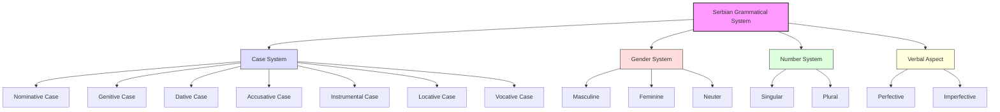
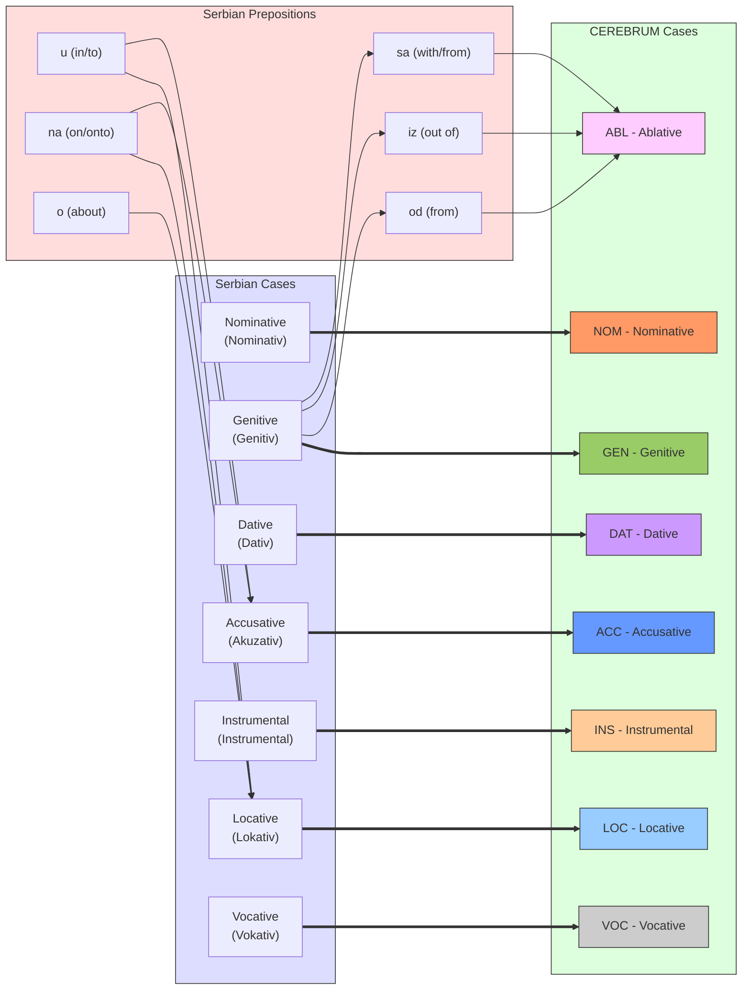
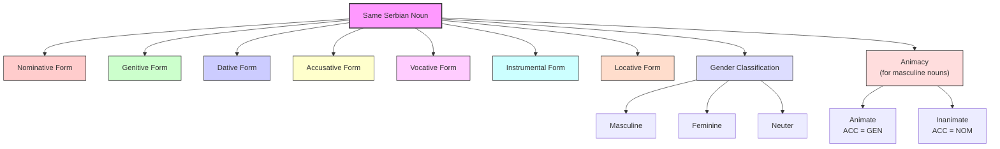
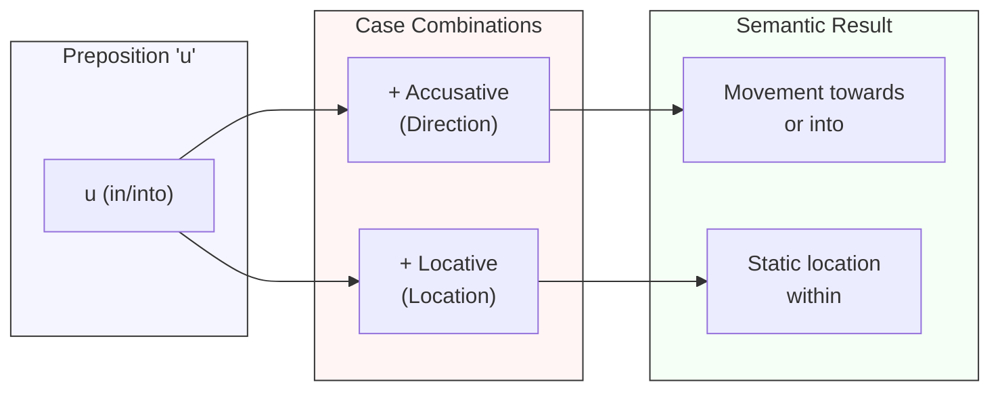
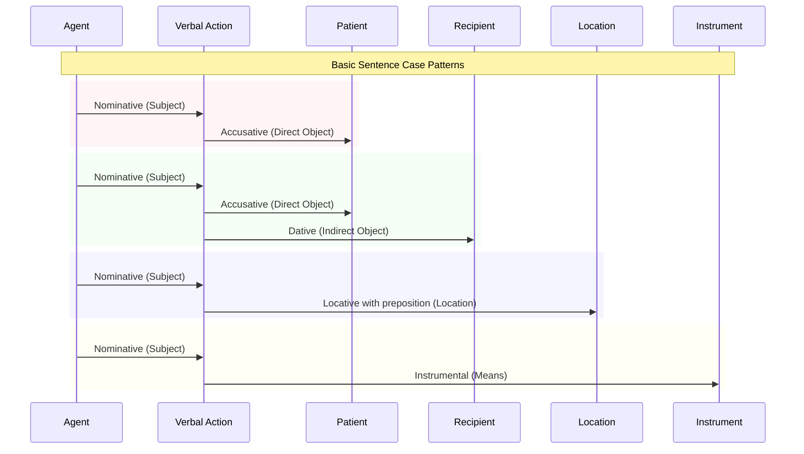
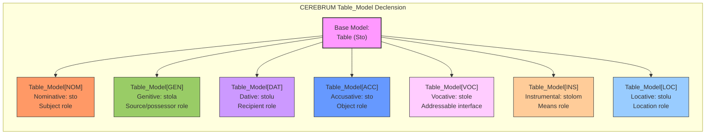

# Serbian Case System and CEREBRUM Mapping

## Overview of Serbian's Approach to Grammatical Relations

Serbian, a South Slavic language spoken primarily in Serbia, Bosnia and Herzegovina, Montenegro, and parts of Croatia, employs a rich case system to express grammatical relationships. As part of the Slavic language family, Serbian uses a combination of case inflections, prepositions, and word order to indicate the syntactic and semantic roles of participants in a sentence. This morphologically rich approach provides a robust model for CEREBRUM implementations, demonstrating how grammatical relationships can be systematically encoded through nominal inflections and their interaction with verbal systems.

In Serbian, nouns, pronouns, adjectives, and some numerals inflect for seven distinct cases, with additional distinctions for number (singular/plural) and gender (masculine/feminine/neuter). Case marking in Serbian is primarily expressed through suffixes, creating an inflectional system where the form of a word changes based on its grammatical role. This highly explicit marking system offers valuable insights for CEREBRUM implementations seeking to implement clear, unambiguous relationship encoding across model ecosystems.



## Functional Equivalents to Cases in Serbian

Serbian employs the following seven cases to express relationships between entities:

1. **Nominative (Nominativ)** - Marks the subject of a sentence
   - **Čovek** čita knjigu. (The man reads a book.)

2. **Genitive (Genitiv)** - Marks possession, source, partitive relations, and object of certain prepositions
   - Knjiga **čoveka** (The man's book)
   - Izašao je iz **kuće**. (He went out of the house.)

3. **Dative (Dativ)** - Marks the indirect object, recipient, or beneficiary
   - Dao sam knjigu **čoveku**. (I gave the book to the man.)

4. **Accusative (Akuzativ)** - Marks the direct object and goal of movement
   - Vidim **čoveka**. (I see the man.)
   - Idem u **školu**. (I'm going to school.)

5. **Instrumental (Instrumental)** - Marks the instrument or means, accompaniment, and predicate complement
   - Pišem **olovkom**. (I write with a pencil.)
   - Šetam **parkom**. (I walk through the park.)

6. **Locative (Lokativ)** - Marks location (always used with prepositions)
   - Knjiga je na **stolu**. (The book is on the table.)
   - Razmišljam o **ideji**. (I'm thinking about the idea.)

7. **Vocative (Vokativ)** - Used for direct address
   - **Ivane**, dođi ovamo! (Ivan, come here!)

Additionally, Serbian employs:

1. **Prepositions** - Work in conjunction with cases to provide more specific spatial, temporal, and logical relationships
   - **u** školi (in school - Locative with "u")
   - **u** školu (to school - Accusative with "u")

2. **Word Order** - Relatively flexible due to case marking, but typically SVO (Subject-Verb-Object)

3. **Verbal Aspect** - Perfective and imperfective aspects that interact with case usage

## Mapping to CEREBRUM Cases

Serbian's case system maps directly to CEREBRUM's eight standard cases as follows:

| CEREBRUM Case | Serbian Equivalent | Implementation Notes |
|---------------|-------------------|----------------------|
| **[NOM]** Nominative | Nominative (Nominativ) | Models in [NOM] should implement subject role with nominative case morphology |
| **[ACC]** Accusative | Accusative (Akuzativ) | Models in [ACC] should implement direct object role with accusative case morphology |
| **[GEN]** Genitive | Genitive (Genitiv) | Models in [GEN] should implement possessive, partitive, or source relations with genitive case morphology |
| **[DAT]** Dative | Dative (Dativ) | Models in [DAT] should implement recipient or beneficiary roles with dative case morphology |
| **[INS]** Instrumental | Instrumental (Instrumental) | Models in [INS] should implement instrument or means relations with instrumental case morphology |
| **[LOC]** Locative | Locative (Lokativ) | Models in [LOC] should implement location relations with locative case morphology and appropriate prepositions |
| **[ABL]** Ablative | Genitive with prepositions "od", "iz", "sa" | Models in [ABL] should implement source relations with genitive case + appropriate prepositions |
| **[VOC]** Vocative | Vocative (Vokativ) | Models in [VOC] should implement direct address patterns with vocative case morphology |



## Unique Features

Serbian's grammatical system offers several unique features relevant to CEREBRUM:

1. **Animacy Distinction in Accusative Case**
   
   Serbian makes a distinction between animate and inanimate masculine nouns in the accusative case. For animate masculine nouns, the accusative form matches the genitive, while for inanimate ones, it matches the nominative. This provides a model for CEREBRUM to implement animacy-based processing distinctions.

   ```
   Vidim čoveka. (I see the man.) - Animate, accusative = genitive
   Vidim sto. (I see the table.) - Inanimate, accusative = nominative
   ```

2. **Case-Preposition Combinations for Spatial Relations**

   Serbian uses combinations of cases and prepositions to express nuanced spatial relationships. The same preposition can have different meanings depending on which case it governs. This provides a model for CEREBRUM to implement context-dependent relationship markers.

   ```
   U kući (In the house) - Locative case with "u"
   U kuću (Into the house) - Accusative case with "u"
   ```

3. **Aspect-Case Interactions**

   Serbian verbal aspect (perfective/imperfective) interacts with case usage in complex ways. This provides a model for CEREBRUM to implement temporal-relational interactions in its operations.

   ```
   Čitam knjigu. (I am reading a book.) - Imperfective with accusative
   Pročitao sam knjigu. (I have read the book.) - Perfective with accusative
   ```

4. **Extensive Declension System**

   Serbian has a complex declension system with different patterns based on gender, number, and phonological characteristics. This provides a model for CEREBRUM to implement differentiated morphological patterns based on entity properties.

   ```
   Masculine: čovek, čoveka, čoveku, čoveka, čoveče, čovekom, čoveku (man)
   Feminine: žena, žene, ženi, ženu, ženo, ženom, ženi (woman)
   Neuter: selo, sela, selu, selo, selo, selom, selu (village)
   ```



## Extension Opportunities

Serbian's case system suggests several extension opportunities for CEREBRUM:

1. **Animacy-Based Processing Patterns**
   
   Inspired by Serbian's animacy distinctions in the accusative case, CEREBRUM could implement animacy-based processing patterns where different types of entities receive specialized handling based on their conceptual animacy.

2. **Case-Preposition Compound Relations**
   
   Based on Serbian's use of case-preposition combinations, CEREBRUM could implement compound relationship markers where the same basic marker can have different interpretations based on contextual modifiers.

3. **Aspect-Enhanced Operations**
   
   Drawing from Serbian's aspect-case interactions, CEREBRUM could implement aspect-enhanced operations where temporal characteristics influence relationship encoding and processing priorities.

4. **Morphological Pattern Templates**
   
   Inspired by Serbian's declension patterns, CEREBRUM could implement morphological pattern templates where relationship markers follow predictable transformation patterns based on entity properties.

5. **Phonological Constraint Modeling**
   
   Based on Serbian's phonological constraints in case formation, CEREBRUM could implement phonological constraint modeling where relationship markers adapt based on compatibility with connected entities.



## Example Sentences

Below are example sentences in Serbian with their CEREBRUM parallels:

1. **Nominative [NOM]**

   **Serbian:** Čovek čita knjigu.
   man.NOM reads book.ACC
   "The man reads a book."
   
   **CEREBRUM:** Man_Model[NOM] performs reading operation on Book_Model[ACC].

2. **Accusative [ACC]**

   **Serbian:** Majka voli dete.
   mother.NOM loves child.ACC
   "The mother loves the child."
   
   **CEREBRUM:** Child_Model[ACC] receives love operation from Mother_Model[NOM].

3. **Genitive [GEN]**

   **Serbian:** Kuća mog prijatelja je velika.
   house.NOM my.GEN friend.GEN is big
   "My friend's house is big."
   
   **CEREBRUM:** House_Model is possessed by Friend_Model[GEN].

4. **Dative [DAT]**

   **Serbian:** Dao sam knjigu Marku.
   gave AUX book.ACC Mark.DAT
   "I gave the book to Mark."
   
   **CEREBRUM:** Mark_Model[DAT] receives Book_Model[ACC] through give operation by Self_Model[NOM].

5. **Instrumental [INS]**

   **Serbian:** Pišem olovkom.
   write.1SG pencil.INS
   "I write with a pencil."
   
   **CEREBRUM:** Pencil_Model[INS] facilitates writing operation performed by Self_Model[NOM].

6. **Locative [LOC]**

   **Serbian:** Knjiga je na stolu.
   book.NOM is on table.LOC
   "The book is on the table."
   
   **CEREBRUM:** Table_Model[LOC] hosts Book_Model[NOM] with "on" spatial relation.

7. **Vocative [VOC]**

   **Serbian:** Marko, dođi ovamo!
   Mark.VOC come here
   "Mark, come here!"
   
   **CEREBRUM:** Direct invocation of Mark_Model[VOC] with proximity instruction.

8. **Ablative-like function with Genitive [ABL]**

   **Serbian:** Došao je iz grada.
   came AUX from city.GEN
   "He came from the city."
   
   **CEREBRUM:** He_Model[NOM] moves with City_Model[ABL] as source.

9. **Case-Preposition Combination**

   **Serbian:** Idem u školu.
   go.1SG to school.ACC
   "I am going to school."
   
   **Serbian:** Učim u školi.
   study.1SG in school.LOC
   "I study in school."
   
   **CEREBRUM:** Self_Model[NOM] moves to School_Model[ACC] (directional) vs. Self_Model[NOM] performs study operation in School_Model[LOC] (locational).



## Declension Example: CEREBRUM Model Transformation

The following table shows how a CEREBRUM model would "decline" across different cases, inspired by Serbian noun declension:

**Model Name: Table (Sto in Serbian)**

| Case | Serbian Form | CEREBRUM Implementation | Functional Role |
|------|-------------|------------------------|----------------|
| Nominative | sto | Table_Model[NOM] | Subject of operation |
| Genitive | stola | Table_Model[GEN] | Source of derivation or possession |
| Dative | stolu | Table_Model[DAT] | Recipient of operation result |
| Accusative | sto | Table_Model[ACC] | Object of operation |
| Vocative | stole | Table_Model[VOC] | Directly addressable interface |
| Instrumental | stolom | Table_Model[INS] | Means for operation execution |
| Locative | stolu | Table_Model[LOC] | Location of operation |



## Implications for CEREBRUM Design

Serbian's rich case system offers valuable insights for CEREBRUM implementations:

1. **Property-Based Morphological Adaptation**
   
   CEREBRUM could implement property-based morphological adaptation where models transform based on multiple properties (analogous to gender, number, and case in Serbian), creating systematic patterns of relation-marking that follow predictable rules.

2. **Preposition-Case Compound Relations**
   
   Inspired by Serbian's preposition-case combinations, CEREBRUM could implement compound relational markers where the same base relation can have different semantics depending on contextual modifiers, creating more nuanced relationship encoding.

3. **Animacy-Sensitive Processing**
   
   Based on Serbian's animacy distinction in the accusative case, CEREBRUM could implement animacy-sensitive processing where different types of entities receive specialized handling based on conceptual properties that go beyond simple categorization.

4. **Phonological Harmony in Model Interfaces**
   
   Drawing from Serbian's phonological rules in declension, CEREBRUM could implement interface harmony principles where connection points between models adapt based on compatibility requirements, potentially enhancing system coherence.

These Serbian-inspired approaches would be particularly valuable for CEREBRUM implementations requiring systematic relation-marking, nuanced spatial representations, and property-based adaptations across model ecosystems. 