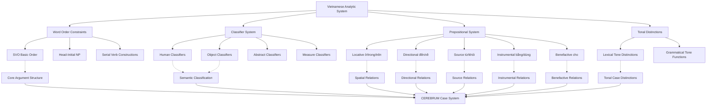

# Vietnamese Case System and CEREBRUM Mapping

## Overview of Vietnamese's Analytic Case Expression

Vietnamese (Tiếng Việt) represents a highly analytic Austro-Asiatic language that provides CEREBRUM with a sophisticated model of case relationship expression through classifier systems, strict word order, tonal distinctions, and semantic role marking without morphological inflection. As a Mon-Khmer language with significant Chinese influence, Vietnamese demonstrates how complex relational information can be encoded through positional syntax, productive classifier systems, and tonal-semantic interactions.

Vietnamese offers unique insights for CEREBRUM implementations requiring efficient case expression through structural organization, semantic classification, and tonal-functional integration. The language's complete absence of morphological case marking, combined with its rich classifier system and tonal distinctions, provides a model for streamlined yet precise case systems that achieve high expressive power through analytical systematicity.

## Historical and Typological Context

### Austro-Asiatic Heritage and Chinese Influence

Vietnamese developed through contact between Austro-Asiatic substrate and Chinese superstrate:

**Austro-Asiatic Features:**
- Mon-Khmer phonological patterns
- Isolating morphology
- Basic vocabulary substrate

**Chinese Influence:**
- Tonal system development (6 tones)
- Massive lexical borrowing (60-70% of vocabulary)
- Classifier system adoption
- Analytical grammatical structures

### Typological Characteristics

Vietnamese exhibits:

1. **Isolating Morphology** - No inflection, minimal derivation
2. **Fixed Word Order** - Rigid SVO pattern with modifier ordering
3. **Classifier System** - Extensive noun classification for quantification
4. **Tonal System** - Six tones with semantic and grammatical functions
5. **Serial Verb Constructions** - Complex predicate formation
6. **Analytic Expression** - All grammatical relations through syntax and particles

## Phonological System and Tone

### Six-Tone System

Vietnamese employs six tones with grammatical and semantic functions:

| Tone | Name | Symbol | Pitch Pattern | Example |
|------|------|--------|---------------|---------|
| **1** | ngang | ma | level | ma "ghost" |
| **2** | huyền | mà | falling | mà "that, which" |
| **3** | sắc | má | rising | má "cheek" |
| **4** | hỏi | mả | dipping | mả "tomb" |
| **5** | ngã | mã | rising broken | mã "horse" |
| **6** | nặng | mạ | falling broken | mạ "rice seedling" |

### Tonal Functions in Case-like Relationships

Tonal distinctions often correlate with different semantic roles:

```
cho (tone 1 - level) - "give" (main verb)
chồ (tone 4 - dipping) - "place" (locative function)
```

```
con (tone 1) - classifier for animals + kinship term "child"
còn (tone 2) - "still, remain" (aspectual marker)
```

## Word Order and Syntactic Case Marking

### Basic Word Order: SVO

Vietnamese employs strict Subject-Verb-Object ordering:

```
Tôi ăn cơm.
I eat rice
"I eat rice."
```

```
Cô ấy đọc sách.
she read book  
"She reads books."
```

### Noun Phrase Structure

Vietnamese noun phrases follow head-first ordering with systematic modifier placement:

```
[Determiner] + [Classifier] + [Head Noun] + [Adjective] + [Relative Clause] + [Possessor]

cái nhà đẹp của tôi
CL house beautiful of I
"my beautiful house"
```

## Classifier System for Case-like Functions

Vietnamese employs an extensive classifier system that interacts with case-like semantic roles:

### Core Classifiers by Semantic Category

#### Human Classifiers
```
người - general human classifier
cô - young woman, teacher (feminine)
chú - uncle, male adult
ông - grandfather, elderly male, formal male
bà - grandmother, elderly female, formal female
```

#### Object Classifiers
```
cái - general inanimate object classifier
con - animals, vehicles, streets, some inanimates
quả/trái - round objects, fruits
chiếc - vehicles, single items, some tools
cây - long thin objects, trees, pens
```

#### Unit/Measure Classifiers
```
cân - kilogram weight measure
lít - liter volume measure  
mét - meter length measure
cuốn - books, volumes
```

#### Abstract Classifiers
```
việc - events, affairs, jobs
chuyện - stories, matters
vấn đề - problems, issues
```

### Classifier-Case Interactions

Classifiers interact with semantic roles in systematic ways:

#### Subject Classification [NOM-like]
```
Con chó chạy.
CL:animal dog run
"The dog runs."

Cái xe dừng.
CL:vehicle car stop
"The car stops."
```

#### Object Classification [ACC-like]
```
Tôi mua con chó.
I buy CL:animal dog
"I buy a/the dog."

Cô ấy đọc cuốn sách.
she read CL:book book
"She reads a/the book."
```

## Prepositional/Coverb System for Case Expression

Vietnamese uses prepositions and coverbs to express case relationships:

### Locative/Directional Prepositions

#### Static Location [LOC]
```
ở/tại - "at, in, on"
Tôi ở nhà.
I at house
"I am at home."

trong - "in, inside"  
Sách trong tủ.
book in cabinet
"Books are in the cabinet."

trên - "on, above"
Quyển sách trên bàn.
CL:book book on table
"The book is on the table."
```

#### Directional/Goal [DAT-like]
```
đến/tới - "to, toward"
Tôi đi đến trường.
I go to school
"I go to school."

về - "toward, back to"
Về nhà
toward home
"go home"
```

#### Source/Origin [ABL-like]
```
từ - "from"
Tôi đến từ Việt Nam.
I come from Vietnam
"I come from Vietnam."

khỏi - "from, away from"
Đi khỏi đây.
go from here
"Go away from here."
```

### Dative/Benefactive Markers

#### Recipient/Beneficiary [DAT]
```
cho - "for, to (give)"
Tôi cho anh tiền.
I give you money
"I give you money."

Tôi làm cho em.
I do for younger.sibling  
"I do (it) for my younger sibling."
```

#### Purpose [DAT-purpose]
```
để - "in order to, for"
Tôi học để thi.
I study for test
"I study for the test."
```

### Instrumental/Comitative Markers

#### Instrument [INS]
```
bằng - "by means of, with"
Viết bằng bút.
write with pen
"Write with a pen."

dùng - "using"
Dùng dao cắt.
use knife cut
"Cut using a knife."
```

#### Accompaniment [COM]
```
với - "with (accompaniment)"
Đi với bạn.
go with friend
"Go with friends."

cùng - "together with"
Cùng gia đình.
together family
"Together with family."
```

## Mapping to CEREBRUM Cases

Vietnamese's analytic system maps to CEREBRUM cases through positional and prepositional strategies:

| CEREBRUM Case | Vietnamese Equivalent | Implementation Notes |
|---------------|----------------------|----------------------|
| **[NOM]** Nominative | Subject position + classifier | Models in [NOM] should implement subject position with appropriate classifier |
| **[ACC]** Accusative | Direct object position + classifier | Models in [ACC] should implement object position with semantic classifier |
| **[GEN]** Genitive | *của* constructions + juxtaposition | Models in [GEN] should implement possessive particles |
| **[DAT]** Dative | *cho* recipient + *đến/về* directional | Models in [DAT] should implement recipient/goal prepositions |
| **[INS]** Instrumental | *bằng/dùng* instrumental + *với* comitative | Models in [INS] should implement instrumental prepositions |
| **[LOC]** Locative | *ở/tại/trong/trên* locatives | Models in [LOC] should implement locative prepositions |
| **[ABL]** Ablative | *từ/khỏi* source constructions | Models in [ABL] should implement source prepositions |
| **[VOC]** Vocative | Direct address + kinship terms | Models in [VOC] should implement address terms and kinship classifiers |



## Unique Vietnamese Constructions

### Serial Verb Constructions

Vietnamese extensively uses serial verb constructions that share arguments across multiple predicates:

#### Motion-Purpose Serials
```
Tôi đi mua sách.
I go buy book
"I go to buy books."
```

#### Resultative Serials  
```
Tôi ăn no.
I eat full
"I eat until full."

Anh ấy học giỏi.
he study good
"He studies well/becomes good at studying."
```

#### Directional Serials
```
Mang lên trên.
carry go.up above
"Carry (it) up above."

Đem về nhà.
bring go.back house
"Bring (it) back home."
```

### Topic-Comment Structures

Vietnamese allows extensive topicalization:

#### Simple Topic
```
Cuốn sách này, tôi đã đọc rồi.
CL:book book this, I already read already
"This book, I have already read."
```

#### Multiple Topics
```
Ở Việt Nam, thành phố Hồ Chí Minh, tôi sống ba năm.
at Vietnam, city Ho Chi Minh, I live three year
"In Vietnam, in Ho Chi Minh City, I lived for three years."
```

### Possessive Constructions [GEN]

Vietnamese has multiple possessive strategies:

#### Particle Possession
```
nhà của tôi
house of I
"my house"

sách của anh ấy
book of he
"his book"
```

#### Juxtaposition (Kinship/Intimate)
```
nhà tôi
house I
"my house" (intimate)

con tôi
child I
"my child"
```

#### Classifier-Mediated Possession
```
cái nhà của chúng tôi
CL:house house of we
"our house"
```

## Computational Implementation for CEREBRUM

### 1. Classifier-Based Case Assignment

```python
class VietnameseClassifierCaseSystem:
    def __init__(self):
        self.classifier_inventory = {
            # Human classifiers
            'người': {'semantic_class': 'human', 'specificity': 'general'},
            'cô': {'semantic_class': 'human', 'specificity': 'young_female'},
            'ông': {'semantic_class': 'human', 'specificity': 'elderly_male'},
            'bà': {'semantic_class': 'human', 'specificity': 'elderly_female'},
            
            # Object classifiers
            'cái': {'semantic_class': 'inanimate', 'specificity': 'general'},
            'con': {'semantic_class': 'animate+vehicle+path', 'specificity': 'specific'},
            'chiếc': {'semantic_class': 'vehicle+single_object', 'specificity': 'individual'},
            'quả': {'semantic_class': 'round_object+fruit', 'specificity': 'shape'},
            'cây': {'semantic_class': 'long_thin_object', 'specificity': 'shape'},
            
            # Unit classifiers
            'cuốn': {'semantic_class': 'book+volume', 'specificity': 'unit'},
            'tờ': {'semantic_class': 'flat_object+paper', 'specificity': 'unit'},
            'cái': {'semantic_class': 'pound+kilogram', 'specificity': 'measure'},
            
            # Abstract classifiers
            'việc': {'semantic_class': 'event+job', 'specificity': 'abstract'},
            'chuyện': {'semantic_class': 'story+matter', 'specificity': 'abstract'}
        }
        
        self.case_classifier_interactions = {
            'subject_position': self._assign_subject_classifier,
            'object_position': self._assign_object_classifier,
            'possessive_construction': self._assign_possessive_classifier
        }
    
    def assign_case_with_classifier(self, model, syntactic_position, semantic_properties):
        # Determine appropriate classifier
        classifier = self._select_classifier(model, semantic_properties)
        
        # Assign case based on syntactic position
        case = self._assign_positional_case(syntactic_position)
        
        return {
            'case': case,
            'classifier': classifier,
            'semantic_classification': self.classifier_inventory[classifier],
            'syntactic_position': syntactic_position
        }
    
    def _select_classifier(self, model, semantic_properties):
        semantic_class = semantic_properties.get('semantic_class')
        animacy = semantic_properties.get('animacy')
        shape = semantic_properties.get('shape')
        
        # Classify based on semantic properties
        if semantic_class == 'human':
            age = semantic_properties.get('age')
            gender = semantic_properties.get('gender')
            
            if age == 'elderly' and gender == 'male':
                return 'ông'
            elif age == 'elderly' and gender == 'female':
                return 'bà'
            elif age == 'young' and gender == 'female':
                return 'cô'
            else:
                return 'người'
        
        elif animacy == 'animate' or semantic_class == 'animal':
            return 'con'
        
        elif shape == 'round' or semantic_class == 'fruit':
            return 'quả'
        
        elif shape == 'long_thin':
            return 'cây'
        
        elif semantic_class == 'book':
            return 'cuốn'
        
        else:
            return 'cái'  # Default inanimate classifier
    
    def _assign_positional_case(self, syntactic_position):
        position_case_mapping = {
            'subject': Case.NOM,
            'direct_object': Case.ACC,
            'prepositional_object': None,  # Determined by preposition
            'topic': Case.TOP
        }
        
        return position_case_mapping.get(syntactic_position, Case.NOM)
```

### 2. Prepositional Case Assignment

```python
class VietnamesePrepositionCaseSystem:
    def __init__(self):
        self.preposition_case_mapping = {
            # Locative prepositions
            'ở': Case.LOC,
            'tại': Case.LOC,
            'trong': Case.LOC,
            'trên': Case.LOC,
            'dưới': Case.LOC,
            'bên': Case.LOC,
            'giữa': Case.LOC,
            
            # Directional prepositions (goal as dative)
            'đến': Case.DAT,
            'tới': Case.DAT,
            'về': Case.DAT,
            'vào': Case.DAT,
            
            # Source prepositions (ablative)
            'từ': Case.ABL,
            'khỏi': Case.ABL,
            'ra': Case.ABL,
            
            # Instrumental prepositions
            'bằng': Case.INS,
            'dùng': Case.INS,
            
            # Comitative prepositions
            'với': Case.COM,  # Comitative as specialized instrumental
            'cùng': Case.COM,
            
            # Benefactive/Recipient
            'cho': Case.DAT,
            'để': Case.DAT,  # Purpose as dative
            
            # Possessive
            'của': Case.GEN
        }
        
        self.complex_prepositions = {
            'bên cạnh': Case.LOC,    # "beside"
            'phía trước': Case.LOC,  # "in front of"
            'phía sau': Case.LOC,    # "behind"
            'bên trong': Case.LOC,   # "inside"
            'bên ngoài': Case.LOC    # "outside"
        }
    
    def assign_prepositional_case(self, preposition, context):
        # Handle simple prepositions
        if preposition in self.preposition_case_mapping:
            base_case = self.preposition_case_mapping[preposition]
            
            # Apply contextual modifications
            return self._apply_contextual_case_modification(base_case, preposition, context)
        
        # Handle complex prepositions
        if preposition in self.complex_prepositions:
            return self.complex_prepositions[preposition]
        
        # Default fallback
        return Case.INS
    
    def _apply_contextual_case_modification(self, base_case, preposition, context):
        # Some prepositions have context-dependent interpretations
        if preposition == 'cho':
            semantic_role = context.get('semantic_role')
            if semantic_role == 'recipient':
                return Case.DAT
            elif semantic_role == 'beneficiary':
                return Case.DAT
            elif semantic_role == 'purpose':
                return Case.DAT
        
        elif preposition == 'với':
            semantic_role = context.get('semantic_role')
            if semantic_role == 'instrument':
                return Case.INS
            elif semantic_role == 'accompaniment':
                return Case.COM
        
        return base_case
```

### 3. Serial Verb Construction Handler

```python
class VietnameseSerialVerbHandler:
    def __init__(self):
        self.serial_verb_patterns = {
            'motion_purpose': ['đi', 'đến', 'về', 'lên', 'xuống'],
            'resultative': ['ăn', 'học', 'làm', 'chạy'],
            'directional': ['mang', 'đem', 'đưa', 'lấy'],
            'aspectual': ['bắt đầu', 'tiếp tục', 'dừng', 'xong']
        }
    
    def parse_serial_verb_construction(self, verb_sequence, arguments):
        construction_type = self._identify_serial_type(verb_sequence)
        
        case_assignments = {}
        
        if construction_type == 'motion_purpose':
            # First verb assigns motion case frame
            # Second verb assigns purpose/goal case frame
            case_assignments = self._handle_motion_purpose_serial(verb_sequence, arguments)
        
        elif construction_type == 'resultative':
            # Result verb modifies the primary case frame
            case_assignments = self._handle_resultative_serial(verb_sequence, arguments)
        
        elif construction_type == 'directional':
            # Directional verb adds path/goal information
            case_assignments = self._handle_directional_serial(verb_sequence, arguments)
        
        return case_assignments
    
    def _handle_motion_purpose_serial(self, verb_sequence, arguments):
        main_verb = verb_sequence[0]
        purpose_verb = verb_sequence[1]
        
        # Subject shared across both verbs
        subject = arguments.get('subject')
        destination = arguments.get('destination')
        purpose_object = arguments.get('purpose_object')
        
        case_assignments = {}
        
        if subject:
            case_assignments[subject] = Case.NOM
        
        if destination:
            case_assignments[destination] = Case.DAT  # Goal
        
        if purpose_object:
            case_assignments[purpose_object] = Case.ACC  # Purpose object
        
        return case_assignments
```

### 4. Tonal Case Distinction Handler

```python
class TonalCaseDistinctionHandler:
    def __init__(self):
        self.tonal_case_correlations = {
            # Some function words have tonal variants with different case implications
            'cho': {
                'tone_1': {'case': Case.DAT, 'function': 'benefactive_verb'},
                'tone_4': {'case': Case.DAT, 'function': 'recipient_preposition'}
            },
            'con': {
                'tone_1': {'case': Case.NOM, 'function': 'kinship_classifier'},
                'tone_2': {'case': Case.ACC, 'function': 'animal_classifier'}
            }
        }
    
    def resolve_tonal_case_distinction(self, word, tone, syntactic_context):
        if word in self.tonal_case_correlations:
            tone_variants = self.tonal_case_correlations[word]
            tone_key = f'tone_{tone}'
            
            if tone_key in tone_variants:
                return tone_variants[tone_key]
        
        # No tonal case distinction for this word
        return None
```

## Example Sentences with Detailed Analysis

### 1. Basic SVO [NOM-ACC]

**Vietnamese:** Tôi ăn cơm.

**Analysis:**
- *Tôi* - 1st person pronoun, subject [NOM]
- *ăn* - transitive verb "eat"
- *cơm* - noun "rice", direct object [ACC]

**CEREBRUM:** I_Model[NOM] performs eating_operation on Rice_Model[ACC].

### 2. Classifier Construction [NOM-ACC with Classifiers]

**Vietnamese:** Con mèo bắt con chuột.

**Analysis:**
- *Con mèo* - CL:animal cat, subject [NOM]
- *bắt* - transitive verb "catch"
- *con chuột* - CL:animal mouse, direct object [ACC]

**CEREBRUM:** Cat_Model[NOM:animal_classifier] performs catching_operation on Mouse_Model[ACC:animal_classifier].

### 3. Possessive Construction [GEN]

**Vietnamese:** Nhà của tôi rất đẹp.

**Analysis:**
- *Nhà* - noun "house", subject [NOM]
- *của tôi* - possessive construction "of me" [GEN]
- *rất đẹp* - adverbial + adjective "very beautiful"

**CEREBRUM:** House_Model[NOM] derived from I_Model[GEN] exhibits very_beautiful_property.

### 4. Locative Construction [LOC]

**Vietnamese:** Sách ở trên bàn.

**Analysis:**
- *Sách* - noun "book", subject [NOM]
- *ở* - locative preposition "at"
- *trên bàn* - locative phrase "on table" [LOC]

**CEREBRUM:** Book_Model[NOM] maintains location on Table_Model[LOC].

### 5. Directional Construction [DAT]

**Vietnamese:** Tôi đi đến trường.

**Analysis:**
- *Tôi* - subject pronoun [NOM]
- *đi* - motion verb "go"
- *đến trường* - directional phrase "to school" [DAT]

**CEREBRUM:** I_Model[NOM] performs going_operation toward School_Model[DAT].

### 6. Instrumental Construction [INS]

**Vietnamese:** Tôi viết bằng bút.

**Analysis:**
- *Tôi* - subject pronoun [NOM]
- *viết* - transitive verb "write"
- *bằng bút* - instrumental phrase "with pen" [INS]

**CEREBRUM:** I_Model[NOM] performs writing_operation using Pen_Model[INS].

### 7. Benefactive Construction [DAT]

**Vietnamese:** Tôi mua quà cho em.

**Analysis:**
- *Tôi* - subject pronoun [NOM]
- *mua* - transitive verb "buy"
- *quà* - noun "gift", direct object [ACC]
- *cho em* - benefactive phrase "for younger sibling" [DAT]

**CEREBRUM:** I_Model[NOM] performs buying_operation on Gift_Model[ACC] for Younger_Sibling_Model[DAT].

### 8. Source Construction [ABL]

**Vietnamese:** Tôi về từ Mỹ.

**Analysis:**
- *Tôi* - subject pronoun [NOM]
- *về* - motion verb "return"
- *từ Mỹ* - source phrase "from America" [ABL]

**CEREBRUM:** I_Model[NOM] performs returning_operation from America_Model[ABL].

### 9. Serial Verb Construction

**Vietnamese:** Tôi đi mua sách.

**Analysis:**
- *Tôi* - shared subject [NOM]
- *đi* - motion verb "go"
- *mua* - transitive verb "buy"
- *sách* - direct object [ACC]

**CEREBRUM:** I_Model[NOM] performs sequential operations: going_operation and buying_operation on Book_Model[ACC].

### 10. Topic-Comment Structure

**Vietnamese:** Cuốn sách này, tôi đã đọc rồi.

**Analysis:**
- *Cuốn sách này* - topicalized object "this book" [TOP]
- *tôi* - subject in comment [NOM]
- *đã đọc rồi* - perfect aspect "already read"

**CEREBRUM:** Book_Model[TOP] associated with completed_reading_operation performed by I_Model[NOM].

## Extension Opportunities for CEREBRUM

### 1. Classifier-Based Semantic Case System

Based on Vietnamese classifiers, CEREBRUM could implement semantic case classification:

```python
class SemanticCaseClassification:
    def assign_semantic_case(self, model, classifier, syntactic_case):
        semantic_properties = self._extract_classifier_semantics(classifier)
        
        return {
            'syntactic_case': syntactic_case,
            'semantic_case': semantic_properties,
            'classifier': classifier,
            'integrated_case_assignment': self._integrate_cases(syntactic_case, semantic_properties)
        }
```

### 2. Tonal Case Distinctions

Vietnamese tones could inspire tonal case marking in CEREBRUM:

```python
class TonalCaseMarking:
    def assign_tonal_case(self, model, base_case, tonal_context):
        if tonal_context.get('functional_tone'):
            return {
                'base_case': base_case,
                'tonal_modification': tonal_context['functional_tone'],
                'integrated_case': self._apply_tonal_modification(base_case, tonal_context)
            }
        return base_case
```

### 3. Serial Construction Case Sharing

Based on Vietnamese serial verbs, CEREBRUM could implement shared case assignment:

```python
class SerialConstructionCaseSharing:
    def share_cases_across_predicates(self, predicate_sequence, shared_arguments):
        shared_case_assignments = {}
        
        for argument in shared_arguments:
            # Determine case role in each predicate
            case_roles = []
            for predicate in predicate_sequence:
                role = self._determine_case_role(argument, predicate)
                case_roles.append(role)
            
            # Resolve case conflicts
            final_case = self._resolve_case_conflicts(case_roles)
            shared_case_assignments[argument] = final_case
        
        return shared_case_assignments
```

These Vietnamese-inspired approaches would be particularly valuable for CEREBRUM implementations requiring efficient analytical case systems with semantic classification and systematic structural organization.

## Implications for CEREBRUM Design

Vietnamese provides crucial insights for CEREBRUM implementations emphasizing analytical efficiency and semantic systematicity:

1. **Classifier Integration**: The extensive classifier system demonstrates how CEREBRUM could integrate semantic classification with syntactic case assignment.

2. **Tonal Functions**: Vietnamese tones suggest how CEREBRUM could use prosodic or suprasegmental features for case distinction.

3. **Serial Processing**: Serial verb constructions provide models for shared case assignment across multiple predicates.

4. **Positional Systematicity**: The rigid word order shows how CEREBRUM could implement constraint-based positional case systems.

5. **Analytical Precision**: Vietnamese demonstrates how analytical languages can achieve high relational precision without morphological complexity.

## References

1. Nguyễn, Đình-Hoà. (1997). *Vietnamese: Tiếng Việt without Tears*. Charles E. Tuttle Company.

2. Thompson, L. C. (1965). *A Vietnamese Grammar*. University of Washington Press.

3. Cao, Xuân Hạo. (1991). *Tiếng Việt - Sơ thảo ngữ pháp chức năng* [*Vietnamese - A Functional Grammar Sketch*]. Social Sciences Publishing House.

4. Brunelle, M., & Nguyễn, K. H. (2017). *The Phonetics and Phonology of Vietnamese Tones*. In *The Handbook of Vietnamese Linguistics* (pp. 45-68). Oxford University Press.

5. Bisang, W. (2009). *On the Evolution of Complexity: Sometimes Less is More in East and Mainland Southeast Asia*. In *Language Complexity as an Evolving Variable* (pp. 34-49). Oxford University Press.

6. Lê, B. K. (2002). *Serial Verb Constructions in Vietnamese*. In *Serial Verb Constructions: A Cross-linguistic Typology* (pp. 518-542). Oxford University Press.

7. Nguyễn, Phú Phong. (1982). *Từ loại danh từ tiếng Việt hiện đại* [*Noun Categories in Modern Vietnamese*]. Social Sciences Publishing House.

8. Emeneau, M. B. (1951). *Studies in Vietnamese (Annamese) Grammar*. University of California Press. 