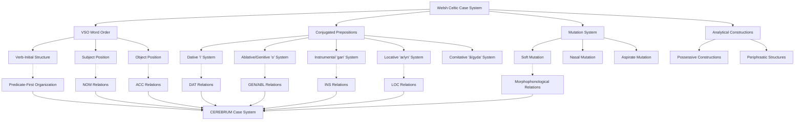

# Welsh Case System and CEREBRUM Mapping

## Overview of Welsh's Celtic Case Expression

Welsh (Cymraeg) represents a fascinating Celtic approach to case relationship expression through conjugated prepositions, verb-subject-object (VSO) word order, and complex mutation systems that provide CEREBRUM with unique insights into how case relationships can be encoded through prepositional inflection and systematic consonant alternations. As a Brythonic Celtic language, Welsh demonstrates innovative solutions to case marking that differ substantially from both synthetic inflectional systems and purely analytical approaches.

Welsh offers valuable insights for CEREBRUM implementations requiring systematic prepositional case marking, phonological relationship encoding, and verb-initial syntax. The language's conjugated prepositional system provides a model for how CEREBRUM could implement person-sensitive case marking through functional elements, while the mutation system demonstrates how phonological alternations can encode syntactic relationships.

## Historical Development and Celtic Context

### Celtic Heritage and Typological Position

Welsh developed from Brythonic Celtic with substantial innovations:

**Common Celtic Features:**
- Verb-Subject-Object (VSO) word order
- Inflected prepositions
- Initial consonant mutations
- Extensive verbal morphology

**Brythonic Innovations:**
- Loss of nominal case marking (unlike Irish)
- Development of periphrastic verb constructions
- Simplification of conjugated preposition paradigms
- Innovation in mutation triggering environments

### Relationship to Other Celtic Languages

```
Celtic Languages
├── Continental Celtic (extinct)
├── Goidelic (Irish Gaelic branch)
│   ├── Irish (Gaeilge) - retains nominal case system
│   ├── Scottish Gaelic (Gàidhlig)
│   └── Manx (extinct)
└── Brythonic (Welsh branch)
    ├── Welsh (Cymraeg) - innovative prepositional system
    ├── Cornish (Kernewek) - revived
    └── Breton (Brezhoneg)
```

## Morphological and Syntactic Characteristics

### Loss of Nominal Case System

Unlike its Goidelic relatives, Welsh has almost completely lost nominal case inflection:

**Old Welsh (traces of case):**
```
Nominative: *mab "son"
Genitive: *mabi "of son"
```

**Modern Welsh (no case marking):**
```
mab "son" (all syntactic functions)
mab y dyn "the man's son" (genitive expressed analytically)
```

### Verb-Subject-Object (VSO) Word Order

Welsh employs systematic VSO ordering:

```
Gwelais i'r dyn.
see.PST.1SG I the man
"I saw the man."

Mae'r gath yn cysgu.
be.PRS.3SG the cat PROG sleep
"The cat is sleeping."
```

### Initial Consonant Mutations

Welsh employs systematic consonant mutations triggered by syntactic environment:

#### Soft Mutation (most common)
```
pen "head" → fy mhen i "my head"
tŷ "house" → ei dŷ e "his house"  
cath "cat" → y gath "the cat"
```

#### Nasal Mutation
```
pen "head" → fy mhen i "my head"
tad "father" → fy nhad i "my father"
cath "cat" → fy nghath i "my cat"
```

#### Aspirate Mutation
```
pen "head" → ei phen hi "her head"
tŷ "house" → ei thŷ hi "her house"
cath "cat" → ei chath hi "her cat"
```

## Conjugated Prepositional System

Welsh's most distinctive feature for case expression is the extensive system of conjugated prepositions:

### Personal Prepositions (Arddodiaid Personol)

#### i "to, for" [DAT]
```
Singular:
i mi "to me"
i ti "to you"
iddo fe/fo "to him"
iddi hi "to her"

Plural:
i ni "to us"
i chi "to you (pl)"
iddyn nhw "to them"
```

#### o "from, of" [ABL/GEN]
```
Singular:
ohono i "from me"
ohonot ti "from you"
ohono fe/fo "from him"
ohoni hi "from her"

Plural:
ohonon ni "from us"
ohonoch chi "from you (pl)"
ohonyn nhw "from them"
```

#### am "about, around" [circumstantial]
```
Singular:
amdana i "about me"
amdanat ti "about you"
amdano fe/fo "about him"
amdani hi "about her"

Plural:
amdanon ni "about us"
amdanoch chi "about you (pl)"
amdanyn nhw "about them"
```

#### gan "with, by" [INS/AGT]
```
Singular:
gen i "with me / by me"
gen ti "with you / by you"
ganddo fe/fo "with him / by him"
ganddi hi "with her / by her"

Plural:
gynnon ni "with us / by us"
gynnoch chi "with you (pl) / by you (pl)"
ganddyn nhw "with them / by them"
```

#### â/gyda "with" [COM]
```
Singular:
â fi "with me"
â ti "with you"
ag e/â fo "with him"
â hi "with her"

Plural:
â ni "with us"
â chi "with you (pl)"
â nhw "with them"
```

### Complex Prepositions

Welsh also employs complex prepositions that can be conjugated:

#### ar "on" [LOC]
```
Singular:
arna i "on me"
arnat ti "on you"
arno fe/fo "on him"
arni hi "on her"

Plural:
arnon ni "on us"
arnoch chi "on you (pl)"
arnyn nhw "on them"
```

#### wrth "by, at" [LOC/proximity]
```
Singular:
wrtha i "by me"
wrthot ti "by you"
wrtho fe/fo "by him"
wrthi hi "by her"

Plural:
wrthon ni "by us"
wrthoch chi "by you (pl)"
wrthyn nhw "by them"
```

## Mapping to CEREBRUM Cases

Welsh's prepositional system provides systematic mapping to CEREBRUM cases through inflected prepositions:

| CEREBRUM Case | Welsh Preposition | Conjugated Forms | Implementation Notes |
|---------------|-------------------|------------------|----------------------|
| **[NOM]** Nominative | Subject position in VSO | No prepositional marking | Models in [NOM] should implement post-verbal subject position |
| **[ACC]** Accusative | Direct object position | No prepositional marking | Models in [ACC] should implement post-subject object position |
| **[GEN]** Genitive | Analytical constructions + *o* | *ohono/ohoni/ohonyn* etc. | Models in [GEN] should implement possessive constructions and ablative *o* |
| **[DAT]** Dative | *i* "to, for" | *i mi/i ti/iddo/iddi* etc. | Models in [DAT] should implement conjugated *i* preposition |
| **[INS]** Instrumental | *gan* "with, by" | *gen i/gen ti/ganddo* etc. | Models in [INS] should implement conjugated *gan* preposition |
| **[LOC]** Locative | *ar* "on", *yn* "in" | *arna i/arnat ti* etc. | Models in [LOC] should implement locative prepositions with conjugation |
| **[ABL]** Ablative | *o* "from" | *ohono/ohoni* etc. | Models in [ABL] should implement conjugated *o* preposition |
| **[VOC]** Vocative | Direct address + mutations | Soft mutation triggering | Models in [VOC] should implement address with mutation patterns |



## Unique Welsh Constructions

### Possessive Constructions [GEN]

Welsh has multiple strategies for expressing possession:

#### Analytical Possession with *y*/*'r*
```
tŷ'r dyn
house.the man
"the man's house"

car y ferch
car the girl
"the girl's car"
```

#### Conjugated Preposition Possession
```
fy nhŷ i
my house I
"my house"

ei char hi
her car she
"her car"
```

#### Body Part Possession (Inalienable)
```
Mae pen tost gen i.
be.PRS.3SG head sore with me
"I have a headache." (literally: "There is a sore head with me")
```

### Existential Constructions with *gan*

Welsh uses the conjugated preposition *gan* for possession/existence:

```
Mae car gen i.
be.PRS.3SG car with me
"I have a car."

Oedd arian ganddo fe.
be.PST.3SG money with.him he
"He had money."
```

### Periphrastic Constructions

Welsh extensively uses periphrastic constructions for complex case relationships:

#### Progressive Aspect with Location
```
Mae'r plant yn chwarae yn yr ardd.
be.PRS.3SG the children PROG play in the garden
"The children are playing in the garden."
```

#### Perfect Aspect with Possession
```
Mae Siân wedi cyrraedd.
be.PRS.3SG Siân after arrive
"Siân has arrived."
```

### Mutation in Case Contexts

Mutations systematically mark syntactic relationships:

#### Direct Object Mutation
```
Prynais lyfr. (soft mutation: llyfr → lyfr)
buy.PST.1SG book
"I bought a book."
```

#### Possessive Mutations
```
fy nghar i (nasal mutation: car → nghar)
my car I
"my car"

ei char hi (aspirate mutation: car → char)
her car she  
"her car"
```

#### Vocative Mutations
```
Dewch yma, blant! (soft mutation: plant → blant)
come.IMP.2PL here children
"Come here, children!"
```

## Computational Implementation for CEREBRUM

### 1. Conjugated Preposition System

```python
class WelshConjugatedPrepositionSystem:
    def __init__(self):
        self.preposition_paradigms = {
            'i': {  # Dative "to, for"
                '1sg': 'i mi',
                '2sg': 'i ti', 
                '3sg.m': 'iddo fe',
                '3sg.f': 'iddi hi',
                '1pl': 'i ni',
                '2pl': 'i chi',
                '3pl': 'iddyn nhw'
            },
            
            'o': {  # Ablative/Genitive "from, of"
                '1sg': 'ohono i',
                '2sg': 'ohonot ti',
                '3sg.m': 'ohono fe',
                '3sg.f': 'ohoni hi',
                '1pl': 'ohonon ni',
                '2pl': 'ohonoch chi',
                '3pl': 'ohonyn nhw'
            },
            
            'gan': {  # Instrumental "with, by"
                '1sg': 'gen i',
                '2sg': 'gen ti',
                '3sg.m': 'ganddo fe',
                '3sg.f': 'ganddi hi',
                '1pl': 'gynnon ni',
                '2pl': 'gynnoch chi',
                '3pl': 'ganddyn nhw'
            },
            
            'ar': {  # Locative "on"
                '1sg': 'arna i',
                '2sg': 'arnat ti',
                '3sg.m': 'arno fe',
                '3sg.f': 'arni hi',
                '1pl': 'arnon ni',
                '2pl': 'arnoch chi',
                '3pl': 'arnyn nhw'
            }
        }
        
        self.preposition_case_mapping = {
            'i': Case.DAT,
            'o': Case.ABL,  # or GEN in possessive contexts
            'gan': Case.INS,
            'ar': Case.LOC,
            'yn': Case.LOC,
            'wrth': Case.LOC,
            'am': Case.CIRC,  # Circumstantial
            'â': Case.COM,    # Comitative
            'gyda': Case.COM
        }
    
    def assign_prepositional_case(self, preposition, referent_person, referent_number, referent_gender, context):
        # Generate appropriate conjugated form
        person_key = self._generate_person_key(referent_person, referent_number, referent_gender)
        
        if preposition in self.preposition_paradigms:
            conjugated_form = self.preposition_paradigms[preposition].get(person_key)
            base_case = self.preposition_case_mapping[preposition]
            
            # Apply contextual case modifications
            final_case = self._apply_contextual_modifications(base_case, preposition, context)
            
            return {
                'case': final_case,
                'prepositional_form': conjugated_form,
                'person_agreement': person_key,
                'construction': 'conjugated_preposition'
            }
        
        return None
    
    def _generate_person_key(self, person, number, gender):
        if number == 'singular':
            if person == 1:
                return '1sg'
            elif person == 2:
                return '2sg'
            elif person == 3:
                return f'3sg.{gender[0]}' if gender else '3sg.m'
        else:  # plural
            if person == 1:
                return '1pl'
            elif person == 2:
                return '2pl'
            elif person == 3:
                return '3pl'
        
        return '3sg.m'  # default
    
    def _apply_contextual_modifications(self, base_case, preposition, context):
        # Handle ambiguous prepositions based on context
        if preposition == 'o':
            if context.get('semantic_relation') == 'possession':
                return Case.GEN
            elif context.get('semantic_relation') == 'source':
                return Case.ABL
        
        elif preposition == 'gan':
            if context.get('semantic_relation') == 'instrument':
                return Case.INS
            elif context.get('semantic_relation') == 'agent':
                return Case.AGT  # Agent in passive-like constructions
            elif context.get('semantic_relation') == 'possession':
                return Case.DAT  # Possessive dative with "have" constructions
        
        return base_case
```

### 2. Mutation System Integration

```python
class WelshMutationCaseIntegration:
    def __init__(self):
        self.mutation_triggers = {
            'soft_mutation': {
                'direct_object': True,
                'feminine_singular_after_article': True,
                'after_possessive_fy': True,
                'after_prepositions': ['yn', 'i', 'o', 'am', 'ar', 'at', 'gan', 'heb', 'rhag', 'wrth', 'dan', 'dros', 'drwy'],
                'vocative': True
            },
            
            'nasal_mutation': {
                'after_possessive_fy': True,
                'after_yn_in': True
            },
            
            'aspirate_mutation': {
                'after_possessive_ei_fem': True,  # her
                'after_tri': True,  # three
                'after_chwe': True  # six
            }
        }
        
        self.mutation_patterns = {
            'soft': {
                'p': 'b', 'b': 'f', 'f': 'disappears',
                't': 'd', 'd': 'dd', 'th': 'disappears',
                'c': 'g', 'g': 'disappears',
                'm': 'f', 'rh': 'r', 'll': 'l'
            },
            
            'nasal': {
                'p': 'mh', 'b': 'm', 'f': 'remains',
                't': 'nh', 'd': 'n', 'th': 'remains',
                'c': 'ngh', 'g': 'ng', 'gw': 'ngw'
            },
            
            'aspirate': {
                'p': 'ph', 't': 'th', 'c': 'ch'
            }
        }
    
    def apply_mutation_for_case(self, word, case_context, syntactic_position):
        mutation_type = self._determine_mutation_type(case_context, syntactic_position)
        
        if mutation_type:
            mutated_form = self._apply_mutation(word, mutation_type)
            return {
                'base_form': word,
                'mutated_form': mutated_form,
                'mutation_type': mutation_type,
                'triggering_context': case_context
            }
        
        return {'base_form': word, 'mutated_form': word, 'mutation_type': None}
    
    def _determine_mutation_type(self, case_context, syntactic_position):
        # Direct object triggers soft mutation
        if syntactic_position == 'direct_object':
            return 'soft'
        
        # Prepositions trigger various mutations
        if case_context.get('preposition'):
            prep = case_context['preposition']
            if prep in self.mutation_triggers['soft_mutation']['after_prepositions']:
                return 'soft'
        
        # Possessives trigger different mutations
        if case_context.get('possessive_type'):
            poss_type = case_context['possessive_type']
            if poss_type == 'my' and case_context.get('nasal_trigger'):
                return 'nasal'
            elif poss_type == 'her':
                return 'aspirate'
            elif poss_type in ['my', 'your', 'his']:
                return 'soft'
        
        # Vocative triggers soft mutation
        if case_context.get('case') == Case.VOC:
            return 'soft'
        
        return None
    
    def _apply_mutation(self, word, mutation_type):
        if not word:
            return word
        
        first_consonant = self._extract_initial_consonant_cluster(word)
        rest_of_word = word[len(first_consonant):]
        
        mutation_pattern = self.mutation_patterns.get(mutation_type, {})
        mutated_initial = mutation_pattern.get(first_consonant, first_consonant)
        
        if mutated_initial == 'disappears':
            return rest_of_word
        else:
            return mutated_initial + rest_of_word
```

### 3. VSO Word Order Case Assignment

```python
class WelshVSOCaseAssignment:
    def __init__(self):
        self.vso_positions = {
            'verb': 0,
            'subject': 1,  
            'direct_object': 2,
            'indirect_object': 3,
            'adverbials': 4
        }
    
    def assign_vso_cases(self, sentence_elements):
        case_assignments = {}
        
        # Sort elements by position
        positioned_elements = sorted(sentence_elements, key=lambda x: x.get('position', 999))
        
        for i, element in enumerate(positioned_elements):
            element_type = element.get('type')
            
            if element_type == 'verb':
                # Verbs don't get case, but they determine argument structure
                continue
            
            elif i == 1:  # Subject position (post-verbal)
                case_assignments[element['id']] = {
                    'case': Case.NOM,
                    'position': 'post_verbal_subject',
                    'vso_structure': True
                }
            
            elif i == 2:  # Direct object position
                case_assignments[element['id']] = {
                    'case': Case.ACC,
                    'position': 'direct_object',
                    'mutation_trigger': 'soft_mutation'
                }
            
            elif element.get('prepositional'):
                # Handle prepositional phrases
                prep_case = self._determine_prepositional_case(element)
                case_assignments[element['id']] = prep_case
        
        return case_assignments
```

### 4. Periphrastic Construction Handler

```python
class WelshPeriphrasticConstructionHandler:
    def __init__(self):
        self.periphrastic_patterns = {
            'progressive': {
                'auxiliary': 'bod',  # be
                'particle': 'yn',
                'main_verb': 'verb_noun'
            },
            
            'perfect': {
                'auxiliary': 'bod',  # be
                'particle': 'wedi',
                'main_verb': 'verb_noun'
            },
            
            'possessive_existential': {
                'auxiliary': 'bod',  # be
                'possessor': 'gan_phrase',
                'possessed': 'subject_position'
            }
        }
    
    def handle_periphrastic_construction(self, construction_type, elements):
        if construction_type not in self.periphrastic_patterns:
            return self._default_case_assignment(elements)
        
        pattern = self.periphrastic_patterns[construction_type]
        case_assignments = {}
        
        if construction_type == 'possessive_existential':
            # Handle "Mae car gen i" = "I have a car"
            possessed = elements.get('possessed')
            possessor = elements.get('possessor')
            
            if possessed:
                case_assignments[possessed] = Case.NOM  # Subject of existential
            
            if possessor:
                case_assignments[possessor] = Case.DAT  # Dative possessor
        
        return case_assignments
```

## Example Sentences with Detailed Analysis

### 1. Basic VSO [NOM-ACC]

**Welsh:** Gwelodd y dyn y gath.

**Analysis:**
- *Gwelodd* - see.PST.3SG (verb-initial)
- *y dyn* - the man, subject [NOM]
- *y gath* - the cat, direct object [ACC] with soft mutation (cath → gath)

**CEREBRUM:** Man_Model[NOM:post_verbal] performs seeing_operation on Cat_Model[ACC:mutated].

### 2. Dative with Conjugated Preposition [DAT]

**Welsh:** Rhoddodd y ferch lyfr i'r bachgen.

**Analysis:**
- *Rhoddodd* - give.PST.3SG
- *y ferch* - the girl, subject [NOM]
- *lyfr* - book, direct object [ACC] with soft mutation (llyfr → lyfr)
- *i'r bachgen* - to the boy [DAT]

**CEREBRUM:** Girl_Model[NOM] performs giving_operation transferring Book_Model[ACC:mutated] to Boy_Model[DAT:prepositional].

### 3. Instrumental with Conjugated *gan* [INS]

**Welsh:** Ysgrifennodd hi'r llythyr â'r beiro.

**Analysis:**
- *Ysgrifennodd* - write.PST.3SG
- *hi* - she, subject [NOM]
- *'r llythyr* - the letter, direct object [ACC]
- *â'r beiro* - with the pen [INS]

**CEREBRUM:** She_Model[NOM] performs writing_operation on Letter_Model[ACC] using Pen_Model[INS:comitative].

### 4. Possessive Construction [GEN]

**Welsh:** Mae car y dyn yn goch.

**Analysis:**
- *Mae* - be.PRS.3SG
- *car y dyn* - man's car (analytical possessive) [GEN]
- *yn goch* - red (predicative)

**CEREBRUM:** Car_Model[NOM] derived from Man_Model[GEN:analytical] exhibits red_property.

### 5. Locative with Conjugated Preposition [LOC]

**Welsh:** Mae'r llyfr ar y bwrdd.

**Analysis:**
- *Mae* - be.PRS.3SG
- *'r llyfr* - the book, subject [NOM]
- *ar y bwrdd* - on the table [LOC]

**CEREBRUM:** Book_Model[NOM] maintains position on Table_Model[LOC:locative_preposition].

### 6. Ablative/Source [ABL]

**Welsh:** Daeth hi o'r ysgol.

**Analysis:**
- *Daeth* - come.PST.3SG
- *hi* - she, subject [NOM]
- *o'r ysgol* - from the school [ABL]

**CEREBRUM:** She_Model[NOM] performs coming_operation from School_Model[ABL:source].

### 7. Possessive with Conjugated Preposition

**Welsh:** Mae arian gen i.

**Analysis:**
- *Mae* - be.PRS.3SG
- *arian* - money, subject [NOM]
- *gen i* - with me (conjugated preposition indicating possession) [DAT]

**CEREBRUM:** Money_Model[NOM] associated with possession by I_Model[DAT:possessive].

### 8. Personal Possessive with Mutation

**Welsh:** Gwelodd hi fy nghath i.

**Analysis:**
- *Gwelodd* - see.PST.3SG
- *hi* - she, subject [NOM]
- *fy nghath i* - my cat (nasal mutation: cath → nghath) [ACC]

**CEREBRUM:** She_Model[NOM] performs seeing_operation on Cat_Model[ACC:possessive:nasal_mutated] owned by I_Model[GEN].

### 9. Vocative with Soft Mutation [VOC]

**Welsh:** Dewch yma, blant!

**Analysis:**
- *Dewch* - come.IMP.2PL
- *yma* - here
- *blant* - children (soft mutation: plant → blant) [VOC]

**CEREBRUM:** Imperative_command directed to Children_Model[VOC:mutated] to perform coming_operation.

### 10. Complex Periphrastic Construction

**Welsh:** Mae'r plant yn chwarae yn yr ardd gyda'i gilydd.

**Analysis:**
- *Mae* - be.PRS.3SG
- *'r plant* - the children, subject [NOM]
- *yn chwarae* - progressive "playing"
- *yn yr ardd* - in the garden [LOC]
- *gyda'i gilydd* - with each other [COM]

**CEREBRUM:** Children_Model[NOM] perform progressive_playing_operation within Garden_Model[LOC] with Each_Other_Model[COM:reciprocal].

## Extension Opportunities for CEREBRUM

### 1. Conjugated Functional Element System

Based on Welsh conjugated prepositions, CEREBRUM could implement person-sensitive case marking:

```python
class ConjugatedCaseSystem:
    def assign_conjugated_case(self, model, base_case, person_features, functional_element):
        conjugated_case = {
            'base_case': base_case,
            'person': person_features['person'],
            'number': person_features['number'],
            'gender': person_features.get('gender'),
            'conjugated_form': self._generate_conjugated_form(functional_element, person_features),
            'agreement_features': person_features
        }
        
        return conjugated_case
```

### 2. Morphophonological Case Marking

Welsh mutations could inspire phonological case marking in CEREBRUM:

```python
class MorphophonologicalCaseMarking:
    def apply_phonological_case_marking(self, model, base_case, phonological_context):
        phonological_modification = self._determine_phonological_modification(base_case, phonological_context)
        
        return {
            'base_case': base_case,
            'phonological_form': self._apply_phonological_rules(model.phonological_form, phonological_modification),
            'triggering_context': phonological_context
        }
```

### 3. Verb-Initial Case Organization

Welsh VSO order could inspire verb-centric case assignment in CEREBRUM:

```python
class VerbInitialCaseOrganization:
    def organize_cases_around_verb(self, verb, arguments):
        verb_centric_cases = {
            'predicate': verb,
            'post_verbal_arguments': []
        }
        
        # Organize arguments in post-verbal positions
        for i, arg in enumerate(arguments):
            positional_case = self._assign_post_verbal_case(arg, i, verb.argument_structure)
            verb_centric_cases['post_verbal_arguments'].append(positional_case)
        
        return verb_centric_cases
```

These Welsh-inspired approaches would be particularly valuable for CEREBRUM implementations requiring systematic prepositional case marking with person agreement, phonological relationship encoding, and verb-centric syntactic organization.

## Implications for CEREBRUM Design

Welsh provides unique insights for CEREBRUM implementations emphasizing systematic prepositional inflection and phonological relationship encoding:

1. **Conjugated Functional Elements**: Welsh conjugated prepositions demonstrate how CEREBRUM could implement person-sensitive case marking through inflected functional elements.

2. **Morphophonological Encoding**: The mutation system shows how phonological alternations can systematically encode syntactic relationships.

3. **Verb-Centric Organization**: VSO word order suggests how CEREBRUM could organize case assignment around predicates rather than nominal arguments.

4. **Periphrastic Systematicity**: Welsh periphrastic constructions provide models for systematic analytical case expression within morphologically organized systems.

5. **Celtic Innovation**: Welsh demonstrates how languages can innovate unique solutions to case marking that combine features of both synthetic and analytical systems.

## References

1. King, G. (2003). *Modern Welsh: A Comprehensive Grammar*. Routledge.

2. Thorne, D. A. (1993). *A Comprehensive Welsh Grammar*. Blackwell.

3. Borsley, R. D., Tallerman, M., & Willis, D. (2007). *The Syntax of Welsh*. Cambridge University Press.

4. Evans, D. S. (1964). *A Grammar of Middle Welsh*. Dublin Institute for Advanced Studies.

5. Russell, P. (1995). *An Introduction to the Celtic Languages*. Longman.

6. Fife, J., & King, G. (Eds.). (1991). *Focus on: Celtic Languages*. John Benjamins.

7. Willis, D. (1998). *Syntactic Change in Welsh: A Study of the Loss of Verb-Second*. Oxford University Press.

8. Awbery, G. M. (1976). *The Syntax of Welsh: A Transformational Study of the Passive*. Cambridge University Press. 