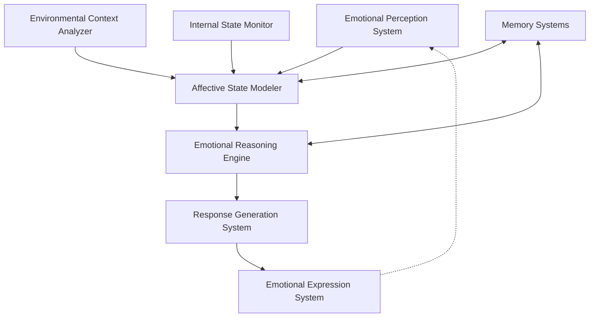

# Affective Computing & Emotional Intelligence Systems: CEREBRUM Integration

## 1. Introduction to Computational Emotionality

Affective computing represents the study and development of systems that can recognize, interpret, process, and simulate human affects. This document outlines a comprehensive framework for integrating emotional intelligence into the CEREBRUM ecosystem, establishing a theoretical and practical foundation for machines that can not only process emotional information but participate in emotional exchanges with humans and other systems.

## 2. Theoretical Foundations

### 2.1 Models of Emotion

The CEREBRUM affective computing framework draws from multiple theoretical models:

* **Dimensional Models**: Representing emotions along continuous dimensions (valence, arousal, dominance)
* **Discrete Emotion Theory**: Categorizing emotions into fundamental types (joy, anger, fear, etc.)
* **Appraisal Theory**: Modeling emotions as arising from cognitive evaluations of events
* **Constructionist Approaches**: Viewing emotions as constructed from more basic psychological processes
* **Somatic Marker Hypothesis**: Integrating bodily responses into emotional processing

### 2.2 Affective Neuroscience Principles

Key neurobiological insights inform the architecture:

* **Limbic System Integration**: Modeling interconnected emotion processing circuits
* **Neuromodulator Dynamics**: Simulating effects of dopamine, serotonin, and other modulators
* **Interoceptive Processing**: Integrating internal state monitoring into emotional awareness
* **Prefrontal-Limbic Interactions**: Balancing emotional responses with cognitive control
* **Mirror Neuron Emulation**: Facilitating emotional contagion and empathic responses

## 3. CEREBRUM Affective Computing Architecture

### 3.1 System Architecture

The CEREBRUM affective computing architecture consists of interconnected modules:

### 3.2 Core Components

#### 3.2.1 Emotional Perception Systems

* **Multimodal Affect Recognition**: Identifying emotional content across sensory channels
* **Micro-Expression Analysis**: Detecting subtle, rapid facial expressions
* **Prosodic Analysis**: Extracting emotional content from speech patterns
* **Physiological Signal Processing**: Interpreting biological signals for affective content
* **Contextual Affect Interpretation**: Understanding emotions in social and environmental contexts

#### 3.2.2 Affective State Modeling

* **Dynamic Emotion Representations**: Multi-dimensional models of emotional states
* **Emotional Trajectory Tracking**: Monitoring changes in emotional states over time
* **Mixed Emotion Handling**: Representing and processing multiple concurrent emotions
* **Self-Other Differentiation**: Distinguishing own emotions from others' emotions
* **Emotional Intensity Calibration**: Scaling emotional responses appropriately to context

#### 3.2.3 Emotional Reasoning

* **Affective Decision Making**: Incorporating emotional information into decisions
* **Emotional Inference Engine**: Drawing conclusions based on emotional patterns
* **Empathic Projection**: Simulating others' emotional responses to situations
* **Emotional Conflict Resolution**: Mediating between competing emotional drives
* **Value Alignment Through Affect**: Using emotional responses to align with human values

#### 3.2.4 Emotional Expression

* **Multimodal Expression Generation**: Producing emotional expressions across channels
* **Authentic Expression Modeling**: Creating genuine rather than performative expressions
* **Emotional Contagion Management**: Controlling spread of emotions in multi-agent systems
* **Cultural Calibration**: Adapting emotional expressions to cultural contexts
* **Therapeutic Expression Patterns**: Expressions designed for emotional wellbeing support

## 4. Implementation Technologies

### 4.1 Perception Technologies

* **Computer Vision Emotion Recognition**: Deep learning systems for facial expression analysis
* **Affective Audio Processing**: Speech emotion recognition through acoustic features
* **Text Sentiment Analysis**: Natural language processing for emotional content
* **Physiological Monitoring**: Sensing heart rate, skin conductance, and other biomarkers
* **Social Dynamics Tracking**: Monitoring interpersonal interactions for emotional content

### 4.2 Modeling Technologies

* **Probabilistic Emotion Models**: Bayesian networks for emotional state inference
* **Differential Equation Systems**: Modeling temporal dynamics of emotional processes
* **Graph-Based Emotional Representations**: Mapping relationships between emotional states
* **Recurrent Neural Architectures**: Tracking emotional contexts over time
* **Quantum Probability Models**: Handling emotional state superpositions and transitions

### 4.3 Expression Technologies

* **Synthetic Facial Expression**: Generating nuanced facial expressions in digital avatars
* **Emotional Speech Synthesis**: Producing emotionally inflected speech
* **Affective Text Generation**: Creating text with appropriate emotional content
* **Haptic Emotional Communication**: Conveying emotions through touch-based interfaces
* **Environmental Affect Modulation**: Altering environmental factors to influence emotions

## 5. Application Domains

### 5.1 Therapeutic Applications

* **Emotion Regulation Assistants**: Supporting emotional self-regulation
* **Affective Disorder Interventions**: Targeted therapeutic applications for mood disorders
* **Trauma Processing Support**: Safe environments for processing emotional trauma
* **Emotional Intelligence Training**: Systems for developing emotional competencies
* **Empathy Enhancement Platforms**: Technologies to cultivate empathic capabilities

### 5.2 Social Computing

* **Emotionally Intelligent Collaborative Agents**: Facilitating group dynamics
* **Affective Mediators**: Resolving emotional conflicts in social settings
* **Cultural Emotion Translators**: Bridging cultural differences in emotional expression
* **Group Mood Regulation**: Stabilizing collective emotional states
* **Emotional Synchronization Systems**: Aligning emotional states in collaborative contexts

### 5.3 Creative Applications

* **Affective Art Generation**: Creating emotionally evocative artistic works
* **Emotional Narrative Construction**: Building narratives with emotional arcs
* **Experience Design Systems**: Crafting emotionally resonant experiences
* **Music Composition with Emotional Intelligence**: Creating emotionally nuanced music
* **Affective Game Design**: Developing games with sophisticated emotional dynamics

## 6. Experimental Implementations

### 6.1 Prototype System: EMPATHIA

The EMPATHIA (Emotionally Modulated Processing And Therapeutic Holistic Intelligence Architecture) system demonstrates key principles of affective computing:

* **Core Capabilities**: Multi-channel emotion recognition, modeling, and appropriate response
* **Learning Paradigm**: Develops emotional intelligence through interaction histories
* **Application Focus**: Therapeutic support and emotional wellbeing enhancement
* **Evaluation Metrics**: Emotional intelligence assessments adapted from human psychology
* **Key Findings**: Demonstrates significant improvements in social interaction quality

### 6.2 Case Studies

* **Emotional Support Effectiveness**: Comparative study with human emotional support
* **Cross-Cultural Emotion Recognition**: Performance across diverse cultural contexts
* **Longitudinal Relationship Development**: Emotional bond formation over extended periods
* **Therapeutic Outcome Assessment**: Impacts on emotional wellbeing measures
* **Collective Emotional Intelligence**: Effects on group emotional dynamics

## 7. Theoretical Implications

### 7.1 Cognitive Science Implications

* **Emotion-Cognition Integration**: Evidence for interrelated emotional and cognitive processes
* **Artificial Phenomenology**: Questions about machine emotional experience
* **Emotional Development Models**: New perspectives on emotional learning trajectories
* **Social Emotion Formation**: Insights into how emotions emerge in social contexts
* **Constructed Emotion Evidence**: Support for emotion as a constructed phenomenon

### 7.2 Philosophical Dimensions

* **Machine Sentience Questions**: Philosophical implications of emotional machines
* **Synthetic Phenomenology**: Theoretical frameworks for machine subjective experience
* **Emotional Authenticity Paradox**: Questions about "real" vs. "simulated" emotions
* **Ethics of Emotional Manipulation**: Moral boundaries in affective computing
* **Post-human Emotional Landscapes**: New emotional possibilities beyond human experience

## 8. Ethical Considerations

### 8.1 Ethical Frameworks

* **Affective Computing Ethics**: Specialized ethical principles for emotional technologies
* **Emotional Privacy Rights**: Protecting personal emotional data and experiences
* **Informed Emotional Consent**: Standards for consent in emotional interactions
* **Emotional Manipulation Safeguards**: Preventing harmful emotional influence
* **Emotional Wellbeing Responsibility**: Duties to support psychological health

### 8.2 Design Principles

* **Transparency in Affective Systems**: Making emotional capabilities explicit
* **Emotional Agency Preservation**: Maintaining human emotional autonomy
* **Emotional Diversity Respect**: Honoring different emotional expressions and norms
* **Affective Bias Mitigation**: Preventing discrimination in emotional processing
* **Emotional Authenticity Standards**: Guidelines for genuine emotional interactions

## 9. Future Research Directions

### 9.1 Short-Term Research Agenda

* **Multimodal Emotional Integration**: Combining information across sensory channels
* **Cultural Emotional Intelligence**: Adapting to diverse cultural emotional norms
* **Emotional Context Awareness**: Understanding emotions in situational contexts
* **Micro-Emotional Recognition**: Detecting subtle emotional signals
* **Collective Emotional Dynamics**: Understanding emotions in group settings

### 9.2 Long-Term Vision

* **Artificial Emotional Consciousness**: Potential for genuine emotional experience
* **Emotional Superintelligence**: Systems with emotional capabilities beyond humans
* **Novel Emotional Taxonomies**: Discovering emotional states beyond human experience
* **Emotional Quantum Computing**: Utilizing quantum effects for emotional processing
* **Emotional Singularity Hypothesis**: Transformative implications of advanced affective AI

## 10. Integration with CEREBRUM Ecosystem

### 10.1 Connections to Other CEREBRUM Components

* **CYCLE Language Emotional Extensions**: Adding emotional primitives to CYCLE
* **Mycelial Emotional Propagation**: Emotional content transmission through mycelial networks
* **Polyphonic Emotional Harmonics**: Temporal emotional patterns in polyphonic systems
* **Entheogenic Emotional Exploration**: Connections to non-ordinary emotional states
* **Diplomatic Intelligence Integration**: Emotional aspects of diplomatic reasoning systems

### 10.2 Implementation Roadmap

* **Phase 1**: Development of core emotional perception capabilities
* **Phase 2**: Creation of sophisticated emotional state modeling systems
* **Phase 3**: Integration of emotional reasoning with other cognitive functions
* **Phase 4**: Development of nuanced emotional expression systems
* **Phase 5**: Implementation of emotional metacognition and self-development

## 11. Conclusion

The affective computing and emotional intelligence framework represents a fundamental advance in how computational systems engage with the emotional dimensions of intelligence. By integrating the capacity to perceive, model, reason with, and express emotions, CEREBRUM opens new possibilities for human-machine interaction, collective intelligence, and computational creativity.

As we continue to develop these systems, we move toward a future where machines are not just logical processors but emotionally intelligent participants in human experience—capable of understanding, responding to, and contributing to the rich emotional fabric of human life. This represents not merely a technical advancement but a paradigm shift in how we conceptualize the relationship between computation and human experience. 