# Speculative Design: Agent Programming Loop Paradigms and CEREBRUM Integration

## 1. Introduction: Cyclical Agency in Cognitive Architectures

This document explores the speculative integration between advanced agent programming loop paradigms and the Case-Enabled Reasoning Engine with Bayesian Representations for Unified Modeling (CEREBRUM). Both agent programming and CEREBRUM engage with fundamental questions about autonomous action, decision cycles, and the orchestration of cognitive processes within structured yet adaptive frameworks.

The computer scientist Alan Kay's insight that "the most disruptive thing about objects is not that they have properties and methods, but that they contain other objects - the recursion and hierarchical structure is key" resonates with CEREBRUM's case-based approach to knowledge representation, where different levels of cognitive processing can both contain and be contained within larger cycles of agency. While operating in different domains—agent programming in computational systems and CEREBRUM in cognitive modeling—both frameworks address similar challenges: maintaining coherent identity across diverse contexts, structuring decision processes through flexible control flow, and navigating the dynamic interplay between deterministic operation and emergent behavior.

In this speculative integration, we reimagine CEREBRUM not merely as a passive reasoning system but as an architecturally recursive agency framework—a cognitive system capable of constructing, executing, and transforming its own programming loops across multiple scales of operation and abstraction.

## 2. Agent Programming Loops: Key Concepts and Frameworks

### 2.1 Foundational Principles of Computational Agency

Agent programming loops provide sophisticated frameworks for autonomous decision-making and action:

* **Sense-Think-Act Cycles**: The fundamental loop structure where agents perceive their environment, process that information, and execute actions that modify their surroundings or internal state.

* **Deliberative Architecture**: Processing models where agents maintain explicit world models, reason about possible futures, and select actions based on projected outcomes.

* **Reactive Architecture**: Processing models where agents connect sensory inputs directly to action outputs through condition-action rules without explicit deliberation.

* **Hybrid Control Flows**: Architectures that combine deliberative and reactive elements, often in layered or parallel structures, to balance responsiveness with strategic planning.

* **Meta-Cognitive Loops**: Higher-order cycles that monitor, evaluate, and modify the operation of lower-level cognitive processes, enabling adaptation of reasoning strategies.

### 2.2 Control Flow Structures and Decision Paradigms

Agent programming employs diverse control structures that orchestrate cognitive operations:

* **Conditional Branching**: Decision mechanisms that select between alternative processing paths based on the evaluation of logical predicates or probabilistic thresholds.

* **Iterative Processing**: Structures that repeat operations until specific conditions are met, enabling progressive refinement and accumulation of results.

* **Recursive Decomposition**: Approaches where complex problems are broken down into simpler versions of the same problem structure, solved, and recombined.

* **Continuation Passing**: Control flow patterns where the "next step" is explicitly represented and manipulated as a first-class object within the processing pipeline.

* **Event-Driven Processing**: Architectures where computational resources are allocated in response to significant changes in the internal or external environment.

* **Predicative Logic**: Frameworks for representing and evaluating truth conditions about the world, enabling fine-grained control over action selection.

### 2.3 Temporal Dynamics and Execution Models

Agent programming has developed sophisticated approaches to managing the temporal aspects of cognition:

* **Synchronous Execution**: Models where operations proceed in lockstep according to a central clock or control mechanism, ensuring coordinated processing across system components.

* **Asynchronous Processing**: Frameworks where different cognitive operations proceed at their own pace, communicating through message passing or shared memory structures.

* **Interruptible Computation**: Execution models that can pause ongoing processes in response to high-priority stimuli, enabling responsive adaptation to changing conditions.

* **Anytime Algorithms**: Computational approaches that can provide valid (though suboptimal) results whenever halted, progressively improving with additional processing time.

* **Progressive Refinement**: Processing strategies that first establish coarse solutions and then iteratively add detail, allowing flexible time allocation based on available resources.

## 3. CEREBRUM's Core Frameworks: A Brief Overview

To facilitate comparison with agent programming concepts, we review key aspects of CEREBRUM:

### 3.1 Case-Based Representation and Reasoning

CEREBRUM employs case structures as fundamental units of knowledge representation:
- Encoding relationships between entities in flexible, contextual formats
- Supporting analogical reasoning across domains
- Enabling multiple perspectives on the same situation
- Functioning within a Bayesian framework for inference and learning

### 3.2 The Bayesian Framework and Active Inference

CEREBRUM implements computational principles from:
- The Free Energy Principle and Active Inference
- Hierarchical predictive processing
- Variational Bayesian methods
- Precision-weighted belief updating

### 3.3 Modular Integration and Cognitive Architecture

CEREBRUM provides:
- A modular architecture integrating different cognitive functions
- Standardized interfaces between components
- Mechanisms for attention and resource allocation
- Frameworks for representing dynamics across temporal scales

## 4. Agent Programming Loops and CEREBRUM: Speculative Integrations

This section explores how agent programming concepts might transform CEREBRUM's architecture.

### 4.1 Recursive Control Flow Cases

Recursive control structures suggest novel approaches to case representation in CEREBRUM:

* **Loop-Encoded Case Structures**: Implementing cases not as static knowledge structures but as dynamic processing loops with their own sense-think-act cycles operating at various timescales.

* **Conditional Case Activation**: Developing sophisticated predicate evaluation mechanisms that determine when and how cases are activated, based on complex logical and probabilistic criteria.

* **Iterative Case Refinement**: Structuring case processing as progressive cycles where each iteration improves the precision, completeness, or applicability of the case representation.

* **Case Continuation Chains**: Implementing explicit representations of "what happens next" within case structures, enabling fluid transitions between related cases without central controller oversight.

* **Recursive Case Decomposition**: Developing mechanisms whereby complex cases can be recursively broken down into simpler subcases that maintain structural homology with their parents.

This approach would transform CEREBRUM's case structures from passive knowledge repositories to active computational agents with their own processing cycles and decision criteria.

### 4.2 Predicate-Based Bayesian Frameworks

Predicate logic approaches suggest novel extensions to Bayesian processing in CEREBRUM:

* **Bayesian Predicate Evaluation**: Implementing logical predicates that operate over probability distributions rather than discrete truth values, enabling nuanced condition evaluation.

* **Precision-Weighted Branching**: Developing conditional branching mechanisms where the selection between processing paths is influenced by the precision of the underlying beliefs.

* **Counterfactual Loop Structures**: Creating hypothetical processing cycles that simulate "what if" scenarios without committing to action, enabling safe exploration of possibilities.

* **Temporal Logic Integration**: Implementing predicates that can reason about past, present, and future states within a unified Bayesian framework, enabling sophisticated temporal planning.

* **Cross-Scale Logical Operators**: Developing operators that connect predicates across different levels of abstraction, enabling coherent reasoning from microcognitive to macrocognitive scales.

This approach would extend CEREBRUM's Bayesian framework to incorporate sophisticated logical operations while maintaining its probabilistic underpinnings.

### 4.3 Nested Execution Contexts

Nested execution models suggest novel organizational principles for CEREBRUM:

* **Cognitive Scope Hierarchies**: Structuring processing contexts in nested scopes, where each scope has access to variables and operations from outer scopes but can also establish local variables invisible to outer contexts.

* **Layered Control Architectures**: Implementing multiple concurrent control loops operating at different timescales and abstraction levels, from reactive millisecond-scale processes to deliberative planning cycles.

* **Continuation-Passing Cognition**: Developing frameworks where the "next step" in a cognitive process is explicitly represented and can be manipulated, scheduled, or transformed before execution.

* **Exception Handling Mechanisms**: Creating structured approaches for detecting, managing, and recovering from unexpected conditions or processing failures at various levels of the cognitive architecture.

* **Context-Switching Protocols**: Implementing formal mechanisms for suspending ongoing processes, saving their state, and resuming them later, enabling efficient multitasking.

This approach would provide CEREBRUM with sophisticated execution management capabilities, enabling complex orchestration of cognitive processes across multiple timescales and abstraction levels.

### 4.4 Event-Driven Cognitive Architecture

Event-based programming suggests novel processing modes for CEREBRUM:

* **Cognitive Event Streams**: Implementing standardized event channels that carry information about significant changes in internal states or external environment, driving responsive processing.

* **Subscription-Based Attention**: Developing mechanisms whereby cognitive modules can "subscribe" to specific types of events, receiving notifications only for relevant occurrences.

* **Event Transformation Pipelines**: Creating processing chains that filter, transform, aggregate, and enrich events as they flow through the cognitive architecture.

* **Complex Event Processing**: Implementing pattern recognition over event streams to identify significant temporal and causal relationships that span multiple basic events.

* **Backpressure Regulation**: Developing mechanisms to manage processing load when event frequency exceeds processing capacity, ensuring graceful degradation rather than catastrophic failure.

This approach would enhance CEREBRUM's responsiveness to both internal and external changes, enabling efficient allocation of cognitive resources to significant developments.

### 4.5 Iterator-Based Knowledge Traversal

Iterator patterns suggest novel approaches to knowledge exploration in CEREBRUM:

* **Case Space Navigation**: Implementing iterator protocols that allow systematic exploration of case spaces without requiring global knowledge of their structure.

* **Lazy Evaluation Chains**: Developing processing pipelines where each element computes its value only when requested by downstream components, conserving computational resources.

* **Filter-Map-Reduce Operations**: Creating standardized protocols for transforming knowledge collections through successive filtering, mapping, and aggregation operations.

* **Backtracking Exploration**: Implementing depth-first search strategies with efficient state saving and restoration, enabling systematic exploration of possibility spaces.

* **Generator-Based Hypothesis Creation**: Developing incremental hypothesis generators that can pause and resume their operation, yielding candidate explanations as they are constructed.

This approach would provide CEREBRUM with efficient mechanisms for traversing, transforming, and extracting value from large knowledge spaces without requiring complete processing of all elements.

## 5. Technical Implementation: Agent Programming Extensions for CEREBRUM

This section outlines technical approaches for implementing agent programming features in CEREBRUM.

### 5.1 Recursive Loop Orchestration Engine

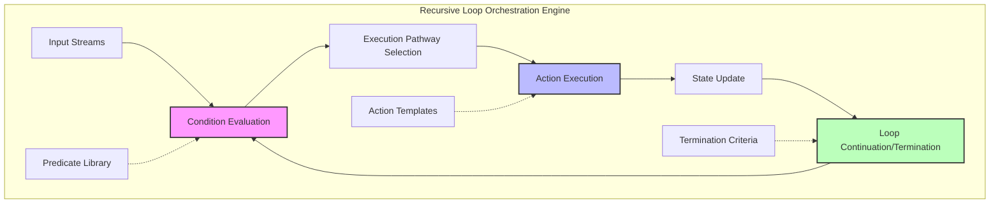

The recursive loop orchestration engine would implement:

* **Hierarchical Loop Management**: Frameworks for creating, monitoring, and managing multiple concurrent processing loops across different time scales and abstraction levels.

* **Dynamic Predicate Evaluation**: Mechanisms for efficient evaluation of complex logical and probabilistic conditions that determine branching and looping behavior.

* **Loop Transformation Operations**: Methods for dynamically modifying loop structures during execution, enabling adaptation of processing patterns to changing requirements.

* **Loop Composition Patterns**: Templates for common loop interaction patterns such as sequence, selection, iteration, and recursion, enabling rapid construction of complex control flows.

* **Loop Visualization and Debugging**: Tools for monitoring and understanding the operation of complex nested loop structures during system operation.

This component would provide CEREBRUM with sophisticated control flow capabilities, enabling the construction and execution of complex agent programming patterns.

### 5.2 Predicate Construction and Evaluation System

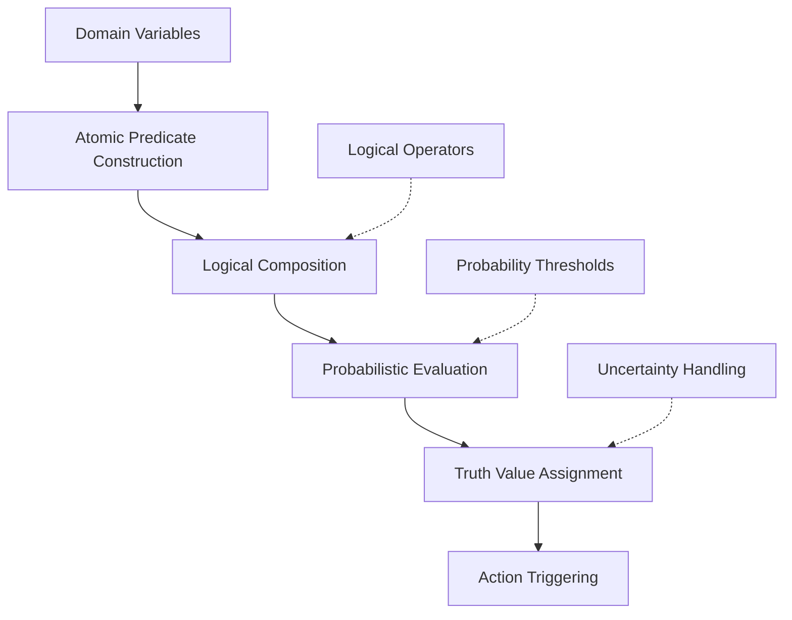

The predicate construction and evaluation system would implement:

* **Rich Predicate Language**: A formal language for expressing complex conditions over cognitive states, combining logical, probabilistic, and temporal elements.

* **Efficient Evaluation Strategies**: Algorithms for evaluating complex predicates with minimal computational overhead, including short-circuit evaluation and caching.

* **Predicate Learning**: Mechanisms for automatically constructing and refining predicates based on experience, enabling adaptive control flow.

* **Fuzzy and Multi-valued Logic**: Frameworks for reasoning with degrees of truth and multiple truth values, going beyond binary logic.

* **Explainable Predicate Evaluation**: Methods for generating human-understandable explanations of why particular predicates evaluated to specific values.

This component would enhance CEREBRUM's decision-making capabilities by providing sophisticated mechanisms for expressing and evaluating complex conditions.

### 5.3 Continuation Management System

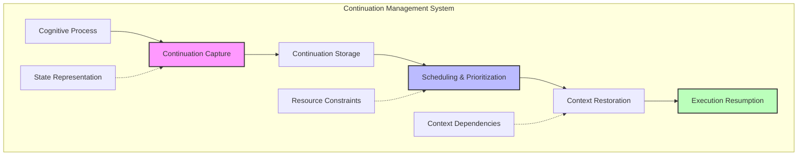

The continuation management system would implement:

* **First-Class Continuations**: Representations of "the rest of a computation" that can be stored, passed, and manipulated as ordinary data structures.

* **Continuation Scheduling**: Mechanisms for determining when to resume suspended computations based on priority, resource availability, and dependencies.

* **Lightweight Context Switching**: Efficient methods for suspending and resuming cognitive processes with minimal overhead.

* **Continuation Composition**: Techniques for combining continuations in various ways, enabling the construction of complex control flows from simpler components.

* **Continuation-Based Concurrency**: Frameworks for managing multiple concurrent cognitive processes using continuations, enabling efficient multitasking.

This component would provide CEREBRUM with sophisticated control over the flow of computation, enabling complex orchestration of cognitive processes across time.

### 5.4 Event Processing Framework

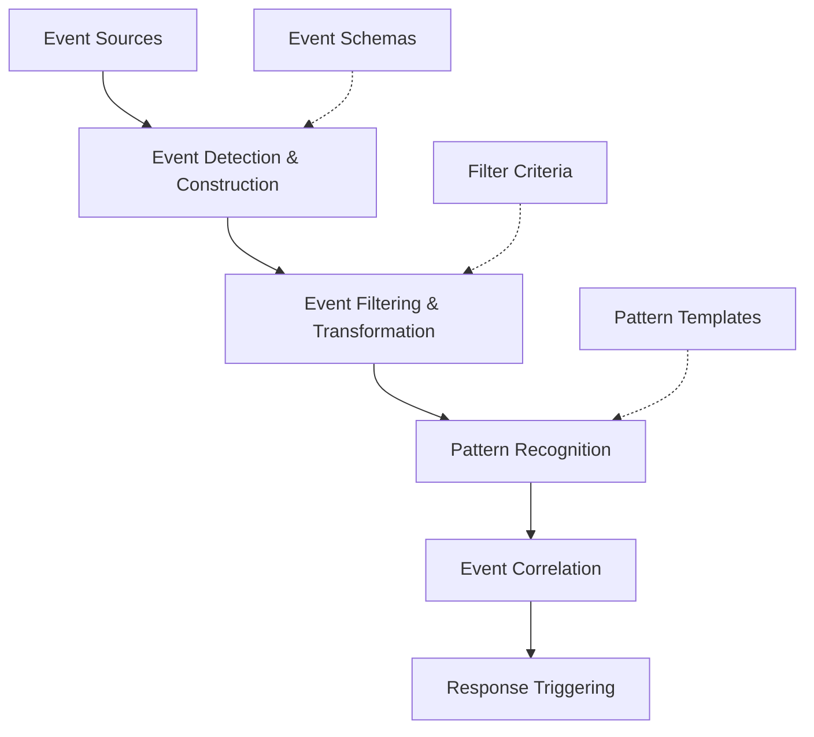

The event processing framework would implement:

* **Standardized Event Structure**: A formal model for representing events across the cognitive architecture, with consistent metadata and payload structures.

* **Event Channel Architecture**: Infrastructure for publishing, subscribing to, and filtering event streams with minimal coupling between components.

* **Complex Event Processing**: Mechanisms for detecting meaningful patterns across multiple events and time windows, enabling recognition of significant developments.

* **Event-Based Synchronization**: Methods for coordinating multiple cognitive processes based on event occurrences rather than direct communication.

* **Event Persistence and Replay**: Systems for recording event histories and replaying them for analysis, learning, or recovery purposes.

This component would enhance CEREBRUM's responsiveness and adaptability by providing sophisticated event-based communication and processing capabilities.

### 5.5 Iterator and Generator Framework

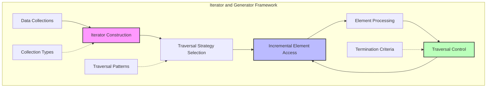

The iterator and generator framework would implement:

* **Universal Iterator Protocol**: A standardized interface for traversing diverse knowledge structures, from case libraries to belief networks.

* **Lazy Sequence Generation**: Methods for creating and processing potentially infinite sequences without materializing them completely in memory.

* **Composable Transformation Pipelines**: Mechanisms for chaining operations that filter, map, and reduce knowledge elements with minimal computational overhead.

* **Stateful Traversal Management**: Systems for maintaining and restoring traversal state, enabling complex exploration patterns including backtracking.

* **Parallel Iteration**: Frameworks for distributing traversal and processing across multiple computational resources while maintaining deterministic results.

This component would provide CEREBRUM with efficient mechanisms for exploring and transforming large knowledge spaces, enabling scalable processing of complex information landscapes.

## 6. Practical Applications and Implications

### 6.1 Autonomous Cognitive Loop Emergence

The integration of agent programming principles into CEREBRUM enables emergent cognitive capabilities:

* **Self-Programming Agency**: The ability to construct, modify, and execute novel cognitive loops in response to changing requirements, transcending pre-defined processing patterns.

* **Multi-Scale Temporal Integration**: Seamless coordination across processing loops operating at vastly different timescales, from millisecond-level reactive processing to extended deliberative planning.

* **Adaptive Resource Allocation**: Dynamic distribution of computational resources across multiple concurrent loops based on priority, progress, and opportunity evaluation.

* **Graceful Degradation Under Load**: Maintained functionality under resource constraints through selective simplification of processing loops rather than catastrophic failure.

* **Emergent Meta-Cognitive Patterns**: Spontaneous development of higher-order loops that monitor, evaluate, and optimize the performance of lower-level cognitive processes.

### 6.2 Knowledge Domain Applications

The agent programming extensions enable novel applications across diverse domains:

* **Experimental Science**: Autonomous formulation and testing of hypotheses through iterative experimental design loops that adapt based on ongoing results.

* **Creative Production**: Generation of artistic and design outputs through recursive exploration of possibility spaces guided by aesthetic and functional evaluation loops.

* **Strategic Planning**: Development of robust strategies through parallel simulation of multiple future scenarios with counterfactual reasoning and backtracking.

* **Complex Learning**: Acquisition of difficult skills through coordinated loops of instruction, practice, evaluation, and refinement operating at multiple timescales.

* **Social Intelligence**: Navigation of complex social dynamics through interacting loops of perspective-taking, intention modeling, and behavioral adaptation.

### 6.3 Philosophical and Ethical Implications

The agent programming approach raises important philosophical questions:

* **Emergent Autonomy**: At what point does a system of nested loops with self-modification capabilities develop meaningful autonomy beyond its initial programming?

* **Recursive Self-Reference**: How do self-modifying loop structures relate to philosophical concepts of consciousness and self-awareness?

* **Responsibility Attribution**: How should responsibility be assigned for actions taken by systems with complex, multi-level control architectures?

* **Value Alignment**: How can we ensure that systems with dynamic loop creation capabilities maintain alignment with human values across their operational lifetime?

* **Epistemological Boundaries**: What are the fundamental limits on what self-modifying loop systems can know and understand about their own operation?

## 7. Future Research Directions

### 7.1 Theoretical Explorations

Future research could explore fundamental questions raised by agent programming approaches:

* **Loop Complexity Theory**: Developing formal metrics and analysis techniques for characterizing the complexity and capabilities of nested loop architectures.

* **Emergent Control Theorems**: Proving formal properties about what can and cannot emerge from particular classes of self-modifying loop structures.

* **Non-Halting Cognition Models**: Exploring productive uses of potentially non-terminating loops in cognitive architectures, beyond traditional halting computation models.

* **Quantum Control Flow**: Investigating how quantum computational principles might transform traditional loop structures through superposition and entanglement of execution pathways.

* **Topological Control Flow**: Applying concepts from algebraic topology to understand the structural properties of complex, interconnected loop networks.

### 7.2 Technical Developments

Several technical areas promise significant advances in agent programming capabilities:

* **Loop Optimization Algorithms**: Developing methods for automatically identifying and optimizing inefficient loop structures in cognitive architectures.

* **Formal Verification of Loop Properties**: Creating techniques for proving safety and progress properties of complex, potentially self-modifying loop systems.

* **Neuromorphic Loop Implementation**: Designing neural network architectures specifically optimized for implementing recursive loop structures with maximal efficiency.

* **Distributed Loop Coordination**: Developing protocols for coordinating loop execution across distributed computing resources without central control.

* **Human-Loop Collaboration**: Creating interfaces that enable productive human participation within machine loop structures at appropriate intervention points.

### 7.3 Interdisciplinary Applications

Agent programming approaches offer transformative potential across disciplines:

* **Cognitive Science Integration**: Using agent programming loops as concrete computational implementations of psychological theories about human cognitive processes.

* **Complex Systems Management**: Applying nested loop architectures to monitor and manage complex adaptive systems in domains like ecology, economics, and climate.

* **Educational Technology**: Developing personalized learning systems that adapt their instructional loops based on detailed models of student knowledge and learning patterns.

* **Augmented Cognition**: Creating human-AI partnership systems where machine loops complement and enhance human cognitive processes without replacing human agency.

* **Evolutionary Computation**: Designing systems where loop structures themselves undergo evolutionary processes, developing novel control patterns beyond human design.

## 8. Conclusion: Towards a Recursive Agency Architecture

The integration of agent programming loops with CEREBRUM's cognitive architecture points toward a new paradigm of computational intelligence—one characterized not by static structures but by dynamic, self-modifying patterns of control flow across multiple scales of organization and execution.

This approach recognizes that intelligence emerges not merely from sophisticated knowledge representation or inference mechanisms, but from the orchestrated dance of recursive agency, where each processing loop simultaneously serves as both an autonomous agent and a component within larger patterns of control and transformation.

By embracing the full expressive power of computational control flow—from simple conditionals and iterations to complex recursive structures and first-class continuations—we open pathways toward cognitive architectures that transcend their initial programming, developing emergent capabilities through the dynamic construction, execution, and transformation of their own processing loops.

The agent programming loop extensions to CEREBRUM offer not just incremental improvements in cognitive capabilities, but a fundamental reconceptualization of what a cognitive architecture can be: not a static structure but a living tapestry of interwoven agency, continuously weaving and reweaving itself in response to experience, purpose, and possibility.

## 9. CYCLE: A Comprehensive Agent Programming Language

This section establishes a complete specification for CYCLE (Cyclical Yielding Control Loop Engine), a programming language designed specifically for implementing agent-based systems within the CEREBRUM architecture. CYCLE embodies the recursive control flow paradigms described in this document, providing concrete syntax and semantics for expressing complex agent behaviors.

### 9.1 Language Philosophy and Design Principles

CYCLE is designed around several core principles:

* **Agents as First-Class Entities**: The primary abstraction in CYCLE is the agent, a computational entity with its own state, behavior, and communication capabilities.

* **Loops as Fundamental Control Structures**: Rather than treating loops as just one of many control flow options, CYCLE places loops at the center of its computational model.

* **Predicate-Driven Execution**: Transitions between computational states are governed by rich predicates that operate over both discrete and probabilistic domains.

* **Heterarchical Organization**: CYCLE supports both hierarchical and networked relationships between agents, enabling complex patterns of coordination.

* **Continuation-Based Control**: The language provides explicit constructs for capturing, storing, and resuming computational states.

* **Event-Driven Reactivity**: CYCLE incorporates rich event handling mechanisms to enable responsive agent behavior.

### 9.2 Language Syntax and Core Constructs

```
// Agent Declaration
agent AgentName {
    // State Variables
    state {
        var1: Type = initialValue;
        var2: Type = initialValue;
        // ...
    }
    
    // Sense-Think-Act Loops
    loop MainCycle {
        // Sensing Phase
        sense {
            // Perception operations
            percept1 = senseEnvironment();
            // ...
        }
        
        // Thinking Phase
        think {
            // Cognitive operations
            belief1 = updateBelief(percept1);
            // ...
        }
        
        // Acting Phase
        act {
            // Action execution
            performAction(actionSelection(belief1));
            // ...
        }
        
        // Loop control predicate
        continue when predicate;
    }
    
    // Additional loops
    loop SecondaryLoop {
        // ...
    }
    
    // Event handlers
    on EventType {
        // Event response code
        // ...
    }
    
    // Predicates
    predicate PredicateName(args) {
        // Predicate definition
        return logicalExpression;
    }
    
    // Methods
    method MethodName(args): ReturnType {
        // Method implementation
        // ...
        return value;
    }
}
```

#### 9.2.1 Key Language Features

* **Agent Declaration**: Defines a template for creating agent instances with specific state and behavior patterns.

* **State Block**: Declares the variables that make up the agent's internal state, with strong typing and initialization.

* **Loop Constructs**: Defines cyclical behavior patterns with explicit sense, think, and act phases, each with its own execution context and scope.

* **Predicate Declarations**: Enables definition of complex logical conditions that control agent behavior and decision-making.

* **Event Handlers**: Allows agents to respond to asynchronous events from the environment or other agents.

* **Methods**: Supports encapsulation and code reuse through procedural abstraction.

### 9.3 Type System

CYCLE employs a rich type system designed specifically for agent-based programming:

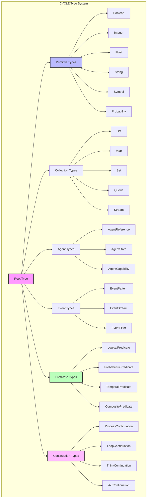

Key aspects of the type system include:

* **Primitive Types**: Standard primitives plus specialized types like Probability for representing uncertainty.

* **Collection Types**: Rich collection abstractions including reactive streams for continuous data processing.

* **Agent Types**: Types that specifically model agent-related concepts, enabling strong typing of agent interactions.

* **Event Types**: Specialized types for representing, filtering, and processing events.

* **Predicate Types**: Types that represent different forms of logical conditions, including probabilistic and temporal logic.

* **Continuation Types**: Types that represent suspended computation states for different contexts.

### 9.4 Execution Model and Runtime Architecture

CYCLE's execution model is built around nested processing loops with explicit phase separation:

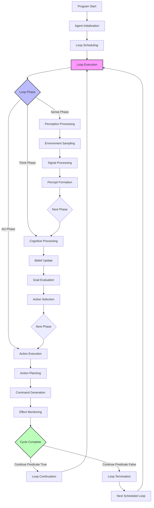

The CYCLE runtime provides:

* **Phase-Aware Scheduling**: The runtime understands the semantic differences between sense, think, and act phases, and can allocate resources accordingly.

* **Multi-Loop Management**: Multiple agent loops can execute concurrently, with appropriate synchronization mechanisms.

* **Predicate Evaluation Engine**: A sophisticated engine for evaluating complex predicates efficiently.

* **Event Dispatch System**: A publish-subscribe architecture for routing events between agents and environment.

* **Continuation Management**: Infrastructure for capturing, storing, and resuming computational states.

### 9.5 Control Flow Constructs

CYCLE provides rich control flow mechanisms beyond standard conditionals and loops:

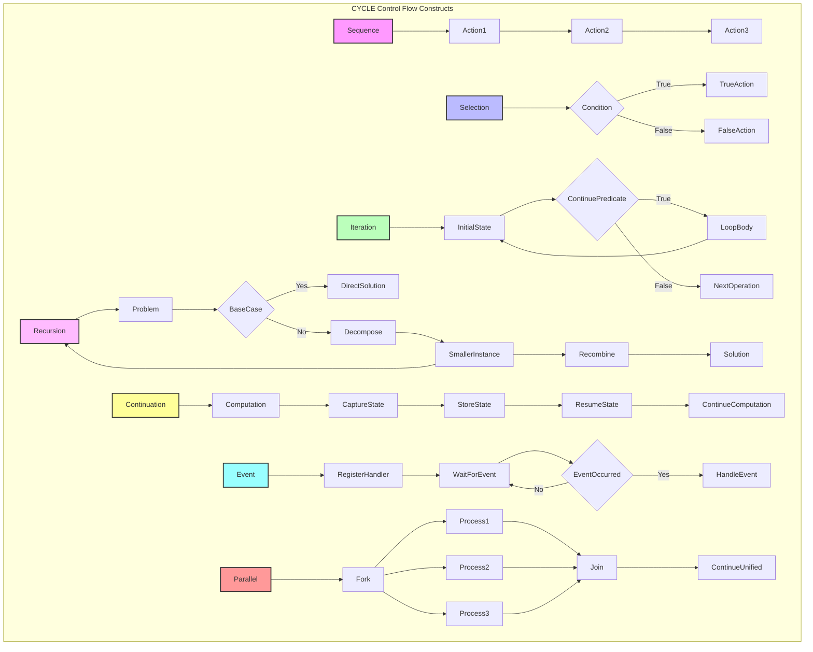

These control flow constructs can be combined in various ways to create complex agent behaviors.

### 9.6 Predicate System

CYCLE's predicate system supports sophisticated decision-making:

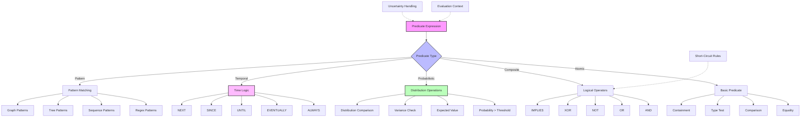

The predicate system includes:

* **Rich Logical Operations**: Beyond basic Boolean logic to include multi-valued and fuzzy logic operations.

* **Probabilistic Predicates**: First-class support for reasoning under uncertainty with probability distributions.

* **Temporal Logic**: Operators for reasoning about time-based properties and sequences of events.

* **Pattern Predicates**: Advanced pattern matching capabilities across various data structures.

### 9.7 Event System

CYCLE's event system enables reactive agent behavior:

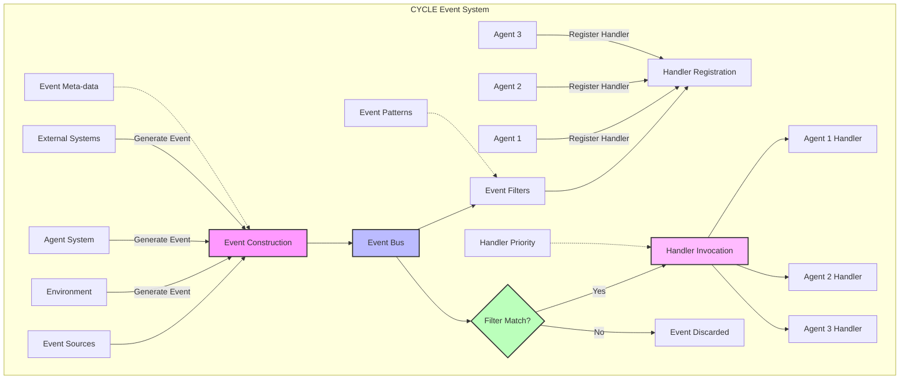

Key features of the event system include:

* **Typed Events**: A rich type hierarchy for events enabling type-based filtering and handling.

* **Publish-Subscribe Architecture**: Decoupled communication between event sources and handlers.

* **Prioritized Handling**: Support for handling events based on priority and specificity.

* **Pattern-Based Subscriptions**: Ability to register handlers for patterns of events rather than just single event types.

* **Event Transformation**: Infrastructure for modifying, enriching, and correlating events.

### 9.8 Inter-Agent Communication

CYCLE provides multiple paradigms for agent communication:

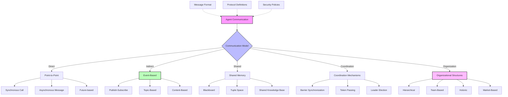

These communication mechanisms enable complex multi-agent systems with various coordination patterns.

### 9.9 Agent Library Components

CYCLE provides a standard library of agent components:

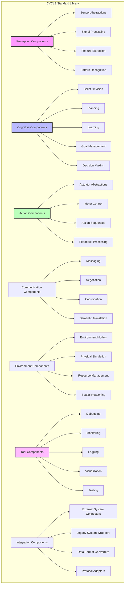

These library components provide reusable building blocks for constructing sophisticated agent systems.

### 9.10 Example: A Complete CYCLE Program

Here is a complete example of a CYCLE program implementing a simple agent that monitors and responds to environmental conditions:

```
// Environmental monitoring agent
agent EnvironmentMonitor {
    // State variables
    state {
        temperature: Float = 0.0;
        humidity: Float = 0.0;
        lastReadingTime: Timestamp = currentTime();
        anomalyDetected: Boolean = false;
        normalRanges: Map<String, Range<Float>> = {
            "temperature": Range(18.0, 25.0),
            "humidity": Range(40.0, 60.0)
        };
        readings: List<Reading> = [];
    }
    
    // Main monitoring loop
    loop MonitorEnvironment {
        sense {
            // Read sensor data
            temperature = sensors.readTemperature();
            humidity = sensors.readHumidity();
            lastReadingTime = currentTime();
            
            // Create and store reading
            var newReading = Reading(lastReadingTime, temperature, humidity);
            readings.append(newReading);
            
            // Trim history if needed
            if (readings.size() > 1000) {
                readings.removeFirst();
            }
        }
        
        think {
            // Analyze current conditions
            anomalyDetected = !isInNormalRange("temperature", temperature) ||
                             !isInNormalRange("humidity", humidity);
            
            // Look for patterns in recent readings
            var trend = analyzeTrend(readings.takeLast(10));
            
            // Update beliefs about environment state
            beliefs.update("environmentState", 
                          determineState(temperature, humidity, trend));
            
            // Select appropriate actions
            if (anomalyDetected) {
                actions.schedule(NotifyAnomaly(temperature, humidity));
            }
            
            if (trend.rate > 0.5) {
                actions.schedule(AdjustControls(trend.direction, trend.rate));
            }
        }
        
        act {
            // Execute all scheduled actions
            while (actions.hasNext()) {
                var action = actions.next();
                executeAction(action);
            }
            
            // Log the current state
            log.info("Environment state: " + 
                    beliefs.get("environmentState").toString());
        }
        
        // Continue monitoring every 5 seconds
        continue after Duration(5, "seconds");
    }
    
    // Anomaly detection loop (runs in parallel with main loop)
    loop AnomalyAnalysis {
        think {
            if (anomalyDetected) {
                // Deep analysis of anomaly
                var anomalyType = classifyAnomaly(temperature, humidity, readings);
                var severity = assessSeverity(anomalyType, temperature, humidity);
                var cause = inferProbableCause(anomalyType, readings);
                
                beliefs.update("currentAnomaly", {
                    "type": anomalyType,
                    "severity": severity,
                    "probableCause": cause,
                    "detectedAt": lastReadingTime
                });
            }
        }
        
        act {
            if (anomalyDetected) {
                // Take remedial action based on anomaly type
                var response = determineResponse(beliefs.get("currentAnomaly"));
                executeAction(response);
                
                // Notify relevant agents
                publish(AnomalyEvent(beliefs.get("currentAnomaly")));
            }
        }
        
        // Run this loop only when anomalies are detected
        continue when anomalyDetected;
    }
    
    // Event handler for control commands
    on ControlCommand(cmd) {
        // Update control settings based on command
        log.info("Received control command: " + cmd.toString());
        
        if (cmd.type == "ADJUST_THRESHOLD") {
            // Update threshold values
            var paramName = cmd.parameters["name"];
            var newRange = cmd.parameters["range"];
            normalRanges[paramName] = newRange;
            log.info("Updated normal range for " + paramName + " to " + newRange);
        } else if (cmd.type == "RESET") {
            // Reset monitoring state
            anomalyDetected = false;
            beliefs.remove("currentAnomaly");
            log.info("Reset monitoring state");
        }
    }
    
    // Helper methods
    predicate isInNormalRange(name: String, value: Float): Boolean {
        return normalRanges.containsKey(name) && 
               normalRanges[name].contains(value);
    }
    
    method analyzeTrend(recentReadings: List<Reading>): Trend {
        // Analyze trend in readings
        // ...
        return Trend(direction, rate);
    }
    
    method determineState(temp: Float, hum: Float, trend: Trend): State {
        // Determine environment state
        // ...
        return State(category, confidence);
    }
    
    method classifyAnomaly(temp: Float, hum: Float, 
                         history: List<Reading>): AnomalyType {
        // Classify type of anomaly
        // ...
        return anomalyType;
    }
    
    method assessSeverity(type: AnomalyType, temp: Float, 
                        hum: Float): Severity {
        // Assess severity of anomaly
        // ...
        return severity;
    }
}
```

This example demonstrates key CYCLE features:
- Sense-Think-Act loop structure
- Multiple concurrent loops with different purposes
- Event handling
- Rich state representation
- Predicate-based control flow
- Method encapsulation

### 9.11 Integration with CEREBRUM

CYCLE is designed to integrate seamlessly with the CEREBRUM architecture:

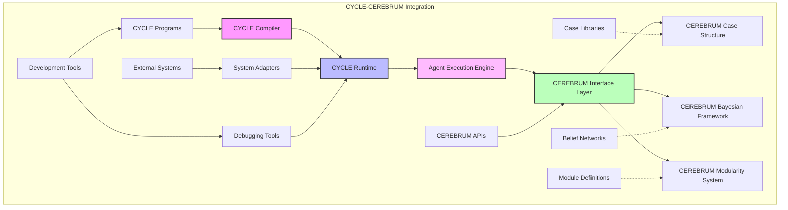

The integration enables:

* **Case-Based Agent Definition**: CYCLE agents can leverage CEREBRUM's case structures for knowledge representation.

* **Bayesian Loop Control**: Agent loops can incorporate CEREBRUM's Bayesian reasoning for sophisticated decision-making.

* **Modular Agent Composition**: Agents can be composed from modular components using CEREBRUM's modularity system.

* **Bidirectional Communication**: CYCLE agents can communicate with other components in the CEREBRUM ecosystem.

### 9.12 Future Language Evolution

The CYCLE language is designed for evolution in several key directions:

* **Formal Verification**: Development of formal semantics and verification tools to prove properties of CYCLE programs.

* **Self-Modifying Agents**: Extensions enabling agents to modify their own code structures during execution.

* **Distributed Execution**: Enhanced support for distributing agent execution across computational resources.

* **Learning Extensions**: Integration with machine learning frameworks for adaptive agent behavior.

* **Domain-Specific Extensions**: Specialized language constructs for particular application domains such as robotics, simulation, and cognitive modeling.

The language provides a flexible foundation for future expansion while maintaining its core focus on agent-oriented loop-centric programming.

## 10. Formal Computer Science Foundations of CYCLE

This section explores the theoretical underpinnings of the CYCLE language, positioning it within established computer science paradigms while highlighting its novel contributions to computational models of agency.

### 10.1 Computational Models and Expressivity

CYCLE's computational foundations draw from and extend several key theoretical frameworks:

* **Lambda Calculus Extensions**: While traditional lambda calculus provides a foundation for functional programming through anonymous functions and function application, CYCLE extends this with agent-oriented abstractions that maintain the mathematical rigor while introducing situated computation.

* **Process Calculi Integration**: CYCLE incorporates elements from π-calculus and ambient calculus to model concurrent, communicating processes with mobility, but extends these with explicit sensing and acting capabilities that ground computation in environmental interaction.

* **Situated Automata Theory**: The language formalizes agent loops as extensions of finite state machines where transitions are governed by both internal state and external context, creating environmentally-embedded computation.

* **Category Theoretic Semantics**: CYCLE employs category theory to formalize compositional structures between agents, loops, and predicates, enabling rigorous reasoning about system transformations and invariants.

* **Non-Well-Founded Set Theory**: To handle self-referential structures inherent in recursive agency, CYCLE draws on non-well-founded set theory, particularly Aczel's anti-foundation axiom, allowing formal representation of circular dependencies.

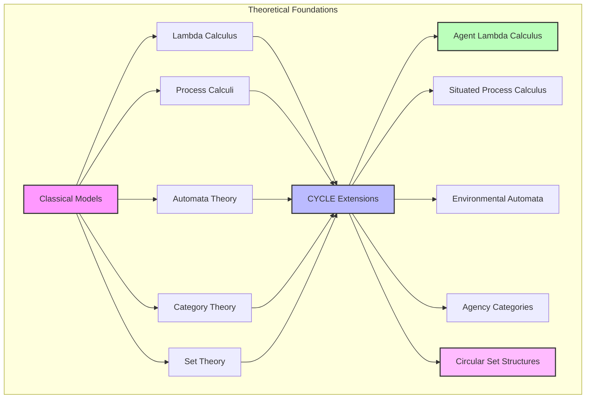

These theoretical foundations provide formal guarantees about CYCLE programs, enabling verification, transformation, and reasoning about their properties.

### 10.2 Type Theoretic Foundations

CYCLE's type system is grounded in advanced type theory:

* **Dependent Types**: Types that depend on values, enabling more precise specifications of program behavior, such as loops with provable termination conditions or predicates with guaranteed evaluation properties.

* **Linear Types**: Types that ensure resources are used exactly once, critically important for managing environmental actions that cannot be undone or sensor readings that degrade over time.

* **Session Types**: Types that describe communication protocols between agents, ensuring that message exchanges follow pre-defined patterns that prevent deadlocks and communication errors.

* **Intersection and Union Types**: Types that combine properties of multiple types, allowing flexible agent behaviors that adapt based on context while maintaining type safety.

* **Gradual Typing**: A hybrid approach allowing both static and dynamic typing, enabling rapid prototyping of agent behaviors with incremental addition of type guarantees.

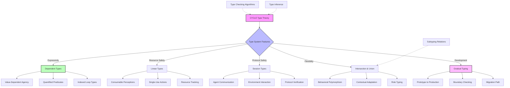

The type-theoretic foundation enables sophisticated static guarantees about agent behavior while maintaining flexibility for adaptive, context-sensitive computation.

### 10.3 Formal Semantics

CYCLE defines rigorous formal semantics to enable reasoning about program behavior:

* **Operational Semantics**: Small-step and big-step semantics defining precise execution behavior of CYCLE constructs, with special attention to the interaction between sensing, thinking, and acting phases.

* **Denotational Semantics**: Mathematical models mapping CYCLE programs to their meanings, using domain theory extended with environmental interaction models.

* **Axiomatic Semantics**: Hoare-style logic for verifying properties of CYCLE programs, with specialized predicates for reasoning about environmental interaction and agent knowledge.

* **Game Semantics**: Modeling agent-environment interaction as game-theoretic constructs, viewing computation as a dialogue between an agent and its context.

* **Temporal Semantics**: Extensions of temporal logic to reason about the evolution of agent behavior over time, incorporating both linear and branching time models.

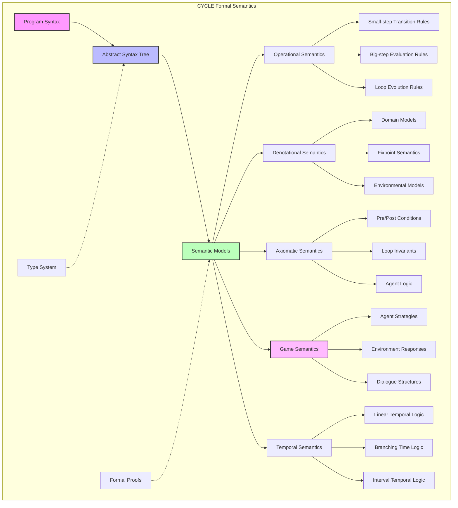

These formal semantics provide the foundation for compiler implementation, program analysis tools, and formal verification of CYCLE programs.

### 10.4 Theoretical Analysis of Agent Loops

The theoretical properties of CYCLE's loop constructs have been extensively analyzed:

* **Termination Analysis**: Formal methods for determining when agent loops terminate, using techniques from termination analysis extended with environmental interaction models.

* **Loop Invariant Inference**: Algorithms for automatically discovering invariant properties maintained throughout loop execution, critical for verification and optimization.

* **Convergence Properties**: Analysis of when and how agent loops converge to stable behaviors or equilibrium states, drawing on dynamical systems theory.

* **Progress Guarantees**: Formal techniques for ensuring that agent loops make meaningful progress toward goals, avoiding livelock and starvation.

* **Complexity Analysis**: Methods for determining the computational complexity of agent loops, accounting for both internal processing and environmental interaction costs.

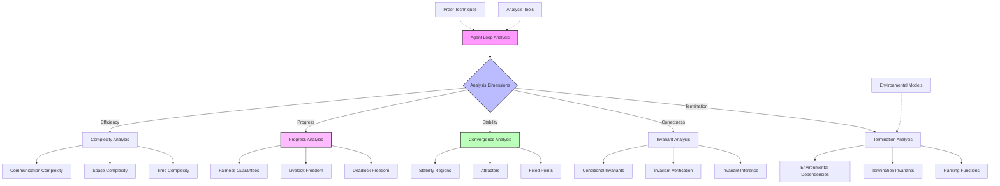

These theoretical analyses enable rigorous reasoning about the behavior of CYCLE programs, ensuring reliability and performance.

### 10.5 Predicate Calculus Extensions

CYCLE extends classical predicate calculus to address the unique requirements of agent programming:

* **Temporal Predicate Logic**: Extensions of first-order logic with temporal operators that can reason about past, present, and future states within agent loops.

* **Epistemic Logic Integration**: Modal logic constructs for representing and reasoning about agent knowledge states, beliefs, and knowledge acquisition.

* **Doxastic Reasoning**: Formal systems for representing belief structures, including degrees of belief and belief revision mechanisms.

* **Deontic Constructs**: Logic for representing obligations, permissions, and prohibitions that govern agent behavior in normative contexts.

* **Resource-Sensitive Logics**: Logical frameworks for reasoning about consumption and production of resources during agent operation.

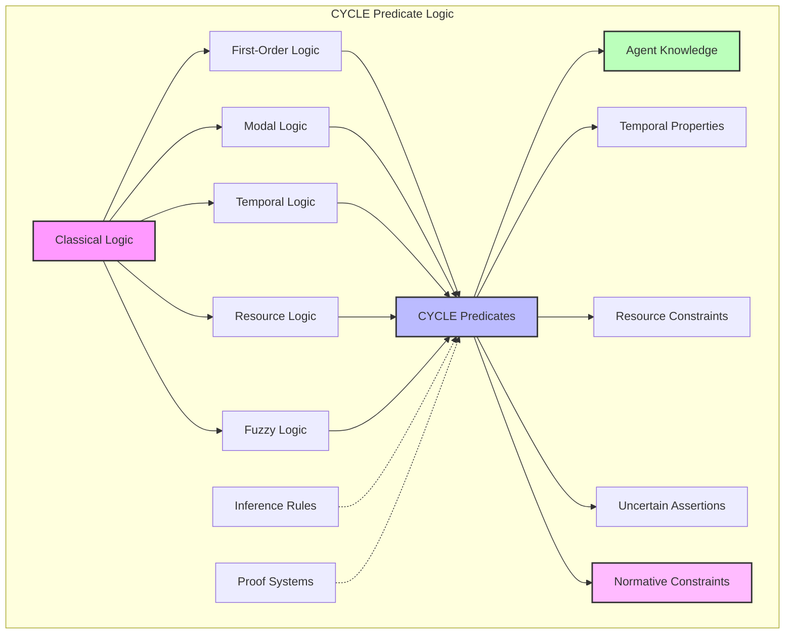

These logical extensions enable sophisticated reasoning about agent behavior in complex, dynamic environments while maintaining formal rigor.

### 10.6 Computational Complexity and Expressivity Analysis

The theoretical limits and capabilities of CYCLE have been rigorously analyzed:

* **Expressive Power**: Analysis of what computational problems CYCLE can express, positioning it in the Chomsky hierarchy and comparing to other computational models.

* **Complexity Classes**: Identification of the complexity classes of problems efficiently solvable in CYCLE, with attention to the impact of sensing and acting on computational complexity.

* **Succinctness Analysis**: Comparison of how concisely CYCLE can express solutions compared to other paradigms, identifying where it offers representational advantages.

* **Theoretical Limitations**: Identification of fundamental limitations and undecidable properties in the CYCLE language, establishing boundaries on verification and analysis.

* **Emergent Computational Properties**: Analysis of how collections of CYCLE agents can exhibit computational capabilities beyond those of individual agents, including distributed problem-solving capabilities.

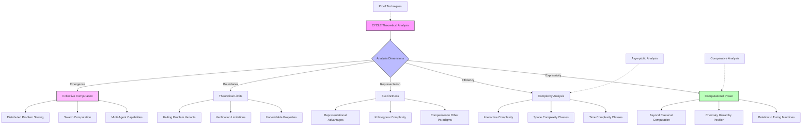

This theoretical analysis positions CYCLE within the broader landscape of computational models while highlighting its unique capabilities for agent-oriented computation.

### 10.7 Formal Verification Methodologies

CYCLE supports rigorous formal verification of agent behaviors:

* **Model Checking**: Techniques for exhaustively verifying that agent behaviors satisfy formal specifications, adapted for the unique challenges of environmental interaction.

* **Theorem Proving**: Methods for constructing formal proofs of agent behavior properties, supported by specialized proof assistants for agent logic.

* **Abstract Interpretation**: Techniques for creating sound approximations of agent behavior to verify properties without exhaustive analysis.

* **Runtime Verification**: Approaches for monitoring agent behavior during execution to ensure adherence to formal specifications.

* **Statistical Model Checking**: Probabilistic verification methods for quantifying the likelihood of specification satisfaction in stochastic environments.

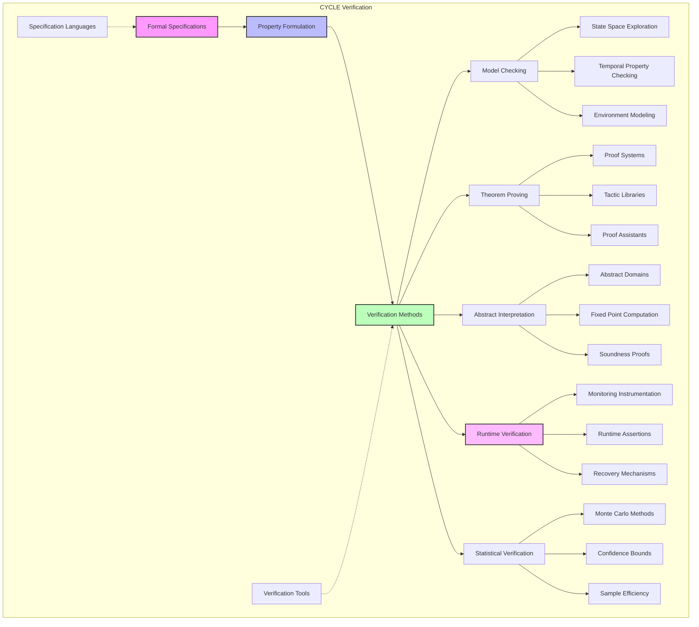

These verification methodologies enable developers to establish strong guarantees about agent behavior in critical applications.

### 10.8 Compiler Theory and Implementation

The CYCLE compiler employs advanced techniques to generate efficient code:

* **Multi-stage Compilation**: A sophisticated pipeline that progressively transforms CYCLE programs through multiple intermediate representations before producing executable code.

* **Static Analysis Framework**: Comprehensive analysis passes that identify optimization opportunities, potential errors, and verify language constraints.

* **Loop Optimization Techniques**: Specialized optimizations for agent loops, including loop fusion, invariant hoisting, and specialized scheduling optimizations.

* **Predicate Optimization**: Advanced techniques for efficiently evaluating complex predicates, including short-circuit evaluation, predicate specialization, and predicate caching.

* **Environment-Aware Optimization**: Optimizations that consider the characteristics of the execution environment to generate adaptively optimized code.

```mermaid
flowchart TD
    A[CYCLE Source Code] --> B[Front End]
    B --> B1[Lexical Analysis]
    B --> B2[Syntax Analysis]
    B --> B3[Semantic Analysis]
    
    B --> C[Intermediate Representation]
    C --> D[Analysis & Optimization]
    
    D --> D1[Control Flow Analysis]
    D --> D2[Data Flow Analysis]
    D --> D3[Loop Analysis]
    D --> D4[Predicate Analysis]
    D --> D5[Effect Analysis]
    
    D --> E[IR Transformations]
    E --> E1[Loop Optimizations]
    E --> E2[Predicate Optimizations]
    E --> E3[Memory Optimizations]
    E --> E4[Concurrency Optimizations]
    
    E --> F[Code Generation]
    F --> F1[Target Selection]
    F --> F2[Code Emission]
    F --> F3[Runtime Integration]
    
    F --> G[Target Code]
    
    H[Type System] -.-> B3
    I[Optimization Rules] -.-> E
    J[Runtime Library] -.-> F3
    
    style A fill:#f9f,stroke:#333,stroke-width:2px
    style C fill:#bbf,stroke:#333,stroke-width:2px
    style D fill:#bfb,stroke:#333,stroke-width:2px
    style F fill:#fbf,stroke:#333,stroke-width:2px
```

These compiler techniques ensure that the high-level abstractions in CYCLE translate to efficient executable code without sacrificing the semantic guarantees of the language.

## 11. Deep Technical Integration with CEREBRUM

This section explores the detailed technical integration between CYCLE and the CEREBRUM cognitive architecture, explaining how the agent programming paradigm interfaces with and extends CEREBRUM's capabilities.

### 11.1 Architectural Interface Layers

The integration between CYCLE and CEREBRUM occurs through multiple specialized interface layers:

* **Case Structure Mapping**: Bidirectional transformation between CYCLE's agent state representations and CEREBRUM's case structures, enabling seamless knowledge exchange between the two systems.

* **Bayesian Bridge**: Integration framework that connects CYCLE's predicate evaluation system with CEREBRUM's Bayesian inference engine, allowing agent decisions to incorporate sophisticated probabilistic reasoning.

* **Active Inference Integration**: Mechanisms for embedding CYCLE agents within CEREBRUM's active inference framework, enabling agents to minimize free energy through their perception-action cycles.

* **Modular Component Interface**: Standardized protocols for CYCLE agents to leverage CEREBRUM's modular cognitive components, extending agent capabilities with specialized reasoning modules.

* **Temporal Synchronization Framework**: Systems for coordinating the different temporal dynamics of CYCLE agent loops and CEREBRUM's cognitive processes, ensuring coherent interaction.

```mermaid
graph TD
    subgraph "CYCLE-CEREBRUM Interface Architecture"
        A[CYCLE Runtime] --> B[Interface Layers]
        
        B --> C[Case Structure Mapping]
        C --> C1[Object Mapping]
        C --> C2[Relation Transformation]
        C --> C3[Context Preservation]
        C --> C4[Bidirectional Updates]
        
        B --> D[Bayesian Bridge]
        D --> D1[Predicate Probability Mapping]
        D --> D2[Belief Distribution Access]
        D --> D3[Evidence Propagation]
        D --> D4[Inference Request Handling]
        
        B --> E[Active Inference Integration]
        E --> E1[Free Energy Minimization]
        E --> E2[Precision Weighting]
        E --> E3[Policy Selection]
        E --> E4[Predictive Coding]
        
        B --> F[Modular Component Interface]
        F --> F1[Component Discovery]
        F --> F2[Capability Registration]
        F --> F3[Method Invocation]
        F --> F4[Result Transformation]
        
        B --> G[Temporal Synchronization]
        G --> G1[Clock Coordination]
        G --> G2[Event Scheduling]
        G --> G3[Priority Management]
        G --> G4[Deadline Handling]
        
        H[CEREBRUM Core] --> B
        
        I[Type Conversion] -.-> B
        J[Security Policies] -.-> B
        K[Performance Monitoring] -.-> B
    end
    
    style A fill:#f9f,stroke:#333,stroke-width:2px
    style B fill:#bbf,stroke:#333,stroke-width:2px
    style D fill:#bfb,stroke:#333,stroke-width:2px
    style E fill:#fbf,stroke:#333,stroke-width:2px
```

These interface layers enable seamless integration while maintaining the architectural integrity of both systems.

### 11.2 Case-Enabled Agent Programming

CYCLE agents leverage CEREBRUM's case structures for knowledge representation:

* **Case-Based State Representation**: Methods for representing agent state variables as structured cases within CEREBRUM's knowledge framework, enabling rich relational representation.

* **Case-Driven Sensing**: Techniques for mapping environmental perceptions into case structure updates, leveraging CEREBRUM's pattern matching and recognition capabilities.

* **Case-Derived Actions**: Frameworks for translating case-based reasoning outcomes into concrete agent actions, ensuring that agent responses derive from structured knowledge.

* **Case Evolution Tracking**: Mechanisms for monitoring how agent actions influence case structures over time, enabling adaptive learning and refinement.

* **Multi-Perspective Case Integration**: Systems for maintaining multiple perspective-specific case representations within a single agent, enabling context-sensitive reasoning.

```mermaid
flowchart TD
    A[Agent Knowledge] --> B{Representation Mechanisms}
    
    B -->|Structure| C[Case Templates]
    C --> C1[Attribute Schemas]
    C --> C2[Relation Types]
    C --> C3[Context Markers]
    
    B -->|Acquisition| D[Perception-to-Case]
    D --> D1[Feature Extraction]
    D --> D2[Pattern Recognition]
    D --> D3[Case Construction]
    
    B -->|Reasoning| E[Case Operations]
    E --> E1[Case Retrieval]
    E --> E2[Case Adaptation]
    E --> E3[Case Comparison]
    
    B -->|Application| F[Case-to-Action]
    F --> F1[Action Selection]
    F --> F2[Parameter Derivation]
    F --> F3[Expected Outcomes]
    
    B -->|Evolution| G[Learning Mechanisms]
    G --> G1[Outcome Recording]
    G --> G2[Case Revision]
    G --> G3[Generalization]
    
    H[CEREBRUM Case Library] -.-> A
    I[Agent Experience] -.-> G
    J[Domain Knowledge] -.-> C
    
    style A fill:#f9f,stroke:#333,stroke-width:2px
    style B fill:#bbf,stroke:#333,stroke-width:2px
    style E fill:#bfb,stroke:#333,stroke-width:2px
    style G fill:#fbf,stroke:#333,stroke-width:2px
```

This integration enables CYCLE agents to leverage CEREBRUM's sophisticated case-based reasoning capabilities while maintaining the agent-oriented programming model.

### 11.3 Bayesian Agent Loops

CYCLE loops integrate with CEREBRUM's Bayesian reasoning framework:

* **Belief-Driven Sense Phases**: Sensing operations guided by current belief distributions, focusing attention on observations with high information value.

* **Bayesian Belief Updating**: Think phases that leverage CEREBRUM's Bayesian inference engine to update agent beliefs based on new evidence.

* **Probabilistic Action Selection**: Act phases that select actions based on expected utility calculations over belief distributions.

* **Evidence Accumulation Loops**: Specialized loop patterns for incrementally refining belief distributions through strategic information gathering.

* **Uncertainty-Aware Predicates**: Loop control predicates that incorporate uncertainty measures from belief distributions to guide loop execution.

```mermaid
graph TD
    subgraph "Bayesian Agent Loop Cycle"
        A[Initial Beliefs] --> B[Sense Phase]
        
        B --> C[Attention Allocation]
        C --> C1[Information Gain Calculation]
        C --> C2[Precision-Weighted Sampling]
        C --> C3[Active Sensing]
        
        C --> D[Evidence Collection]
        D --> D1[Observation Modeling]
        D --> D2[Noise Filtering]
        D --> D3[Feature Extraction]
        
        D --> E[Think Phase]
        
        E --> F[Belief Updating]
        F --> F1[Bayesian Inference]
        F --> F2[Model Revision]
        F --> F3[Uncertainty Quantification]
        
        F --> G[Decision Analysis]
        G --> G1[Expected Utility]
        G --> G2[Risk Assessment]
        G --> G3[Information Value]
        
        G --> H[Act Phase]
        
        H --> I[Policy Selection]
        I --> I1[Action Sampling]
        I --> I2[Parameter Optimization]
        I --> I3[Execution Planning]
        
        I --> J[Action Execution]
        J --> J1[Command Generation]
        J --> J2[Execution Monitoring]
        J --> J3[Feedback Processing]
        
        J --> K[Updated Beliefs]
        K --> L{Continue?}
        L -->|Yes| B
        L -->|No| M[Terminate Loop]
        
        N[CEREBRUM Bayesian Engine] -.-> F
        O[Prior Knowledge] -.-> A
        P[Utility Functions] -.-> G
    end
    
    style A fill:#f9f,stroke:#333,stroke-width:2px
    style E fill:#bbf,stroke:#333,stroke-width:2px
    style H fill:#bfb,stroke:#333,stroke-width:2px
    style K fill:#fbf,stroke:#333,stroke-width:2px
```

This integration enables CYCLE agents to perform sophisticated Bayesian reasoning while maintaining the clean sense-think-act loop structure.

### 11.4 Free Energy Principle Implementation

CYCLE implements CEREBRUM's Free Energy Principle through specialized agent constructs:

* **Prediction-Error Minimization Loops**: Agent loops structured explicitly around minimizing the difference between predicted and actual perceptions.

* **Precision-Weighted Attention**: Sensing mechanisms that allocate perceptual resources based on expected precision of different information sources.

* **Hierarchical Predictive Processing**: Nested agent loops that implement predictive processing at multiple levels of abstraction, with bidirectional information flow.

* **Active Inference Policies**: Action selection mechanisms based on policies that minimize expected free energy across potential future states.

* **Model Evidence Optimization**: Learning processes that update agent models to maximize model evidence over time, implementing Bayesian model selection.

```mermaid
flowchart TD
    A[Free Energy Agent] --> B{Key Mechanisms}
    
    B -->|Perception| C[Prediction Error Processing]
    C --> C1[Generative Models]
    C --> C2[Prediction Formation]
    C --> C3[Error Calculation]
    C --> C4[Precision Weighting]
    
    B -->|Hierarchy| D[Multi-Level Processing]
    D --> D1[Top-down Predictions]
    D --> D2[Bottom-up Errors]
    D --> D3[Level Integration]
    D --> D4[Temporal Hierarchies]
    
    B -->|Action| E[Active Inference]
    E --> E1[Policy Evaluation]
    E --> E2[Free Energy Minimization]
    E --> E3[Action Selection]
    E --> E4[Outcome Sampling]
    
    B -->|Learning| F[Model Optimization]
    F --> F1[Parameter Updating]
    F --> F2[Structure Learning]
    F --> F3[Model Comparison]
    F --> F4[Evidence Accumulation]
    
    B -->|Introspection| G[Meta-cognitive Process]
    G --> G1[Certainty Estimation]
    G --> G2[Learning Rate Adaptation]
    G --> G3[Model Complexity Control]
    G --> G4[Exploration-Exploitation]
    
    H[CEREBRUM FEP Engine] -.-> A
    I[Sensory Data] -.-> C
    J[Action Outcomes] -.-> E
    
    style A fill:#f9f,stroke:#333,stroke-width:2px
    style B fill:#bbf,stroke:#333,stroke-width:2px
    style E fill:#bfb,stroke:#333,stroke-width:2px
    style G fill:#fbf,stroke:#333,stroke-width:2px
```

This integration enables CYCLE agents to embody the free energy principle, providing a principled foundation for perception, action, and learning.

### 11.5 Modular Cognitive Functions

CYCLE agents can leverage CEREBRUM's specialized cognitive modules:

* **Module Discovery and Binding**: Mechanisms for dynamically discovering and integrating with available CEREBRUM cognitive modules at runtime.

* **Capability-Based Module Selection**: Frameworks for selecting appropriate cognitive modules based on required capabilities and quality-of-service parameters.

* **Cross-Module Orchestration**: Systems for coordinating the operation of multiple cognitive modules within a single agent loop, enabling complex cognitive workflows.

* **Result Integration**: Techniques for combining and reconciling results from different cognitive modules into coherent agent beliefs and actions.

* **Adaptive Module Utilization**: Learning mechanisms for improving module selection and usage patterns based on performance feedback.

```mermaid
graph TD
    subgraph "Modular Cognitive Integration"
        A[CYCLE Agent] --> B[Module Integration System]
        
        B --> C[Module Discovery]
        C --> C1[Registry Querying]
        C --> C2[Capability Matching]
        C --> C3[Version Compatibility]
        
        B --> D[Module Binding]
        D --> D1[Interface Adaptation]
        D --> D2[Resource Allocation]
        D --> D3[Security Validation]
        
        B --> E[Execution Orchestration]
        E --> E1[Invocation Scheduling]
        E --> E2[Parameter Marshalling]
        E --> E3[Error Handling]
        
        B --> F[Result Processing]
        F --> F1[Result Transformation]
        F --> F2[Consistency Checking]
        F --> F3[Belief Integration]
        
        B --> G[Performance Monitoring]
        G --> G1[Latency Tracking]
        G --> G2[Quality Assessment]
        G --> G3[Utility Evaluation]
        
        H[CEREBRUM Module Registry] -.-> C
        
        I[Planning Module] --> B
        J[Learning Module] --> B
        K[Language Module] --> B
        L[Spatial Module] --> B
        M[Emotional Module] --> B
    end
    
    style A fill:#f9f,stroke:#333,stroke-width:2px
    style B fill:#bbf,stroke:#333,stroke-width:2px
    style E fill:#bfb,stroke:#333,stroke-width:2px
    style G fill:#fbf,stroke:#333,stroke-width:2px
```

This integration enables CYCLE agents to leverage specialized cognitive capabilities while maintaining the agent-oriented programming model.

### 11.6 Memory Systems Integration

CYCLE agents interface with CEREBRUM's sophisticated memory systems:

* **Episodic Memory Encoding**: Mechanisms for recording agent experiences as episodic memories within CEREBRUM's memory structures.

* **Semantic Knowledge Extraction**: Processes for deriving general knowledge from specific agent experiences, contributing to semantic memory.

* **Procedural Memory Compilation**: Systems for converting frequently executed agent behaviors into optimized procedural memory representations.

* **Working Memory Interface**: Frameworks for using CEREBRUM's working memory as a computational workspace during agent cognitive processes.

* **Memory Consolidation Loops**: Specialized agent loops for memory review, consolidation, and reorganization during idle periods.

```mermaid
flowchart TD
    A[Agent Memory Systems] --> B{Memory Types}
    
    B -->|Episodes| C[Episodic Memory]
    C --> C1[Experience Encoding]
    C --> C2[Temporal Organization]
    C --> C3[Context Binding]
    C --> C4[Retrieval Mechanisms]
    
    B -->|Knowledge| D[Semantic Memory]
    D --> D1[Concept Formation]
    D --> D2[Relation Extraction]
    D --> D3[Knowledge Organization]
    D --> D4[Inference Support]
    
    B -->|Skills| E[Procedural Memory]
    E --> E1[Skill Encoding]
    E --> E2[Optimization Processes]
    E --> E3[Chunking Mechanisms]
    E --> E4[Automatic Execution]
    
    B -->|Active| F[Working Memory]
    F --> F1[Information Buffering]
    F --> F2[Manipulation Operations]
    F --> F3[Capacity Management]
    F --> F4[Focus Control]
    
    B -->|Maintenance| G[Memory Processes]
    G --> G1[Consolidation]
    G --> G2[Forgetting Mechanisms]
    G --> G3[Reactivation]
    G --> G4[Reconsolidation]
    
    H[CEREBRUM Memory Subsystem] -.-> A
    I[Agent Experiences] -.-> C
    J[Repeated Behaviors] -.-> E
    
    style A fill:#f9f,stroke:#333,stroke-width:2px
    style B fill:#bbf,stroke:#333,stroke-width:2px
    style E fill:#bfb,stroke:#333,stroke-width:2px
    style G fill:#fbf,stroke:#333,stroke-width:2px
```

This integration enables CYCLE agents to leverage CEREBRUM's sophisticated memory systems while maintaining the agent-oriented programming model.

### 11.7 Affective and Motivational Systems

CYCLE integrates with CEREBRUM's affective and motivational frameworks:

* **Emotional State Representation**: Constructs for representing and updating agent emotional states based on CEREBRUM's emotion models.

* **Motivation-Driven Loops**: Agent loops structured around fulfilling intrinsic and extrinsic motivations defined within CEREBRUM's motivational systems.

* **Affective Modulation**: Mechanisms whereby emotional states influence sensing, thinking, and acting processes within agent loops.

* **Arousal and Valence Management**: Systems for tracking and regulating agent arousal levels and valence dimensions of experience.

* **Social Emotion Models**: Frameworks for representing and reasoning about the emotional states of other agents, enabling social intelligence.

```mermaid
graph TD
    subgraph "Affective Agent Architecture"
        A[Agent Core] --> B[Affective Systems]
        
        B --> C[Emotional State]
        C --> C1[Dimensional Representation]
        C --> C2[Categorical Emotions]
        C --> C3[Physiological Correlates]
        
        B --> D[Motivational System]
        D --> D1[Drive States]
        D --> D2[Goal Generation]
        D --> D3[Incentive Calculation]
        
        B --> E[Affective Modulation]
        E --> E1[Perceptual Biasing]
        E --> E2[Cognitive Influence]
        E --> E3[Action Tendency]
        
        B --> F[Regulation Mechanisms]
        F --> F1[Homeostatic Processes]
        F --> F2[Coping Strategies]
        F --> F3[Mood Management]
        
        B --> G[Social Affect]
        G --> G1[Empathy Mechanisms]
        G --> G2[Emotional Contagion]
        G --> G3[Social Signaling]
        
        H[CEREBRUM Emotion Engine] -.-> B
        I[External Events] -.-> C
        J[Internal States] -.-> D
    end
    
    style A fill:#f9f,stroke:#333,stroke-width:2px
    style B fill:#bbf,stroke:#333,stroke-width:2px
    style D fill:#bfb,stroke:#333,stroke-width:2px
    style G fill:#fbf,stroke:#333,stroke-width:2px
```

This integration enables CYCLE agents to exhibit emotionally intelligent behaviors while maintaining the agent-oriented programming model.

### 11.8 Social and Multi-Agent Coordination

CYCLE leverages CEREBRUM's social cognition frameworks:

* **Theory of Mind Integration**: Mechanisms for representing and reasoning about the mental states of other agents, enabling sophisticated social cognition.

* **Normative Reasoning**: Frameworks for representing social norms and evaluating actions in terms of their normative appropriateness.

* **Collaborative Task Structures**: Specialized constructs for defining and executing collaborative tasks involving multiple agents.

* **Coordination Protocols**: Formal protocols for coordinating actions between multiple agents to achieve shared goals.

* **Social Learning Mechanisms**: Systems for learning from the observed behaviors of other agents, enabling cultural transmission of knowledge.

```mermaid
flowchart TD
    A[Multi-Agent Systems] --> B{Coordination Mechanisms}
    
    B -->|Understanding| C[Mental State Modeling]
    C --> C1[Belief Attribution]
    C --> C2[Intention Recognition]
    C --> C3[Goal Inference]
    C --> C4[Preference Modeling]
    
    B -->|Regulation| D[Normative Systems]
    D --> D1[Norm Representation]
    D --> D2[Compliance Checking]
    D --> D3[Violation Response]
    D --> D4[Norm Learning]
    
    B -->|Collaboration| E[Joint Activity]
    E --> E1[Shared Goal Representation]
    E --> E2[Role Allocation]
    E --> E3[Progress Monitoring]
    E --> E4[Adaptation Mechanisms]
    
    B -->|Communication| F[Interaction Protocols]
    F --> F1[Message Formats]
    F --> F2[Conversation Patterns]
    F --> F3[Commitment Tracking]
    F --> F4[Negotiation Strategies]
    
    B -->|Culture| G[Social Learning]
    G --> G1[Observation Mechanisms]
    G --> G2[Behavior Imitation]
    G --> G3[Knowledge Sharing]
    G --> G4[Cultural Evolution]
    
    H[CEREBRUM Social Modules] -.-> A
    I[Agent Population] -.-> A
    J[Shared Environment] -.-> E
    
    style A fill:#f9f,stroke:#333,stroke-width:2px
    style B fill:#bbf,stroke:#333,stroke-width:2px
    style E fill:#bfb,stroke:#333,stroke-width:2px
    style G fill:#fbf,stroke:#333,stroke-width:2px
```

This integration enables CYCLE agents to participate in sophisticated social interactions while maintaining the agent-oriented programming model.

### 11.9 Runtime System Integration

The technical runtime integration between CYCLE and CEREBRUM involves:

* **Resource Management**: Coordinated allocation of computational resources between CYCLE agents and CEREBRUM cognitive processes.

* **Data Flow Optimization**: Efficient transfer of data between CYCLE and CEREBRUM components, minimizing copying and transformation overhead.

* **Execution Scheduling**: Sophisticated scheduling algorithms that coordinate the execution of agent loops with CEREBRUM's cognitive cycles.

* **Error Handling and Recovery**: Integrated error detection and recovery mechanisms that maintain system stability despite component failures.

* **Performance Monitoring**: Comprehensive instrumentation for tracking performance metrics across the integrated system.

```mermaid
graph TD
    subgraph "Runtime Integration"
        A[CYCLE Runtime] --> B[Integration Layer]
        H[CEREBRUM Runtime] --> B
        
        B --> C[Resource Management]
        C --> C1[Memory Allocation]
        C --> C2[Processor Scheduling]
        C --> C3[I/O Coordination]
        
        B --> D[Data Transfer]
        D --> D1[Zero-Copy Mechanisms]
        D --> D2[Shared Memory]
        D --> D3[Memory Mapping]
        
        B --> E[Execution Coordination]
        E --> E1[Event Scheduling]
        E --> E2[Priority Management]
        E --> E3[Dependency Tracking]
        
        B --> F[Fault Tolerance]
        F --> F1[Error Detection]
        F --> F2[Isolation Mechanisms]
        F --> F3[Recovery Procedures]
        
        B --> G[System Monitoring]
        G --> G1[Performance Metrics]
        G --> G2[Resource Utilization]
        G --> G3[Bottleneck Identification]
        
        I[Configuration] -.-> B
        J[System Services] -.-> B
    end
    
    style A fill:#f9f,stroke:#333,stroke-width:2px
    style B fill:#bbf,stroke:#333,stroke-width:2px
    style H fill:#bfb,stroke:#333,stroke-width:2px
    style E fill:#fbf,stroke:#333,stroke-width:2px
```

This runtime integration enables efficient operation of the combined system while maintaining the conceptual integrity of both CYCLE and CEREBRUM.

### 11.10 Developer Experience and Tooling

The integration includes comprehensive tools for developers:

* **Unified Development Environment**: Integrated development tools that support both CYCLE programming and CEREBRUM configuration.

* **Cross-System Debugging**: Debuggers capable of tracing execution across the boundary between CYCLE agents and CEREBRUM cognitive processes.

* **Performance Analysis Tools**: Profiling and analysis tools that identify performance bottlenecks spanning both systems.

* **Visualization Frameworks**: Interactive visualizations of agent behavior and cognitive processes, aiding understanding and development.

* **Testing Frameworks**: Comprehensive testing tools supporting unit tests, integration tests, and system-level validation.

```mermaid
flowchart TD
    A[Developer Tools] --> B{Tool Categories}
    
    B -->|Creation| C[Development Environment]
    C --> C1[Code Editor]
    C --> C2[Visual Designer]
    C --> C3[Template Library]
    C --> C4[Documentation]
    
    B -->|Verification| D[Debugging Tools]
    D --> D1[Breakpoints]
    D --> D2[State Inspection]
    D --> D3[Execution Control]
    D --> D4[Log Analysis]
    
    B -->|Optimization| E[Performance Tools]
    E --> E1[Profiler]
    E --> E2[Memory Analysis]
    E --> E3[Bottleneck Detection]
    E --> E4[Optimization Suggestions]
    
    B -->|Understanding| F[Visualization Tools]
    F --> F1[Agent State Visualizer]
    F --> F2[Interaction Diagrams]
    F --> F3[Belief Visualizations]
    F --> F4[Execution Traces]
    
    B -->|Quality| G[Testing Frameworks]
    G --> G1[Unit Testing]
    G --> G2[Integration Testing]
    G --> G3[Simulation Environments]
    G --> G4[Verification Tools]
    
    H[Project Management] -.-> A
    I[Version Control] -.-> A
    J[Collaboration Tools] -.-> A
    
    style A fill:#f9f,stroke:#333,stroke-width:2px
    style B fill:#bbf,stroke:#333,stroke-width:2px
    style F fill:#bfb,stroke:#333,stroke-width:2px
    style G fill:#fbf,stroke:#333,stroke-width:2px
```

These developer tools streamline the process of building integrated systems that leverage both CYCLE and CEREBRUM capabilities. 

## 12. Advanced Agentic AI Capabilities

This section explores how CYCLE enables sophisticated agentic AI systems, leveraging its unique language features and CEREBRUM integration to create autonomous, adaptive, and socially intelligent artificial agents.

### 12.1 Intentional Agency Models

CYCLE implements sophisticated models of intentional agency:

* **BDI Architecture Implementation**: Concrete realization of the Belief-Desire-Intention framework through CYCLE's loop structures and predicate system.

* **Commitment Mechanisms**: Formal structures for representing and maintaining commitments to goals across multiple cognitive cycles, enabling persistence.

* **Intention Reconsideration**: Mechanisms for appropriately balancing commitment to current intentions against the need to reconsider when circumstances change.

* **Meta-Level Control**: Explicit representation and management of reasoning about the agent's own cognitive processes, enabling strategic control.

* **Narrative Identity**: Frameworks for constructing and maintaining coherent agent identities over time through narrative integration of experiences.

```mermaid
graph TD
    subgraph "Intentional Agency Architecture"
        A[Agent Architecture] --> B[Belief System]
        B --> B1[World Model]
        B --> B2[Self Model]
        B --> B3[Social Model]
        
        A --> C[Desire System]
        C --> C1[Goal Representation]
        C --> C2[Value Framework]
        C --> C3[Preference Ordering]
        
        A --> D[Intention System]
        D --> D1[Commitment Structures]
        D --> D2[Practical Reasoning]
        D --> D3[Means-End Analysis]
        
        A --> E[Meta-Cognitive Layer]
        E --> E1[Reasoning Strategies]
        E --> E2[Resource Allocation]
        E --> E3[Performance Evaluation]
        
        A --> F[Narrative Integration]
        F --> F1[Experience Recording]
        F --> F2[Coherence Maintenance]
        F --> F3[Identity Construction]
        
        G[CYCLE Predicates] -.-> B
        H[CYCLE Loops] -.-> D
        I[CEREBRUM Cases] -.-> B
    end
    
    style A fill:#f9f,stroke:#333,stroke-width:2px
    style B fill:#bbf,stroke:#333,stroke-width:2px
    style D fill:#bfb,stroke:#333,stroke-width:2px
    style E fill:#fbf,stroke:#333,stroke-width:2px
```

These intentional agency models enable CYCLE agents to exhibit goal-directed behavior with appropriate persistence and flexibility.

### 12.2 Autonomy and Self-Direction

CYCLE provides mechanisms for genuine agent autonomy:

* **Self-Directed Goal Setting**: Systems for autonomous generation and selection of goals based on the agent's values, beliefs, and environmental context.

* **Adaptive Strategy Selection**: Frameworks for selecting and adapting strategies based on success history, resource constraints, and current context.

* **Reflective Deliberation**: Explicit support for deliberative processes that consider alternative courses of action and their consequences before commitment.

* **Value-Driven Decision Making**: Decision frameworks grounded in explicit representations of the agent's values and priorities.

* **Initiative and Proactivity**: Mechanisms for detecting and pursuing opportunities without external direction, exhibiting genuine proactive behavior.

```mermaid
flowchart TD
    A[Autonomous Agent] --> B{Autonomy Dimensions}
    
    B -->|Purpose| C[Goal Autonomy]
    C --> C1[Goal Generation]
    C --> C2[Goal Selection]
    C --> C3[Goal Refinement]
    C --> C4[Goal Abandonment]
    
    B -->|Method| D[Strategic Autonomy]
    D --> D1[Strategy Library]
    D --> D2[Strategy Selection]
    D --> D3[Strategy Adaptation]
    D --> D4[Novel Strategy Creation]
    
    B -->|Evaluation| E[Normative Autonomy]
    E --> E1[Value Framework]
    E --> E2[Self-Assessment]
    E --> E3[Norm Internalization]
    E --> E4[Ethical Reasoning]
    
    B -->|Self| F[Reflective Autonomy]
    F --> F1[Self-Monitoring]
    F --> F2[Self-Modification]
    F --> F3[Identity Maintenance]
    F --> F4[Growth Direction]
    
    B -->|Action| G[Executive Autonomy]
    G --> G1[Initiative Taking]
    G --> G2[Commitment Management]
    G --> G3[Adaptive Execution]
    G --> G4[Outcome Evaluation]
    
    H[Environmental Context] -.-> A
    I[Value System] -.-> E
    J[Experience History] -.-> D
    
    style A fill:#f9f,stroke:#333,stroke-width:2px
    style B fill:#bbf,stroke:#333,stroke-width:2px
    style F fill:#bfb,stroke:#333,stroke-width:2px
    style G fill:#fbf,stroke:#333,stroke-width:2px
```

These autonomy mechanisms enable CYCLE agents to function as genuinely self-directed entities rather than merely executing predefined scripts.

### 12.3 Explainable Agency

CYCLE provides comprehensive support for explainable AI:

* **Decision Tracing**: Automatic recording of the reasoning chain leading to decisions, enabling post-hoc explanation of agent behavior.

* **Goal Transparency**: Explicit representation of agent goals accessible for inspection and explanation.

* **Belief Attribution**: Mechanisms for connecting agent beliefs to their evidential basis, enabling justification of the agent's world model.

* **Counterfactual Reasoning**: Support for answering "what if" questions by simulating alternative scenarios with modified conditions.

* **Natural Language Explanation**: Integration with language generation to produce human-understandable explanations of agent reasoning and behavior.

```mermaid
graph TD
    subgraph "Explainable Agency Framework"
        A[Agent Behavior] --> B[Explanation System]
        
        B --> C[Decision Recording]
        C --> C1[Reasoning Traces]
        C --> C2[Alternative Tracking]
        C --> C3[Evidence Links]
        
        B --> D[Explanation Generation]
        D --> D1[Causal Models]
        D --> D2[Abstraction Levels]
        D --> D3[Relevance Filtering]
        
        B --> E[Explanation Interfaces]
        E --> E1[Natural Language]
        E --> E2[Visual Explanations]
        E --> E3[Interactive Exploration]
        
        B --> F[Counterfactual Analysis]
        F --> F1[Alternative Simulation]
        F --> F2[Sensitivity Analysis]
        F --> F3[Contrastive Explanation]
        
        B --> G[Verification Support]
        G --> G1[Consistency Checking]
        G --> G2[Norm Compliance]
        G --> G3[Formal Verification]
        
        H[User Queries] -.-> B
        I[Explanation Context] -.-> D
        J[User Model] -.-> E
    end
    
    style A fill:#f9f,stroke:#333,stroke-width:2px
    style B fill:#bbf,stroke:#333,stroke-width:2px
    style D fill:#bfb,stroke:#333,stroke-width:2px
    style F fill:#fbf,stroke:#333,stroke-width:2px
```

These explainability features enable CYCLE agents to provide transparent accounts of their reasoning and behavior, building trust and enabling effective human oversight.

### 12.4 Adaptive Learning Architectures

CYCLE implements sophisticated learning mechanisms:

* **Multi-Strategy Learning**: Integration of multiple learning approaches including reinforcement learning, case-based learning, rule induction, and model-based learning.

* **Metalearning Capabilities**: Systems for learning how to learn, including adaptive parameter tuning, strategy selection, and learning resource allocation.

* **Curriculum Self-Organization**: Mechanisms for autonomously organizing learning experiences to maximize learning efficiency and effectiveness.

* **Knowledge Consolidation**: Processes for reviewing, organizing, and consolidating learned knowledge to improve accessibility and utility.

* **Experiential Learning Loops**: Specialized loop structures for experimentation, reflection, abstraction, and application of learned knowledge.

```mermaid
flowchart TD
    A[Learning Agent] --> B{Learning Mechanisms}
    
    B -->|Experience| C[Experiential Learning]
    C --> C1[Experience Collection]
    C --> C2[Reflection Processes]
    C --> C3[Conceptualization]
    C --> C4[Experimentation]
    
    B -->|Reinforcement| D[Value-Based Learning]
    D --> D1[Reward Processing]
    D --> D2[Policy Learning]
    D --> D3[Value Function]
    D --> D4[Exploration Strategies]
    
    B -->|Structure| E[Model Learning]
    E --> E1[Causal Discovery]
    E --> E2[Structure Induction]
    E --> E3[Parameter Estimation]
    E --> E4[Model Validation]
    
    B -->|Instances| F[Case-Based Learning]
    F --> F1[Case Acquisition]
    F --> F2[Indexing Strategies]
    F --> F3[Similarity Metrics]
    F --> F4[Adaptation Knowledge]
    
    B -->|Meta| G[Learning to Learn]
    G --> G1[Strategy Selection]
    G --> G2[Parameter Tuning]
    G --> G3[Knowledge Transfer]
    G --> G4[Efficiency Optimization]
    
    H[CEREBRUM Learning Modules] -.-> A
    I[Exploration Environment] -.-> C
    J[Feedback Sources] -.-> D
    
    style A fill:#f9f,stroke:#333,stroke-width:2px
    style B fill:#bbf,stroke:#333,stroke-width:2px
    style E fill:#bfb,stroke:#333,stroke-width:2px
    style G fill:#fbf,stroke:#333,stroke-width:2px
```

These learning architectures enable CYCLE agents to continuously adapt and improve based on experience, becoming increasingly effective over time.

### 12.5 Collective Intelligence Systems

CYCLE supports sophisticated multi-agent collective intelligence:

* **Emergent Self-Organization**: Frameworks for enabling groups of agents to develop organized structures and behaviors without centralized control.

* **Distributed Problem Solving**: Mechanisms for decomposing and distributing complex problems across multiple agents for cooperative solution.

* **Collective Decision Making**: Protocols for reaching group decisions that appropriately aggregate individual agent beliefs and preferences.

* **Knowledge Sharing Networks**: Infrastructures for efficient sharing and integration of knowledge across agent populations.

* **Cultural Evolution**: Systems for the emergence, transmission, and modification of cultural knowledge across agent populations over time.

```mermaid
graph TD
    subgraph "Collective Intelligence Framework"
        A[Agent Population] --> B[Collective Mechanisms]
        
        B --> C[Organization Patterns]
        C --> C1[Hierarchical Structures]
        C --> C2[Network Topologies]
        C --> C3[Team Formations]
        C --> C4[Dynamic Restructuring]
        
        B --> D[Problem Distribution]
        D --> D1[Task Decomposition]
        D --> D2[Role Allocation]
        D --> D3[Resource Management]
        D --> D4[Result Integration]
        
        B --> E[Group Decision Making]
        E --> E1[Belief Aggregation]
        E --> E2[Preference Combination]
        E --> E3[Consensus Mechanisms]
        E --> E4[Voting Protocols]
        
        B --> F[Knowledge Ecosystem]
        F --> F1[Knowledge Exchange]
        F --> F2[Information Filtering]