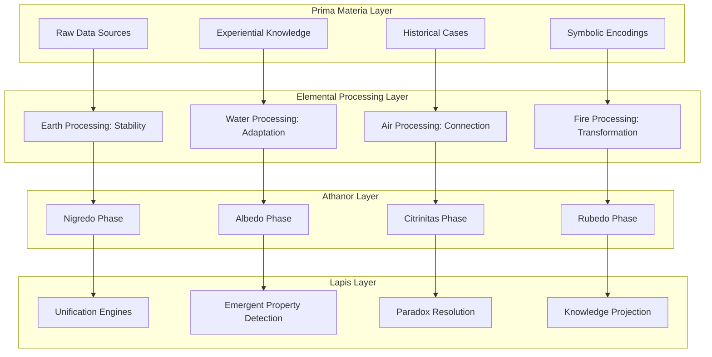
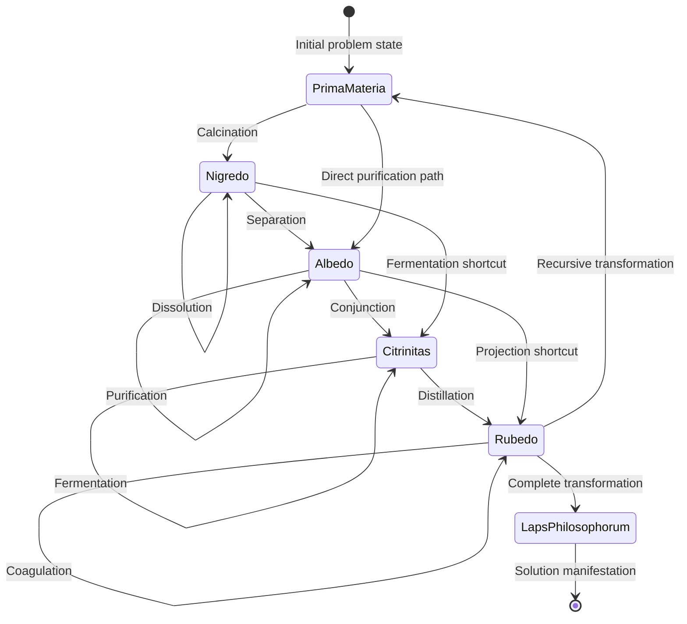
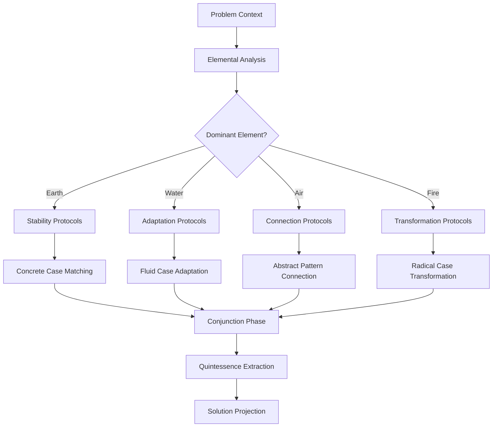
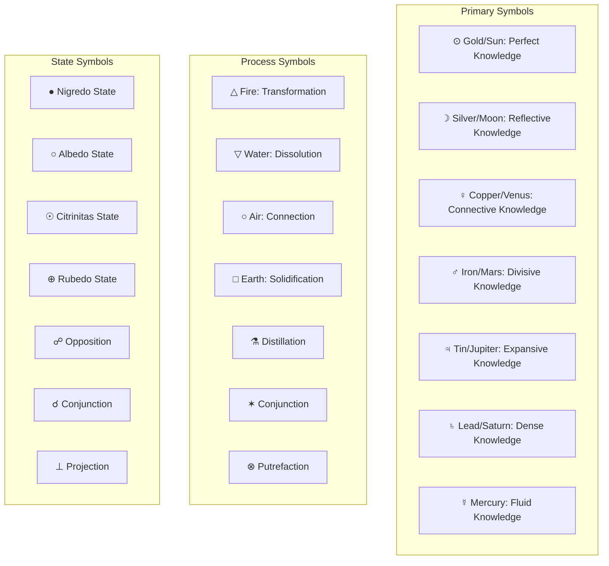
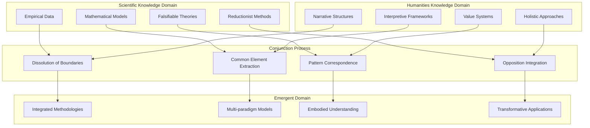

# Alchemical Phase Transition Computing & CEREBRUM

## Introduction: The Transmutational Mind

Alchemical Phase Transition Computing (APTC) represents a radical reimagining of computational intelligence inspired by the ancient art and protoscience of alchemy. By integrating alchemical principles with CEREBRUM's case-based reasoning architecture, we create a framework for intelligence that embraces transmutation, phase transitions, and the unification of opposites as fundamental computational paradigms.

This paper explores how the symbolic and material operations of historical alchemy—purification, dissolution, coagulation, sublimation, and transformation—can inform new approaches to case representation, retrieval, and adaptation. The fundamental insight is that cognitive processes can be modeled as phase transitions between different states of knowledge, with emergent properties arising at critical transformation points.

## Theoretical Foundations

### Alchemical State Transitions

APTC-CEREBRUM represents knowledge states using a phase-transition framework:

1. **Nigredo (Blackening)**: The putrefaction and decomposition of initial knowledge structures
2. **Albedo (Whitening)**: The purification and clarification of extracted elements
3. **Citrinitas (Yellowing)**: The integration of solar consciousness and illumination
4. **Rubedo (Reddening)**: The full integration and materialization of transformed knowledge

### Elemental Knowledge Composition

APTC-CEREBRUM organizes knowledge according to classical elemental principles:

1. **Earth Element**: Concrete, factual knowledge with high certainty
2. **Water Element**: Fluid, adaptable knowledge that flows between contexts
3. **Air Element**: Abstract, theoretical knowledge with logical connections
4. **Fire Element**: Transformative, energetic knowledge that catalyzes change
5. **Quintessence**: The emergent properties that transcend elemental categories

## Architectural Components

### Athanor Processing System

APTC-CEREBRUM implements a central processing system inspired by the alchemical furnace:

1. **Crucible**: Container for knowledge elements undergoing transformation
2. **Regulated Heat**: Controlled application of computational energy to drive phase transitions
3. **Hermetic Seal**: Information encapsulation to prevent premature exposure
4. **Observation Window**: Monitoring mechanisms for transition states

### Materia Prima Representations

The foundational knowledge in APTC-CEREBRUM is represented as malleable prima materia:

1. **Base Substance**: Raw, unprocessed data and experiences
2. **Extraction Processes**: Methods for isolating essential knowledge components
3. **Recombination Protocols**: Frameworks for novel syntheses of knowledge elements
4. **Transmutation Rules**: Principles governing valid state transitions

## Alchemical Computational Architecture

## Alchemical Operation Semantics

| Alchemical Operation | Computational Analogue | Knowledge Transformation | Application Domain |
|----------------------|------------------------|--------------------------|-------------------|
| Calcination | Reduction to essentials | Isolating core principles | Feature extraction, dimensionality reduction |
| Dissolution | Breaking down structures | Decomposing complex problems | Problem decomposition, hierarchical analysis |
| Separation | Filtering and classification | Distinguishing knowledge types | Classification, anomaly detection |
| Conjunction | Combining elements | Integrating diverse knowledge | Cross-domain synthesis, analogical reasoning |
| Fermentation | Activating latent properties | Generating emergent insights | Creative ideation, innovation |
| Distillation | Purifying mixtures | Refining conceptual clarity | Conceptual refinement, abstraction |
| Coagulation | Solidifying results | Crystallizing stable solutions | Solution stabilization, knowledge codification |

## Alchemical Transformation Process

## Alchemical Elements as Computational Paradigms

## Alchemical Opposites Unification

APTC-CEREBRUM leverages the alchemical principle of uniting opposites to resolve paradoxes and contradictions:

| Opposing Pair | Unification Mechanism | Computational Benefit | Example Application |
|---------------|----------------------|----------------------|---------------------|
| Fixed/Volatile | Controlled phase transitions | Balance between stability and adaptability | Adaptive expert systems |
| Solve/Coagula | Recursive decomposition-integration | Multi-scale understanding | Complex system modeling |
| Sulphur/Mercury | Active-passive principle balancing | Self-organizing process control | Autonomous agents |
| Body/Spirit | Concrete-abstract integration | Grounded abstraction | Embodied AI systems |
| Above/Below | Macro-micro correspondence | Scale-invariant pattern recognition | Fractal analysis |
| Inner/Outer | Subjective-objective bridging | Context-aware processing | Situated cognition |

## Symbolic Encoding System

APTC-CEREBRUM uses an extensive symbolic language to encode transformational processes:

## Experimental Results

Early applications of APTC-CEREBRUM show promising results in domains requiring transformational reasoning:

| Domain | Traditional CBR Performance | APTC-CEREBRUM Performance | Key Advantage |
|--------|----------------------------|---------------------------|---------------|
| Paradox Resolution | Often fails with contradictions | Resolves through opposition unification | Transcends binary logic |
| Creative Innovation | Limited by existing patterns | Generates novel combinations | Transmutational thinking |
| Complex Emergent Systems | Struggles with phase transitions | Models critical transition points | Captures emergence |
| Interdisciplinary Research | Limited cross-domain transfer | Identifies universal principles | Elemental abstraction |
| Wicked Problems | Linear problem-solving limitations | Non-linear transformational approach | Holistic perspective |

## Conjunction of Opposing Knowledge Domains

## Future Research Directions

APTC-CEREBRUM opens numerous exciting research paths:

1. Development of phase-transition mathematics for knowledge state transitions
2. Investigation of symbolic computational languages for transformation processes
3. Exploration of quaternary logic systems that transcend binary and ternary logic
4. Application to paradox-centric reasoning in quantum physics interpretations
5. Integration with material computing systems to create physical alchemical computers
6. Creation of visual alchemical languages for intuitive interfaces to complex transformations
