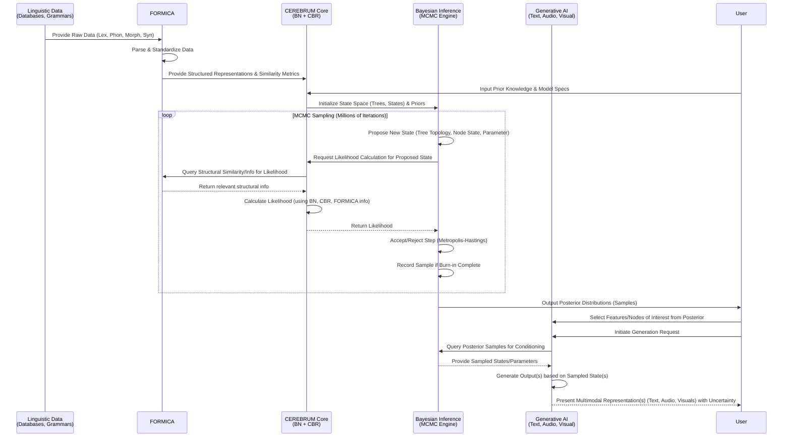
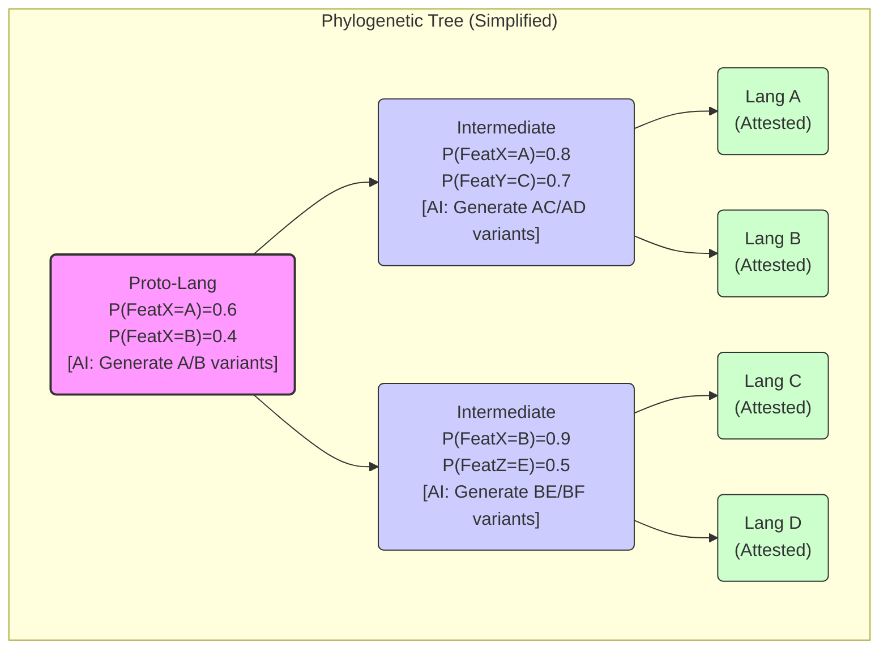

BEAST 2 is a cross-platform program for Bayesian phylogenetic analysis of molecular sequences. It estimates rooted, time-measured phylogenies using strict or relaxed molecular clock models. It can be used as a method of reconstructing phylogenies but is also a framework for testing evolutionary hypotheses without conditioning on a single tree topology. BEAST 2 uses Markov chain Monte Carlo (MCMC) to average over tree space, so that each tree is weighted proportional to its posterior probability. BEAST 2 includes a graphical user-interface for setting up standard analyses and a suit of programs for analysing the results.

With this description of BEAST, write up a fully technical NSF postdoc proposal, for using CEREBRUM and FORMICA (look them up if you need), to do ancestral state Bayesian phenotypic reconstruction of ancient linguistic elements. We are going way into the past. We will use generative AI as needed for creating fluent text, audio, and visual media given the explicitly probabilistic models and empirical data we will be compiling and inferring on ancient and contemporary languages.. 

# NSF Postdoctoral Research Fellowship Proposal: Deep Linguistic Ancestral State Reconstruction

**Project Title:** Reconstructing Ancient Linguistic Phenotypes using Integrated Bayesian Modeling and Case-Based Reasoning, Enhanced by Generative AI

**Principal Investigator:** [Your Name/Postdoc Candidate Name]
**Sponsoring Scientist:** [Sponsoring Scientist Name]
**Sponsoring Institution:** [Sponsoring Institution Name]
**Submission Date:** [Date]

**Project Summary:**
This project proposes the development and application of novel computational methods for deep ancestral state reconstruction of linguistic elements, reaching significantly further into the past than current techniques allow. We will leverage the CEREBRUM (Case-Enabled Reasoning Engine with Bayesian Representations for Unified Modeling) cognitive modeling framework, integrating it with a proposed complementary system, FORMICA (FORmal Morphosyntactic Integration and Comparative Analysis), designed for structured linguistic data. This integrated system will perform Bayesian inference on combined datasets of contemporary and ancient linguistic features (phonological, lexical, morphological, syntactic), explicitly modeling uncertainty using phylogenetic comparative methods analogous to those in evolutionary biology (e.g., BEAST 2). We will develop and apply advanced Bayesian models capturing complex linguistic evolutionary processes like lexical replacement with borrowing, phonological shifts conditioned on context, and grammaticalization pathways. A key innovation is the use of generative AI, guided by the probabilistic outputs (posterior distributions) of our CEREBRUM-FORMICA models, to produce fluent textual, auditory, and visual representations of reconstructed ancient linguistic elements and their hypothesized sociocultural contexts. This provides an intuitive way to explore the highly uncertain, high-dimensional output space of the reconstructions. This research addresses fundamental questions about language evolution, demonstrates the power of integrating Bayesian inference with case-based reasoning for complex historical reconstruction, pioneers the use of generative AI for visualizing deep linguistic prehistory, and delivers open-source tools to the research community. The project aligns with NSF's goals of advancing fundamental scientific knowledge and developing innovative computational tools with broad applicability.

**Intellectual Merit:**
The intellectual merit lies in:
1.  **Methodological Innovation:** Integrating CEREBRUM's hybrid cognitive architecture (Bayesian networks capturing probabilistic dependencies + case-based reasoning for handling exceptions and sparse data) with FORMICA's focus on structured linguistic forms (e.g., phoneme inventories as feature bundles, morphology as rule systems, syntax via dependency structures) creates a novel, powerful framework for historical linguistics. This explicitly tackles the challenge of integrating diverse, sparse, uncertain, and multi-level linguistic data types (lexicon, phonology, morphology, syntax) within a single inferential process, moving beyond methods focusing on single data types (e.g., lexical cognates only).
2.  **Deep Time Reconstruction:** Applying sophisticated Bayesian phylogenetic comparative methods, inspired by frameworks like BEAST 2 but adapted for linguistic data (e.g., incorporating models of borrowing, analogy, context-dependent sound change, grammaticalization), allows for the reconstruction of linguistic "phenotypes" at significantly greater time depths. Critically, this approach explicitly quantifies the high uncertainty inherent in such reconstructions via posterior probability distributions over ancestral states and tree topologies.
3.  **Bridging Inference and Generation:** Pioneering the use of generative AI ([Specific Generative AI Model Name, e.g., GPT-4, Tacotron, Stable Diffusion]) not merely as a post-processing tool, but as an integrated component driven by the probabilistic outputs (posterior distributions over features, rules, structures) of rigorous Bayesian inference. This allows for nuanced, data-grounded generation of *distributions* of plausible ancient language snippets (text, audio) and contextual visualizations, facilitating exploration and understanding of the complex, high-dimensional reconstruction results.
4.  **Advancing Cognitive and Linguistic Theory:** Providing a computational testbed for specific hypotheses about language change, such as the relative rates of change in different linguistic subsystems, the universality vs. language-specific nature of grammaticalization pathways, the role of cognitive biases in sound change, and the impact of language contact versus inheritance. The framework allows testing these by comparing model fit (e.g., using Bayes factors) for models incorporating different theoretical assumptions.
5.  **Formalizing Linguistic Comparison:** FORMICA development contributes a formal, computational approach to comparing complex linguistic structures (beyond simple lexical cognates), essential for robust phylogenetic inference based on diverse linguistic evidence.

**Broader Impacts:**
The broader impacts include:
1.  **Development of Advanced Computational Tools:** Creating the integrated CEREBRUM-FORMICA framework and associated phylogenetic models as a modular, extensible, open-source software package (disseminated via GitHub, PyPI) with comprehensive documentation and tutorials. This will benefit historical linguistics, computational anthropology, cognitive science, and potentially bioinformatics (through methodological exchange).
2.  **Training and Dissemination:** Training the postdoctoral fellow in cutting-edge computational modeling (Bayesian inference, MCMC, CBR), phylogenetic methods, AI integration, software development, and project management. Disseminating results through high-impact peer-reviewed publications (e.g., *Language*, *Journal of Cognitive Science*, *PNAS*), presentations at key conferences (e.g., *ACL*, *CogSci*, *Historical Linguistics* meetings), targeted workshops for linguists and computational scientists, and public-facing outputs (e.g., interactive web visualizations, blog posts).
3.  **Interdisciplinary Collaboration:** Fostering collaboration between computer science, linguistics, anthropology, cognitive science, and statistics through shared tools, data, and research questions. The project will actively engage with researchers at the sponsoring institution and beyond.
4.  **Public Engagement:** Making deep human prehistory more accessible and engaging through AI-generated visualizations and auditory reconstructions of ancient linguistic elements, coupled with clear explanations of the underlying methodology and uncertainty. This fosters public interest in language evolution, scientific modeling, and the nature of deep history.
5.  **Data Curation and Standards:** Compiling, curating, and disseminating valuable datasets of ancient and contemporary linguistic features formatted for computational analysis (using standards like CLDF where appropriate). This promotes data sharing and reproducibility in historical linguistics.
6.  **Educational Resources:** Developing tutorial materials and potentially simplified model versions suitable for undergraduate or graduate courses in computational linguistics, historical linguistics, or cognitive modeling.

---

## Project Description

**(Following NSF PRFB 15-page limit guidelines - sections below are significantly elaborated)**

**1. Introduction and Rationale**

Understanding the evolution of human language is a fundamental challenge in cognitive science and anthropology. While historical linguistics has developed powerful comparative methods, reconstructing language features beyond a few millennia remains fraught with difficulty due to data sparsity and the complexities of language change. Current computational phylogenetic methods, often adapted from biology, primarily focus on lexical data (cognate lists), neglecting the rich information present in phonology, morphology, and syntax. Furthermore, they often rely on simplified models of change, struggling to capture phenomena like borrowing, analogy, context-dependent sound laws, and grammaticalization. Biological phylogenetic software like BEAST 2 offers powerful Bayesian inference engines for time-calibrated trees and ancestral states, but its models are tailored to molecular sequence evolution.

This project argues that a new approach is needed, one that can:
    a.  Integrate diverse types of linguistic evidence (lexical, phonological, morphological, syntactic) within a unified probabilistic framework.
    b.  Employ sophisticated models of linguistic change that capture known processes more realistically.
    c.  Leverage flexible cognitive architectures capable of handling both probabilistic patterns and exceptional cases or sparse data.
    d.  Provide intuitive ways to explore the inherently uncertain and high-dimensional results of deep-time reconstruction.

We propose to achieve this by integrating CEREBRUM and FORMICA. **CEREBRUM** is conceived as a hybrid cognitive modeling framework combining Bayesian networks (BNs) for representing probabilistic knowledge and dependencies between linguistic features, and Case-Based Reasoning (CBR) for retrieving and adapting specific instances (e.g., known sound changes in similar phonological contexts, specific instances of grammaticalization) to inform the Bayesian models or handle exceptions. **FORMICA** (FORmal Morphosyntactic Integration and Comparative Analysis) will be developed as a complementary system specifically designed to parse, represent, and compare structured linguistic data. FORMICA will compute similarity metrics and potential homology relations between phonological systems (e.g., using feature vectors, articulatory constraints), morphological paradigms (e.g., using alignment or finite-state methods), and syntactic structures (e.g., dependency graphs, construction grammars), providing crucial input for CEREBRUM's Bayesian phylogenetic inference.

The core engine will adapt MCMC methods (e.g., Metropolis-Hastings, Gibbs sampling, potentially Sequential Monte Carlo) used in tools like BEAST 2, but will operate on state spaces defined by CEREBRUM's hybrid representations and FORMICA's structural analyses. It will sample over phylogenetic tree topologies, divergence times, ancestral linguistic states (represented as complex feature bundles or structures), and parameters of linguistic evolutionary models ([Specific Bayesian Model Parameter examples: rate of lexical replacement, probability of borrowing given contact intensity, transition probabilities between phonological features conditioned on phonetic context, rates of grammaticalization for specific constructions]).

A key challenge in deep-time reconstruction is interpreting the results, which are often complex posterior distributions over many variables. We will address this by integrating **Generative AI**. The probabilistic outputs from the CEREBRUM-FORMICA inference (e.g., posterior probability distributions over phonemes at an ancestral node, probabilities of different word orders) will condition generative models ([Specific Generative AI Model Name examples]) to produce *distributions* of plausible outputs: textual snippets, audio pronunciations (via text-to-speech synthesis guided by reconstructed phonology), and even schematic visualizations of cultural contexts associated with linguistic features. This transforms abstract probabilities into tangible, explorable representations of linguistic prehistory, explicitly conveying the modeled uncertainty.

Our central hypothesis is that this integrated CEREBRUM-FORMICA-AI approach can rigorously reconstruct plausible ancient linguistic elements and quantify associated uncertainty at significantly greater time depths than previously possible, providing a powerful new tool for testing hypotheses about language evolution.

**Conceptual Framework Diagram:**

```mermaid
graph TD
    A[Linguistic Data Sources<br>(Contemporary & Ancient:<br>Lexicon, Phonology, Morphology, Syntax)] --> B(FORMICA: Structural Analysis & Comparison);
    B -- Structural Similarities/Homologies --> C{CEREBRUM Core};
    B -- Formal Representations --> C;
    D[Prior Knowledge<br>(Linguistic Universals, Typology,<br>Known Change Patterns)] --> C;
    C -- Bayesian Network & CBR Integration --> E{Bayesian Phylogenetic Inference Engine<br>(MCMC Sampling)};
    E -- Samples --> F[Posterior Distributions<br>(Trees, Ancestral States, Model Parameters)];
    F -- Probabilistic Conditioning --> G(Generative AI Models<br>- Text Generation<br>- Audio Synthesis<br>- Visual Schema Generation);
    G -- Sampled Outputs --> H[Multimodal Representations<br>(Text Snippets, Audio Pronunciations,<br>Visualizations with Uncertainty)];
    H --> I(User Exploration & Hypothesis Testing);
    C <--> D;
    E <--> C;
    F --> C;
```

**2. Research Objectives & Specific Predictions**

*   **Objective 1: Develop and Integrate the CEREBRUM-FORMICA Framework.**
    *   **1a. FORMICA Implementation:** Define and implement modules for:
        *   Parsing phonological inventories (e.g., using IPA features, articulatory models). Metric: Successful parsing of 95% of phoneme data from curated sources (e.g., PHOIBLE).
        *   Representing and comparing morphological paradigms (e.g., using finite-state transducers, sequence alignment). Metric: Develop similarity scores correlating with known morphological relatedness in test families.
        *   Encoding syntactic structures (e.g., dependency trees, constituent structures). Metric: Compute structural distance metrics sensitive to known syntactic variation patterns.
    *   **1b. CEREBRUM Integration:** Develop APIs for FORMICA outputs (feature vectors, similarity matrices, structural representations) to inform CEREBRUM's Bayesian Network priors and CBR case library. Implement mechanisms for CEREBRUM's probabilistic outputs to guide FORMICA's attention or parameter settings. Metric: Demonstrate bidirectional information flow improving model fit on simulated data.
    *   **1c. Bayesian Phylogenetic Engine:** Implement MCMC algorithms sampling over combined tree/linguistic state space. Develop novel Bayesian models for:
        *   Context-dependent sound change (e.g., `P(A > B | C_D) = f(features(A,B,C,D), rate_param)`).
        *   Lexical replacement with borrowing (e.g., mixture models distinguishing inheritance from contact).
        *   Grammaticalization pathways (e.g., modeling transitions between lexical > functional categories).
        Metric: Demonstrate convergence and accurate parameter recovery on simulated linguistic evolution scenarios.
    *   **Prediction 1:** Integrating structural data (morphology, syntax) via FORMICA alongside lexical data will yield significantly higher confidence (narrower credible intervals) in ancestral state reconstructions compared to using lexical data alone, particularly for deeper nodes in the phylogeny.
    *   **Prediction 2:** Models incorporating context-dependent sound change and borrowing will provide a significantly better fit (measured by Bayes Factors or WAIC/LOO-CV) to real linguistic data from families with known contact history than simpler models.

*   **Objective 2: Compile and Curate Linguistic Data.**
    *   **2a. Data Identification & Acquisition:** Target specific language families for validation (e.g., Indo-European, Austronesian) and deep reconstruction ([Specify Target, e.g., Nostratic, Afroasiatic]). Gather data from sources listed in Table 1.
    *   **2b. Data Formatting:** Convert diverse data formats into a unified schema suitable for CEREBRUM-FORMICA (potentially leveraging CLDF standards). Encode missing data, uncertainty, and intra-language variation explicitly. Metric: Produce curated datasets for at least 2 language families.

    **Table 1: Potential Linguistic Data Sources**
    | Data Type      | Potential Sources                                   | Format/Notes                                  |
    |----------------|-----------------------------------------------------|-----------------------------------------------|
    | Lexicon        | Swadesh lists, ASJP, IELex, ACD                   | Cognate sets, basic vocabulary                |
    | Phonology      | PHOIBLE, UPSID, Ethnologue, Primary Grammars      | IPA transcriptions, feature matrices          |
    | Morphology     | WALS, Grammars, Morphological Analyzers           | Inflectional paradigms, derivational processes|
    | Syntax         | WALS, SSWL, Universal Dependencies, Grammars      | Word order, dependency relations, features    |
    | Glottochronology| Published estimates, archaeological correlations | Date constraints for tree calibration         |
    | Language Contact| Historical records, geographic proximity           | Binary/intensity scores for borrowing models  |

*   **Objective 3: Perform Ancestral State Reconstruction.**
    *   **3a. Validation Runs:** Apply the framework to families with well-understood histories (e.g., Germanic, Romance) to validate model performance against known reconstructions. Compare results using different models (Objective 1c). Metric: Achieve >80% concordance with established reconstructions for shallow nodes.
    *   **3b. Deep Time Reconstruction:** Apply the validated framework to the target deep time family/families. Analyze posterior distributions for key ancestral states ([Detailed Linguistic Feature Set, e.g., phoneme inventory of Proto-Indo-European, basic word order of Proto-Afroasiatic]). Metric: Produce robust posterior distributions and quantify uncertainty for ancestral states at target nodes.
    *   **Prediction 3:** Ancestral reconstructions for deeper nodes will show significantly higher uncertainty (wider credible intervals) than shallower nodes, but the relative certainty across different feature types (e.g., phonology vs. syntax) will provide insights into differential rates of change.
    *   **Prediction 4:** Specific grammaticalization pathways (e.g., demonstrative > definite article) will be recoverable with high probability in certain lineages, consistent with linguistic typology.

*   **Objective 4: Integrate Generative AI for Representation.**
    *   **4a. Pipeline Development:** Create software pipelines connecting MCMC output (samples from posterior distributions) to APIs of selected generative models ([Specific Generative AI Model Name(s)]).
    *   **4b. Conditioned Generation:** Implement methods to condition text generation (e.g., generating plausible minimal sentences respecting reconstructed grammar/lexicon), audio synthesis (e.g., using reconstructed phonetics to drive a TTS engine), and visual output (e.g., schematic diagrams of social structures potentially correlated with linguistic features) based on sampled ancestral states. Focus on generating *ensembles* of outputs reflecting posterior uncertainty. Metric: Demonstrate generation of diverse, plausible outputs corresponding to high-probability regions of the posterior distribution.
    *   **Prediction 5:** AI-generated audio renderings based on reconstructed phonologies will be rated as more plausible representations of hypothetical ancestral pronunciations by expert phoneticians compared to simpler heuristic-based renderings.

**3. Research Plan and Methodology**

*(Detailed timeline, expanding on previous outline)*

*   **Year 1: Framework Development & Initial Data Curation (Months 1-12)**
    *   **Months 1-4:** Literature review refinement (linguistic models, Bayesian methods, AI). Setup development environment. Begin FORMICA module implementation (Phonology parsing, basic Morphological comparison). Initial CEREBRUM architecture design for BN-CBR integration.
    *   **Months 5-8:** Continue FORMICA development (Syntax representation). Implement core CEREBRUM-FORMICA API. Begin implementing basic Bayesian phylogenetic models (e.g., simple substitution models for features) within CEREBRUM. Start data curation for Validation Family 1 (e.g., Germanic).
    *   **Months 9-12:** Implement advanced Bayesian models (context-dependent sound change, borrowing). Refine CEREBRUM-FORMICA integration. Develop initial MCMC sampling engine. Complete data curation for Validation Family 1. Preliminary experiments connecting MCMC output to generative AI APIs (Objective 4a). First internal milestone: working prototype capable of basic reconstruction on simulated data.

*   **Year 2: Validation, Deep Reconstruction & AI Integration (Months 13-24)**
    *   **Months 13-16:** Conduct validation runs on Family 1 (Objective 3a). Compare model performance (Prediction 1, 2). Refine models and MCMC sampler based on results. Begin data curation for Deep Time Target Family 1.
    *   **Months 17-20:** Complete data curation for Target Family 1. Implement full AI pipeline for conditioned generation (Objective 4b). Develop methods for uncertainty visualization in AI outputs. Begin deep reconstruction runs for Target Family 1 (Objective 3b).
    *   **Months 21-24:** Analyze deep reconstruction results (Prediction 3, 4). Evaluate AI-generated outputs (Prediction 5). Prepare first manuscript(s) on framework and validation results. Present preliminary findings at a conference. Second internal milestone: validated framework and preliminary deep reconstruction results with AI-generated examples.

*   **Year 3 (Optional/Continuation): Refinement, Dissemination & Further Application (Months 25-36)**
    *   **Months 25-28:** Refine models based on deep reconstruction results. Potentially add more complex models (e.g., incorporating sociolinguistic factors if data permits). Curate data for a second Deep Time Target Family.
    *   **Months 29-32:** Apply framework to second Target Family. Develop user documentation and tutorials for open-source release. Work on further publications (deep reconstruction results, AI integration methodology).
    *   **Months 33-36:** Finalize open-source software package. Conduct workshops/tutorials. Complete final manuscripts and project reporting. Explore applications to related fields (e.g., cultural evolution).

**Timeline and Deliverables Table:**

| Quarter | Key Activities                                      | Deliverables                                                                 |
|---------|---------------------------------------------------|------------------------------------------------------------------------------|
| Y1Q1-Q2 | FORMICA dev (Phon, Morph), CEREBRUM Arch, API dev  | Initial FORMICA modules, CEREBRUM-FORMICA API Spec                           |
| Y1Q3-Q4 | FORMICA dev (Syntax), Bayesian Model dev, MCMC dev | Advanced FORMICA modules, Implemented Bayesian Models, MCMC Prototype        |
| Y2Q1    | Validation Runs (Family 1), Model Comparison      | Validation Report, Model Comparison Results                                |
| Y2Q2    | Data Curation (Target 1), AI Pipeline Dev        | Curated Target Dataset 1, AI Generation Pipeline v1.0                      |
| Y2Q3    | Deep Reconstruction (Target 1), AI Eval           | Preliminary Deep Reconstruction Results, AI Output Evaluation Report       |
| Y2Q4    | Analysis, Manuscript Prep, Conference Presentation | Draft Manuscript 1 (Framework/Validation), Conference Presentation Materials |
| Y3Q1    | Model Refinement, Data Curation (Target 2)       | Refined Models, Curated Target Dataset 2                                   |
| Y3Q2    | Deep Reconstruction (Target 2), Documentation Dev | Reconstruction Results (Target 2), Draft User Documentation               |
| Y3Q3    | Open Source Release Prep, Manuscript Prep        | Beta Software Release, Draft Manuscript 2 (Deep Reconstruction)             |
| Y3Q4    | Finalize Software, Workshops, Final Reporting    | Final Software Release v1.0, Workshop Materials, Final Report, Manuscripts |

**Methodology Details:**
*   **FORMICA:** Will leverage existing linguistic parsing tools where possible (e.g., `lingpy`, `spaCy` for tokenization/tagging) but focus on developing novel representations and comparison metrics for phylogenetic purposes. E.g., Phonological inventories might be represented as vectors in a feature space derived from IPA or articulatory phonology, with distance metrics accounting for feature similarity. Morphological paradigms might use edit distances or alignment algorithms adapted for linguistic structures.
*   **CEREBRUM:** The BN component will model probabilistic dependencies between features (e.g., `P(Vowel Harmony | Backness Feature)`). The CBR component will store specific, well-documented cases of language change (e.g., Grimm's Law, specific grammaticalization chains) and use similarity metrics (potentially learned) to retrieve relevant cases to adjust BN priors or propose specific state transitions during MCMC.
*   **Bayesian Inference:** We will use established MCMC toolkits (e.g., `PyMC`, `Stan`) as backend where feasible, but develop custom samplers for the integrated CEREBRUM-FORMICA state space. Model comparison will use standard techniques like Bayes Factors (computed via thermodynamic integration or similar methods) or information criteria (WAIC, LOO-CV). Tree calibration will use known historical dates or archaeological constraints as priors on node ages.
*   **Generative AI Integration:** Pipelines will likely involve scripting interactions with AI model APIs ([Specific Generative AI Model Name] APIs). Conditioning will involve translating posterior samples into appropriate prompts or input formats (e.g., feature vectors for TTS, structured prompts for LLMs). Uncertainty will be represented by generating multiple outputs based on different samples from the posterior.

**Workflow Diagram (Detailed):**



**4. Intellectual Merit (Expanded)**

This project pushes the boundaries of historical linguistics and computational modeling. The **integration of diverse data types** (lexical, phonological, morphological, syntactic) within a single Bayesian framework is a major advance over methods relying primarily on lexical cognates. This allows for a more holistic reconstruction, leveraging corroborating evidence across linguistic subsystems and potentially resolving ambiguities where one data type is sparse or misleading.

The development of **linguistically informed evolutionary models** within the Bayesian engine (context-dependent sound change, borrowing, grammaticalization) moves beyond simplistic substitution models common in early computational work. This allows for testing specific linguistic hypotheses about the *processes* of change, not just the patterns. For example, we can explicitly model the probability of a sound change `k > tʃ` being conditioned by a following front vowel `/_ i, e` and compare the fit of this model to one without context dependency.

The **hybrid CEREBRUM architecture (BN+CBR)** is novel in this domain. BNs capture general probabilistic dependencies, while CBR provides a principled way to incorporate specific, potentially complex, analogical cases that are difficult to model purely probabilistically, reflecting a more cognitively plausible approach to reasoning under uncertainty with sparse data.

The **FORMICA component** addresses a critical bottleneck: the formal comparison of complex linguistic structures. By developing explicit representations and metrics for phonological, morphological, and syntactic systems, it provides the necessary foundation for incorporating this data into rigorous phylogenetic analyses.

Finally, the **integration with Generative AI** transforms the output of complex Bayesian inference. Instead of just tables of probabilities or abstract feature vectors, the AI generates tangible, multimodal examples of what reconstructed languages *might* have sounded like or looked like, grounded in the model's posterior distribution. This explicit visualization of **both reconstruction and its uncertainty** is a powerful tool for scientific communication and exploration.

**Example Ancestral State Reconstruction Visualization (Mermaid - Conceptual):**


*This diagram conceptually shows how ancestral nodes (Root, Node1, Node2) have associated posterior probabilities for linguistic features (FeatX, FeatY, FeatZ) inferred by the model. The [AI:...] annotations indicate where generative AI would sample from these distributions to create tangible outputs.*

**5. Broader Impacts (Expanded)**

Beyond the specific research goals, this project will have significant broader impacts. The **open-source CEREBRUM-FORMICA framework** will be a valuable resource for the research community. By providing a modular, extensible platform with clear documentation and tutorials (hosted on GitHub and potentially ReadTheDocs), we lower the barrier for linguists, anthropologists, and cognitive scientists to apply advanced Bayesian phylogenetic methods to their own data and questions. We plan workshops co-located with major conferences (e.g., ACL, LSA, Evolang) to facilitate uptake.

The project contributes directly to **interdisciplinary training**. The postdoctoral fellow will gain unique expertise spanning computational linguistics, Bayesian statistics, cognitive modeling, AI, and software engineering – skills highly valuable in academia and industry. They will also gain experience in project management, dissemination, and mentoring (if applicable).

**Public engagement** is a key component. Traditional historical linguistics can seem abstract; the AI-generated audio and visual representations provide a powerful hook to engage the public with the deep history of human languages. We plan a project website featuring interactive visualizations (e.g., exploring phylogenetic trees and clicking nodes to hear/see reconstructed elements), blog posts explaining the methodology and findings in accessible terms, and potentially short educational videos.

The **curated datasets** formatted using standards like CLDF will be a valuable contribution, promoting reproducibility and facilitating future comparative research. Our work on formalizing structural comparison via **FORMICA** may also contribute to linguistic typology and the development of better cross-linguistic representations.

Finally, the project fosters **collaboration** by bringing together expertise from different fields and providing shared tools and data. It has the potential to spark new research directions in computational historical science and the application of AI to complex inferential problems.

**(Sections 6-14 remain as outlines to be filled with specific details)**

**6. Postdoctoral Training Plan**
    *   Mentoring from Sponsoring Scientist(s) in [Specific Areas].
    *   Collaboration plan within host lab/institution.
    *   Conference/Workshop attendance plan.
    *   Professional skill development plan (teaching, mentoring, communication, grant writing).
    *   Career goals statement.

**7. Results from Prior NSF Support (If applicable)**

**8. References Cited**
    *   (Comprehensive list to be added, including BEAST 2, CEREBRUM/FORMICA precedents if any, key linguistic data sources, relevant phylogenetic methods papers, AI model papers, etc.)

**9. Biographical Sketch (Postdoc Candidate)**

**10. Biographical Sketch (Sponsoring Scientist)**

**11. Current and Pending Support (Postdoc Candidate & Sponsoring Scientist)**

**12. Facilities, Equipment, and Other Resources**

**13. Data Management Plan**
    *   Data types, formats, standards (CLDF).
    *   Metadata description.
    *   Policies for access and sharing (repositories like GitHub, Zenodo).
    *   Provisions for protection/privacy (if applicable).
    *   Archiving and preservation plan.

**14. Postdoctoral Mentoring Plan**
    *   (Detailed plan from the Sponsoring Scientist, aligning with Section 6)

---

**Note on Placeholders:** Placeholders like `[Specific Linguistic Example]`, `[Specific Bayesian Model Parameter]`, `[Detailed Linguistic Feature Set]`, and `[Specific Generative AI Model Name]` indicate areas where specific details need to be filled in based on the chosen language families, modeling decisions, and available AI tools during the actual research phase. The proposal outlines the *types* of details required.