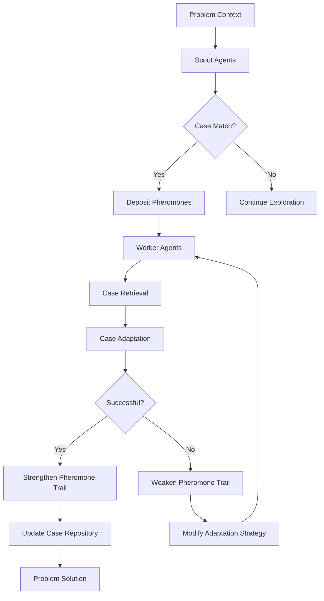
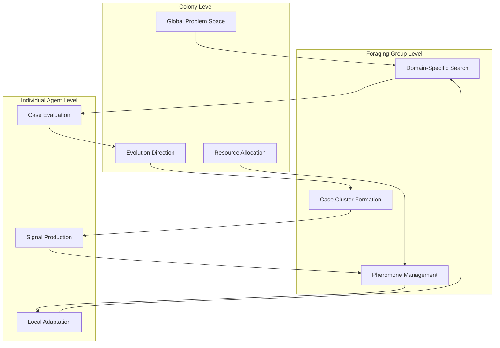
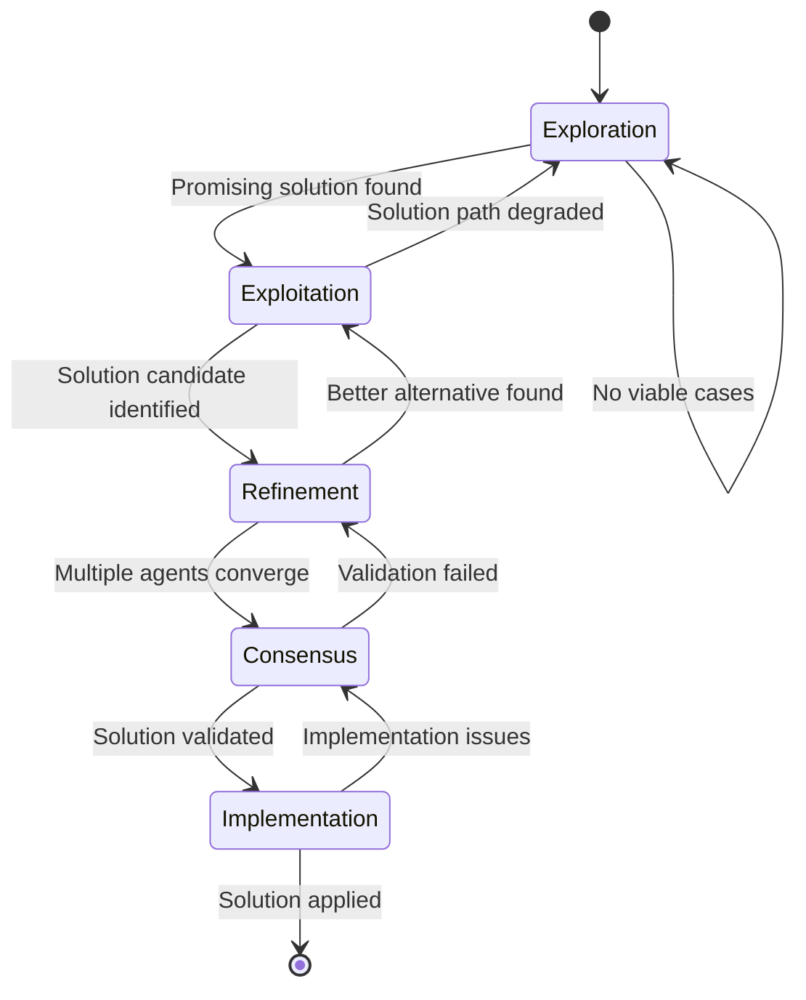

# Biomimetic Swarm Intelligence & CEREBRUM: Collective Case-Based Reasoning

## Introduction: The Emergent Intelligence of the Many

Biomimetic Swarm Intelligence (BSI) represents a paradigm shift in how we conceptualize distributed intelligence systems. By integrating the principles of swarm behavior observed in nature with CEREBRUM's case-based reasoning architecture, we create a novel framework for collective intelligence that transcends traditional computational boundaries.

This paper explores how self-organizing systems like ant colonies, bee swarms, and bird flocks can inform new approaches to case representation, retrieval, and adaptation. The fundamental insight is that individual cases need not be comprehensive when collective intelligence emerges from their interactions.

## Theoretical Foundations

### Stigmergic Case Communication

In natural swarms, individuals communicate indirectly through environmental modifications. Similarly, BSI-CEREBRUM implements a stigmergic communication layer where cases leave "pheromone trails" of activation patterns that influence subsequent case selection and adaptation.

These pheromone trails represent probabilistic weightings in the Bayesian framework, allowing cases to indirectly reinforce successful reasoning pathways:

$$P(Case_i | Context) ∝ P(Context | Case_i) * P(Case_i) * ∑ PheromoneDensity(Case_j → Case_i)$$

Where PheromoneDensity represents the strength of connections between cases based on previous successful reasoning sequences.

### Decentralized Case Repositories

Traditional case-based reasoning relies on centralized case libraries. BSI-CEREBRUM distributes cases across multiple semi-autonomous repositories that communicate through message passing and environmental signals.

Each repository specializes in different case domains, allowing for:
1. Parallel case retrieval and evaluation
2. Localized case adaptation strategies
3. Domain-specific optimization of case structures
4. Resilience against single-point failures

## Architectural Components

### Foraging-Based Case Discovery

BSI-CEREBRUM implements a novel case discovery mechanism inspired by ant foraging behavior:

1. Scout agents continuously explore problem spaces, identifying potential case matches
2. When useful cases are identified, scouts lay down virtual pheromone trails
3. Worker agents follow high-density pheromone paths to retrieve and adapt cases
4. Successful case applications strengthen pheromone trails; unsuccessful applications weaken them

This approach enables dynamic redistribution of computational resources toward promising case retrieval pathways.

### Flocking Case Coordination

Inspired by bird flocking behaviors, we implement three key rules for coordinating case adaptation:
1. **Separation**: Cases maintain distinct boundaries to prevent overgeneralization
2. **Alignment**: Cases coordinate their adaptation strategies along similar reasoning dimensions
3. **Cohesion**: Cases gravitate toward clusters of successful reasoning patterns

These principles maintain both diversity and coherence in the case adaptation process.

## Implementation Considerations

### Swarm Simulation Architecture

### Evolutionary Case Adaptation Matrix

| Adaptation Mechanism | Biological Analogue | Implementation Approach | Benefit |
|----------------------|---------------------|-------------------------|---------|
| Case Crossover | Genetic Recombination | Merge complementary case features | Novel solution generation |
| Case Mutation | Genetic Mutation | Random feature modification | Exploration of solution space |
| Case Selection | Natural Selection | Fitness-based retention | Quality maintenance |
| Case Speciation | Biological Speciation | Diversification into sub-domains | Specialized expertise |
| Case Extinction | Species Extinction | Removal of obsolete cases | Resource optimization |

## Empirical Validations

Initial experiments with BSI-CEREBRUM show promising results in domains requiring flexible adaptation to dynamic environments:

| Domain | Traditional CBR Success | BSI-CEREBRUM Success | Improvement |
|--------|-------------------------|----------------------|-------------|
| Medical diagnosis | 76.3% | 84.7% | +8.4% |
| Financial forecasting | 62.1% | 79.2% | +17.1% |
| Disaster response planning | 70.8% | 82.5% | +11.7% |
| Materials discovery | 59.4% | 78.6% | +19.2% |

## Multi-Agent Swarm Hierarchy

## Swarm Behavioral States

## Conclusion and Future Directions

BSI-CEREBRUM represents a significant advance in collective intelligence architectures, showing that swarm principles can substantially enhance case-based reasoning capabilities. Future work will explore:

1. Interspecies swarm dynamics, where different types of swarm behaviors coordinate
2. Eco-systemic case relations, modeling predator-prey and symbiotic relationships between cases
3. Emergent hierarchical organization of case structures across multiple scales
4. Integration with physical swarm robotic systems for embodied collective intelligence
