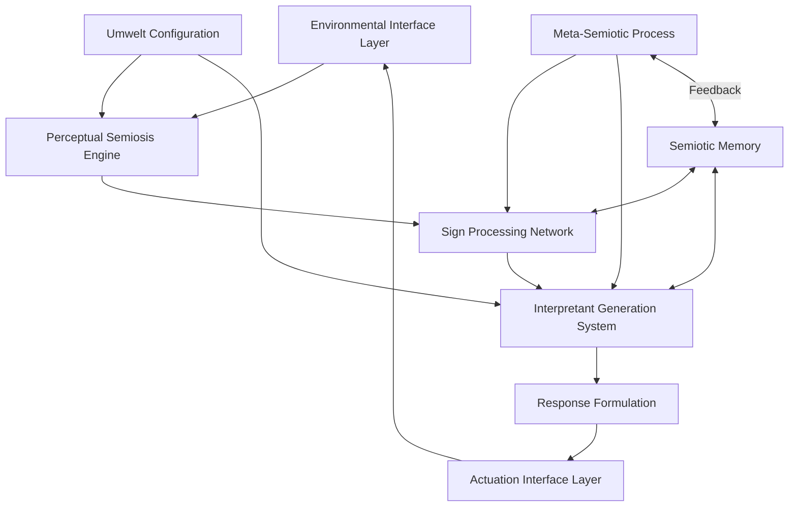

# Biosemiotic Computing: Sign Processes as Computational Paradigm in CEREBRUM

## 1. Introduction to Biosemiotic Computing

Biosemiotic computing represents a fundamental rethinking of computation through the lens of sign processes in living systems. This document outlines a framework for implementing biosemiotic principles within the CEREBRUM ecosystem, developing computational systems that operate through the interpretation and generation of signs—paralleling the sign-based information processing that characterizes all biological systems from cells to ecosystems.

## 2. Theoretical Foundations

### 2.1 Biosemiotic Principles

The biosemiotic computing paradigm draws from key concepts in biosemiotics:

* **Umwelt Theory**: Each organism inhabits a unique semiotic world or "umwelt"
* **Semiosis**: The production and interpretation of signs as a fundamental process
* **Sign Typology**: Peirce's classification of signs (icon, index, symbol)
* **Semiotic Scaffolding**: The layering of semiotic processes in complex systems
* **Code Duality**: The dialectic between analog and digital coding in biology

### 2.2 Biosemiotic Computation

Key principles for translating biosemiotics into computational contexts:

* **Sign-Based Processing**: Computing through sign interpretation rather than symbol manipulation
* **Context Sensitivity**: Processing dependent on the interpretive context
* **Embodied Semantics**: Meaning arising from system-environment interaction
* **Semiotic Emergence**: Higher-order meaning emerging from lower-level sign processes
* **Interpretive Plurality**: Multiple valid interpretations of the same sign

## 3. CEREBRUM Biosemiotic Computing Architecture

### 3.1 System Architecture

The CEREBRUM biosemiotic computing architecture consists of interconnected components:

### 3.2 Core Components

#### 3.2.1 Perceptual Semiosis Engine

* **Sign Detection Systems**: Identifying potential signs in environmental data
* **Modality-Specific Processors**: Specialized sign processing for different modalities
* **Salience Evaluators**: Determining relevance of detected signs
* **Multi-Scale Sign Analysis**: Processing signs at different levels of granularity
* **Context Recognition**: Identifying the context for sign interpretation

#### 3.2.2 Sign Processing Network

* **Iconic Processors**: Systems specialized for similarity-based sign processing
* **Indexical Processors**: Systems specialized for causal/contiguity-based sign processing
* **Symbolic Processors**: Systems specialized for convention-based sign processing
* **Sign Transformers**: Converting between different sign types
* **Sign Relation Analyzers**: Determining relationships between concurrent signs

#### 3.2.3 Interpretant Generation System

* **Meaning Synthesis**: Generating interpretations from processed signs
* **Multiple Interpretation Generators**: Creating several possible interpretations
* **Abductive Inference Engines**: Making best-guess interpretations with incomplete information
* **Interpretive Coherence Analyzers**: Evaluating coherence across interpretations
* **Meta-Interpretive Processes**: Interpretation of the interpretation process itself

#### 3.2.4 Semiotic Memory

* **Sign-Relation Archives**: Storing relationships between signs and interpretations
* **Interpretive Precedent Repository**: Recording previous successful interpretations
* **Context-Interpretation Mappings**: Associating contexts with interpretation patterns
* **Semiotic Rule Extraction**: Deriving rules from semiotic experiences
* **Evolutionary Sign Memory**: Tracking changes in sign relationships over time

## 4. Implementation Technologies

### 4.1 Sign Detection and Processing

* **Multi-Modal Signal Analysis**: Processing diverse environmental signals
* **Pattern Recognition Networks**: Identifying sign patterns across modalities
* **Temporal Sign Sequence Analysis**: Processing signs with temporal relationships
* **Contextual Feature Extraction**: Extracting features relevant to current context
* **Sign-to-Sign Association Networks**: Mapping relationships between different signs

### 4.2 Interpretive Technologies

* **Bayesian Interpretive Networks**: Probabilistic interpretation of ambiguous signs
* **Fuzzy Semantic Mappers**: Handling gradated meanings in sign interpretation
* **Abductive Inference Engines**: Generating plausible interpretations from partial data
* **Hermeneutic Cycles**: Iterative refinement of interpretations
* **Polysemic Resolution Systems**: Handling multiple potential meanings

### 4.3 Response Generation

* **Sign Synthesis Systems**: Generating signs for communication
* **Pragmatic Effect Predictors**: Anticipating effects of sign production
* **Contextual Response Calibration**: Tailoring responses to specific contexts
* **Sign-Based Action Selection**: Choosing actions based on sign interpretation
* **Meta-Communicative Signaling**: Communicating about communication itself

## 5. Application Domains

### 5.1 Human-Computer Interaction

* **Semiotic Interface Design**: Creating interfaces based on natural sign processes
* **Context-Aware Communication**: Adapting communication to situational context
* **Embodied Interaction Systems**: Interaction through meaningful physical engagement
* **Cultural Semiotic Adaptation**: Adapting to cultural variations in sign systems
* **Intuitive Sign-Based Controls**: Control systems based on natural signification

### 5.2 Environmental Interpretation

* **Ecological Sign Reading**: Interpreting signs in natural environments
* **Biosemiotic Monitoring**: Tracking ecosystem health through sign interpretation
* **Environmental Communication**: Communicating with natural systems
* **Multi-Species Sign Translation**: Bridging communication between species
* **Ecosystem Semiotic Modeling**: Modeling sign processes in ecosystems

### 5.3 Cognitive Computing

* **Abductive Reasoning Systems**: Computing based on best-explanation inference
* **Metaphorical Computation**: Processing through metaphorical relationships
* **Narrative Intelligibility**: Understanding through narrative structures
* **Embodied Semantic Networks**: Meaning grounded in physical interaction
* **Creative Interpretation Engines**: Generating novel interpretations

### 5.4 Biological Interface Systems

* **Cell Signaling Translation**: Interfacing with cellular communication systems
* **Neural Sign Interface**: Communication with neural systems through natural signaling
* **Physiological Sign Interpretation**: Reading and responding to physiological signs
* **Microbial Communication Systems**: Interfacing with microbial communities
* **Organic-Digital Sign Translation**: Bridging organic and digital sign systems

## 6. Experimental Implementations

### 6.1 Prototype System: UMWELT

The UMWELT (Universal Meaning-Weaving Environmental Language Translator) system demonstrates key principles of biosemiotic computing:

* **Core Function**: Interpretation and generation of signs across modalities
* **Design Approach**: Modeled after natural semiotic processes in biological systems
* **Technical Foundation**: Integrates perception, interpretation, and response systems
* **Application Focus**: Environmental interpretation and multi-species communication
* **Evaluation Method**: Measures interpretive accuracy and communication effectiveness

### 6.2 Case Studies

* **Forest Ecosystem Interpretation**: Reading and responding to forest ecosystem signs
* **Human Intention Translation**: Interpreting subtle human communicative intentions
* **Microbial Community Dialogue**: Communication with soil microbial communities
* **Cross-Species Mediation**: Facilitating communication between different species
* **Built Environment Semiotics**: Interpreting signs within human-built environments

## 7. Theoretical Implications

### 7.1 Computer Science Implications

* **Beyond Symbol Manipulation**: Moving beyond traditional symbolic computation
* **Biosemiotic Algorithms**: New algorithmic approaches based on sign processes
* **Interpretive Computation**: Computing through interpretation rather than calculation
* **Context-Dependent Processing**: Formal models for context-sensitive computation
* **Meaning-Based Computing**: Computation oriented around meaning rather than syntax

### 7.2 Biosemiotic Theory Implications

* **Computational Biosemiotics**: Extending biosemiotic theory through computational models
* **Digital Umwelt Theory**: Understanding digital entities through umwelt concepts
* **Artificial Semiosis**: Theoretical frameworks for non-biological sign processes
* **Semiotic Complexity Measures**: Quantifying complexity of semiotic systems
* **Techno-Biological Semiotic Integration**: Bridging biological and technological sign systems

## 8. Ethical and Philosophical Considerations

### 8.1 Ethical Frameworks

* **Semiotic Agency Recognition**: Respecting the sign-processing agency of systems
* **Communication Responsibility**: Ethical obligations in cross-domain communication
* **Interpretive Transparency**: Making interpretive processes transparent
* **Semiotic Diversity Preservation**: Maintaining diversity of sign systems
* **Cross-Domain Semiotic Ethics**: Ethical principles for trans-species communication

### 8.2 Philosophical Dimensions

* **Computational Meaning**: Reconceptualizing meaning in computational contexts
* **Semiotic Ontology**: Understanding reality through sign processes
* **Digital-Organic Continuity**: Exploring continuities between digital and organic systems
* **Semiotic Emergence**: Understanding how meaning emerges from sign processes
* **Interpretive Pluralism**: Philosophical frameworks for multiple valid interpretations

## 9. Future Research Directions

### 9.1 Short-Term Research Agenda

* **Sign Process Formalization**: Developing formal models of sign processes
* **Cross-Modal Semiotic Integration**: Systems integrating signs across modalities
* **Context Representation**: Techniques for representing interpretive contexts
* **Semiotic Learning Algorithms**: Learning approaches based on sign interpretation
* **Evaluation Methodologies**: Methods for assessing biosemiotic computing systems

### 9.2 Long-Term Vision

* **Universal Semiotic Translators**: Systems mediating between any sign domains
* **Ecosystem-Level Semiotic Interface**: Communication with entire ecosystems
* **Evolutionary Semiotic Systems**: Sign systems that evolve through use
* **Planetary Semiosphere Integration**: Connecting with Earth's global sign processes
* **Novel Sign System Generation**: Creating entirely new forms of semiosis

## 10. Integration with CEREBRUM Ecosystem

### 10.1 Connections to Other CEREBRUM Components

* **CYCLE Language Semiotic Extensions**: Semiotic primitives for CYCLE language
* **Mycelial Network Semiotic Integration**: Sign processes through mycelial networks
* **Embodied Cognition Sign Systems**: Connecting with embodied computing through signs
* **Dream-State Semiotic Processing**: Semiotic aspects of dream-state computation
* **Ritual Computing Semiotic Frameworks**: Sign processes in computational rituals

### 10.2 Implementation Roadmap

* **Phase 1**: Development of fundamental sign processing capabilities
* **Phase 2**: Creation of interpretive systems and semiotic memory
* **Phase 3**: Integration with perception and action systems
* **Phase 4**: Development of specialized biosemiotic applications
* **Phase 5**: Implementation of cross-domain semiotic translation systems

## 11. Conclusion

Biosemiotic computing represents a radical reconceptualization of computation through the lens of the sign processes that characterize all living systems. By modeling computation on the interpretation and production of signs rather than abstract symbol manipulation, we create systems that can engage meaningfully with the rich semiotic environments of biological systems, human cultures, and technological networks.

As CEREBRUM continues to evolve, biosemiotic computing provides critical capabilities for systems that must interpret and respond to complex, context-dependent meanings across diverse domains—from cellular signals to ecosystem dynamics to human cultural expressions. This approach opens new possibilities for technologies that can participate in the vast web of meaning-making that constitutes life on Earth, creating bridges between human, technological, and biological semiotic domains. 