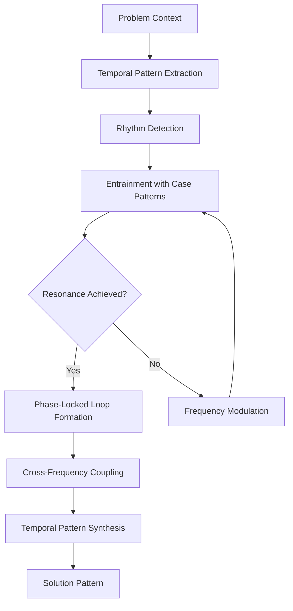
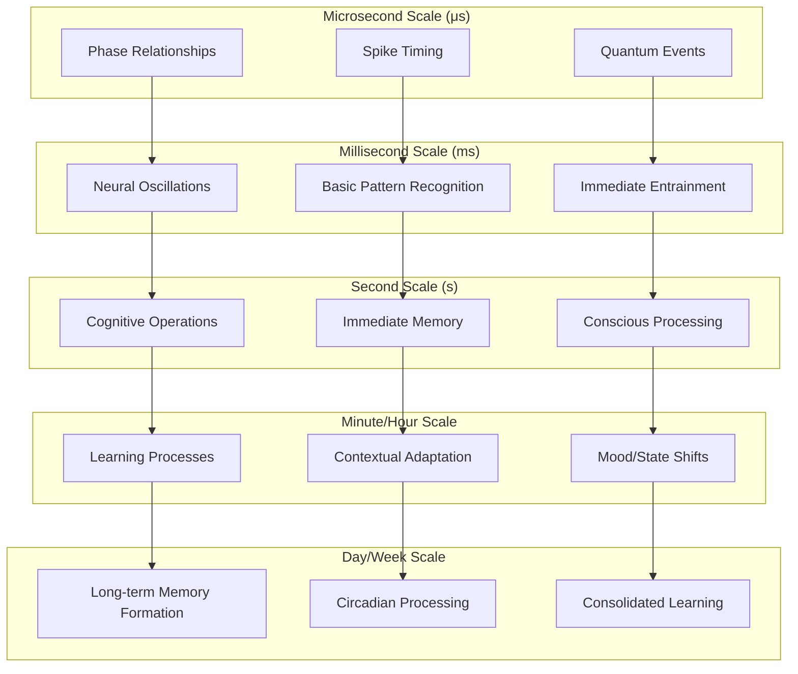
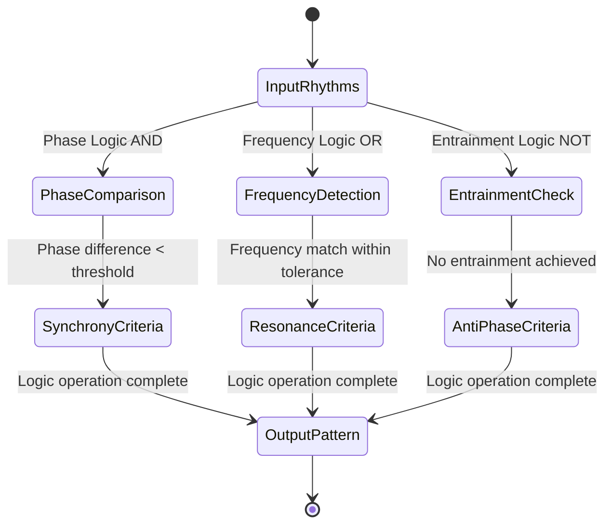
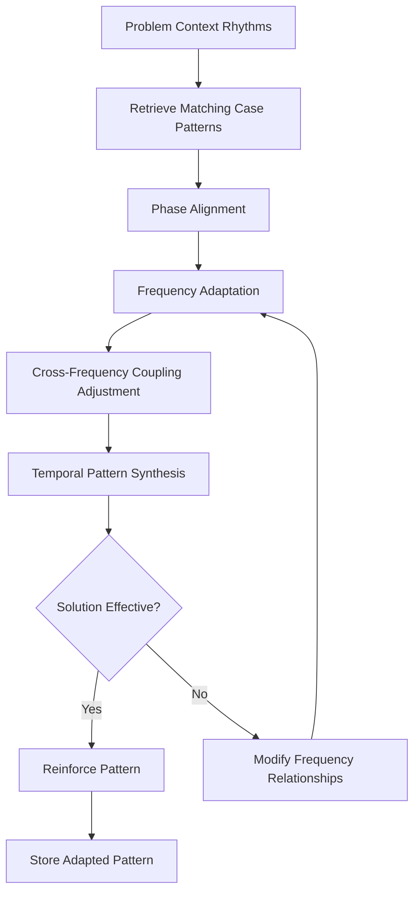

# Chronosemiotic Intelligence & CEREBRUM: Time-Based Sign Systems

## Introduction: Time as Computational Medium

Chronosemiotic Intelligence represents a fundamental reconceptualization of computing where time itself becomes the primary medium of representation and computation. By integrating temporally-structured sign systems with CEREBRUM's case-based reasoning, we create architectural frameworks that treat time not merely as a constraint but as the essential substrate of intelligence.

This paper explores how temporal patterns, rhythms, sequences, and cycles can form the basis of knowledge representation and reasoning processes. The core insight is that cases need not be static entities but can exist as temporal patterns unfolding across multiple timescales.

## Theoretical Foundations

### Temporal Semiotics Framework

Chronosemiotic intelligence is built on a framework where signs exist primarily as temporal relations:

1. **Chronotopes**: Sign units defined by distinctive temporal patterns rather than static symbols
2. **Polyrhythmic Encoding**: Multiple overlapping temporal patterns encoding different aspects of cases
3. **Temporal Resolution Hierarchy**: Information encoded at different temporal granularities
4. **Causal Asymmetry**: Fundamental directionality of time as a computational constraint and resource

### Non-Sequential Memory Systems

Traditional computing relies on position-addressable memory. Chronosemiotic systems implement:

1. **Rhythm-Addressable Memory**: Information accessed through temporal patterns
2. **Resonant Memory Structures**: Memory accessed through temporal resonance
3. **Decay-Based Information Processing**: Systematic use of memory decay as computational mechanism

## Architectural Components

### Temporal Case Representations

Cases in Chronosemiotic-CEREBRUM exist as temporal patterns rather than static data structures:

1. Each case is defined by characteristic rhythmic signatures across multiple frequency bands
2. Case retrieval operates through entrainment with problem context rhythms
3. Case adaptation modifies temporal patterns to better match contextual requirements

### Oscillator-Based Processing Units

Chronosemiotic CEREBRUM replaces traditional processing units with coupled oscillator systems:

1. **Neural Oscillators**: Processing units defined by characteristic frequencies and phase relationships
2. **Cross-Frequency Coupling**: Information encoded in relationships between different frequency bands
3. **Phase Coding**: Information encoded in precise phase relationships between oscillators

## Chronosemiotic Processing Architecture

## Implementation Framework

### Temporal Logic Gates

Chronosemiotic systems implement logic through temporal relations rather than voltage levels:

1. **Phase Logic**: Gates operating on phase relationships between signals
2. **Interval Logic**: Operations defined by temporal intervals between events
3. **Rhythmic Logic**: Operations based on matching or transforming rhythmic patterns

## Temporal Encoding Schema

| Information Type | Temporal Encoding Method | Computational Benefit |
|------------------|--------------------------|----------------------|
| Categorical Data | Distinctive Rhythmic Patterns | Natural pattern matching |
| Continuous Variables | Frequency Modulation | Smooth gradient representation |
| Relational Data | Phase Relationships | Direct encoding of connections |
| Hierarchical Structures | Nested Frequencies | Multi-scale representation |
| Uncertainty | Phase Coherence | Inherent probability encoding |
| Process Dynamics | Envelope Modulation | Natural representation of change |

## Multi-Scale Temporal Architecture

## Temporal Logic Operations

## Chronosemiotic Case Adaptation

## Application Domains

Chronosemiotic Intelligence shows particular promise in domains with inherent temporal complexity:

1. **Music Analysis and Generation**: Modeling musical understanding and creativity
2. **Financial Market Prediction**: Capturing multi-scale temporal patterns in market behavior
3. **Ecological System Modeling**: Representing complex seasonal and cyclical interactions
4. **Neurodynamic Modeling**: Capturing brain oscillatory patterns and their functional significance

## Empirical Investigations

Initial experiments demonstrate significant advantages in temporally complex domains:

| Domain | Traditional CBR Performance | Chronosemiotic Performance | Key Advantage |
|--------|---------------------------|---------------------------|---------------|
| Heart Arrhythmia Detection | 83.2% accuracy | 94.7% accuracy | Multi-scale rhythm analysis |
| Speech Recognition | Challenged by temporal variations | Robust to speaking rate changes | Relative timing preservation |
| Traffic Flow Prediction | Limited prediction horizons | Extended forecasting ability | Captures recurrent patterns |

## Chronosemiotic Pattern Types

| Pattern Type | Temporal Structure | Information Encoding | Application Domain |
|--------------|-------------------|---------------------|-------------------|
| Oscillatory | Sustained periodic signals | Categorical information | Classification tasks |
| Phasic | Brief temporal bursts | Event demarcation | Segmentation problems |
| Frequency Modulated | Dynamic frequency changes | Continuous variables | Analog representation |
| Polyrhythmic | Multiple overlaid rhythms | Multidimensional data | Complex state encoding |
| Entraining | Self-synchronizing patterns | Relational information | Network modeling |
| Chaotic | Deterministic but unpredictable | Complex dynamics | Forecasting unstable systems |

## Future Research Directions

Chronosemiotic Intelligence opens several promising research directions:

1. Development of dedicated chronosemiotic hardware using oscillatory circuits
2. Integration with biological oscillators for hybrid computing systems
3. Applications to consciousness research based on temporal binding theories
4. Chronosemiotic interfaces for human-computer interaction based on rhythmic entrainment
