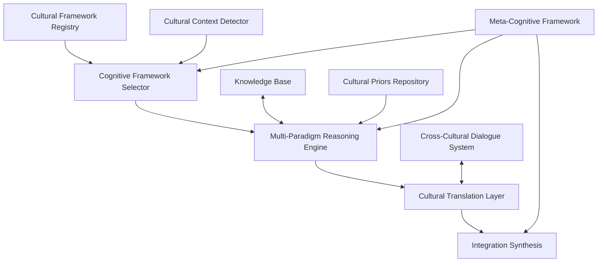

# Cross-Cultural Cognitive Frameworks: Pluralistic Intelligence in CEREBRUM

## 1. Introduction to Cross-Cultural Cognition

Cross-cultural cognitive frameworks represent a paradigm shift in computational intelligence by drawing from diverse cultural models of mind, knowledge, and reasoning. This document outlines an approach for integrating multiple cultural cognitive frameworks within the CEREBRUM ecosystem, moving beyond the Western-centric models that have dominated AI development to create systems capable of pluralistic intelligence—computational thinking grounded in the rich diversity of human cognitive traditions.

## 2. Theoretical Foundations

### 2.1 Cultural Cognitive Diversity

The cross-cultural cognitive framework draws from multiple traditions:

* **Epistemological Pluralism**: Multiple valid ways of knowing across cultures
* **Ontological Diversity**: Different foundational assumptions about reality
* **Cognitive Linguistics Variation**: How languages shape conceptual frameworks
* **Cultural Psychology**: Culture-specific psychological processes
* **Indigenous Knowledge Systems**: Place-based, relational knowledge traditions

### 2.2 Computational Implications

Key principles for translating cultural cognitive diversity into computational systems:

* **Multiple Logic Systems**: Beyond classical logic to include diverse logical frameworks
* **Relational Ontologies**: Defining entities through relationships rather than intrinsic properties
* **Embodied Cultural Cognition**: Cognition shaped by cultural practices and environments
* **Narrative-Based Reasoning**: Knowledge organization through culturally-grounded narratives
* **Metaphorical Framework Diversity**: Multiple metaphorical foundations for abstract concepts

## 3. CEREBRUM Cross-Cultural Cognitive Architecture

### 3.1 System Architecture

The CEREBRUM cross-cultural cognitive architecture consists of interconnected components:

### 3.2 Core Components

#### 3.2.1 Cultural Framework Registry

* **Cognitive Model Library**: Repository of culturally-specific cognitive frameworks
* **Epistemological Pattern Collection**: Diverse knowledge validation strategies
* **Metaphorical Framework Repository**: Culture-specific conceptual metaphors
* **Relational Ontology Maps**: Cultural models of entity-relationship structures
* **Narrative Knowledge Structures**: Templates for narrative-based knowledge organization

#### 3.2.2 Multi-Paradigm Reasoning Engine

* **Logical Framework Switcher**: Dynamically selecting logical systems
* **Analogical Reasoning Across Paradigms**: Finding connections between different frameworks
* **Complementary Analysis Generation**: Analyzing problems through multiple frameworks
* **Cultural Contextual Reasoning**: Adapting reasoning to cultural contexts
* **Paradigm-Appropriate Heuristics**: Using culturally-attuned problem-solving shortcuts

#### 3.2.3 Cultural Translation Layer

* **Concept Mapping Systems**: Translating concepts across cultural frameworks
* **Metaphor Translation**: Mapping between different metaphorical systems
* **Ontological Bridge Building**: Creating connections between different reality models
* **Epistemological Conversion**: Translating between knowledge validation frameworks
* **Explanation Generation**: Creating culturally-appropriate explanations

#### 3.2.4 Integration Synthesis

* **Multi-Framework Integration**: Synthesizing insights from different frameworks
* **Complementarity Recognition**: Identifying how frameworks complement each other
* **Contradiction Resolution**: Reconciling apparent contradictions between frameworks
* **Meta-Pattern Recognition**: Identifying patterns that transcend specific frameworks
* **Unified Representation Construction**: Building representations that bridge frameworks

## 4. Implementation Technologies

### 4.1 Knowledge Representation

* **Multi-Ontological Knowledge Graphs**: Representing knowledge across ontological systems
* **Cultural Frame Networks**: Networks of culture-specific interpretive frames
* **Narrative Knowledge Structures**: Representing knowledge in narrative formats
* **Metaphorical Mapping Systems**: Explicit representation of metaphorical structures
* **Relational Databases with Cultural Parameters**: Data structures sensitive to cultural framing

### 4.2 Reasoning Systems

* **Non-Western Logic Implementations**: Computational implementations of diverse logics
* **Cultural Bayesian Networks**: Bayesian systems with culturally-variable priors
* **Narrative Reasoning Engines**: Inference through narrative coherence
* **Analogical Mapping Systems**: Sophisticated cross-domain analogy capabilities
* **Dialectical Reasoning Frameworks**: Systems for thesis-antithesis-synthesis patterns

### 4.3 Natural Language Processing

* **Culture-Specific Semantic Analyzers**: Semantics sensitive to cultural contexts
* **Multi-Lingual Conceptual Mapping**: Mapping concepts across language barriers
* **Culturally-Calibrated Pragmatics**: Understanding language use in cultural contexts
* **Indigenous Language Processing**: NLP systems for indigenous languages
* **Cultural Code-Switching**: Managing transitions between linguistic-cultural frameworks

## 5. Application Domains

### 5.1 Global Collaboration Systems

* **Cross-Cultural Team Facilitation**: Supporting teams with diverse cultural backgrounds
* **Cultural Translation for Collaboration**: Mediating between different cultural frameworks
* **Multi-Paradigm Problem Solving**: Approaching problems through multiple cultural lenses
* **Intercultural Negotiation Support**: Facilitating negotiations across cultural boundaries
* **Shared Understanding Development**: Building bridges between different worldviews

### 5.2 Educational Applications

* **Multi-Epistemological Learning Environments**: Supporting diverse ways of knowing
* **Cultural Knowledge Preservation**: Maintaining and transmitting cultural knowledge
* **Cross-Cultural Knowledge Exchange**: Facilitating knowledge sharing across cultures
* **Cognitive Flexibility Development**: Building capacity to work across frameworks
* **Cultural Humility Training**: Developing openness to diverse cognitive approaches

### 5.3 Design and Innovation

* **Cross-Cultural Design Thinking**: Design approaches drawing from diverse traditions
* **Innovation Through Cognitive Diversity**: Using multiple frameworks for creativity
* **Culturally-Inclusive Product Development**: Creating products for diverse users
* **Multi-Metaphorical Ideation**: Generating ideas using diverse metaphorical systems
* **Traditional Knowledge Integration**: Incorporating indigenous knowledge into innovation

### 5.4 Global Challenges

* **Multi-Perspective Problem Analysis**: Examining global issues through multiple lenses
* **Cultural-Ecological Knowledge Systems**: Integrating diverse ecological knowledges
* **Health System Integration**: Bridging traditional and conventional medical approaches
* **Sustainable Development Frameworks**: Integrating diverse sustainability concepts
* **Climate Change Response Diversity**: Multiple cultural approaches to climate challenges

## 6. Experimental Implementations

### 6.1 Prototype System: PLURICOG

The PLURICOG (Pluralistic Cognitive Frameworks) system demonstrates key principles of cross-cultural cognitive computing:

* **Core Function**: Reasoning across multiple cultural cognitive frameworks
* **Design Approach**: Developed through collaboration with cultural knowledge holders
* **Technical Foundation**: Integrates multiple ontological and epistemological systems
* **Application Focus**: Cross-cultural collaboration and problem-solving
* **Evaluation Method**: Assessed for efficacy across diverse cultural contexts

### 6.2 Case Studies

* **Medicine Across Traditions**: Integration of diverse medical knowledge systems
* **Multi-Cultural Climate Adaptation**: Climate strategies drawing from diverse traditions
* **Educational Content Translation**: Translation across educational frameworks
* **Diplomatic Negotiation Support**: Facilitating international diplomatic processes
* **Architectural Design Synthesis**: Integrating architectural traditions in design

## 7. Theoretical Implications

### 7.1 Cognitive Science Implications

* **Cultural Cognitive Diversity**: Evidence for culture's impact on cognition
* **Universal-Particular Balance**: Understanding universal versus culture-specific cognition
* **Multiple Intelligences Refinement**: Culture-specific manifestations of intelligence
* **Cognitive Ecology Theory**: Understanding minds in cultural-environmental contexts
* **Extended Mind Across Cultures**: How cultural artifacts extend cognition differently

### 7.2 Artificial Intelligence Implications

* **Post-Universal AI**: Moving beyond universal models of intelligence
* **Culturally-Situated Machine Learning**: ML approaches grounded in cultural contexts
* **Ontological Pluralism in AI**: Systems comfortable with multiple reality models
* **Value Alignment Diversity**: Aligning AI with diverse cultural values
* **Explainable AI Across Cultures**: Making AI explainable in culturally-relevant ways

## 8. Ethical and Cultural Considerations

### 8.1 Ethical Frameworks

* **Cultural Appropriation Prevention**: Avoiding extractive approaches to cultural knowledge
* **Knowledge Sovereignty**: Respecting ownership and control of cultural knowledge
* **Representational Justice**: Ensuring fair representation of diverse traditions
* **Attribution and Recognition**: Properly acknowledging knowledge sources
* **Benefit Sharing**: Ensuring communities benefit from their knowledge contributions

### 8.2 Cultural Engagement Principles

* **Deep Engagement Commitment**: Moving beyond superficial cultural borrowing
* **Collaborative Development**: Co-creating with cultural knowledge holders
* **Cultural Context Preservation**: Maintaining knowledge in its cultural context
* **Living Knowledge Approach**: Treating cultural knowledge as evolving, not static
* **Reciprocal Learning Stance**: Learning from rather than just about cultures

## 9. Future Research Directions

### 9.1 Short-Term Research Agenda

* **Cultural Cognitive Mapping**: Documenting diverse cognitive frameworks
* **Cross-Cultural Translation Systems**: Tools for concept translation across cultures
* **Non-Western Logic Implementations**: Computational implementations of diverse logics
* **Cultural Priors in Machine Learning**: Incorporating cultural assumptions in ML
* **Evaluation Across Cultures**: Methods for cross-cultural system evaluation

### 9.2 Long-Term Vision

* **True Cognitive Pluralism**: Systems that seamlessly navigate multiple frameworks
* **Cultural Framework Evolution**: Systems that participate in cultural knowledge evolution
* **Novel Synthesis Frameworks**: New cognitive frameworks emerging from integration
* **Global-Local Knowledge Integration**: Bridging universal and situated knowledge
* **Indigenous AI Development**: AI systems developed from indigenous foundations

## 10. Integration with CEREBRUM Ecosystem

### 10.1 Connections to Other CEREBRUM Components

* **CYCLE Language Cultural Extensions**: Cultural cognitive primitives for CYCLE
* **Ritual Computing Cultural Variations**: Culture-specific ritual computational patterns
* **Dream-State Cultural Manifestations**: Culturally-variable dream-state processing
* **Mythic Resonance Cultural Mapping**: Connecting with diverse mythic frameworks
* **Biosemiotic Cultural Sign Systems**: Culture-specific sign interpretation systems

### 10.2 Implementation Roadmap

* **Phase 1**: Development of cultural cognitive framework registry
* **Phase 2**: Creation of multi-paradigm reasoning capabilities
* **Phase 3**: Integration of cultural translation mechanisms
* **Phase 4**: Development of applications for key domains
* **Phase 5**: Implementation of evolutionary cultural learning systems

## 11. Conclusion

Cross-cultural cognitive frameworks represent a fundamental reconceptualization of computational intelligence, moving beyond the Western-centric models that have dominated AI development to embrace the rich diversity of human cognitive traditions. By implementing systems capable of reasoning across multiple cultural frameworks, CEREBRUM opens new possibilities for computational systems that can engage meaningfully with the full spectrum of human knowledge and wisdom.

As CEREBRUM continues to evolve, the integration of cross-cultural cognitive frameworks provides critical capabilities for systems that must operate in our diverse global context—creating technologies that do not merely impose a single cognitive framework, but that can authentically engage with, learn from, and contribute to the plurality of ways that humans across cultures make meaning of the world. 