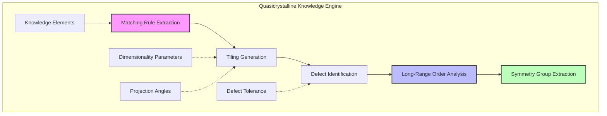
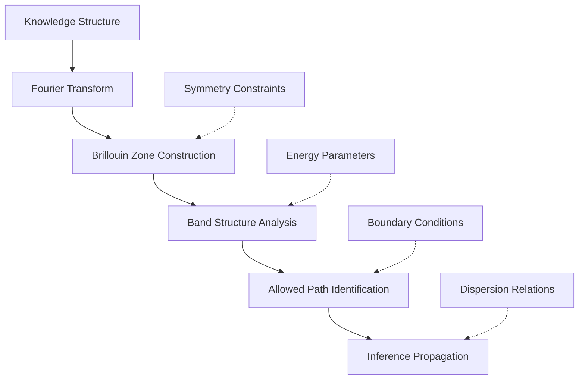
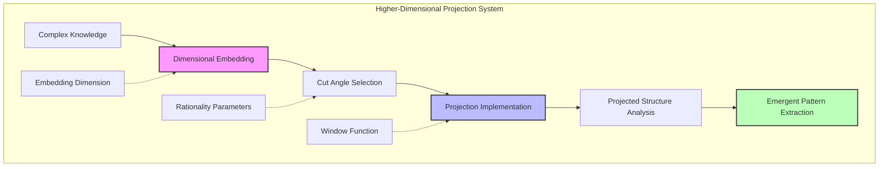
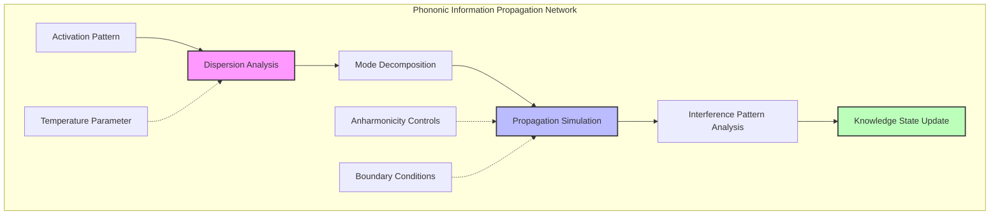
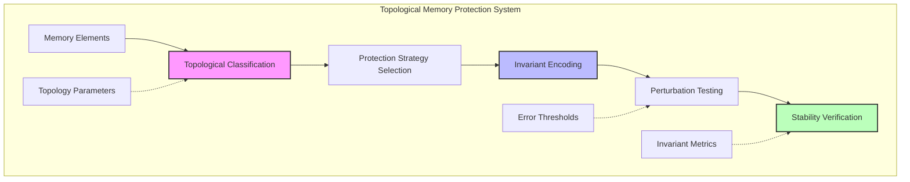
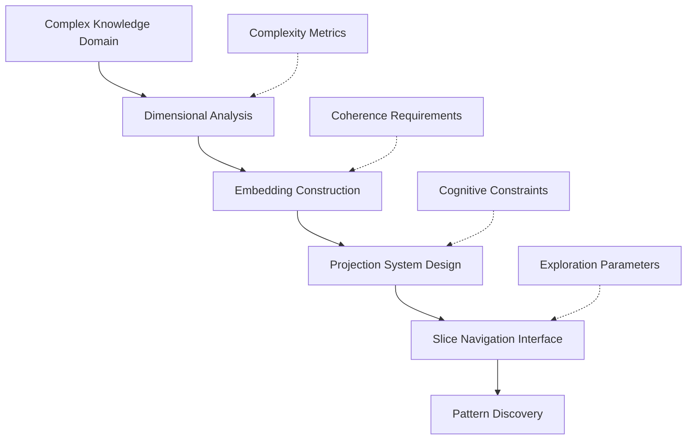
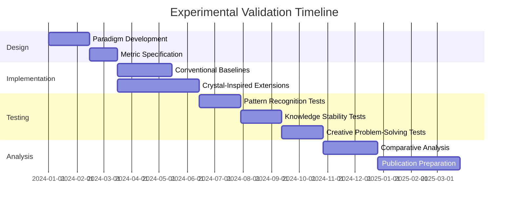
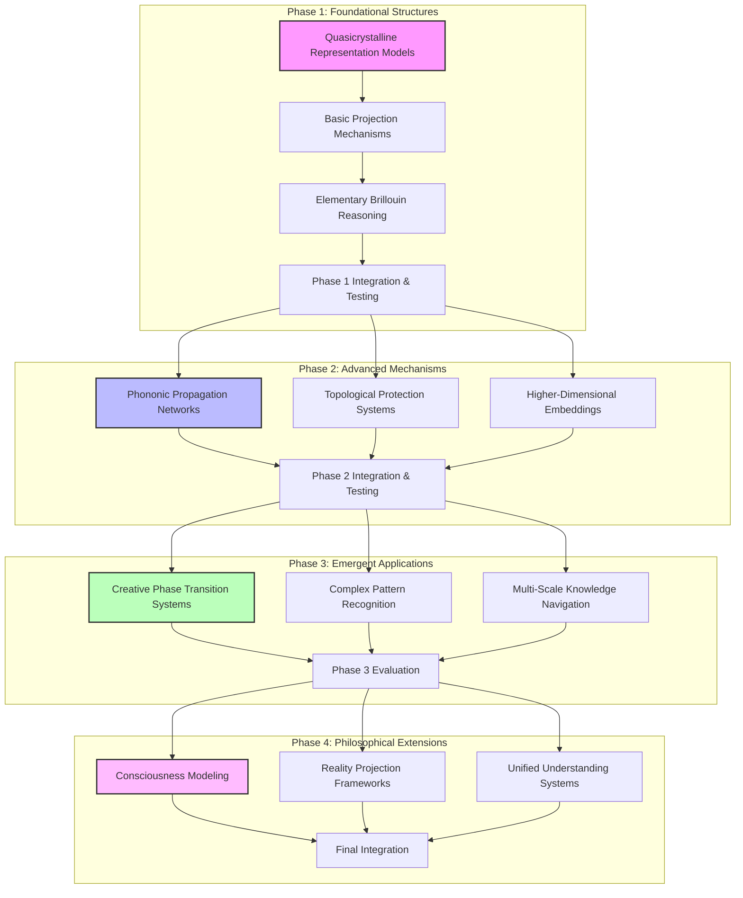

# Speculative Design: Crystal Lattice Intelligence and CEREBRUM Integration

## 1. Introduction: Crystalline Structures of Thought

This document explores the speculative integration between crystal lattice mathematics, quasicrystalline information patterning, and the Case-Enabled Reasoning Engine with Bayesian Representations for Unified Modeling (CEREBRUM). Both crystalline structures and cognitive architectures engage with fundamental questions about ordered complexity, emergent patterning, and the manifestation of higher-dimensional symmetries within lower-dimensional constraints.

The Nobel laureate Roger Penrose's discovery of aperiodic tilings that exhibit five-fold symmetry—previously thought impossible in conventional crystallography—provides a powerful metaphor for how the mind might achieve seemingly impossible feats of cognition through non-conventional structural arrangements. While operating in different domains—crystal lattice theory in condensed matter physics and CEREBRUM in cognitive modeling—both frameworks address similar challenges: optimal arrangement of elements within constrained geometries, long-range order with local variability, and emergent properties that transcend component-level descriptions.

## 2. Crystal Lattice Theory: Key Concepts and Frameworks

### 2.1 Foundational Principles of Crystalline Intelligence

Crystal lattice theory provides profound insights into structured information representation and processing:

* **Periodic Lattice Arrangements**: Classical crystals exhibit perfect repeating patterns in three-dimensional space, with unit cells that tessellate through space, creating domains of perfect translational and rotational symmetry.

* **Quasicrystalline Structures**: Non-periodic arrangements that nevertheless exhibit long-range order and quasi-symmetries, suggesting ways information can be structured without repetition while maintaining coherence.

* **Forbidden Symmetries**: Traditionally "impossible" five-fold, eight-fold, and other symmetries in quasicrystals that emerge from higher-dimensional projections into lower-dimensional spaces.

* **Defect Dynamics**: The crucial role of defects, dislocations, and grain boundaries in determining crystal properties, suggesting cognitive analogues where imperfections enable functionality.

* **Brillouin Zones**: Energy landscapes defining allowed and forbidden states within crystal structures, providing frameworks for understanding information propagation through structured environments.

### 2.2 Dimensional Projection and Emergence

The phenomenon of dimensional projection in crystallography has profound cognitive implications:

* **Higher-Dimensional Projections**: Quasicrystals' non-repeating yet ordered patterns can be understood as projections of higher-dimensional perfect lattices into lower-dimensional spaces, suggesting cognitive processes might be projections of higher-dimensional constructs.

* **Cut-and-Project Method**: Techniques for generating complex lower-dimensional structures by "slicing" through higher-dimensional perfect lattices at irrational angles.

* **Phason Dynamics**: Collective excitations unique to quasicrystals that represent rearrangements of entire structural motifs rather than individual elements.

* **Holographic Principles**: The encoding of volumetric information on boundary surfaces, suggesting ways entire knowledge domains might be encoded in lower-dimensional representations.

* **Symmetry Breaking**: Phase transitions where perfect symmetry gives way to lower-symmetry states that enable functional specificity.

### 2.3 Information-Theoretic Crystal Properties

Crystal structures exhibit information-theoretic properties with cognitive relevance:

* **Long-Range Coherence**: The ability of crystalline structures to maintain ordered relationships across vast scales without direct connections between distant elements.

* **Phonon Information Transfer**: Wave-like excitations that propagate through crystal lattices, carrying information across the structure without material transport.

* **Topological Protection**: Structural properties resistant to perturbation due to topological constraints, suggesting mechanisms for stable memory storage.

* **Critical Phenomena**: Phase transitions and critical points where small inputs can trigger large-scale, coordinated structural reorganizations.

* **Frustration and Adaptation**: Incompatible local constraints that lead to complex global arrangements and adaptive structural modulations.

## 3. CEREBRUM's Core Frameworks: A Brief Overview

To facilitate comparison with crystalline concepts, we review key aspects of CEREBRUM:

### 3.1 Case-Based Representation and Reasoning

CEREBRUM employs case structures as fundamental units of knowledge representation:
- Encoding relationships between entities in flexible, contextual formats
- Supporting analogical reasoning across domains
- Enabling multiple perspectives on the same situation
- Functioning within a Bayesian framework for inference and learning

### 3.2 The Bayesian Framework and Active Inference

CEREBRUM implements computational principles from:
- The Free Energy Principle and Active Inference
- Hierarchical predictive processing
- Variational Bayesian methods
- Precision-weighted belief updating

### 3.3 Modular Integration and Cognitive Architecture

CEREBRUM provides:
- A modular architecture integrating different cognitive functions
- Standardized interfaces between components
- Mechanisms for attention and resource allocation
- Frameworks for representing dynamics across temporal scales

## 4. Crystalline Intelligence and CEREBRUM: Speculative Integrations

This section explores how crystal lattice concepts might transform CEREBRUM's frameworks.

### 4.1 Quasicrystalline Knowledge Representation

Quasicrystalline structures suggest novel approaches to knowledge representation in CEREBRUM:

* **Aperiodic Case Tessellations**: Organizing case structures as Penrose-like aperiodic tilings, where cases connect through defined matching rules that generate infinite non-repeating patterns with long-range order.

* **Self-Similar Knowledge Nesting**: Implementing fractal-like representations where knowledge patterns repeat at different scales with systematic variations, enabling efficient encoding of hierarchical information.

* **Symmetry-Based Abstraction**: Developing abstraction mechanisms based on symmetry operations, where higher-level concepts emerge as symmetry groups acting on lower-level representations.

* **Defect-Mediated Adaptation**: Utilizing deliberate "defects" in knowledge structures—analogous to crystal dislocations—that enable flexibility, learning, and structural reorganization while maintaining global coherence.

* **Forbidden Knowledge Symmetries**: Exploring "impossible" knowledge arrangements that, like forbidden crystallographic symmetries, emerge from projections of higher-dimensional perfect knowledge structures into more limited cognitive spaces.

This quasicrystalline approach would transform CEREBRUM's knowledge representation from traditional symbolic or connectionist structures to geometrically constrained patterns with emergent global properties.

### 4.2 Brillouin Zone Reasoning

Brillouin zones from solid-state physics suggest novel reasoning frameworks for CEREBRUM:

* **Cognitive Momentum Space**: Mapping cognitive operations to momentum-like transformations in a dual space to direct knowledge representation, revealing hidden periodicities and constraints.

* **Allowed State Propagation**: Defining reasoning paths in terms of "allowed bands" through knowledge space, with "bandgaps" representing prohibited inference patterns.

* **Logical Reciprocal Lattice**: Constructing a reciprocal lattice for knowledge structures where logical relationships become more apparent, enabling efficient identification of entailments and contradictions.

* **Phase Space Reasoning**: Implementing reasoning mechanisms that operate in the phase space of knowledge representations, tracking both structural "positions" and transformational "momenta" simultaneously.

* **Fermi Surface Decision Boundaries**: Creating adaptive decision boundaries analogous to Fermi surfaces, separating activated from unactivated knowledge based on contextual "energy levels."

This approach would enhance CEREBRUM's reasoning capabilities by importing sophisticated concepts from solid-state physics into cognitive architecture.

### 4.3 Dimensional Projection for Cognitive Compression

The dimensional projection phenomena in quasicrystals suggests powerful approaches for cognitive compression:

* **Higher-Dimensional Knowledge Encoding**: Representing complex, seemingly non-coherent knowledge structures as projections of simpler, perfectly ordered higher-dimensional constructs.

* **Irrational Slice Perspectives**: Generating different viewpoints and interpretations by taking different "slices" through higher-dimensional knowledge spaces, where each slice reveals different patterns from the same unified structure.

* **Window Function Attention**: Implementing attention mechanisms as "window functions" that select regions of higher-dimensional spaces for projection into conscious awareness.

* **Phason-Mediated Restructuring**: Enabling large-scale, coherent knowledge reorganization through phason-like collective motions rather than piecemeal rewiring.

* **Dimensional Lifting Operations**: Developing operations that "lift" problematic lower-dimensional knowledge structures into higher dimensions where contradictions resolve and new relationships become apparent.

This framework would provide CEREBRUM with sophisticated mechanisms for compressing, organizing, and manipulating complex knowledge through dimensional transformations.

### 4.4 Phononic Information Propagation

Crystal phonon dynamics suggest novel perspectives on information propagation in CEREBRUM:

* **Cognitive Phonon Channels**: Implementing information transmission through wave-like excitations in knowledge structures, enabling efficient long-range coordination without direct connections.

* **Band-Limited Inference**: Structuring reasoning processes into "frequency bands" with different propagation properties, from rapid, surface-level associations to deep, foundational inferences.

* **Thermal Noise Exploitation**: Utilizing cognitive "thermal noise" as a resource for exploring knowledge spaces through phonon-like excitations at different "temperatures."

* **Optical vs. Acoustic Modes**: Differentiating between "optical" cognitive processes (involving counter-motions of different knowledge elements) and "acoustic" processes (involving coherent motions of entire knowledge regions).

* **Anharmonic Knowledge Coupling**: Implementing non-linear couplings between knowledge elements that enable complex, context-sensitive information propagation beyond simple spreading activation.

This approach would enhance CEREBRUM's information propagation mechanisms by incorporating sophisticated wave-based dynamics inspired by crystalline phonon transport.

### 4.5 Topologically Protected Memory

Topological protection phenomena in crystal structures suggest novel approaches to memory stability:

* **Edge State Representations**: Storing critical knowledge in topologically protected "edge states" that resist degradation due to their fundamental mathematical properties.

* **Bulk-Boundary Correspondence**: Establishing relationships between core knowledge (bulk) and accessible memory (boundary) through mathematical mappings that ensure consistency.

* **Memory Gap Solitons**: Encoding memories as self-reinforcing soliton waves that maintain their integrity while propagating through knowledge structures.

* **Braiding Operations**: Implementing topologically protected transformations of knowledge through "braiding" operations that leave essential relationships invariant.

* **Topological Phase Transitions**: Modeling major cognitive reorganizations as topological phase transitions where global knowledge properties change while preserving critical structural invariants.

This framework would provide CEREBRUM with exceptionally stable memory systems grounded in the mathematics of topological protection.

## 5. Technical Implementation: Crystal-Inspired CEREBRUM Extensions

This section outlines technical approaches for implementing crystal-inspired features in CEREBRUM.

### 5.1 Quasicrystalline Knowledge Engine

The quasicrystalline knowledge engine would implement:

* **Penrose Tiling Algorithms**: Methods for generating and maintaining non-repeating yet ordered arrangements of knowledge elements with long-range coherence.

* **Matching Rule Enforcement**: Mechanisms ensuring local constraints between knowledge elements propagate to create global order without centralized control.

* **Defect Dynamics Simulation**: Models of how knowledge structure "defects" emerge, propagate, and influence global reorganization.

* **Dimension-Lifting Procedures**: Algorithms for embedding seemingly disordered knowledge into higher-dimensional spaces where order becomes apparent.

* **Symmetry Operation Libraries**: Collections of transformation operations that reveal hidden symmetries in knowledge structures.

This component would provide CEREBRUM with the ability to organize knowledge in aperiodic yet coherent structures with emergent global properties.

### 5.2 Reciprocal Lattice Reasoning Engine

The reciprocal lattice reasoning engine would implement:

* **Knowledge Fourier Transforms**: Methods for transforming direct knowledge representations into reciprocal space where reasoning constraints become apparent.

* **Brillouin Zone Construction**: Algorithms for identifying fundamental reasoning domains and their boundaries in transformed knowledge spaces.

* **Band Structure Analysis**: Techniques for mapping "allowed" and "forbidden" inference pathways through knowledge structures.

* **Dispersion Relation Modeling**: Mathematical descriptions of how different types of inferences propagate through knowledge structures at different rates.

* **Energy Landscape Navigation**: Methods for guiding reasoning processes along optimal pathways through complex knowledge energy landscapes.

This component would enhance CEREBRUM's reasoning capabilities by incorporating sophisticated constraints derived from reciprocal space analysis.

### 5.3 Higher-Dimensional Projection System

The higher-dimensional projection system would implement:

* **Dimensional Lifting Algorithms**: Methods for embedding complex knowledge structures into higher-dimensional spaces where simplifying patterns emerge.

* **Cut-and-Project Implementation**: Techniques for generating complex lower-dimensional knowledge structures from simpler higher-dimensional patterns.

* **Irrational Vs. Rational Projections**: Controls for creating either aperiodic (irrational angle) or periodic (rational angle) projections for different cognitive purposes.

* **Window Function Libraries**: Collections of selective filters that determine which elements of higher-dimensional structures appear in projected space.

* **Phason Dynamics Simulation**: Models of collective reorganizations in projected knowledge structures.

This component would provide CEREBRUM with powerful mechanisms for generating and manipulating complex knowledge structures through dimensional transformations.

### 5.4 Phononic Information Propagation Network

The phononic information propagation network would implement:

* **Dispersion Relation Engineering**: Methods for controlling how different types of cognitive excitations propagate through knowledge structures.

* **Modal Decomposition**: Techniques for breaking down complex information propagation into fundamental modes with distinct characteristics.

* **Frequency Band Filtering**: Mechanisms for selectively amplifying or attenuating different "frequencies" of cognitive operations.

* **Interference Pattern Exploitation**: Algorithms that utilize constructive and destructive interference between propagating information waves.

* **Thermal Excitation Simulation**: Models of how stochastic "thermal" excitations interact with structured information propagation.

This component would enhance CEREBRUM's information propagation capabilities by incorporating wave-based dynamics inspired by crystal phonon transport.

### 5.5 Topological Memory Protection System

The topological memory protection system would implement:

* **Topological Classification**: Methods for identifying which memory elements can benefit from topological protection.

* **Edge State Encoding**: Techniques for storing critical information in topologically protected boundary states.

* **Braiding Implementation**: Algorithms for manipulating topologically protected information through braiding operations.

* **Invariant Verification**: Procedures for confirming that essential topological invariants are preserved during knowledge transformations.

* **Error Correction Codes**: Topologically inspired error correction mechanisms that exploit global structural properties.

This component would provide CEREBRUM with exceptionally stable memory systems grounded in the mathematics of topological protection.

## 6. Applications and Use Cases

The crystal-inspired extensions to CEREBRUM enable new applications across multiple domains:

### 6.1 Complex Pattern Recognition and Generation

| Application | Description | Key Crystal Concepts |
|-------------|-------------|---------------------|
| Quasicrystalline Art Generation | Creating non-repeating yet perfectly ordered artistic patterns with emergent aesthetic properties | Penrose tilings, aperiodic order, forbidden symmetries |
| Anomaly Detection in Complex Systems | Identifying deviations from emergent order in complex datasets without requiring periodic patterns | Defect dynamics, long-range order |
| Multi-Scale Pattern Analysis | Recognizing patterns that manifest differently across scales while maintaining mathematical coherence | Self-similarity, fractal dimensions |
| Natural Language Symmetry Mapping | Identifying hidden symmetries in linguistic structures across languages | Symmetry groups, dimensional projection |
| Coherent Narrative Generation | Creating stories with non-repeating elements that nevertheless maintain long-range coherence | Matching rules, emergent order |

### 6.2 Higher-Dimensional Cognitive Mapping

The higher-dimensional cognitive mapping approach would:

1. Analyze seemingly unrelated knowledge domains to identify hidden higher-dimensional patterns
2. Construct embeddings of knowledge in spaces of optimal dimensionality
3. Design projection systems that reveal different aspects of the unified higher-dimensional structure
4. Create interfaces for navigating different "slices" through the knowledge space
5. Enable discovery of previously unrecognized patterns and relationships
6. Support integration of seemingly contradictory perspectives as different projections of a coherent whole

### 6.3 Emergent Cognitive Phenomena

The crystal-inspired CEREBRUM extensions would enable modeling of emergent cognitive phenomena:

* **Phase Transition Creativity**: Modeling creative breakthroughs as phase transitions in knowledge structures, where new symmetries and patterns suddenly emerge.

* **Collective Excitation States**: Identifying and utilizing collective excitation modes of knowledge networks, analogous to phonons, magnons, or plasmons in physical systems.

* **Topological Knowledge Protection**: Creating intrinsically stable knowledge structures that resist degradation through topological protection mechanisms.

* **Frustration-Driven Adaptation**: Exploiting locally incompatible constraints to drive the emergence of complex global knowledge arrangements.

* **Spontaneous Symmetry Breaking**: Modeling how perfectly symmetric potential understanding differentiates into specific interpretations through symmetry-breaking processes.

## 7. Experimental Validation: Crystal-Inspired vs. Conventional Approaches

To validate the crystal-inspired CEREBRUM extensions, we propose comparative analysis across several dimensions:

### 7.1 Comparative Performance Metrics

| Metric | Conventional Approach Measurement | Crystal-Inspired Measurement | Expected Advantage |
|--------|-----------------------------------|------------------------------|--------------------|
| Pattern Recognition Coherence | Accuracy in identifying coherent patterns | Same | Crystal approaches should identify non-obvious coherent patterns missed by conventional methods |
| Knowledge Structure Stability | Resistance to degradation over time | Same | Topologically protected structures should demonstrate superior stability |
| Transfer Learning Capability | Performance on related but distinct tasks | Same | Higher-dimensional embeddings should enable more effective transfer |
| Cognitive Compression Ratio | Information content vs. representational size | Same | Dimensional projection approaches should achieve higher compression ratios |
| Creative Problem-Solving | Novelty and utility of generated solutions | Same | Phase transition approaches should enable more transformative creative leaps |
| Long-Range Coherence | Consistency across disparate knowledge domains | Same | Quasicrystalline approaches should maintain coherence across wider domains |

### 7.2 Key Experimental Paradigms

We propose the following experimental paradigms:

1. **Complex Pattern Recognition**: Comparing the ability to identify coherent patterns in complex, noisy datasets.

2. **Knowledge Stability Testing**: Measuring resistance to degradation under various forms of perturbation and corruption.

3. **Creative Transformation Assessment**: Evaluating the generation of novel and valuable perspectives on existing knowledge.

4. **Cross-Domain Mapping**: Testing the ability to identify meaningful connections between disparate knowledge domains.

5. **Cognitive Compression Evaluation**: Measuring the efficiency of knowledge representation under different frameworks.

6. **Multi-Scale Coherence Analysis**: Assessing consistency of reasoning across different scales and contexts.

## 8. Philosophical and Theoretical Implications

### 8.1 Ontological Considerations

The crystal-inspired approach to cognition raises profound ontological questions:

* **Reality as Projection**: To what extent might our perceived reality itself be a lower-dimensional projection of higher-dimensional structures?

* **Platonic Forms Revisited**: Do the higher-dimensional perfect structures from which complex cognitive patterns are projected relate to Platonic ideals?

* **Structural vs. Substantial Reality**: Is reality fundamentally structural rather than substantial, with patterns of relationship more primary than the elements related?

* **Emergent Consciousness**: Could consciousness itself be an emergent property of sufficiently complex structural arrangements, analogous to how material properties emerge from atomic arrangements?

* **Unified Theory of Understanding**: Might disparate forms of understanding—scientific, artistic, spiritual—be different projections of a unified higher-dimensional knowledge structure?

### 8.2 Epistemological Implications

Crystal-inspired cognition suggests novel perspectives on knowledge itself:

* **Knowing as Patterning**: Reconceptualizing knowledge not as correspondence between mind and world, but as the establishment of coherent pattern-relationships.

* **Forbidden Knowledge Revisited**: Understanding certain forms of "impossible knowledge" as requiring forbidden symmetries only accessible through higher-dimensional projections.

* **Intrinsic vs. Extrinsic Knowledge**: Distinguishing between knowledge patterns emerging from internal structural constraints versus those imposed by external reality.

* **Symmetry as Truth**: Considering the possibility that symmetry and pattern, rather than correspondence with external reality, are the fundamental criteria of truth.

* **Multidimensional Epistemology**: Developing frameworks where contradictory knowledge systems can coexist as different projections of higher-dimensional truth.

### 8.3 Aesthetic Dimensions

Crystal-inspired cognition has profound implications for aesthetics and creativity:

* **Beauty as Symmetry**: Exploring how aesthetic appreciation may be fundamentally linked to the recognition of complex symmetry patterns.

* **Creative Phase Transitions**: Understanding creative breakthroughs as phase transitions in cognitive structure where new symmetries spontaneously emerge.

* **Aesthetic Quasicrystals**: Developing artistic expressions that, like quasicrystals, never exactly repeat yet maintain perfect long-range order.

* **Higher-Dimensional Art**: Creating works specifically designed to suggest higher-dimensional structures projecting into our limited perceptual space.

* **Emergent Meaning**: Exploring how meaning itself might be an emergent property of sufficiently complex and coherent pattern systems.

## 9. Implementation Roadmap

We propose implementing the crystal-inspired CEREBRUM extensions through a phased approach:

### 9.1 Phase 1: Foundational Structures (Months 1-9)

* Develop core quasicrystalline knowledge representation models
* Implement basic dimensional projection mechanisms
* Create elementary Brillouin zone reasoning systems
* Establish evaluation metrics and baseline comparisons

### 9.2 Phase 2: Advanced Mechanisms (Months 10-24)

* Develop phononic information propagation networks
* Create topological memory protection systems
* Implement sophisticated higher-dimensional embedding techniques
* Build and test integration between components

### 9.3 Phase 3: Emergent Applications (Months 25-36)

* Develop creative phase transition systems
* Build complex pattern recognition frameworks
* Create multi-scale knowledge navigation interfaces
* Conduct comprehensive comparative evaluation

### 9.4 Phase 4: Philosophical Extensions (Months 37-48)

* Explore consciousness modeling through crystal-inspired frameworks
* Develop reality projection systems based on dimensional embedding
* Create unified understanding systems that integrate diverse knowledge forms
* Synthesize findings into coherent philosophical framework

## 10. Conclusion: The Crystalline Mind

The integration of crystal lattice mathematics and quasicrystalline structures with CEREBRUM offers a revolutionary framework for reimagining cognitive architecture. By applying concepts like forbidden symmetries, dimensional projection, and topological protection, we can develop cognitive systems that transcend conventional limitations while maintaining perfect coherence and order.

This approach represents not merely the application of metaphors from crystallography, but a fundamental reconceptualization of cognition as a manifestation of higher-dimensional pattern mathematics. Just as the discovery of quasicrystals forced physicists to reconsider the nature of matter and order, crystal-inspired cognitive architectures may force us to reconsider the nature of mind and knowledge.

The crystal-inspired CEREBRUM extensions proposed here offer a speculative but mathematically grounded path toward cognitive architectures with enhanced capabilities for pattern recognition, knowledge stability, and creative transformation. While significant conceptual and technical challenges remain, this framework provides a coherent research program that could yield profound advances in artificial intelligence while deepening our philosophical understanding of mind, reality, and the patterns that connect them.

## 11. References

1. Shechtman, D., Blech, I., Gratias, D., & Cahn, J. W. (1984). Metallic phase with long-range orientational order and no translational symmetry. Physical Review Letters, 53(20), 1951-1953.

2. Penrose, R. (1974). The role of aesthetics in pure and applied mathematical research. Bulletin of the Institute of Mathematics and its Applications, 10, 266-271.

3. Levine, D., & Steinhardt, P. J. (1984). Quasicrystals: A new class of ordered structures. Physical Review Letters, 53(26), 2477-2480.

4. Senechal, M. (1995). Quasicrystals and geometry. Cambridge University Press.

5. Kitaev, A. (2003). Fault-tolerant quantum computation by anyons. Annals of Physics, 303(1), 2-30.

6. de Bruijn, N. G. (1981). Algebraic theory of Penrose's non-periodic tilings. Koninklijke Nederlandse Akademie van Wetenschappen, 43, 39-66.

7. Tao, T. (2008). Structure and randomness: Pages from year one of a mathematical blog. American Mathematical Society.

8. Baake, M., & Grimm, U. (2013). Aperiodic order: Volume 1, A mathematical invitation. Cambridge University Press.

9. Haldane, F. D. M. (1988). Model for a quantum Hall effect without Landau levels: Condensed-matter realization of the "parity anomaly". Physical Review Letters, 61(18), 2015-2018.

10. Wolchover, N. (2013). A new physics theory of life. Quanta Magazine.

11. Wheeler, J. A. (1990). Information, physics, quantum: The search for links. In W. H. Zurek (Ed.), Complexity, entropy, and the physics of information (pp. 3-28). Addison-Wesley.

12. Gardner, M. (1977). Extraordinary nonperiodic tiling that enriches the theory of tiles. Scientific American, 236(1), 110-121. 