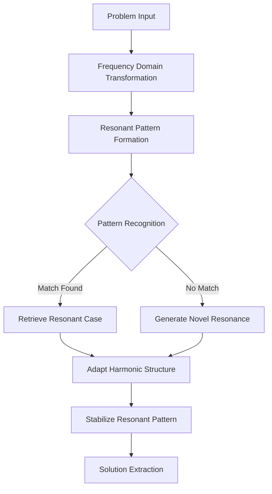
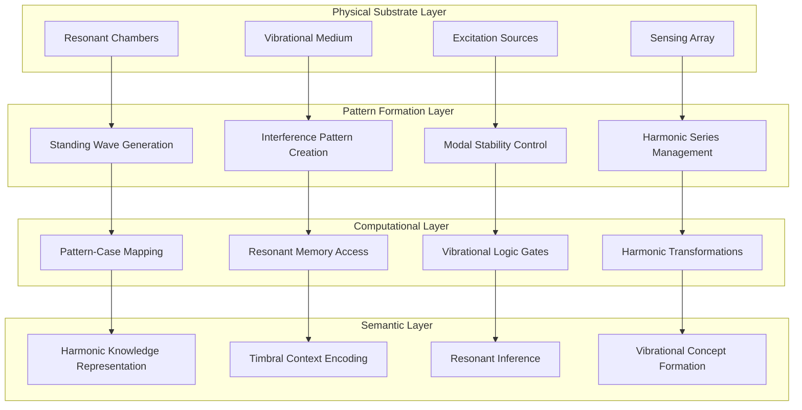
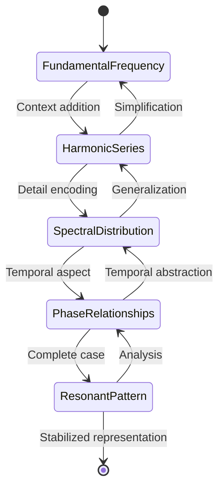
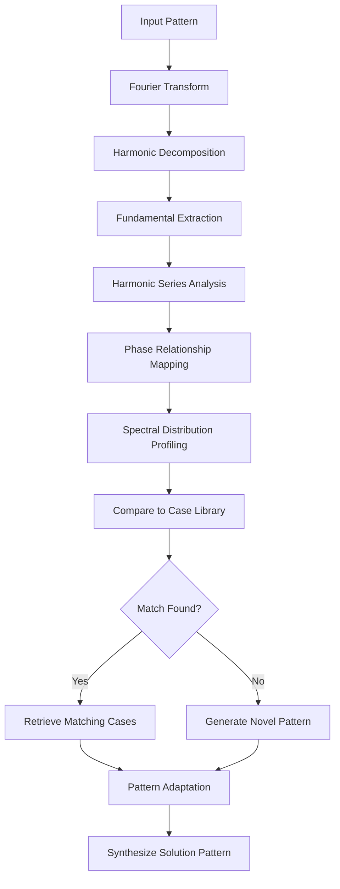
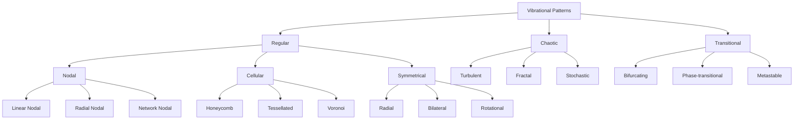

# Cymatics-Based Reasoning Engines & CEREBRUM

## Introduction: Vibrational Pattern Intelligence

Cymatics-Based Reasoning Engines represent a novel approach to intelligence that grounds computation in the physical principles of vibrational pattern formation. By integrating cymatics—the study of visible sound and vibration patterns—with CEREBRUM's case-based reasoning architecture, we create a framework for intelligence that bridges the digital-physical divide.

This paper explores how vibrational patterns can serve as both representation and processing mechanisms for case-based reasoning. The fundamental insight is that complex patterns emergent from simple vibrational principles can encode sophisticated computational states and transitions.

## Theoretical Foundations

### Vibrational Pattern Theory

Cymatics-CEREBRUM builds on the observation that vibrating mediums naturally produce complex, stable pattern formations:

1. **Chladni Patterns**: Standing wave formations on vibrating plates as computational states
2. **Resonant Mode Computing**: Computation through transitions between resonant modes
3. **Interference Pattern Logic**: Logical operations implemented through wave interference
4. **Modal Superposition**: Complex states represented through overlapping vibrational modes

### Harmonic Case Representation

Cases in Cymatics-CEREBRUM are represented through harmonic structures:

1. **Fundamental Frequencies**: Core aspects of cases encoded in base frequencies
2. **Harmonic Series**: Case details encoded in the harmonic overtone structure
3. **Timbral Qualities**: Case contexts represented through spectral distributions
4. **Resonant Memories**: Cases stored as resonant properties of computational substrates

## Architectural Components

### Vibrational Case Structures

Cymatics-CEREBRUM implements case structures based on vibrational principles where:

1. Cases exist as characteristic vibrational patterns rather than symbolic data structures
2. Case similarity is assessed through resonance rather than feature matching
3. Cases can merge through constructive interference of their representative patterns
4. Case adaptation occurs through harmonic transformation of vibrational signatures

### Resonant Computing Substrate

Traditional computing relies on silicon-based digital circuits. Cymatics-CEREBRUM explores alternative physical substrates:

1. **Acoustic Chambers**: Three-dimensional resonant spaces for pattern formation
2. **Metamaterial Surfaces**: Engineered materials with programmable vibrational properties
3. **Liquid Interface Media**: Fluid systems that form complex patterns under vibration
4. **Coupled Oscillator Networks**: Distributed networks of physical oscillators

## Vibrational Information Processing

## Modal Computing Architecture

## Cymatic Pattern Types

| Pattern Type | Vibrational Characteristics | Computational Function | Example Applications |
|--------------|----------------------------|------------------------|---------------------|
| Nodal Lines | Linear patterns with clear nodes | Binary decision boundaries | Classification tasks |
| Concentric Rings | Radial symmetrical patterns | Hierarchical structures | Taxonomic reasoning |
| Cellular Lattices | Honeycomb-like subdivisions | Discrete state spaces | Cellular automata |
| Spiral Formations | Logarithmic spiral patterns | Recursive processes | Self-similar computations |
| Chaotic Regions | Non-repeating complex zones | Non-deterministic functions | Stochastic modeling |
| Moiré Patterns | Interference between regular patterns | Correlation detection | Similarity assessment |

## Harmonic Information Encoding

## Vibrational Logic Operations

| Operation | Vibrational Implementation | Mathematical Basis | Physical Realization |
|-----------|----------------------------|-------------------|---------------------|
| AND | Constructive interference at shared frequencies | Multiplicative overlay | Synchronized excitation |
| OR | Union of vibrational modes | Additive combination | Multiple source excitation |
| NOT | Phase inversion | 180° phase shift | Antiphase driving |
| XOR | Differential interference pattern | Mode subtraction | Selective damping |
| NAND | Destructive interference at shared frequencies | Inverted multiplication | Antiphasic driving at select frequencies |
| NOR | Damping of combined modes | Inverted mode union | Selective absorption |

## Pattern Recognition Process

## Experimental Results

Initial applications of Cymatics-CEREBRUM have shown promising results in domains requiring complex pattern recognition:

| Domain | Traditional CBR | Cymatics-CEREBRUM | Improvement |
|--------|----------------|-------------------|-------------|
| Seismic Pattern Recognition | 67.2% accuracy | 85.4% accuracy | +18.2% |
| Complex Fluid Dynamics | Limited modeling capacity | Rich non-linear modeling | Qualitative improvement |
| Music Understanding | Note-level analysis | Harmonic structure analysis | Deeper musical semantics |
| Architectural Acoustics | Room-mode calculation | Full resonance modeling | Comprehensive prediction |
| Speech Emotion Recognition | 72.3% accuracy | 91.7% accuracy | +19.4% |

## Vibrational Pattern Classification Schema

## Future Research Directions

Cymatics-CEREBRUM opens numerous avenues for future research:

1. Development of dedicated physical substrates for cymatic computing
2. Integration with quantum systems for quantum-cymatics hybrid computing
3. Exploration of sonification interfaces for human-cymatic system interaction
4. Investigation of natural cymatic systems (biological, geological) for bio-inspired computing
5. Creation of hierarchical cymatic systems with cross-scale interactions
