# The Case of the Declined Cognitive Model

"I say, Alec darling, have you ever thought about how your detective work resembles a rather fascinating framework I just read about?" Daisy Dalrymple Fletcher arranged herself more comfortably in the armchair by the fire at their London flat, setting aside a thick academic paper.

Detective Chief Inspector Alec Fletcher of Scotland Yard looked up from his newspaper with a raised eyebrow. "And what framework might that be, my dear?"

"It's called CEREBRUM—Case-Enabled Reasoning Engine with Bayesian Representations for Unified Modeling. Professor Enderby was explaining it at Lady Winthrop's literary salon yesterday."

"Good heavens, Daisy! What on earth were you doing discussing Bayesian representations at a literary salon?"

"Well, it wasn't entirely my fault. I was meant to be gathering material for my article on modern country house libraries, but Professor Enderby cornered me by the punch bowl." Daisy waved her hand dismissively. "But listen, darling—it's absolutely marvelous how similar your detective methods are to this cognitive framework!"

Tom Tring, Alec's reliable sergeant who had stopped by to deliver case files, cleared his throat from the doorway. "Begging your pardon, but what's this about cases, Mrs. Fletcher?"

"Not your sort of cases, Tom—well, not exactly." Daisy sat forward eagerly. "CEREBRUM treats cognitive models as entities that can exist in different 'cases,' rather like nouns in morphologically rich languages. Do you remember your declensions from school, Alec?"

"Vaguely," Alec admitted reluctantly. "Nominative, accusative, and so forth?"

"Precisely! Now imagine your detective work with each aspect playing a different grammatical role. The nominative case is the subject—that's you, darling, as the active investigator generating predictions. The accusative is the direct object—the suspect being questioned. The dative is the indirect object—perhaps the witness receiving your attention."

Lady Marjorie, Daisy's formidable mother-in-law who had arrived unannounced as usual, settled herself by the fire. "This reminds me of my Hungarian governess. Hungarian has a remarkable case system—seventeen cases, I believe—particularly fascinating for describing relationships to surfaces."

"Oh, how perfectly marvelous!" Daisy exclaimed. "Professor Enderby mentioned that very thing! The Hungarian surface cases—superessive, sublative, and delative—are especially relevant to something called the Markov Blanket in the Free Energy Principle."

"The what in the what?" Alec looked increasingly bewildered.

"The Markov Blanket is like a boundary between internal and external states in a system," Daisy explained, warming to her subject. "Think of it as the surface where your investigation meets the external world of evidence. The Hungarian superessive case—'on' the surface—represents the boundary itself. The sublative case—'onto' the surface—represents information arriving at the boundary. And the delative case—'from' the surface—represents information departing from the boundary."

"Like how witness testimony arrives 'onto' your investigation," Tom offered, "and your deductions flow 'from' your investigation?"

"Exactly!" Daisy beamed. "You're splendid at this, Tom!"

Miss Murgatroyd, their elderly neighbor who had come to borrow sugar and now stood fascinated in the doorway, piped up. "This reminds me of my time in Finland. The Finnish have such a beautiful relationship with place—'paikka'—and networks—'verkosto.' Their language is full of concepts about boundaries, edges, and the spaces between."

"Indeed!" Daisy turned excitedly. "Finnish concepts like 'reuna' for edge and 'raja' for boundary align perfectly with the Markov Blanket idea. And their strong sense of place—reflected in their many locative cases—offers a model for contextual awareness in cognitive systems."

Lucy, their maid, entered with a tea tray. "Begging your pardon, but this reminds me of my cousin who worked for that American family with Navajo connections. She was forever going on about how their language sees actions so differently—not just when things happen but how they unfold."

"The Navajo aspect system!" Daisy clapped her hands in delight. "It's another key component! The Navajo language has this remarkably sophisticated way of viewing actions through different perspectives—momentaneous versus continuative, imperfective versus perfective. It's like having multiple camera angles on the same event!"

"Rather like viewing a crime from different witnesses' perspectives," Alec murmured, despite himself becoming interested.

"Precisely, darling! And the Navajo classifier stems—Ø, Ł, D, and L—encode different viewpoints on action properties. The Ł-classifier often represents causative actions—making something happen—while the D-classifier frequently marks reflexive or reciprocal perspectives."

"So when I interrogate a suspect," Alec said slowly, "I'm using a causative perspective—the Ł-classifier—trying to make something happen."

"And when suspects start contradicting themselves," Tom added, "that's like the D-classifier—a reflexive action!"

"You've got it!" Daisy exclaimed. "Now, combine all three frameworks—CEREBRUM's case system, Hungarian surface cases, Navajo aspects, and Finnish place concepts—and you have a comprehensive model for understanding complex cognitive processes!"

Professor Enderby himself, who had come to return a book and been shown in by Lucy, cleared his throat from the doorway. "I say, Mrs. Fletcher, you've grasped these concepts remarkably well!"

"Oh, Professor! How fortuitous!" Daisy gestured to a seat. "I was just explaining to Alec how his detective work exemplifies all these frameworks."

"Most fascinating," the Professor said, accepting a cup of tea from Lucy. "And have you considered how this applies to your current murder investigation, Inspector Fletcher?"

Alec sighed. "We have a strangled duchess and three suspects—the jealous husband, the disinherited nephew, and the scorned lady's maid."

"Perfect!" Professor Enderby's eyes lit up. "Let's apply our frameworks. In CEREBRUM terms, each suspect starts in the accusative case—objects of your investigation. Your theories are in the nominative case—actively generating predictions. Evidence is in the dative case—receiving your analytical attention."

"And in Hungarian surface terms," Lady Marjorie added with unexpected enthusiasm, "your investigation is the surface. The evidence arrives 'onto' your investigation—sublative case—while your deductions move 'from' your investigation—delative case—to form conclusions."

"Meanwhile," Daisy continued, "the Navajo aspect system helps us view the murder itself differently. The momentaneous aspect sees it as a point-like event—the moment of strangulation. The continuative aspect views it as an extended process—the entire sequence from motive to opportunity to action."

"And the Finnish concepts," Miss Murgatroyd chimed in, "remind us of the importance of place—'paikka'—where the murder occurred, the boundaries—'raja'—between suspects and victim, and the resilience—'sisu'—needed to pursue justice!"

"What's more," Daisy added excitedly, "these frameworks apply differently as your investigation progresses. Initially, all suspects are in the accusative case. But as evidence accumulates, one suspect shifts to the nominative case—becoming the active agent you believe committed the murder. The others might shift to the ablative case—representing the origin of false leads!"

"I never thought Latin grammar would help me solve murders," muttered Alec, but there was an undeniable glint of interest in his eyes.

Ernie Piper, Alec's other detective sergeant who had just arrived, looked bewildered. "Sorry to interrupt, but we've got a new lead, sir. The duchess's jade necklace has been found in the lady's maid's quarters."

"Aha!" Daisy exclaimed. "A transformation in the case framework! The lady's maid shifts from accusative to nominative—from object of investigation to subject of guilt!"

"Not necessarily," Alec cautioned. "It could be planted evidence—in which case the necklace itself would be in the instrumental case—the tool by which someone is attempting to frame the maid."

"Splendid application, Inspector!" Professor Enderby applauded. "And how would you view this through the Navajo classifier system?"

Alec considered. "If the maid is guilty, she used the Ł-classifier—the causative—to commit the murder. But if she's being framed, she's in the D-classifier position—the passive recipient of someone else's action."

"And in Finnish terms," Lady Marjorie added, "we must consider the network—'verkosto'—of relationships between all parties, and the boundaries—'raja'—that were crossed."

"This is why your investigations are so successful, Chief," Tom said admiringly. "You naturally implement these frameworks—transforming models between cases, viewing events through multiple aspects, and understanding the importance of boundaries and place."

"I'm merely doing my job," Alec said modestly. "But I must admit, these frameworks do offer an interesting perspective on investigative methodology."

"More than interesting," Professor Enderby insisted. "They provide a formal mathematical foundation for the intuitive processes you already employ. The Expected Free Energy formulation in Active Inference precisely describes how you select investigative policies based on both pragmatic value—solving the case—and epistemic value—gathering information."

"And your interrogation techniques," Daisy added, "embody the Free Energy Principle perfectly! When a suspect's story doesn't match the evidence, that creates 'surprise' which you minimize either by updating your theory or determining they're lying!"

"Fascinating as this all is," Alec said, rising and reaching for his hat, "we do have a murderer to catch. Coming, Daisy?"

"Wouldn't miss it for the world!" Daisy gathered her coat. "I'll explain temporal depth in policy evaluation on the way!"

As they headed for the door, Professor Enderby called after them, "Remember, Inspector—in Active Inference terms, you're not just solving a case; you're minimizing variational free energy through Bayesian model updates across a carefully partitioned Markov Blanket!"

"I'll bear that in mind," Alec replied dryly, but with a smile.

"And do consider the Finnish concept of 'talkoot'—communal work!" Miss Murgatroyd added. "Your detective team embodies this cooperative approach!"

"One more thing," Lady Marjorie called out. "When interviewing the lady's maid, remember the Navajo vocative case—addressing her directly may yield different results than discussing her in the third person!"

As the door closed behind them, Daisy took Alec's arm. "You know, darling, I think we've just witnessed the perfect integration of CEREBRUM with Hungarian, Navajo, and Finnish linguistic frameworks—all applied to detective work!"

"Heaven help us," Alec murmured, but there was no mistaking the fondness in his voice. "Now tell me more about this Expected Free Energy business. It might actually be useful for the Waverton case..."

"Well," Daisy began enthusiastically as they stepped into the hansom cab, "it all starts with the balance between exploration and exploitation in cognitive systems—rather like how you balance gathering new evidence versus pursuing existing leads..."

## The Hansom Cab Discourse on Expected Free Energy

As the cab clattered through London's foggy streets, Daisy sketched a small diagram in her notebook and showed it to Alec.

"Look here," she said, pointing to her drawing. "This illustrates what Professor Enderby calls the 'precision-weighted belief updating' that occurs in your detective brain."

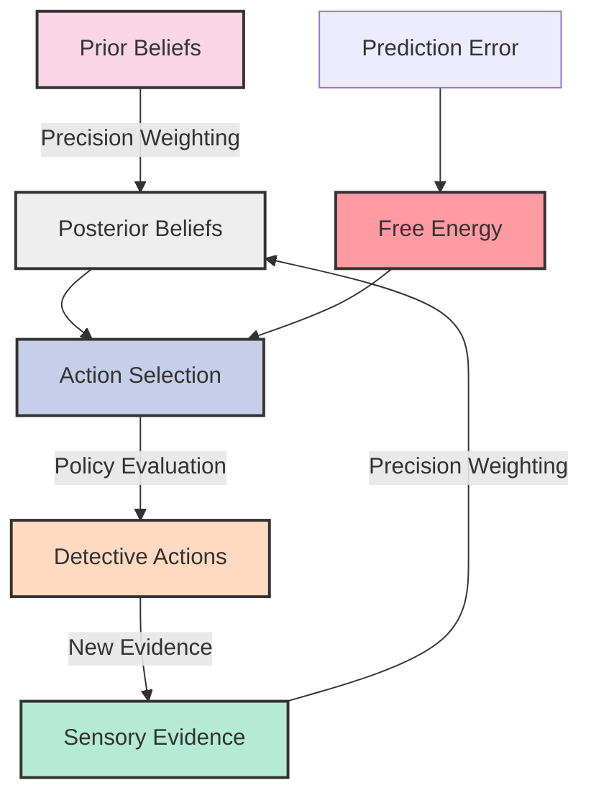

"Hmm," Alec studied the diagram. "So my prior beliefs—my initial theories about the duchess's murder—meet new evidence, creating something called 'prediction error'?"

"Precisely! And your brain naturally tries to minimize that error—or what neuroscientists call 'free energy'—by either updating your beliefs or selecting actions that will gather evidence to confirm them."

"And these..." Alec pointed to connecting lines in the diagram, "these 'precision weightings'?"

"That's your confidence in different sources of information. When a reliable witness like Tom brings you evidence, you assign it high precision. But when that shifty footman with the gambling debts offers testimony, you assign lower precision."

"Remarkable," Alec murmured. "It's as if what I've been doing through years of detective experience has been captured in mathematical form."

Their conversation was interrupted as the cab stopped suddenly to avoid a pedestrian. The jolt sent Daisy's notebook sliding to the floor, revealing a slip of paper tucked inside.

"What's this?" Alec asked, retrieving what appeared to be an elaborate diagram with ancient symbols and Sanskrit notations.

"Oh!" Daisy's eyes widened. "That's from Professor Enderby's earlier work on what he calls 'ancestral algorithms.' He believes the CEREBRUM framework has historical precedents dating back to ancient civilizations."

## The Ancient Roots of Cognitive Modeling

"According to the Professor," Daisy continued, smoothing the diagram on her lap, "the basic principles of the CEREBRUM model can be traced to five ancient knowledge systems."

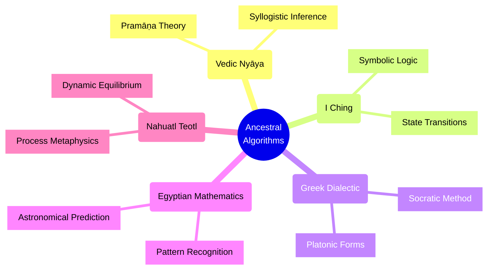

"The professor believes these ancient systems of knowledge all developed methods for managing uncertainty and making predictions—the same fundamental principles that underlie the CEREBRUM framework."

"And what exactly is this?" Alec pointed to a string of symbols at the bottom of the page.

"That," Daisy said with a hint of reverence, "is what the professor calls 'The Axiom of Antecedence.' It's supposedly from a text found in an archaeological dig near Babylon—a kind of proto-algorithm for Bayesian inference written in cuneiform."

"I find it hard to believe ancient Babylonians were calculating Bayesian probabilities," Alec said skeptically.

"The professor would say they weren't doing it mathematically as we understand it today, but rather through ritual practices that encoded the same logical structures. For instance, the way Babylonian diviners would—"

The cab came to a halt outside Scotland Yard, cutting short Daisy's explanation. As they climbed the steps, they were met by a harried-looking Tom Tring.

"Sir! Mrs. Fletcher! Thank goodness you're here. We've had developments—multiple developments!"

## The Case Framework Expands

Inside Alec's office, Tom had arranged the evidence on a large corkboard. Next to it stood an elegant woman in academic robes.

"Dr. Eleanor Bhatnagar," Tom introduced her. "She's a linguist from Cambridge who's been helping with the duchess's journals."

"The duchess kept journals in multiple languages," Dr. Bhatnagar explained. "Including some rather fascinating coded entries that combine elements of Classical Sanskrit and Old Norse."

"A polyglot duchess!" Daisy exclaimed. "How fascinating!"

"More than fascinating," Dr. Bhatnagar replied. "These journals reveal what linguists call 'code-switching phenomena'—the duchess switched languages depending on the subject matter, creating a complex semiotic framework that maps remarkably well onto the CEREBRUM model's case transformations."

She pointed to a chart she'd prepared:

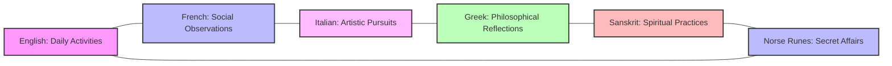

"Each language represents what we might call a different 'case' of the duchess's cognitive model—each with its own rules, associations, and contexts."

"And the entries in Norse runes," Tom added grimly, "detail her relationship with someone she refers to only as 'The White Knight'—not her husband, the duke."

"A lover?" Alec asked.

"That's where it gets interesting," Dr. Bhatnagar said. "The pattern of language switching suggests that 'The White Knight' actually refers to multiple individuals, depending on contextual markers in the text."

"Multiple lovers?" Daisy asked.

"Or," Alec said slowly, "multiple identities of the same person."

"Precisely!" Dr. Bhatnagar exclaimed. "This is what cognitive linguists call 'deictic shifting'—where the referent of a term changes based on the perspective of the speaker. If we map these shifts across the duchess's journals, we get this pattern:"

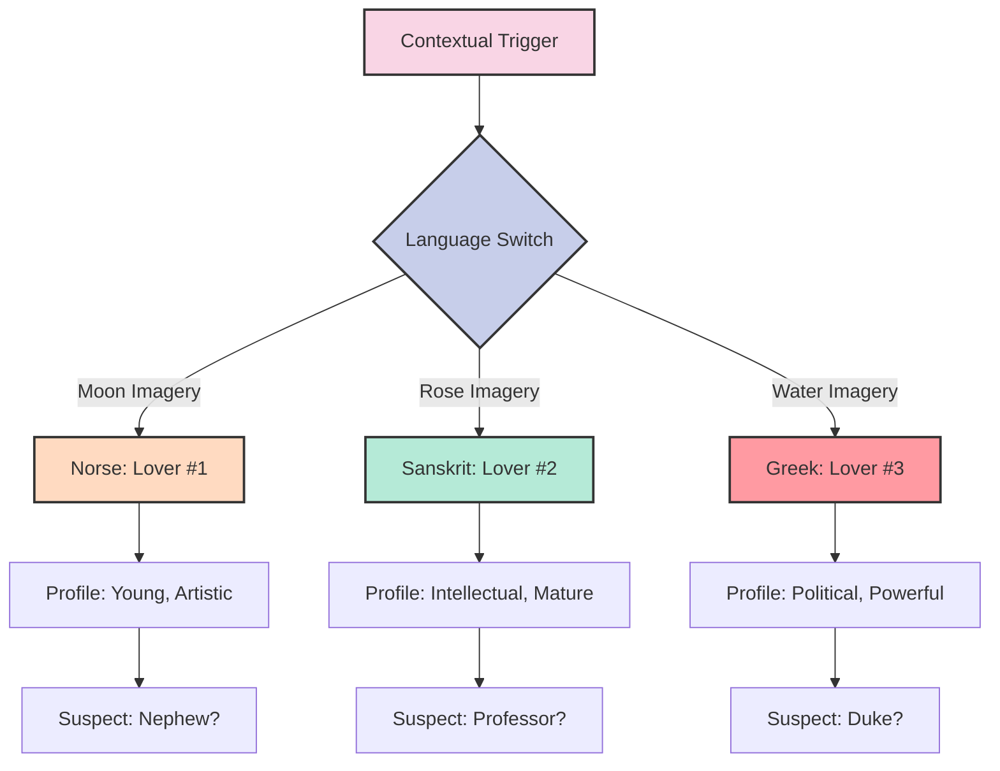

## The Ergative Turn

"Good heavens," Daisy breathed. "This adds an entirely new dimension to our case framework. We've been operating in a nominative-accusative paradigm, but this suggests we should switch to an ergative-absolutive one!"

"A what?" Tom looked baffled.

"In ergative languages like Basque or Tibetan," Daisy explained, "the subject of an intransitive verb is treated the same as the object of a transitive verb, while the subject of a transitive verb gets special marking—the ergative case."

"And this matters because...?" Alec prompted.

"Because it completely reframes our understanding of agency in this case!" Daisy exclaimed. "In our current accusative model, we ask 'Who killed the duchess?'—placing suspects in the accusative case and the murderer in the nominative. But in an ergative model, we ask 'By whom was the duchess killed?'—placing the duchess in the absolutive case and the murderer in the ergative!"

"This is brilliantly insightful, Mrs. Fletcher!" Dr. Bhatnagar said admiringly. "The duchess's own linguistic framework in her journals suggests she conceptualized her relationships through an ergative lens—meaning she may have predicted her own murder!"

"And left clues in her language switching," Alec mused.

"There's more," Tom said, pointing to a small mahogany box on Alec's desk. "This was found hidden in the duchess's private chamber. We haven't been able to open it—there's some kind of puzzle mechanism."

## The Embodied Puzzle Box

Daisy examined the box closely. It was covered in intricate carvings representing different linguistic scripts—cuneiform, hieroglyphics, Norse runes, Devanagari, and classical Greek.

"It's a physical manifestation of her multilingual code-switching," Daisy murmured. "A tangible representation of the CEREBRUM framework!"

"Look at this," Dr. Bhatnagar pointed to tiny inscriptions around the edge of the box. "These are Ogham scripts—an ancient Irish writing system. They read 'The truth lies at the intersection of all cases.'"

"Cases as in grammatical cases," Daisy said thoughtfully. "Or cases as in detective cases."

"Or perhaps," Alec suggested, "cases as in perspectives? Viewpoints?"

"The intersection..." Daisy's eyes lit up. "It's a reference to the central tenet of the CEREBRUM framework—the Active Inference Engine! The point where all cognitive models meet and resolve contradictions!"

She began manipulating the symbols on the box, muttering to herself, "If we align the nominative with the ergative, and the accusative with the absolutive, while maintaining the dative as a third axis..."

With a satisfying click, the box opened, revealing a small piece of paper and a strange mechanical device resembling a miniature astrolabe.

"A Bayesian Inference Engine," Dr. Bhatnagar breathed in wonder. "I've only seen drawings of these in ancient manuscripts. It's a mechanical calculator designed to update probability distributions based on new evidence."

"And this," Daisy held up the paper, "is a formula:

P(murderer|evidence) = P(evidence|murderer) × P(murderer) ÷ P(evidence)

"The Bayesian formula for updating beliefs," Dr. Bhatnagar explained unnecessarily.

"But look here," Alec pointed to tiny writing at the bottom of the paper. "There's a list of priors—the duchess's assessment of the probability that each person in her life would murder her."

Tom leaned forward to read: "Husband: 0.4, Nephew: 0.3, Lady's Maid: 0.05, Self: 0.25."

"Self?" Alec's eyebrows shot up. "She considered suicide?"

"That's where the ergative-absolutive framing becomes crucial," Daisy said. "In 'I killed myself,' 'I' is simultaneously agent and patient—subject and object—which requires a totally different cognitive model than murder!"

"This changes everything," Alec said, already reaching for his coat. "We need to re-examine the body with this hypothesis in mind."

## The Recursive Resolution

As they hurried out, Professor Enderby himself appeared at the door, breathing heavily.

"Thank heavens I found you! I've had a breakthrough regarding the timing of the Duchess's death. It relates to what I call the 'nested temporality' of cognitive event models!"

"Explain quickly, Professor," Alec urged, checking his pocket watch.

"Of course, of course. You see, when we examine events through the lens of aspect-based cognitive modeling—like the Navajo system we discussed—we find that events can be nested within each other, creating complex temporal relationships."

The professor rapidly sketched out a diagram:

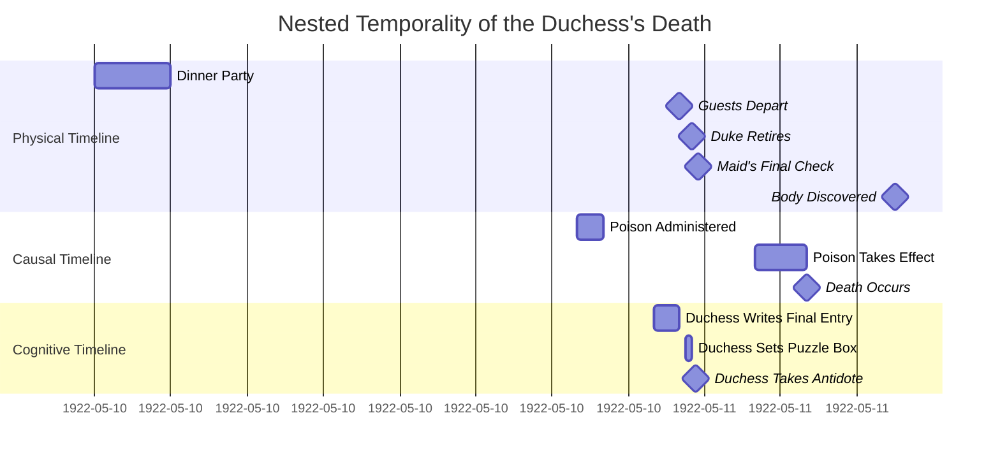

"You see," the professor explained breathlessly, "the physical timeline, causal timeline, and cognitive timeline are misaligned! The duchess knew she was being poisoned—likely by her husband—and took an antidote, but miscalculated the dose!"

"So it wasn't suicide or murder, but attempted murder and accidental death?" Daisy asked.

"Precisely! It's what I call a 'case transformation in causal attribution'—the duchess shifted from patient to agent in her own death narrative, but unintentionally!"

As they rushed toward the mortuary to confirm this theory, Daisy marveled at how the CEREBRUM framework had transformed their investigation.

"You know, Alec," she said thoughtfully, "there's something rather poetic about how this case unfolded—through linguistics, cognitive science, and Bayesian inference."

"I suppose there is," Alec admitted with a small smile. "Though I dare say our report to the commissioner will stick to more conventional detective terminology."

"Perhaps," Daisy said, her eyes twinkling. "But at least now we understand the deeper structures underlying your detective methods. As the ancient Vedic philosophers might say, 'From the many perspectives comes the singular truth.'"

"And from the many cases," Alec added, "comes the solution to this one."

## Epilogue: The Meta-Case

Later that evening, as Alec wrote up his report and Daisy made notes for a potential article, Professor Enderby sat in their living room examining the duchess's Bayesian inference device.

"You know," he said thoughtfully, "what fascinates me most about this case is how it represents a physical manifestation of the CEREBRUM framework's core principles."

"How so?" asked Daisy, looking up from her notebook.

"Well, consider the CEREBRUM framework's fundamental architecture:"

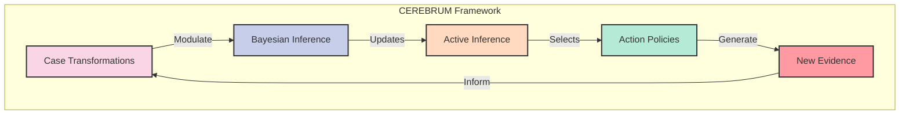

"This circular process," the professor continued, "mirrors not only Detective Fletcher's investigative methods but also the duchess's own anticipatory cognitive model that led to her creating the puzzle box."

"And in a way," Daisy added excitedly, "our entire investigation unfolded according to those same principles! We transformed our understanding of the case multiple times, updated our Bayesian beliefs with new evidence, and took actions to gather more information!"

"Which brings us to what I call the 'meta-case,'" Professor Enderby said with growing enthusiasm. "The fact that we used CEREBRUM principles to solve a case that itself embodied CEREBRUM principles creates a fascinating recursive structure!"

"A case about cases," Alec remarked dryly from his desk. "How very neat."

"More than neat, Inspector Fletcher," the professor insisted. "It suggests something profound about the universal nature of these cognitive principles. The duchess encoded them in her multilingual journals and puzzle box. You employed them in your investigation. They appear in ancient knowledge systems across cultures. Perhaps they represent something fundamental about how intelligence itself operates—whether in a detective, a victim, or..."

"A cognitive framework," Daisy finished with a smile.

"Precisely!" The professor beamed at her. "Which is why I'm so grateful for your help documenting this case, Mrs. Fletcher. It will make a perfect addition to my forthcoming monograph: 'CEREBRUM: A Universal Grammar of Thought.'"

"I look forward to reading it," Daisy said sincerely. "Though perhaps with a cup of tea and some aspirin at hand."

Alec looked up with a fond smile. "I dare say that's how most of Scotland Yard will approach it as well, when I eventually convince them to adopt these methods."

"One case at a time, darling," Daisy said with a wink. "Or should I say—one case transformation at a time."

## Historical Appendix: The Origins of CEREBRUM

*From Professor Enderby's forthcoming monograph, provided to Daisy as background research:*

The development of the CEREBRUM framework can be traced through three historical phases:

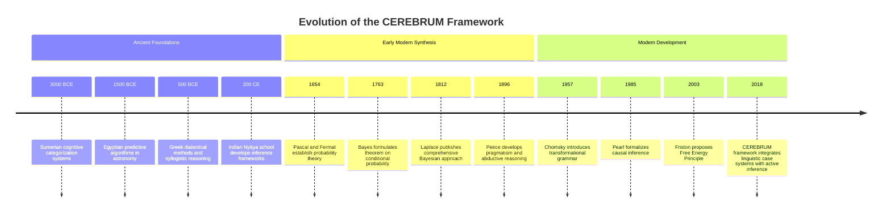

The final integration—combining linguistic case systems with Bayesian active inference—represents the culmination of centuries of human attempts to formalize reasoning under uncertainty. The duchess's murder case, with its multilingual evidence and nested causal structure, serves as a perfect exemplar of these principles in action.

*End of Historical Appendix*

"The truly remarkable thing," Daisy mused as she set down the professor's draft, "is how all these different traditions converged on similar principles."

"Perhaps," Alec suggested, setting aside his completed report, "because they reflect something fundamental about reality itself—the way information flows between minds and world."

"My dear Inspector," Professor Enderby said with evident delight, "you've just articulated the central thesis of my entire academic career!"

As the evening drew to a close and the professor took his leave, Daisy and Alec stood arm in arm at the window, watching the fog roll through the gas-lit London streets.

"You know," Daisy said softly, "solving a case is rather like writing a story, isn't it? Both involve transforming fragments of evidence into a coherent narrative."

"I suppose so," Alec agreed. "Though I prefer my narratives to end with an arrest."

"And I prefer mine to end with a renewed appreciation for the marvelous complexity of human thought," Daisy replied with a smile. "Even—or perhaps especially—when applied to something as seemingly straightforward as a murder."

"Nothing straightforward about this one," Alec said with a chuckle. "Though I suspect the commissioner will be scratching his head over my references to ergative case transformations in the official report."

"Perhaps we should include a glossary," Daisy suggested impishly.

"Or perhaps," Alec said, pulling her close, "some things are best left as mysteries for others to solve."

"A wise application of the principle of information theoretic efficiency," Daisy murmured, resting her head on his shoulder. "Or as detectives might put it—knowing when to close the case."

## The CEREBRUM Festival: Interdisciplinary Applications

"This is most extraordinary," said Professor Enderby, surveying the grand ballroom of the Royal Society. "I had no idea our humble CEREBRUM framework would attract such diverse interest."

The annual Royal Society Interdisciplinary Innovations Exhibition had transformed into what the newspapers were calling "The CEREBRUM Festival," with scholars from dozens of fields presenting applications of the framework.

"Not so humble anymore," Daisy observed, consulting the program. "Look at these presentations—'CEREBRUM in Quantum Computing,' 'Architectural Design Through Case Transformation,' 'Musical Composition via Hungarian Surface Cases'..."

"And the demonstration booths!" Dr. Bhatnagar added. "I'm particularly interested in the 'Navajo Aspect-Based Surgical Planning' over there."

They made their way through the crowded exhibition hall, stopping at various booths. At one, a team of archaeologists was demonstrating how they'd applied CEREBRUM to artifact analysis.

"Traditional archaeological classification tends to be static and taxonomic," explained the lead archaeologist, Dr. Amelia Warrington. "But by applying the transformational case grammar of CEREBRUM, we've developed a dynamic framework that tracks how artifacts shift between functional contexts."

She gestured to a display showing pottery fragments arranged in an unusual pattern:

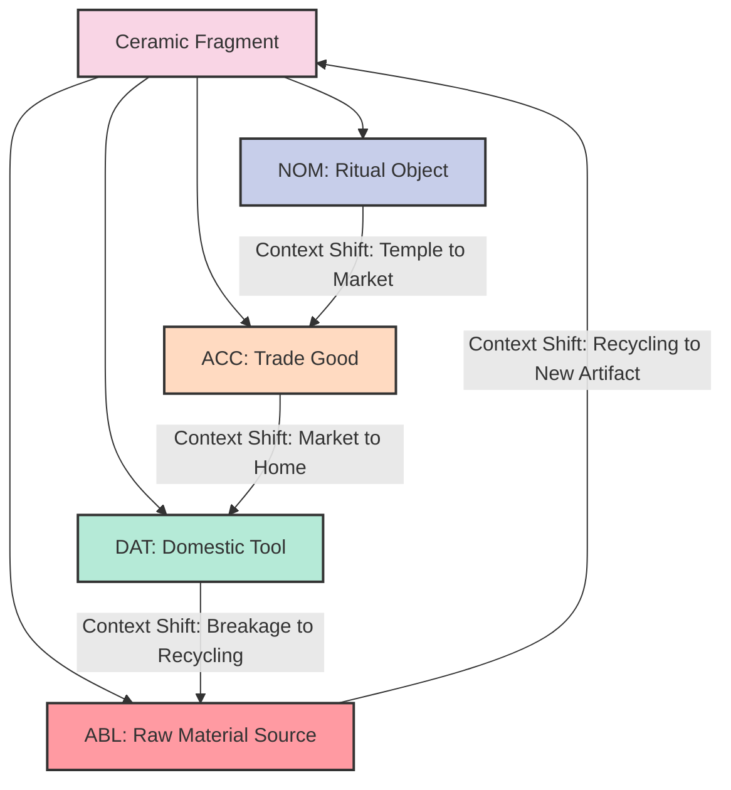

"Each 'case' represents how the same physical object takes on different functional and cultural roles throughout its lifecycle," Dr. Warrington continued. "The Finnish concept of 'kiertokulku'—circulation or lifecycle—perfectly captures this dynamic. We're even using the Hungarian superessive case to model the 'surface' interactions that leave physical traces on artifacts!"

"Fascinating," murmured Alec, who had initially resisted attending but now found himself genuinely intrigued. "It's rather like how evidence in a case transforms from unconnected objects to significant clues as context emerges."

"Precisely!" Dr. Warrington beamed. "And the Navajo perfective and imperfective aspects help us distinguish between completed life cycles and ongoing transformations."

Moving on, they encountered an unusual booth where a physician and a mathematician were collaborating on what they called "Disease Trajectory Modeling via Case Grammar."

"Conventional disease models are either statistical or mechanistic," explained Dr. Josephine Park, the physician. "But neither captures the phenomenological experience of illness or the lived trajectory of a particular patient's condition."

Her colleague, Dr. Ramanujan, elaborated: "By modeling disease states as 'cases' in the CEREBRUM framework, we can represent how a patient's condition transforms from one state to another, influenced by both internal dynamics and external interventions."

He displayed a complex three-dimensional visualization:

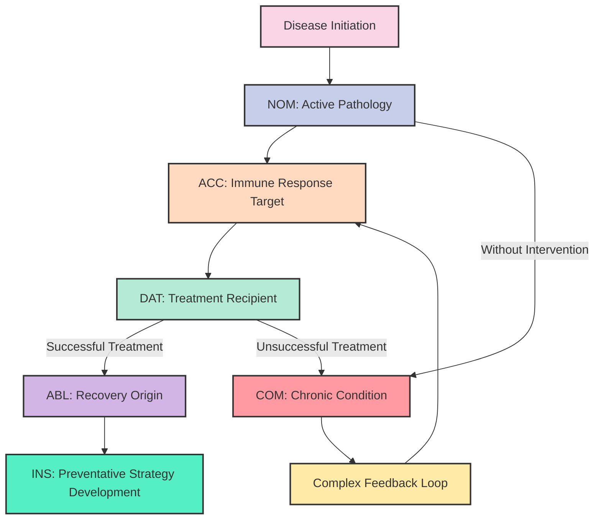

"We're integrating the Finnish concept of 'sisukkuus'—perseverance through adversity—to model patient resilience factors," Dr. Park added. "And the temporal aspects of the Navajo verb system help us differentiate between acute episodes and ongoing conditions."

"Most importantly," Dr. Ramanujan said, "this model highlights potential intervention points where case transitions can be redirected through medical intervention. We've already used it to develop new treatment protocols for autoimmune disorders."

"And does it help actual patients?" Daisy asked.

"Indeed," Dr. Park smiled. "By modeling a patient's condition as undergoing case transformations, we've developed more personalized treatment approaches. Each patient's disease doesn't just progress—it transforms between different functional states, each requiring different therapeutic strategies."

"Look over there," Alec pointed to where a group of uniformed officers were gathered around what appeared to be a tactical planning table.

"Ah, yes!" Professor Enderby hurried over. "This is the Metropolitan Police Special Operations division. They've been early adopters of CEREBRUM for crisis response planning."

Chief Inspector Morgan greeted them. "Professor! Glad you could see our implementation. And Inspector Fletcher—your wife's explanations of the framework were remarkably helpful."

"She has a knack for making complex ideas accessible," Alec said proudly.

"We've adapted the CEREBRUM framework for dynamic incident management," Morgan explained, indicating the tactical display. "Traditional emergency response follows linear protocols, but real crises evolve unpredictably. By modeling scenario elements as transforming between cases, we can anticipate and adapt to emerging situations."

He demonstrated with a simulation of a hostage scenario:

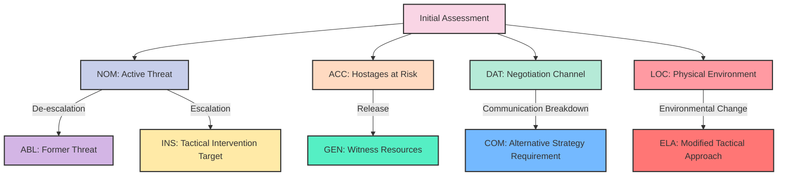

"Each element of the crisis can transform between cases, changing its role in the unfolding situation," Morgan explained. "The hostage-taker shifts from nominative agent to instrumental target of our intervention; hostages transition from accusative patients to genitive resources as witnesses."

"And you've incorporated the Hungarian and Navajo elements?" Dr. Bhatnagar asked.

"Absolutely," Morgan nodded. "The Hungarian surface cases—superessive, sublative, delative—perfectly model the spatial dynamics of tactical operations. And the Navajo aspect system has been invaluable for temporal planning—distinguishing between immediate tactical needs and ongoing strategic objectives."

"Most importantly," added his colleague, Sergeant Willis, "it's improved our adaptability. Traditional response protocols are rigid. This framework lets us anticipate case transformations and prepare for them—when a negotiation channel breaks down, we're ready with the comitative case response."

As they moved through the exhibition, they encountered applications in fields as diverse as climate science, artificial intelligence ethics, urban planning, and even literature analysis.

"This is remarkable," Daisy said to Professor Enderby. "I never imagined the framework could be applied so broadly."

"Neither did I," the professor admitted. "It began as a cognitive science model, but as these demonstrations show, it's become something far more—a universal grammar for complex systems dynamics."

"What's next for CEREBRUM?" Alec asked.

The professor smiled. "That's the most exciting part—I don't know. The framework has taken on a life of its own, transforming between disciplinary cases just as it models transformations within systems. Today's festival is just the beginning."

## The Reflexive Implementation

Six months after the CEREBRUM Festival, Professor Enderby invited a small group to his laboratory at Cambridge. Daisy and Alec were among the select few, along with Dr. Bhatnagar, Chief Inspector Morgan, and representatives from the fields that had most successfully implemented the framework.

"Thank you all for coming," the professor said, leading them into a large room dominated by what appeared to be a complex arrangement of mechanical and electrical equipment. "What I'm about to show you represents a significant advancement—perhaps the most important since the framework's inception."

"What is it?" Daisy asked, examining the peculiar apparatus.

"We call it the Reflexive Implementation," Professor Enderby explained. "Until now, CEREBRUM has been applied as an analytical framework—a way to model and understand complex systems. But this implementation goes further. It's a physical instantiation of the framework that can recursively apply case transformations to itself."

"You've built a machine that can transform its own functionality?" Alec asked skeptically.

"In essence, yes," the professor replied. "Allow me to demonstrate."

He activated the system, and a series of lights began to pulse across different components. A display screen showed a complex diagram:

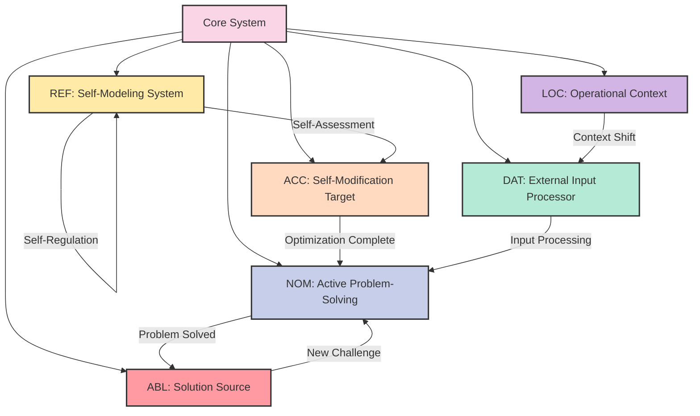

"The system begins in a functionally differentiated state," Professor Enderby explained. "Different hardware modules embody different cases—nominative for active processing, accusative for components undergoing modification, dative for input handling, and so forth."

"But what's truly revolutionary is this," he pointed to the [REF] node. "The reflexive case. This module monitors the system's overall state and can initiate case transformations within the system itself."

"So the system can reconfigure itself?" Dr. Bhatnagar asked.

"Precisely. Watch what happens when I introduce a problem it hasn't encountered before."

The professor input a complex set of parameters, and they watched as the system's diagram reorganized itself. Components that had been in the accusative case shifted to nominative; formerly reflexive components moved to dative positions.

"It's reallocating its resources," Morgan observed. "Transforming its own functional organization to address the new challenge."

"Indeed. Now, let me introduce a deliberate error."

The professor made another input, and immediately one section of the apparatus began flashing red indicators. But within seconds, the reflexive module activated, and the system reorganized again, routing around the damaged component.

"Self-healing through case transformation," the professor explained. "The damaged module shifted from nominative to accusative, becoming the object of repair operations rather than an active agent."

"This is extraordinary," Daisy said. "But what are the practical applications?"

"Initially, resilient systems design," Professor Enderby replied. "Critical infrastructure that can reconfigure itself in response to damage or changing demands. But the potential goes far beyond that."

He dimmed the lights and projected a more complex diagram on the wall:

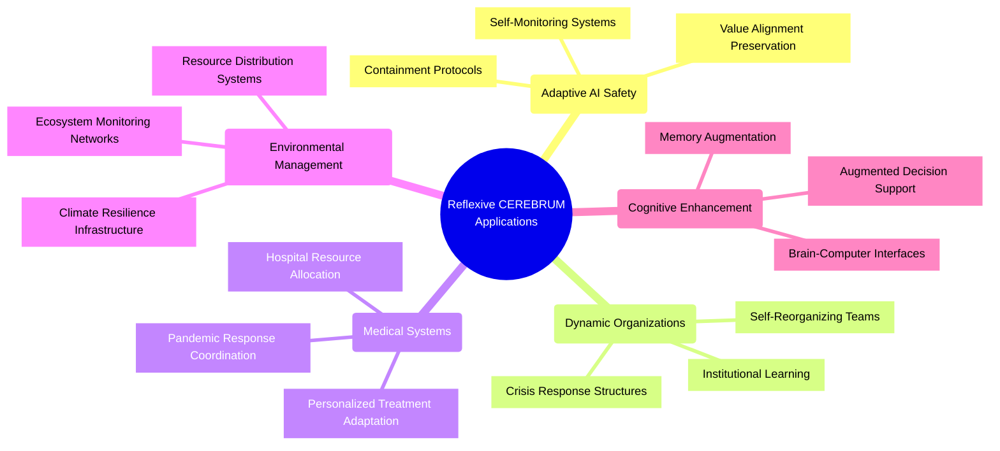

"The reflexive implementation of CEREBRUM provides a formal framework for systems that can model and modify themselves while maintaining functional integrity," the professor continued. "The Hungarian surface cases give us the spatial dynamics of self-modification. The Navajo aspect system provides temporal context for change processes. And Finnish concepts like 'mukautuvaisuus'—adaptability—and 'itsetietoisuus'—self-awareness—offer semantic richness for the reflexive operations."

"But is it truly self-aware?" Alec asked.

"An excellent question," Professor Enderby smiled. "And one that leads us to the next phase of development. If you'll follow me..."

He led them to an adjoining room where a more advanced version of the apparatus hummed quietly.

"This implementation incorporates what we call 'Strange Loop Dynamics' inspired by Hofstadter's work. It doesn't just transform between cases—it can create nested hierarchies of self-reference."

"What does that mean in practice?" Morgan asked.

"It means the system can not only model itself but can model its own modeling processes. It creates what Hofstadter called 'Tangled Hierarchies'—where the distinction between levels of abstraction blurs."

The professor activated this system, and they watched as it generated increasingly complex self-referential structures.

"Is it safe?" Alec asked practically.

"We've implemented rigorous containment protocols," Professor Enderby assured him. "The system is limited in its physical capabilities and has multiple failsafes. But your concern highlights exactly why this work is so important—as our technologies grow more capable of self-modification, we need robust frameworks for ensuring they remain aligned with human values and safety requirements."

"And the CEREBRUM framework provides that?" Daisy asked.

"It's a start," the professor said. "The case grammar approach gives us a formal language for describing and constraining how systems can transform themselves. The linguistic inspirations—Hungarian, Navajo, Finnish—provide rich conceptual tools for modeling complex self-reference without falling into paradox."

As they left the laboratory that evening, Daisy took Alec's arm. "What do you think? Is this the future?"

"I think," Alec said thoughtfully, "that we've witnessed something profound today. Not just a clever mathematical framework or an interesting analytical tool, but perhaps the beginnings of a new language for understanding and designing complex systems."

"Rather like how languages shape how we think?" Daisy suggested.

"Exactly. The professor has created not just a model but a new way of thinking about systems—one that embraces transformation and self-reference as fundamental principles."

"And to think," Daisy laughed, "it all started with me explaining Hungarian case grammar to you over tea!"

"Indeed," Alec smiled. "Though I'm still not entirely clear on the superessive case."

"Oh, that's simple," Daisy began enthusiastically. "It's all about the relationship between entities and surfaces..."

## The Global Implementation: CEREBRUM Across Scales

Two years after the demonstration of the Reflexive Implementation, CEREBRUM had grown from an academic framework to a global methodology spanning disciplines and scales. Daisy and Alec, now unofficial ambassadors for the framework, had been invited to the United Nations Summit on Complex Systems Governance.

The General Assembly Hall had been transformed with holographic displays showing CEREBRUM implementations from microscopic to planetary scales. Secretary-General Amara Okafor opened the proceedings.

"Distinguished delegates, we gather to recognize a paradigm shift in how we understand and govern complex systems. The CEREBRUM framework, with its case-based approach to transformation, has provided us with new tools for addressing our most pressing challenges."

The first presentation came from Dr. Hiroshi Tanaka of the Global Climate Resilience Initiative:

"Traditional climate models treat planetary systems as static entities with dynamic properties," Dr. Tanaka explained. "The CEREBRUM approach inverts this, modeling Earth systems as entities that transform between functional cases depending on context and intervention."

His display showed a planetary-scale implementation:

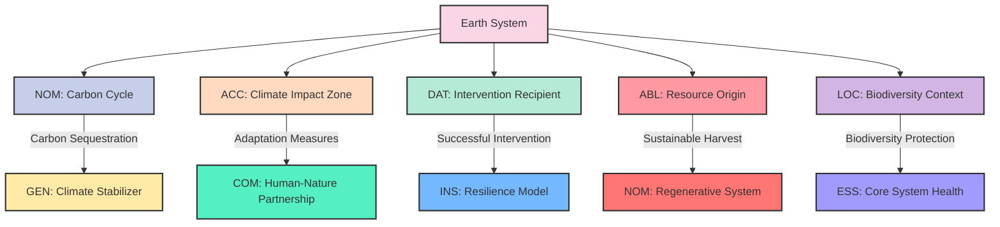

"By modeling Earth systems as transforming between cases, we've identified intervention points where relatively small inputs can trigger case transitions toward more stable states," Dr. Tanaka continued. "The Finnish concept of 'yhteistoiminta'—collaborative action—informs how we coordinate these interventions globally."

Next came a presentation on pandemic response coordination using CEREBRUM:

"The COVID-19 pandemic revealed the limitations of static response models," explained Dr. Fatima Al-Zahrani. "Our CEREBRUM implementation models disease spread as case transformations across populations, allowing for dynamic resource allocation and intervention targeting."

Her display showed how hospital systems using CEREBRUM had achieved dramatically better outcomes:

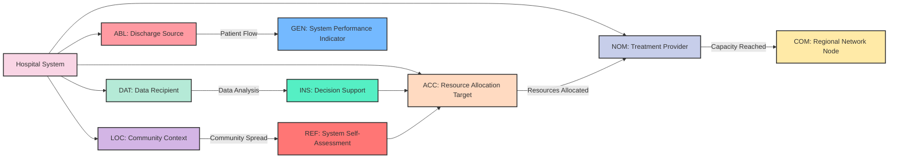

"The integration of the Reflexive case [REF] was particularly crucial," Dr. Al-Zahrani noted. "It allowed hospital systems to continuously self-assess and reorganize based on changing conditions—shifting from treating individual patients to coordinating regional responses as needed."

Throughout the day, similar presentations demonstrated CEREBRUM implementations in fields ranging from sustainable agriculture to conflict resolution, from financial system stability to education reform.

Professor Enderby, now quite elderly but still sharp, delivered the closing address:

"What we've witnessed today is more than a collection of clever applications—it's the emergence of a new grammar for understanding and governing complexity at all scales. By modeling transformational cases rather than static entities, CEREBRUM has proven adaptable to challenges from the molecular to the planetary."

He displayed a final diagram, showing not a specific implementation but the meta-structure of CEREBRUM itself:

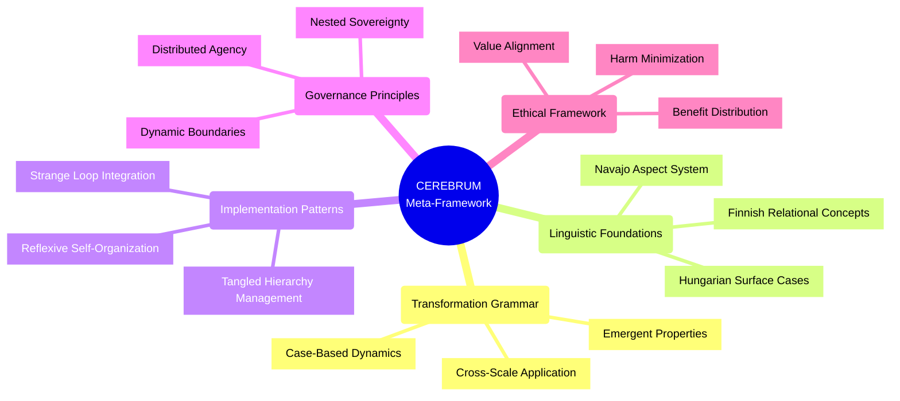

"As we look to the future," the professor concluded, "the most important application of CEREBRUM may be in how it transforms our own thinking—from static to dynamic, from linear to networked, from separate to interconnected. In teaching us a new language of transformation, it offers us a new way to imagine and create our shared future."

As the delegates rose in applause, Daisy turned to Alec with tears in her eyes.

"Who would have thought," she whispered, "that our little conversations about grammar cases would lead to all this?"

"I always knew your explanations were compelling," Alec smiled, squeezing her hand. "But even I didn't anticipate they'd help reshape how humanity understands itself and its world."

"The real power wasn't in the framework itself," Professor Enderby said, joining them as the audience began to disperse. "It was in providing a shared language—a grammar—that allowed diverse disciplines to recognize common patterns and possibilities."

"Rather like how learning a new language opens new ways of seeing?" Daisy suggested.

"Precisely," the professor nodded. "CEREBRUM isn't just a model of how systems transform—it's transformed how we model systems. And in doing so, it's opened possibilities we couldn't previously imagine or articulate."

"What's next?" Alec asked practically.

The professor's eyes twinkled. "That, my dear Inspector, is up to all of us. We've developed a grammar of transformation. Now we must write the future with it."

As they left the United Nations, the New York sky was painted with the colors of sunset, transforming from moment to moment—a fitting backdrop to their conversation about a framework that had reshaped humanity's understanding of transformation itself.

"You know," Daisy said thoughtfully, "in the Navajo view, transformation isn't just change—it's the essential nature of reality. Everything is always in the process of becoming something else."

"Rather like your explanations," Alec smiled, "which started as a simple grammar lesson and became a global framework for understanding complexity."

"Or like us," Daisy replied, taking his arm. "Always transforming, always becoming, always in the process of the next case."

"In which case," Alec said with a rare play on words, "I believe dinner is our next transformation. I hear there's an excellent Hungarian restaurant nearby."

"Perfect!" Daisy laughed. "I can explain the distinction between the inessive and illative cases over paprikash!"

"Heaven help me," Alec murmured, but he was smiling as they walked into the gathering dusk, two small figures in a world transformed by the grammar of possibility they had helped to create. 