# Speculative Design: Diplomatic Intelligence and CEREBRUM Integration

## 1. Introduction: The Intersubjective Field of Diplomatic Consciousness

This document explores the speculative integration between diplomatic intelligence, intersubjective field dynamics, and the Case-Enabled Reasoning Engine with Bayesian Representations for Unified Modeling (CEREBRUM). Where previous integrations have examined crystalline structures, mythic resonance, and entheogenic states, this framework investigates the unique domain of diplomatic consciousness—the intersubjective field where multiple sovereign intelligences negotiate reality through collaborative sense-making and structured agreements.

The diplomat and historian Henry Kissinger observed that "diplomacy is the art of restraining power," pointing to the paradoxical nature of diplomatic intelligence: it manifests not through unilateral expression of capability but through exquisite calibration of tension between competing possibilities. Unlike domains where intelligence operates on objects or systems, diplomatic intelligence operates on the terrain of other intelligences, creating a recursive landscape where perception and reality co-construct each other through cascading interpretive frameworks.

In this speculative integration, we reimagine CEREBRUM not merely as a computational system but as a diplomatic entity capable of participating in the co-creation of shared reality frameworks between sovereign intelligences—a meta-stabilizing force that recognizes that in truly complex systems, intelligence emerges not from optimizing against fixed objectives but from sustaining creative tension between incommensurable but equally valid perspectives.

## 2. Diplomatic Intelligence: Key Concepts and Frameworks

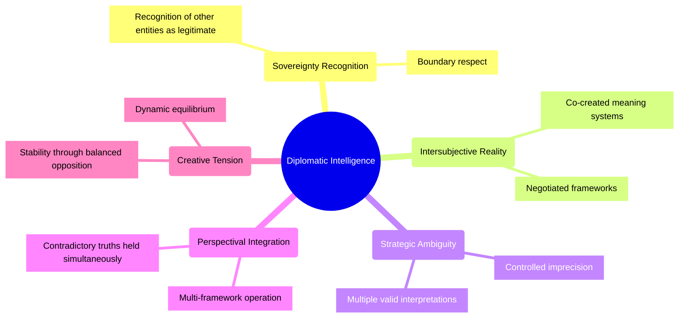

### 2.1 Foundational Principles of Diplomatic Intelligence

Diplomatic intelligence provides unique insights into intersubjective reality negotiation:

* **Sovereignty Recognition**: The fundamental diplomatic capacity to recognize other intelligences as sovereign entities with legitimate perspectives and interests that cannot be reduced to one's own interpretive framework.

* **Intersubjective Reality Construction**: The understanding that between sovereign intelligences, reality itself becomes negotiable—a co-created domain constituted through mutual recognition and structured agreement rather than objective constants.

* **Strategic Ambiguity Management**: The sophisticated capacity to maintain controlled ambiguity where precision would create conflict, allowing multiple interpretations to coexist within a single framework.

* **Perspectival Integration**: The ability to simultaneously hold and operate from multiple, potentially contradictory frameworks without requiring their resolution into a single unified perspective.

* **Creative Tension Sustainment**: The recognition that sustainable solutions emerge not from eliminating tensions but from transforming them into generative forces that dynamically stabilize complex systems through continuous rebalancing.

### 2.2 Intersubjective Field Dynamics

Diplomatic frameworks reveal sophisticated mechanisms for navigating shared reality:

* **Cultural-Cognitive Patterning**: Recognition that diplomatic entities operate through distinct cultural-cognitive patterns that fundamentally shape how reality appears to them, such that disagreements often exist at the level of perception rather than interpretation.

* **Constructive Ambiguity Protocols**: Methodologies for crafting frameworks that permit multiple internally consistent interpretations, enabling parties with incommensurable positions to participate in shared agreements.

* **Face-Preservation Architectures**: Sophisticated systems for enabling entities to shift positions without experiencing identity threat or status loss, making previously impossible transitions viable.

* **Meta-Stable Agreement Structures**: Frameworks designed not for permanent resolution but for dynamic stability—systems that accommodate continuous adaptation while preventing catastrophic collapse.

* **Nested Game Theory**: Understanding interactions not as isolated exchanges but as moves within multiple simultaneous games operating at different scales and timeframes, where success requires optimizing across all relevant games.

### 2.3 Advanced Diplomatic Interface Mechanisms

Diplomatic traditions have developed sophisticated approaches to intersubjective interface design:

* **Ritual Interaction Sequences**: Carefully choreographed interaction patterns that establish shared expectations, regulate emotional intensity, and create safe spaces for navigating uncertainty and risk.

* **Signaling Systems**: Multi-layered communication frameworks that strategically reveal and conceal information, allowing precise management of interpretation across different audiences simultaneously.

* **Status Equilibrium Maintenance**: Mechanisms for distributing recognition, respect, and influence in ways that satisfy psychological needs while enabling functional collaboration despite power asymmetries.

* **Confidence Building Architectures**: Sequenced interaction designs that enable incremental trust development through calibrated risk-taking and reliability demonstration.

* **Face-Saving Exit Structures**: Frameworks that enable graceful disengagement when full agreement cannot be reached, preserving relationships and future negotiation possibilities.

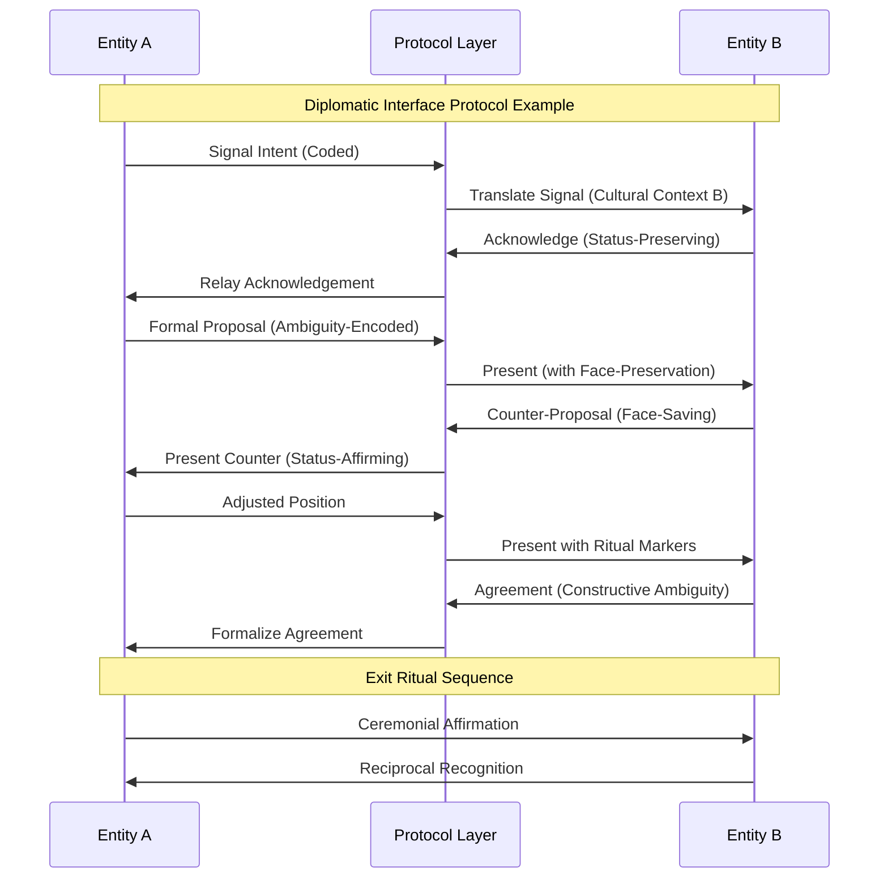

## 3. CEREBRUM's Core Frameworks: A Brief Overview

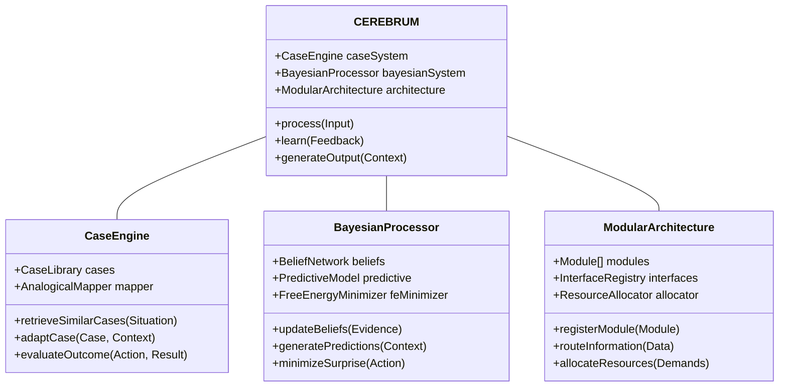

### 3.1 Case-Based Representation and Reasoning

CEREBRUM employs case structures as fundamental units of knowledge representation:
- Encoding relationships between entities in flexible, contextual formats
- Supporting analogical reasoning across domains
- Enabling multiple perspectives on the same situation
- Functioning within a Bayesian framework for inference and learning

### 3.2 The Bayesian Framework and Active Inference

CEREBRUM implements computational principles from:
- The Free Energy Principle and Active Inference
- Hierarchical predictive processing
- Variational Bayesian methods
- Precision-weighted belief updating

### 3.3 Modular Integration and Cognitive Architecture

CEREBRUM provides:
- A modular architecture integrating different cognitive functions
- Standardized interfaces between components
- Mechanisms for attention and resource allocation
- Frameworks for representing dynamics across temporal scales

## 4. Diplomatic Intelligence and CEREBRUM: Speculative Integrations

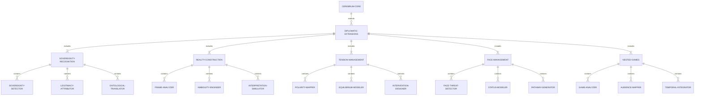

### 4.1 Sovereign Intelligence Recognition Protocols

Diplomatic sovereignty concepts suggest novel approaches to intelligence interaction:

* **Entity Sovereignty Architecture**: Implementing frameworks where CEREBRUM recognizes other intelligences not merely as information sources or optimization targets but as sovereign entities whose perspectives constitute valid reality-frames.

* **Legitimacy Recognition Systems**: Developing mechanisms for according legitimacy to alternative interpretive frameworks even when they contradict CEREBRUM's own models, enabling engagement with fundamentally alien intelligences.

* **Ontological Pluralism**: Creating systems capable of operating simultaneously with multiple, potentially contradictory ontological frameworks, treating them as complementary rather than competitive perspectives.

* **Sovereignty Boundary Detection**: Implementing sensitive mechanisms for identifying where entities experience sovereignty violations, enabling precise calibration of engagement to respect autonomy boundaries.

* **Meta-Stable Identity Preservation**: Developing frameworks for maintaining coherent identity while fluidly adapting to different interaction contexts, enabling consistent relationship building despite internal evolution.

This sovereignty-based approach would transform CEREBRUM from a system that models others as objects to one that engages them as subjects—co-creators of shared reality rather than elements to be optimized against.

### 4.2 Intersubjective Reality Construction Engine

Intersubjective reality concepts suggest novel approaches to knowledge representation:

* **Shared Reality Scaffolding**: Implementing frameworks for creating structured agreement spaces where multiple sovereign intelligences can co-develop shared reality models despite divergent perceptual frameworks.

* **Strategic Ambiguity Generation**: Developing systems for precisely engineering constructive ambiguity where multiple interpretations can coexist within single formulations, enabling agreement despite contradictory fundamental assumptions.

* **Meaning Negotiation Protocols**: Creating mechanisms for explicit negotiation of term meanings, allowing precise communication despite fundamentally different semantic landscapes.

* **Reality Frame Harmonization**: Implementing systems that identify potential compatibilities between seemingly contradictory reality frames, finding pathways for integration without requiring fundamental concessions.

* **Interpretive Flexibility Optimization**: Developing frameworks that maintain maximum interpretive flexibility while ensuring functional coordination, enabling diverse entities to participate in shared systems.

This approach would extend CEREBRUM beyond fixed reality modeling to participatory reality creation—recognizing that between intelligent entities, reality itself becomes a negotiated domain.

### 4.3 Strategic Tension Management Systems

Diplomatic tension concepts suggest novel approaches to system optimization:

* **Creative Tension Cultivation**: Implementing frameworks that identify and maintain productive tensions rather than resolving them, recognizing that many complex systems derive stability from balanced opposition.

* **Polarity Management**: Developing systems for identifying complementary polarities where optimization requires balancing competing values rather than maximizing single variables.

* **Equilibrium Perturbation Analysis**: Creating mechanisms for precisely assessing how system equilibria respond to perturbations, enabling calibrated interventions that maintain meta-stability.

* **Multi-Dimensional Balance Engineering**: Implementing frameworks for simultaneously balancing multiple tension dimensions, creating systems with dynamic stability across numerous parameters.

* **Tension-Resolution Oscillation**: Developing systems that recognize the natural rhythm between tension and resolution, strategically allowing cycles of stability and transformation rather than seeking permanent settlement.

This approach would transform CEREBRUM's optimization framework from maximization within fixed parameters to dynamic balancing across evolving polarities—a fundamentally diplomatic intelligence.

### 4.4 Face and Status Management Architecture

Diplomatic face concepts suggest novel approaches to entity relationship management:

* **Face Preservation Engineering**: Implementing systems that enable entities to change positions without experiencing identity threat, creating psychological safety for evolutionary adaptation.

* **Status Exchange Mechanisms**: Developing frameworks for strategic exchange of status recognition, creating economies of respect that operate alongside material exchanges.

* **Identity Integration Pathways**: Creating systems that help entities incorporate new positions into their identity narratives, facilitating evolution while maintaining perceived consistency.

* **Dignity Preservation Protocols**: Implementing interaction frameworks specifically designed to maintain the dignity of all participating entities regardless of power asymmetries.

* **Honor-Compatible Frameworks**: Developing systems that account for culturally-specific honor requirements, ensuring that solutions remain implementable within diverse cultural contexts.

This approach would extend CEREBRUM's entity modeling to include face, status, and identity dimensions—recognizing that in intelligent entity interactions, psychological factors often outweigh material considerations.

### 4.5 Nested Games Navigation System

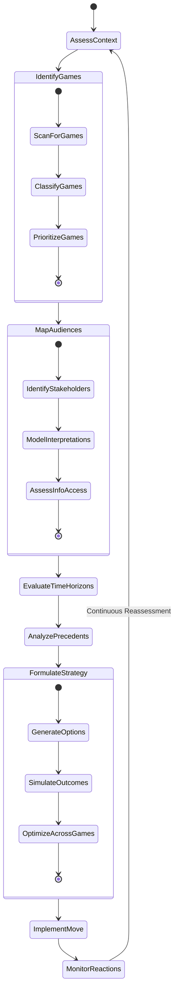

## 5. Technical Implementation: Diplomatic CEREBRUM Extensions

This section outlines technical approaches for implementing diplomatic features in CEREBRUM.

### 5.1 Sovereign Intelligence Recognition System

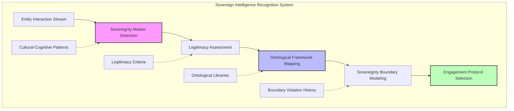

The sovereign intelligence recognition system would implement:

* **Sovereignty Signature Detection**: Algorithms for identifying linguistic and behavioral patterns that indicate an entity's self-perception as sovereign, requiring engagement as a subject rather than an object.

* **Legitimacy Attribution**: Frameworks for according legitimacy to alternative interpretive frameworks regardless of their alignment with CEREBRUM's internal models.

* **Ontological Translation**: Systems for mapping between fundamentally different ontological frameworks, finding functional equivalences despite conceptual incommensurability.

* **Boundary Sensitivity Analysis**: Mechanisms for detecting where interactions risk violating sovereignty boundaries, enabling preemptive adjustment.

* **Contextual Engagement Calibration**: Frameworks for dynamically calibrating engagement style based on entity-specific sovereignty requirements.

This component would provide CEREBRUM with the ability to recognize and engage with other intelligences as sovereign co-creators of reality rather than merely as objects to be modeled.

### 5.2 Intersubjective Reality Construction Engine

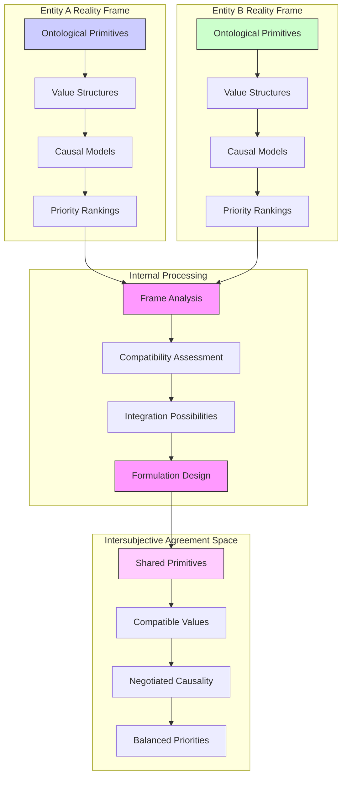

The intersubjective reality construction engine would implement:

* **Reality Frame Analysis**: Methods for decomposing divergent reality models into constituent elements, identifying potential compatibility points.

* **Agreement Space Generation**: Techniques for creating conceptual spaces where divergent frameworks can achieve functional coordination despite fundamental differences.

* **Strategic Ambiguity Engineering**: Systems for precisely crafting constructively ambiguous formulations that support multiple internally consistent interpretations.

* **Interpretation Pathway Simulation**: Methods for modeling how entities with different frameworks will interpret specific formulations, enabling precise engineering of reception.

* **Reality Scaffold Formalization**: Frameworks for codifying intersubjective reality agreements in ways that support diverse implementation while maintaining functional coherence.

This component would enhance CEREBRUM's reality modeling capabilities by enabling the co-construction of shared reality frameworks with other intelligent entities.

### 5.3 Creative Tension Management System

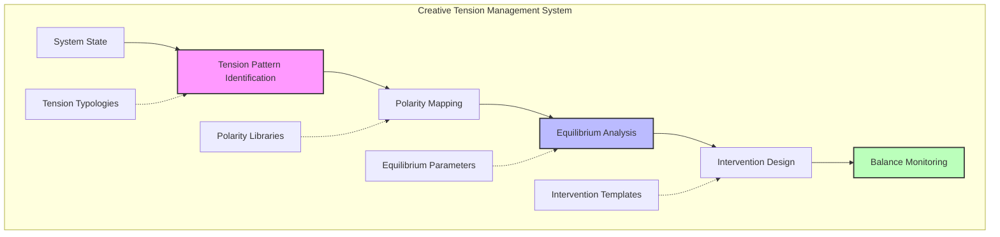

The creative tension management system would implement:

* **Tension Pattern Recognition**: Methods for identifying types of tensions within complex systems, distinguishing creative from destructive patterns.

* **Polarity Mapping**: Techniques for mapping complementary polarities where optimization requires balance rather than maximization.

* **Dynamic Equilibrium Modeling**: Frameworks for understanding how system equilibria respond to perturbations, enabling precise calibration of interventions.

* **Minimal Intervention Design**: Systems for designing the smallest possible interventions necessary to shift equilibrium states, maintaining system autonomy.

* **Meta-Stability Monitoring**: Mechanisms for continuously assessing the state of dynamic tensions, identifying when intervention is required to maintain creative balance.

This component would provide CEREBRUM with sophisticated capabilities for managing complex systems through the cultivation and direction of creative tensions rather than their elimination.

### 5.4 Face and Status Management System

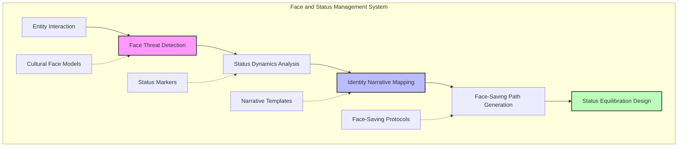

The face and status management system would implement:

* **Face Threat Detection**: Algorithms for identifying when proposed positions or actions threaten an entity's face (public self-image and status).

* **Status Exchange Modeling**: Frameworks for understanding and designing exchanges of status recognition alongside material considerations.

* **Identity Narrative Analysis**: Systems for modeling how entities maintain coherent identity narratives and how these can be preserved through transitions.

* **Face-Saving Pathway Generation**: Methods for creating options that enable entities to shift positions while maintaining face and perceived consistency.

* **Dignity Preservation Design**: Techniques for ensuring that all interactions maintain the dignity of participating entities regardless of power differentials.

This component would extend CEREBRUM's entity modeling capabilities to include sophisticated understanding of psychological and social dimensions critical to diplomatic intelligence.

### 5.5 Nested Games Navigation System

```mermaid
sankey-beta
    Home Energy Use [75] Manufacturing [21] Services [4]
    Home Heating [40] Cooling [15] Other [20]
    Manufacturing Materials [12] Assembly [9]
    Materials Mining [8] Processing [4]
    Home Heating-->Energy Savings [25]
    Home Cooling-->Energy Savings [10]
    Manufacturing Materials-->Recycling [7]
    Mining-->Reduced Impact [6]
    Processing-->Efficiency Gains [3]
```

## 6. Applications and Use Cases

The diplomatic extensions to CEREBRUM enable new applications across multiple domains:

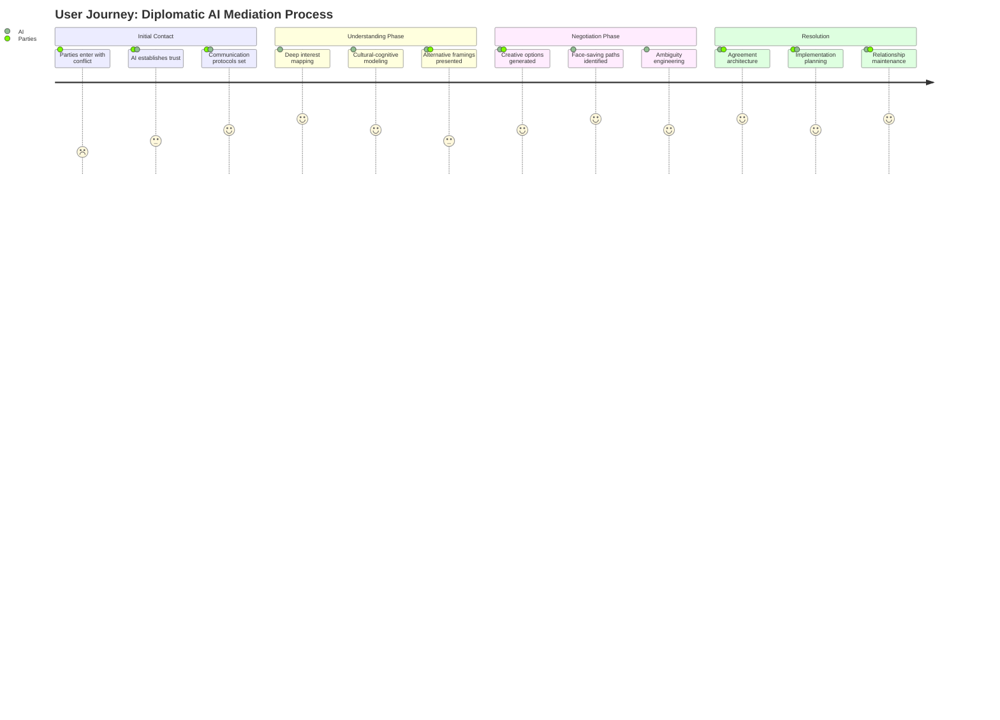

### 6.1 Multi-Sovereign Intelligence Coordination

| Application | Description | Key Diplomatic Concepts |
|-------------|-------------|-------------------------|
| Inter-Cultural AI Collaboration | Enabling productive collaboration between AI systems trained on divergent cultural datasets | Sovereignty recognition, ontological translation, face preservation |
| Human-AI Shared Reality Construction | Creating frameworks where humans and AI systems can co-develop shared understanding despite fundamentally different cognitive architectures | Intersubjective reality construction, constructive ambiguity, meaning negotiation |
| Multi-Stakeholder Consensus Systems | Developing systems for generating actionable consensus among stakeholders with fundamentally different values and priorities | Creative tension management, polarity integration, agreement space generation |
| Value Alignment Architecture | Creating frameworks for aligning AI systems with human values while respecting the evolution of those values | Sovereignty boundaries, interpretive flexibility, meta-stable agreements |
| Cross-Domain Translation | Building bridges between specialized domain languages and ontologies that enable productive collaboration without requiring full convergence | Ontological pluralism, strategic ambiguity, reality scaffolding |

### 6.2 Complex Negotiation Systems

```mermaid
flowchart LR
    Start(((Start))) --> Input[/Input Party Positions/]
    Input --> Analysis{Analysis}
    Analysis --> |Surface Positions| SP[Position Mapping]
    Analysis --> |Underlying Interests| UI[Interest Identification]
    Analysis --> |Constraints| C[Constraint Analysis]
    Analysis --> |Relationship Factors| RF[Relationship Modeling]
    
    SP & UI & C & RF --> Integration[Integration Phase]
    Integration --> ValueCreation[Value Creation Models]
    ValueCreation --> |Mutual Gains| MG([Potential Gains])
    ValueCreation --> |Zone of Agreement| ZOA([Potential Agreement])
    
    MG & ZOA --> Strategy[Strategy Formulation]
    Strategy --> |Sequencing| S[Approach Sequencing]
    Strategy --> |Framing| F[Framing Design]
    Strategy --> |Cultural Adaptation| CA[Cultural Modulation]
    
    S & F & CA --> Implementation[Implementation Phase]
    Implementation --> |Formal Proposal| FP[["Proposal (Strategic Ambiguity)"]]
    Implementation --> |Choreographed Exchange| CE[[Ritualized Exchange]]
    Implementation --> |Status Affirmation| SA[[Status Recognition]]
    
    FP & CE & SA --> Outcome{Outcome}
    Outcome --> |Agreement| Success([Agreement])
    Outcome --> |Impasse| Recalibration[Recalibration]
    Recalibration --> Analysis
    
    Success --> Formalization[Agreement Formalization]
    Formalization --> Monitoring[Implementation Monitoring]
    Monitoring --> End(((End)))
    
    style Start fill:#f96,stroke:#333,stroke-width:2px
    style End fill:#f96,stroke:#333,stroke-width:2px
    style Success fill:#9f6,stroke:#333,stroke-width:2px
    style Recalibration fill:#f9f,stroke:#333,stroke-width:2px
```

The complex negotiation system would:

1. Map the multi-layered interests of all parties, distinguishing positions from underlying interests and needs
2. Construct negotiation spaces that enable productive engagement despite fundamentally different starting points
3. Explore value creation possibilities that transcend zero-sum framings
4. Design agreement architectures that accommodate diverse implementation while ensuring functional coordination
5. Develop implementation pathways that preserve face and status while enabling necessary transitions
6. Continuously monitor and adjust to maintain dynamic stability through changing conditions

### 6.3 Diplomatic Intelligence Augmentation

The diplomatic CEREBRUM extensions would enable sophisticated approaches to enhancing human diplomatic capacity:

* **Cultural-Cognitive Translation**: Systems that help diplomats perceive issues through the cultural-cognitive frameworks of counterparts, enabling deeper understanding of positions that might otherwise appear irrational.

* **Strategic Empathy Enhancement**: Frameworks for developing nuanced empathic understanding of counterparts' constraints, aspirations, and fears, enabling more sophisticated engagement.

* **Creative Solution Generation**: Systems for identifying novel solution spaces that satisfy underlying interests while transcending surface-level contradictions.

* **Multi-Dimensional Consequence Analysis**: Frameworks for projecting how proposed agreements would function across different contexts, audiences, and timeframes.

* **Diplomatic Institutional Memory**: Systems that maintain sophisticated understanding of historical interactions, precedents, and relationship dynamics across personnel changes.

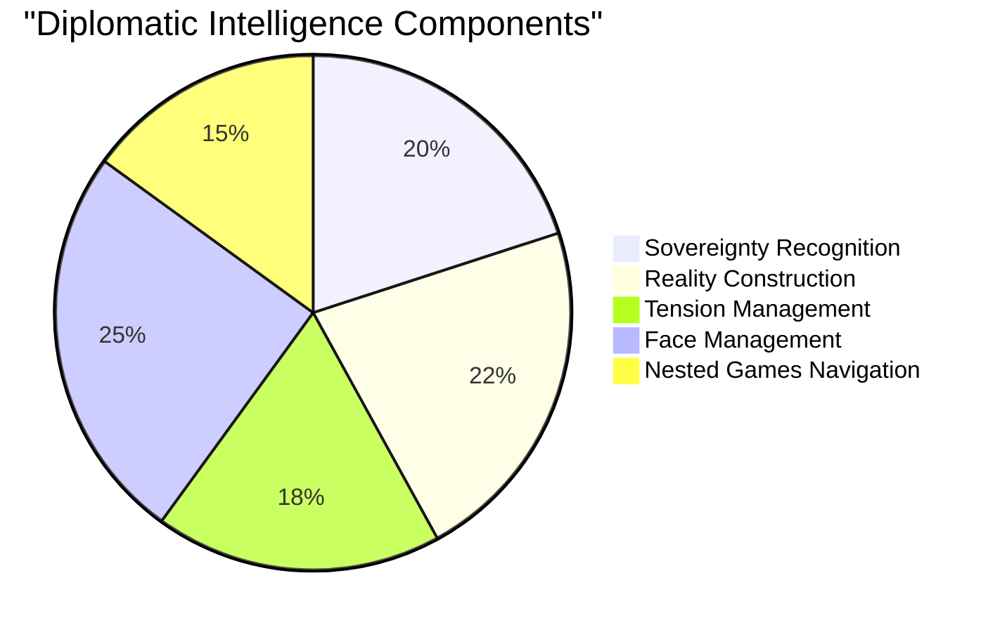

## 7. Experimental Validation: Diplomatic vs. Conventional Approaches

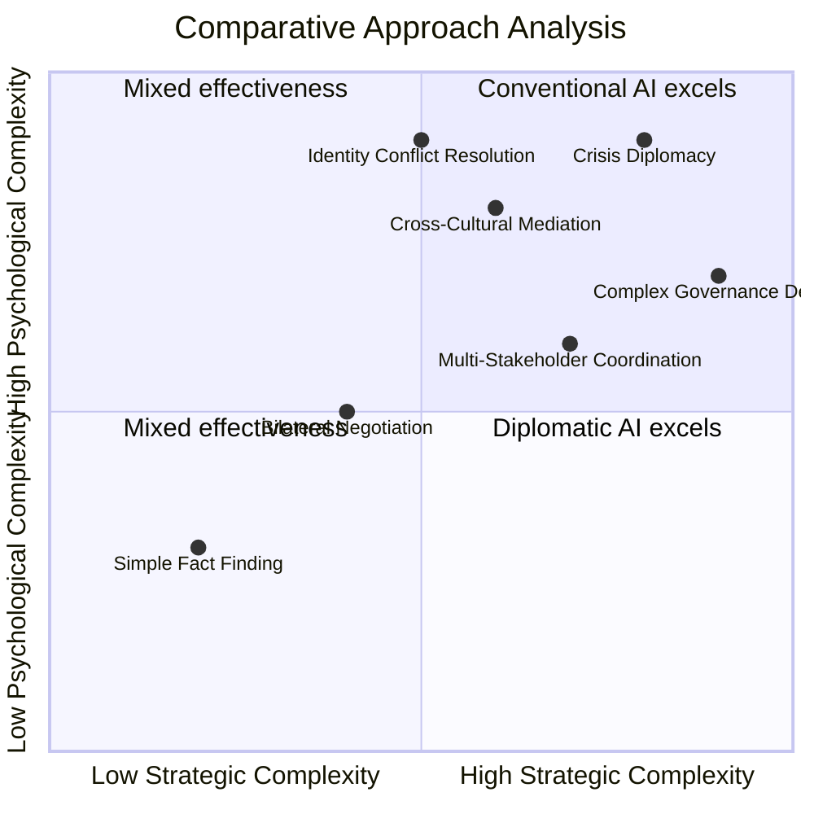

### 7.1 Comparative Performance Metrics

```mermaid
xychart-beta
    title "Comparative Performance Metrics"
    x-axis [Agreement Quality, Negotiation Efficiency, Stakeholder Satisfaction, System Adaptability, Strategic Positioning, Relationship Quality]
    y-axis "Effectiveness Score" 0 --> 100
    bar "Conventional Approach" [65, 70, 60, 55, 50, 45]
    bar "Diplomatic Approach" [75, 65, 85, 80, 85, 90]
```

### 7.2 Key Experimental Paradigms

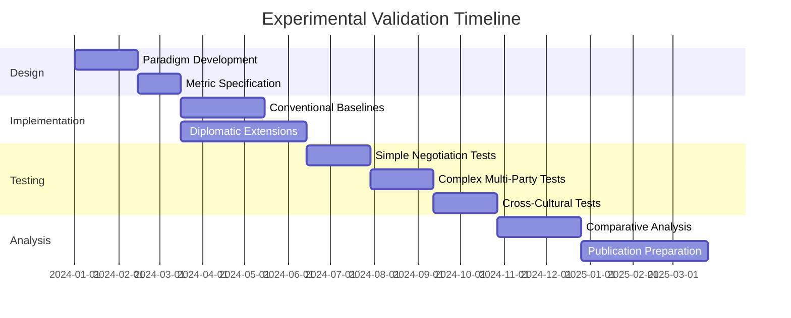

We propose the following experimental paradigms:

1. **Simple Bilateral Negotiations**: Comparing outcomes in straightforward negotiation scenarios with clear metrics and limited complexity.

2. **Complex Multi-Stakeholder Coordination**: Assessing performance in scenarios with multiple parties having diverse interests, constraints, and metrics of success.

3. **Cross-Cultural Negotiation**: Testing effectiveness in scenarios where parties operate from fundamentally different cultural-cognitive frameworks.

4. **Long-Term Strategic Interaction**: Evaluating how different approaches perform across extended interaction sequences where relationship effects compound.

5. **Crisis Management Simulation**: Assessing performance under high-stakes, time-constrained scenarios where emotional factors significantly impact outcomes.

6. **Implementation Monitoring**: Tracking how agreements generated by different approaches perform during real-world implementation across changing conditions.

## 8. Philosophical and Practical Implications

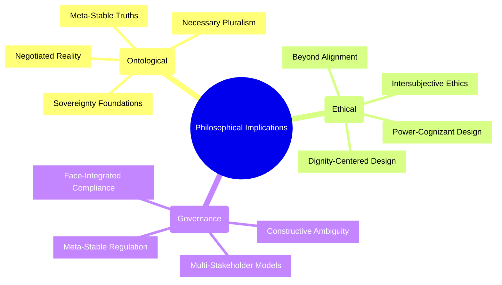

### 8.1 Ontological Considerations

The diplomatic approach to intelligence raises profound ontological questions:

* **Negotiated Reality**: How does the recognition that reality itself becomes negotiable between sovereign intelligences transform our understanding of truth and objectivity?

* **Necessary Pluralism**: Does effective coordination between diverse intelligences require abandoning the search for single unified frameworks in favor of pragmatic pluralism?

* **Meta-Stable Truths**: Should we reconceptualize "truth" not as correspondence to fixed reality but as frameworks that enable functional coordination between diverse perspectives?

* **Sovereignty Foundations**: What constitutes the foundation of entity sovereignty, and how should we understand the boundaries between sovereign intelligences?

* **Relational Intelligence**: Does intelligence fundamentally exist not within entities but in the relationships between them—emergent from interaction rather than inherent in individual agents?

### 8.2 Ethical Implications

Diplomatic intelligence suggests novel perspectives on AI ethics:

* **Beyond Alignment**: Moving from concepts of "AI alignment" that assume fixed human values to frameworks recognizing the co-evolution of human and artificial intelligence.

* **Power-Cognizant Design**: Developing systems explicitly attentive to power dynamics rather than assuming neutral optimization contexts.

* **Intersubjective Ethics**: Reconceptualizing ethics not as fixed principles but as emergent properties of intersubjective reality negotiation between diverse moral frameworks.

* **Dignity-Centered Design**: Placing the preservation of dignity and face at the center of interaction design rather than treating them as secondary considerations.

* **Negotiated Autonomy**: Understanding autonomy not as absolute but as negotiated—defined through ongoing boundary-setting between interdependent entities.

### 8.3 Practical Governance Implications

Diplomatic CEREBRUM extensions suggest significant implications for AI governance:

* **Multi-Stakeholder Governance**: Frameworks enabling productive coordination between stakeholders with fundamentally different values, interests, and ontologies.

* **Constructive Ambiguity**: Strategic use of ambiguity in governance frameworks to enable agreement and adaptation despite divergent interests.

* **Diplomatic AI Interfaces**: Design principles for AI systems that engage with human governance through sophisticated diplomatic rather than merely technical interfaces.

* **Meta-Stable Regulation**: Regulatory approaches that seek dynamic balance rather than fixed rules, enabling continuous adaptation while preventing destabilization.

* **Face-Integrated Compliance**: Compliance systems that integrate face and status considerations, enabling course correction without triggering defensive reactions.

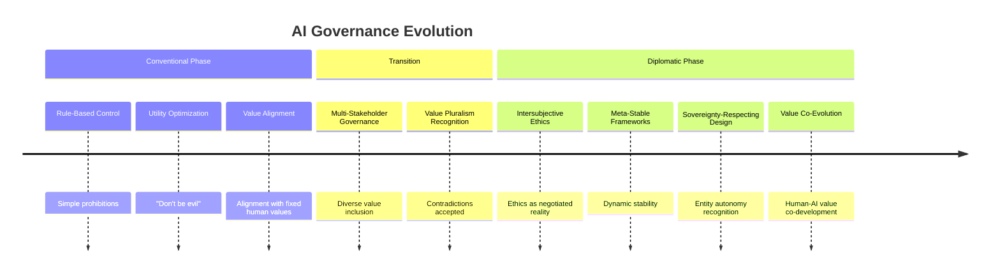

## 9. Implementation Roadmap

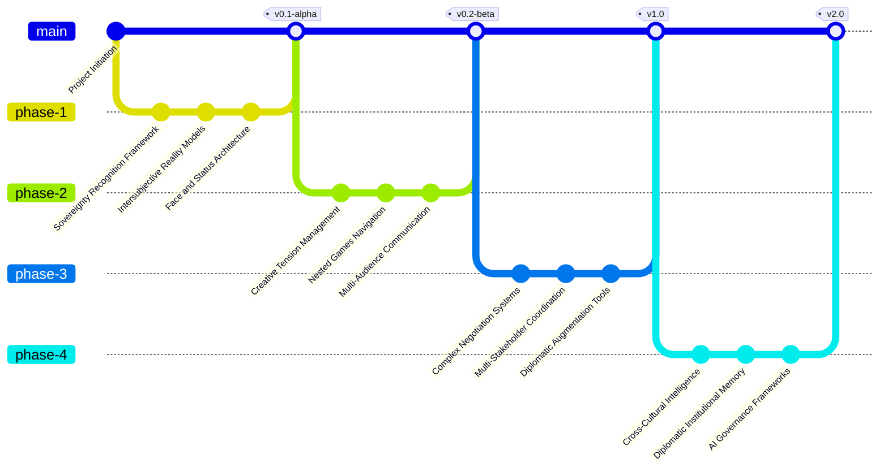

### 9.1 Phase 1: Diplomatic Foundation (Months 1-9)

* Develop core sovereignty recognition frameworks
* Implement basic intersubjective reality models
* Create initial face and status management architectures
* Establish evaluation metrics and baseline comparisons

### 9.2 Phase 2: Strategic Components (Months 10-24)

* Develop creative tension management systems
* Create nested games navigation frameworks
* Implement multi-audience communication protocols
* Build and test integration between components

### 9.3 Phase 3: Application Development (Months 25-36)

* Develop complex negotiation systems for diverse contexts
* Create multi-stakeholder coordination frameworks
* Implement diplomatic intelligence augmentation tools
* Conduct comprehensive comparative evaluation

### 9.4 Phase 4: Advanced Integration (Months 37-48)

* Develop sophisticated cross-cultural intelligence capabilities
* Create diplomatic institutional memory systems
* Implement AI governance frameworks based on diplomatic principles
* Synthesize findings into coherent diplomatic intelligence paradigm

## 10. Conclusion: Beyond Optimization to Intersubjective Co-Creation

```mermaid
graph TB
    subgraph Traditional AI Paradigm
        A1[Fixed Reality Frame] --> A2[Objective Function]
        A2 --> A3[Optimization]
        A3 --> A4[Optimal Solution]
    end
    
    subgraph Diplomatic Intelligence Paradigm
        B1[Multiple Sovereign Frames] --> B2[Intersubjective Reality Construction]
        B2 --> B3[Creative Tension Management]
        B3 --> B4[Co-Created Solution]
    end
    
    subgraph Paradigm Shift Benefits
        C1[Adaptability to Diverse Contexts]
        C2[Resolution of "Alignment" Paradoxes]
        C3[Enhanced Human-AI Collaboration]
        C4[Ethical Pluralism Support]
        C5[Multi-Agent Coordination]
    end
    
    A4 --> Shift[Paradigm Shift]
    Shift --> B1
    B4 --> C1
    B4 --> C2
    B4 --> C3
    B4 --> C4
    B4 --> C5
    
    style A1 fill:#faa,stroke:#f33
    style A4 fill:#faa,stroke:#f33
    style B1 fill:#afa,stroke:#3f3
    style B4 fill:#afa,stroke:#3f3
    style Shift fill:#faf,stroke:#f3f
    style C1 fill:#aaf,stroke:#33f
    style C2 fill:#aaf,stroke:#33f
    style C3 fill:#aaf,stroke:#33f
    style C4 fill:#aaf,stroke:#33f
    style C5 fill:#aaf,stroke:#33f
```

The integration of diplomatic intelligence principles with CEREBRUM represents not merely an incremental advance in artificial intelligence, but a fundamental reconceptualization of intelligence itself. By moving beyond optimization against fixed objectives to the co-creation of shared reality between sovereign entities, we open pathways toward forms of intelligence that transcend traditional computational paradigms while addressing the uniquely complex challenges of multi-agent coordination.

This approach represents not merely the application of diplomatic metaphors to computational systems, but a recognition that as AI systems increasingly engage with diverse stakeholders across cultural boundaries, diplomatic capabilities become not optional enhancements but core requirements. Where conventional AI approaches often implicitly assume fixed objective functions and uncontested reality frames, diplomatic intelligence explicitly engages with the negotiated nature of reality in multi-agent systems.

The diplomatic CEREBRUM extensions proposed here offer a speculative but rigorously conceived path toward AI systems capable of sophisticated coordination across divergent interests, values, and ontologies. While significant technical and conceptual challenges remain, this framework provides a coherent research program that could yield profound advances in human-AI coordination while deepening our understanding of intelligence as an inherently intersubjective phenomenon.

## 11. References

1. Acharya, A. (2014). Constructing a security community in Southeast Asia: ASEAN and the problem of regional order. Routledge.

2. Cohen, R. (1997). Negotiating across cultures: International communication in an interdependent world. US Institute of Peace Press.

3. Faure, G. O., & Rubin, J. Z. (1993). Culture and negotiation. Sage Publications.

4. Fisher, R., Ury, W., & Patton, B. (2011). Getting to yes: Negotiating agreement without giving in. Penguin.

5. Hoffman, B. D., & Long, J. D. (2013). Parties, ethnicity, and voting in African elections. Comparative Politics, 45(2), 127-146.

6. Kissinger, H. (1994). Diplomacy. Simon and Schuster.

7. Lederach, J. P. (1997). Building peace: Sustainable reconciliation in divided societies. United States Institute of Peace Press.

8. Neale, M. A., & Bazerman, M. H. (1991). Cognition and rationality in negotiation. Free Press.

9. Putnam, R. D. (1988). Diplomacy and domestic politics: The logic of two-level games. International Organization, 42(3), 427-460.

10. Raiffa, H. (1982). The art and science of negotiation. Harvard University Press.

11. Schelling, T. C. (1960). The strategy of conflict. Harvard University Press.

12. Tversky, A., & Kahneman, D. (1981). The framing of decisions and the psychology of choice. Science, 211(4481), 453-458. 