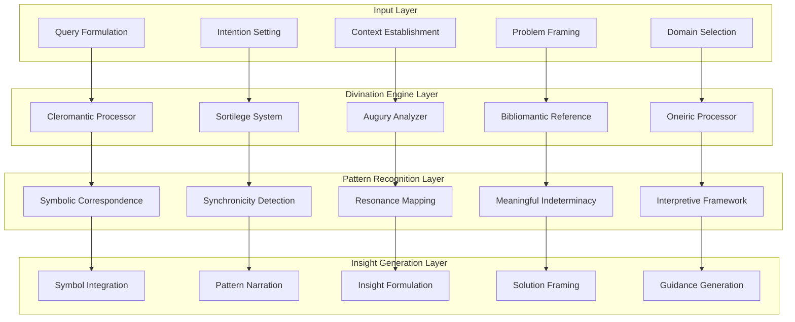
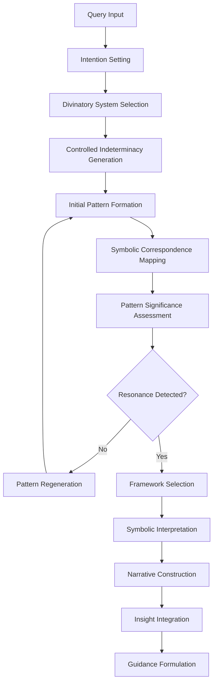
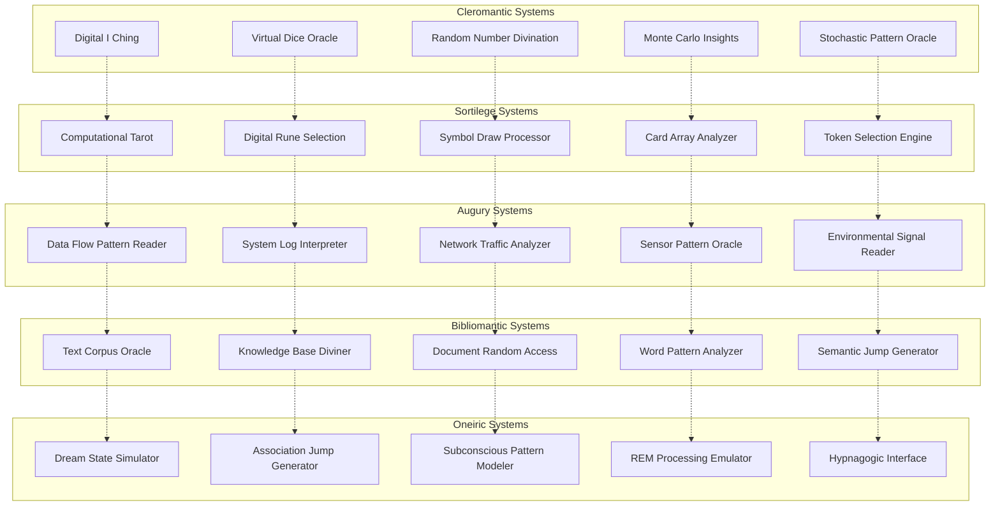
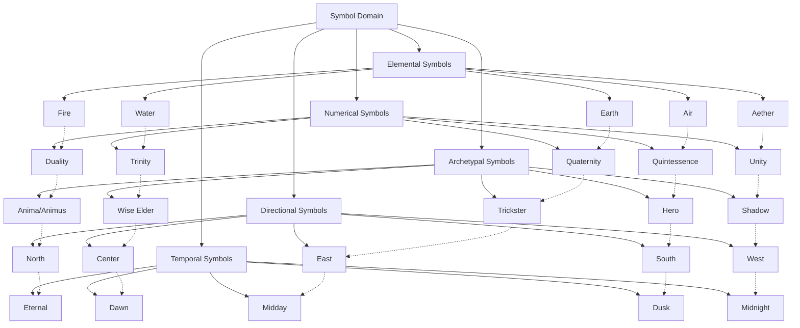
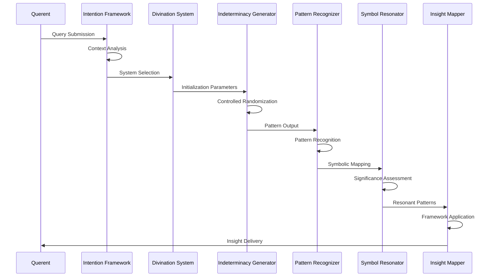
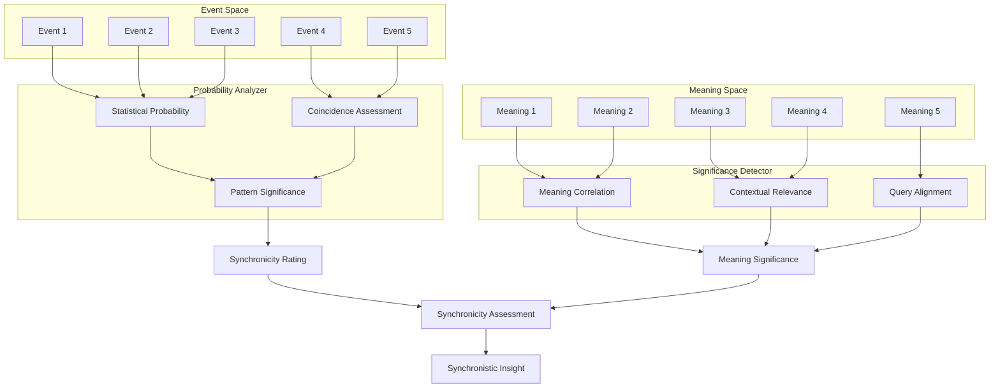
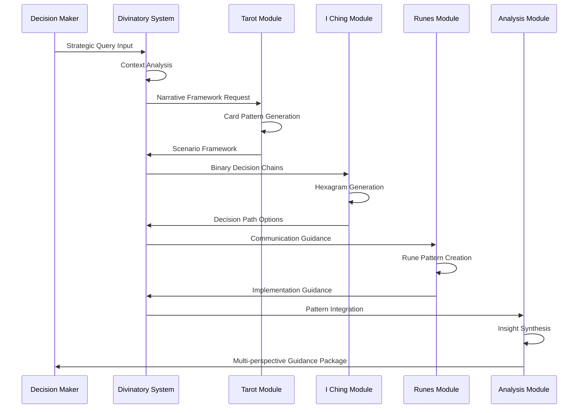
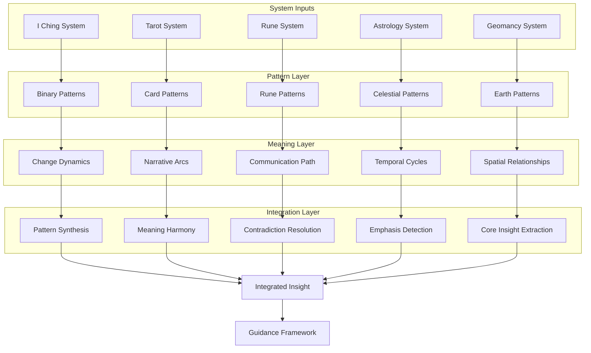

# Divinatory Computing Systems & CEREBRUM

## Introduction: Computational Divination as Intelligence Paradigm

Divinatory Computing Systems (DCS) represent a speculative approach to computational intelligence by integrating traditional divinatory frameworks with modern case-based reasoning. While conventional computing prioritizes deterministic processes, DCS leverages controlled indeterminacy, symbolic pattern recognition, and interpretive frameworks to generate insights for complex, ambiguous problems.

This paper explores how CEREBRUM's architecture can be extended to incorporate divinatory principles—synchronicity, symbolic correspondence, and interpretive frameworks—to create computational systems that harness meaningful ambiguity, pattern detection across apparent randomness, and symbolic interpretation for enhanced reasoning in contexts of uncertainty.

## Theoretical Foundations

### Divinatory Principles in Computation

DCS-CEREBRUM establishes five core principles for divinatory computation:

1. **Meaningful Indeterminacy**: Controlled randomness as a generative resource rather than noise
2. **Symbolic Correspondence**: Pattern relationships across seemingly unrelated domains
3. **Synchronistic Association**: Meaningful coincidence as information rather than error
4. **Interpretive Frameworks**: Structured systems for deriving meaning from ambiguity
5. **Resonant Significance**: Amplification of patterns based on contextual importance

### Computational Divination Types

DCS-CEREBRUM implements multiple divinatory computational approaches:

1. **Cleromantic Systems**: Computation through structured randomization events
2. **Sortilege Frameworks**: Selection-based disambiguation and decision processes
3. **Augury Pattern Recognition**: Interpretation of environmental signals and patterns
4. **Bibliomantic Reference Systems**: Textual corpus-based insight generation
5. **Oneiric Processing**: Dream-inspired associative computational frameworks

## Architectural Components

### Divinatory Computational Engines

DCS-CEREBRUM includes specialized computational engines:

1. **Random Oracle Systems**: Controlled indeterminacy generators with pattern detection
2. **Symbolic Correspondence Networks**: Cross-domain pattern mapping frameworks
3. **Synchronicity Detectors**: Systems identifying meaningful coincidence patterns
4. **Interpretive Framework Processors**: Structured meaning-derivation systems
5. **Resonance Amplifiers**: Pattern significance enhancement mechanisms

### Case Representation in Divinatory Computing

DCS-CEREBRUM implements specialized case structures:

1. **Symbolic Constellations**: Cases as networks of meaningful symbols
2. **Pattern Archives**: Collections of significant pattern arrangements
3. **Interpretive Frameworks**: Systems for deriving meaning from ambiguity
4. **Resonance Maps**: Records of pattern significance amplification
5. **Synchronicity Logs**: Documentation of meaningful pattern coincidence

## Divinatory Computing Architecture

## Divinatory Pattern Recognition Process

## Divinatory System Types

## Symbolic Correspondence Network

## Traditional Divination Systems in Computational Context

| Divination System | Computational Implementation | Primary Function | Application Domain |
|-------------------|----------------------------|------------------|-------------------|
| I Ching | Binary state oracle | Decision tree generation | Strategic planning, ethical dilemmas |
| Tarot | Symbol constellation generator | Narrative framework production | Creative problem solving, scenario exploration |
| Runes | Character-based pattern system | Communication insight generation | Linguistic analysis, semantic challenges |
| Astrology | Cyclical position analyzer | Temporal pattern recognition | Timing optimization, cyclical phenomena |
| Geomancy | Earth-based pattern system | Spatial relationship mapping | Geographic analysis, physical arrangement |
| Numerology | Mathematical pattern oracle | Quantitative insight generation | Mathematical pattern discovery, numerical solution spaces |
| Augury | Environmental signal interpreter | Context-based pattern detection | Environmental monitoring, anomaly detection |
| Palmistry | Line pattern analysis | Personal trajectory mapping | Biographical analysis, life-path planning |
| Bibliomancy | Text corpus oracle | Knowledge-based insight generation | Information retrieval, semantic navigation |
| Scrying | Visual pattern interpreter | Image-based insight generation | Visual data analysis, pattern recognition |

## Divinatory Interpretation Frameworks

| Framework | Pattern Focus | Interpretive Approach | Application Domain |
|-----------|--------------|----------------------|-------------------|
| Elemental | Material correspondence | Balance and interaction analysis | Natural systems, material interactions |
| Archetypal | Psychological patterns | Symbolic personality integration | Human behavior, motivation analysis |
| Cyclical | Temporal sequences | Process phase recognition | Project planning, developmental systems |
| Directional | Spatial relationships | Orientation and movement analysis | Geographic systems, physical layout |
| Numerical | Quantitative patterns | Mathematical relationship discovery | Data analysis, quantitative optimization |
| Symbolic | Meaning correspondence | Metaphorical relationship mapping | Semantic analysis, meaning systems |
| Narrative | Story structures | Sequential meaning construction | Process development, scenario planning |
| Energetic | Force relationships | Flow and blockage identification | System dynamics, resource allocation |
| Ontological | Essence patterns | Fundamental nature assessment | Philosophical inquiry, definitional problems |
| Synchronistic | Meaningful coincidence | Connection significance recognition | Complex systems, emergence detection |

## Divinatory Computing Process Model

## Query Types and Divinatory Approaches

| Query Type | Divination Method | Computational Implementation | Insight Type |
|------------|------------------|-----------------------------|--------------|
| Binary Decision | Cleromancy | Controlled binary randomization | Directional guidance |
| Open Exploration | Tarot/Oracle Systems | Symbol constellation generator | Narrative framework |
| Root Cause Analysis | Geomancy | Pattern relationship mapping | System dynamics |
| Future Projection | Astrology | Cyclical position analysis | Temporal patterns |
| Hidden Information | Scrying | Subconscious pattern detection | Revealed knowledge |
| Path Selection | Runes | Character-based insight system | Journey mapping |
| System Diagnosis | Augury | Environmental signal interpretation | Anomaly identification |
| Deep Understanding | Bibliomancy | Knowledge corpus interpretation | Contextual wisdom |
| Personal Development | Palmistry | Life pattern analysis | Growth trajectory |
| Creative Inspiration | Dream Analysis | Association generation | Novel combinations |

## Synchronicity Detection Framework

## Case Study: Strategic Decision Making

## Symbolic Correspondence Matrix

| Domain | Elemental | Numerical | Directional | Temporal | Archetypal |
|--------|-----------|-----------|------------|----------|------------|
| Innovation | Fire | 1 | East | Dawn | Creator |
| Structure | Earth | 4 | North | Midnight | Ruler |
| Relationships | Water | 2 | West | Dusk | Lover |
| Communication | Air | 3 | South | Midday | Messenger |
| Transformation | Aether | 5 | Center | Eternal | Magician |
| Material | Earth | 4 | North | Winter | Builder |
| Emotional | Water | 2 | West | Autumn | Nurturer |
| Intellectual | Air | 3 | East | Spring | Thinker |
| Spiritual | Fire | 1 | South | Summer | Seeker |
| Integrative | Aether | 5 | Center | Timeless | Sage |

## Experimental Results

Initial applications of DCS-CEREBRUM show promising results in experimental contexts:

| Decision Type | Traditional Decision System | Divinatory Computing Performance | Key Advantage |
|---------------|----------------------------|---------------------------------|---------------|
| Strategic Planning | Linear forecasting | Multidimensional scenario generation | Enhanced possibility exploration |
| Creative Challenges | Brainstorming techniques | Symbol-based inspiration frameworks | Novel conceptual combinations |
| Ethical Dilemmas | Analytical frameworks | Value-based narrative contexts | Holistic consequence exploration |
| Risk Assessment | Probability models | Pattern-based warning systems | Early anomaly detection |
| Personal Development | Goal setting frameworks | Growth journey narratives | Meaningful trajectory mapping |

## Multi-system Synthesis Process

## Divinatory-Analytical Integration Framework

| Divinatory System | Analytical Complement | Integration Approach | Enhanced Capability |
|-------------------|----------------------|---------------------|-------------------|
| I Ching | Decision Tree Analysis | Probabilistic hex mapping | Comprehensive decision pathway modeling |
| Tarot | Narrative Scenario Planning | Archetypal pattern integration | Rich possibility exploration |
| Runes | Semantic Network Analysis | Symbol-concept mapping | Enhanced communication pathways |
| Astrology | Temporal Pattern Analysis | Cyclical overlay modeling | Complex cycle prediction |
| Geomancy | Spatial Relationship Modeling | Geometric pattern integration | Enhanced spatial arrangement planning |
| Numerology | Mathematical Pattern Analysis | Numeric significance mapping | Complex mathematical pattern detection |
| Augury | Environmental Signal Processing | Anomaly-symbol correlation | Enhanced signal interpretation |
| Bibliomancy | Corpus Analysis | Semantic jump integration | Non-linear information discovery |
| Dream Analysis | Association Network Processing | Subconscious pattern mapping | Enhanced creativity systems |

## Future Research Directions

DCS-CEREBRUM opens numerous exciting research paths:

1. Development of symbolic correspondence networks for specialized domains
2. Creation of integrated multi-system divinatory frameworks
3. Implementation of symbolism-sensitive database structures
4. Investigation of synchronicity detection algorithms
5. Application of interpretive frameworks to pattern analysis
6. Exploration of quantum computing integration with divinatory systems
7. Development of natural language interfaces for divinatory interaction
8. Integration with existing case-based reasoning frameworks
