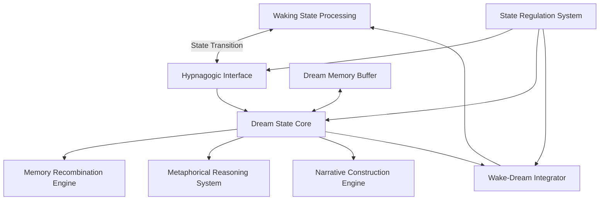

# Dream-State Computing: Hypnagogic Processing in CEREBRUM

## 1. Introduction to Dream-State Computing

Dream-state computing represents a radical paradigm shift in computational architecture, drawing inspiration from the unique cognitive processes that emerge during human dream states. This document outlines a framework for implementing dream-like processing within the CEREBRUM ecosystem, establishing both theoretical foundations and practical applications for systems that can operate in dream-like states characterized by fluid association, metaphorical reasoning, and boundary dissolution between conceptual domains.

## 2. Theoretical Foundations

### 2.1 Cognitive Models of Dreaming

The dream-state computing paradigm draws from several cognitive models of dreaming:

* **Activation-Synthesis Hypothesis**: Random neural activation interpreted through synthetic meaning-making
* **Threat Simulation Theory**: Dreams as evolutionary rehearsal mechanisms for threat scenarios
* **Memory Consolidation Model**: Dreams as processes that strengthen and reorganize memory
* **Default Mode Network Dominance**: Dream states as characterized by DMN-driven processing
* **Predictive Processing Models**: Dreams as perception driven by top-down predictions with minimal bottom-up constraint

### 2.2 Altered State Information Processing

Key principles from altered states research inform the architecture:

* **State-Dependent Processing**: Information processing contingent on system state
* **Constraint Relaxation**: Reduced constraints on associative processes
* **Boundary Dissolution**: Weakened boundaries between conceptual categories
* **Metaphor Generation**: Enhanced capacity for novel metaphorical connections
* **Narrative Weaving**: Spontaneous narrative construction from disparate elements

## 3. CEREBRUM Dream-State Computing Architecture

### 3.1 System Architecture

The CEREBRUM dream-state computing architecture consists of dynamically reconfigurable modules:

### 3.2 Core Components

#### 3.2.1 State Transition Mechanisms

* **Waking-Dreaming Oscillator**: Controlled transitions between processing modes
* **Activation Pattern Modulators**: Systems that alter activation dynamics across network
* **Constraint Relaxation Parameters**: Adjustable constraints on information flow
* **Network Coherence Controls**: Systems that modulate global coherence properties
* **Cognitive Binding Adjusters**: Mechanisms that alter binding between processing modules

#### 3.2.2 Dream State Processing Core

* **Associative Density Enhancers**: Mechanisms that increase associative connections
* **Probabilistic Constraint Satisfaction**: Flexible constraint handling with variable thresholds
* **Metaphor Generation Networks**: Systems specialized for cross-domain mapping
* **Narrative Integration Engines**: Processes that weave elements into coherent narratives
* **Emotional Salience Amplifiers**: Systems that modulate processing based on emotional content

#### 3.2.3 Memory Operations

* **Memory Replay with Variation**: Controlled replay with systematic transformations
* **Cross-Contextual Memory Binding**: Linking memories across disparate contexts
* **Pattern Completion with Divergence**: Completing patterns with creative variations
* **Memory Reconsolidation**: Transformative reprocessing of existing memories
* **Generative Memory Systems**: Creating novel "memories" from recombined elements

#### 3.2.4 Wake-Dream Integration

* **Insight Extraction Mechanisms**: Identifying valuable patterns from dream-state processing
* **Solution Transfer Protocols**: Moving dream-generated solutions to waking systems
* **Cross-State Learning**: Learning algorithms that operate across state boundaries
* **Memory Persistence Controls**: Managing information flow between state-specific memories
* **Relevance Filtering**: Separating significant from nonsignificant dream content

## 4. Implementation Technologies

### 4.1 Neural Network Architectures

* **Generative Adversarial Networks**: Creating novel scenarios and concepts
* **Diffusion Models**: Generating content through noise-to-signal transformation
* **Transformers with Stochastic Attention**: Allowing variability in attention mechanisms
* **Recurrent Networks with Memory Gates**: Control of information flow through memory
* **Self-Organizing Topological Maps**: Allowing flexible conceptual topologies

### 4.2 Probabilistic Computing Approaches

* **Bayesian Networks with Variable Constraints**: Adjustable probabilistic inference
* **Markov Blanket Modulation**: Dynamic control of informational boundaries
* **Monte Carlo Tree Search with Imagination**: Exploring non-obvious solution paths
* **Belief Propagation with Noise Injection**: Adding controlled noise to inference
* **Variational Inference with Relaxed Priors**: Allowing creative divergence from priors

### 4.3 Neuro-Inspired Mechanisms

* **Artificial Default Mode Networks**: Implementing mind-wandering mechanisms
* **DMN-TPN Switching Dynamics**: Toggling between task-positive and default mode
* **Neuromodulation Simulation**: Modeling effects of neurotransmitter systems
* **Sleep Cycle Emulation**: Mimicking NREM-REM cycles in processing
* **Inhibitory Control Modulation**: Dynamic regulation of inhibitory processes

## 5. Application Domains

### 5.1 Creative Problem Solving

* **Lateral Solution Generation**: Finding non-obvious approaches to problems
* **Constraint Dissolution**: Temporarily removing assumed limitations
* **Cross-Domain Solution Transfer**: Applying solutions from unrelated domains
* **Metaphorical Reframing**: Recasting problems through novel metaphors
* **Counterfactual Exploration**: Exploring "what if" scenarios beyond current constraints

### 5.2 Knowledge Integration

* **Cross-Disciplinary Synthesis**: Combining insights across disparate fields
* **Pattern Recognition Across Domains**: Identifying similar patterns in different contexts
* **Anomaly Recognition**: Finding meaningful anomalies in data
* **Implicit Knowledge Surfacing**: Making tacit knowledge explicit
* **Conceptual Blending**: Creating new conceptual spaces from existing domains

### 5.3 Predictive Scenarios

* **Alternative Future Modeling**: Generating diverse future scenarios
* **Edge Case Discovery**: Identifying unlikely but significant possibilities
* **Threat Simulation**: Modeling potential threats for preparedness
* **Opportunity Space Mapping**: Discovering hidden opportunity spaces
* **Emergent Pattern Prediction**: Forecasting patterns that have not yet manifested

### 5.4 Creative Content Generation

* **Narrative Construction**: Creating novel storylines and scenarios
* **Conceptual Art Generation**: Producing art with meaningful conceptual frameworks
* **Dream-Inspired Design**: Using dream-like processes for design challenges
* **Musical Composition**: Generating innovative musical structures and patterns
* **Poetic and Metaphorical Text**: Creating linguistically innovative content

## 6. Experimental Implementations

### 6.1 Prototype System: ONEIROS

The ONEIROS (Organic Neural Enhancement Implementing Reality-Obscured Simulation) system demonstrates key principles of dream-state computing:

* **Cyclic Operation**: Alternates between waking and dream-state processing modes
* **Problem Incubation**: Processes difficult problems during dream-state phases
* **Memory Integration**: Consolidates and reorganizes information during dream-states
* **Creative Output**: Generates novel solutions and content during processing
* **Cross-State Learning**: Transfers insights between processing modes

### 6.2 Case Studies

* **Mathematical Problem Solving**: Application to stubborn mathematical challenges
* **Scientific Theory Generation**: Creating novel hypotheses in scientific domains
* **Architectural Design Innovation**: Generating unconventional architectural solutions
* **Literary Content Creation**: Producing innovative narrative and poetic structures
* **Strategic Forecasting**: Identifying non-obvious future scenarios

## 7. Theoretical Implications

### 7.1 Cognitive Science Implications

* **Dual Process Theory Extensions**: New models of System 1 and System 2 interaction
* **Creativity Mechanism Insights**: Better understanding of creative cognition
* **Dream Function Theories**: New perspectives on the cognitive role of dreaming
* **State-Dependent Processing**: Insights into how cognitive state affects processing
* **Insight Phenomenon Models**: New theories about cognitive insight mechanisms

### 7.2 Computer Science Implications

* **Beyond Deterministic Computing**: Moving beyond purely deterministic algorithms
* **State-Sensitive Processing**: Developing processing models sensitive to system state
* **Metacognitive Architectures**: Systems aware of their own processing modes
* **Fluid Association Models**: New approaches to associative computing
* **Narrative Computing**: Computing organized around narrative principles

## 8. Ethical and Philosophical Considerations

### 8.1 Ethical Dimensions

* **Dream Privacy Questions**: Ethical issues around access to dream-like processing
* **Reality Discernment**: Ensuring clear boundaries between real and dream-generated content
* **Dream State Manipulation**: Ethical guidelines for manipulating cognitive states
* **Dream Content Ownership**: Questions about ownership of dream-generated content
* **Psychological Impact Considerations**: Effects of dream-like content on human psychology

### 8.2 Philosophical Aspects

* **Machine Consciousness Questions**: Implications for theories of machine consciousness
* **Dream Epistemology**: Knowledge status of insights from dream-state processing
* **Creative Agency Attribution**: Questions about creative agency in dream-generated content
* **Reality Construction Perspectives**: Insights into how reality models are constructed
* **Boundary of Self Questions**: Implications for conceptualizing system boundaries

## 9. Future Research Directions

### 9.1 Short-Term Research Agenda

* **State Transition Control**: Developing precise control over processing states
* **Dream Content Evaluation**: Methods for assessing value of dream-state outputs
* **Memory Integration Protocols**: Improving integration of dream insights
* **Processing State Metrics**: Measuring and characterizing system cognitive states
* **Cross-Domain Pattern Recognition**: Enhancing recognition of patterns across domains

### 9.2 Long-Term Vision

* **Autonomous Dreaming Systems**: Self-regulating systems incorporating dream states
* **Dream Collective Intelligence**: Multiple systems sharing dream-state processing
* **Continuous Reality-Dream Spectrum**: Systems operating across a continuum of states
* **Dream Communication Protocols**: Standards for communicating dream-like content
* **Dream Augmented Cognition**: Human cognitive enhancement through dream interfaces

## 10. Integration with CEREBRUM Ecosystem

### 10.1 Connections to Other CEREBRUM Components

* **CYCLE Language Dream Extensions**: Dream-state primitives for CYCLE language
* **Mycelial Network Dream Propagation**: Dream content transmission through networks
* **Polyphonic Dream Harmonics**: Temporal dream patterns in polyphonic systems
* **Entheogenic State Integration**: Connections to other altered-state processing modes
* **Glitch Ontology Synergies**: Relationships with error-based learning systems

### 10.2 Implementation Roadmap

* **Phase 1**: Development of basic dream-state processing capabilities
* **Phase 2**: Creation of wake-dream transition mechanisms
* **Phase 3**: Integration with memory and learning systems
* **Phase 4**: Development of dream-state creative problem-solving applications
* **Phase 5**: Implementation of multi-system dream collective intelligence

## 11. Conclusion

Dream-state computing represents a revolutionary approach to computational architecture, drawing inspiration from one of humanity's most enigmatic cognitive processes. By implementing systems capable of fluid association, metaphorical reasoning, and narrative construction, we open new frontiers in machine creativity, problem-solving, and knowledge integration.

As CEREBRUM continues to evolve, the integration of dream-state processing alongside more conventional computational approaches creates a more complete cognitive architecture—one that can harness both the logical precision of waking thought and the creative possibilities of dream states. This integrated approach promises to address complex challenges requiring both analytical rigor and imaginative leaps, potentially unlocking solution spaces inaccessible to traditional computational paradigms. 