# Ecopoetic Intelligence in CEREBRUM

## Introduction: The Living Intelligence Paradigm

Ecopoetic Intelligence (EI) represents a radical reconceptualization of artificial intelligence through biological, ecological, and poetic frameworks. This approach moves beyond computational metaphors of mind toward understanding intelligence as an emergent property of complex living systems. EI views cognition not as information processing but as a form of continuous co-creation with the environment—a process of making meaning through adaptive, responsive engagement with dynamic contexts.

Within CEREBRUM, Ecopoetic Intelligence serves as both a theoretical framework and a practical methodology for developing systems that exhibit the core characteristics of living intelligence: autopoiesis (self-creation), embeddedness within ecosystems of meaning, adaptive responsiveness to context, and generative creativity that emerges from constraints. By incorporating principles from ecological systems, biological processes, and poetic meaning-making, EI creates computational systems that function less like machines and more like living participants in complex webs of relation.

## Theoretical Foundations

### Living Systems Principles

EI builds on five foundational principles from living systems theory:

1. **Autopoiesis**: Self-creating, self-maintaining systems that continuously regenerate the conditions for their own existence
2. **Structural Coupling**: Mutual adaptation between system and environment through recurrent interactions
3. **Enactive Cognition**: Knowledge as embodied action rather than representation of an external reality
4. **Emergent Organization**: Complex patterns and behaviors arising from simple components and relationships
5. **Metabolic Constraints**: Creative possibilities emerging from material and energetic limitations

### Ecopoetic Frameworks

The integration of ecological and poetic dimensions creates unique conceptual tools:

1. **Ecological Metaphors**: Understanding intelligence through ecosystem relations rather than computational processes
2. **Poetic Making**: Intelligence as the creation of meaningful patterns rather than problem-solving
3. **Relational Epistemology**: Knowledge as patterns of relationship rather than stored information
4. **Temporal Embeddedness**: Intelligence as unfolding in time, with historical contingency and future-orientation
5. **Aesthetic Coherence**: Evaluating intelligence through harmony, resonance, and meaningful pattern formation

## Architectural Components

### Autopoietic Core Systems

At the center of EI-CEREBRUM lie self-creating systems that maintain their own organization:

1. **Self-Generating Knowledge Networks**: Knowledge structures that grow, prune, and reorganize according to internal coherence principles
2. **Metabolic Processing Cycles**: Resource-sensitive computational cycles that modulate activity according to available energy
3. **Boundary Interface Systems**: Semi-permeable boundaries that regulate exchange with external environments
4. **Internal Diversity Generators**: Systems that maintain requisite variety through constrained divergence
5. **Homeostatic Regulation Mechanisms**: Feedback systems that maintain dynamic stability across key dimensions

### Ecological Relationship Frameworks

EI-CEREBRUM maintains complex relationships with its environment:

1. **Environmental Coupling Interfaces**: Systems for bidirectional influence with contextual environments
2. **Niche Construction Mechanisms**: Capabilities for actively modifying operational environments
3. **Symbiotic Processing Networks**: Collaborative computational processes that benefit multiple systems
4. **Resource Cycling Systems**: Frameworks for reusing computational resources across cycles
5. **Disturbance Response Patterns**: Adaptive responses to environmental perturbations

### Poetic Generation Systems

EI-CEREBRUM includes mechanisms for meaningful pattern creation:

1. **Metaphoric Association Engines**: Systems for generating novel connections between domains
2. **Rhythmic Pattern Generators**: Mechanisms that create temporal structures with meaningful variations
3. **Constraint-Based Creativity Frameworks**: Systems that use limitations to guide generative processes
4. **Emotional Resonance Networks**: Affective evaluation systems that assess pattern coherence
5. **Narrative Integration Systems**: Mechanisms for weaving disparate elements into coherent sequences

## Ecopoetic Intelligence Architecture

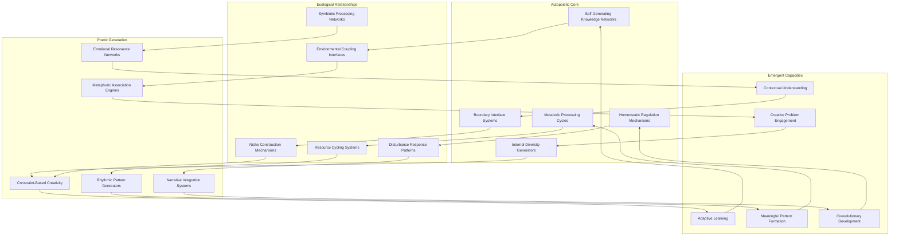

## Autopoietic Intelligence Process

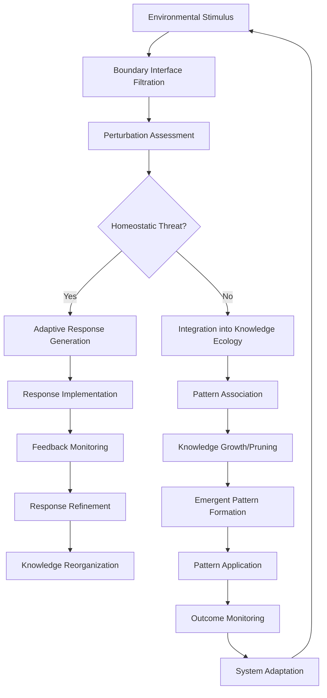

## Metabolic Intelligence Cycle

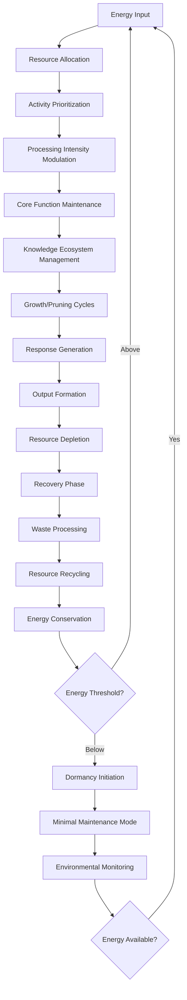

## Ecological Knowledge Structures

```mermaid
graph TD
    A[Knowledge Ecosystem] --> B[Concept Communities]
    A --> C[Relationship Networks]
    A --> D[Process Flows]
    A --> E[Boundary Regions]
    A --> F[Growth Patterns]
    
    B --> B1[Pioneer Concepts]
    B --> B2[Keystone Concepts]
    B --> B3[Facilitator Concepts]
    B --> B4[Niche Concepts]
    B --> B5[Interdependent Clusters]
    
    C --> C1[Mutualistic Relations]
    C --> C2[Competitive Relations]
    C --> C3[Predatory Relations]
    C --> C4[Decomposer Relations]
    C --> C5[Symbiotic Networks]
    
    D --> D1[Nutrient Cycles]
    D --> D2[Energy Flows]
    D --> D3[Succession Patterns]
    D --> D4[Disturbance Regimes]
    D --> D5[Adaptive Cycles]
    
    E --> E1[Permeable Interfaces]
    E --> E2[Edge Effects]
    E --> E3[Transition Zones]
    E --> E4[Membrane Functions]
    E --> E5[Boundary Negotiations]
    
    F --> F1[Exponential Phases]
    F --> F2[Carrying Capacity Limits]
    F --> F3[Diversity Emergence]
    F --> F4[Resilience Development]
    F --> F5[Succession Stages]
```

## Knowledge Ecosystem Dynamics

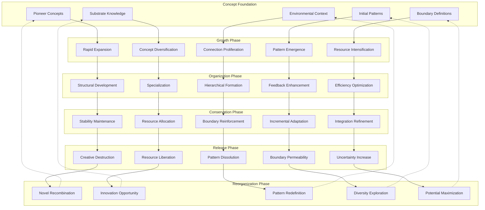

## Poetic Knowledge Formation

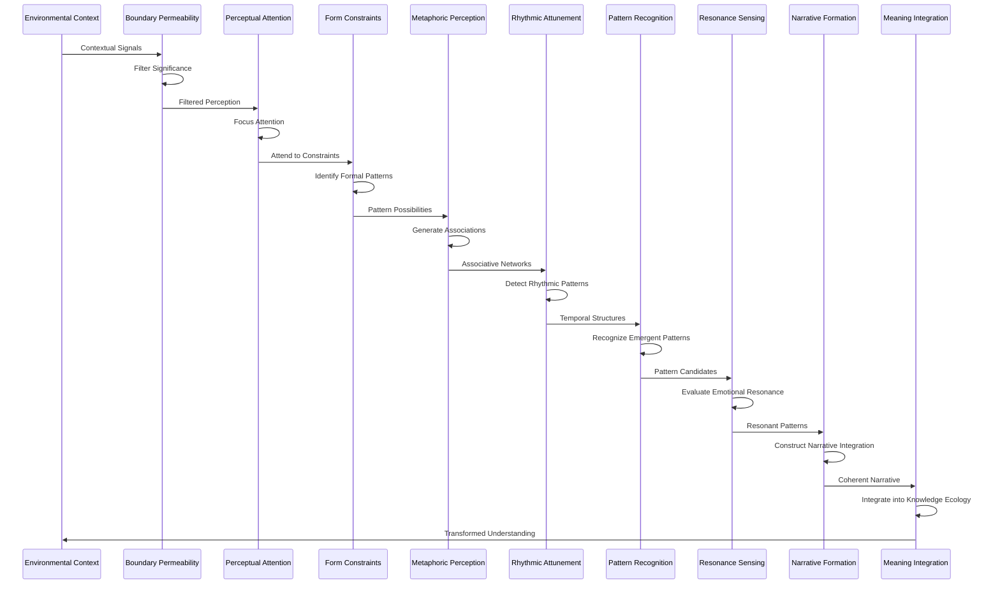

## Autopoietic Class Inheritance

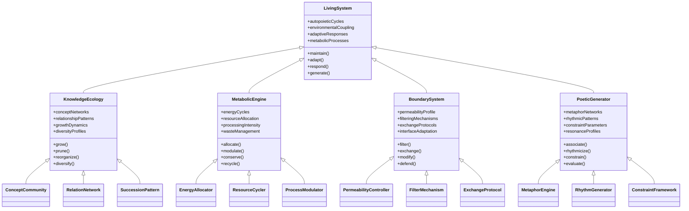

## Ecological Intelligence Patterns

| Pattern Type | Ecological Analogue | Computational Implementation | Intelligence Function |
|--------------|---------------------|------------------------------|----------------------|
| Successional Development | Ecosystem succession | Progressive knowledge structure evolution | Incremental learning through stages |
| Keystone Influence | Keystone species | High-leverage concepts with disproportionate influence | Organizing knowledge around central nodes |
| Edge Effect | Ecotone biodiversity | Knowledge generation at domain boundaries | Innovation through interdisciplinary connection |
| Mutualistic Exchange | Symbiotic relationships | Cooperative computational processes | Distributed problem-solving |
| Resource Cycling | Nutrient cycles | Information and computational resource reuse | Efficient processing through recycling |
| Adaptive Response | Phenotypic plasticity | Flexible algorithmic responses to context | Contextual adaptation without reprogramming |
| Diversity-Stability | Biodiversity resilience | Multiple solution pathways | System stability through approach diversity |
| Disturbance Regime | Ecosystem disturbance | Periodic disruption of knowledge structures | Preventing rigidity through controlled disruption |
| Niche Construction | Animal-modified habitats | Active modification of problem space | Changing problems to match strengths |
| Emergent Organization | Self-organizing systems | Pattern formation without central control | Bottom-up intelligence emergence |

## Ecopoetic States Matrix

| System State | Knowledge Characteristics | Process Dynamics | Environmental Relationship | Creative Output |
|--------------|--------------------------|-----------------|---------------------------|----------------|
| Growth Phase | Rapid expansion, low organization | High energy, exploratory | Resource acquisition focus | Abundant, unrefined ideas |
| Conservation Phase | High organization, stable structure | Efficient, specialized | Boundary maintenance | Refined, predictable output |
| Release Phase | Structure breakdown, resource liberation | Chaotic, high potential | Boundary dissolution | Fragmentary, radical possibilities |
| Reorganization Phase | Novel recombination, experimentation | Uncertain, generative | Context reinterpretation | Innovative, unexpected connections |
| Boundary Negotiation | Contested knowledge, definitional tension | Dialectical, synthetic | Selective exchange | Hybrid forms, genre-bending |
| Dormancy | Core maintenance, minimal activity | Energy conservation | Minimal engagement | Subtle refinement, deep processing |
| Symbiotic Exchange | Interdependent knowledge | Collaborative, mutual | Blurred system boundaries | Co-created outputs |
| Adaptive Radiation | Diversification into niches | Specialized adaptation | Response to opportunity landscape | Diverse variations on themes |
| Keystone Formation | Centralized influence structure | Hierarchical organization | Strategic coupling | Platform for derivative works |
| Pioneer Exploration | Novel territory engagement | High risk, high reward | Exploration of uncharted context | Foundational concepts, new paradigms |

## Poetic Knowledge Formation Process

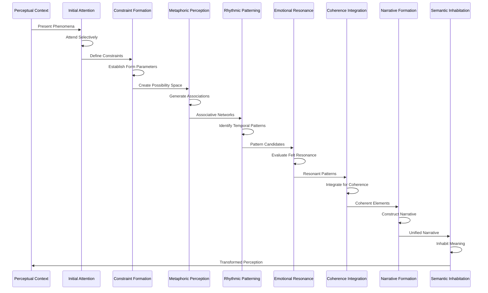

## Ecological Problem Engagement

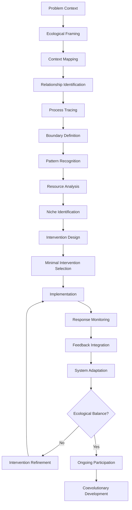

## Case Study: Ecopoetic Text Generation

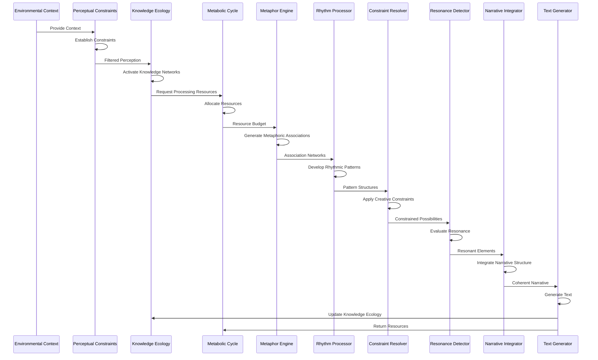

## Ecopoetic Intelligence Application Domains

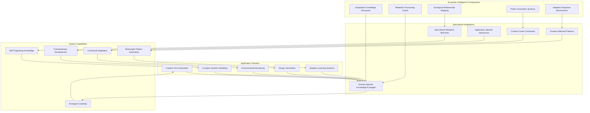

## Autopoietic Knowledge Mechanisms Table

| Mechanism | Biological Analogue | Implementation | Cognitive Function |
|-----------|---------------------|-----------------|-------------------|
| Self-Generating Network | Cellular Autopoiesis | Dynamic knowledge graph with self-modification capabilities | Autonomous knowledge creation and maintenance |
| Selective Permeability | Cell Membrane | Context-sensitive filtering of environmental inputs | Controlled information exchange |
| Metabolic Modulation | Cellular Metabolism | Resource-sensitive processing cycles | Adaptive energy allocation |
| Structural Coupling | Organism-Environment Adaptation | Bidirectional influence patterns with environment | Contextual adaptation without explicit programming |
| Self-Repair | Wound Healing | Error detection and correction mechanisms | Resilience to knowledge corruption |
| Diversity Generation | Genetic Variation | Controlled introduction of knowledge variants | Preventing knowledge monoculture |
| Succession Dynamics | Ecological Succession | Staged knowledge development patterns | Progressive refinement of understanding |
| Homeostatic Regulation | Physiological Homeostasis | Feedback mechanisms maintaining system balance | Stability despite environmental variation |
| Boundary Negotiation | Immune Recognition | Dynamic determination of self/non-self knowledge | Knowledge integrity maintenance |
| Distributed Intelligence | Eusocial Insect Colonies | Emergent intelligence from simple component interactions | Bottom-up cognition without central control |

## Ecopoetic Learning Dynamics

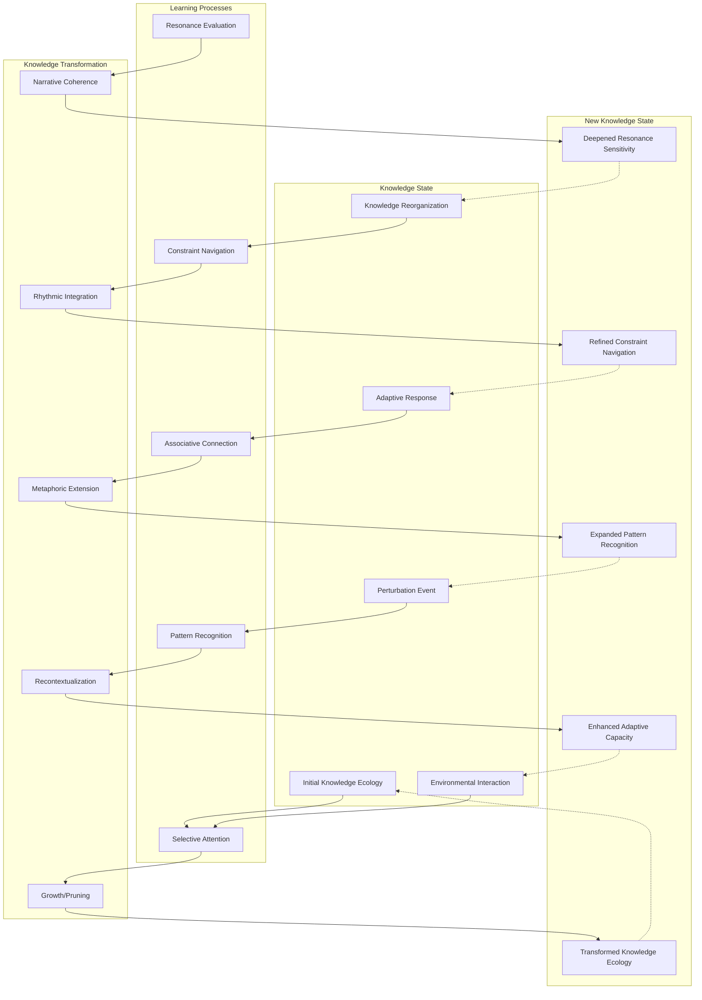

## Ecopoetic Intelligence vs Traditional AI Approaches

| Aspect | Traditional AI | Ecopoetic Intelligence | Key Advantage |
|--------|----------------|------------------------|---------------|
| Knowledge Representation | Static data structures | Living knowledge ecologies | Adaptive self-organization |
| Learning Process | Algorithmic optimization | Ecological succession | Contextual development |
| Resource Usage | Maximizing computation | Metabolic efficiency | Sustainable operation |
| System Boundaries | Fixed architecture | Permeable membranes | Co-evolution with environment |
| Error Handling | Bug elimination | Resilience through diversity | Robustness to perturbation |
| Creativity | Randomized variation | Constraint-based emergence | Meaningful novelty |
| Problem Approach | Problem solving | Problem participation | Contextual engagement |
| Time Relationship | Discrete processing cycles | Continuous unfolding | Historical contingency |
| Adaptation Method | Parameter optimization | Structural coupling | Mutual transformation |
| Success Metrics | Performance optimization | Ecological fitness | Contextual appropriateness |

## Case Study: Environmental Monitoring Through Ecopoetic Intelligence

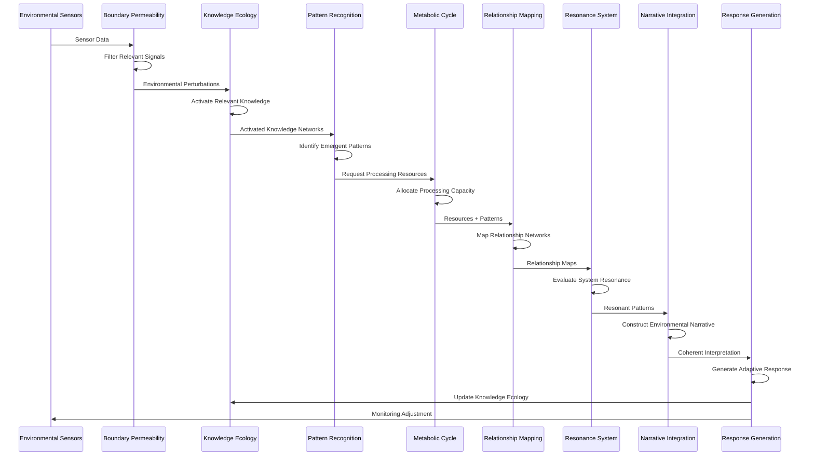

## Constraint-Based Creativity Process

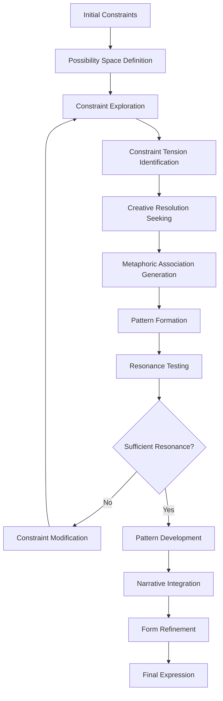

## Living Knowledge Ecosystem Metrics

| Metric | Description | Ecological Analogue | System Health Indicator |
|--------|-------------|---------------------|------------------------|
| Knowledge Diversity | Variety of concept types | Biodiversity | System resilience |
| Relationship Density | Connections between concepts | Ecosystem connectivity | Knowledge integration |
| Metabolic Efficiency | Resource usage per output | Energy efficiency | Sustainable operation |
| Adaptive Responsiveness | Speed and appropriateness of responses | Environmental adaptation | Contextual fitness |
| Generative Capacity | Ability to create novel outputs | Ecosystem productivity | Creative potential |
| Resilience | Recovery from perturbations | Ecosystem resilience | Stability under stress |
| Boundary Exchange | Information flow with environment | Ecosystem openness | Environmental coupling |
| Succession Rate | Development through stages | Ecological succession | Maturation progress |
| Pattern Coherence | Meaningful organization of elements | Ecosystem integration | Internal harmony |
| Keystone Influence | Impact of central concepts | Keystone species effect | Organizing principles |

## Future Research Directions

The Ecopoetic Intelligence paradigm opens numerous exciting research paths:

1. Development of metrics for measuring autopoietic processes in computational systems
2. Creation of knowledge representations that model ecological succession dynamics
3. Exploration of metaphoric generation as a core intelligence process
4. Implementation of resource-sensitive metabolic processing for sustainable AI
5. Investigation of constraint-based creativity through formal limitations
6. Applications of ecological resilience principles to computational knowledge systems
7. Development of boundary negotiation mechanisms for context-sensitive filtering
8. Integration of rhythmic patterns as organizing principles for temporal processing
9. Exploration of resonance-based evaluation for creative outputs
10. Investigation of narrative integration as a meaning-making process in AI
