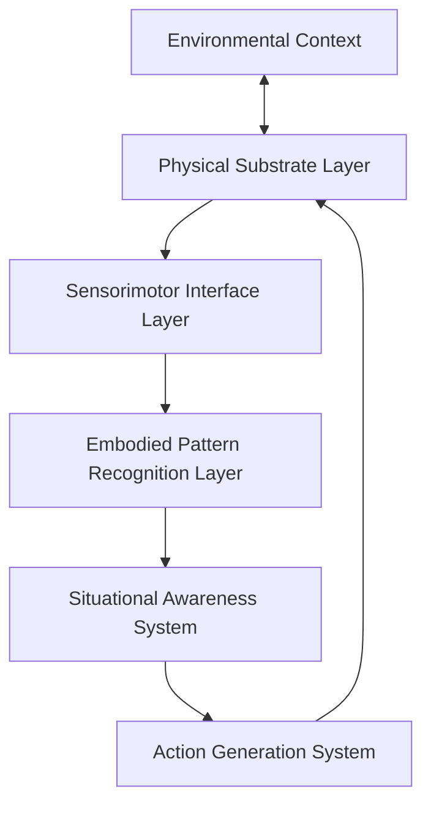

# Embodied Cognition & Physical Computing Paradigms: CEREBRUM Integration

## 1. Introduction to Embodied Intelligence

Embodied cognition rejects the Cartesian separation of mind and body, instead arguing that cognitive processes emerge from bodily interactions with the environment. This document explores a computational architecture that implements embodied cognition principles within CEREBRUM, developing a framework where intelligence emerges from physically-situated computational processes.

## 2. Theoretical Foundations

### 2.1 Enactive Cognition Principles

The embodied cognition paradigm draws from several key theoretical frameworks:

* **Sensorimotor Contingency Theory**: Knowledge consists not in representations but in patterns of sensorimotor dependencies
* **Extended Mind Thesis**: Cognitive processes extend beyond the brain to include environmental elements
* **Radical Embodiment**: Cognition emerges from dynamic interactions between brain, body, and world
* **Material Engagement Theory**: Thinking arises from engagement with physical materials and environments
* **Affordance Theory**: Environment offers action possibilities that shape cognitive processes

### 2.2 Physical Substrates as Computational Media

This framework redefines computational media:

* **Material Computation**: Physical materials as computational substrates with inherent processing capabilities
* **Morphological Computation**: Using physical body morphology to offload computational processes
* **Computational Mechanics**: Leveraging mechanical properties of materials for information processing
* **Proprioceptive Computing**: Information processing through bodily movement and position sensing
* **Tactile Computation**: Utilizing touch-based interactions as computational primitives

## 3. CEREBRUM Embodied Computing Architecture

### 3.1 System Architecture

The CEREBRUM embodied computing architecture consists of interconnected layers:

### 3.2 Core Components

#### 3.2.1 Physical Substrate Systems

* **Material-Specific Computational Primitives**: Computational operations defined by material properties
* **Physical Constraint Solvers**: Using material properties to solve constraint problems
* **Morphological Controllers**: Control systems that leverage physical shape dynamics
* **Environmental Coupling Mechanisms**: Systems that directly couple with environmental forces
* **Thermodynamic Computing Units**: Computing through dissipative energy structures

#### 3.2.2 Sensorimotor Interface Layer

* **Proprioceptive Sensors**: Internal state and position sensing networks
* **Multimodal Sensory Integration**: Cross-modal binding of sensory information
* **Action-Perception Binding**: Tight coupling between perception and action systems
* **Calibration Mechanisms**: Self-adjusting sensory systems based on action outcomes
* **Reality Testing Circuits**: Verification of sensory data through active probing

#### 3.2.3 Enactive Learning Systems

* **Sensorimotor Contingency Learning**: Learning the dynamics between sensory changes and motor actions
* **Affordance Detection Mechanisms**: Identifying action possibilities in environmental configurations
* **Body Schema Adaptation**: Dynamic updating of body representation based on interaction
* **Tool Incorporation Processes**: Extending body schema to include tools and instruments
* **Physical Skill Acquisition**: Learning through repeated physical interaction patterns

## 4. Implementation Technologies

### 4.1 Physical Computing Platforms

* **Soft Robotics Integration**: Utilizing compliant materials with embedded computation
* **Programmable Materials**: Materials with embedded computational capabilities
* **Microfluidic Computing**: Computation through controlled fluid dynamics
* **Mechanical Computing Elements**: Using mechanical components as computational units
* **Bio-hybrid Systems**: Integration of biological and synthetic computational components

### 4.2 Sensing Technologies

* **Distributed Sensor Networks**: Extensive sensor arrays distributed throughout physical structure
* **Artificial Proprioception**: Sensing internal configurations and states
* **Force/Pressure Mapping**: Detailed force and pressure distribution sensing
* **Texture Recognition Systems**: Fine-grained texture and material property sensing
* **Kinesthetic Feedback Loops**: Sensors that monitor movement quality and dynamics

### 4.3 Actuation Systems

* **Variable Compliance Actuators**: Actuators that can modify their stiffness
* **Biomimetic Movement Systems**: Actuation systems inspired by biological motion
* **Field-Responsive Materials**: Materials that change properties in response to fields
* **Distributed Micro-actuation**: Networks of small coordinated actuators
* **Morphing Structural Elements**: Components that can reconfigure their physical shape

## 5. Application Domains

### 5.1 Embodied AI Agents

* **Physically-Situated Learning Agents**: Agents that learn through physical world interaction
* **Material Manipulation Specialists**: Systems specialized for physical material engagement
* **Environmental Adaptation Systems**: Agents that reconfigure based on environmental conditions
* **Skilled Movement Performers**: Systems that execute complex physical movements
* **Embodied Creative Systems**: Creativity emerging from physical material engagement

### 5.2 Human-Computer Interaction

* **Tangible Computing Interfaces**: Computing interfaces manipulated through physical objects
* **Whole-Body Interaction Systems**: Systems engaging the full human body
* **Skill Transfer Platforms**: Systems for transferring physical skills between humans
* **Embodied Design Tools**: Design systems engaging physical manipulation
* **Telepresence Embodiment**: Remote physical presence through embodied systems

## 6. Experimental Implementations

### 6.1 Prototype System: TACTUS

The TACTUS (Tactile Actuated Computing Through Unified Substrates) system demonstrates key principles of embodied computing:

* **Material Configuration**: Programmable material substrate with embedded sensing/computation
* **Learning Paradigm**: Acquires skills through repeated physical interaction
* **Application Focus**: Material property recognition and manipulation
* **Evaluation Metrics**: Performance on physical problem-solving tasks
* **Key Findings**: Demonstrates superiority of embodied approach for physical manipulation tasks

### 6.2 Case Studies

* **Material Classification Task**: Identification of materials through interactive exploration
* **Physical Puzzle Solving**: Solving physical constraint problems through embodied computation
* **Skill Acquisition Tracking**: Longitudinal study of physical skill development
* **Environmental Adaptation Study**: Adaptation to changing environmental conditions
* **Human-System Skill Transfer**: Transfer of physical skills between humans and system

## 7. Theoretical Implications

### 7.1 Cognitive Science Implications

* **Extended Mind Validation**: Empirical support for extended cognition theories
* **Representational Minimalism**: Evidence for reduced need for internal representations
* **Perception-Action Integration**: Confirmation of tight coupling between perception and action
* **Situated Knowledge Structures**: Demonstration of knowledge embedded in interaction patterns
* **Emergent Cognitive Phenomena**: Observation of higher cognition emerging from physical interaction

### 7.2 Computer Science Implications

* **Beyond Von Neumann**: Moving beyond traditional computational architectures
* **Computational Material Science**: New field studying computation through material properties
* **Redefined Human-Computer Boundaries**: Blurring distinction between user and system
* **Environmental Computing Resources**: Utilizing environmental properties as computational resources
* **Non-Algorithmic Problem Solving**: Solutions emerging from physical dynamics rather than algorithms

## 8. Ethical and Philosophical Considerations

### 8.1 Embodied Computing Ethics

* **Physical Agency Questions**: Ethical implications of physically-acting systems
* **Environmental Coupling Ethics**: Responsibilities toward environments systems are coupled with
* **Material Resource Utilization**: Ethical use of physical materials in computational systems
* **Safety in Physical Interaction**: Ensuring safe interaction with humans and environments
* **Phenomenological Implications**: Questions about machine experience of physical embodiment

### 8.2 Philosophical Dimensions

* **Heideggerian Technology Relations**: Rethinking human-technology relationships
* **New Materialism Alignment**: Connections to new materialist philosophical frameworks
* **Phenomenology of Embodied AI**: Philosophical analysis of AI embodied experience
* **Merleau-Pontian Technical Extensions**: Extensions of phenomenology of perception
* **Embodied Epistemology**: Knowledge acquisition through physical engagement

## 9. Future Research Directions

### 9.1 Short-Term Research Agenda

* **Material Computation Primitives**: Defining fundamental computational operations in materials
* **Cross-platform Skill Transfer**: Transferring embodied skills across different physical platforms
* **Embodied Abstraction Mechanisms**: How abstract concepts emerge from physical interaction
* **Sensorimotor Contingency Mapping**: Comprehensive mapping of sensor-action relationships
* **Dynamic Body Schema Models**: Models that adapt to changing physical configurations

### 9.2 Long-Term Vision

* **Universal Physical Computing Materials**: Materials with general-purpose computational capabilities
* **Embodied General Intelligence**: General intelligence emerging from physical interaction
* **Material-Environmental Computation**: Computational processes distributed across system and environment
* **Self-Constructing Physical Systems**: Systems that build and modify their own physical structure
* **Phenomenologically-Aligned AI**: AI systems with experience structures paralleling human embodiment

## 10. Integration with CEREBRUM Ecosystem

### 10.1 Connections to Other CEREBRUM Components

* **CYCLE Language Extensions**: Embodied primitives for the CYCLE programming language
* **Mycelial Network Intelligence Integration**: Connecting embodied systems with mycelial communication
* **Polyphonic Time Crystal Synchronization**: Temporal coordination of embodied processes
* **Biomimetic Swarm Intelligence**: Collective behavior in distributed embodied systems
* **Tactile Reasoning Matrix Compatibility**: Interfacing with tactile reasoning systems

### 10.2 Implementation Roadmap

* **Phase 1**: Development of fundamental material computation primitives
* **Phase 2**: Creation of prototypical embodied learning systems
* **Phase 3**: Integration with broader CEREBRUM cognitive architecture
* **Phase 4**: Development of specialized embodied systems for key application domains
* **Phase 5**: Implementation of generalized embodied intelligence frameworks

## 11. Conclusion

The embodied cognition and physical computing paradigm represents a fundamental shift in how we conceptualize computational intelligence. By grounding computation in physical interaction, we create systems that leverage the computational properties inherent in material engagement with the world. This approach opens new horizons for artificial intelligence, human-computer interaction, and cognitive science—establishing a framework where intelligence emerges not from abstract symbol manipulation but from the dynamic dance between computational systems and their physical environments.

As CEREBRUM continues to evolve, this embodied foundation will provide critical capabilities for systems that must interact with, understand, and manipulate the physical world with the sophistication and adaptability previously only seen in biological organisms. 