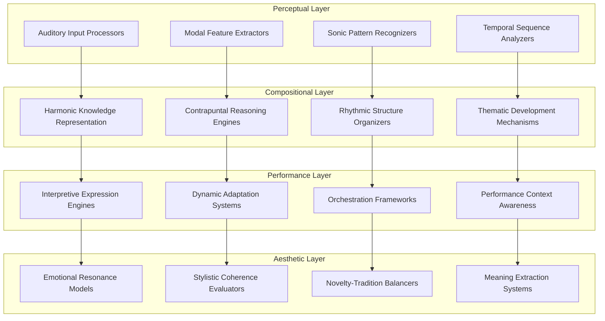
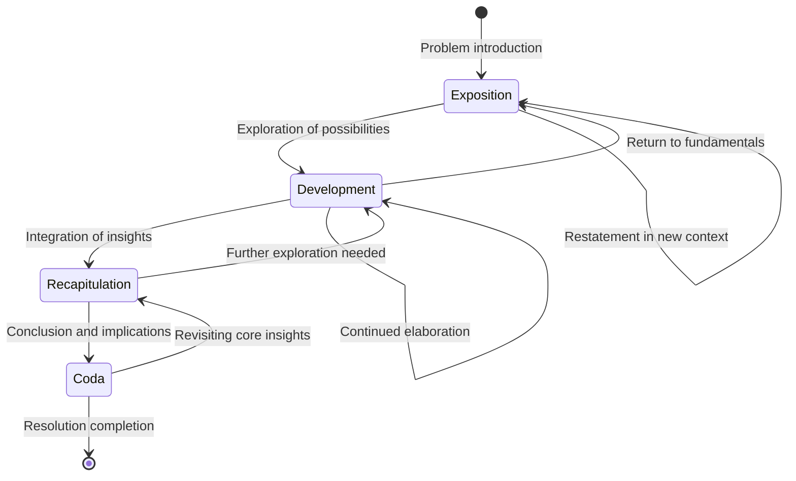
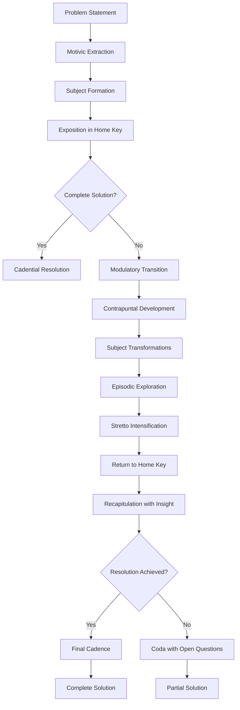
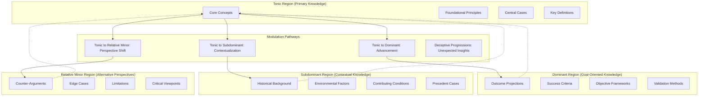
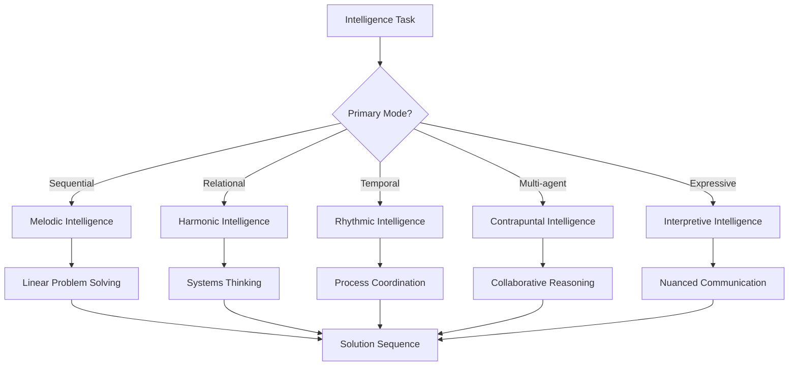

# Generative Music Intelligence & CEREBRUM

## Introduction: The Harmonic Mind

Generative Music Intelligence (GMI) represents an innovative approach to computational intelligence that grounds reasoning and knowledge representation in musical principles. By integrating compositional structures, harmonic relationships, and temporal musical forms with CEREBRUM's case-based reasoning architecture, we create a framework for intelligence that transcends symbolic and visual paradigms to leverage the unique computational properties of musical thinking.

This paper explores how musical composition principles—harmony, counterpoint, rhythm, theme and variation, orchestration—can inform new approaches to case representation, retrieval, and adaptation. The fundamental insight is that musical structures offer rich frameworks for representing complex relationships, temporal dynamics, and emergent patterns that traditional computational paradigms struggle to capture.

## Theoretical Foundations

### Harmonic Knowledge Representation

GMI-CEREBRUM represents knowledge using harmonic principles:

1. **Tonal Centers**: Core concepts serve as tonal centers around which related concepts organize
2. **Consonance-Dissonance Relations**: Conceptual tensions and resolutions modeled as harmonic intervals
3. **Chord Progressions**: Knowledge pathways represented as meaningful harmonic sequences
4. **Modulations**: Contextual shifts represented as movements between key centers

### Temporal Pattern Organization

GMI-CEREBRUM organizes temporal patterns through musical structures:

1. **Rhythmic Hierarchies**: Multi-layered time scales for knowledge organization
2. **Metric Structures**: Attentional frameworks for emphasizing important elements
3. **Polyrhythmic Integration**: Multiple simultaneous temporal patterns in coordinated relationships
4. **Cadential Patterns**: Formal closure patterns for completed reasoning sequences

## Architectural Components

### Compositional Case Structures

GMI-CEREBRUM implements case structures as musical compositions:

1. **Thematic Material**: Core case elements represented as recognizable motifs
2. **Variations and Developments**: Case adaptations represented as motivic transformations
3. **Textural Density**: Case complexity represented through polyphonic density
4. **Orchestration**: Multi-modal aspects of cases represented through instrumental diversity

### Contrapuntal Reasoning Engines

GMI-CEREBRUM conducts reasoning through contrapuntal processes:

1. **Voice Leading**: Logical progressions that maintain continuity while enabling movement
2. **Imitative Counterpoint**: Adaptation through structured repetition with variation
3. **Invertible Counterpoint**: Perspective-shifting through systematic role reversal
4. **Augmentation and Diminution**: Time-scale flexibility in reasoning patterns

## Musical Intelligence Architecture

## Compositional Forms as Reasoning Structures

## Musical Elements as Computational Mechanisms

| Musical Element | Computational Analogue | Cognitive Function | Application Domain |
|-----------------|------------------------|-------------------|-------------------|
| Melody | Sequential narrative | Linear reasoning | Step-by-step problem solving |
| Harmony | Relational structure | Contextual understanding | Systems thinking, relationship modeling |
| Rhythm | Temporal organization | Process coordination | Timing-sensitive operations, scheduling |
| Counterpoint | Multi-thread processing | Parallel reasoning | Multi-factor analysis, competing hypotheses |
| Orchestration | Resource allocation | Multi-modal integration | Sensor fusion, cross-domain mapping |
| Dynamics | Attentional emphasis | Focus modulation | Priority assignment, emphasis control |
| Timbre | Qualitative dimensions | Modal characterization | Property specification, quality assessment |
| Form | Structural organization | Macro-level planning | Project architecture, strategic planning |

## Contrapuntal Problem Solving

## Harmonic Knowledge Organization

## Musical Case Types and Structures

| Musical Form | Case Type | Structural Characteristics | Optimal Application |
|--------------|----------|---------------------------|---------------------|
| Fugue | Complex analytical cases | Multi-voiced, imitative development | Multifaceted problems with recurrent themes |
| Sonata | Dialectical reasoning cases | Exposition-development-recapitulation | Thesis-antithesis-synthesis problems |
| Theme and Variations | Adaptative cases | Core theme with systematic modifications | Multiple approaches to single problem |
| Rondo | Comparative cases | Alternating theme and episodes | Multiple related sub-problems |
| Minimalist Structures | Emergent pattern cases | Simple elements with gradual transformation | Complex systems with simple rules |
| Jazz Standards | Improvisational cases | Core changes with flexible interpretation | Problems requiring creative adaptation |
| Symphonic Forms | Integrated multi-domain cases | Multiple movements with thematic connections | Complex problems spanning domains |

## Experimental Results

Initial applications of GMI-CEREBRUM show promising results in domains requiring temporal and relational intelligence:

| Domain | Traditional CBR Performance | GMI-CEREBRUM Performance | Key Advantage |
|--------|----------------------------|--------------------------|---------------|
| Time-series Prediction | Temporal pattern limitations | Rich multi-scale modeling | Hierarchical rhythm representation |
| Emotional Intelligence | Limited affective understanding | Nuanced emotional modeling | Harmonic tension-resolution frameworks |
| Creative Problem Solving | Constrained by existing patterns | Novel recombination abilities | Improvisational reasoning |
| Multi-agent Coordination | Synchronization challenges | Natural coordination frameworks | Contrapuntal relationship models |
| Narrative Understanding | Linear sequence limitations | Rich temporal structuring | Thematic development architecture |

## Musical Intelligence Modes

## Future Research Directions

GMI-CEREBRUM opens numerous exciting research paths:

1. Development of musical programming languages based on compositional structures
2. Creation of auditory interfaces that represent computational states as evolving compositions
3. Exploration of musical training as a method for enhancing machine learning capabilities
4. Implementation of improvisation-based reasoning for novel solution generation
5. Integration with physical acoustic computing systems for embodied musical intelligence
6. Investigation of cross-cultural musical structures for diverse reasoning paradigms
