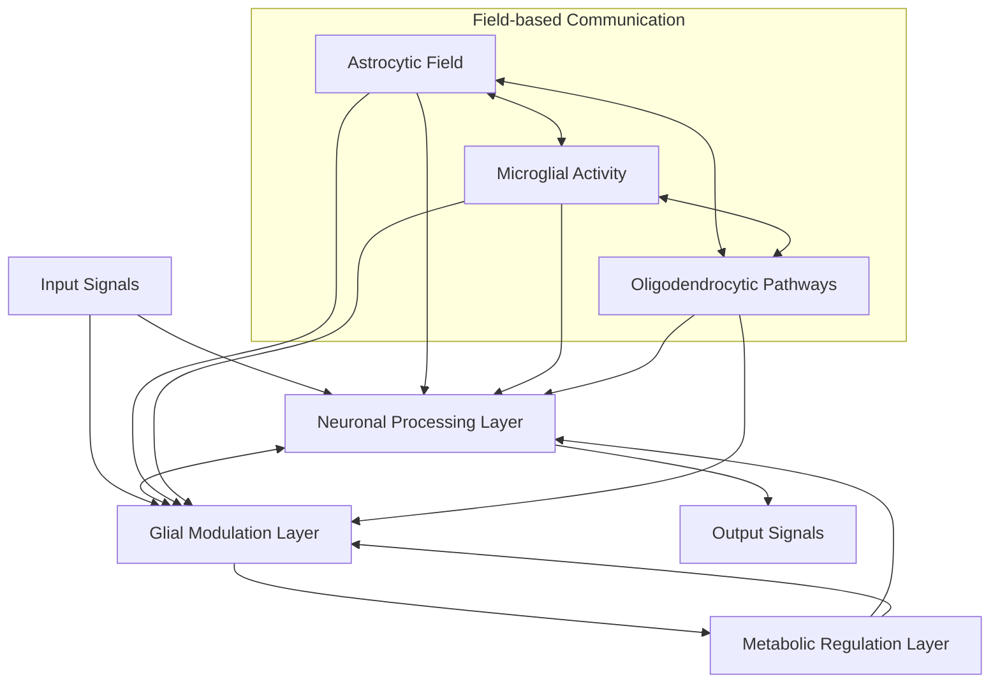
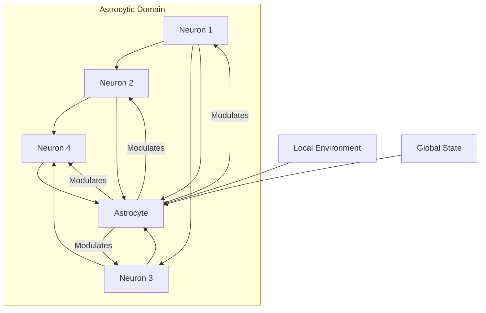
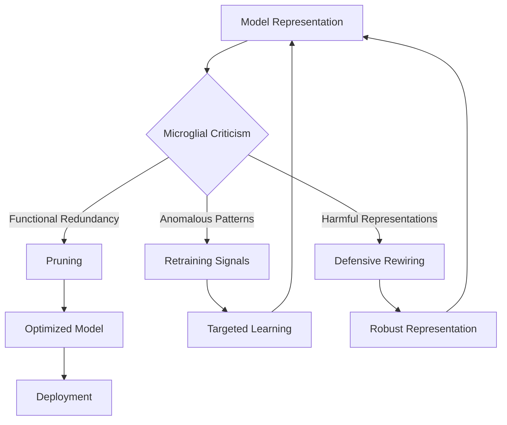
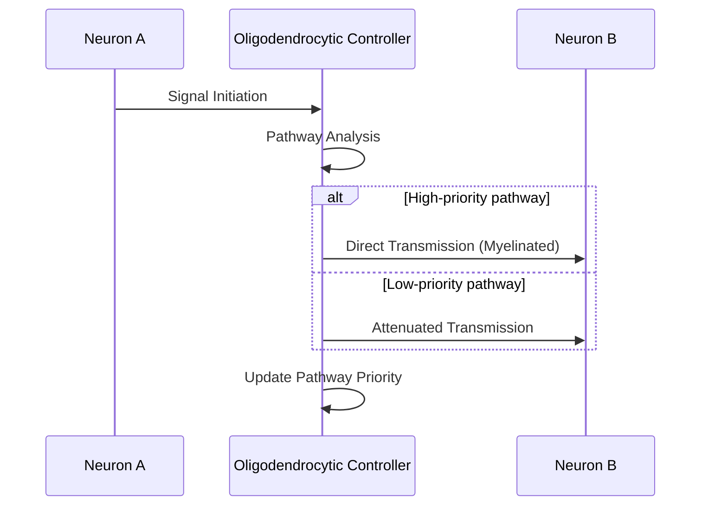
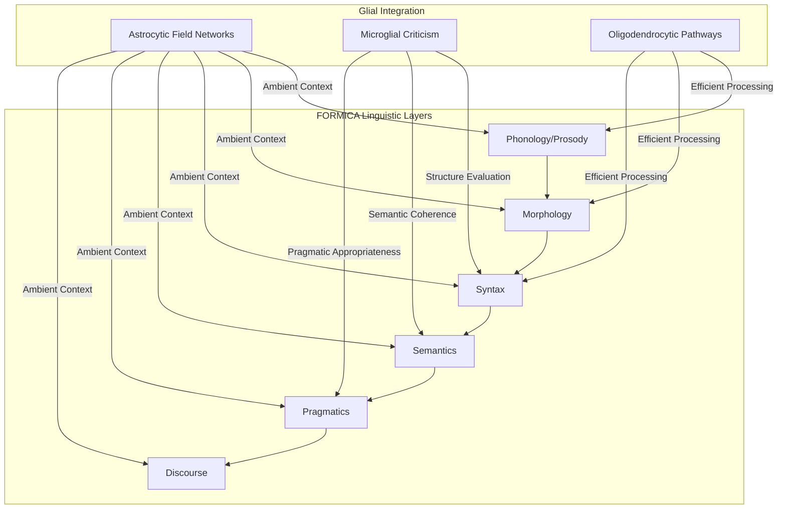
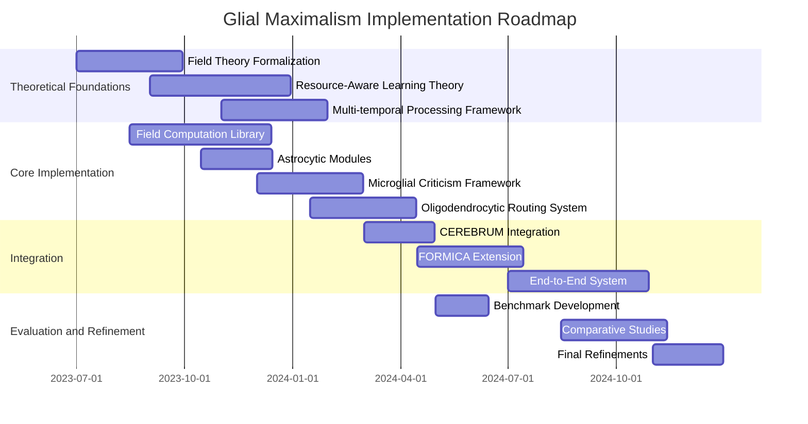

# Glial Maximalism: Beyond Neuronal Primacy in Cognitive Architectures

*For internal discussion only - CEREBRUM/FORMICA working group*

## 1. Introduction: The Overlooked Majority

While conventional artificial intelligence and cognitive modeling have focused almost exclusively on neuron-like computational units and their connections (the "connectionist paradigm"), biological cognition relies on a complex ecosystem where glial cells outnumber neurons by an order of magnitude. These "supporting" cells, far from mere passive scaffolding, actively participate in information processing, homeostasis, and cognitive development.

Glial Maximalism proposes a radical reconceptualization of cognitive architectures by elevating glial-inspired computational mechanisms from supporting roles to first-class citizens in our modeling frameworks. This approach promises to unlock new capabilities and efficiencies impossible within purely neuronal paradigms.

## 2. Core Principles of Glial Maximalism

### 2.1 Theoretical Foundations

Glial Maximalism rests on four foundational shifts in perspective:

1. **Beyond Point-to-Point Communication**: Moving from discrete message-passing between computational units to field-based, ambient, and volumetric information propagation.
2. **Metabolic Intelligence**: Introducing resource allocation, energy budgeting, and metabolic signaling as computational primitives rather than implementation details.
3. **Structural Plasticity**: Dynamically reshaping the computational substrate itself rather than merely adjusting connection weights.
4. **Multi-scale Temporal Processing**: Operating across dramatically different timescales simultaneously, from milliseconds to hours or days.

### 2.2 Glial Archetypes and Computational Analogues

The biological reality of glial cells suggests several distinct computational "archetypes" that can inspire novel architectural elements:

| Glial Type | Biological Function | Computational Analogue | Implementation Strategy |
|------------|---------------------|------------------------|-------------------------|
| Astrocytes | Synaptic modulation, metabolic support, neurovascular coupling | Context-aware parameter regulators, resource allocators | Field-based modulation functions, dynamic sparse attention |
| Oligodendrocytes | Myelination, signal propagation optimization | Adaptive routing infrastructure, signal enhancement | Dynamic topology with transmission properties, lossy-to-lossless transitions |
| Microglia | Immune function, synaptic pruning | Model criticism, representation pruning, adversarial resilience | Gradient-independent evaluation functions, targeted regularization |
| Radial glia | Developmental scaffolding, neuronal migration | Architecture search, meta-optimization | Morphogen-inspired topology generation |
| Satellite glia | Sensory neuron regulation | Input preprocessing, adaptive filtering | Context-sensitive feature transformations |
| Schwann cells | Peripheral signaling optimization | Edge computing, distributed inference | Locality-preserving computation patterns |

## 3. Technical Architecture

### 3.1 Overall Framework

The Glial Maximalism architecture introduces several novel layers within the CEREBRUM/FORMICA framework:



### 3.2 Implementing Astrocytic Computation

Astrocytes in Glial Maximalism function as context-sensitive regulators operating over "neighborhoods" of computational units:



The astrocytic computational unit implements several key functions:

1. **Gain Control**: Dynamic modulation of activation functions based on recent activity patterns
2. **Resource Allocation**: Attention-like mechanisms for enhancing computational resources where needed
3. **Homeostatic Regulation**: Preventing pathological states (vanishing/exploding gradients, representation collapse)
4. **Cross-domain Integration**: Connecting processing across traditionally separated domains (e.g., language and vision)

Implementation in PyTorch pseudo-code:

```python
class AstrocyticModulator(nn.Module):
    def __init__(self, domain_size, sensing_dim, regulation_dim):
        super().__init__()
        self.domain_size = domain_size
        self.sensing = nn.Linear(domain_size, sensing_dim)
        self.regulation = nn.Linear(sensing_dim, regulation_dim)
        self.memory = nn.GRU(regulation_dim, regulation_dim)
        self.modulation = nn.Linear(regulation_dim, domain_size)
        
    def forward(self, neurons, environment, memory_state):
        # Sense local neuron activity
        local_activity = self.sensing(neurons)
        
        # Integrate with environmental signals
        integrated = local_activity * environment
        
        # Update memory state
        regulation, new_memory = self.memory(integrated, memory_state)
        
        # Generate modulation signals
        modulation = self.modulation(regulation)
        
        return neurons * modulation, new_memory
```

### 3.3 Microglial Criticism and Pruning

Unlike conventional optimization processes, microglial functions evaluate representations and processing pathways based on criteria beyond immediate loss reduction:



### 3.4 Oligodendrocytic Pathway Optimization

Myelin-inspired dynamic connectivity implements adaptive signal propagation properties:



## 4. Integration with CEREBRUM/FORMICA

Glial Maximalism naturally extends both CEREBRUM's case-based reasoning and FORMICA's linguistic formalisms by introducing:

1. **Ambient Context Fields**: Replacing discrete context vectors with field-based representations that implicitly capture relationships and influence processing
2. **Metabolic Constraint Modeling**: Adding resource awareness to case retrieval and transformation operations
3. **Multi-scale Temporal Integration**: Processing linguistic phenomena across multiple timescales simultaneously

### 4.1 Enhanced Case-Based Reasoning via Glial Mechanisms

The original CEREBRUM case-based architecture gains significant advantages from Glial Maximalism:

| CEREBRUM Component | Glial Enhancement | Technical Implementation | Benefit |
|-------------------|-------------------|--------------------------|---------|
| Case Representation | Astrocytic field-based context | Continuous attention fields, graph neural fields | More flexible case matching, implicit similarity |
| Bayesian Inference | Oligodendrocytic path optimization | Dynamic Bayesian network routing | Computationally efficient inference |
| Transformation Selection | Microglial criticism | Out-of-distribution detection | More robust transformations |
| Case Storage | Radial glial scaffolding | Dynamic memory architecture | Efficient case organization |
| Case Retrieval | Metabolic-aware search | Resource-constrained attention | Faster retrieval of relevant cases |

### 4.2 FORMICA Extension



## 5. Implementation Strategies

### 5.1 Software Architecture

Implementing Glial Maximalism requires several novel components beyond standard deep learning frameworks:

1. **Field-based Computation Library**: Supporting continuous field representations and operations
2. **Metabolic Signaling Framework**: Tracking and allocating computational resources
3. **Multi-temporal Integration Module**: Coordinating processes across different timescales
4. **Structural Plasticity Engine**: Dynamically modifying computational graphs

### 5.2 Directory Structure

The implementation would extend the existing CEREBRUM/FORMICA structure:

```
src/
├── core/
│   ├── glial/
│   │   ├── astrocytic.py      # Field-based context modulation
│   │   ├── microglial.py      # Criticism and pruning mechanisms
│   │   ├── oligodendrocytic.py # Pathway optimization
│   │   └── metabolic.py       # Resource allocation primitives
│   ├── fields/
│   │   ├── continuous.py      # Continuous field representations
│   │   ├── operations.py      # Field-based operations
│   │   └── encoding.py        # Symbol-to-field encodings
│   └── temporal/
│       ├── multi_scale.py     # Multi-temporal integration
│       └── oscillatory.py     # Oscillatory processing primitives
├── models/
│   ├── glial_networks.py      # Network architectures with glial components
│   └── field_transformers.py  # Field-based transformer variants
└── utils/
    ├── visualization/
    │   └── field_vis.py       # Visualization for field-based computation
    └── metrics/
        └── metabolic_efficiency.py # Resource utilization metrics
```

## 6. Research Challenges and Future Directions

### 6.1 Theoretical Challenges

1. **Field Theory Formalization**: Developing rigorous mathematical frameworks for field-based computation
2. **Resource-Aware Learning Theory**: Extending existing learning theory to incorporate metabolic constraints
3. **Structural Plasticity Optimization**: Creating principled approaches to dynamic architecture modification

### 6.2 Technical Challenges

1. **Computational Efficiency**: Implementing field-based computation without prohibitive computational costs
2. **Training Stability**: Ensuring stable learning dynamics in systems with multi-temporal feedback
3. **Hardware Acceleration**: Developing specialized hardware optimized for glial-inspired computation

### 6.3 Empirical Validation

| Validation Domain | Baseline Comparison | Expected Benefits | Metrics |
|-------------------|---------------------|-------------------|---------|
| Language Understanding | Transformer-only models | Improved context integration, efficiency | Perplexity, inference time, parameter count |
| Continual Learning | Regularization methods | Reduced catastrophic forgetting | Forward/backward transfer, forgetting rate |
| Multi-modal Integration | Cross-attention mechanisms | More natural cross-domain binding | Cross-modal retrieval, fusion quality |
| Resource-constrained Deployment | Pruning/distillation | Dynamic adaptation to available resources | Performance vs. computation tradeoff curves |

## 7. Ethical and Philosophical Implications

### 7.1 Beyond Neuronal Chauvinism

Glial Maximalism challenges the "neuronal chauvinism" prevalent in AI, potentially leading to:

1. More diverse and inclusive models of intelligence
2. Recognition of alternative information processing paradigms
3. Greater emphasis on collective, distributed, and emergent computation

### 7.2 Alignment Implications

The metabolic and criticism mechanisms of Glial Maximalism suggest novel approaches to AI alignment:

1. **Intrinsic Resource Constraints**: Natural limitations preventing computational explosion
2. **Built-in Criticism Mechanisms**: Continuous evaluation of representations and processes
3. **Multi-temporal Alignment**: Aligning behavior across different timescales simultaneously

## 8. Conclusion: Towards A New Paradigm

Glial Maximalism represents not merely an incremental improvement but a paradigm shift in cognitive architecture design. By embracing the full computational richness suggested by neuro-glial biology, we can move beyond the limitations of neuron-centric approaches.

This approach naturally extends and complements the CEREBRUM/FORMICA frameworks, introducing new dimensions of context-sensitivity, resource-awareness, and multi-scale integration. While significant research challenges remain, the potential benefits justify a substantial research program exploring these ideas.

As we move forward in developing next-generation cognitive architectures, the question should not be whether to include glial-inspired mechanisms, but rather how to fully realize their potential for transforming machine intelligence.

## Appendix: Implementation Roadmap

