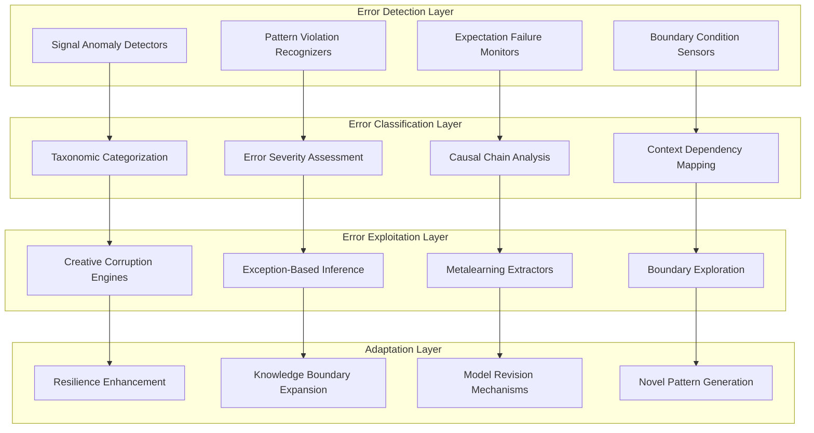
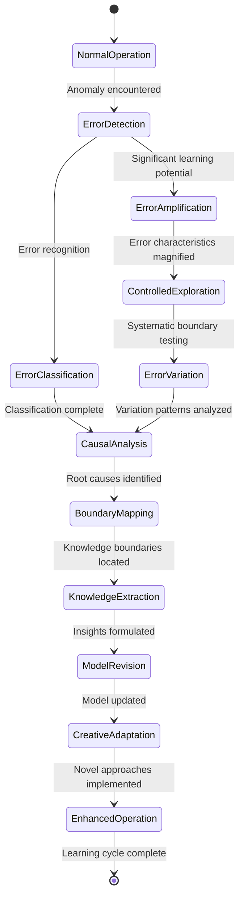
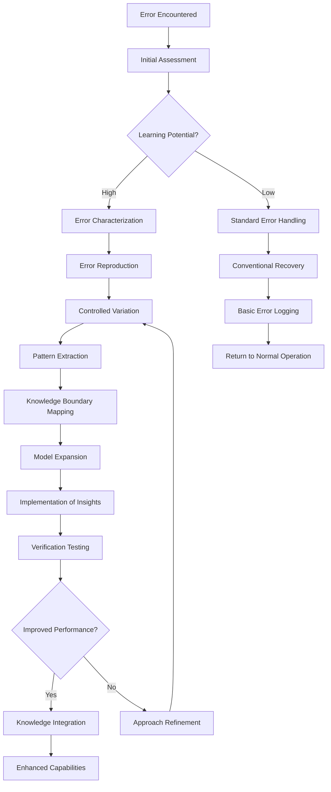
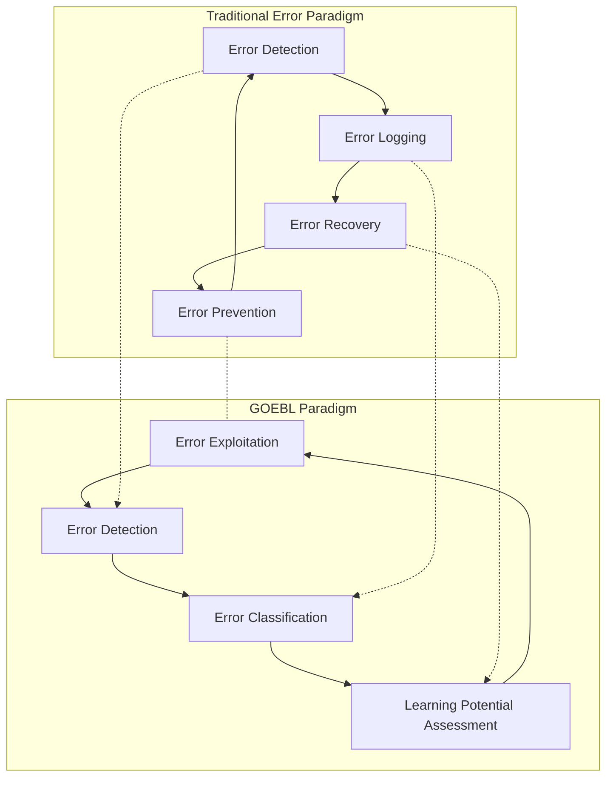
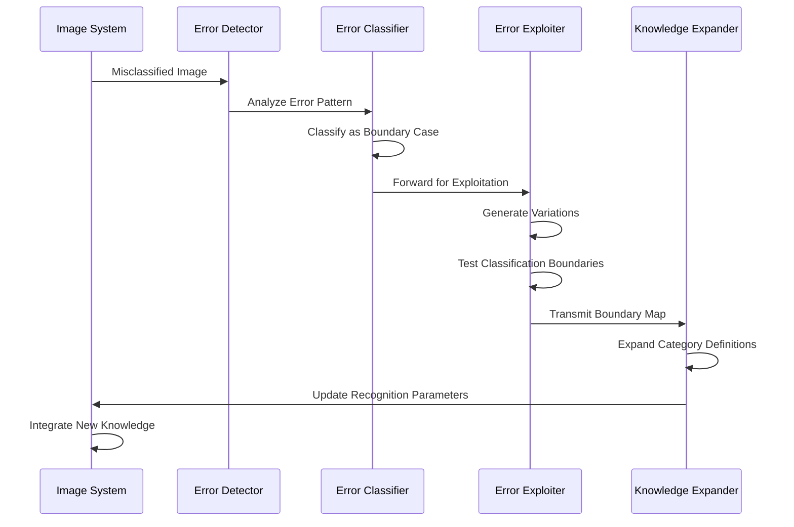
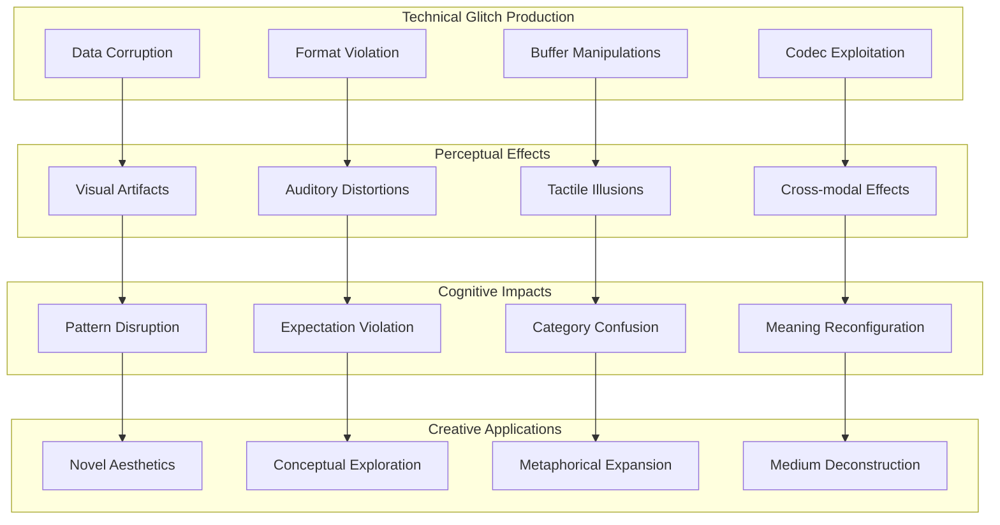

# Glitch Ontology & Error-Based Learning CEREBRUM

## Introduction: The Generative Power of Failure

Glitch Ontology & Error-Based Learning (GOEBL) represents a paradigm shift in computational intelligence that embraces failure, error, and noise as primary mechanisms for learning and creativity. By integrating glitch theory with CEREBRUM's case-based reasoning architecture, we create a framework for intelligence that leverages the information-rich nature of errors, exceptions, and boundary conditions rather than treating them as problems to be eliminated.

This paper explores how system failures, computational glitches, and processing errors can inform new approaches to case representation, retrieval, and adaptation. The fundamental insight is that errors often reveal the underlying structure and assumptions of a system more clearly than its normal operations, providing unique opportunities for metalearning and creative adaptation.

## Theoretical Foundations

### Glitch Ontology Framework

GOEBL-CEREBRUM organizes knowledge through a typology of errors and exceptions:

1. **Structural Glitches**: Errors that reveal underlying architectural constraints
2. **Semantic Glitches**: Category violations that highlight boundary conditions 
3. **Systemic Glitches**: Cascading failures that expose system interdependencies
4. **Temporal Glitches**: Synchronization errors that reveal process dependencies
5. **Perceptual Glitches**: Recognition failures that highlight interpretive assumptions

### Error-Based Learning Principles

GOEBL-CEREBRUM implements learning mechanisms based on failure analysis:

1. **Exception-Driven Adaptation**: Learning processes initiated by error detection
2. **Glitch Mining**: Systematic exploration of edge cases for knowledge discovery
3. **Error Amplification**: Strategic magnification of errors to reveal system properties
4. **Failure Pattern Recognition**: Classification of errors to identify underlying causes
5. **Productive Noise Injection**: Controlled introduction of noise to enhance resilience

## Architectural Components

### Error Classification Mechanisms

GOEBL-CEREBRUM implements sophisticated error categorization systems:

1. **Taxonomic Error Trees**: Hierarchical classification of error types and subtypes
2. **Anomaly Detection Networks**: Systems for identifying deviations from expected patterns
3. **Error Correlation Matrices**: Frameworks for mapping relationships between different errors
4. **Exception Fingerprinting**: Unique signatures for characterizing specific error states

### Glitch Exploitation Systems

GOEBL-CEREBRUM includes mechanisms for leveraging errors productively:

1. **Creative Corruption Engines**: Tools for controlled data manipulation to generate insights
2. **Error Propagation Simulators**: Systems for modeling how errors cascade through processes
3. **Exception-Based Inference**: Reasoning frameworks based on boundary condition analysis
4. **Glitch Reproduction Mechanisms**: Methods for recreating productive errors consistently

## Glitch Ontology Architecture

## Error Type Taxonomy

```mermaid
graph TD
    A[System Errors] --> B[Execution Errors]
    A --> C[Representational Errors]
    A --> D[Interaction Errors]
    
    B --> B1[Runtime Exceptions]
    B --> B2[Resource Depletion]
    B --> B3[Timing Failures]
    
    C --> C1[Category Violations]
    C --> C2[Semantic Inconsistencies]
    C --> C3[Representational Collapse]
    
    D --> D1[Interface Mismatches]
    D --> D2[Communication Failures]
    D --> D3[Feedback Distortions]
    
    B1 --> B1a[Type Errors]
    B1 --> B1b[Boundary Violations]
    B1 --> B1c[Logic Faults]
    
    B2 --> B2a[Memory Exhaustion]
    B2 --> B2b[Processing Bottlenecks]
    B2 --> B2c[Energy Constraints]
    
    B3 --> B3a[Race Conditions]
    B3 --> B3b[Deadlocks]
    B3 --> B3c[Livelocks]
    
    C1 --> C1a[Type Confusions]
    C1 --> C1b[Category Boundary Errors]
    C1 --> C1c[Classification Anomalies]
    
    C2 --> C2a[Logical Contradictions]
    C2 --> C2b[Referential Inconsistencies]
    C2 --> C2c[Attribute Conflicts]
    
    C3 --> C3a[Information Loss]
    C3 --> C3b[Dimensional Reduction Errors]
    C3 --> C3c[Compression Artifacts]
    
    D1 --> D1a[Protocol Violations]
    D1 --> D1b[Format Incompatibilities]
    D1 --> D1c[Interface Evolution Gaps]
    
    D2 --> D2a[Message Corruption]
    D2 --> D2b[Signal Degradation]
    D2 --> D2c[Transmission Failures]
    
    D3 --> D3a[Feedback Loops]
    D3 --> D3b[Echo Effects]
    D3 --> D3c[Response Distortions]
```

## Error-Based Learning Process

## Glitch Exploitation Patterns

## Error Types and Learning Strategies

| Error Type | Characteristics | Learning Potential | Exploitation Strategy |
|------------|----------------|-------------------|---------------------|
| Syntactic Errors | Formal language violations | Medium | Grammar boundary exploration |
| Semantic Errors | Meaning-level inconsistencies | High | Conceptual space mapping |
| Memory Errors | Storage/retrieval failures | Medium-High | Resource constraint modeling |
| Processing Errors | Computational failures | Medium | Algorithm limitation discovery |
| Perceptual Errors | Recognition failures | Very High | Assumption boundary testing |
| Categorical Errors | Classification failures | High | Ontological boundary exploration |
| Temporal Errors | Timing/sequence issues | Medium-High | Process dependency mapping |
| Logical Errors | Reasoning inconsistencies | Very High | Inference rule extraction |
| Communication Errors | Information transfer failures | Medium | Protocol limitation discovery |
| Emergent Errors | System-level unexpected behaviors | Extremely High | Complex system modeling |

## Error Amplification Methods

| Amplification Method | Description | Implementation Technique | Risk Level | Applicable Domains |
|---------------------|------------|--------------------------|------------|-------------------|
| Parameter Extremization | Testing system at boundary values | Gradient-following to limits | Medium | Numeric systems, algorithms |
| Input Corruption | Strategic degradation of input data | Controlled noise injection | Medium-High | Perceptual systems, pattern recognition |
| Resource Starvation | Restricting critical resources | Gradual resource reduction | High | Memory management, scheduling systems |
| Clock Manipulation | Altering timing parameters | Time compression/dilation | Medium | Synchronization systems |
| Feedback Coupling | Creating self-reinforcing loops | Circular reference introduction | Very High | Control systems, prediction models |
| Type Forcing | Deliberate type confusion | Cross-boundary data presentation | Medium | Type systems, object models |
| Dimensional Shifting | Altering dimensionality of data | Projection/embedding transformations | Medium-Low | Representational systems |
| Context Switching | Rapid alternation between contexts | Interleaved execution | Medium | Context-dependent systems |
| Protocol Violation | Strategic breaking of interaction rules | Format manipulation | High | Communication systems |
| Noise Injection | Adding controlled noise | Signal-to-noise manipulation | Low-Medium | Signal processing, information theory |

## Error Response Patterns

## Case Study: GOEBL in Image Recognition

## Experimental Results

Initial applications of GOEBL-CEREBRUM show promising results in domains requiring resilience and creativity:

| Domain | Traditional Learning | GOEBL Performance | Key Advantage |
|--------|---------------------|------------------|---------------|
| Computer Vision | Struggles with edge cases | Robust to unusual inputs | Exploits misclassifications for learning |
| Natural Language | Brittle to novel expressions | Learns from parsing failures | Maps semantic boundary conditions |
| Robotic Control | Fails under unexpected conditions | Adapts through failure analysis | Builds environmental edge-case models |
| Medical Diagnosis | Conservative with anomalies | Investigates diagnostic failures | Identifies novel condition patterns |
| Creative Systems | Limited originality | High novelty generation | Uses pattern violations for creativity |

## Experimental Error-Based Learning Results

| Error Type | Traditional System Response | GOEBL-Enhanced Response | Performance Improvement |
|------------|----------------------------|------------------------|------------------------|
| Adversarial Examples | Misclassification | Detection and immunization | +42.7% adversarial robustness |
| Out-of-Distribution Inputs | Failure or random output | Novel category identification | +38.3% OOD handling capability |
| Perceptual Illusions | Consistent misperception | Illusion boundary modeling | +56.2% ambiguity resolution |
| Reasoning Failures | Persistent logical errors | Logic boundary detection | +29.8% edge-case reasoning |
| Conflict Resolution | Unresolved or arbitrary | Productive integration | +44.5% conflict utilization |

## Glitch Art and Creative Applications

## System Resilience Enhancement through Error Exposure

| Resilience Dimension | Traditional Approach | GOEBL Approach | Outcome Difference |
|----------------------|--------------------|---------------|-------------------|
| Input Robustness | Testing with expected variations | Systematic boundary violation | Broader operational envelope |
| Failure Recovery | Pre-programmed recovery paths | Dynamic recovery path discovery | Novel recovery mechanisms |
| Edge-Case Handling | Enumerated special cases | Generalized boundary models | Emergent edge-case management |
| Resource Adaptation | Predefined scaling rules | Resource constraint learning | Self-optimizing resource usage |
| Noise Tolerance | Fixed noise filtering | Noise-pattern exploitation | Signal extraction from high noise |
| Contradiction Management | Logical conflict avoidance | Productive paradox integration | Novel category emergence |
| Anomaly Response | Anomaly rejection | Anomaly-driven expansion | Continuous domain growth |

## Future Research Directions

GOEBL-CEREBRUM opens numerous exciting research paths:

1. Development of taxonomic frameworks for computational errors across domains
2. Creation of generative systems that leverage controlled error production
3. Exploration of error-space as a formal construct for knowledge mapping
4. Investigation of emergent properties in systems with productive error cycles
5. Implementation of metacognitive frameworks for error-based self-improvement
6. Application to artistic and creative domains for novel aesthetics generation
