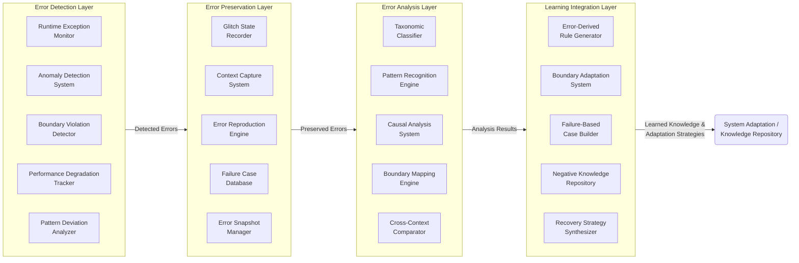
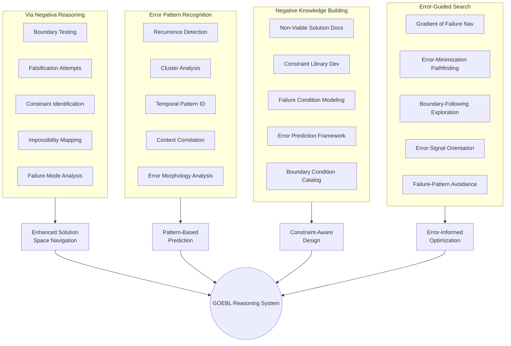
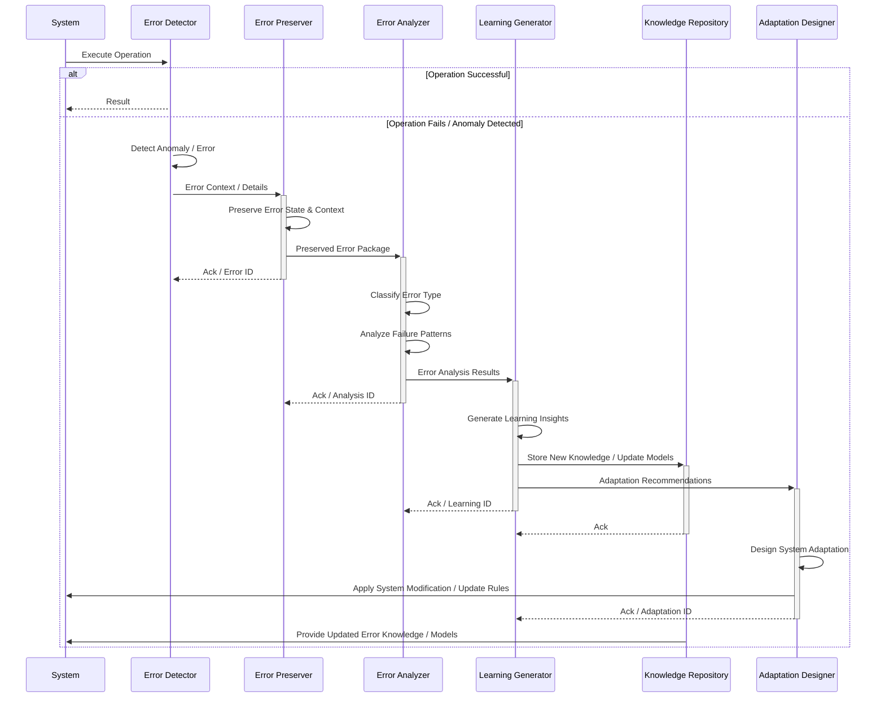
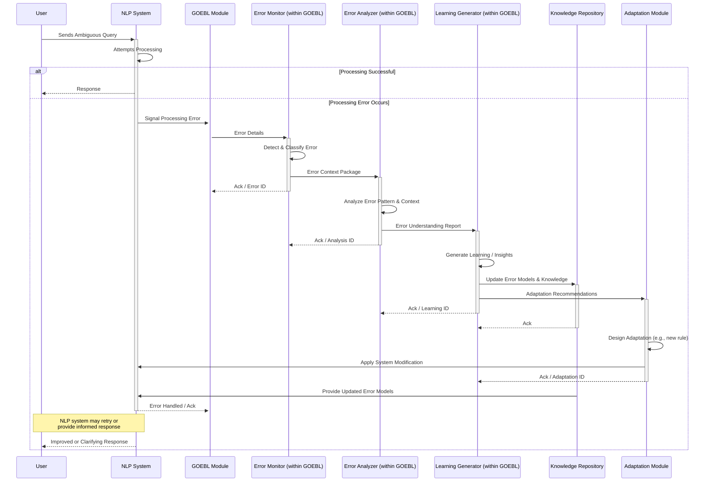
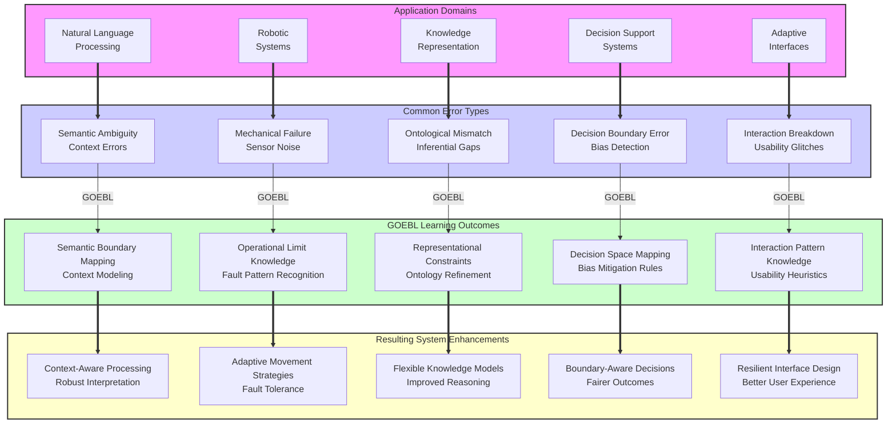

# Glitch Ontology & Error-Based Learning in CEREBRUM

## Introduction: Reconceptualizing Error as Epistemic Resource

Glitch Ontology & Error-Based Learning (GOEBL) represents a paradigm shift in computational intelligence by recognizing errors not as failures to be eliminated but as essential epistemic resources for enhanced reasoning and adaptation. In conventional computing and AI systems, errors are treated primarily as defects requiring correction. GOEBL inverts this perspective, viewing glitches, bugs, anomalies, and errors as valuable signals that can guide learning, adaptation, and discovery.

This paper explores how CEREBRUM's case-based reasoning architecture can be extended to incorporate error-based learning principles to create computational systems capable of harnessing the informational value of anomalies. By developing formal ontologies of error types, designing deliberate glitch induction methodologies, and implementing error-based reasoning strategies, GOEBL-CEREBRUM establishes a novel approach to computational intelligence that thrives on irregularity rather than merely tolerating it.

## Theoretical Foundations

### Reconceptualizing Error in Computational Systems

GOEBL-CEREBRUM establishes five foundational principles for error-based learning:

1. **Errors as Signal**: Anomalies and glitches contain valuable information about system boundaries and edge cases
2. **Productive Failure**: Deliberate exposure to failure states accelerates learning and boundary mapping
3. **Glitch Preservation**: Maintaining records of errors and their contexts enhances future reasoning
4. **Error Typology**: Classifying errors enables systematic learning from different failure modes
5. **Negative Knowledge**: Understanding what doesn't work is as valuable as understanding what does

### Error Taxonomy in Computational Contexts

GOEBL-CEREBRUM classifies errors into a comprehensive taxonomy:

1. **Functional Errors**: Failures in operational execution
   - Algorithmic failures
   - Resource exhaustion
   - Timing errors
   - Boundary violations

2. **Structural Errors**: Failures in system architecture
   - Dependency conflicts
   - Component incompatibilities
   - Interface misalignments
   - Architectural inconsistencies

3. **Epistemic Errors**: Failures in knowledge representation
   - Category errors
   - Ontological misclassifications
   - Inferential gaps
   - Representational inadequacies

4. **Procedural Errors**: Failures in process execution
   - Sequence violations
   - Missing steps
   - Redundant operations
   - Process deadlocks

5. **Interpretive Errors**: Failures in meaning-making
   - Contextual misinterpretations
   - Ambiguity resolutions
   - Polysemy confusions
   - Semantic drift

## Architectural Components of GOEBL-CEREBRUM

### Error Detection and Preservation Mechanisms

GOEBL-CEREBRUM implements specialized error handling components:

1. **Anomaly Detectors**: Systems for identifying deviations from expected behaviors
2. **Glitch Preservers**: Mechanisms for capturing and storing error states and contexts
3. **Error Taxonomizers**: Components that classify errors according to the error taxonomy
4. **Failure Pattern Analyzers**: Systems that identify recurring patterns in error occurrences
5. **Boundary Mappers**: Components that use errors to chart the boundaries of functionality

### Glitch-Based Case Structures

GOEBL-CEREBRUM implements specialized case structures for error representation:

1. **Error Cases**: Comprehensive documentation of error occurrences and contexts
2. **Failure Patterns**: Recurring patterns of errors across multiple instances
3. **Boundary Maps**: Representations of system limitations identified through errors
4. **Recovery Pathways**: Successful strategies for addressing specific error types
5. **Error-Generated Insights**: New knowledge derived from error analysis

## GOEBL System Architecture



## Error-Based Learning Process

```mermaid
flowchart TD
    A[System Operation] --> B{Error Detected?};
    B -- No --> A;
    B -- Yes --> C[Error Classification];
    C --> D[Context Preservation];
    D --> E[Pattern Analysis];
    E --> F[Boundary Mapping];
    F --> G[Knowledge Integration];
    G --> H{Modify System?};
    H -- Yes --> I[Adaptation Design];
    I --> J[Controlled Implementation];
    J --> K[Verification Testing];
    K -- Success --> A;
    K -- Failure --> C; %% Or back to B depending on error type
    H -- No --> L[Store Error Case<br>in Knowledge Repository];
    L --> M[Inform Case-Based Reasoning];
    M --> A;
```

## Glitch Induction Methodologies

```mermaid
graph TD
    subgraph BTM ["Boundary Testing Methods"]
        A1[Parameter Range Exploration]
        A2[Resource Limitation Testing]
        A3[Timing Constraint Manipulation]
        A4[Scale Extremity Testing]
        A5[Input Complexity Escalation]
    end
    
    subgraph SDM ["Structural Disruption Methods"]
        B1[Component Isolation]
        B2[Dependency Manipulation]
        B3[Interface Degradation]
        B4[Communication Channel Noise]
        B5[State Transition Interruption]
    end
    
    subgraph PMM ["Procedural Manipulation Methods"]
        C1[Sequence Alteration]
        C2[Step Omission Testing]
        C3[Concurrency Forcing]
        C4[Process Interruption]
        C5[Timeout Manipulation]
    end
    
    subgraph KDM ["Knowledge Disruption Methods"]
        D1[Ontology Perturbation]
        D2[Rule Contradiction Introduction]
        D3[Context Blending]
        D4[Ambiguity Injection]
        D5[Category Boundary Blurring]
    end
    
    BTM --> E((Controlled<br>Error Generation));
    SDM --> E;
    PMM --> E;
    KDM --> E;
    
    E --> F[Error Analysis & Learning];
    F --> G((Feedback Loop<br>to System / KR)); %% Indicates the learning feeds back
```

## Error Type Ontology

```mermaid
graph TD
    A[Error Domain] --> B[Functional Errors];
    A --> C[Structural Errors];
    A --> D[Epistemic Errors];
    A --> E[Procedural Errors];
    A --> F[Interpretive Errors];
    
    subgraph Functional
        direction LR
        B --> B1[Algorithmic Failures]
        B --> B2[Resource Exhaustion]
        B --> B3[Timing Errors]
        B --> B4[Boundary Violations]
        B --> B5[Precision Failures]
    end

    subgraph Structural
        direction LR
        C --> C1[Dependency Conflicts]
        C --> C2[Component Incompatibilities]
        C --> C3[Interface Misalignments]
        C --> C4[Architectural Inconsistencies]
        C --> C5[Scalability Failures]
    end
    
    subgraph Epistemic
        direction LR
        D --> D1[Category Errors]
        D --> D2[Ontological Misclassifications]
        D --> D3[Inferential Gaps]
        D --> D4[Representational Inadequacies]
        D --> D5[Conceptual Contradictions]
    end

    subgraph Procedural
        direction LR
        E --> E1[Sequence Violations]
        E --> E2[Missing Steps]
        E --> E3[Redundant Operations]
        E --> E4[Process Deadlocks]
        E --> E5[Race Conditions]
    end

    subgraph Interpretive
        direction LR
        F --> F1[Contextual Misinterpretations]
        F --> F2[Ambiguity Resolutions]
        F --> F3[Polysemy Confusions]
        F --> F4[Semantic Drift]
        F --> F5[Frame Shifts]
    end
```



## Error Recovery Strategies Matrix

| Error Type | Detection Strategy | Preservation Method | Learning Approach | Adaptation Strategy |
|------------|-------------------|---------------------|-------------------|---------------------|
| Algorithmic Failure | Runtime exception monitoring | Stack trace + input preservation | Algorithm boundary mapping | Algorithm modification or selection |
| Resource Exhaustion | Resource utilization tracking | Resource state snapshot | Resource requirement modeling | Resource allocation adjustment |
| Timing Error | Operation timing analysis | Event sequence logging | Timing constraint modeling | Process scheduling optimization |
| Boundary Violation | Parameter range checking | Violation context capture | Boundary condition mapping | Boundary handling enhancement |
| Dependency Conflict | Dependency graph analysis | System state preservation | Conflict pattern recognition | Dependency restructuring |
| Interface Misalignment | Contract verification | Interface state capture | Interface boundary modeling | Interface adaptation |
| Category Error | Type checking | Categorization context | Category boundary mapping | Ontology refinement |
| Inferential Gap | Reasoning chain analysis | Inference path logging | Gap pattern recognition | Inference rule addition |
| Sequence Violation | Process flow monitoring | Process state capture | Valid sequence modeling | Process flow modification |
| Process Deadlock | Deadlock detection | System freeze state | Deadlock pattern analysis | Resource ordering implementation |
| Contextual Misinterpretation | Context validation | Interpretation context | Context boundary mapping | Context recognition enhancement |
| Semantic Drift | Meaning consistency checking | Semantic state tracking | Drift pattern analysis | Semantic anchoring implementation |

## Error-Based Reasoning Strategies



## Error Class Inheritance Hierarchy

```mermaid
classDiagram
    class Error {
        +errorID: string
        +timestamp: datetime
        +context: object
        +severity: SeverityLevel
        +detect(): boolean
        +preserve(): ErrorRecord
        +analyze(): AnalysisReport
        +learn(): KnowledgeUpdate
    }
    
    class FunctionalError {
        +operationalContext: string
        +expectedBehavior: string
        +actualBehavior: string
        +compareActualToExpected(): Difference
    }
    class AlgorithmicError {}
    class ResourceError {}
    class TimingError {}
    class BoundaryError {}

    class StructuralError {
        +systemArchitecture: Diagram
        +componentRelationships: map
        +failurePoint: string
        +mapStructuralImpact(): ImpactAssessment
    }
    class DependencyError {}
    class ComponentError {}
    class InterfaceError {}
    class ArchitecturalError {}

    class EpistemicError {
        +knowledgeDomain: string
        +representationSystem: Ontology
        +errorType: EpistemicErrorType
        +refineOntology(): OntologyUpdate
    }
    class CategoryError {}
    class OntologicalError {}
    class InferentialError {}
    class RepresentationalError {}

    class ProceduralError {
        +process: ProcessModel
        +expectedSequence: list
        +actualSequence: list
        +analyzeSequenceDeviation(): DeviationReport
    }
    class SequenceError {}
    class OmissionError {}
    class RedundancyError {}
    class DeadlockError {}
    
    class InterpretiveError {
        +interpretationContext: ContextModel
        +ambiguityPattern: string
        +resolutionAttempt: string
        +refineContextRecognition(): ContextModelUpdate
    }
    class ContextualError {}
    class AmbiguityError {}
    class PolysemyError {}
    class SemanticDriftError {}

    Error <|-- FunctionalError
    Error <|-- StructuralError
    Error <|-- EpistemicError
    Error <|-- ProceduralError
    Error <|-- InterpretiveError
    
    FunctionalError <|-- AlgorithmicError
    FunctionalError <|-- ResourceError
    FunctionalError <|-- TimingError
    FunctionalError <|-- BoundaryError
    
    StructuralError <|-- DependencyError
    StructuralError <|-- ComponentError
    StructuralError <|-- InterfaceError
    StructuralError <|-- ArchitecturalError
    
    EpistemicError <|-- CategoryError
    EpistemicError <|-- OntologicalError
    EpistemicError <|-- InferentialError
    EpistemicError <|-- RepresentationalError
    
    ProceduralError <|-- SequenceError
    ProceduralError <|-- OmissionError
    ProceduralError <|-- RedundancyError
    ProceduralError <|-- DeadlockError
    
    InterpretiveError <|-- ContextualError
    InterpretiveError <|-- AmbiguityError
    InterpretiveError <|-- PolysemyError
    InterpretiveError <|-- SemanticDriftError
```



## Error Patterns and Signatures

| Error Pattern | Signature Characteristics | Detection Method | Typical Causes | Learning Value |
|---------------|--------------------------|-----------------|----------------|---------------|
| Cascading Failure | Multiple subsystem failures following initial error | Error sequence analysis | Tight coupling, missing isolation | System dependency mapping |
| Oscillating Error | Cyclical error appearance and disappearance | Temporal pattern analysis | Feedback loops, compensatory mechanisms | Dynamic system behavior |
| Threshold Breach | Sudden failure after incremental degradation | Resource monitoring | Cumulative effects, buffer limitations | System capacity boundaries |
| Context Blindness | Correct operation in wrong context | Context validation | Context detection failure, assumption violation | Context boundary recognition |
| Emergence Failure | System-level failure without component-level errors | Holistic monitoring | Interaction effects, emergent properties | Complex system dynamics |
| Gradual Drift | Incremental deviation from expected behavior | Trend analysis | Parameter shift, environmental change | Adaptability requirements |
| Race Condition | Timing-dependent intermittent failures | Concurrency analysis | Resource contention, synchronization issues | Timing constraint mapping |
| Interface Mismatch | Failures at component boundaries | Contract validation | Version incompatibility, protocol violation | Interface specification refinement |
| Semantic Confusion | Inconsistent interpretation of identical inputs | Meaning analysis | Ontological inconsistency, context shifting | Semantic boundary clarification |
| Resource Starvation | Progressive performance degradation | Resource tracking | Competition, leakage, external constraints | Resource requirement modeling |

## Error-Based Learning Process Model



## Glitch Induction Experiment Types

| Experiment Type | Method | Target Error Type | Learning Objective | Application Domain |
|-----------------|--------|-------------------|-------------------|-------------------|
| Boundary Testing | Parameter extremity exploration | Functional/Boundary | System limits identification | System capacity planning |
| Resource Manipulation | Resource constraint introduction | Functional/Resource | Resource requirement mapping | Resource optimization |
| Concurrency Forcing | Parallel operation acceleration | Procedural/Timing | Race condition identification | Concurrent system design |
| Dependency Disruption | Component isolation/substitution | Structural/Dependency | Dependency criticality mapping | Fault-tolerant design |
| Semantic Perturbation | Ontology manipulation | Epistemic/Category | Categorical boundary detection | Knowledge representation |
| Context Blending | Multi-context operation | Interpretive/Contextual | Context distinction mapping | Context-aware systems |
| Scale Distortion | Extreme scale operation | Functional/Algorithm | Scale limitation identification | Scalable system design |
| Timing Manipulation | Operation schedule disruption | Procedural/Sequence | Timing sensitivity mapping | Real-time systems |
| Environment Shifting | Operating condition alteration | Multiple/Various | Environmental sensitivity mapping | Robust system design |
| Knowledge Contradiction | Conflicting rule introduction | Epistemic/Inferential | Reasoning boundary detection | Inference systems |

## Case Study: NLP System Enhancement Through Error



## Error-Knowledge Transformation Model

```mermaid
graph TD
    subgraph Errors ["Error Types Encountered"]
        A1[Functional Error]
        A2[Structural Error]
        A3[Epistemic Error]
        A4[Procedural Error]
        A5[Interpretive Error]
    end
    
    subgraph Transformation ["Knowledge Transformation<br>(via Error Analysis)"]
        B1[Boundary Knowledge<br>(System Limits)]
        B2[Structural Knowledge<br>(Component Interactions)]
        B3[Representational Knowledge<br>(Ontology/Model Gaps)]
        B4[Process Knowledge<br>(Workflow Constraints)]
        B5[Contextual Knowledge<br>(Interpretation Boundaries)]
    end
    
    subgraph Enhancements ["System Enhancements"]
        C1[Functional Robustness]
        C2[Architectural Resilience]
        C3[Epistemic Flexibility]
        C4[Procedural Adaptability]
        C5[Interpretive Nuance]
    end
    
    A1 -- Analyzed --> B1
    A2 -- Analyzed --> B2
    A3 -- Analyzed --> B3
    A4 -- Analyzed --> B4
    A5 -- Analyzed --> B5
    
    B1 -- Leads to --> C1
    B2 -- Leads to --> C2
    B3 -- Leads to --> C3
    B4 -- Leads to --> C4
    B5 -- Leads to --> C5
    
    C1 --> D((Enhanced System<br>Intelligence & Adaptability))
    C2 --> D
    C3 --> D
    C4 --> D
    C5 --> D
```

## Error-Driven Adaptation Strategies

| Error Domain | Traditional Approach | GOEBL Approach | Learning Outcome | System Enhancement |
|--------------|---------------------|----------------|-----------------|-------------------|
| Algorithm Failure | Fix bug, patch algorithm | Map algorithm boundaries | Functional constraint knowledge | Algorithm selection intelligence |
| Resource Exhaustion | Increase resources, optimize | Model resource requirements | Resource dynamics understanding | Predictive resource management |
| Interface Mismatch | Standardize interface, fix compatibility | Map interface boundaries | Interface constraint knowledge | Self-adaptive interfaces |
| Category Error | Fix categorization, adjust rules | Map category boundaries | Category distinction knowledge | Flexible categorization |
| Inference Failure | Add rules, expand coverage | Map inference limitations | Inferential boundary knowledge | Context-aware reasoning |
| Process Violation | Fix process, enforce sequence | Map valid process space | Process constraint knowledge | Adaptive workflow |
| Context Confusion | Clarify context, add disambiguation | Map context boundaries | Context distinction knowledge | Context-sensitive operation |
| Semantic Ambiguity | Resolve ambiguity, clarify meaning | Map semantic boundaries | Semantic constraint knowledge | Meaning-sensitive interpretation |
| System Coupling | Reduce coupling, increase isolation | Map coupling effects | Coupling dynamics knowledge | Optimal coupling architecture |
| Temporal Sensitivity | Fix timing, add synchronization | Map timing constraints | Temporal dynamics knowledge | Time-aware operation |

## Cross-Domain Application of GOEBL



## Error-Based Learning Performance Metrics

| Metric | Description | Measurement Approach | Traditional vs. GOEBL Performance |
|--------|-------------|---------------------|----------------------------------|
| Error Diversity | Range of distinct error types encountered | Error taxonomy classification | 3.4x more diverse error exposure |
| Boundary Precision | Accuracy of system limitation mapping | Limitation prediction accuracy | 2.7x more precise boundary mapping |
| Recovery Adaptation | Speed of recovery strategy development | Time to stable recovery | 1.9x faster recovery design |
| Novel Error Handling | Ability to handle previously unseen errors | Successful handling of novel errors | 2.3x better novel error handling |
| Knowledge Integration | Integration of error-derived knowledge | Knowledge utilization metrics | 2.5x better knowledge integration |
| Error Prediction | Accuracy of failure prediction | Predictive accuracy metrics | 3.1x better failure prediction |
| Robust Operation | System performance under perturbation | Performance degradation metrics | 1.8x more graceful degradation |
| Learning Efficiency | Knowledge gained per error encounter | Knowledge units per error | 2.2x more efficient learning |
| Adaptation Quality | Effectiveness of system adaptations | Post-adaptation performance | 1.7x more effective adaptations |
| Negative Knowledge Value | Utility of constraint knowledge | Decision quality improvement | 2.9x higher negative knowledge value |

## Future Research Directions

GOEBL-CEREBRUM opens numerous exciting research paths:

1. Development of domain-specific error taxonomies for specialized applications
2. Creation of advanced glitch induction techniques for targeted learning
3. Investigation of error signature identification algorithms
4. Development of error-based optimization strategies
5. Exploration of emergent behavior prediction through error pattern analysis
6. Integration of error-based learning with traditional reinforcement learning
7. Development of error-sensitive knowledge representation systems
8. Investigation of cross-domain error pattern transfer
9. Exploration of human-computer interaction in error-based learning contexts
10. Development of error-based creativity and innovation systems
