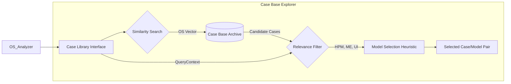
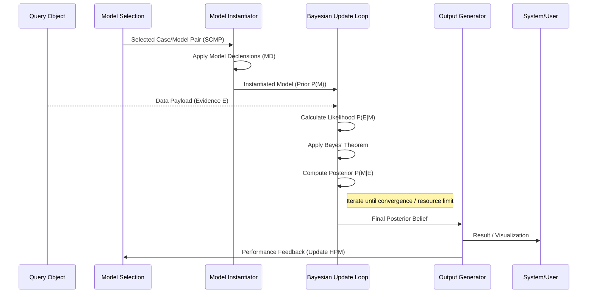

# CEREBRUM Control Flow: An Infinite Jest of Bayesian Case Recursion

**WARNING**: The following conceptualization of CEREBRUM's operational dynamics is presented with maximalist granularity and potentially recursive complexity. Reader discretion, caffeine, and perhaps a high tolerance for intricate, footnote-laden process descriptions are advised. Consider this less a flowchart, more a map of a cognitive territory that might, in fact, be topologically equivalent to itself.

## Section 1: The Initial Perturbation (Query Ingress)

The system, CEREBRUM [^1], nominally exists in a state of Bayesian Equilibrium (or perhaps, more accurately, a metastable state awaiting informational impetus). A **Query Object** (QO) arrives. This QO is not monolithic; it possesses attributes: Data Payload (DP), Metadata Envelope (ME), Urgency Index (UI), and crucially, an **Ontological Signature (OS)** [^2].

[^1]: **CEREBRUM**: Case-Enabled Reasoning Engine with Bayesian Representations for Unified Modeling. The acronym itself hints at the ambitious, potentially overwrought nature of the endeavor. Think of it as attempting to build a universal translator for cognitive processes, but using only Bayesian probability and historical anecdotes (i.e., "Cases"). Success is, shall we say, *asymptotic*.
[^2]: **Ontological Signature (OS)**: A complex vector attempting to categorize the QO's *aboutness*. Is it about predicting stock prices? Diagnosing engine trouble? Analyzing sentiment in 18th-century letters? The OS is the system's first, often flawed, guess. Mis-categorization here can lead to... suboptimal downstream trajectories.

```mermaid
graph TD
    A[Query Object (QO) Arrival] --> B{OS Analyzer};
    B -- Vector V --> C{Case Library Interface (CLI)};
    B -- Uncertainty U --> D[Metadata Log (ML)];
    C -- Potential Matches M --> E{Model Selection Heuristic (MSH)};
    C -- No Match Null --> F[Novel Case Formulation (NCF) Subroutine];
    D --> E; %% Uncertainty informs selection
    F --> E; %% Newly formulated case enters selection
    E --> G[Selected Case/Model Pair (SCMP)];

    subgraph QO Components
        direction LR
        QO_DP[Data Payload]
        QO_ME[Metadata Envelope]
        QO_UI[Urgency Index]
        QO_OS[Ontological Signature]
    end
    A --> QO_Components
```

## Section 2: Case Retrieval and The Specter of Relevance

The **Case Library Interface (CLI)** consults the **Case Base (CB)** [^3]. The CB is not merely a database; it's a sprawling archive of past inferential activities, successes, failures, near-misses. Each **Case** contains not just data, but a **Model Configuration (MC)**, **Historical Performance Metrics (HPM)**, and **Transformation Logs (TL)**. The CLI, guided by the QO's OS (and its associated Uncertainty U), searches for resonant Cases.

Relevance is a slippery concept. The MSH attempts to quantify it using a multi-factor algorithm involving OS similarity, HPM under comparable conditions (gleaned from ME), and sometimes, frankly, heuristics that border on superstition [^4].

[^3]: **Case Base (CB)**: Imagine Borges' Library of Babel, but instead of books, it contains every possible way CEREBRUM has ever tried (or could try) to make sense of something. It grows continuously. Its organizational structure is... evolving.
[^4]: **Heuristics Bordering on Superstition**: E.g., "If the QO arrives on a Tuesday and the OS involves 'precipitation', slightly prefer Models involving Markov Chains." Documentation for these is often found in obscure commit messages or hallway conversations. Not ideal.



## Section 3: Model Instantiation and Bayesian Funhouse Mirrors

Once an SCMP is chosen (or an NCF yields a tentative new model), the **Model Instantiator (MI)** creates an active instance. This involves applying the specific **Model Declensions (MD)** [^5]—transformations (NOM, ACC, GEN, etc.) that adapt the general Case/Model to the specific QO. Think of it as tuning an infinitely complex radio receiver.

The instantiated model enters the **Bayesian Update Loop (BUL)**. Here, the QO's DP acts as new Evidence (E). The model's Prior Beliefs (P(M)) are confronted with the Likelihood (P(E|M)). Bayes' Theorem is applied, yielding a Posterior Belief (P(M|E)). This sounds clean. It rarely is [^6].

[^5]: **Model Declensions (MD)**: A potentially over-formalized attempt to map linguistic case functions onto model transformations. Does treating a dataset as the "Accusative Object" of a model *actually* help? The jury is still out, but the terminology persists.
[^6]: **Cleanliness is Not Guaranteed**: The BUL can become computationally expensive. Convergence isn't assured. Priors might be pathologically misaligned. The Likelihood calculation might involve approximations that introduce subtle (or not-so-subtle) errors. It's less a loop, more a potential vortex.



## Section 4: Output, Feedback, and the Inevitable Return

The **Output Generator (OG)** takes the final Posterior Belief state from the BUL. It translates this complex probability distribution into a human-readable (or machine-actionable) format: a prediction, a classification, a visualization, a recommendation. This output is logged, and critically, Performance Feedback (PF) is generated.

This PF loops back [^7] into the system. It updates the HPM of the utilized Case/Model. It might trigger adjustments in the NCF subroutine if the performance was abysmal. It might even refine the OS Analyzer's categorization tendencies. The entire process is thus potentially recursive, self-modifying, and capable of generating complexity faster than it can be effectively managed.

[^7]: **The Loop Back**: This feedback mechanism is crucial and also terrifying. It allows for adaptation but also for the propagation and amplification of errors. A bad inference leading to bad feedback can poison future inferences in a cascading failure mode reminiscent of... well, many things.

```mermaid
graph TD
    BUL --> PosteriorBelief{Final Posterior P(M|E)};
    PosteriorBelief --> OG[Output Generator];
    OG --> Result[System Output (Prediction, Viz, etc.)];
    OG --> PF{Performance Feedback Generation};
    PF -- Update HPM --> CB[(Case Base)];
    PF -- Trigger Adjustment --> NCF[Novel Case Formulation];
    PF -- Refine Categories --> OS_Analyzer[OS Analyzer];
    Result --> ExternalWorld[External World / User];
    ExternalWorld -- New Info/Query --> QO_Arrival[Query Object Arrival]; %% The cycle restarts

    subgraph Feedback Pathways
      direction LR
      PF --> CB;
      PF --> NCF;
      PF --> OS_Analyzer;
    end
```

**Concluding Note**: This model describes an *idealized* flow. Reality involves error handling, resource contention, asynchronous operations, and the constant, nagging possibility that the underlying ontological assumptions are fundamentally mismatched to the problem domain. Proceed with caution. And maybe make another pot of coffee. 