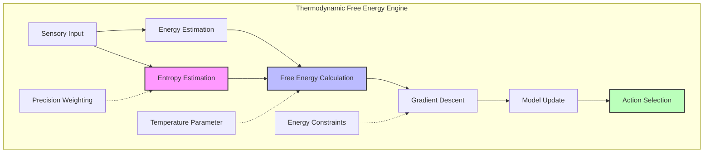
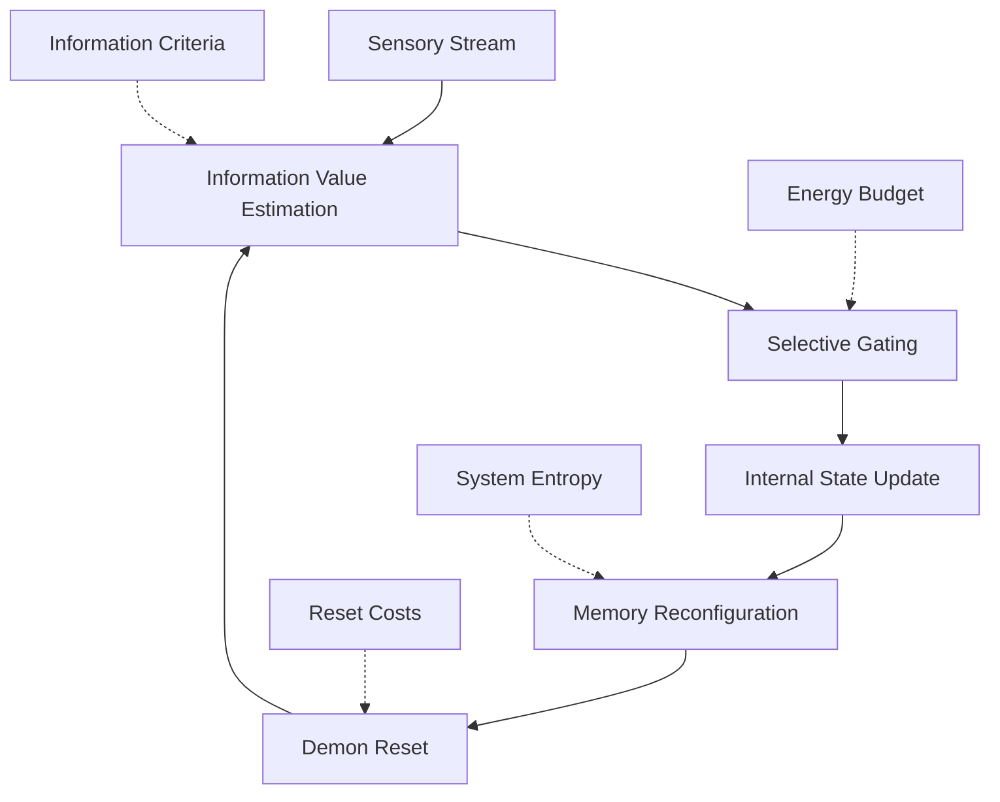
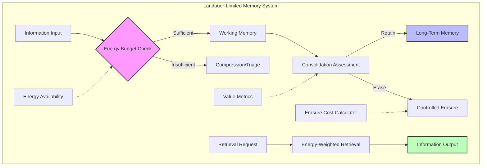
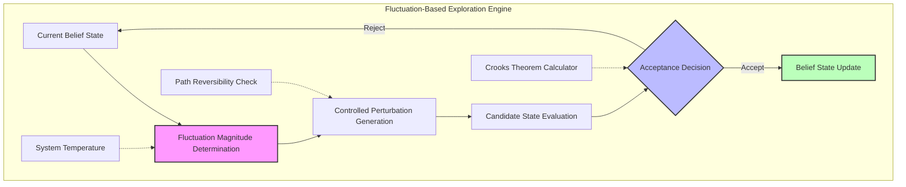
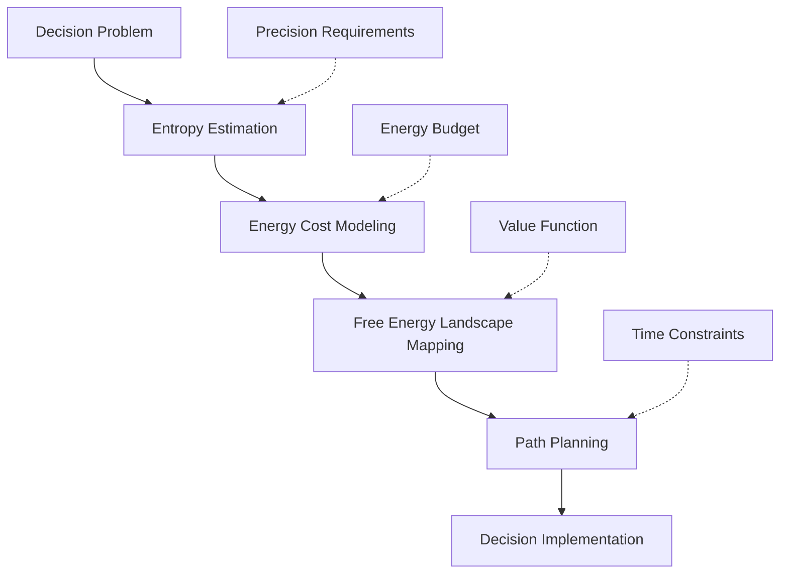
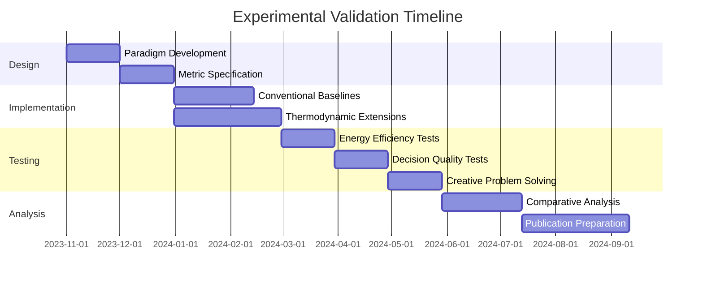
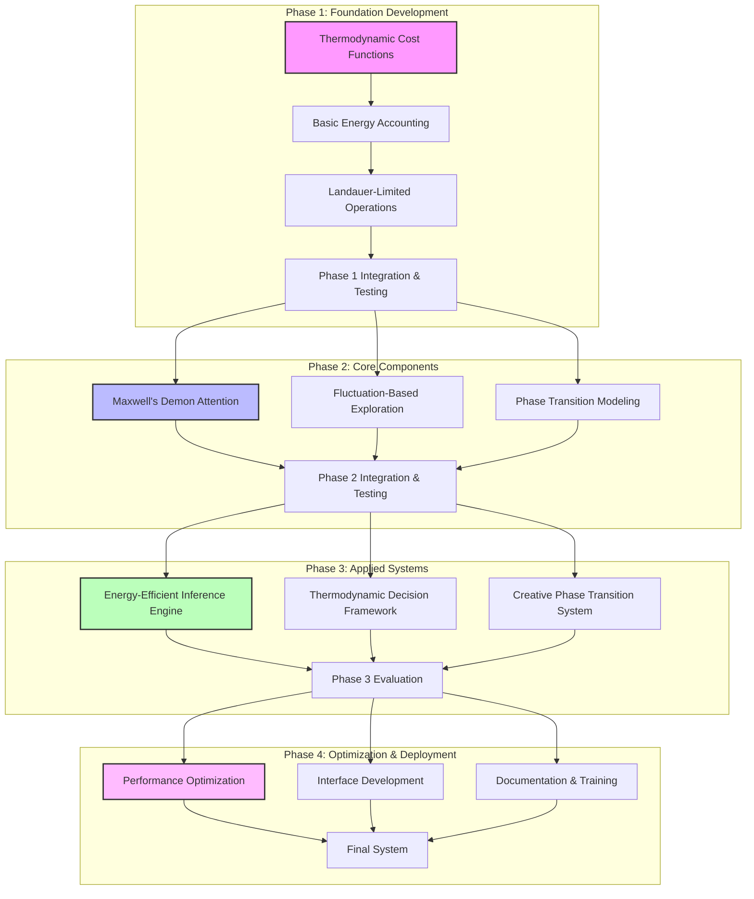

# Speculative Design: Information Thermodynamics, Maxwell's Demon, and CEREBRUM Integration

## 1. Introduction: Thermodynamic Foundations of Cognitive Processing

This document explores the speculative integration between information thermodynamics, Maxwell's demon thought experiments, and the Case-Enabled Reasoning Engine with Bayesian Representations for Unified Modeling (CEREBRUM). Both thermodynamic approaches and CEREBRUM engage with fundamental questions about information processing, entropy management, and the energetic costs of maintaining ordered cognitive states.

Claude Shannon's insight that "information is entropy" provides a powerful bridge between physical and cognitive processes, suggesting deep connections between CEREBRUM's Bayesian inference mechanisms and the thermodynamic principles governing physical systems. While operating in different domains—information thermodynamics in statistical physics and CEREBRUM in cognitive modeling—both frameworks address similar challenges: distinguishing signal from noise, maintaining ordered states in environments that tend toward disorder, and managing the fundamental tradeoffs between precision, energy consumption, and heat dissipation.

## 2. Information Thermodynamics: Key Concepts and Frameworks

### 2.1 Foundational Principles of Information Thermodynamics

Information thermodynamics examines the profound connections between information processing and physical thermodynamics.

* **Entropy as Uncertainty**: Thermodynamic entropy (measuring disorder in physical systems) and information entropy (measuring uncertainty in information systems) are fundamentally linked, quantifying the number of possible microstates consistent with observed macrostates.

* **Landauer's Principle**: The erasure of information necessarily produces heat, establishing a minimum energy cost for irreversible computation of kT ln(2) joules per bit erased, where k is Boltzmann's constant and T is temperature.

* **Fluctuation Theorems**: Probabilistic extensions of the second law of thermodynamics that quantify the likelihood of observing entropy-decreasing fluctuations at microscopic scales.

* **Maxwell's Demon Thought Experiment**: A hypothetical entity that can observe and sort molecules based on their velocity, seemingly decreasing entropy without work—until one accounts for the thermodynamic costs of the demon's information processing.

* **Jarzynski Equality**: A remarkable equation relating the work done in non-equilibrium processes to equilibrium free energy differences, connecting physical work to information.

### 2.2.1 Historical Development of Maxwell's Demon

Maxwell's demon, proposed by James Clerk Maxwell in 1867, has evolved significantly as a thought experiment:

* **Original Conception**: A hypothetical being that could observe and sort gas molecules by velocity, creating a temperature differential without expending work—seemingly violating the second law of thermodynamics.

* **Szilard's Engine**: Leo Szilard's 1929 refinement, demonstrating that the demon's observations constitute information acquisition with associated thermodynamic costs.

* **Brillouin's Resolution**: Leon Brillouin's 1951 analysis showing that the demon must expend energy to acquire information through measurement, preserving the second law.

* **Bennett's Information-Theoretic Resolution**: Charles Bennett's 1982 insight that the demon's memory must be reset to complete a thermodynamic cycle, with this erasure dissipating heat per Landauer's principle.

* **Experimental Realizations**: Recent nanoscale experiments have implemented Maxwell's demon-like systems, confirming the theoretical predictions about information-energy conversion.

### 2.2.2 Key Computational Extensions

Several computational extensions of information thermodynamics have potential relevance for cognitive modeling:

* **Algorithmic Cooling**: Techniques for transferring entropy from certain degrees of freedom to others, effectively "cooling" parts of a system by "heating" others.

* **Thermodynamic Computing**: The emerging field exploring computation through the natural dynamics of thermodynamic systems, where computation emerges from the system's tendency to minimize free energy.

* **Dissipative Adaptation**: The principle that systems driven by external energy sources can self-organize into states that more effectively dissipate that energy, potentially explaining the emergence of complex structures.

* **Stochastic Thermodynamics**: The extension of thermodynamics to small, fluctuating systems far from equilibrium, providing a framework for understanding the thermodynamics of computation at microscopic scales.

* **Information Engines**: Physical systems that can convert between information and work, effectively using information as a thermodynamic resource.

### 2.3 Relevant Applications and Insights

Information thermodynamics has provided insights across numerous domains with potential relevance to cognitive modeling:

* **Minimum Energy Computation**: Understanding the fundamental limits on energy efficiency in computational systems.

* **Prediction and Dissipation**: Theoretical frameworks relating a system's predictive capacity to its energy dissipation.

* **Self-Organization**: Thermodynamic explanations for the emergence of ordered structures in complex systems.

* **Fundamental Limits of Measurement**: Insights into the inevitable disturbances caused by measuring systems.

* **Error Correction**: Thermodynamic perspectives on the energy costs of maintaining reliable information in noisy environments.

## 3. CEREBRUM's Core Frameworks: A Brief Overview

To facilitate comparison with thermodynamic concepts, we review key aspects of CEREBRUM:

### 3.1 Case-Based Representation and Reasoning

CEREBRUM employs case structures as fundamental units of knowledge representation:
- Encoding relationships between entities in flexible, contextual formats
- Supporting analogical reasoning across domains
- Enabling multiple perspectives on the same situation
- Functioning within a Bayesian framework for inference and learning

### 3.2 The Bayesian Framework and Active Inference

CEREBRUM implements computational principles from:
- The Free Energy Principle and Active Inference
- Hierarchical predictive processing
- Variational Bayesian methods
- Precision-weighted belief updating

### 3.3 Modular Integration and Cognitive Architecture

CEREBRUM provides:
- A modular architecture integrating different cognitive functions
- Standardized interfaces between components
- Mechanisms for attention and resource allocation
- Frameworks for representing dynamics across temporal scales

## 4. Thermodynamic Approaches and CEREBRUM: Speculative Integrations

This section explores how information thermodynamics concepts might inform and enhance CEREBRUM's frameworks.

### 4.1 Thermodynamic Free Energy and Cognitive Free Energy

The Free Energy Principle in CEREBRUM shares striking parallels with thermodynamic free energy:

* **Unified Energy Minimization**: Reformulating CEREBRUM's variational free energy minimization as a thermodynamic process, where cognitive systems minimize surprise by minimizing a thermodynamically-inspired quantity.

* **Entropy-Accuracy Trade-offs**: Explicitly modeling the trade-offs between maintaining low-entropy, highly-specified models and the accuracy of those models—analogous to the energy-entropy balance in physical systems.

* **Precision as Inverse Temperature**: Treating the precision weighting in CEREBRUM's predictive processing as an inverse temperature parameter, controlling the "phase transitions" between different cognitive regimes.

* **Fluctuation-Driven Exploration**: Implementing controlled noise (inspired by thermal fluctuations) to drive exploration of the model space, with the magnitude of fluctuations decreasing as the system converges on optimal models.

* **Heat Dissipation as Prediction Error**: Reconceptualizing prediction errors as a form of "cognitive heat dissipation"—the necessary byproduct of maintaining an ordered model in a complex environment.

This thermodynamic reformulation would provide CEREBRUM with a principled framework for managing the fundamental trade-offs in cognitive processing, grounded in the physics of information.

### 4.2 Maxwell's Demon as an Attention Mechanism

Maxwell's demon offers a powerful metaphor for attention and filtering mechanisms in CEREBRUM:

* **Selective Information Gating**: Implementing attention mechanisms that, like Maxwell's demon, selectively allow certain information to influence the system while blocking other information.

* **Entropy Reduction Through Sorting**: Designing systems that actively sort and categorize incoming information to reduce cognitive entropy, while explicitly accounting for the thermodynamic costs of this sorting.

* **Memory-Attention Cycles**: Modeling the cyclic relationship between attention (gathering information) and memory reset (erasing information), with associated energetic costs.

* **Measurement-Disturbance Trade-offs**: Implementing attentional systems that explicitly model the inevitable disturbance of observed systems through the act of measurement.

* **Thermodynamic Attention Budgeting**: Allocating limited attentional resources based on explicit modeling of the thermodynamic costs and benefits of attending to different aspects of the environment.

This framework would enhance CEREBRUM's attention mechanisms by grounding them in the thermodynamic principles that ultimately constrain all information-processing systems.

### 4.3 Landauer's Principle and Memory Management

Landauer's principle suggests novel approaches to memory management in CEREBRUM:

* **Energetically-Aware Memory Operations**: Designing memory systems that explicitly account for the thermodynamic costs of information erasure, storage, and retrieval.

* **Reversible Computation Pathways**: Implementing computational pathways that minimize irreversible operations to reduce the thermodynamic costs associated with information erasure.

* **Graduated Memory Permanence**: Creating memory systems with different levels of persistence and associated energy costs, from high-energy, rapidly accessible working memory to low-energy, stable long-term memory.

* **Forgetting as Thermal Relaxation**: Modeling forgetting as a thermal relaxation process where memories gradually "thermalize" and lose their distinct structure over time.

* **Energy-Information Budgeting**: Implementing systems that optimize the allocation of limited energetic resources across different memory functions based on utility.

This approach would provide CEREBRUM with more efficient memory systems explicitly designed around the fundamental physical limits on information processing.

### 4.4 Fluctuation Theorems and Belief Dynamics

Fluctuation theorems from non-equilibrium thermodynamics suggest novel perspectives on belief dynamics:

* **Microscopic Reversibility in Inference**: Designing inference systems with explicit forward and reverse pathways that respect microscopic reversibility, potentially improving the exploration of model space.

* **Crooks Fluctuation Theorem for Beliefs**: Applying the Crooks fluctuation theorem to belief transitions, providing a principled way to quantify the likelihood of spontaneous belief changes against the gradient of evidence.

* **Jarzynski Equality for Inference**: Using the Jarzynski equality to design inference processes that can efficiently compute free energy differences between belief states, even through non-equilibrium pathways.

* **Time-Reversal Symmetry Breaking**: Identifying the arrow of time in cognitive processes through the systematic breaking of time-reversal symmetry in inference pathways.

* **Fluctuation-Driven Creativity**: Harnessing controlled fluctuations to drive creative processes, where unlikely but valuable belief states can be temporarily explored through "cognitive thermal fluctuations."

This framework would enhance CEREBRUM's belief dynamics by incorporating sophisticated principles from non-equilibrium thermodynamics, potentially improving both efficiency and creative capacity.

### 4.5 Thermodynamic Computing for Cognitive Architecture

Emerging principles from thermodynamic computing suggest novel architectural approaches for CEREBRUM:

* **Natural Inference Through Relaxation**: Designing systems where inference emerges naturally from the relaxation of a thermodynamic system toward equilibrium, rather than through explicit algorithm execution.

* **Dissipative Adaptation**: Implementing architectures that self-organize in response to external driving forces, automatically adapting their structure to more efficiently process recurring patterns.

* **Phase Transitions Between Cognitive Modes**: Modeling transitions between different cognitive modes (e.g., focused vs. diffuse thinking) as phase transitions driven by changes in temperature-like control parameters.

* **Self-Organized Criticality**: Designing systems that naturally maintain themselves near critical points between order and disorder, maximizing their information processing capacity.

* **Metastable Cognitive States**: Creating architectures that support long-lived metastable cognitive states, allowing the system to remain in productive non-equilibrium configurations for extended periods.

This approach would move CEREBRUM toward more brain-like computing paradigms where computation emerges from the natural dynamics of physical systems, potentially offering both efficiency and flexibility advantages.

## 5. Technical Implementation: Thermodynamically-Informed CEREBRUM Extensions

This section outlines technical approaches for implementing thermodynamically-inspired features in CEREBRUM.

### 5.1 Thermodynamic Free Energy Engine

The thermodynamic free energy engine would implement:

* **Thermodynamically-Inspired Cost Functions**: Reformulating CEREBRUM's objective functions in explicitly thermodynamic terms, balancing entropy reduction against energy expenditure.

* **Temperature-Controlled Inference**: Implementing "temperature" as a control parameter governing the balance between exploration and exploitation in inference.

* **Energy-Aware Learning Rates**: Dynamically adjusting learning rates based on available energy budgets and the current thermodynamic state of the system.

* **State-Dependent Precision**: Varying precision weighting based on the system's thermodynamic state, with higher-energy states supporting higher-precision processing.

* **Entropy Gradients**: Computing gradients in the entropy landscape to guide inference toward lower-entropy (higher-certainty) states while respecting energy constraints.

This component would provide CEREBRUM with inference mechanisms explicitly grounded in thermodynamic principles, potentially improving both efficiency and adaptability.

### 5.2 Maxwell's Demon Attention System

The Maxwell's demon attention system would implement:

* **Information-Value Assessment**: Methods for rapidly assessing the potential value of incoming information streams.

* **Selective Filtering**: Mechanisms for admitting high-value information while blocking low-value information, with explicit accounting of the energetic costs.

* **Measurement Backreaction**: Models of how the attention process itself disturbs both the observed environment and the internal state.

* **Cyclic Memory Management**: Processes for periodically resetting the "demon's memory," with associated energy dissipation according to Landauer's principle.

* **Attention-Energy Budgeting**: Systems for allocating limited attentional resources based on explicit modeling of energetic constraints.

This component would enhance CEREBRUM's attention mechanisms by explicitly incorporating the thermodynamic principles that ultimately govern all information-processing systems.

### 5.3 Landauer-Limited Memory System

The Landauer-limited memory system would implement:

* **Erasure Cost Accounting**: Explicit tracking of the thermodynamic costs associated with erasing information from memory.

* **Energy-Constrained Storage**: Memory allocation strategies that operate within defined energy budgets, prioritizing information based on value.

* **Reversible Processing Pathways**: Computational pathways designed to minimize irreversible operations and their associated energy costs.

* **Tiered Storage Architecture**: Multi-level memory systems with different energy profiles, from high-energy but readily accessible working memory to low-energy archival storage.

* **Value-Based Retention**: Retention policies that consider both the informational value and the energetic cost of maintaining information.

This component would provide CEREBRUM with more efficient memory systems explicitly designed around the fundamental physical limits on information storage and retrieval.

### 5.4 Fluctuation-Based Exploration Engine

The fluctuation-based exploration engine would implement:

* **Controlled Cognitive Fluctuations**: Generating structured perturbations to current belief states to explore the model space.

* **Temperature-Dependent Exploration**: Varying the magnitude of fluctuations based on a "cognitive temperature" parameter.

* **Crooks Fluctuation Theorem Application**: Using fluctuation theorems to determine the acceptance probability of transitions against evidence gradients.

* **Path Reversibility Analysis**: Evaluating the reversibility of cognitive paths to ensure the system can return from exploratory excursions.

* **Non-Equilibrium Sampling**: Techniques for efficiently sampling from belief distributions far from equilibrium states.

This component would enhance CEREBRUM's exploration capabilities by incorporating principles from non-equilibrium thermodynamics, potentially improving both creativity and efficiency.

## 6. Applications and Use Cases

The thermodynamic extensions to CEREBRUM enable new applications across multiple domains:

### 6.1 Energy-Efficient Cognitive Systems

| Application | Description | Key Thermodynamic Concepts |
|-------------|-------------|----------------------------|
| Ultra-Low-Power AI | Cognitive systems designed to operate at the theoretical minimum energy consumption | Landauer's principle, reversible computation |
| Adaptive Power Management | Systems that dynamically adjust their computational strategy based on available energy | Thermodynamic free energy, energy-accuracy trade-offs |
| Cognitive Load Optimization | Methods for distributing cognitive load to minimize overall energy consumption | Maxwell's demon, information sorting |
| Heat-Dissipation-Aware Computing | Architectures designed to manage and utilize dissipated heat from computation | Fluctuation theorems, non-equilibrium thermodynamics |
| Memory Hierarchy Optimization | Memory systems optimized around fundamental thermodynamic limits | Landauer erasure, information-energy equivalence |

### 6.2 Thermodynamically-Optimal Decision Making

The thermodynamic approach to decision making would:

1. Explicitly model the entropic and energetic costs of different decision pathways
2. Map the free energy landscape of the decision space
3. Identify paths that efficiently reduce entropy while respecting energy constraints
4. Account for the thermodynamic costs of information acquisition and processing
5. Balance precision (requiring energy) against accuracy in time-constrained situations
6. Provide principled approaches to decision-making under resource constraints

### 6.3 Cognitive Phase Transitions

The thermodynamic CEREBRUM extensions would enable modeling of phase transitions in cognition:

* **Creative State Transitions**: Modeling transitions between analytical and creative thinking modes as phase transitions controlled by cognitive "temperature."

* **Metacognitive Critical Points**: Identifying critical points in parameter space where metacognitive abilities emerge from simpler cognitive processes.

* **Learning Phase Diagrams**: Mapping the "phase diagrams" of learning processes, identifying regions of parameter space associated with different learning regimes.

* **Collective Intelligence Transitions**: Modeling how individual cognitive systems can undergo phase transitions to collective intelligence through coupling mechanisms.

* **Consciousness as Order Parameter**: Exploring speculative models where consciousness emerges as an order parameter at phase transitions in complex cognitive systems.

## 7. Experimental Validation: Thermodynamic vs. Conventional Approaches

To validate the thermodynamic CEREBRUM extensions, we propose comparative analysis across several dimensions:

### 7.1 Comparative Performance Metrics

| Metric | Conventional Approach Measurement | Thermodynamic Approach Measurement | Expected Advantage |
|--------|-----------------------------------|------------------------------------|--------------------|
| Energy Efficiency | Power consumption per inference | Same | Thermodynamic approaches should approach theoretical limits of efficiency |
| Adaptive Resource Allocation | Effectiveness of resource distribution | Same | Thermodynamic approaches should optimize around physical constraints |
| Decision Quality Under Constraints | Decision accuracy with limited resources | Same | Thermodynamic approaches should make optimal trade-offs |
| Creative Problem Solving | Novelty and utility of solutions | Same | Fluctuation-based exploration should enhance creative capacity |
| Robustness to Noise | Performance degradation with noise | Same | Maxwell's demon mechanisms should improve noise filtering |
| Memory Efficiency | Information retained per energy unit | Same | Landauer-limited systems should approach theoretical optima |

### 7.2 Key Experimental Paradigms

We propose the following experimental paradigms:

1. **Minimal-Energy Inference**: Comparing the energy efficiency of thermodynamic vs. conventional inference mechanisms across different problem complexities.

2. **Resource-Constrained Decision Making**: Assessing decision quality under strict energy and time constraints.

3. **Adaptive Power Scaling**: Evaluating how different systems adapt to fluctuating energy availability.

4. **Noise-Robust Information Processing**: Testing resilience to various noise profiles across different architectural approaches.

5. **Creative Exploration Efficiency**: Measuring the novelty and utility of solutions generated per unit of energy expended.

6. **Memory Retention Efficiency**: Comparing information preservation under energy constraints across different memory architectures.

## 8. Theoretical Implications and Limitations

### 8.1 Philosophical Considerations

The thermodynamic approach to cognition raises important philosophical questions:

* **Physical Grounding of Cognition**: To what extent can cognitive processes be reduced to or explained by physical principles?

* **Arrow of Time in Cognition**: How does the thermodynamic arrow of time relate to experienced time and causal inference in cognitive systems?

* **Limits of Knowledge**: Do thermodynamic principles impose fundamental limits on what can be known and with what precision?

* **Energy-Information-Meaning Triangle**: How does meaning emerge from the interplay between energy and information in cognitive systems?

* **Free Energy and Freedom**: What are the implications of free energy principles for understanding agency and free will?

### 8.2 Known Limitations

We must acknowledge several limitations of the thermodynamic approach:

* **Scale Mismatches**: Cognitive systems operate at scales where thermal effects may be swamped by other factors, potentially limiting the direct application of microscopic thermodynamic principles.

* **Non-Equilibrium Complexity**: Many thermodynamic results apply strictly to equilibrium or near-equilibrium systems, while cognition operates far from equilibrium.

* **Implementation Challenges**: Implementing truly reversible computation or perfect Maxwell's demons remains technically challenging.

* **Measurement Difficulties**: Precisely measuring the thermodynamic quantities relevant to cognitive processing is experimentally difficult.

* **Simplified Models**: The mapping between thermodynamic and cognitive quantities necessarily involves simplifications that may miss important aspects of either domain.

### 8.3 Future Research Directions

Important directions for future research include:

* **Cognitive Fluctuation Theorems**: Developing specific fluctuation theorems tailored to cognitive systems operating far from equilibrium.

* **Integrated Energy-Information Theory**: Creating unified frameworks that address both the energetic and informational aspects of cognition simultaneously.

* **Experimental Thermodynamics of Thought**: Designing experiments to directly measure the thermodynamic quantities associated with cognitive processes.

* **Quantum Thermodynamics of Cognition**: Exploring whether quantum thermodynamic effects play any role in neural information processing.

* **Collective Thermodynamics**: Extending thermodynamic principles to collective cognitive systems and social information processing.

## 9. Implementation Roadmap

We propose implementing the thermodynamics-based CEREBRUM extensions through a phased approach:

### 9.1 Phase 1: Foundation Development (Months 1-6)

* Implement thermodynamically-inspired cost functions
* Develop basic energy accounting for cognitive operations
* Create Landauer-limited storage and processing operations
* Establish evaluation metrics and baseline comparisons

### 9.2 Phase 2: Core Components (Months 7-18)

* Develop Maxwell's demon attention mechanisms
* Create fluctuation-based exploration systems
* Implement phase transition modeling for cognitive states
* Build and test integration between components

### 9.3 Phase 3: Applied Systems (Months 19-30)

* Develop energy-efficient inference engine
* Build thermodynamic decision framework
* Create creative phase transition system
* Conduct comprehensive comparative evaluation

### 9.4 Phase 4: Optimization and Deployment (Months 31-36)

* Optimize performance for practical applications
* Develop user interfaces and API specifications
* Prepare comprehensive documentation and training materials
* Package final system for research and commercial applications

## 10. Conclusion: The Thermodynamics of Thought

The integration of information thermodynamics and Maxwell's demon concepts with CEREBRUM offers a promising framework for addressing fundamental challenges in cognitive modeling. By applying principles like Landauer's limit, fluctuation theorems, and thermodynamic free energy minimization, we can develop cognitive architectures that are not only more efficient but also potentially more faithful to the physical principles that ultimately constrain all information processing systems.

This approach represents not merely the application of metaphors from another discipline, but a deeper exploration of whether cognition itself is fundamentally governed by the same physical principles that govern all information-processing systems. Just as nineteenth-century thermodynamics led to profound insights about the limits and possibilities of heat engines, information thermodynamics may lead to equally profound insights about the limits and possibilities of cognitive systems.

The thermodynamics-based CEREBRUM extensions proposed here offer a speculative but technically grounded path toward cognitive architectures with enhanced capabilities for energy-efficient inference, adaptive resource allocation, and creative exploration. While significant research challenges remain, this framework provides a coherent research program that could yield practical advances in artificial intelligence while deepening our theoretical understanding of the physical basis of cognition.

## 11. References

1. Bennett, C. H. (1982). The thermodynamics of computation—a review. International Journal of Theoretical Physics, 21(12), 905-940.

2. Landauer, R. (1961). Irreversibility and heat generation in the computing process. IBM Journal of Research and Development, 5(3), 183-191.

3. Still, S., Sivak, D. A., Bell, A. J., & Crooks, G. E. (2012). Thermodynamics of prediction. Physical Review Letters, 109(12), 120604.

4. Crooks, G. E. (1999). Entropy production fluctuation theorem and the nonequilibrium work relation for free energy differences. Physical Review E, 60(3), 2721.

5. Parrondo, J. M., Horowitz, J. M., & Sagawa, T. (2015). Thermodynamics of information. Nature Physics, 11(2), 131-139.

6. Sagawa, T., & Ueda, M. (2010). Generalized Jarzynski equality under nonequilibrium feedback control. Physical Review Letters, 104(9), 090602.

7. England, J. L. (2015). Dissipative adaptation in driven self-assembly. Nature Nanotechnology, 10(11), 919-923.

8. Friston, K. (2010). The free-energy principle: a unified brain theory? Nature Reviews Neuroscience, 11(2), 127-138.

9. Wolpert, D. H. (2019). The stochastic thermodynamics of computation. Journal of Physics A: Mathematical and Theoretical, 52(19), 193001.

10. Maruyama, K., Nori, F., & Vedral, V. (2009). Colloquium: The physics of Maxwell's demon and information. Reviews of Modern Physics, 81(1), 1.

11. Mandal, D., & Jarzynski, C. (2012). Work and information processing in a solvable model of Maxwell's demon. Proceedings of the National Academy of Sciences, 109(29), 11641-11645.

12. Kolchinsky, A., & Wolpert, D. H. (2018). Semantic information, autonomous agency and non-equilibrium statistical physics. Interface Focus, 8(6), 20180041. 