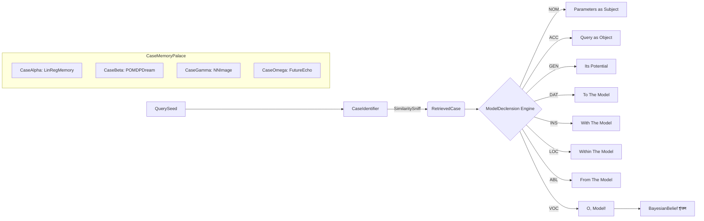
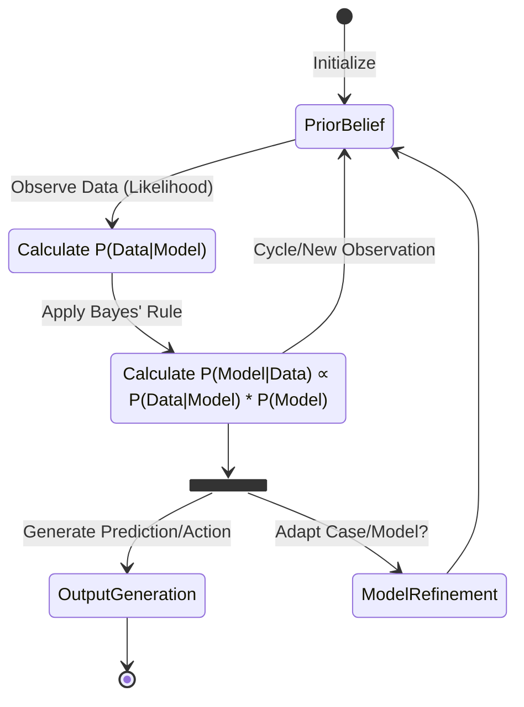
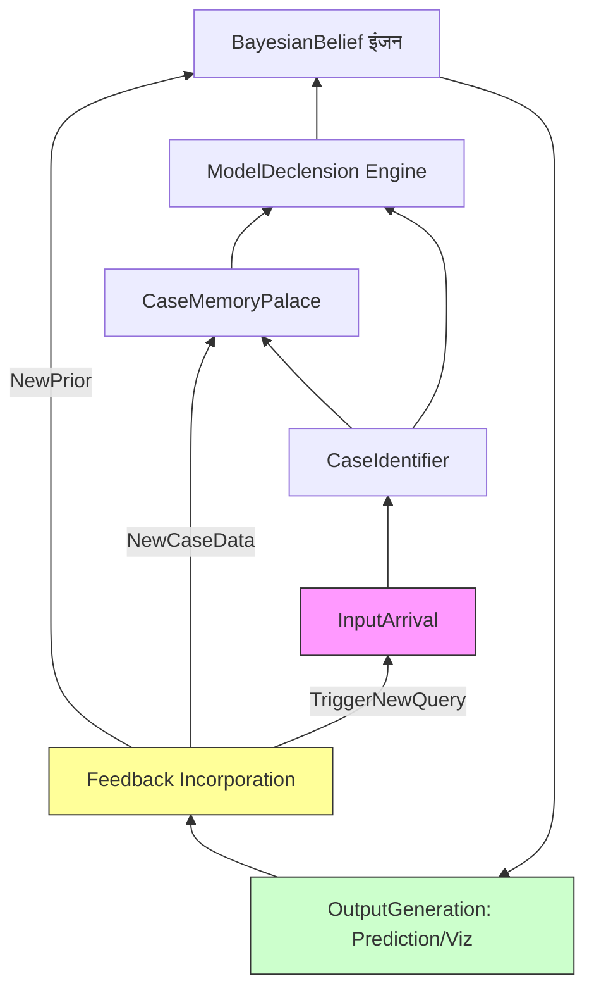

# CEREBRUM: Finnegan's Wake of Computation - A Joycean Control Flow Fantasia

*(Begin again, yes, begin the begin, riverrun past Eve and Adam's, from swerve of shore to bend of bay, brings us by a commodius vicus of recirculation back to Howth Castle and Environs... which is to say, CEREBRUM, that thinkengine, that case-cascader, that Bayesian dream weaver...)*

## I. The Primal Query: A Knock at the Door of Thought

A tap-tap-tapping. Input arrives. A whisper? A datum? A **CaseQuery** raw and twitching, seeking its **OntoSemblance**. Wherefrom? Whitherward? Doesn't matter yet, it *is*, knocking like Blazes Boylan on Molly's inner door. It desires... *what*? A pattern? A prediction? A **PosteriorPossibility** glimpsed through the fog of **PriorProbability**.

```mermaid
graph TD
    A[InputArrival: RawDatum/QuerySeed] --> B{CaseIdentifier: Sniffing the Scent};
    B -- WhatIsIt? --> C[OntologyMatcher: NameThatTune];
    C -- KnownShape --> D[CaseRetrieval: FetchTheFamiliar];
    C -- UnknownWhisper --> E[NoveltyNexus: BirthANewCase?];
    D --> F{ModelApplicator: DressItUp};
    E --> F;
    F --> G[BayesianBelief इंजन: ChurnTheProbabilities];
    G -- LikelihoodLens --> H[PosteriorPolish: ShineTheOutcome];
    H --> I[OutputOracle: SpeakTheResult];
    I -- FeedbackLoopFlux --> A; %% Cycle back, always back
    style F fill:#f9f,stroke:#333,stroke-width:2px;
    style G fill:#ccf,stroke:#333,stroke-width:4px;
    style I fill:#cfc,stroke:#333,stroke-width:2px;
```

## II. The Case Carousel: Memories Mingling, Models Morphing

Ah, the **Cases**! Stored like jars of potted history in Bloom's pantry. Each a **ModelInstance**, a **NarrativeFragment**, a **BeliefSnapshot**. The **QuerySeed** sniffs around. Does it smell like *that* time? The *LinearRegressionLilt*? The *POMDPuzzle*? The *NeuralNetNightmare*?

CEREBRUM, the **CaseDecliner**, grabs a likely suspect. **NOM**inative Case: *This* is the subject. **ACC**usative: The query acts upon *it*. **GEN**itive: *Its* parameters. **DAT**ive: Give the query *to* it. **INS**trumental: Transform the query *with* it. **LOC**ative: Update belief *within* its context. **ABL**ative: Generate prediction *from* it. **VOC**ative: O, Model, speak!



## III. The Bayesian Bardo: Between Belief and Becoming

Here in the **ProbabilityPlenum**, the real work, the *soulstuff*, happens. Priors meet Likelihoods in a dark alley. **EvidenceAccumulation**, a slow drip or a sudden flood. The **BeliefState** shifts, shimmers, a water reflection disturbed. Is it converging? Diverging? Spiraling like the stairs in Usher's house?

*   **PriorPrejudices**: What we thought we knew before the knock. Ghosts of data past.
*   **LikelihoodLuminance**: How well the current **CaseModel** explains the **QueryDatum**. A fit? A mismatch? A *glitchontological* tremor?
*   **EvidenceExcitation**: The weight of the new arrival. A feather? A stone?
*   **PosteriorPotential**: The updated dream, the revised reality, the **BeliefMass** redistributed.



## IV. The Output Ouroboros: Speaking in Tongues, Biting Tails

And then? An **Output**. A **PredictionUtterance**. A **DecisionDeclaration**. A **VisualizationVortex**. Spoken, shown, acted upon. But is it *The End*? Never the end. It's feedback, see? The snake eats its tail, the river runs back to the sea. The **OutputOracle**'s whisper becomes tomorrow's **InputArrival**. The **PosteriorPolish** becomes the next **PriorPrejudice**.

*A way a lone a last a loved a long the*... **CEREBRUMflow** continues, ever re-cognizing, re-casing, re-bayesianing the worldstream. Yes.



*(...and loop again, the great cycle, the hum of the thinkengine in the skullhouse, processing the allswill, forever churning the maybe.)* 