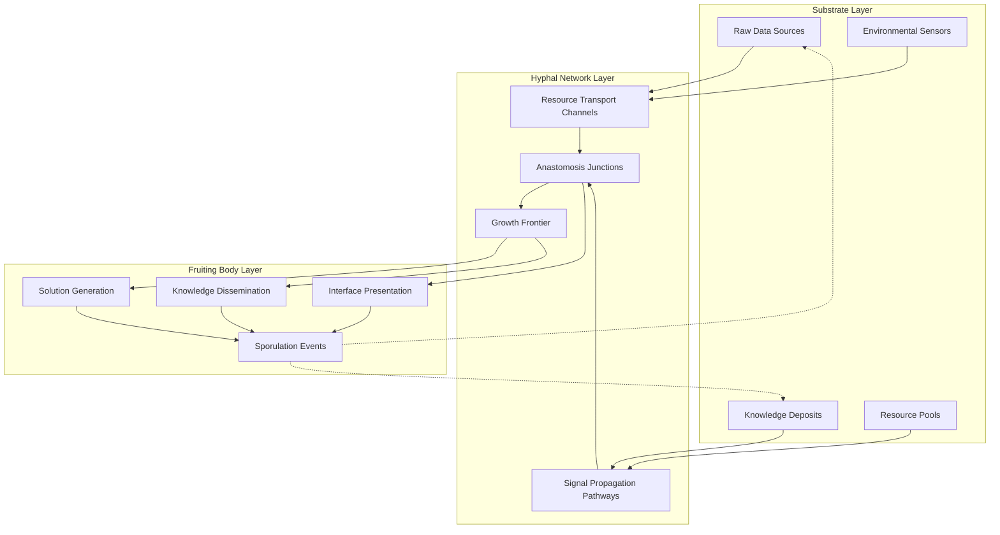
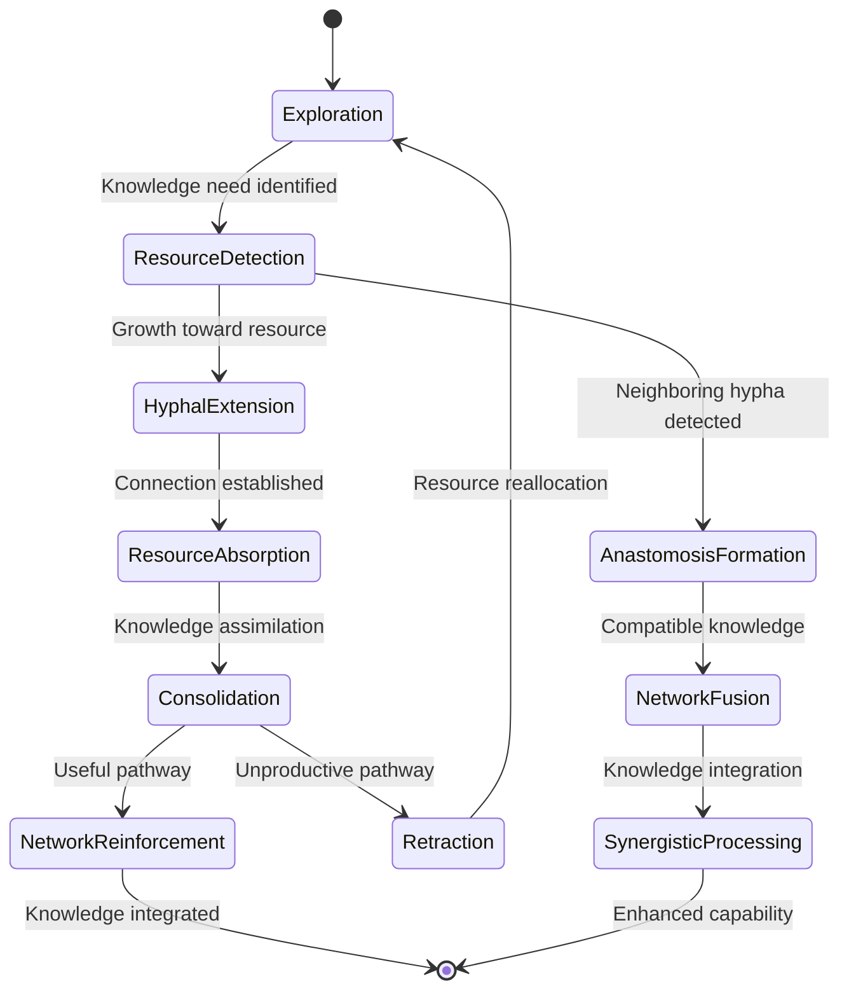
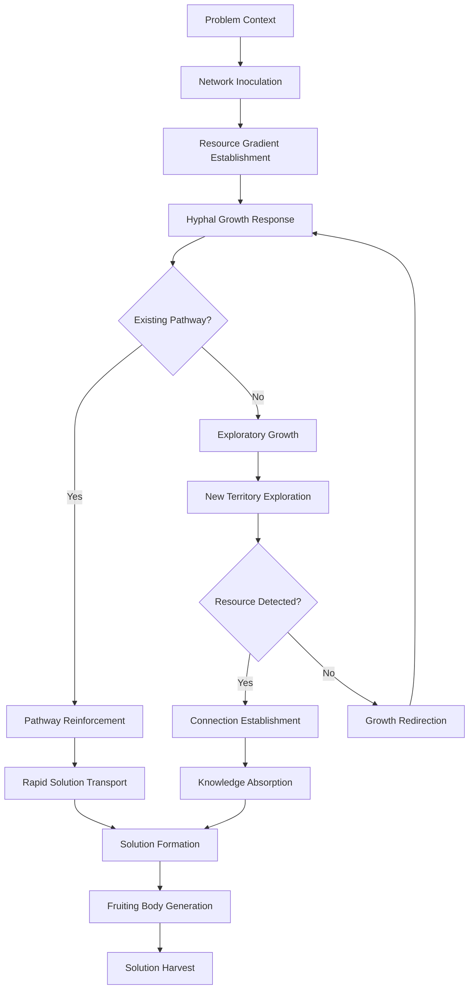
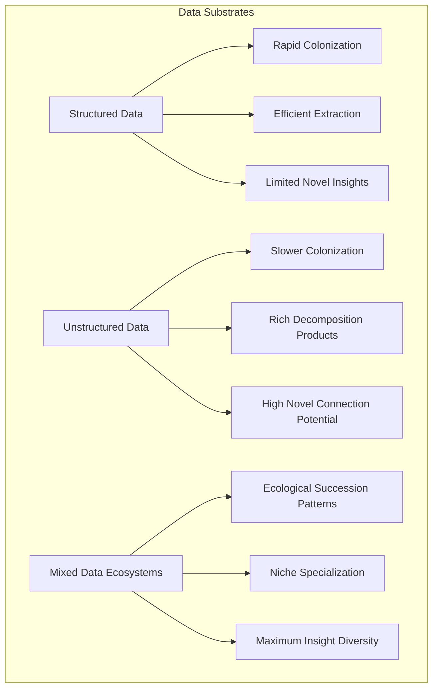
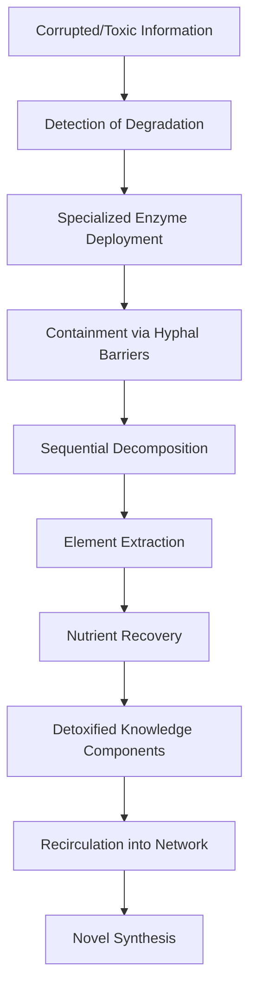

# Mycelial Network Intelligence & CEREBRUM

## Introduction: The Fungal Mind

Mycelial Network Intelligence (MNI) proposes a radical reimagining of distributed intelligence systems inspired by the vast underground networks of fungi. By integrating mycelial principles with CEREBRUM's case-based reasoning architecture, we create a framework for intelligence that embraces rhizomatic knowledge organization, nutrient-based information exchange, and decomposition-synthesis cognitive cycles.

This paper explores how the complex interconnected structures of fungal mycelium networks can inform new approaches to case representation, retrieval, and adaptation. The fundamental insight is that distributed intelligence need not follow hierarchical or centralized patterns, but can emerge from decentralized, resource-sharing networks that dynamically respond to environmental conditions.

## Theoretical Foundations

### Rhizomatic Knowledge Organization

MNI-CEREBRUM organizes knowledge in non-hierarchical rhizomatic structures where:

1. **Networked Case Repository**: Cases are distributed across a vast interconnected network
2. **No Central Control**: Processing emerges from local interactions without central coordination
3. **Heterarchical Organization**: Multiple overlapping organizational principles coexist
4. **Asynchronous Growth**: Knowledge structures expand opportunistically based on resource availability

### Hyphal Information Pathways

Inspired by fungal hyphae (thread-like filaments), MNI-CEREBRUM implements specialized information pathways:

1. **Nutrient Gradient Signaling**: Information flows follow resource concentration gradients
2. **Anastomosis Junctions**: Knowledge structures merge at critical connection points
3. **Septate Compartmentalization**: Information can be isolated within specialized segments
4. **Mycelial Highways**: High-bandwidth channels connecting distant knowledge regions

## Architectural Components

### Mycorrhizal Interfaces

MNI-CEREBRUM implements symbiotic interfaces with external knowledge sources:

1. **Ectomycorrhizal Interfaces**: Surface-level data exchange with minimal processing
2. **Endomycorrhizal Interfaces**: Deep integration where external data is transformed and assimilated
3. **Mycorrhizal Helper Systems**: Intermediary processes that facilitate knowledge exchange
4. **Resource Allocation Protocols**: Systems for distributing computational resources based on need

### Decomposition-Synthesis Cycles

Inspired by fungi's role in breaking down and recycling organic matter, MNI-CEREBRUM implements:

1. **Knowledge Decomposition**: Breaking complex cases into constituent nutrients
2. **Element Redistribution**: Moving knowledge components to where they're needed
3. **Novel Synthesis**: Recombining elements into new knowledge structures
4. **Waste Recycling**: Repurposing deprecated or failed case elements

## Mycelial Network Architecture

## Hyphal Growth Dynamics

## Mycelial Processing Mechanisms

| Fungal Mechanism | Computational Analogue | Implementation | Benefit |
|------------------|------------------------|----------------|---------|
| Nutrient Absorption | Data Acquisition | Resource-guided attention | Efficient information gathering |
| Hyphal Fusion | Knowledge Integration | Dynamic network reconfiguration | Novel connection formation |
| Enzymatic Decomposition | Complex Problem Decomposition | Pattern fragmentation algorithms | Breaking problems into solvable parts |
| Directional Growth | Strategic Resource Allocation | Gradient-following computation | Optimized processing pathways |
| Fruiting Body Formation | Solution Crystallization | Emergent insight generation | Tangible outputs from network activity |
| Spore Dispersal | Knowledge Distribution | Pattern replication to new contexts | Solution propagation |
| Secondary Metabolites | Meta-cognitive Signals | Network-wide state indicators | System-level coordination |

## Distributed Case Processing

## Mycelial Network Types

| Network Type | Structural Characteristics | Processing Style | Optimal Application |
|--------------|---------------------------|------------------|---------------------|
| Saprotrophic | Dense, localized networks | Deep decomposition of complex problems | Data mining, pattern extraction |
| Mycorrhizal | Widely distributed, symbiotic | Collaborative problem-solving | Multi-agent systems, API integration |
| Parasitic | Targeted, resource-extractive | Focused solution extraction | Optimization problems, resource allocation |
| Endophytic | Embedded, non-disruptive | Hidden layer processing | Background analytics, passive monitoring |
| Lichen-forming | Composite, multi-organism | Hybrid processing systems | Cross-domain integration, symbiotic computing |

## Substrate Utilization Patterns

MNI-CEREBRUM efficiency varies based on the knowledge substrate it operates within:

## Experimental Results

Initial applications of MNI-CEREBRUM have shown promising results in domains requiring distributed intelligence:

| Domain | Traditional CBR Performance | MNI-CEREBRUM Performance | Key Advantage |
|--------|----------------------------|--------------------------|---------------|
| Supply Chain Optimization | Centralized bottlenecks | Distributed adaptation | Resilience to disruption |
| Knowledge Management | Rigid taxonomies | Emergent categorization | Discovers unexpected connections |
| Sensor Networks | Point-to-point communication | Resource-based signaling | Self-organizing prioritization |
| Distributed Computing | Load-balanced processing | Opportunistic processing | Adapts to resource availability |
| Complex System Modeling | Hierarchical decomposition | Rhizomatic exploration | Captures emergent behaviors |

## Mycoremediation of Knowledge

MNI-CEREBRUM excels at processing degraded, corrupted, or toxic information through mycoremediation:

## Future Research Directions

MNI-CEREBRUM opens numerous exciting research paths:

1. Development of physical computing substrates that mimic mycelial networks
2. Integration with actual fungal systems for hybrid bio-digital intelligence
3. Exploration of psychedelic-inspired non-linear information processing
4. Implementation of entropy-based decomposition and synthesis cycles
5. Creation of self-organizing knowledge ecosystems with multiple "species" of processing elements
