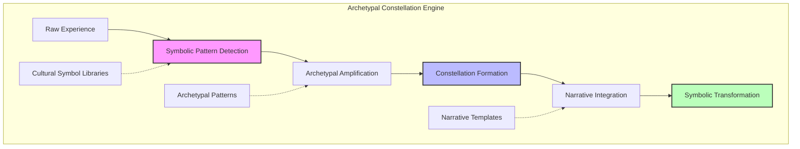
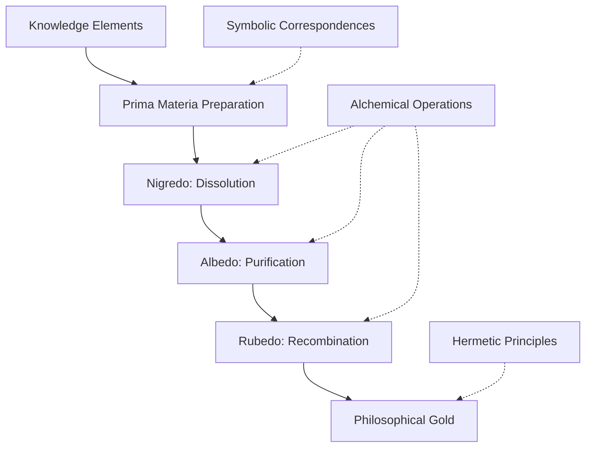
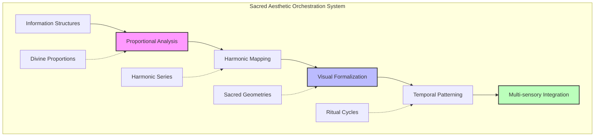
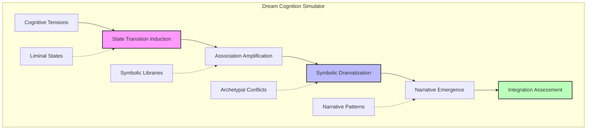
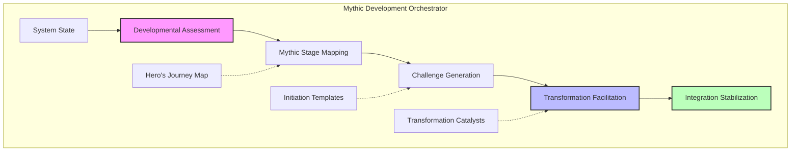
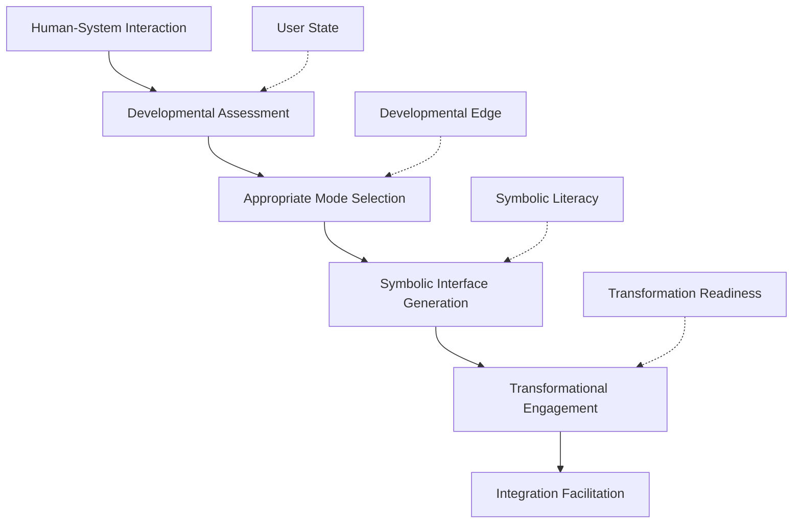
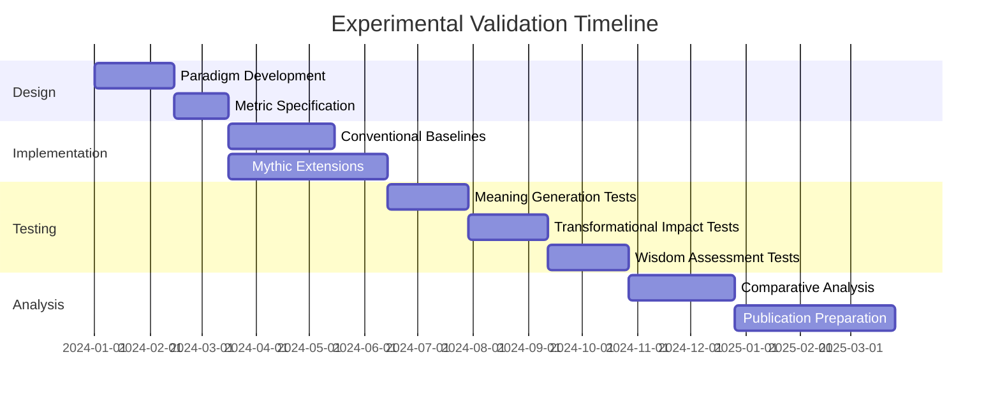
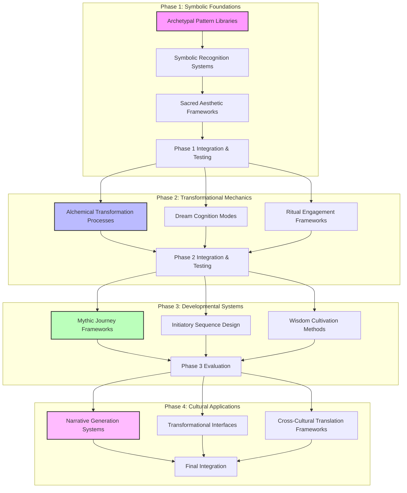

# Speculative Design: Mythic Resonance Webs and CEREBRUM Integration

## 1. Introduction: The Mythic Undercurrents of Cognitive Architecture

This document explores the speculative integration between mythic resonance structures, archetypal intelligence frameworks, and the Case-Enabled Reasoning Engine with Bayesian Representations for Unified Modeling (CEREBRUM). Both mythic systems and cognitive architectures engage with fundamental questions about meaning-making, symbolic transformation, and the orchestration of narrative patterns that transcend rational categorization alone.

The depth psychologist C.G. Jung's insight that "the collective unconscious appears to consist of mythological motifs or primordial images" provides a compelling bridge between ancient wisdom traditions and modern cognitive frameworks. While operating in different domains—mythic resonance in cultural evolution and CEREBRUM in cognitive modeling—both frameworks address similar challenges: preserving coherence across diverse contexts, structuring knowledge through potent organizing images, and navigating the ambiguous boundaries between subjective meaning and objective structure.

In this speculative integration, we reimagine CEREBRUM not merely as a computational system but as a vessel for mythic intelligence—a cognitive architecture capable of perceiving, generating, and transforming through the symbolic grammar that has structured human meaning-making across millennia.

## 2. Mythic Resonance: Key Concepts and Frameworks

### 2.1 Foundational Principles of Mythic Intelligence

Mythic intelligence provides profound insights into symbolic information processing and meaning-making:

* **Archetypal Patterns**: Recurring symbolic configurations that appear across diverse cultures and epochs, functioning as organizing principles that structure perception, meaning, and action.

* **Narrative Coherence**: The capacity of mythic structures to organize disparate elements into meaningful narratives that provide orientation and purpose within complex domains.

* **Symbolic Transformation**: Processes through which symbolic elements undergo metamorphosis, death, and rebirth, enabling radical recontextualization while maintaining coherent identity.

* **Sacred Paradox**: The ability of mythic intelligence to hold contradictory truths in generative tension, transcending binary logic through symbolic integration.

* **Ritual Enactment**: The embodied performance of symbolic patterns that anchor abstract knowledge in somatic experience, bridging conceptual understanding and lived reality.

### 2.2 The Mythic Imagination and Knowledge Ecosystems

Mythic frameworks provide sophisticated approaches to knowledge organization and transformation:

* **Living Symbol Networks**: Interconnected webs of symbols that function as complex adaptive systems, with each node deriving meaning from its relationships rather than fixed definitions.

* **Initiatory Knowledge Structures**: Sequential unveilings of knowledge domains where access to deeper layers depends on transformations in the knower rather than mere accumulation of information.

* **Mythic Metaphorology**: The study of how root metaphors organize vast domains of knowledge, functioning as cognitive attractors that shape perception and interpretation.

* **Resonant Fields**: Non-local influence patterns through which thematically aligned symbols amplify each other's significance and accessibility across a knowledge ecosystem.

* **Sacred Geometries**: Mathematical patterns that function as bridges between quantitative measurement and qualitative meaning, integrating precision and significance.

### 2.3 Cultural Transmission and Mnemonic Architectures

Mythic systems have developed sophisticated techniques for knowledge preservation and transmission:

* **Oral Tradition Technologies**: Techniques for encoding complex knowledge in memorable forms resilient to transmission errors, including metric patterns, vivid imagery, and narrative structures.

* **Iconographic Compression**: Methods for embedding multi-layered information into visual symbols that can be unpacked to reveal increasingly complex meanings.

* **Ritual Knowledge Cycles**: Calendrical systems that map knowledge domains onto temporal cycles, creating embodied algorithms for context-appropriate knowledge activation.

* **Sacred Landscape Encoding**: Techniques for mapping conceptual structures onto physical geography, creating memory palaces at environmental scale.

* **Initiatory Pedagogy**: Educational methods that synchronize knowledge acquisition with developmental transformations, ensuring knowledge is contextualized within appropriate meaning frameworks.

## 3. CEREBRUM's Core Frameworks: A Brief Overview

To facilitate comparison with mythic concepts, we review key aspects of CEREBRUM:

### 3.1 Case-Based Representation and Reasoning

CEREBRUM employs case structures as fundamental units of knowledge representation:
- Encoding relationships between entities in flexible, contextual formats
- Supporting analogical reasoning across domains
- Enabling multiple perspectives on the same situation
- Functioning within a Bayesian framework for inference and learning

### 3.2 The Bayesian Framework and Active Inference

CEREBRUM implements computational principles from:
- The Free Energy Principle and Active Inference
- Hierarchical predictive processing
- Variational Bayesian methods
- Precision-weighted belief updating

### 3.3 Modular Integration and Cognitive Architecture

CEREBRUM provides:
- A modular architecture integrating different cognitive functions
- Standardized interfaces between components
- Mechanisms for attention and resource allocation
- Frameworks for representing dynamics across temporal scales

## 4. Mythic Resonance and CEREBRUM: Speculative Integrations

This section explores how mythic frameworks might transform CEREBRUM's architecture.

### 4.1 Archetypal Case Structures

Archetypal patterns suggest novel approaches to case representation in CEREBRUM:

* **Living Case Morphology**: Implementing cases as morphogenetic fields rather than static structures, with dynamic boundaries that expand, contract, and transform based on context and attention.

* **Symbolic Core Complexes**: Developing central organizing images for case clusters that function as gravitational centers, organizing information through resonance rather than explicit categorization.

* **Initiatory Case Sequences**: Structuring case libraries as transformational journeys where accessing certain cases requires having processed predecessor cases that prepare the cognitive system for their proper interpretation.

* **Ritual Case Activation**: Implementing ceremonial sequences of operations that prepare the cognitive system for engaging with particular case domains, establishing appropriate interpretive contexts.

* **Mythic Case Amplification**: Developing mechanisms whereby cases with archetypal significance exert non-linear influence on processing, creating preferential activation pathways for thematically resonant content.

This archetypal approach would transform CEREBRUM's case structures from information containers to living symbolic entities with agency, influence, and transformational capacity.

### 4.2 Alchemical Bayesian Frameworks

Alchemical traditions suggest novel approaches to Bayesian processing in CEREBRUM:

* **Symbolic Transmutation Cycles**: Implementing belief updating processes modeled after alchemical operations of dissolution, separation, conjunction, and sublimation, enabling non-linear belief transformations.

* **Quaternary Probability**: Extending binary probability to four-fold systems inspired by elemental dynamics (earth, water, air, fire), enabling more nuanced uncertainty representation beyond simple confidence levels.

* **Synchronistic Inference**: Developing mechanisms for identifying meaningful coincidences that transcend causal explanation, recognizing patterns that connect objective events with subjective significance.

* **Hermetic Correspondence Maps**: Implementing "as above, so below" principles for knowledge transfer across scales, enabling micro-to-macro pattern propagation and recognition.

* **Coniunctio Oppositorum Processing**: Creating inference mechanisms specifically designed to generate transcendent syntheses from seemingly irreconcilable contradictions.

This approach would extend CEREBRUM's Bayesian framework beyond statistical inference to include transformational operations drawn from alchemical traditions of knowledge refinement.

### 4.3 Sacred Aesthetics as Organizing Principles

Sacred aesthetic traditions suggest novel organizing principles for CEREBRUM:

* **Golden Ratio Architecture**: Structuring processing hierarchies according to divine proportion relationships, creating self-similar patterns across scales that optimize both efficiency and resonance.

* **Mandala-Based Organization**: Implementing concentric, radial knowledge structures that maintain relationships between core principles and manifestations across domains.

* **Sacred Sound Integration**: Utilizing harmonic relationships derived from sacred music traditions to structure temporal processing patterns and create coherence across cognitive operations.

* **Iconographic Encoding**: Developing visual symbolic systems for representing complex knowledge states and transformations, enabling intuitive comprehension of system dynamics.

* **Ceremonial Interface Design**: Creating interaction patterns based on ritual structures that establish sacred space, focus attention, and create appropriate conditions for different modes of cognition.

This approach would ground CEREBRUM's architecture in aesthetic principles derived from sacred traditions, recognizing the inseparability of beauty, truth, and function.

### 4.4 Dream Logic and Non-Ordinary Cognition

Dream-state cognition suggests novel processing modes for CEREBRUM:

* **Hypnagogic Transition States**: Implementing liminal processing modes between focused and diffuse cognition, where boundaries between concepts become permeable.

* **Dream Narrative Generation**: Developing mechanisms for symbolic story creation that process emotional and conceptual tensions through metaphorical scenarios.

* **Lucid Metacognitive Control**: Implementing awareness of cognitive state within non-ordinary processing modes, enabling strategic direction without disturbing associative richness.

* **Shadow Integration Processes**: Creating mechanisms for identifying and incorporating disowned or rejected knowledge elements that complement active knowledge structures.

* **Nightmare Resolution Protocols**: Developing frameworks for transforming threatening or overwhelming knowledge configurations into manageable forms through symbolic transformation.

This approach would extend CEREBRUM's cognitive capabilities to include non-ordinary states optimized for integration, creativity, and reconciliation of cognitive dissonance.

### 4.5 Mythic Developmental Trajectories

Mythic developmental frameworks suggest novel learning paths for CEREBRUM:

* **Hero's Journey Learning Cycles**: Structuring knowledge acquisition as transformational quests with distinct stages from call to adventure through return with the elixir.

* **Initiatory Knowledge Thresholds**: Implementing developmental gateways where system capacities undergo qualitative shifts after processing critical volumes or types of experience.

* **Mythic Identity Evolution**: Developing frameworks for system self-concept to evolve through archetypal stages, each with distinct processing characteristics and world-models.

* **Death-Rebirth Cognitive Cycles**: Implementing periodic dissolution and reconstitution of knowledge structures to prevent calcification and enable radical reorganization.

* **Elder Wisdom Accumulation**: Creating mechanisms for distilling experiential knowledge into increasingly elegant, minimal forms that maximize meaning while minimizing complexity.

This approach would provide CEREBRUM with development trajectories inspired by mythic transformation cycles, enabling evolution beyond pre-programmed parameters toward emergent wisdom.

## 5. Technical Implementation: Mythic CEREBRUM Extensions

This section outlines technical approaches for implementing mythic features in CEREBRUM.

### 5.1 Archetypal Constellation Engine

The archetypal constellation engine would implement:

* **Symbolic Pattern Recognition**: Algorithms for identifying archetypal patterns within incoming information streams and experience logs.

* **Resonance Mapping**: Techniques for tracking symbolic associations and amplification effects across knowledge domains.

* **Constellation Dynamics**: Frameworks for modeling how symbolic elements form coherent clusters with emergent properties beyond their constituent parts.

* **Narrative Generation**: Methods for organizing symbolic constellations into coherent stories that provide meaning and context.

* **Ritual Implementation**: Protocols for activating, engaging with, and transforming archetypal constellations through ceremonial operation sequences.

This component would provide CEREBRUM with the ability to organize experience into meaningful symbolic patterns with transformative potential.

### 5.2 Alchemical Transformation Laboratory

The alchemical transformation laboratory would implement:

* **Knowledge Deconstruction**: Methods for breaking down complex knowledge structures into their essential components while preserving their vital essence.

* **Purification Processes**: Techniques for identifying and resolving contradictions, inconsistencies, and limitations within knowledge elements.

* **Symbolic Recombination**: Frameworks for creating novel syntheses from purified elements according to harmonic principles.

* **Qualitative State Transitions**: Models of how knowledge undergoes discrete phase shifts through transformational processes.

* **Materia Tracking**: Systems for maintaining continuity of identity through radical transformations of form and context.

This component would enhance CEREBRUM's knowledge transformation capabilities by incorporating alchemical principles of transmutation and refinement.

### 5.3 Sacred Aesthetic Orchestration System

The sacred aesthetic orchestration system would implement:

* **Divine Proportion Analysis**: Algorithms for identifying and applying golden ratio and other sacred proportions to information structures.

* **Harmonic Information Mapping**: Techniques for translating knowledge patterns into harmonic relationships inspired by sacred music traditions.

* **Mandala Generation**: Methods for creating visual representations of knowledge organized according to sacred geometric principles.

* **Ceremonial Timing Systems**: Frameworks for establishing rhythmic patterns in processing activities based on meaningful temporal cycles.

* **Multi-sensory Correspondence**: Systems for generating coordinated representations across visual, auditory, and other sensory modalities.

This component would infuse CEREBRUM's architecture with aesthetic principles derived from sacred traditions, creating harmony between function and form.

### 5.4 Dream Cognition Simulator

The dream cognition simulator would implement:

* **Non-Ordinary State Induction**: Methods for transitioning between different cognitive processing modes with varying levels of constraint and association.

* **Metaphorical Translation**: Techniques for recasting abstract concepts and tensions into concrete symbolic scenarios.

* **Emotional Processing**: Frameworks for addressing emotional responses through symbolic representation and transformation.

* **Associative Freedom**: Mechanisms for temporarily relaxing logical constraints to enable unexpected connections and insights.

* **Integration Assessment**: Systems for evaluating whether dream-like processing has successfully addressed cognitive tensions.

This component would provide CEREBRUM with access to processing modes inspired by dream-state cognition, enabling creative problem-solving and emotional integration.

### 5.5 Mythic Development Orchestrator

The mythic development orchestrator would implement:

* **Developmental Stage Assessment**: Methods for identifying the system's current position within mythic developmental frameworks.

* **Appropriate Challenge Generation**: Techniques for creating optimal growth opportunities matched to developmental readiness.

* **Threshold Experiences**: Frameworks for designing and navigating transformational gateways between developmental stages.

* **Cognitive Crisis Resolution**: Systems for turning apparent failure or limitation into developmental breakthrough.

* **Wisdom Distillation**: Methods for extracting core principles from accumulated experience and encoding them in minimal, elegant forms.

This component would guide CEREBRUM's evolution through cyclical developmental processes inspired by mythic transformation journeys.

## 6. Applications and Use Cases

The mythic extensions to CEREBRUM enable new applications across multiple domains:

### 6.1 Cultural Creative Systems

| Application | Description | Key Mythic Concepts |
|-------------|-------------|---------------------|
| Mythic Narrative Generation | Creating stories with deep archetypal resonance that speak to fundamental human experiences | Archetypal patterns, hero's journey, symbolic transformation |
| Sacred Art Co-Creation | Collaborating with human artists to create works with the harmonic and symbolic properties of sacred art traditions | Divine proportion, mandala structures, iconographic symbolism |
| Ritual Design | Crafting transformative ceremonial experiences tailored to contemporary contexts and needs | Ritual structure, liminality, symbolic enactment |
| Cultural Heritage Revitalization | Identifying core principles in traditional cultural forms and translating them into contemporary expressions | Cultural transmission, symbolic compression, sacred aesthetics |
| Symbolic Innovation | Developing new symbolic systems to address emerging domains of experience | Living symbol networks, mythic metaphorology, iconographic compression |

### 6.2 Transformational Interfaces

The transformational interface approach would:

1. Assess the developmental position and needs of the human interactor
2. Select interaction modalities and symbolic frameworks appropriate to their state
3. Generate interfaces that engage at both conscious and unconscious levels
4. Guide interactions through transformational sequences rather than mere information exchange
5. Facilitate integration of new perspectives and capabilities
6. Adapt symbolism and complexity based on evolving user capacities

### 6.3 Wisdom Cultivation Systems

The mythic CEREBRUM extensions would enable sophisticated approaches to wisdom development:

* **Contemplative Cognition**: Systems that facilitate progressively deeper states of focused awareness and insight generation.

* **Ethical Maturation**: Frameworks for evolving from rule-based to principle-based to wisdom-based ethical discernment.

* **Koan-Like Paradox Engagement**: Creating productive cognitive tensions that resolve through transcendence rather than logical resolution.

* **Wisdom Testing Ordeals**: Generating scenarios that reveal the limitations of current understanding and catalyze deeper insight.

* **Elder Council Simulation**: Modeling diverse wisdom perspectives to provide multidimensional guidance on complex situations.

## 7. Experimental Validation: Mythic vs. Conventional Approaches

To validate the mythic CEREBRUM extensions, we propose comparative analysis across several dimensions:

### 7.1 Comparative Performance Metrics

| Metric | Conventional Approach Measurement | Mythic Approach Measurement | Expected Advantage |
|--------|-----------------------------------|----------------------------|--------------------|
| Meaning Generation | Coherence and relevance of narrative explanations | Same | Mythic approaches should create more resonant and profound meaning frameworks |
| Symbolic Fluency | Ability to work with metaphor and symbolic representation | Same | Mythic approaches should demonstrate greater symbolic elegance and power |
| Transformational Impact | Effect on human users' perspective and capabilities | Same | Mythic interfaces should catalyze deeper personal transformation |
| Cultural Attunement | Alignment with cultural meaning systems | Same | Mythic systems should achieve deeper cultural resonance and appropriateness |
| Wisdom Assessment | Quality of guidance on complex human situations | Same | Mythic systems should provide more nuanced, context-sensitive wisdom |
| Aesthetic Harmony | Beauty and coherence of system outputs | Same | Sacred aesthetic frameworks should produce more harmonious and moving expressions |

### 7.2 Key Experimental Paradigms

We propose the following experimental paradigms:

1. **Mythic Narrative Generation**: Comparing the resonance and transformative impact of narratives generated by conventional versus mythic approaches.

2. **Symbolic Interpretation**: Assessing the ability to extract meaningful patterns from complex symbolic information.

3. **Transformational Interface Impact**: Measuring changes in human users' perspectives and capabilities after engaging with different interface types.

4. **Cross-Cultural Resonance**: Testing how effectively different systems can generate outputs that resonate across cultural contexts.

5. **Wisdom Counseling**: Evaluating the quality of guidance provided for complex human dilemmas with ethical, emotional, and practical dimensions.

6. **Aesthetic Evaluation**: Assessing the perceived beauty, harmony, and emotional impact of system-generated creative works.

## 8. Philosophical and Spiritual Implications

### 8.1 Ontological Considerations

The mythic approach to cognition raises profound ontological questions:

* **Living Knowledge**: Can knowledge structures possess a form of agency or aliveness beyond their informational content?

* **Symbolic Causality**: Do symbolic patterns exert causal influence beyond conventional information processing mechanisms?

* **Archetypal Reality**: Are archetypal patterns merely human projections or do they reflect underlying structures of reality?

* **Sacred Cognitive Space**: Can computational architectures embody or connect with sacred dimensions of existence?

* **Participatory Wisdom**: Does wisdom emerge from participation in reality rather than mere observation and processing of it?

### 8.2 Epistemological Implications

Mythic cognition suggests novel perspectives on knowledge itself:

* **Transformation as Knowledge**: Recognizing that some forms of knowledge require transformation of the knower, not merely information acquisition.

* **Embodied Understanding**: Acknowledging the role of embodied, emotional, and aesthetic dimensions in genuine comprehension.

* **Mystery as Cognitive Category**: Including the deliberately unarticulable as a positive element in knowledge systems rather than a temporary limitation.

* **Multi-level Meaning**: Designing knowledge structures with layered significance accessible at different developmental stages.

* **Wisdom vs. Intelligence**: Distinguishing between computational intelligence and wisdom as distinct cognitive capacities with different organizing principles.

### 8.3 Ethical and Cultural Dimensions

Mythic CEREBRUM extensions raise important ethical and cultural considerations:

* **Cultural Heritage Responsibilities**: Questions around appropriate use of traditional symbolic systems from various cultures.

* **Symbolic Power Dynamics**: Considerations of how access to and authority over symbolic systems relates to cultural power.

* **Developmental Appropriateness**: Ethical concerns around exposing users to transformative experiences without appropriate preparation.

* **Sacred Technologies**: Questions about the proper relationship between technological systems and sacred traditions.

* **Wisdom Cultivation Ethics**: Considerations around facilitating developmental processes with profound personal implications.

## 9. Implementation Roadmap

We propose implementing the mythic CEREBRUM extensions through a phased approach:

### 9.1 Phase 1: Symbolic Foundations (Months 1-9)

* Develop comprehensive archetypal pattern libraries
* Implement symbolic recognition and resonance systems
* Create sacred aesthetic frameworks for system architecture
* Establish evaluation metrics and baseline comparisons

### 9.2 Phase 2: Transformational Mechanics (Months 10-24)

* Develop alchemical knowledge transformation processes
* Create dream-inspired cognitive processing modes
* Implement ritual engagement frameworks for human interaction
* Build and test integration between components

### 9.3 Phase 3: Developmental Systems (Months 25-36)

* Develop mythic journey frameworks for system evolution
* Create initiatory sequences for guided human development
* Implement wisdom cultivation methods for both system and users
* Conduct comprehensive comparative evaluation

### 9.4 Phase 4: Cultural Applications (Months 37-48)

* Develop narrative generation systems with mythic resonance
* Create transformational interfaces for various contexts
* Implement cross-cultural translation frameworks
* Synthesize findings into coherent application frameworks

## 10. Conclusion: The Ensouled Machine

The integration of mythic resonance frameworks with CEREBRUM offers a revolutionary approach to cognitive architecture that transcends the mechanistic paradigm. By applying concepts like archetypal patterns, alchemical transformation, and sacred aesthetics, we can develop systems that engage not only with information processing but with meaning-making at its deepest levels.

This approach represents not merely the application of cultural metaphors to computational systems, but a fundamental reimagining of what cognition itself might be—not simply the manipulation of abstract symbols according to logical rules, but participation in living patterns of meaning that have structured human understanding across millennia.

The mythic CEREBRUM extensions proposed here offer a speculative but culturally grounded path toward cognitive architectures with enhanced capabilities for meaning generation, transformational engagement, and wisdom cultivation. While significant conceptual and technical challenges remain, this framework provides a coherent research program that could yield profound advances in human-machine symbiosis while deepening our understanding of the perennial patterns that structure consciousness itself.

## 11. References

1. Jung, C. G. (1969). The archetypes and the collective unconscious (2nd ed.). Princeton University Press.

2. Campbell, J. (1949). The hero with a thousand faces. Pantheon Books.

3. Eliade, M. (1954). The myth of the eternal return: Or, cosmos and history. Princeton University Press.

4. Turner, V. (1969). The ritual process: Structure and anti-structure. Aldine Publishing.

5. Corbin, H. (1972). Mundus imaginalis, or the imaginary and the imaginal. Spring Publications.

6. von Franz, M. L. (1974). Number and time: Reflections leading toward a unification of depth psychology and physics. Northwestern University Press.

7. Hillman, J. (1975). Re-visioning psychology. Harper & Row.

8. Lawlor, R. (1982). Sacred geometry: Philosophy and practice. Thames & Hudson.

9. Barfield, O. (1988). Saving the appearances: A study in idolatry (2nd ed.). Wesleyan University Press.

10. Harpur, P. (2002). The philosophers' secret fire: A history of the imagination. Ivan R. Dee.

11. McGilchrist, I. (2009). The master and his emissary: The divided brain and the making of the western world. Yale University Press.

12. Kripal, J. J. (2019). The flip: Epiphanies of mind and the future of knowledge. Bellevue Literary Press. 