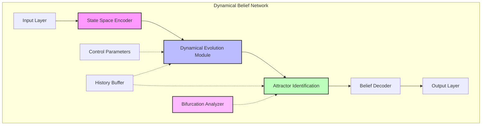
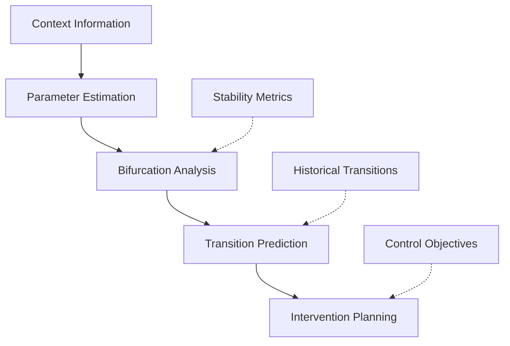
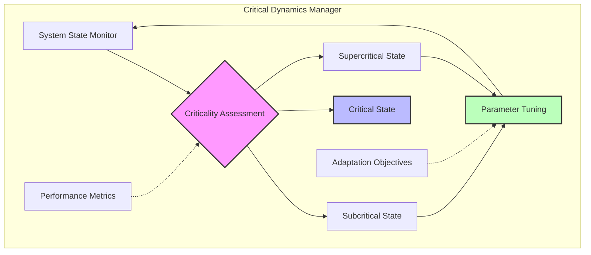
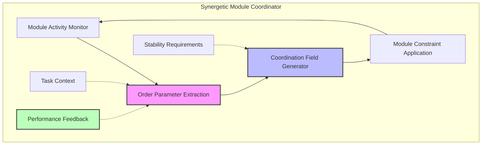
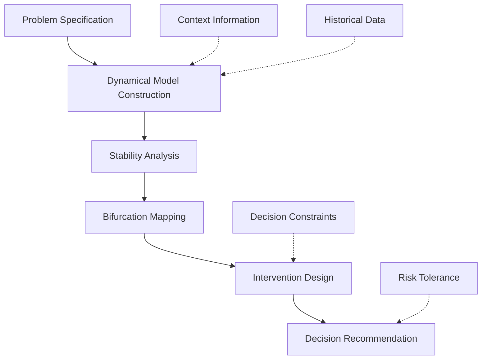
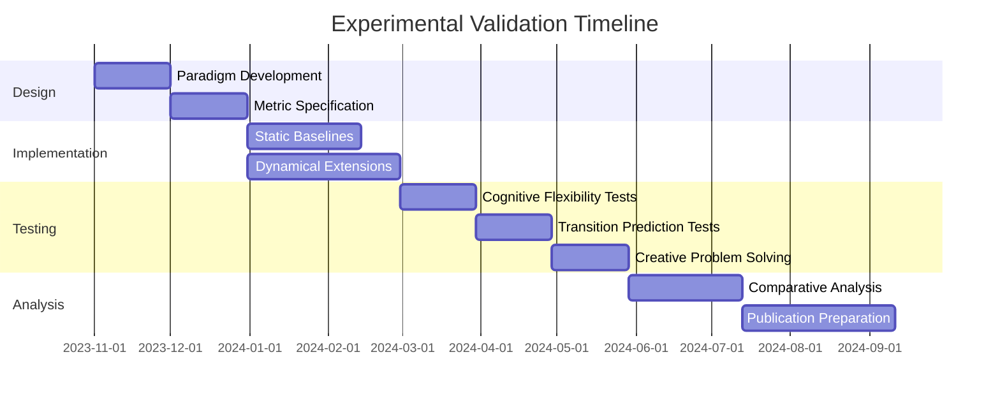
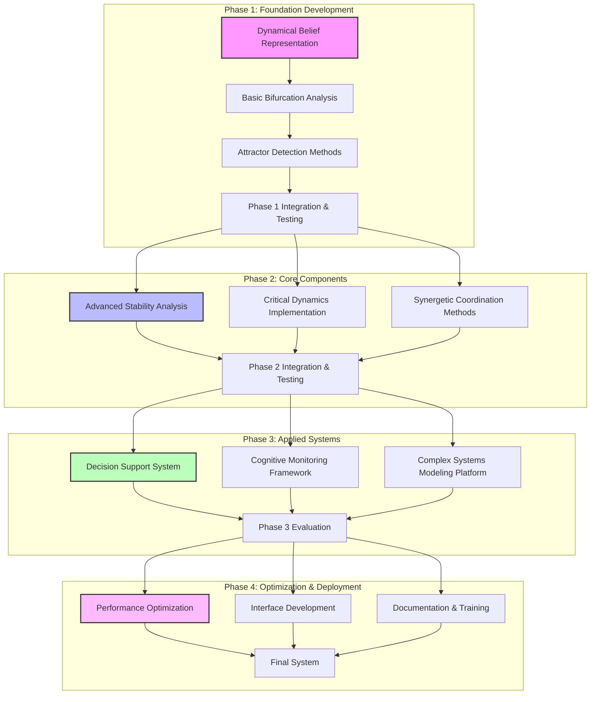

# Speculative Design: Nonlinear Dynamics, Bifurcations, and CEREBRUM Integration

## 1. Introduction: Dynamics of Thought and Computation

This document explores the speculative integration between nonlinear dynamics, bifurcation theory, and the Case-Enabled Reasoning Engine with Bayesian Representations for Unified Modeling (CEREBRUM). Both nonlinear dynamics and CEREBRUM engage with fundamental questions about complex system behavior, state transitions, and the emergence of order from underlying processes.

The mathematician Henri Poincaré's insight that "small differences in initial conditions produce very great ones in the final phenomena" presents a striking parallel to the challenges of cognitive modeling in CEREBRUM, where subtle contextual shifts can produce dramatically different inferences. While operating in different domains—dynamical systems theory in mathematics and physics, and CEREBRUM in computational cognitive modeling—both frameworks address similar challenges: characterizing complex state spaces, understanding transitions between qualitatively different behaviors, and modeling how simple underlying rules generate emergent complexity.

## 2. Nonlinear Dynamics and Bifurcation Theory: Key Concepts

### 2.1 Foundational Principles of Nonlinear Dynamics

Nonlinear dynamics provides a mathematical framework for understanding complex, time-evolving systems whose behavior cannot be understood through simple superposition of components.

* **Nonlinearity**: Unlike linear systems where effects are proportional to causes, nonlinear systems exhibit disproportionate or qualitatively different responses to inputs. The whole is different from the sum of its parts.

* **State Space and Attractors**: The state of a system can be represented as a point in a multidimensional space, with dynamics described as trajectories through this space. Attractors are regions that trajectories tend toward over time, representing stable patterns of behavior.

* **Types of Attractors**:
  * Fixed points: States where the system comes to rest
  * Limit cycles: Periodic oscillations
  * Tori: Quasi-periodic motion on toroidal surfaces
  * Strange attractors: Complex, fractal structures associated with chaotic dynamics

* **Basins of Attraction**: Regions of state space that lead to particular attractors, separated by boundaries that determine which end state a given initial condition will reach.

* **Sensitivity to Initial Conditions**: In chaotic systems, trajectories that start arbitrarily close together diverge exponentially over time, making long-term prediction practically impossible despite deterministic dynamics.

### 2.2 Bifurcation Theory: Understanding System Transitions

Bifurcation theory studies how qualitative changes in system behavior occur as parameters are continuously varied.

* **Bifurcation Points**: Critical parameter values where the number or stability of equilibria or periodic orbits changes, resulting in qualitatively different system behaviors.

* **Types of Bifurcations**:
  * Saddle-node: Creation or destruction of fixed points
  * Hopf: Transition between steady state and oscillatory behavior
  * Period-doubling: Cascade of changes in oscillatory behavior often leading to chaos
  * Transcritical: Exchange of stability between existing fixed points
  * Pitchfork: Symmetry-breaking transitions where one stable state splits into two

* **Bifurcation Diagrams**: Visual representations showing how system states change as control parameters vary, revealing the structure of transitions between different dynamical regimes.

* **Catastrophes**: Special classes of bifurcations in gradient systems, classified by René Thom into seven elementary catastrophes (fold, cusp, swallowtail, butterfly, hyperbolic, elliptic, and parabolic).

* **Control Parameters vs. Order Parameters**: Control parameters are external variables that can be manipulated to drive the system through bifurcations, while order parameters characterize the resulting system state or pattern.

### 2.3 Relevant Analytical Techniques

Several techniques from nonlinear dynamics have potential applications to cognitive modeling:

* **Stability Analysis**: Determining the stability of equilibria by analyzing how small perturbations grow or decay over time.

* **Lyapunov Exponents**: Quantifying the rate of separation of initially close trajectories, providing a measure of chaos and predictability.

* **Poincaré Sections**: Reducing continuous dynamics to discrete maps by examining intersections of trajectories with a defined surface in state space.

* **Recurrence Plots**: Visualizing recurring patterns in time series data, revealing hidden structures in complex dynamics.

* **Delay Embedding**: Reconstructing attractor dynamics from time series observations of a single variable, based on Takens' embedding theorem.

* **Synergetics**: Hermann Haken's framework for studying self-organization in complex systems through the identification of order parameters and their dynamics.

## 3. CEREBRUM's Core Frameworks: A Brief Overview

To facilitate comparison with dynamical systems concepts, we review key aspects of CEREBRUM:

### 3.1 Case-Based Representation and Reasoning

CEREBRUM employs case structures as fundamental units of knowledge representation:
- Encoding relationships between entities in flexible, contextual formats
- Supporting analogical reasoning across domains
- Enabling multiple perspectives on the same situation
- Functioning within a Bayesian framework for inference and learning

### 3.2 The Bayesian Framework and Active Inference

CEREBRUM implements computational principles from:
- The Free Energy Principle and Active Inference
- Hierarchical predictive processing
- Variational Bayesian methods
- Precision-weighted belief updating

### 3.3 Modular Integration and Cognitive Architecture

CEREBRUM provides:
- A modular architecture integrating different cognitive functions
- Standardized interfaces between components
- Mechanisms for attention and resource allocation
- Frameworks for representing dynamics across temporal scales

## 4. Dynamical Systems and CEREBRUM: Speculative Integrations

This section explores how dynamical systems concepts might inform and enhance CEREBRUM's frameworks.

### 4.1 Attractor-Based Belief Representations

Nonlinear dynamics suggests novel approaches to representing beliefs in CEREBRUM:

* **Belief Attractors**: Modeling beliefs not just as probability distributions but as attractors in a dynamical state space, with different types of attractors representing different types of beliefs:
  * Fixed point attractors for stable, singular beliefs
  * Limit cycle attractors for oscillating or cyclical belief patterns
  * Strange attractors for complex, context-sensitive belief systems

* **Cognitive Basins of Attraction**: Mapping the regions in conceptual space that lead to particular belief states, with basin boundaries representing thresholds between qualitatively different interpretations.

* **Metastable Belief States**: Implementing belief representations that remain stable for extended periods before transitioning rapidly to new configurations, capturing the "aha moment" phenomenon in insight and learning.

* **Chaotic Belief Dynamics**: Modeling creative or exploratory cognitive states as chaotic dynamics that systematically explore conceptual space without settling into fixed patterns.

* **Ghost Attractors**: Implementing "almost stable" belief states that temporarily capture cognitive dynamics before revealing their instability, modeling hesitation and doubt.

This attractor-based approach would transform CEREBRUM's belief representation from static probability distributions to dynamic patterns with rich temporal behavior.

### 4.2 Bifurcation-Based Cognitive Transitions

Bifurcation theory provides powerful frameworks for modeling transitions between cognitive states:

* **Cognitive Parameter Spaces**: Identifying key control parameters that drive transitions between qualitatively different cognitive regimes, such as attention levels, emotional states, or contextual cues.

* **Catastrophic Shifts in Interpretation**: Modeling sudden perspective shifts using catastrophe theory, where small parameter changes can cause dramatic jumps between alternative interpretations.

* **Hysteresis in Belief Change**: Implementing history-dependent belief transitions where the threshold for adopting a new interpretation differs from the threshold for abandoning it once adopted.

* **Oscillatory Decision Dynamics**: Modeling decision processes that oscillate between alternatives with increasing or decreasing amplitude before settling, capturing the wavering nature of difficult choices.

* **Critical Slowing**: Implementing the phenomenon where recovery from perturbations becomes progressively slower near bifurcation points, modeling the increased sensitivity to evidence when beliefs are in flux.

This framework would enhance CEREBRUM's ability to model the rich dynamics of cognitive transitions, going beyond simple Bayesian updating to capture qualitative shifts in understanding and perspective.

### 4.3 Edge-of-Chaos Computation

The concept of computation at the "edge of chaos"—a critical region between order and disorder—suggests novel approaches for CEREBRUM:

* **Critical Cognition**: Tuning cognitive parameters to operate near critical points where the system is maximally sensitive to inputs while maintaining coherent processing.

* **Self-Organized Criticality**: Implementing mechanisms that automatically tune the system toward critical states, creating optimal conditions for information processing without external control.

* **Avalanche Dynamics**: Modeling cascades of cognitive updates that propagate through the system when triggered by new information, with power-law distributions of cascade sizes.

* **Long-Range Correlations**: Implementing critical systems that exhibit correlations across all scales, enabling coordinated processing across different cognitive domains and timescales.

* **Maximizing Information Metrics**: Tuning the system to maximize information-theoretic measures like Fisher information, statistical complexity, or predictive information at critical points.

This approach would enable CEREBRUM to operate in dynamical regimes that balance flexibility and stability, potentially enhancing its ability to adapt to novel situations while maintaining coherent cognition.

### 4.4 Synergetic Cognitive Architecture

Hermann Haken's synergetics—the study of self-organization in complex systems—suggests organizing principles for CEREBRUM:

* **Slaving Principle**: Implementing a hierarchy where slow-changing "order parameters" constrain and coordinate the dynamics of fast-changing "slave modes," creating coherent global behavior.

* **Circular Causality**: Modeling how collective variables emerge from and simultaneously constrain individual components, creating self-reinforcing patterns of cognition.

* **Order Parameter Identification**: Developing methods to automatically identify the key variables that capture essential cognitive dynamics in different contexts.

* **Competition and Cooperation**: Implementing dynamics where multiple potential interpretations compete and occasionally cooperate, with competition dominated by order parameters.

* **Symmetry Breaking**: Modeling how initially symmetric or undifferentiated cognitive states spontaneously develop structure through symmetry-breaking phase transitions.

This framework would provide CEREBRUM with principles for maintaining coherent global behavior while allowing rich local dynamics, addressing the challenge of coordinating multiple cognitive processes without centralized control.

## 5. Technical Implementation: Dynamics-Based CEREBRUM Extensions

This section outlines technical approaches for implementing dynamics-inspired features in CEREBRUM.

### 5.1 Dynamical Belief Networks

The dynamical belief network would implement:

* **State Space Representation**: Neural networks that encode probabilistic beliefs as points in a continuous state space with attractor dynamics.

* **Recurrent Dynamics**: Recurrent connections that implement the flow in this state space, with learned dynamics that create appropriate attractor structures.

* **Stability Analysis**: Real-time analysis of the stability of current belief states, with quantification of confidence based on attractor properties.

* **Bifurcation Detection**: Mechanisms for detecting when the system approaches bifurcation points where beliefs may undergo qualitative changes.

* **Lyapunov Spectrum Analysis**: Techniques for computing Lyapunov exponents in real-time to characterize the predictability and stability of cognitive dynamics.

This architecture would extend CEREBRUM's belief representation from static distributions to evolving dynamical states with rich temporal structure.

### 5.2 Bifurcation Engine

The bifurcation engine would implement:

* **Parameter Space Mapping**: Methods for identifying and quantifying control parameters that drive cognitive transitions.

* **Stability Analysis**: Techniques for analyzing the stability of current cognitive states and predicting potential transitions.

* **Bifurcation Diagram Construction**: Algorithms for mapping out the landscape of possible cognitive states as parameters vary.

* **Critical Transition Early Warning**: Systems for detecting early warning signs of impending cognitive transitions, such as critical slowing or increasing variance.

* **Bifurcation Control**: Methods for strategically influencing parameters to guide the system through desirable transitions or avoid undesirable ones.

This component would enhance CEREBRUM's ability to predict and manage qualitative transitions in cognition, going beyond incremental belief updating to model profound shifts in understanding.

### 5.3 Critical Dynamics Manager

The critical dynamics manager would implement:

* **Criticality Metrics**: Measures for assessing how close the system is to critical states, such as correlation length, susceptibility, or relaxation time.

* **Self-Tuning Mechanisms**: Adaptive processes that automatically adjust system parameters to maintain near-critical dynamics.

* **Avalanche Detection**: Methods for identifying and characterizing cascades of cognitive updates triggered by new information.

* **Information Flow Optimization**: Techniques for maximizing measures of information processing capacity at critical points.

* **Criticality-Based Resource Allocation**: Systems for allocating computational resources based on the criticality of different cognitive processes.

This component would enable CEREBRUM to maintain optimal dynamical regimes for information processing without explicit external control.

### 5.4 Synergetic Module Coordinator

The synergetic module coordinator would implement:

* **Order Parameter Identification**: Methods for automatically extracting the collective variables that capture essential system dynamics.

* **Slaving Mechanism**: Processes that allow order parameters to constrain the behavior of detailed cognitive processes without micromanaging them.

* **Competitive Dynamics**: Implementation of competitive processes where multiple potential cognitive configurations vie for dominance.

* **Circular Causality**: Mechanisms that implement the bidirectional relationship between collective variables and individual components.

* **Dynamic Mode Decomposition**: Techniques for identifying characteristic modes of system behavior across different timescales.

This component would provide CEREBRUM with principles for maintaining coherent global behavior while allowing rich local dynamics, addressing the challenge of coordinating multiple cognitive processes.

## 6. Applications and Use Cases

The dynamical systems extensions to CEREBRUM enable new applications across multiple domains:

### 6.1 Cognitive State Monitoring and Management

| Application | Description | Key Dynamical Systems Concepts |
|-------------|-------------|--------------------------------|
| Cognitive Stability Assessment | Monitoring the stability of belief systems and cognitive states | Lyapunov stability, attractor basins |
| Early Warning of Belief Shifts | Detecting early signs of impending shifts in understanding | Critical slowing, early warning indicators |
| Guided Cognitive Transitions | Strategically influencing cognitive transitions toward desired states | Bifurcation control, parameter tuning |
| Optimal Learning State Maintenance | Keeping cognitive systems in states optimal for learning and adaptation | Edge-of-chaos computation, criticality |
| Creative State Induction | Inducing cognitive states conducive to creative problem solving | Chaotic dynamics, metastability |

### 6.2 Enhanced Decision Support

The dynamical approach to decision support would:

1. Construct dynamical models of the decision space, identifying key variables and their interactions
2. Map the attractor landscape to identify stable potential outcomes
3. Identify bifurcation points where small interventions could lead to qualitatively different outcomes
4. Analyze sensitivity to initial conditions and parameter variations to assess decision robustness
5. Design strategic interventions that leverage the system's natural dynamics
6. Provide recommendations that account for both immediate outcomes and longer-term dynamical consequences

### 6.3 Complex System Modeling

The dynamical CEREBRUM extensions would enable sophisticated modeling of complex systems across domains:

* **Socioeconomic Systems**: Modeling tipping points, regime shifts, and contagion dynamics in economic and social systems.

* **Environmental Management**: Identifying early warning signs of critical transitions in ecosystems and climate systems.

* **Organizational Dynamics**: Modeling phase transitions in organizational behavior, innovation diffusion, and cultural change.

* **Psychological Health**: Monitoring stability indicators and early warning signs of transitions between mental health states.

* **Educational Progress**: Tracking student learning dynamics, identifying critical periods for intervention, and optimizing educational experiences.

## 7. Experimental Validation: Dynamical vs. Static Approaches

To validate the dynamical systems extensions, we propose comparative analysis across several domains:

### 7.1 Comparative Performance Metrics

| Metric | Static Approach Measurement | Dynamical Approach Measurement | Expected Advantage |
|--------|------------------------------|--------------------------------|--------------------|
| Prediction of Qualitative Transitions | Accuracy of predicted transitions | Accuracy + early warning capacity | DS should provide earlier detection of impending transitions |
| Adaptability to Novel Contexts | Recovery time after context shift | Same | DS should adapt more rapidly to context changes |
| Creative Problem Solving | Quality and originality of solutions | Same | DS should generate more diverse and original solutions |
| Computational Efficiency | Processing time and resource usage | Same | DS may require more computation but achieve better results |
| Robustness to Noise | Performance degradation with noise | Same | DS should maintain coherence better under noisy conditions |
| Learning Speed | Time to acquire new patterns | Same | DS should accelerate learning near bifurcation points |

### 7.2 Key Experimental Paradigms

We propose the following experimental paradigms:

1. **Bistable Perception Tasks**: Using ambiguous stimuli to test the systems' ability to model perceptual bistability and transitions.

2. **Insight Problem Solving**: Assessing performance on problems requiring sudden restructuring of the problem representation.

3. **Adaptive Decision Making**: Testing decision quality in environments with shifting reward structures and phase transitions.

4. **Complex Time Series Prediction**: Evaluating prediction accuracy for time series with regime shifts and nonlinear dynamics.

5. **Context-Dependent Reasoning**: Measuring the consistency of inference when reasoning crosses contextual boundaries.

6. **Creative Conceptual Combination**: Evaluating the quality and originality of new concepts created by combining existing knowledge.

## 8. Theoretical Implications and Limitations

### 8.1 Philosophical Considerations

The dynamical systems approach to cognition raises important philosophical questions:

* **Continuity vs. Discreteness**: Is cognitive change fundamentally continuous with occasional abrupt transitions, or inherently discrete and state-based?

* **Determinism vs. Stochasticity**: Are cognitive trajectories deterministic but chaotic, or inherently stochastic with fundamental randomness?

* **Emergence vs. Reduction**: Do higher cognitive functions emerge from simpler dynamical processes in ways that resist reductive explanation?

* **Structure vs. Process**: Should cognition be understood primarily as structured representations or as dynamic processes?

### 8.2 Known Limitations

We must acknowledge several limitations of the dynamical systems approach:

* **Computational Complexity**: Many dynamical analyses are computationally intensive, potentially limiting real-time applications.

* **Parameter Identification**: Identifying the relevant control parameters in complex cognitive systems is challenging.

* **Balance of Detail**: Finding the right level of abstraction for dynamical models is difficult—too simple and they miss important phenomena, too complex and they become unwieldy.

* **Validation Challenges**: Validating predictions about qualitative transitions can be difficult, as such transitions may be rare or difficult to induce experimentally.

* **Integration Overhead**: Integrating dynamical systems concepts with existing probabilistic frameworks introduces additional complexity.

### 8.3 Future Research Directions

Important directions for future research include:

* **Hybrid Approaches**: Developing frameworks that seamlessly integrate dynamical and probabilistic approaches to cognition.

* **Neurodynamical Foundations**: Connecting cognitive dynamics to underlying neural dynamics through multi-scale modeling.

* **Embodied Dynamics**: Extending dynamical approaches to include the body and environment as part of the cognitive system.

* **Cultural and Social Dynamics**: Scaling dynamical approaches to model collective cognition and cultural evolution.

* **Quantum-Classical Bridges**: Exploring connections between quantum dynamical approaches and classical nonlinear dynamics in cognition.

## 9. Implementation Roadmap

We propose implementing the dynamics-based CEREBRUM extensions through a phased approach:

### 9.1 Phase 1: Foundation Development (Months 1-6)

* Implement basic dynamical belief representations
* Develop prototype bifurcation analysis methods
* Create fundamental attractor detection algorithms
* Establish evaluation metrics and baseline comparisons

### 9.2 Phase 2: Core Components (Months 7-18)

* Develop advanced stability analysis techniques
* Implement critical dynamics management systems
* Create synergetic coordination mechanisms
* Build and test integration between components

### 9.3 Phase 3: Applied Systems (Months 19-30)

* Develop decision support system leveraging bifurcation analysis
* Build cognitive monitoring framework based on stability metrics
* Create complex systems modeling platform using dynamical approaches
* Conduct comprehensive comparative evaluation

### 9.4 Phase 4: Optimization and Deployment (Months 31-36)

* Optimize performance for practical applications
* Develop user interfaces and API specifications
* Prepare comprehensive documentation and training materials
* Package final system for research and commercial applications

## 10. Conclusion: Dynamics of Thought

The integration of nonlinear dynamics and bifurcation theory with CEREBRUM offers a promising framework for addressing fundamental challenges in cognitive modeling. By applying concepts like attractor dynamics, bifurcation analysis, and critical phenomena, we can develop cognitive architectures that better capture the fluid, contextual, and transformative nature of human thought.

This approach represents not merely the application of mathematical techniques from another discipline, but a deeper exploration of whether cognition itself is fundamentally dynamical in nature. Just as dynamical systems theory revolutionized our understanding of complex physical systems by revealing the order underlying apparent chaos, this framework suggests a view of cognition where stable beliefs and thought patterns emerge as attractors in a high-dimensional state space, and cognitive transitions occur through principled bifurcations as internal or external parameters change.

The dynamics-based CEREBRUM extensions proposed here offer a speculative but technically grounded path toward cognitive architectures with enhanced capabilities for modeling qualitative transitions, maintaining optimal information processing regimes, and coordinating complex cognitive processes. While significant research challenges remain, this framework provides a coherent research program that could yield practical advances in artificial intelligence while deepening our theoretical understanding of cognition itself.

## 11. References

1. Abraham, R. H., & Shaw, C. D. (1992). Dynamics: The geometry of behavior. Addison-Wesley.

2. Beer, R. D. (2000). Dynamical approaches to cognitive science. Trends in cognitive sciences, 4(3), 91-99.

3. Breakspear, M. (2017). Dynamic models of large-scale brain activity. Nature neuroscience, 20(3), 340-352.

4. Friston, K. J., Breakspear, M., & Deco, G. (2012). Perception and self-organized instability. Frontiers in computational neuroscience, 6, 44.

5. Haken, H. (1983). Synergetics: An introduction. Non-equilibrium phase transition and self-organization in physics, chemistry and biology. Springer-Verlag.

6. Kelso, J. A. S. (1995). Dynamic patterns: The self-organization of brain and behavior. MIT press.

7. Rabinovich, M. I., Huerta, R., Varona, P., & Afraimovich, V. S. (2008). Transient cognitive dynamics, metastability, and decision making. PLoS computational biology, 4(5), e1000072.

8. Scheffer, M., Bascompte, J., Brock, W. A., Brovkin, V., Carpenter, S. R., Dakos, V., ... & Sugihara, G. (2009). Early-warning signals for critical transitions. Nature, 461(7260), 53-59.

9. Spivey, M. (2007). The continuity of mind. Oxford University Press.

10. Thelen, E., & Smith, L. B. (1996). A dynamic systems approach to the development of cognition and action. MIT press.

11. Tognoli, E., & Kelso, J. A. S. (2014). The metastable brain. Neuron, 81(1), 35-48.

12. Van Gelder, T. (1998). The dynamical hypothesis in cognitive science. Behavioral and brain sciences, 21(5), 615-628. 