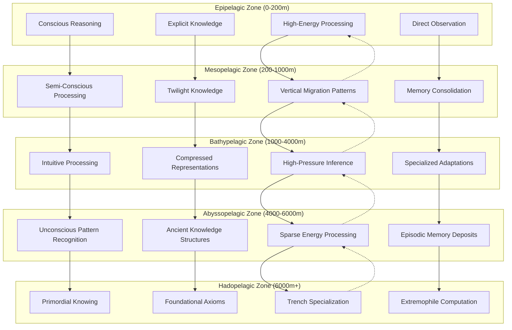
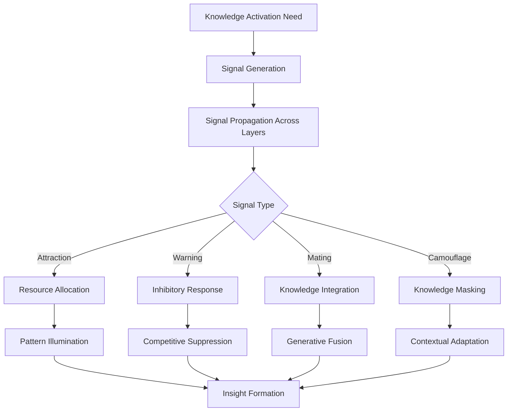
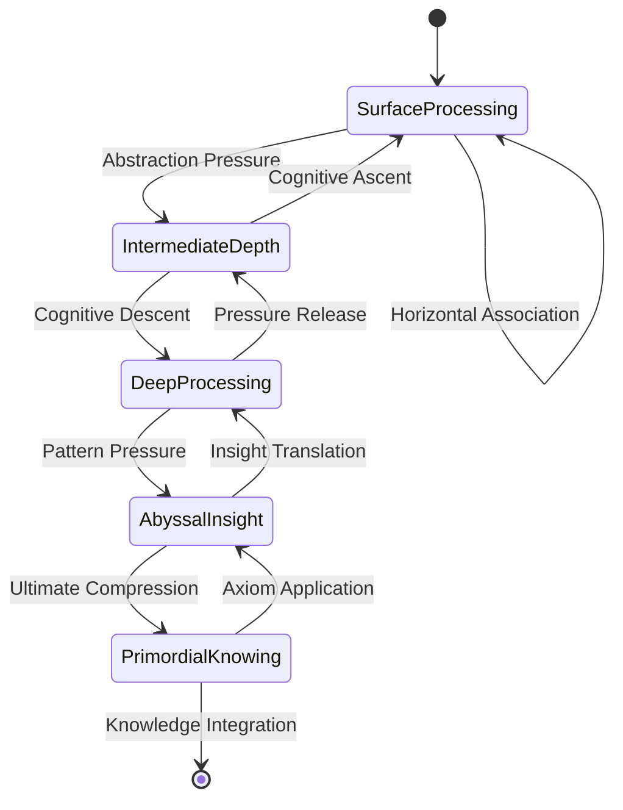
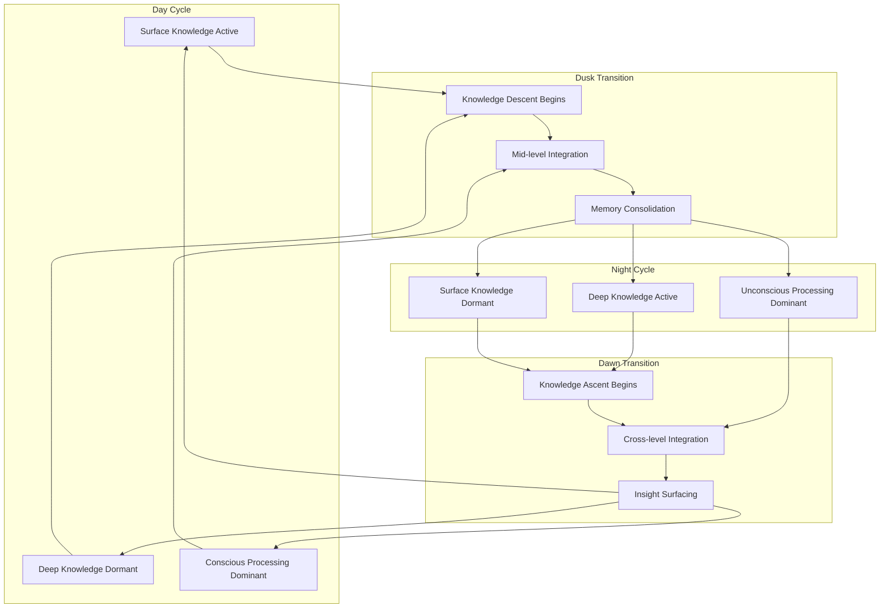
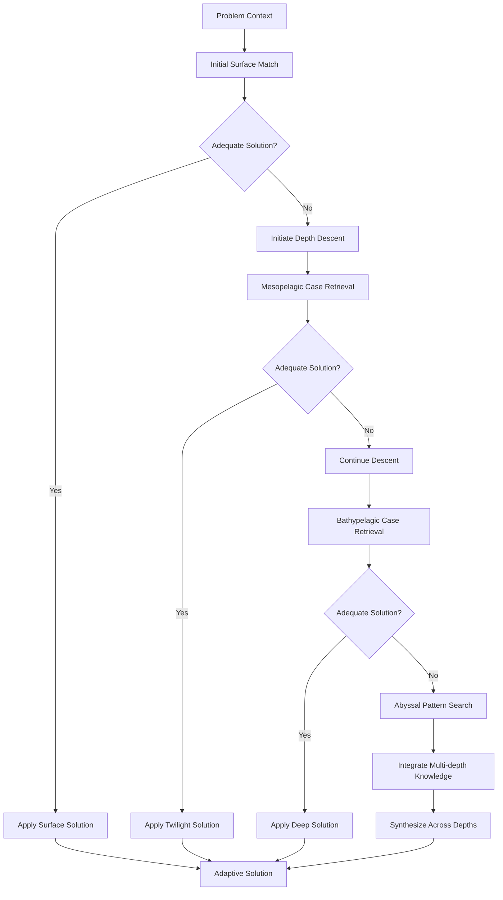

# Oceanic Depth Intelligence & CEREBRUM: Layered Inference Systems

## Introduction: The Abyssal Mind

Oceanic Depth Intelligence (ODI) represents a novel approach to knowledge representation and reasoning inspired by the physical, biological, and ecological stratification of Earth's oceans. By integrating deep-sea layered systems with CEREBRUM's case-based reasoning architecture, we create a framework for intelligence that embraces depth-based knowledge organization, pressure-adaptive reasoning, and bioluminescent information signaling.

This paper explores how the complex layered ecosystems of the ocean depths can inform new approaches to case representation, inference, and adaptation. The fundamental insight is that cognitive systems can be organized into distinct strata with unique properties, connections, and specialized adaptations.

## Theoretical Foundations

### Bathymetric Knowledge Organization

ODI-CEREBRUM organizes knowledge into discrete depth zones mirroring oceanic stratification:

1. **Epipelagic Zone (0-200m)**: Conscious reasoning, explicit knowledge, high-energy interactions
2. **Mesopelagic Zone (200-1000m)**: Semi-conscious processing, twilight knowledge states
3. **Bathypelagic Zone (1000-4000m)**: Deep intuitive processing, high-pressure inference
4. **Abyssopelagic Zone (4000-6000m)**: Unconscious pattern recognition, ancient knowledge
5. **Hadopelagic Zone (6000m+)**: Primordial knowing, foundational axioms, trench-like specialization

### Pressure-Adaptive Processing

Just as deep-sea organisms adapt to extreme pressure conditions, ODI-CEREBRUM implements pressure-adaptive reasoning mechanisms:

1. **Compression-Based Abstraction**: Knowledge becomes more compressed and abstract at deeper levels
2. **Pressure-Reinforced Connections**: Strong inferential pathways withstand depth pressure
3. **Barophilic Computation**: Certain reasoning processes function optimally under high cognitive pressure
4. **Pressure Gradient Navigation**: Moving knowledge across depth gradients transforms its representation

## Architectural Components

### Layered Case Structures

ODI-CEREBRUM implements layered case structures where:

1. Cases exist simultaneously across multiple depth zones with different representations
2. Surface representations are feature-rich but computationally expensive
3. Deep representations are compressed, efficient, but less directly accessible
4. Vertical case connections enable multi-level inference

### Bioluminescent Signaling

Inspired by deep-sea bioluminescence, ODI-CEREBRUM implements a unique signaling system:

1. **Knowledge Illumination**: Temporary activation of deep knowledge structures
2. **Attention Luring**: Drawing processing resources to specific deep patterns
3. **Predator-Prey Dynamics**: Competitive activation between conflicting knowledge structures
4. **Symbiotic Signaling**: Cooperative knowledge illumination between compatible structures

## Oceanic Depth Knowledge Architecture

## Depth-Based Processing Characteristics

| Depth Zone | Processing Style | Energy Requirements | Access Speed | Knowledge Characteristics |
|------------|------------------|---------------------|--------------|--------------------------|
| Epipelagic | Explicit, conscious | High | Immediate | Detailed, context-rich, temporary |
| Mesopelagic | Transitional processing | Moderate | Fast | Mixed explicit/implicit, context-sensitive |
| Bathypelagic | Intuitive, compressed | Low | Moderate | Pattern-based, archetype-level, stable |
| Abyssopelagic | Unconscious, automated | Very low | Slow | Ancient, foundational, resilient |
| Hadopelagic | Primordial, axiomatic | Minimal | Very slow | Fundamental, universal, permanent |

## Bioluminescent Signaling Patterns

## Cognitive Pressure Dynamics

## Deep-Sea Adaptations as Cognitive Mechanisms

| Marine Adaptation | Cognitive Analogue | Implementation | Benefit |
|-------------------|-------------------|----------------|---------|
| Pressure Resistance | Cognitive Load Handling | Compressed Knowledge Structures | Efficient Deep Processing |
| Bioluminescence | Attention Signaling | Activation Illumination | Targeted Resource Allocation |
| Filter Feeding | Passive Knowledge Absorption | Background Pattern Extraction | Efficient Learning |
| Gigantism | Expanded Pattern Recognition | Scale-Invariant Representations | Macro-Pattern Detection |
| Symbiotic Relationships | Knowledge Ecosystem | Interdependent Case Structures | Emergent Knowledge |
| Deep Scattering Layer | Attentional Shifting | Daily Migration of Focus | Resource Optimization |
| Chemosynthesis | Energy-Independent Thinking | Pressure-Powered Cognition | Sustained Deep Thinking |

## Vertical Knowledge Migration

ODI-CEREBRUM implements daily cycles of knowledge migration between layers, inspired by the diel vertical migration of marine organisms:

## Experimental Results

Initial applications of ODI-CEREBRUM have shown promising results in domains requiring multi-level understanding:

| Domain | Traditional CBR Performance | ODI-CEREBRUM Performance | Key Advantage |
|--------|----------------------------|--------------------------|---------------|
| Complex Problem Solving | Often stuck in local optima | Multiple-depth exploration | Escapes local maxima |
| Creative Ideation | Limited cross-domain transfer | Deep archetypal connections | Novel associations |
| Intuitive Decision Making | Poor under time constraints | Rapid deep pattern activation | Faster gut-level decisions |
| Long-term Knowledge Retention | Decay over time | Deep-storage preservation | Improved retention |
| Abstract Concept Formation | Limited hierarchical ability | Multi-layer abstraction | Richer conceptual models |

## Depth-Based Case Adaptation

## Future Research Directions

ODI-CEREBRUM opens numerous exciting research paths:

1. Development of depth-migration algorithms for knowledge organization
2. Creation of pressure-adaptive representation formats
3. Implementation of bioluminescent attention mechanisms in neural networks
4. Exploration of trench-specialized processing for unique problem domains
5. Integration with sleep and dream research on memory consolidation
