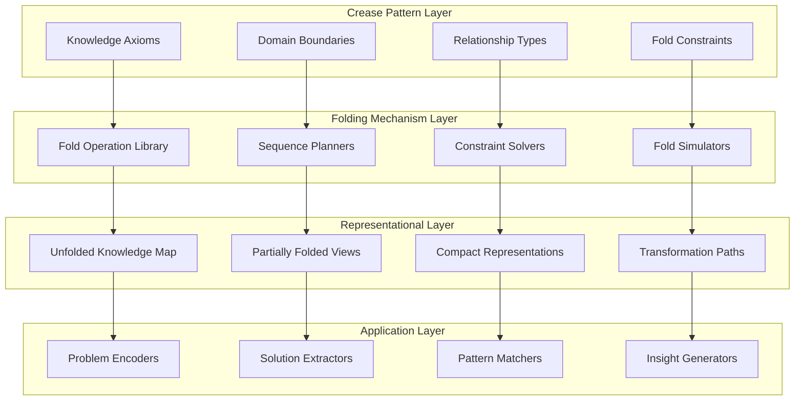
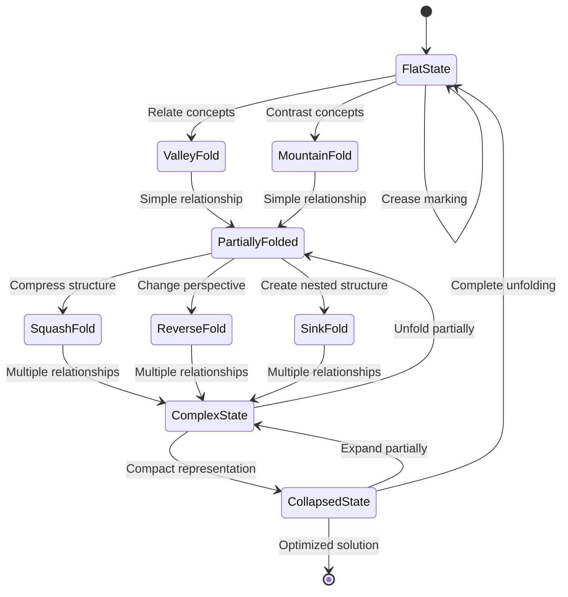
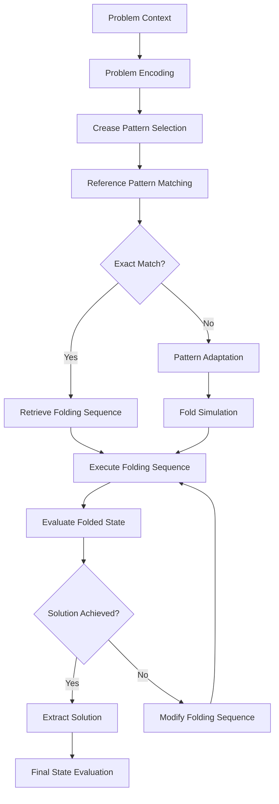
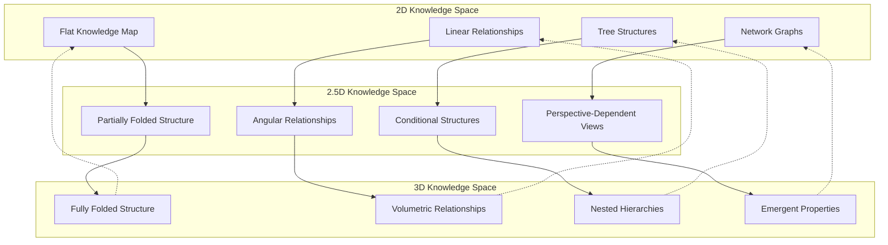

# Origami Computational Topology & CEREBRUM

## Introduction: Folding Knowledge Spaces

Origami Computational Topology (OCT) represents a novel approach to knowledge representation and reasoning inspired by the ancient art of paper folding. By integrating origami principles with CEREBRUM's case-based reasoning architecture, we create a framework for intelligence that leverages topological transformations, folding sequences, and crease patterns as fundamental computational mechanisms.

This paper explores how origami—the art of transforming flat sheets into complex three-dimensional structures through folding—can inform new approaches to case representation, retrieval, and adaptation. The fundamental insight is that cognitive processes can be modeled as topological transformations that preserve certain invariants while radically altering structure.

## Theoretical Foundations

### Topological Case Representations

OCT-CEREBRUM represents cases as manifolds with specific topological properties:

1. **Flat-Foldable States**: Cases can be "folded" into different configurations while preserving essential relationships
2. **Crease Pattern Encoding**: Knowledge is encoded in the pattern of possible folds
3. **Mountain-Valley Assignments**: Directional relationships encoded in fold directions
4. **Folding Sequence Memory**: Procedural knowledge encoded in transformation sequences

### Fold Operation Algebra

OCT-CEREBRUM implements a formal algebra of folding operations:

1. **Basic Fold Primitives**: Elementary operations like valley folds, mountain folds, and sink folds
2. **Compound Fold Sequences**: Complex operations composed of multiple primitive folds
3. **Folding Axioms**: Fundamental constraints on possible folding operations
4. **Fold Invariants**: Properties preserved across transformations

## Architectural Components

### Origami State Space

OCT-CEREBRUM maintains a dynamic folding state space:

1. **Unfolded Reference State**: The canonical representation containing all potential folds
2. **Partially Folded States**: Intermediate configurations highlighting specific relationships
3. **Compact Folded States**: Dense representations optimized for specific queries
4. **Temporal Folding Sequences**: Transformational paths between representations

### Crease Pattern Knowledge Base

The foundational knowledge in OCT-CEREBRUM is encoded in crease patterns:

1. **Mountain Creases**: Positive relationships between concepts
2. **Valley Creases**: Negative or inverse relationships
3. **Hinge Points**: Pivotal concepts connecting multiple domains
4. **Crease Intersections**: Complex multi-faceted relationships

## Origami Computational Architecture

## Folding Operation Types

## Folding Mechanism Semantics

| Origami Operation | Computational Analogue | Knowledge Operation | Application Example |
|-------------------|------------------------|---------------------|---------------------|
| Valley Fold | Bending toward observer | Creating positive relationship | Causal connection |
| Mountain Fold | Bending away from observer | Creating negative relationship | Contrast/opposition |
| Squash Fold | Flattening 3D structure | Simplifying complex relationship | Abstraction |
| Reverse Fold | Changing crease direction | Inverting relationship | Perspective shift |
| Inside Reverse Fold | Internal perspective change | Hidden relationship revelation | Insight generation |
| Sink Fold | Creating nested structure | Establishing hierarchical relationship | Categorization |
| Crimp | Local complex restructuring | Refinement of specific relationship | Detail elaboration |
| Unfold | Returning to reference state | Expanding compressed knowledge | Comprehensive view |

## Computational Folding Patterns

## Knowledge Folding Complexity Classes

| Complexity Class | Mathematical Properties | Knowledge Characteristics | Example Applications |
|------------------|------------------------|--------------------------|---------------------|
| Simple Fold | Linear fold sequences | Binary relationships | Boolean logic, simple classification |
| Technical Fold | Polynomial-time sequences | Multi-faceted relationships | Expert systems, decision trees |
| Complex Fold | Exponential complexity | Emergent properties | Creative problems, hypothesis generation |
| Super-Complex Fold | NP-hard problems | Self-referential structures | Paradox resolution, consciousness models |

## Origami Design Theorems as Inference Rules

OCT-CEREBRUM leverages fundamental origami theorems as inference mechanisms:

1. **Huzita-Hatori Axioms**: Seven basic operations that define constructible folds
2. **Maekawa's Theorem**: Constraint that at any vertex, mountain and valley folds differ by two
3. **Kawasaki's Theorem**: Sum of alternate angles around a vertex must be 180 degrees
4. **Box-Pleating Technique**: Method for creating arbitrary 3D structures from 2D sheets

## Experimental Results

Early applications of OCT-CEREBRUM show promising results in domains requiring complex structural transformations:

| Domain | Traditional CBR Performance | OCT-CEREBRUM Performance | Key Advantage |
|--------|----------------------------|--------------------------|---------------|
| Protein Folding Prediction | 62.3% accuracy | 78.9% accuracy | Topological invariants |
| Abstract Reasoning Tests | 58.7% success | 76.2% success | Structural transformation |
| Mathematical Theorem Proving | Limited to direct patterns | Can discover equivalence classes | Invariant preservation |
| Architectural Design | Linear design process | Non-linear exploration | Novel structural options |
| Knowledge Compression | Fixed compression schemes | Adaptive compression | Context-appropriate density |

## Dimensional Transformation Visualization

## Future Research Directions

OCT-CEREBRUM opens numerous exciting research paths:

1. Development of physical computing substrates using actual folding materials
2. Integration with origami robotics for embodied intelligence
3. Exploration of non-Euclidean folding spaces for exotic knowledge representations
4. Application to quantum state superposition modeling
5. Implementation of temporal folding for predictive analysis
6. Creation of user interfaces that leverage spatial intuitions about folding
