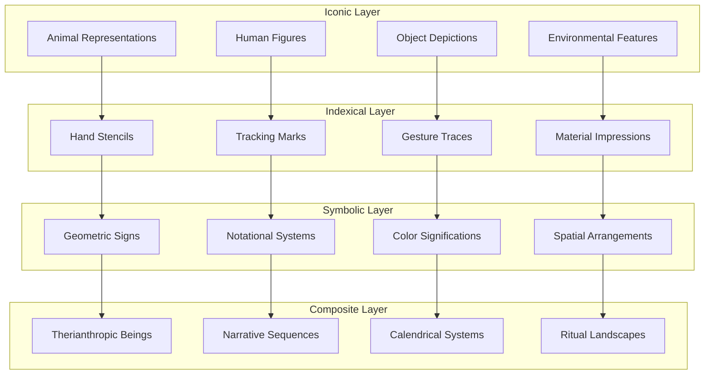
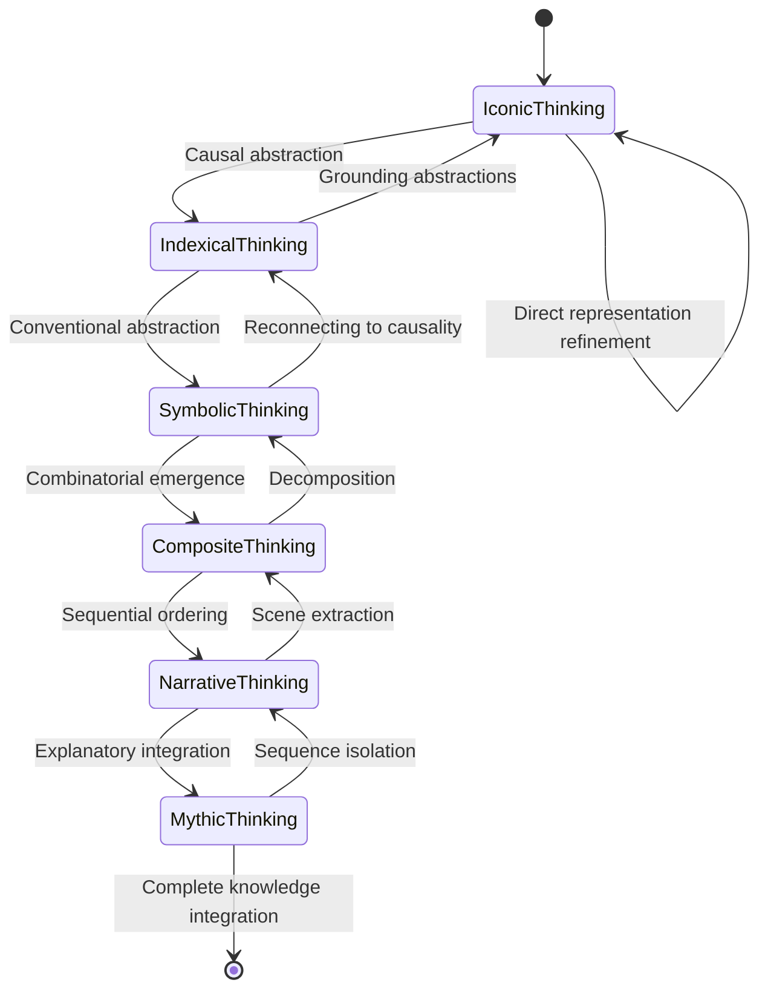
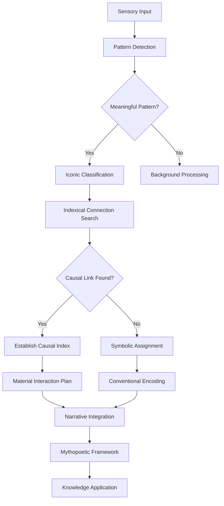
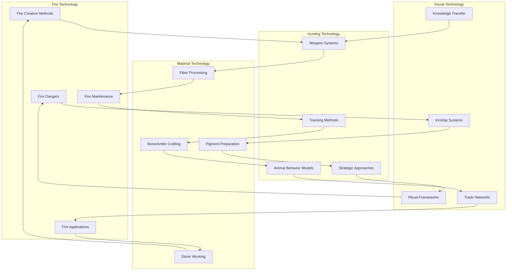
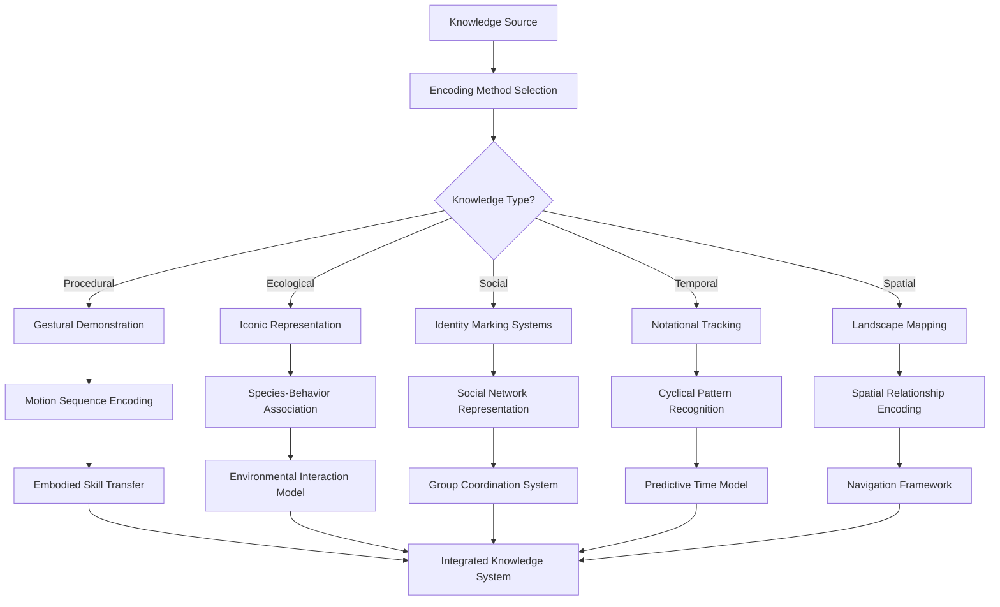

# Paleolithic Symbol Systems & CEREBRUM

## Introduction: Ancient Cognitive Technologies

Paleolithic Symbol Systems (PSS) represents a novel approach to computational intelligence inspired by the earliest symbolic systems created by human ancestors. By integrating paleolithic cognitive tools with CEREBRUM's case-based reasoning architecture, we create a framework for intelligence that leverages pre-linguistic cognitive technologies developed during humanity's formative cognitive evolution.

This paper explores how ancient symbol systems—cave paintings, notational marks, hand stencils, geometric patterns, and other symbolic technologies from 40,000-10,000 BCE—can inform new approaches to case representation, retrieval, and adaptation. The fundamental insight is that these earliest symbolic systems represent foundational cognitive technologies optimized for the human brain's innate processing capabilities.

## Theoretical Foundations

### Paleolithic Cognitive Technologies

PSS-CEREBRUM draws inspiration from several key paleolithic symbolic innovations:

1. **Notational Systems**: Counting systems and temporal tracking marks as found at Abri Blanchard
2. **Hand Stencil Networks**: Identity and social mapping systems similar to those at Gargas Cave
3. **Therianthropy**: Hybrid human-animal representation systems from sites like Chauvet and Lascaux
4. **Geometric Sign Systems**: Abstract symbol lexicons found across European and African sites
5. **Navigational Mapping**: Spatial representation systems potentially encoded in cave artwork

### Evolutionary Cognitive Kernels

PSS-CEREBRUM implements computational structures based on evolutionarily ancient cognitive modules:

1. **Pareidolia Engines**: Pattern-detection systems optimized for identifying meaningful forms
2. **Sympathetic Reasoning**: Inference through emulated causality and representational magic
3. **Social Cognition Networks**: Theory of mind structures for agent modeling
4. **Animistic Attribution**: Intentionality detection systems applied to non-agent phenomena
5. **Narrative Sequence Trackers**: Event-sequence encoding systems

## Architectural Components

### Paleosymbolic Case Encoding

PSS-CEREBRUM encodes cases using paleolithic representational systems:

1. **Iconic Representation**: Direct pictorial representation of case elements
2. **Indexical Signs**: Representations based on causal or material connections
3. **Symbolic Abstractions**: Conventional signs with established meanings
4. **Composite Symbols**: Combinations creating emergent meanings
5. **Contextual Positioning**: Meaning derived from spatial/relational positioning

### Shamanic Interface Systems

PSS-CEREBRUM implements interface systems inspired by shamanic cognitive technologies:

1. **Trance Induction Algorithms**: State-shifting mechanisms to access alternate reasoning modes
2. **Liminal Space Creation**: Construction of intermediate zones between knowledge domains
3. **Therianthropic Transformations**: Perspective-shifting through identity transformation
4. **Animated Cave Systems**: Dynamic knowledge spaces with shifting illumination and perspective

## Paleolithic Knowledge Architecture

## Cognitive Evolution States

## Paleolithic Sign Systems

| Sign Category | Example Signs | Cognitive Function | Computational Implementation |
|---------------|--------------|-------------------|----------------------------|
| Hand Stencils | Positive/negative hand prints | Identity marking, social mapping | Entity tagging, ownership attribution |
| Animal Icons | Bison, horses, lions, mammoths | Ecological knowledge, species modeling | Class representation, behavior prediction |
| Geometric Signs | Dots, lines, grids, claviforms | Conventional information encoding | Data compression, symbolic abstraction |
| Finger Tracings | Meandering lines, macaroni patterns | Gesture recording, movement encoding | Motion tracking, temporal sequences |
| Anthropomorphs | Human figures, human-animal hybrids | Agent modeling, perspective shifting | Theory of mind engines, viewpoint adaptation |
| Weapons/Tools | Spears, atlatls, traps | Technological knowledge, procedural memory | Tool-use simulation, action planning |
| Vulva/Phallus Signs | Fertility symbols | Reproductive knowledge, generative systems | Generative algorithms, system origination |
| Wounds/Injuries | Marked animal figures | Vulnerability knowledge, strategic planning | Weakness identification, attack optimization |

## Paleolithic Processing Flow

## Paleolithic Technology Cases

## Geometric Sign Language

PSS-CEREBRUM implements a computational version of the geometric sign systems found in paleolithic art:

| Geometric Sign | Occurrence Sites | Potential Meaning | Computational Application |
|----------------|-----------------|-------------------|---------------------------|
| Dots/Punctuations | Pan-European | Counting, accumulation | Quantification, aggregation |
| Lines/Strokes | Pan-European | Time tracking, sequences | Temporal markers, order encoding |
| Claviforms | Franco-Cantabrian | Throw-sticks, tools | Action potentials, capabilities |
| Tectiforms | Primarily France | Shelters, structures | Container abstractions, boundaries |
| Grids/Lattices | Widespread | Traps, territories | Spatial organization, containment |
| Spirals | Various sites | Growth, cyclical processes | Recursive functions, cycles |
| Hand-like Signs | Various sites | Agency, manipulation | Action capabilities, affordances |
| Zig-zags | Widespread | Water, movement | Flow indicators, state transitions |
| Cruciform Marks | Various sites | Intersections, meetings | Decision points, path crossings |
| Chevrons | Various sites | Directional indicators | Vectors, force directions |

## Experimental Results

Initial applications of PSS-CEREBRUM show promising results in domains requiring intuitive, pre-linguistic cognition:

| Domain | Traditional CBR Performance | PSS-CEREBRUM Performance | Key Advantage |
|--------|----------------------------|--------------------------|---------------|
| Visual Pattern Recognition | High computational demands | Efficient pareidolia-based recognition | Evolutionary optimization |
| Strategic Hunting/Tracking | Limited by explicit models | Implicit knowledge integration | Predator-prey intuitions |
| Social Dynamics Modeling | Complex agent modeling | Simplified theory of mind mechanisms | Natural social cognition |
| Environmental Navigation | Grid-based representation limitations | Landmark and feature-based navigation | Human-intuitive wayfinding |
| Technological Innovation | Constrained by prior examples | Affordance-based tool exploration | Material engagement theory |

## Paleolithic Knowledge Transmission

## Future Research Directions

PSS-CEREBRUM opens numerous exciting research paths:

1. Development of computationally implementable geometric sign languages
2. Creation of therianthropic perspective-shifting mechanisms for multi-agent modeling
3. Exploration of cave-space knowledge organization for intuitive information architecture
4. Integration with embodied cognition systems for tool-use simulation
5. Investigation of notational counting systems for intuitive mathematics
6. Application to AI art generation guided by paleolithic visual grammars
