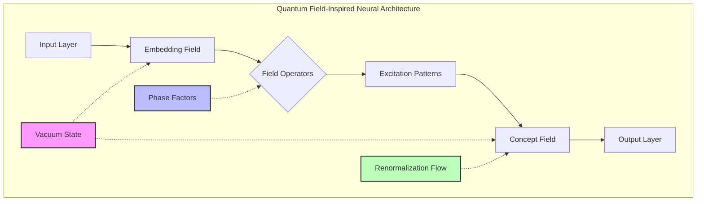
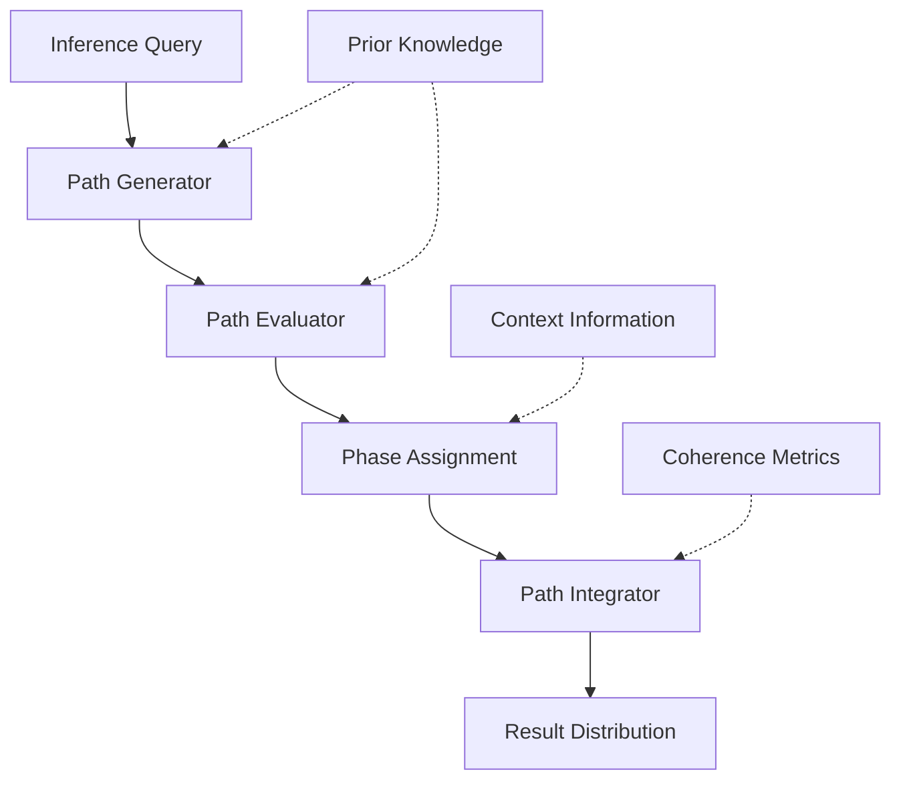
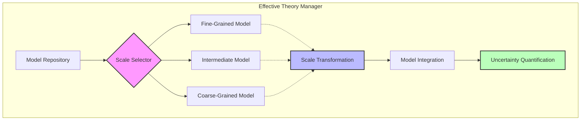
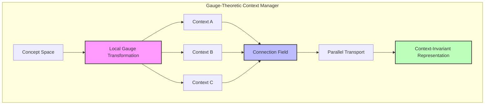
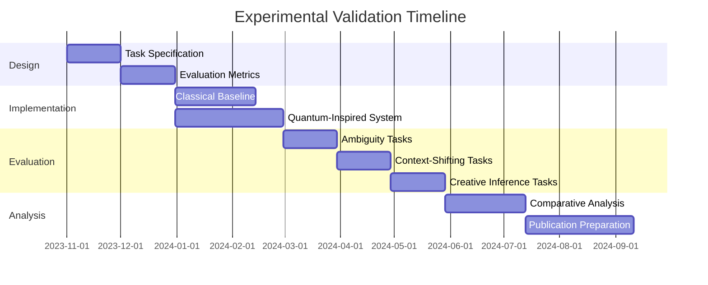
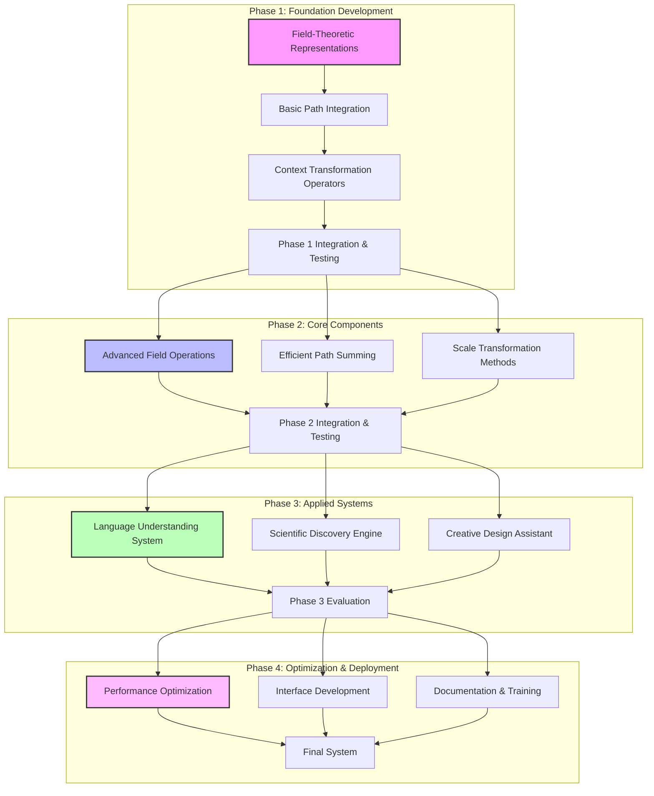

# Speculative Design: Quantum Field Theory and CEREBRUM Integration

## 1. Introduction: Quantum Foundations of Cognitive Architecture

This document explores the speculative integration between quantum field theory (QFT) and the Case-Enabled Reasoning Engine with Bayesian Representations for Unified Modeling (CEREBRUM). Both QFT and CEREBRUM engage with fundamental questions about the nature of information processing, state representation, and the emergence of coherent patterns from underlying probabilistic processes.

The quantum aphorism "everything that can happen, does happen" presents a striking parallel to the Bayesian approach of maintaining multiple competing hypotheses weighted by probability. While operating in different domains—QFT in fundamental physics and CEREBRUM in computational cognitive modeling—both frameworks address similar conceptual challenges: maintaining coherent global representations while accounting for local uncertainty, balancing deterministic evolution with probabilistic outcomes, and modeling the emergence of apparent stability from underlying fluctuations.

## 2. Quantum Field Theory: Key Concepts and Frameworks

### 2.1 Foundational Principles of QFT

Quantum Field Theory represents one of the most successful theoretical frameworks in physics, unifying quantum mechanics with special relativity and providing the foundation for the Standard Model of particle physics.

* **Fields as Fundamental**: Unlike classical physics or even basic quantum mechanics, QFT treats fields (not particles) as the fundamental entities. These fields permeate all of spacetime and can exist in various quantum states.

* **Excitations as Particles**: Particles are understood as localized excitations or quantized vibrations of underlying fields. Different particle types (electrons, photons, etc.) correspond to excitations of different fundamental fields.

* **Vacuum State and Fluctuations**: The ground state or "vacuum" in QFT is not empty but contains persistent quantum fluctuations—virtual particles continuously appearing and disappearing—with measurable physical effects.

* **Superposition and Entanglement**: Like all quantum systems, fields can exist in superpositions of different configurations, and widely separated regions of a field can become entangled, exhibiting correlations that exceed classical limits.

* **Symmetry Principles**: Symmetries play a crucial organizing role in QFT, with fundamental forces emerging from local gauge symmetries and spontaneous symmetry breaking determining the structure of physical laws.

### 2.2 Key Computational Structures in QFT

Several computational structures in QFT have potential relevance for cognitive modeling:

* **Path Integrals**: Feynman's path integral formulation calculates quantum probabilities by summing over all possible histories of a system, weighted by a phase factor related to the action of each path. This provides a global perspective on quantum evolution.

* **Effective Field Theories**: The framework of effective field theories allows systems to be analyzed at different scales, with irrelevant microscopic details integrated out to yield simpler theories valid within specific energy/length regimes.

* **Renormalization Group**: This mathematical apparatus tracks how physical theories transform when examined at different scales, revealing fixed points, scaling behaviors, and universality classes that transcend microscopic details.

* **Gauge Theories**: These theories model fundamental forces through local symmetry transformations, with gauge fields (like the electromagnetic field) emerging as necessary consequences of making certain symmetries local rather than global.

* **Spontaneous Symmetry Breaking**: This mechanism explains how systems with symmetric underlying laws can exhibit asymmetric realized states, creating effective complexity from simple fundamental rules.

### 2.3 Quantum Information Concepts

The intersection of quantum theory and information science has yielded important concepts:

* **Quantum States as Information**: Quantum states can be viewed as representing information about potential measurement outcomes rather than objective reality.

* **Quantum Entanglement as Information Resource**: Entanglement represents uniquely quantum correlations that can be harvested for information processing tasks impossible with classical resources.

* **Quantum Decoherence**: The process by which quantum systems lose their coherence through interaction with their environment, effectively transitioning from quantum to classical behavior.

* **Quantum Contextuality**: Measurement outcomes in quantum systems depend on which other compatible observables are measured simultaneously, revealing the contextual nature of quantum information.

## 3. CEREBRUM's Core Frameworks: A Brief Overview

To facilitate comparison with quantum concepts, we review key aspects of CEREBRUM:

### 3.1 Case-Based Representation and Reasoning

CEREBRUM employs case structures as fundamental units of knowledge representation:
- Encoding relationships between entities in flexible, contextual formats
- Supporting analogical reasoning across domains
- Enabling multiple perspectives on the same situation
- Functioning within a Bayesian framework for inference and learning

### 3.2 The Bayesian Framework and Active Inference

CEREBRUM implements computational principles from:
- The Free Energy Principle and Active Inference
- Hierarchical predictive processing
- Variational Bayesian methods
- Precision-weighted belief updating

### 3.3 Modular Integration and Cognitive Architecture

CEREBRUM provides:
- A modular architecture integrating different cognitive functions
- Standardized interfaces between components
- Mechanisms for attention and resource allocation
- Frameworks for representing dynamics across temporal scales

## 4. Quantum Fields and CEREBRUM: Speculative Integrations

This section explores how quantum field concepts might inform and enhance CEREBRUM's frameworks.

### 4.1 Field-Theoretic Knowledge Representation

QFT suggests novel approaches to knowledge representation in CEREBRUM:

* **Concept Fields**: Representing concepts not as discrete symbols but as field-like entities that permeate a semantic space, with varying "excitation levels" across contexts.

* **Semantic Vacuum State**: Implementing a background "vacuum state" of knowledge from which specific concepts emerge as excitations, with the vacuum itself containing meaningful fluctuations that influence cognition.

* **Entangled Concept States**: Modeling concepts that maintain quantum-like entanglement, where operations on one concept instantaneously affect related concepts regardless of their "distance" in semantic space.

* **Superposition of Meanings**: Representing ambiguous concepts in superpositions of different meanings, with the specific meaning "collapsing" only when the concept is used in a particular context.

* **Field Excitation Patterns**: Encoding complex ideas as patterns of excitations across multiple concept fields rather than as isolated symbolic structures.

This field-theoretic approach would transform CEREBRUM's representation from a collection of discrete symbolic structures to a more continuous, context-sensitive semantic field with quantized excitations.

### 4.2 Path Integral Reasoning

Feynman's path integral formulation suggests powerful approaches to reasoning under uncertainty:

* **Multiple-Path Inference**: Rather than selecting a single optimal reasoning path, a path integral approach would integrate over all possible reasoning paths, weighted by their coherence and consistency with prior knowledge.

* **Phase-Based Coherence**: Assigning phase factors to different reasoning paths, allowing for interference effects where multiple individually weak paths can combine constructively to produce strong conclusions.

* **Global Optimization**: Evaluating the collective contribution of all possible reasoning paths simultaneously, potentially discovering solutions invisible to sequential logical approaches.

* **Counterfactual Reasoning**: Systematically exploring counterfactual scenarios as alternative "histories," integrated into a coherent assessment of knowledge.

* **Action Minimization**: Formulating a cognitive "action" principle that prioritizes reasoning paths that minimize a combination of complexity and prediction error.

This approach would transform CEREBRUM's reasoning from sequential inference to a more global integration across possible inference paths, potentially enabling more robust conclusions in domains with ambiguous or incomplete information.

### 4.3 Effective Cognitive Theories

The effective field theory framework suggests a principled approach to managing cognitive abstraction:

* **Scale-Dependent Models**: Implementing explicitly scale-dependent models where different theoretical constructs become relevant at different levels of description.

* **Irrelevance Principle**: Systematically integrating out details irrelevant at a given scale, maintaining only those degrees of freedom necessary for accurate prediction at that scale.

* **Running Couplings**: Modeling how the strength of associations between concepts varies depending on the scale of analysis, with some connections becoming stronger and others weaker as the focus narrows or broadens.

* **Emergent Operators**: Identifying cognitive operations that emerge only at certain scales, irreducible to operations at more fine-grained levels despite arising from them.

* **Universality Classes**: Classifying cognitive processes into universality classes characterized by common scaling behaviors rather than surface similarities.

This framework would enable CEREBRUM to maintain multiple models at different levels of abstraction in a principled way, with explicit mappings between levels and clarity about which details can be safely integrated out at each level.

### 4.4 Cognitive Gauge Theories

Gauge theory concepts suggest novel approaches to modeling context-sensitivity in cognition:

* **Local Semantic Symmetries**: Implementing semantic transformations that preserve meaning within specific contexts but may vary between contexts.

* **Cognitive Gauge Fields**: Introducing fields that mediate the transformation of meaning across different contexts, analogous to how gauge fields mediate force interactions in physics.

* **Parallel Transport of Meaning**: Developing mechanisms for "transporting" concepts between different contexts while preserving their essential meaning, despite shifts in surface representation.

* **Semantic Curvature**: Measuring how much a concept's meaning changes when moved through a cycle of different contexts and returned to the original context.

* **Minimal Coupling Principle**: Formulating a principle that cognitive contexts interact with concepts through minimal transformations that preserve core meaning while adapting surface features.

This approach would provide CEREBRUM with a mathematical framework for managing how concepts transform across contexts while maintaining coherent identity, addressing one of the fundamental challenges of context-sensitive cognition.

### 4.5 Spontaneous Symmetry Breaking in Conceptual Systems

The principle of spontaneous symmetry breaking suggests mechanisms for modeling concept formation:

* **Symmetric Potential Landscapes**: Implementing initially symmetric cognitive "potential landscapes" where multiple conceptual organizations are equally viable.

* **Symmetry-Breaking Dynamics**: Modeling the process by which specific conceptual systems emerge from symmetric possibilities through small perturbations and self-reinforcing dynamics.

* **Goldstone Modes**: Identifying "nearly free" conceptual transformations that remain after symmetry breaking, representing low-energy ways to reshape conceptual frameworks.

* **Collective Excitations**: Modeling how collective patterns of concept activation behave as emergent entities with their own dynamics.

* **Phase Transitions in Understanding**: Implementing phase transition-like shifts between different conceptual frameworks when critical thresholds of evidence or coherence are crossed.

This framework would enable CEREBRUM to model how structured conceptual systems emerge from initially undifferentiated possibility spaces, providing insight into both developmental learning and creative conceptual shifts.

## 5. Technical Implementation: Quantum-Inspired CEREBRUM Extensions

This section outlines technical approaches for implementing quantum-inspired features in CEREBRUM.

### 5.1 Field-Theoretic Neural Architectures

The field-theoretic neural architecture would implement:

* **Continuous Field Representations**: Moving beyond discrete neural units to continuous fields with localized excitations.

* **Complex-Valued Activations**: Using complex numbers to represent both magnitude and phase of concept activations, enabling interference effects.

* **Field Operator Layers**: Implementing layers that apply field-theoretic operations to transform semantic fields.

* **Vacuum Energy Regularization**: Using vacuum state fluctuations as a form of regularization that maintains meaningful background activity.

* **Renormalization Flow Layers**: Implementing scale transformation operations that move between different levels of semantic abstraction.

This architecture would require significant extensions to current neural network frameworks but could potentially capture semantic phenomena difficult to model with conventional approaches.

### 5.2 Path Integral Inference Engine

The path integral inference engine would implement:

* **Automated Path Generation**: Algorithms for generating diverse possible reasoning paths from start to end points.

* **Path Action Calculation**: Methods for assigning an "action" value to each path based on its cognitive complexity and consistency.

* **Phase Factor Assignment**: Techniques for assigning phase factors that enable constructive and destructive interference between paths.

* **Efficient Path Summation**: Approximation methods for efficiently integrating over large numbers of potential paths.

* **Stationary Phase Approximation**: Focusing computational resources on paths near the minimum action, which contribute most significantly to the final result.

This approach would extend CEREBRUM's inference capabilities beyond sequential reasoning to global optimization across possible reasoning strategies.

### 5.3 Effective Theory Manager

The effective theory manager would implement:

* **Scale-Explicit Models**: Maintaining multiple models explicitly tagged with their validity scales.

* **Renormalization Group Flows**: Computing transformations between models at different scales.

* **Detail Integration**: Methods for systematically integrating out irrelevant details when moving to coarser scales.

* **Emergent Parameter Identification**: Techniques for identifying parameters that emerge only at certain scales.

* **Cross-Scale Consistency Checks**: Validation methods ensuring models at different scales remain mutually consistent.

This component would enable CEREBRUM to maintain an integrated family of models at different levels of abstraction, with principled methods for moving between levels.

### 5.4 Gauge-Theoretic Context Manager

The gauge-theoretic context manager would implement:

* **Local Context Transformations**: Defining how concepts transform when moving between specific contexts.

* **Connection Fields**: Computational structures that specify the minimal adjustments needed to preserve meaning across contexts.

* **Parallel Transport Algorithms**: Methods for moving concepts between contexts while minimizing meaning distortion.

* **Context Curvature Metrics**: Measurements of how much meaning changes when moving through cycles of contexts.

* **Invariant Feature Extraction**: Techniques for identifying aspects of concepts that remain unchanged across context transformations.

This component would provide CEREBRUM with a principled approach to context-sensitive meaning, addressing one of the core challenges in knowledge representation.

## 6. Experimental Validation: Quantum-Inspired vs. Classical Approaches

To validate the quantum-inspired extensions, we propose a systematic comparison between classical and quantum-inspired approaches across several cognitive tasks.

### 6.1 Comparative Performance Analysis

| Task Type | Classical Approach | Quantum-Inspired Approach | Expected Differences |
|-----------|--------------------|--------------------------|-----------------------|
| Ambiguous Concept Representation | Probabilistic Mixtures | Superposition States | QI should better preserve interference effects between meanings |
| Context-Sensitive Inference | Context-Specific Models | Gauge Field Transformations | QI should show more coherent transitions between contexts |
| Creative Hypothesis Generation | Stochastic Search | Path Integral Sampling | QI should discover non-obvious connections more frequently |
| Multi-Scale Modeling | Hierarchical Models | Effective Field Theories | QI should maintain better cross-scale consistency |
| Conceptual Change Tracking | State Transitions | Symmetry Breaking Dynamics | QI should model intermediate states more accurately |
| Entangled Concept Reasoning | Correlation Models | Entangled Representations | QI should capture non-classical correlations between concepts |

### 6.2 Benchmark Tasks

We propose the following specific benchmark tasks:

1. **Polysemous Word Modeling**: Evaluating how well each approach represents words with multiple related meanings and selects appropriate interpretations in context.

2. **Cross-Domain Analogy Finding**: Testing the ability to discover valid analogies between conceptually distant domains.

3. **Scientific Hypothesis Generation**: Assessing the generation of novel, testable hypotheses from existing data sets in complex scientific domains.

4. **Context-Dependent Reasoning**: Measuring the consistency of inference when reasoning crosses contextual boundaries.

5. **Creative Conceptual Blending**: Evaluating the quality and originality of new concepts created by blending existing conceptual structures.

6. **Dynamic Ontology Adaptation**: Testing how well each system adapts its conceptual organization when faced with new, partially inconsistent information.

## 7. Theoretical Implications and Limitations

### 7.1 Philosophical Considerations

The quantum-field approach to cognition raises important philosophical questions:

* **Ontic vs. Epistemic Interpretation**: Are quantum-like features of cognition merely useful computational analogies, or do they reflect deeper structural similarities between mind and matter?

* **Emergence vs. Fundamentality**: Is the quantum-like behavior of cognition emergent from classical neural processes, or does it reflect more fundamental quantum processes in the brain?

* **Pragmatic vs. Realist Views**: Can we adopt quantum formalisms purely for their computational utility, or do they commit us to specific views about the nature of cognitive reality?

### 7.2 Known Limitations

We must acknowledge several limitations of the quantum-inspired approach:

* **Computational Intensity**: Many quantum-inspired algorithms require significantly greater computational resources than classical alternatives.

* **Empirical Underdetermination**: Multiple computational approaches can often fit the same behavioral data, making it difficult to conclusively demonstrate advantages.

* **Implementation Challenges**: Concepts like superposition and entanglement can be challenging to implement effectively in classical computing architectures.

* **Interpretation Difficulties**: Results from quantum-inspired models can sometimes be difficult to interpret in cognitively meaningful ways.

* **Risk of Overextension**: There's a risk of applying quantum concepts beyond their useful range, leading to unnecessary complexity.

### 7.3 Future Research Directions

Important directions for future research include:

* **Neural Implementation**: Investigating how quantum-inspired cognitive models might be implemented in actual neural circuits.

* **Quantum Computing Implementations**: Exploring how actual quantum computing could implement these models more directly.

* **Behavioral Predictions**: Developing specific, testable behavioral predictions that would distinguish quantum-inspired from classical cognitive models.

* **Cognitive Neuroscience Integration**: Finding neural correlates of quantum-like cognitive phenomena.

* **Practical Applications**: Identifying domains where quantum-inspired approaches offer clear practical advantages over classical alternatives.

## 8. Implementation Roadmap

We propose implementing the quantum-inspired CEREBRUM extensions through a phased approach:

### 8.1 Phase 1: Foundation Development (Months 1-6)

* Implement basic field-theoretic representations
* Develop prototype path integral inference methods
* Create foundational gauge-theoretic context transformations
* Establish evaluation metrics and baseline comparisons

### 8.2 Phase 2: Core Components (Months 7-18)

* Develop advanced field operations and excitation patterns
* Implement efficient approximations for path integral summation
* Create robust scale transformation methods
* Build and test integration between components

### 8.3 Phase 3: Applied Systems (Months 19-30)

* Develop language understanding system using quantum-inspired approaches
* Build scientific discovery engine leveraging path integral reasoning
* Create creative design assistant using symmetry breaking principles
* Conduct comprehensive comparative evaluation

### 8.4 Phase 4: Optimization and Deployment (Months 31-36)

* Optimize performance for practical applications
* Develop user interfaces and API specifications
* Prepare comprehensive documentation and training materials
* Package final system for research and commercial applications

## 9. Conclusion: Quantum Fields of Thought

The integration of quantum field theory concepts with CEREBRUM offers a promising framework for addressing fundamental challenges in cognitive modeling. By applying concepts like field-theoretic representations, path integral reasoning, and gauge-theoretic context sensitivity, we can develop cognitive architectures that better capture the fluid, context-sensitive, and globally coherent nature of human thought.

This approach represents not merely the application of computational techniques from another discipline, but a deeper exploration of whether mind and matter might share fundamental organizational principles. Just as quantum field theory revolutionized our understanding of physical reality by introducing fields as primary and particles as emergent, this framework suggests a view of cognition where stable concepts emerge from underlying fields of meaning, and cognitive operations involve the transformation of these fields rather than the manipulation of static symbols.

The quantum-inspired CEREBRUM extensions proposed here offer a speculative but technically grounded path toward cognitive architectures with enhanced capabilities for creative inference, contextual adaptation, and multi-scale modeling. While significant research challenges remain, this framework provides a coherent research program that could yield practical advances in artificial intelligence while deepening our theoretical understanding of cognition itself.

## 10. References

1. Aerts, D., & Gabora, L. (2005). A theory of concepts and their combinations I: The structure of the sets of contexts and properties. Kybernetes, 34(1/2), 167-191.

2. Atmanspacher, H. (2011). Quantum approaches to consciousness. Stanford Encyclopedia of Philosophy.

3. Bruza, P. D., Wang, Z., & Busemeyer, J. R. (2015). Quantum cognition: a new theoretical approach to psychology. Trends in cognitive sciences, 19(7), 383-393.

4. Campos, D. G. (2019). Quantum pragmatism and the Bayesian perspective. International Journal of Quantum Foundations, 5, 1-17.

5. Gabora, L., & Aerts, D. (2002). Contextualizing concepts using a mathematical generalization of the quantum formalism. Journal of Experimental & Theoretical Artificial Intelligence, 14(4), 327-358.

6. Haven, E., & Khrennikov, A. (2013). Quantum social science. Cambridge University Press.

7. Khrennikov, A. (2010). Ubiquitous quantum structure: From psychology to finance. Springer.

8. Pothos, E. M., & Busemeyer, J. R. (2013). Can quantum probability provide a new direction for cognitive modeling? Behavioral and Brain Sciences, 36(3), 255-274.

9. Wang, Z., Busemeyer, J. R., Atmanspacher, H., & Pothos, E. M. (2013). The potential of using quantum theory to build models of cognition. Topics in Cognitive Science, 5(4), 672-688.

10. Wendt, A. (2015). Quantum mind and social science: Unifying physical and social ontology. Cambridge University Press. 