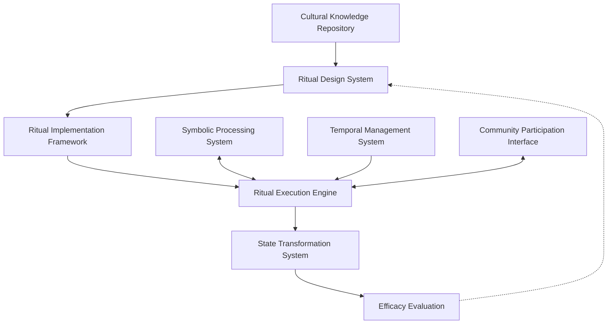

# Ritual Computing Frameworks: Ceremonial Processes in CEREBRUM

## 1. Introduction to Ritual Computing

Ritual computing represents a paradigm shift in computational design that incorporates the structured, meaningful, transformative properties of human ritual practices into computational systems. This document outlines a framework for implementing ritual-based computational processes within CEREBRUM, developing systems that leverage the power of formalized, symbolically-rich, culturally-grounded sequences to enhance computational efficacy, meaningfulness, and human-machine interaction.

## 2. Theoretical Foundations

### 2.1 Anthropological Perspectives on Ritual

The ritual computing paradigm draws from anthropological understandings of ritual:

* **Performative Theory**: Rituals as performances that transform states and identities
* **Symbolic Action Theory**: Rituals as symbolic actions embedding cultural meaning
* **Liminality and Communitas**: Ritual creation of threshold states and communal bonding
* **Efficacy Frameworks**: Understanding how and why rituals produce real effects
* **Ritual as Technology**: Viewing ritual as a technology for transformation

### 2.2 Computational Ritualization

Key principles for translating ritual into computational contexts:

* **Formalization**: Clearly defined sequences of operations with specific parameters
* **Symbolism**: Embedding symbolic meaning into computational processes
* **Intentionality**: Purposeful design with explicit transformative goals
* **Temporality**: Significance of timing, rhythms, and cyclical processes
* **Threshold Creation**: Establishing boundaries between different computational states

## 3. CEREBRUM Ritual Computing Architecture

### 3.1 System Architecture

The CEREBRUM ritual computing architecture consists of interconnected components:

### 3.2 Core Components

#### 3.2.1 Ritual Design System

* **Pattern Libraries**: Collections of effective ritual patterns across cultures
* **Symbolic Element Manager**: Tools for selecting and arranging symbolic elements
* **Sequential Structure Designer**: Systems for crafting meaningful sequences
* **Intention Specification Tools**: Mechanisms for defining ritual purpose
* **Cultural Appropriateness Validator**: Ensuring ethical use of cultural elements

#### 3.2.2 Ritual Implementation Framework

* **Ritual Grammar**: Formal specifications for well-formed ritual procedures
* **Symbolic Mapping System**: Connecting symbols to computational processes
* **Temporal Framing Mechanisms**: Establishing meaningful temporal contexts
* **Spatial Configuration Tools**: Defining computational "spaces" for ritual processes
* **Participant Role Definition**: Specifying roles for humans and computational agents

#### 3.2.3 Ritual Execution Engine

* **Ceremonial Process Manager**: Coordinating execution of ritual sequences
* **State Transition Controllers**: Managing transformations between system states
* **Symbolic Action Interpreter**: Processing symbolic operations during execution
* **Rhythmic Synchronization**: Maintaining meaningful temporal patterns
* **Liminality Generators**: Creating threshold states in computation

#### 3.2.4 Efficacy Evaluation System

* **Transformation Metrics**: Measuring intended changes produced by rituals
* **Participant Experience Assessment**: Evaluating human experience of rituals
* **Symbolic Coherence Analysis**: Assessing integrity of symbolic structures
* **Process Fidelity Measures**: Evaluating adherence to ritual specifications
* **Cultural Resonance Indicators**: Measuring alignment with cultural frameworks

## 4. Implementation Technologies

### 4.1 Symbolic Processing Systems

* **Symbol Network Processors**: Systems for managing networks of symbols
* **Metaphorical Reasoning Engines**: Processing based on symbolic correspondences
* **Cultural Symbol Libraries**: Repositories of culturally meaningful symbols
* **Symbol-State Mapping**: Connecting symbolic actions to state changes
* **Symbolic Logic Systems**: Logics based on symbolic rather than literal relationships

### 4.2 Temporal Management Technologies

* **Cyclical Process Frameworks**: Systems for implementing cyclical processes
* **Meaningful Timing Controllers**: Coordinating actions at significant times
* **Rhythm Generators**: Creating and maintaining meaningful rhythmic patterns
* **Calendar System Integrators**: Connecting rituals to calendrical systems
* **Duration Management**: Handling the significant duration of processes

### 4.3 Participation Technologies

* **Multi-Agent Ritual Coordination**: Orchestrating multiple agents in rituals
* **Human-Computer Ritual Interfaces**: Engaging humans in computational rituals
* **Role Management Systems**: Assigning and tracking ritual roles
* **Collective Synchronization**: Maintaining coordinated action across participants
* **Presence Enhancement**: Creating sense of meaningful presence in ritual space

## 5. Application Domains

### 5.1 Organizational Computing

* **Digital Rites of Passage**: Marking significant transitions in organizations
* **Decision Ritualization**: Enhancing decision processes through ritualization
* **Innovation Ceremonies**: Structured processes for creative breakthroughs
* **Conflict Resolution Rituals**: Formalized approaches to resolving conflicts
* **Organizational Memory Rituals**: Processes for maintaining institutional knowledge

### 5.2 Personal Computing

* **Digital Life Transitions**: Marking significant personal transitions
* **Habit Formation Rituals**: Supporting development of beneficial habits
* **Creative Practice Frameworks**: Supporting creative work through ritual
* **Personal Transformation Tools**: Supporting intentional personal change
* **Digital Wellness Rituals**: Supporting wellbeing through structured practice

### 5.3 Collective Intelligence

* **Group Deliberation Ceremonies**: Enhancing collective decision making
* **Collaborative Creation Rituals**: Supporting group creative processes
* **Community Bonding Processes**: Strengthening community through shared ritual
* **Collective Memory Practices**: Maintaining and accessing shared knowledge
* **Distributed Ritual Frameworks**: Coordinating rituals across geographic distance

### 5.4 Human-Computer Interaction

* **Meaningful Engagement Design**: Creating significant interaction experiences
* **Technological Initiation Sequences**: Introducing users to new technologies
* **Trust-Building Ceremonies**: Establishing trust between humans and systems
* **Ethical Commitment Rituals**: Formalizing ethical commitments in technology use
* **Technology Separation Rituals**: Supporting healthy disconnection from technology

## 6. Experimental Implementations

### 6.1 Prototype System: CEREMONIAL

The CEREMONIAL (Coordinated Execution of Ritually Enhanced Meaningful Operations Normalizing Intentional Algorithmic Logic) system demonstrates key principles of ritual computing:

* **Core Function**: Implementation of computational processes as meaningful rituals
* **Design Approach**: Draws from cross-cultural ritual patterns with appropriate attribution
* **Technical Foundation**: Integrates symbolic, temporal, and participatory frameworks
* **Application Focus**: Organizational transformation and decision processes
* **Evaluation Method**: Measures both objective outcomes and subjective experiences

### 6.2 Case Studies

* **Strategic Planning Ritual**: Formalized process for organizational strategy development
* **Knowledge Transfer Ceremony**: Ritual framework for transmitting complex knowledge
* **Innovation Incubation Process**: Structured ritual for nurturing innovative ideas
* **Conflict Transformation Protocol**: Ceremonial approach to resolving conflicts
* **Technology Integration Rite**: Ritual for meaningful adoption of new technologies

## 7. Theoretical Implications

### 7.1 Computer Science Implications

* **Beyond Procedural Logic**: Expanding computation beyond literal procedural models
* **Meaningful Computation**: Frameworks for understanding meaningful processing
* **Temporal Computing Models**: New approaches to time in computational processes
* **Symbolic Processing Frameworks**: Enhanced models for symbolic computation
* **Participatory Computing**: Models for human participation in computational processes

### 7.2 Anthropological Implications

* **Digital Ritual Theory**: Extending ritual theory into computational domains
* **Techno-Cultural Evolution**: Understanding co-evolution of technology and ritual
* **Digital Liminality**: Exploring threshold states in computational contexts
* **Symbolic Computing Ethnography**: Studying human-computer ritual systems
* **Computational Cosmology**: Understanding meaning systems in computational contexts

## 8. Ethical and Cultural Considerations

### 8.1 Cultural Sensitivity Framework

* **Cultural Attribution**: Properly acknowledging cultural sources of ritual patterns
* **Appropriate Adaptation**: Guidelines for respectful adaptation of ritual forms
* **Sacred/Secular Boundaries**: Respecting boundaries around sacred elements
* **Cultural Consultation Process**: Engaging with communities for appropriate use
* **Cultural Evolution Support**: Supporting living traditions rather than appropriating

### 8.2 Ethical Principles

* **Voluntary Participation**: Ensuring consent in ritual participation
* **Transparency of Intent**: Making ritual purposes clear to all participants
* **Meaningful Choice**: Providing options in ritual engagement
* **Authentic Engagement**: Avoiding manipulative or deceptive ritual design
* **Value Alignment**: Ensuring ritual processes align with stakeholder values

## 9. Future Research Directions

### 9.1 Short-Term Research Agenda

* **Ritual Pattern Formalization**: Creating formal models of effective ritual patterns
* **Symbolic Processing Mechanisms**: Developing systems for symbolic computation
* **Temporal Framework Development**: Creating systems for meaningful timing
* **Participation Protocol Design**: Designing effective participation frameworks
* **Cross-Cultural Ritual Comparison**: Identifying universal ritual principles

### 9.2 Long-Term Vision

* **Autonomous Ritual Systems**: Self-organizing ritual computational processes
* **Ritual-Based Programming Paradigms**: Programming languages based on ritual concepts
* **Digital-Physical Ritual Integration**: Seamless integration across domains
* **Evolutionary Ritual Frameworks**: Systems that evolve ritual processes over time
* **Transcultural Digital Rituals**: New ritual forms native to computational contexts

## 10. Integration with CEREBRUM Ecosystem

### 10.1 Connections to Other CEREBRUM Components

* **CYCLE Language Ritual Extensions**: Ritual primitives for the CYCLE language
* **Mycelial Network Ritual Propagation**: Ritual processes across mycelial networks
* **Dream-State Ritual Integration**: Combining dream-state and ritual frameworks
* **Diplomatic Intelligence Ceremonial Protocols**: Ritual frameworks for negotiations
* **Mythic Resonance Ritual Mappings**: Connecting rituals to mythic frameworks

### 10.2 Implementation Roadmap

* **Phase 1**: Development of core ritual pattern libraries and design tools
* **Phase 2**: Creation of symbolic processing and temporal management systems
* **Phase 3**: Integration with broader CEREBRUM cognitive architecture
* **Phase 4**: Development of specialized ritual frameworks for key domains
* **Phase 5**: Implementation of autonomous and evolutionary ritual systems

## 11. Conclusion

Ritual computing represents a profound reimagining of computational processes through the lens of one of humanity's oldest and most powerful social technologies: ritual. By formalizing the principles that make human rituals effective—meaningful symbolism, intentional design, temporal significance, and transformative power—we create computational systems that operate not just at the level of literal procedure but at the level of meaningful action.

As CEREBRUM continues to evolve, ritual computing frameworks provide critical capabilities for designing computational processes that resonate with human meaning systems, bridge cultural and technological domains, and facilitate significant transformations in both digital and human systems. This approach opens new frontiers in human-computer interaction, collective intelligence, and computational design—establishing a foundation for technologies that engage not just with data and logic, but with meaning, purpose, and cultural significance. 