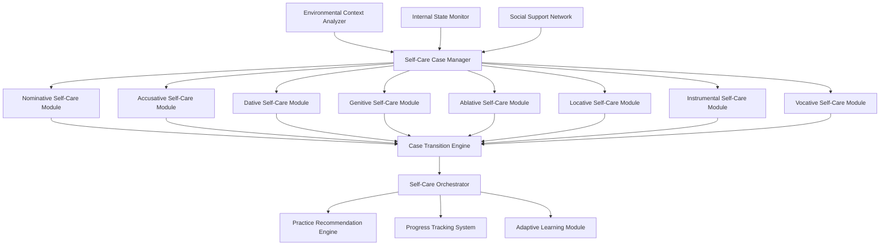

# Grammatical Cases as Self-Care Framework: CEREBRUM Integration

## 1. Introduction to Case-Based Self-Care

This document presents a novel framework for understanding and implementing self-care practices through the lens of grammatical cases, integrated with CEREBRUM's computational architecture. By mapping self-care dimensions to linguistic case functions, we create a systematic approach to self-regulation that leverages the rich semantic and relational structures inherent in case systems.

The framework treats self-care as a multi-dimensional practice where different aspects of self-maintenance correspond to different grammatical roles and relationships. This approach provides both a theoretical foundation for understanding self-care as a relational practice and a practical methodology for implementing computational systems that support comprehensive self-regulation.

## 2. Theoretical Foundations

### 2.1 Self-Care as Relational Practice

Traditional approaches to self-care often treat it as a collection of isolated activities or techniques. The case-based approach reframes self-care as a complex relational system where the self exists in multiple grammatical positions simultaneously, each requiring different forms of attention and intervention.

Key theoretical insights include:

* **Multi-Positional Self**: The self can occupy different grammatical cases simultaneously, requiring different forms of care
* **Relational Dynamics**: Self-care involves managing relationships between different aspects of the self and environment
* **Case Transitions**: Effective self-care requires fluid movement between different case positions
* **Contextual Appropriateness**: Different situations require different case-based self-care strategies

### 2.2 Integration with CEREBRUM Architecture

The case-based self-care framework integrates seamlessly with CEREBRUM's computational architecture:

* **Model Transformations**: Self-care practices can be modeled as case transformations within CEREBRUM
* **Free Energy Minimization**: Self-care activities can be understood as free energy minimization in different case contexts
* **Active Inference**: Self-care involves active inference processes across multiple case dimensions
* **Predictive Processing**: Self-care practices update generative models of self in different case positions

## 3. Grammatical Cases as Self-Care Dimensions

### 3.1 Core Case Mappings

The following table maps each grammatical case to specific self-care dimensions and practices:

| Case | Linguistic Function | Self-Care Dimension | Core Practices | CEREBRUM Implementation |
|------|-------------------|-------------------|----------------|------------------------|
| **Nominative** | Subject/Agent | **Self-Agency & Sovereignty** | Goal setting, Assertiveness, Autonomy | Model as active predictor of self-states |
| **Accusative** | Direct Object | **Self-Impact & Acknowledgment** | Shadow work, Reflection, Self-assessment | Model as object of evaluation and transformation |
| **Dative** | Recipient | **Receiving Care & Support** | Therapy, Social support, Coaching | Model as recipient of care and resources |
| **Genitive** | Possession | **Boundaries & Ownership** | Saying "no", Prioritization, Space-making | Model as source of outputs and boundaries |
| **Ablative** | Source/Movement Away | **Detox & Release** | Digital fasting, Emotional release, Decluttering | Model as origin of transformation and letting go |
| **Locative** | Location/Place | **Environment & Sanctuary** | Sacred spaces, Nature connection, Safe environments | Model as context and environmental framework |
| **Instrumental** | Means/Tools | **Healing Modalities** | Breathwork, Meditation, Acupuncture | Model as tool for transformation and healing |
| **Vocative** | Direct Address | **Self-Summonsing** | Affirmations, Prayer, Inner dialogue | Model as directly addressable entity |

### 3.2 Extended Case System

Beyond the core eight cases, additional cases provide nuanced self-care dimensions:

| Extended Case | Function | Self-Care Dimension | Practices |
|---------------|----------|-------------------|-----------|
| **Allative** | Motion Toward | **Growth & Aspiration** | Vision boards, Coaching objectives, Skill development |
| **Illative** | Motion Into | **Immersion & Deep Work** | Retreats, Flow states, Intensive therapy |
| **Elative** | Motion Out Of | **Emergence & Integration** | Breakthrough processing, Coming out, Rebirth rituals |
| **Perlative** | Motion Through | **Transition Navigation** | Rites of passage, Grief processing, Life transitions |
| **Comitative** | Accompaniment | **Relational Care** | Friendship, Group therapy, Co-regulation |
| **Temporal** | Time/Duration | **Rhythm & Timing** | Sleep hygiene, Cyclical living, Biorhythm tracking |

## 4. CEREBRUM Implementation Architecture

### 4.1 System Architecture

The case-based self-care system within CEREBRUM consists of interconnected modules:

### 4.2 Core Components

#### 4.2.1 Case-Specific Self-Care Modules

Each case module implements specialized self-care functionality:

**Nominative Module (Self-Agency)**
* **Capabilities**: Goal setting, decision making, autonomy support
* **Free Energy Formulation**: $F_{NOM}[q] = D_{KL}[q(s) || p(s)] - \alpha_{NOM} \cdot E_q[\log p(o|s)]$
* **Key Functions**: Assertiveness training, boundary setting, self-determination

**Accusative Module (Self-Impact)**
* **Capabilities**: Self-assessment, impact acknowledgment, transformation tracking
* **Free Energy Formulation**: $F_{ACC}[q] = D_{KL}[q(s) || p(s)] - \alpha_{ACC} \cdot E_q[\log p(o|s)]$
* **Key Functions**: Shadow work, reflection practices, self-evaluation

**Dative Module (Receiving Care)**
* **Capabilities**: Support reception, resource integration, vulnerability management
* **Free Energy Formulation**: $F_{DAT}[q] = D_{KL}[q(s) || p(s)] - \alpha_{DAT} \cdot E_q[\log p(o|s)]$
* **Key Functions**: Therapy coordination, social support facilitation, care acceptance

**Genitive Module (Boundaries & Ownership)**
* **Capabilities**: Boundary management, resource ownership, priority setting
* **Free Energy Formulation**: $F_{GEN}[q] = D_{KL}[q(s) || p(s)] - \alpha_{GEN} \cdot E_q[\log p(o|s)]$
* **Key Functions**: Saying "no", space creation, resource allocation

**Ablative Module (Release & Detox)**
* **Capabilities**: Letting go, detoxification, transformation initiation
* **Free Energy Formulation**: $F_{ABL}[q] = D_{KL}[q(s) || p(s)] - \alpha_{ABL} \cdot E_q[\log p(o|s)]$
* **Key Functions**: Digital detox, emotional release, decluttering

**Locative Module (Environment & Sanctuary)**
* **Capabilities**: Environmental optimization, safe space creation, context management
* **Free Energy Formulation**: $F_{LOC}[q] = D_{KL}[q(s) || p(s)] - \alpha_{LOC} \cdot E_q[\log p(o|s)]$
* **Key Functions**: Sacred space design, nature connection, environmental safety

**Instrumental Module (Healing Tools)**
* **Capabilities**: Modality selection, tool application, technique optimization
* **Free Energy Formulation**: $F_{INS}[q] = D_{KL}[q(s) || p(s)] - \alpha_{INS} \cdot E_q[\log p(o|s)]$
* **Key Functions**: Meditation guidance, breathwork instruction, technique selection

**Vocative Module (Self-Summoning)**
* **Capabilities**: Direct self-address, affirmation generation, inner dialogue
* **Free Energy Formulation**: $F_{VOC}[q] = D_{KL}[q(s) || p(s)] - \alpha_{VOC} \cdot E_q[\log p(o|s)]$
* **Key Functions**: Affirmation creation, prayer generation, inner voice activation

#### 4.2.2 Case Transition Engine

The Case Transition Engine manages fluid movement between different self-care case positions:

* **Transition Triggers**: Environmental changes, internal state shifts, practice completion
* **Transition Logic**: Bayesian inference for optimal case selection
* **Transition Smoothness**: Gradual case transformations to maintain continuity
* **Transition History**: Learning from successful case transitions

#### 4.2.3 Self-Care Orchestrator

The orchestrator coordinates multiple case modules:

* **Multi-Case Integration**: Simultaneous operation of multiple case modules
* **Priority Management**: Dynamic prioritization of case-based needs
* **Conflict Resolution**: Mediation between competing case requirements
* **Resource Allocation**: Optimal distribution of attention and energy

## 5. Implementation Technologies

### 5.1 Perception and Monitoring

* **Multi-Modal Self-Assessment**: Physiological monitoring, behavioral tracking, emotional state detection
* **Environmental Sensing**: Context awareness, social dynamics monitoring, resource availability tracking
* **Temporal Pattern Recognition**: Circadian rhythm analysis, seasonal pattern detection, life cycle awareness
* **Social Network Analysis**: Support network mapping, relationship quality assessment, social capital tracking

### 5.2 Modeling and Prediction

* **Case-Specific Generative Models**: Specialized models for each self-care case dimension
* **Transition Probability Modeling**: Bayesian networks for case transition prediction
* **Practice Effectiveness Modeling**: Learning from practice outcomes and adaptations
* **Personalization Engines**: Individual-specific model adaptation and optimization

### 5.3 Intervention and Support

* **Adaptive Practice Recommendation**: Dynamic suggestion of appropriate self-care practices
* **Real-Time Guidance**: Contextual support during practice execution
* **Progress Tracking**: Multi-dimensional progress monitoring across case dimensions
* **Social Integration**: Coordination with human support networks and professionals

## 6. Application Domains

### 6.1 Personal Self-Care Systems

* **Individual Wellness Platforms**: Comprehensive self-care support for personal use
* **Mental Health Support**: Integration with therapeutic interventions and mental health care
* **Lifestyle Optimization**: Holistic lifestyle management and optimization
* **Personal Development**: Structured personal growth and development support

### 6.2 Clinical and Therapeutic Applications

* **Therapeutic Support Systems**: Integration with professional mental health care
* **Rehabilitation Programs**: Support for recovery and rehabilitation processes
* **Preventive Healthcare**: Proactive health and wellness maintenance
* **Crisis Intervention**: Support during acute stress and crisis situations

### 6.3 Organizational and Community Applications

* **Workplace Wellness**: Employee wellness and stress management programs
* **Educational Settings**: Student wellness and mental health support
* **Community Health**: Public health and community wellness initiatives
* **Social Support Networks**: Enhanced community support and care coordination

## 7. Experimental Implementations

### 7.1 Prototype System: CARE (Case-Aware Relational Enhancement)

The CARE system demonstrates key principles of case-based self-care:

* **Core Capabilities**: Multi-case self-care coordination, adaptive practice recommendation, progress tracking
* **Learning Paradigm**: Develops personalized self-care strategies through interaction and outcome analysis
* **Application Focus**: Personal wellness, mental health support, lifestyle optimization
* **Evaluation Metrics**: Wellness indicators, stress reduction, life satisfaction measures
* **Key Findings**: Demonstrates significant improvements in comprehensive wellness outcomes

### 7.2 Case Studies

* **Multi-Case Integration**: Effectiveness of coordinating multiple case-based practices
* **Transition Optimization**: Learning optimal case transition patterns
* **Personalization Success**: Individual adaptation and optimization outcomes
* **Longitudinal Outcomes**: Long-term wellness and life satisfaction improvements
* **Social Integration**: Effectiveness of social support network integration

## 8. Theoretical Implications

### 8.1 Cognitive Science Implications

* **Multi-Dimensional Self-Regulation**: Evidence for complex, multi-faceted self-regulation processes
* **Case-Based Cognition**: Support for case-based approaches to cognitive organization
* **Relational Self-Models**: Insights into relational aspects of self-concept and self-care
* **Dynamic Self-Organization**: Understanding of fluid self-organization across different dimensions

### 8.2 Philosophical Dimensions

* **Self as Multi-Positional**: Philosophical implications of multi-positional self-conception
* **Care as Relational Practice**: Ethical and philosophical understanding of care as relational
* **Agency and Receptivity**: Balance between active agency and receptive care
* **Authenticity in Self-Care**: Questions about genuine vs. performative self-care

## 9. Ethical Considerations

### 9.1 Ethical Frameworks

* **Self-Care Ethics**: Specialized ethical principles for self-care technologies
* **Autonomy Preservation**: Maintaining individual autonomy in self-care decisions
* **Privacy and Dignity**: Protecting personal information and maintaining dignity
* **Access and Equity**: Ensuring equitable access to self-care support

### 9.2 Design Principles

* **Transparency**: Clear communication about system capabilities and limitations
* **User Control**: Maintaining user control over self-care decisions and practices
* **Cultural Sensitivity**: Respecting diverse cultural approaches to self-care
* **Professional Integration**: Appropriate integration with professional care providers

## 10. Future Research Directions

### 10.1 Short-Term Research Agenda

* **Case Transition Optimization**: Improving case transition algorithms and timing
* **Personalization Enhancement**: Advanced personalization and adaptation capabilities
* **Social Integration**: Enhanced social support network integration
* **Cultural Adaptation**: Adaptation to diverse cultural self-care practices
* **Professional Integration**: Better integration with professional healthcare systems

### 10.2 Long-Term Vision

* **Autonomous Self-Care Systems**: Advanced autonomous self-care coordination
* **Predictive Self-Care**: Proactive self-care based on predictive modeling
* **Collective Self-Care**: Community and collective self-care optimization
* **Novel Self-Care Modalities**: Discovery of new self-care practices and approaches
* **Self-Care Superintelligence**: Advanced AI systems for comprehensive self-care support

## 11. Integration with CEREBRUM Ecosystem

### 11.1 Connections to Other CEREBRUM Components

* **Active Inference Integration**: Self-care as active inference processes
* **Case System Integration**: Leveraging CEREBRUM's case transformation capabilities
* **Emotional Intelligence**: Integration with affective computing components
* **Social Intelligence**: Coordination with social and relational intelligence systems
* **Environmental Intelligence**: Integration with environmental awareness and adaptation

### 11.2 Implementation Roadmap

* **Phase 1**: Development of core case-specific self-care modules
* **Phase 2**: Implementation of case transition and orchestration systems
* **Phase 3**: Integration with personal monitoring and assessment systems
* **Phase 4**: Development of social and professional integration capabilities
* **Phase 5**: Advanced personalization and autonomous operation capabilities

## 12. Conclusion

The case-based self-care framework represents a fundamental advance in how we understand and implement self-care practices. By leveraging the rich semantic and relational structures of grammatical cases, we create a comprehensive approach to self-regulation that honors the complexity and multi-dimensionality of human wellness.

This framework provides both theoretical insights into the nature of self-care as a relational practice and practical methodologies for implementing computational systems that support comprehensive self-regulation. As we continue to develop these systems, we move toward a future where self-care is not just a collection of isolated practices but a sophisticated, adaptive, and deeply relational approach to human flourishing.

The integration with CEREBRUM's computational architecture ensures that these insights can be implemented in practical systems that support real-world self-care needs, while the theoretical framework provides a foundation for continued research and development in this crucial area of human wellbeing. 