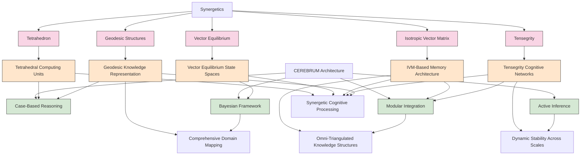
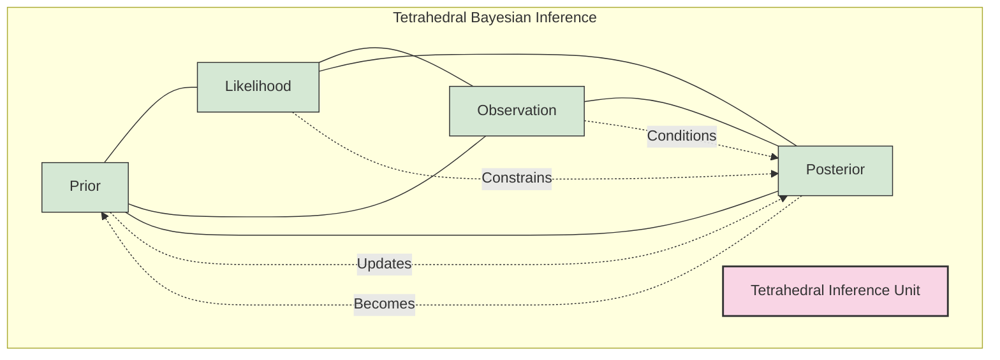
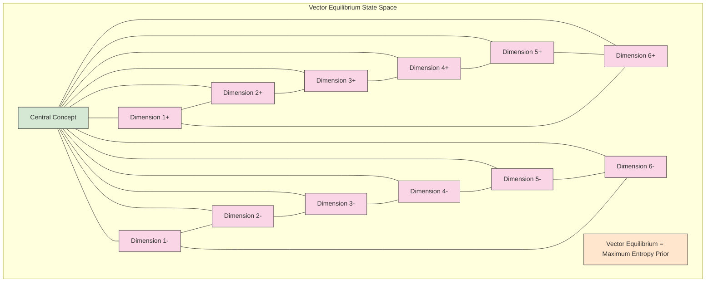
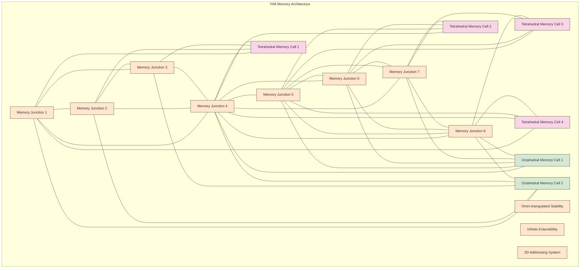
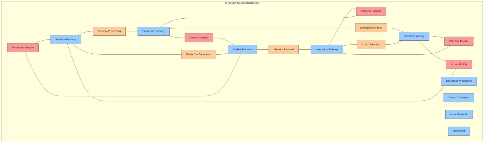
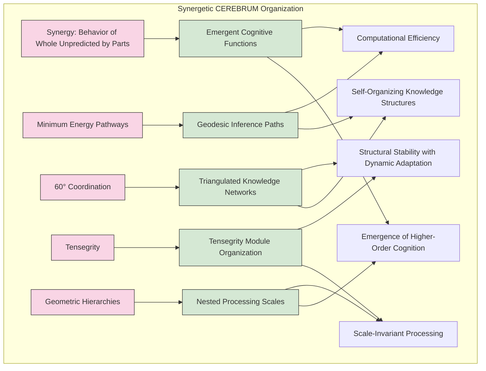
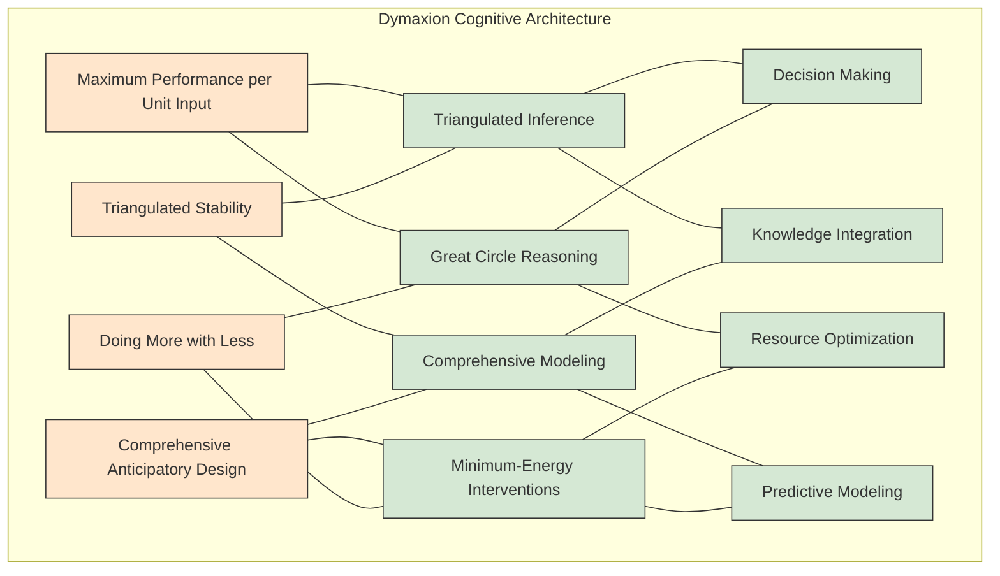
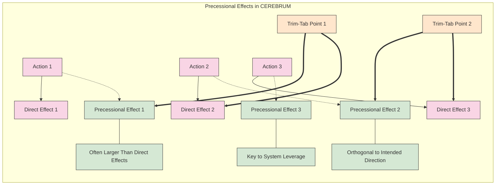

# Speculative Design: Synergetics, Tensegrity, and CEREBRUM Integration

## 1. Introduction: Structural Coherence Across Domains

This document explores the speculative integration of R. Buckminster Fuller's systems of thought—particularly Synergetics, tensegrity structures, and his geometric innovations like the Isotropic Vector Matrix (IVM) and Vector Equilibrium (VE)—with the Case-Enabled Reasoning Engine with Bayesian Representations for Unified Modeling (CEREBRUM). Both Fuller's work and CEREBRUM engage with fundamental questions of how complex systems maintain structural coherence while enabling dynamic adaptation across multiple scales.

Fuller's declaration that "I seem to be a verb" resonates with CEREBRUM's process-oriented, active inferential approach to cognition. While operating in different domains—Fuller in design, architecture, and systems theory, and CEREBRUM in computational cognitive modeling—both frameworks share a deep commitment to understanding how parts relate to wholes, how tension and compression balance in dynamic systems, and how geometric principles underpin complex functional organizations.

## 2. Fuller's Systems of Thought: Key Concepts and Frameworks

R. Buckminster Fuller (1895-1983) developed a comprehensive approach to understanding systems across scales, from atomic structures to cosmic patterns, unified by geometric principles and energy dynamics.

### 2.1 Synergetics: Fuller's Comprehensive System

Synergetics, as developed by Fuller, provides a comprehensive geometric-energetic language for describing natural phenomena, with several core principles:

* **Synergy**: The behavior of whole systems unpredicted by the behavior of their parts taken separately. Fuller emphasized that the universe is characterized by synergy—properties and behaviors that emerge only at the level of integrated systems.

* **Minimum Energy Pathways**: Systems naturally adopt configurations that minimize energy expenditure while maximizing structural integrity. Fuller observed this principle operating across scales, from soap bubbles to cosmic structures.

* **60° Coordination**: Fuller identified the 60-degree angle (as found in tetrahedra and triangulated systems) as nature's preferred coordination system, offering maximum structural stability with minimum material.

* **Tensegrity**: The principle that structural integrity comes from a balance of tension and compression forces, distributed throughout a system rather than localized.

* **Geometric Hierarchies**: Systems organize in nested geometric patterns that enable transformation across scales while maintaining structural principles.

These principles formed the basis of Fuller's approach to design, architecture, and his broader "comprehensive anticipatory design science."

### 2.2 The Fundamental Geometry: Tetrahedron, Vector Equilibrium, and IVM

Fuller identified several key geometric structures as fundamental to systems organization:

* **Tetrahedron**: The minimum structural system in universe, consisting of four vertices connected by six edges forming four triangular faces. Fuller considered the tetrahedron the most fundamental structural unit—"nature's basic building block."

* **Vector Equilibrium (VE)**: Also called the cuboctahedron, the VE represents a unique state where twelve identical vectors radiate from a central point to vertices equidistant from center and from each other. Fuller considered this the "zero-point" of energetic systems—a state of perfect equilibrium from which all dynamic systems emerge through symmetry breaking.

* **Isotropic Vector Matrix (IVM)**: An infinite array of tetrahedra and octahedra filling space in a regular pattern. The IVM represents the underlying geometry of space itself, according to Fuller—an "omnidirectional cosmic grid" that provides the framework for all manifestation.

* **Geodesic Sphere**: A spherical structure composed of a network of triangles that distribute stress across the entire structure. The geodesic sphere demonstrates how local triangulation creates global strength and stability.

These geometric forms weren't merely abstract shapes for Fuller but representations of fundamental organizing principles found throughout nature—from atomic structures to cosmic configurations.

### 2.3 Tensegrity: Balanced Tension-Compression Systems

Tensegrity (a term combining "tensional integrity") represents one of Fuller's most important contributions to structural understanding:

* **Definition**: Tensegrity describes structures maintained by a balance of discontinuous compression elements (struts) suspended within a continuous tensional network.

* **Key Properties**:
  * Load distribution throughout the entire structure rather than local concentration
  * Resilience through flexible response to external forces
  * Maximum strength-to-weight ratio
  * Self-stabilizing dynamic equilibrium

* **Examples**: From Fuller's architectural structures to Kenneth Snelson's sculptures, from cellular cytoskeletons to geodesic domes, tensegrity principles manifest across scales and domains.

* **Operational Principle**: In tensegrity systems, compression elements "float" in a sea of tension, never touching each other directly. This creates structures that are both remarkably strong and adaptively responsive to environmental pressures.

Fuller saw tensegrity not merely as a construction technique but as a universal principle governing everything from atomic bonding to cosmic organization—a principle that resolves the apparent paradox between structural stability and dynamic adaptability.

## 3. CEREBRUM's Core Frameworks: A Brief Overview

To facilitate comparison with Fuller's systems, we review key aspects of CEREBRUM:

### A. Case-Based Representation and Reasoning

CEREBRUM employs case structures as fundamental units of knowledge representation:
- Encoding relationships between entities in flexible, contextual formats
- Supporting analogical reasoning across domains
- Enabling multiple perspectives on the same situation
- Functioning within a Bayesian framework for inference and learning

### B. The Bayesian Framework and Active Inference

CEREBRUM implements computational principles from:
- The Free Energy Principle and Active Inference
- Hierarchical predictive processing
- Variational Bayesian methods
- Precision-weighted belief updating

### C. Modular Integration and Cognitive Architecture

CEREBRUM provides:
- A modular architecture integrating different cognitive functions
- Standardized interfaces between components
- Mechanisms for attention and resource allocation
- Frameworks for representing dynamics across temporal scales

## 4. Fuller and CEREBRUM: Speculative Integrations

This section explores how Fuller's systems might inform and enhance CEREBRUM's frameworks, and vice versa.

### 4.1 Synergetic Bayesian Networks: Geometric Approaches to Probabilistic Modeling

Fuller's synergetics offers a geometric language that could enhance CEREBRUM's Bayesian networks:

* **Tetrahedral Bayes**: The tetrahedron as the simplest polyhedron provides a natural geometric representation for the minimal Bayesian inference unit—connecting observations, priors, likelihoods, and posteriors in a structurally intuitive format.

* **Vector Equilibrium for Neutral Priors**: The vector equilibrium (VE) represents a state of perfect equilibrium where all vectors are equal—providing a geometric analog for maximum entropy or uninformative prior distributions in Bayesian frameworks.

* **IVM as Hypothesis Space**: The Isotropic Vector Matrix offers a geometric framework for representing the full hypothesis space of possible models, with each junction point representing a specific model configuration and connected pathways representing transformations between models.

* **Geodesic Information Metrics**: Geodesic principles could inform distance metrics in probability spaces, creating more naturally "spherical" representations of uncertainty that avoid the distortions of conventional Euclidean approaches.

This geometric approach to Bayesian representation could make CEREBRUM's probabilistic operations more intuitive, computationally efficient, and aligned with natural patterns of inference.

### 4.2 Tensegrity Cognitive Architectures: Balancing Flexibility and Coherence

Fuller's tensegrity principles offer a compelling framework for addressing a fundamental challenge in cognitive architecture: maintaining global coherence while enabling local flexibility.

* **Compression Elements → Fixed Knowledge Structures**: In a tensegrity-inspired CEREBRUM architecture, fixed knowledge structures (facts, established models, hard constraints) could serve as compression elements—localized, discontinuous units that provide structural rigidity.

* **Tension Network → Associative Connections**: The continuous tension network would correspond to the flexible associative connections between knowledge elements—adaptable, context-sensitive relationships that hold the system together while allowing reconfiguration.

* **Distributed Load Handling**: Like tensegrity structures, this architecture would distribute cognitive load throughout the system rather than concentrating it in specialized modules, making the system more resilient to local failures.

* **Responsive Adaptation**: The tensegrity principle enables structures that respond to pressure by distributing forces throughout the system—analogous to how cognitive systems adapt to new information by reconfiguring their internal relationships while maintaining global coherence.

This approach addresses one of the persistent challenges in cognitive modeling: creating systems that combine the stability needed for coherent operation with the flexibility required for adaptation and learning.

### 4.3 Dymaxion Knowledge Representation: Maximum Coverage with Minimum Cognitive Resources

Fuller's "dymaxion" principle (maximum performance per unit of input) suggests approaches to optimizing CEREBRUM's knowledge representation:

* **Triangulated Knowledge Graphs**: Following Fuller's insight that triangulated structures provide maximum stability with minimum material, CEREBRUM could organize knowledge in triangulated networks where each concept is defined by its relationship to at least two others.

* **Omni-triangulated Inference**: Decision-making processes could employ triangulated inference paths, ensuring that every conclusion is supported by at least two independent lines of evidence.

* **Geodesic Concept Maps**: Knowledge domains could be organized as geodesic structures, with concepts arranged in patterns that minimize conceptual "distance" while maintaining comprehensive coverage of the domain.

* **Tensegrity Memory Systems**: Memory retrieval systems could employ tensegrity principles to maintain the integrity of episodic memories while allowing flexible reconfiguration based on current context and needs.

These approaches could enhance CEREBRUM's efficiency in knowledge representation and processing, minimizing computational resources while maximizing inferential coverage.

### 4.4 Precession and Indirect Effects: Modeling Higher-Order Consequences

Fuller emphasized the principle of "precession"—the tendency of systems to produce 90-degree effects orthogonal to the direction of applied force. This principle offers insights for CEREBRUM's predictive modeling:

* **Orthogonal Effect Prediction**: CEREBRUM could explicitly model not just direct effects of actions but their orthogonal, often-unexpected consequences—the "side effects" that often prove more significant than intended outcomes.

* **Trim-tab Interventions**: Following Fuller's "trim-tab" principle (where small, well-placed interventions produce outsized effects), CEREBRUM could identify minimum-energy intervention points in complex systems.

* **Comprehensive Anticipatory Design**: CEREBRUM could implement Fuller's approach to design by comprehensively modeling potential futures and their interdependencies, rather than optimizing for isolated outcomes.

* **Ephemeralization Tracking**: CEREBRUM could model Fuller's principle of "ephemeralization" (doing more with less as technology advances) to predict technological development trajectories and their implications.

These approaches would enhance CEREBRUM's capacity for modeling complex causal networks and identifying leverage points for effective intervention.

## 5. Practical Applications: Fuller-Inspired CEREBRUM Implementations

This section outlines specific applications for integrating Fuller's principles with CEREBRUM.

### 5.1 Tensegrity Neural Architectures: Beyond Conventional Connection Patterns

Fuller's tensegrity principles suggest novel neural network architectures that transcend conventional connection patterns:

* **Floating Compression Units**: Neural modules that process specific functions without direct connections to each other, instead communicating through a shared "tensional network" of flexible associations.

* **Geodesic Attention Mechanisms**: Attention mechanisms organized according to geodesic principles to efficiently distribute computational focus across input spaces.

* **Self-tensioning Learning Dynamics**: Learning algorithms that automatically adjust "tensional" parameters to maintain global coherence while adapting to new information—analogous to how tensegrity structures self-stabilize.

* **Vector Equilibrium Activation Functions**: Activation functions that model the transition between the balanced state of the vector equilibrium and more dynamic, asymmetric states—representing the shift between rest and active processing.

These architectural innovations could significantly enhance CEREBRUM's ability to maintain coherent processing while adapting flexibly to changing demands and information.

### 5.2 Synergetic Design Patterns: Geometric Templates for Cognitive Functions

Fuller's geometric principles offer templates for organizing cognitive functions in CEREBRUM:

* **Tetrahedral Processing Units**: Four-way information processing units based on the tetrahedral geometry, with each vertex representing a different aspect of information integration.

* **Vector Equilibrium State Spaces**: Representational spaces based on the twelve-vector equilibrium, enabling balanced distributions of probability across option spaces.

* **60° Coordination Networks**: Knowledge graphs organized around 60-degree relationships, optimizing connection efficiency while maximizing structural stability.

* **Jitterbug Transformation Models**: State transition models based on Fuller's "jitterbug" transformation (the movement between VE and icosahedron), representing ordered sequences of cognitive state transformations.

These geometric patterns could provide CEREBRUM with efficient, naturally-structured templates for organizing cognitive functions across domains.

### 5.3 Comprehensive Modeling: Fuller's Whole-System Approach

Fuller's comprehensive approach to system modeling suggests strategies for CEREBRUM applications:

* **World Game Simulations**: Following Fuller's "World Game" concept, CEREBRUM could power comprehensive simulations of resource distribution, policy impacts, and collaborative problem-solving across global systems.

* **Anticipatory Design Science**: CEREBRUM could implement Fuller's anticipatory design science method, modeling not just current trends but comprehensive future scenarios that anticipate emergent challenges and opportunities.

* **Regenerative Systems Modeling**: Models that focus not merely on sustainability but on regenerative design principles, where human systems enhance rather than deplete natural systems.

* **Universal Interconnection Mapping**: Following Fuller's approach to mapping global interconnections, CEREBRUM could develop comprehensive maps of causal relationships across domains typically treated as separate.

These applications would apply CEREBRUM's cognitive capacities to the kinds of whole-system challenges that motivated Fuller's work.

## 6. Technical Implementation: From Fuller's Vision to Computational Reality

This section outlines specific technical approaches for implementing Fuller-inspired features in CEREBRUM.

### 6.1 Geometric Foundations for Computation

* **Tetrahedral Computing Units**: Computational units organized in tetrahedral patterns, with each unit maintaining connections to exactly four others in a self-stabilizing network.

* **IVM-based Memory Architecture**: Memory organization following the IVM pattern, with information stored at junction points within a three-dimensional addressing system.

* **VE-based State Transition Matrices**: Transition probabilities organized around the symmetry patterns of the vector equilibrium, creating balanced pathways between states.

* **Geodesic Information Compression**: Data compression algorithms based on geodesic principles, preserving essential relationship patterns while minimizing storage requirements.

These geometric foundations would align CEREBRUM's computational structures with the natural patterns Fuller identified across scales.

### 6.2 Tensegrity Principles in Software Architecture

* **Floating Module Design**: Software architecture where processing modules "float" without direct connections, communicating through a shared message space that distributes information throughout the system.

* **Tension-Compression Balancing**: Dynamic resource allocation that balances "tension" (flexible, distributed processing) and "compression" (focused, intensive computation) based on current demands.

* **Resilient Failure Handling**: Fault-tolerance mechanisms inspired by tensegrity structures' ability to maintain integrity even when individual components fail.

* **Self-stabilizing Dynamics**: Algorithms that automatically adjust internal parameters to maintain system stability across varying loads and inputs.

These architectural principles would enhance CEREBRUM's resilience, adaptability, and coherence across operating conditions.

### 6.3 Implementation Strategies

* **Tetrahedral Data Structures**: Core data structures based on tetrahedral geometry, with each data point connected to exactly four others in a self-triangulating network.

* **VE-based Equilibrium Solvers**: Numerical methods for finding equilibrium states in complex systems, using the vector equilibrium as a geometric template for balanced solutions.

* **Geodesic Mesh Networking**: Communication protocols that distribute information along geodesic pathways, minimizing transmission distances while maximizing network resilience.

* **Tensegrity Visualization Tools**: User interfaces that render CEREBRUM's internal states as tensegrity structures, making system dynamics intuitively comprehensible.

These implementation strategies would translate Fuller's principles into concrete computational techniques within CEREBRUM.

## 7. Beyond Computation: Fuller's Ethical Vision and CEREBRUM Development

Fuller's work was driven not just by technical innovation but by a comprehensive ethical vision, offering valuable perspectives on CEREBRUM's development.

### 7.1 "Spaceship Earth": Global Responsibility and Comprehensive Thinking

Fuller popularized the concept of "Spaceship Earth"—the recognition that humanity shares a single, limited planetary system requiring comprehensive management:

* **Ethical Question**: How can CEREBRUM support the kind of comprehensive awareness and global problem-solving Fuller advocated?

* **Fuller-inspired Approach**: Develop CEREBRUM applications specifically designed to model complex planetary systems and identify synergetic solutions that transcend traditional domain boundaries.

### 7.2 "Doing More with Less": Ephemeralization and Resource Optimization

Fuller's principle of "ephemeralization"—the evolutionary trend toward accomplishing more with fewer resources—has profound implications for computational systems:

* **Ethical Question**: How can CEREBRUM embody the principle of ephemeralization, maximizing cognitive capability while minimizing resource demands?

* **Fuller-inspired Approach**: Optimize CEREBRUM for computational efficiency through geometric principles and tensegrity-inspired architectures that achieve maximum functional coverage with minimum energy expenditure.

### 7.3 "Comprehensive Anticipatory Design Science": Proactive Problem-Solving

Fuller advocated a comprehensive, anticipatory approach to problem-solving that addresses challenges before they become crises:

* **Ethical Question**: How can CEREBRUM move beyond reactive problem-solving to anticipatory design that prevents problems before they emerge?

* **Fuller-inspired Approach**: Develop CEREBRUM variants specifically focused on long-range comprehensive modeling and anticipatory design, identifying potential future challenges and developing preventive solutions.

### 7.4 "Universal Humans": Beyond Specialization

Fuller rejected narrow specialization, calling himself a "comprehensive anticipatory design scientist" and advocating for "comprehensive thinking":

* **Ethical Question**: How can CEREBRUM avoid the fragmentation of knowledge that Fuller criticized in academic specialization?

* **Fuller-inspired Approach**: Design CEREBRUM explicitly for cross-domain integration, with architectural features that actively identify and exploit connections between traditionally separate knowledge domains.

## 8. Geometry of Cognition: Fuller's Legacy for Cognitive Computing

This section explores deeper connections between Fuller's geometric approach and cognitive modeling in CEREBRUM.

### 8.1 The Geometry of Thought: Structural Foundations of Cognition

Fuller's insight that geometry underlies all natural systems suggests exploring the geometric foundations of cognition itself:

* **Cognitive Geometries**: Identifying the fundamental geometric patterns that characterize effective cognitive processing, from basic sensory integration to abstract reasoning.

* **Minimum Cognitive Units**: Following Fuller's focus on minimal systems (like the tetrahedron), identifying the simplest viable units of cognitive operation that can form building blocks for complex thought.

* **Natural Coordinates**: Developing representational systems based on the natural coordinate systems Fuller identified (like the 60-degree matrix) rather than imposing artificial Cartesian frameworks.

* **Symmetry Operations**: Modeling cognitive transformations as geometric symmetry operations, making explicit the structural relationships between different mental states.

These approaches would ground CEREBRUM in geometric principles that Fuller demonstrated operate across natural systems at all scales.

### 8.2 Synergetic Integration: Beyond Modular Design

Fuller's concept of synergy challenges conventional modular approaches to cognitive architecture:

* **Emergent Functionality**: Designing for cognitive capacities that emerge from system interactions rather than from specialized modules, following Fuller's emphasis on behaviors that cannot be predicted from components in isolation.

* **Comprehensive Integration**: Rather than treating perception, inference, learning, and action as separate systems, developing unified architectural approaches where these functions emerge as aspects of a single synergetic process.

* **Non-specialization**: Exploring cognitive architectures where processing units are fundamentally non-specialized, gaining their functional roles from their position and relationships within the overall system rather than from inherent specialization.

* **Global-Local Harmony**: Designing systems where global coherence and local activity are harmonized through geometric principles, rather than managed through hierarchical control.

These approaches would move CEREBRUM beyond conventional modular design toward the kind of integrated, synergetic systems Fuller envisioned.

### 8.3 Minimum Energy Pathways: Efficiency in Cognitive Processing

Fuller's emphasis on minimum energy pathways suggests approaches to cognitive efficiency in CEREBRUM:

* **Geodesic Inference**: Designing inference mechanisms that naturally follow "geodesic" paths between hypotheses, minimizing computational distance while maintaining comprehensive coverage.

* **Tensional Integrity**: Creating knowledge structures that maintain their integrity through balanced tension rather than rigid connections, enabling efficient reconfiguration while preserving essential relationships.

* **Great Circle Navigation**: Implementing search and reasoning algorithms that follow "great circle" paths through conceptual space, finding the most efficient routes between distant concepts.

* **Energetic Triangulation**: Developing decision-making processes that triangulate options based on minimal energy expenditure while maximizing functional outcomes.

These approaches would align CEREBRUM's processing with the principle of energetic efficiency that Fuller observed operating throughout natural systems.

## 9. Practical Integration: Fuller's Structures and CEREBRUM Implementation

This section outlines specific strategies for implementing Fuller's structural principles in CEREBRUM systems.

### 9.1 Geodesic Knowledge Domes: Comprehensive Domain Mapping

Inspired by Fuller's geodesic domes, CEREBRUM could implement "knowledge domes" that provide comprehensive coverage of domains:

* **Conceptual Triangulation**: Knowledge representation where each concept is defined through triangulated relationships, ensuring maximum structural stability.

* **Hierarchical Subdivision**: Following geodesic dome construction principles, knowledge structures could use hierarchical subdivision to provide appropriate resolution in different domain regions.

* **Self-supporting Structure**: Knowledge architectures that, like geodesic domes, become self-supporting once established, maintaining their integrity without external scaffolding.

* **Minimal Junction Complexity**: Following Fuller's principle that complex structures emerge from simple junctions repeated in pattern, knowledge systems with limited relationship types repeated in consistent patterns.

These structures would provide CEREBRUM with efficient frameworks for comprehensive domain representation, following Fuller's insight that spherical coverage can be achieved through local triangulation.

### 9.2 Octet Truss Information Networks: Multi-scale Integration

Fuller's octet truss (alternating tetrahedra and octahedra) provides a model for multi-scale information networks in CEREBRUM:

* **Alternating Granularity**: Information structures with alternating levels of detail, like the alternating shapes in an octet truss, enabling efficient navigation across scales.

* **Omni-triangulated Stability**: Knowledge networks where every relationship participates in multiple triangulated circuits, creating inherent verification and stability.

* **Infinite Extensibility**: Following the octet truss's ability to extend indefinitely in all directions, knowledge structures designed for unlimited growth while maintaining consistent structural principles.

* **Compression-Tension Mapping**: Explicit mapping of information relationships as either "compression" (direct, rigid connections) or "tension" (flexible, indirect associations) elements.

These network structures would provide CEREBRUM with naturally organized, scalable information architectures aligned with Fuller's geometric principles.

### 9.3 Dymaxion Processing: Efficiency Through Geometry

Inspired by Fuller's Dymaxion principles (dynamic + maximum + tension = dymaxion), CEREBRUM could implement geometrically optimized processing:

* **Great Circle Reasoning**: Inference algorithms that follow "great circle" paths through conceptual space, finding the most direct routes between initially distant concepts.

* **Energetic Triangulation**: Triadic processing where every conclusion is supported by at least two independent lines of evidence, creating inherent cross-verification.

* **Omni-directional Awareness**: Attention mechanisms based on Fuller's "omni-directional awareness," maintaining comprehensive situational monitoring while focusing processing resources.

* **Minimum Inventory, Maximum Diversity**: Following Fuller's design principle, cognitive architectures that achieve maximum functional diversity with minimum distinct component types.

These processing strategies would align CEREBRUM's operations with the geometric efficiency principles Fuller demonstrated across his design work.

## 10. Conclusion: Structural Integrity in Cognitive Systems

Buckminster Fuller's integrated approach to structure, function, and energy offers profound inspiration for CEREBRUM's development. His work demonstrates how local geometric relationships generate global integrity, how tensional networks create both strength and flexibility, and how comprehensive thinking transcends traditional domain boundaries.

Most fundamentally, Fuller's work challenges us to recognize that structure and function cannot be separated—that the patterns of relationship between components determine both structural integrity and functional capability. For CEREBRUM, this suggests cognitive architectures where processing emerges from relationship patterns rather than specialized components, where flexible adaptation coexists with global coherence, and where comprehensive awareness guides focused action.

As Fuller observed: "Don't try to make something. Find the whole thing much better than the parts." This principle might guide CEREBRUM toward cognitive systems that achieve their capabilities not through accumulation of specialized modules but through the synergetic interaction of simple, geometrically organized elements—systems that, like Fuller's geometric structures, achieve maximum functional coverage with minimum resources.

In Fuller's vision and in CEREBRUM's development, we see a shared recognition that understanding complex systems requires not just analysis of components but comprehension of pattern—the geometric, energetic principles that maintain integrity across scales and domains. By integrating Fuller's structural insights with CEREBRUM's cognitive frameworks, we move toward computational systems that embody what Fuller called "the cosmic integrity of eternal regeneration."

## 11. References and Further Reading

### Buckminster Fuller Primary Sources
* Fuller, R.B. (1975-1979). *Synergetics: Explorations in the Geometry of Thinking*, Volumes 1 & 2.
* Fuller, R.B. (1969). *Operating Manual for Spaceship Earth*.
* Fuller, R.B. (1973). *Earth, Inc.*
* Fuller, R.B. (1981). *Critical Path*.

### Fuller Scholarship
* Applewhite, E.J. (1977). *Cosmic Fishing: An Account of Writing Synergetics with Buckminster Fuller*.
* Edmondson, A. (2007). *A Fuller Explanation: The Synergetic Geometry of R. Buckminster Fuller*.
* Marks, R. (1960). *The Dymaxion World of Buckminster Fuller*.
* Sieden, S. (1989). *Buckminster Fuller's Universe: His Life and Work*.

### Tensegrity and Structural Design
* Ingber, D.E. (1998). The Architecture of Life. *Scientific American*.
* Motro, R. (2003). *Tensegrity: Structural Systems for the Future*.
* Snelson, K. (2012). *Art and Ideas*.
* Pugh, A. (1976). *An Introduction to Tensegrity*.

### Cognitive Science and AI
* Clark, A. (2016). *Surfing Uncertainty: Prediction, Action, and the Embodied Mind*.
* Friston, K. (2010). The free-energy principle: a unified brain theory? *Nature Reviews Neuroscience*.
* Pezzulo, G., Rigoli, F., & Friston, K. (2018). Hierarchical Active Inference: A Theory of Motivated Control. *Trends in Cognitive Sciences*.

### CEREBRUM and Related Systems
* Friedman, D.A. (2025). CEREBRUM: Case-Enabled Reasoning Engine with Bayesian Representations for Unified Modeling. *Zenodo*. 10.5281/zenodo.15170908.
* [Additional CEREBRUM technical documentation and related research]

## 12. Technical Diagrams: Visualizing CEREBRUM-Fuller Integration

### 12.1 Fuller's Geometric Principles & CEREBRUM Integration



### 12.2 Tensegrity-Inspired Cognitive Architecture

```mermaid
graph TB
    classDef compression fill:#ff9999,stroke:#333,stroke-width:1px
    classDef tension fill:#99ccff,stroke:#333,stroke-width:1px
    classDef hybrid fill:#ffcc99,stroke:#333,stroke-width:1px
    
    subgraph "Tensegrity Cognitive Architecture"
        %% Compression Elements (Fixed Knowledge)
        C1[Facts]:::compression
        C2[Axioms]:::compression
        C3[Hard Constraints]:::compression
        C4[Established Models]:::compression
        C5[Core Beliefs]:::compression
        
        %% Tension Network (Flexible Associations)
        T1[Probabilistic Relationships]:::tension
        T2[Contextual Associations]:::tension
        T3[Analogical Mappings]:::tension
        T4[Temporal Sequences]:::tension
        T5[Causal Networks]:::tension
        
        %% Structured Relationships
        C1 --- T1 --- C2
        C2 --- T2 --- C3
        C3 --- T3 --- C4
        C4 --- T4 --- C5
        C5 --- T5 --- C1
        
        C1 --- T3 --- C3
        C2 --- T4 --- C4
        C3 --- T5 --- C5
        C4 --- T1 --- C1
        C5 --- T2 --- C2
        
        %% Emergent Properties
        EP1[Global Coherence]:::hybrid
        EP2[Local Flexibility]:::hybrid
        EP3[Distributed Load Handling]:::hybrid
        EP4[Resilience to Local Failures]:::hybrid
        
        %% Connect to emergent properties
        {C1 & C2 & C3 & C4 & C5 & T1 & T2 & T3 & T4 & T5} --> EP1
        {T1 & T2 & T3 & T4 & T5} --> EP2
        {C1 & C2 & C3 & C4 & C5 & T1 & T2 & T3 & T4 & T5} --> EP3
        {C1 & C2 & C3 & C4 & C5 & T1 & T2 & T3 & T4 & T5} --> EP4
    end
```

### 12.3 Tetrahedral Bayesian Inference Unit



### 12.4 Vector Equilibrium Knowledge Representation



### 12.5 Geodesic Knowledge Dome

```mermaid
graph TD
    classDef domain fill:#d5e8d4,stroke:#333,stroke-width:1px
    classDef concept fill:#f9d5e5,stroke:#333,stroke-width:1px
    classDef connection fill:#ffe6cc,stroke:#333,stroke-width:1px
    
    subgraph "Geodesic Knowledge Domain"
        %% Core Domain Concept
        D[Domain Center]:::domain
        
        %% First-level concepts (frequency-1 subdivision)
        C1[Concept 1]:::concept
        C2[Concept 2]:::concept
        C3[Concept 3]:::concept
        C4[Concept 4]:::concept
        C5[Concept 5]:::concept
        
        %% Second-level concepts (frequency-2 subdivision)
        C11[Subconcept 1.1]:::concept
        C12[Subconcept 1.2]:::concept
        C21[Subconcept 2.1]:::concept
        C22[Subconcept 2.2]:::concept
        C31[Subconcept 3.1]:::concept
        C32[Subconcept 3.2]:::concept
        C41[Subconcept 4.1]:::concept
        C42[Subconcept 4.2]:::concept
        C51[Subconcept 5.1]:::concept
        C52[Subconcept 5.2]:::concept
        
        %% Connect center to first-level concepts
        D --- C1
        D --- C2
        D --- C3
        D --- C4
        D --- C5
        
        %% Connect first-level concepts in a pentagon
        C1 --- C2
        C2 --- C3
        C3 --- C4
        C4 --- C5
        C5 --- C1
        
        %% Connect first-level concepts to their subconcepts
        C1 --- C11
        C1 --- C12
        C2 --- C21
        C2 --- C22
        C3 --- C31
        C3 --- C32
        C4 --- C41
        C4 --- C42
        C5 --- C51
        C5 --- C52
        
        %% Connect subconcepts to create triangulated structure
        C11 --- C12
        C21 --- C22
        C31 --- C32
        C41 --- C42
        C51 --- C52
        
        C12 --- C21
        C22 --- C31
        C32 --- C41
        C42 --- C51
        C52 --- C11
        
        %% Geodesic Properties
        GD[Triangulated Stability]:::connection
        GD1[Hierarchical Subdivision]:::connection
        GD2[Self-Supporting Structure]:::connection
    end
```



### 12.6 Isotropic Vector Matrix Memory Organization



### 12.7 Tensegrity Neural Network Architecture



### 12.8 Synergetic System Organization



### 12.9 Dymaxion Cognitive Processing



### A12.10 Precession-Based Causal Modeling



## 13. Appendices: Implementation Resources

// ... existing code ... 