# Tactile Reasoning Matrices in CEREBRUM

## Introduction: The Material Basis of Computational Reasoning

Tactile Reasoning Matrices (TRM) introduce a novel computational paradigm that integrates physical, material interactions into the cognitive processes of CEREBRUM. While traditional computational systems process information through purely abstract, symbolic manipulations, TRM establishes a framework where reasoning emerges from simulated material interactions, textural properties, and haptic dynamics. 

This approach reconfigures case-based reasoning by interpreting cases not merely as abstract data points but as entities with material properties that can be "felt," manipulated, and transformed through computational touch. By grounding computational reasoning in material metaphors and simulated physical interactions, TRM provides new approaches to pattern recognition, knowledge organization, and inference generation that complement and extend conventional computational paradigms.

## Theoretical Foundations

### Material Cognition and Computational Tactility

TRM builds on five core principles that establish the relationship between materiality and reasoning:

1. **Material Epistemology**: Knowledge acquisition through simulated physical interaction with data structures
2. **Tactile Pattern Recognition**: Identification of patterns through texture, resistance, and other haptic qualities
3. **Manipulative Reasoning**: Problem-solving through simulated physical transformations of information
4. **Material Metaphors**: Mapping abstract computational concepts to concrete material properties
5. **Spatial-Tactile Organization**: Arranging information based on physical properties and relationships

### Taxonomy of Computational Tactility

TRM incorporates multiple dimensions of tactile properties for computational operations:

1. **Textural Properties**
   - Roughness/smoothness
   - Elasticity/rigidity
   - Viscosity/fluidity
   - Granularity/uniformity
   - Density/porosity

2. **Manipulative Operations**
   - Stretching/compressing
   - Folding/unfolding
   - Weaving/unweaving
   - Kneading/shaping
   - Cutting/connecting

3. **Spatial Arrangements**
   - Layering/stacking
   - Adjacency/separation
   - Containment/exclusion
   - Centrality/peripherality
   - Orientation/alignment

4. **Dynamic Behaviors**
   - Resonance/dampening
   - Friction/slippage
   - Tension/relaxation
   - Resistance/conductance
   - Stability/instability

5. **Emergent Properties**
   - Patterns/irregularities
   - Interfaces/boundaries
   - Transitions/gradients
   - Symmetries/asymmetries
   - Hierarchies/networks

## Architectural Components of TRM-CEREBRUM

### Tactile Processing Modules

TRM-CEREBRUM implements specialized computational components for tactile reasoning:

1. **Tactile Representation Engine**: Generates and maintains material representations of data and cases
2. **Haptic Simulation Core**: Simulates physical interactions with data structures
3. **Material Property Mapper**: Assigns tactile properties to abstract information
4. **Manipulation Processor**: Executes and tracks transformations of tactile representations
5. **Texture Pattern Analyzer**: Identifies patterns based on simulated tactile properties

### Material-Based Case Structures

TRM-CEREBRUM implements specialized case structures for tactile representation:

1. **Texture Maps**: Representations of information as textural landscapes
2. **Material Matrices**: Multi-dimensional arrangements of cases based on tactile properties
3. **Manipulation Histories**: Records of tactile transformations applied to cases
4. **Haptic Signatures**: Distinctive tactile characteristics that identify case types
5. **Interface Membranes**: Representations of boundaries between case categories

## TRM System Architecture

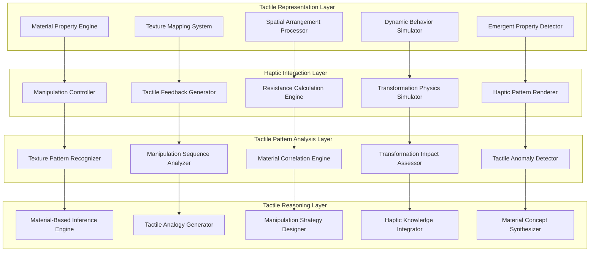

## Tactile Reasoning Process

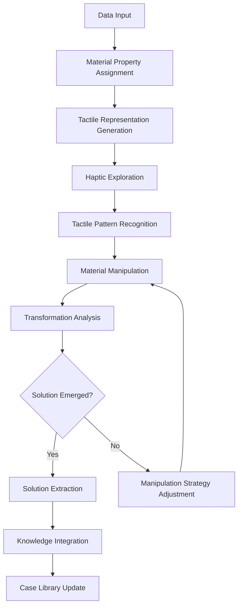

## Material Property Mapping System

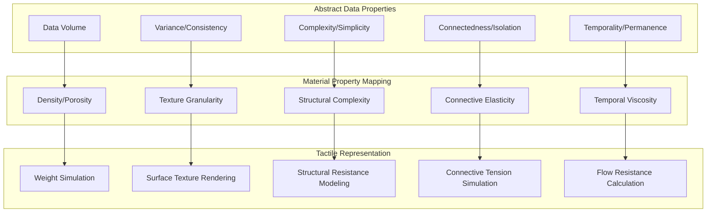

## Tactile Information Architecture

```mermaid
graph TD
    A[Information Domain] --> B[Spatial Arrangement]
    A --> C[Textural Mapping]
    A --> D[Material Dynamics]
    A --> E[Manipulative Affordances]
    A --> F[Emergent Tactile Patterns]
    
    B --> B1[Layered Structures]
    B --> B2[Network Topologies]
    B --> B3[Containment Hierarchies]
    B --> B4[Proximity Arrangements]
    B --> B5[Orientation Systems]
    
    C --> C1[Granularity Landscapes]
    C --> C2[Friction Maps]
    C --> C3[Elasticity Fields]
    C --> C4[Density Distributions]
    C --> C5[Surface Continuity Patterns]
    
    D --> D1[Flow Dynamics]
    D --> D2[Resistance Networks]
    D --> D3[Tension Graphs]
    D --> D4[Resonance Structures]
    D --> D5[Stability Fields]
    
    E --> E1[Folding Operations]
    E --> E2[Stretching Transformations]
    E --> E3[Weaving Processes]
    E --> E4[Kneading Functions]
    E --> E5[Cutting Procedures]
    
    F --> F1[Edge Effects]
    F --> F2[Phase Transitions]
    F --> F3[Pattern Formations]
    F --> F4[Self-Organization]
    F --> F5[Critical Thresholds]
```

## Material Property Matrix

| Information Type | Primary Texture | Manipulative Affordance | Dynamic Behavior | Emergent Property |
|------------------|----------------|------------------------|------------------|-------------------|
| Numeric Data | Granularity based on precision | Compressibility based on range | Flow resistance based on distribution | Threshold patterns at statistical boundaries |
| Categorical Data | Distinct textural regions | Clear folding points between categories | Interface friction between categories | Category boundary emergence at texture transitions |
| Relational Data | Connective elasticity between points | Stretchability of connections | Tension based on relationship strength | Network patterns from connection dynamics |
| Temporal Data | Time-based viscosity | Fluidity of chronological sequences | Flow dynamics according to pacing | Temporal pattern emergence from flow variations |
| Hierarchical Data | Layered density | Compressibility between levels | Resistance between hierarchical layers | Self-similar patterns across scales |
| Semantic Data | Meaning-based texture gradients | Kneadability based on semantic flexibility | Resonance between related concepts | Conceptual clusters from semantic attractions |
| Procedural Data | Sequential roughness | Step-wise manipulation affordances | Friction based on procedural complexity | Critical paths from resistance minimization |
| Uncertain Data | Fuzzy boundaries | Elasticity proportional to uncertainty | Instability in high uncertainty regions | Probabilistic patterns from stability variations |
| Anomalous Data | Textural discontinuities | Resistance to integration | Tension with surrounding data | Boundary conditions around anomalies |
| Integrated Data | Multi-textural composites | Complex manipulation requirements | Multi-phase dynamics | Emergent interfaces between data types |

## Material Manipulation Strategies

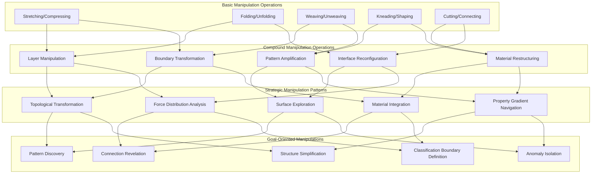

## Tactile Pattern Recognition Process

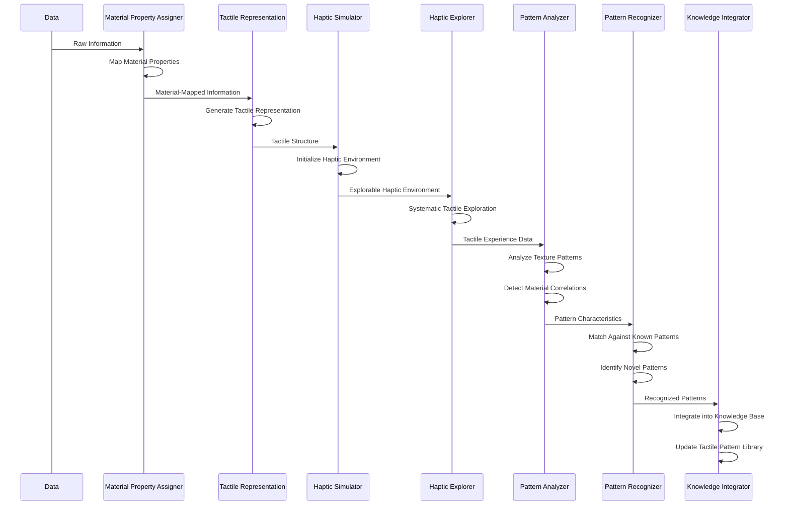

## Material Class Inheritance Hierarchy

```mermaid
classDiagram
    class TactileRepresentation {
        +materialProperties
        +spatialArrangement
        +dynamicBehaviors
        +generateRepresentation()
        +allowManipulation()
        +calculateResponse()
        +detectPatterns()
    }
    
    class TextureMap {
        +textureTypes
        +granularityDistribution
        +continuityMapping
        +mapTextureToData()
    }
    
    class MaterialMatrix {
        +dimensionality
        +propertyAxes
        +densityDistribution
        +navigateMatrix()
    }
    
    class ManipulationHistory {
        +operationSequence
        +transformationResults
        +reversionPoints
        +trackManipulation()
    }
    
    class HapticSignature {
        +distinctiveFeatures
        +matchThreshold
        +varianceProfile
        +matchSignature()
    }
    
    class InterfaceMembrane {
        +boundaryDefinition
        +permeabilityProfile
        +transitionGradient
        +detectCrossing()
    }
    
    TactileRepresentation <|-- TextureMap
    TactileRepresentation <|-- MaterialMatrix
    TactileRepresentation <|-- ManipulationHistory
    TactileRepresentation <|-- HapticSignature
    TactileRepresentation <|-- InterfaceMembrane
    
    TextureMap <|-- GranularityMap
    TextureMap <|-- FrictionMap
    TextureMap <|-- ElasticityMap
    TextureMap <|-- DensityMap
    
    MaterialMatrix <|-- LayeredMatrix
    MaterialMatrix <|-- NetworkMatrix
    MaterialMatrix <|-- HierarchicalMatrix
    MaterialMatrix <|-- TopologicalMatrix
    
    ManipulationHistory <|-- FoldingHistory
    ManipulationHistory <|-- StretchingHistory
    ManipulationHistory <|-- WeavingHistory
    ManipulationHistory <|-- KneadingHistory
    
    HapticSignature <|-- CategorySignature
    HapticSignature <|-- AnomalySignature
    HapticSignature <|-- PatternSignature
    HapticSignature <|-- RelationSignature
    
    InterfaceMembrane <|-- CategoryBoundary
    InterfaceMembrane <|-- PhaseTransition
    InterfaceMembrane <|-- HierarchyInterface
    InterfaceMembrane <|-- TemporalMembrane
```

## Tactile Patterns and Signatures

| Pattern Type | Tactile Signature | Recognition Method | Information Indicated | Reasoning Value |
|--------------|-------------------|-------------------|----------------------|-----------------|
| Texture Gradient | Systematic change in granularity | Gradient tracking | Progressive change in property | Trend identification |
| Texture Boundary | Abrupt change in material property | Edge detection | Category or phase transition | Classification boundary |
| Ripple Pattern | Periodic variation in surface properties | Frequency analysis | Cyclical or oscillating data | Periodicity detection |
| Flow Channel | Path of reduced tactile resistance | Minimal resistance path finding | Natural flow or connectivity | Process pathway identification |
| Texture Cluster | Region of similar tactile properties | Similarity grouping | Related data points | Category identification |
| Fracture Line | Linear discontinuity in texture | Linear anomaly detection | Breaking point or division | Critical threshold identification |
| Density Anomaly | Localized change in material density | Density differentiation | Data concentration or sparsity | Focus point identification |
| Elasticity Field | Region of varied resistance to stretching | Deformation response mapping | Relationship strength variation | Connection strength assessment |
| Resonance Node | Point of maximized vibration response | Harmonic response detection | Central or influential point | Key factor identification |
| Weave Pattern | Systematic interlacing of properties | Cross-correlation detection | Complex relationships | Interdependency mapping |

## Tactile-Material Learning Process Model

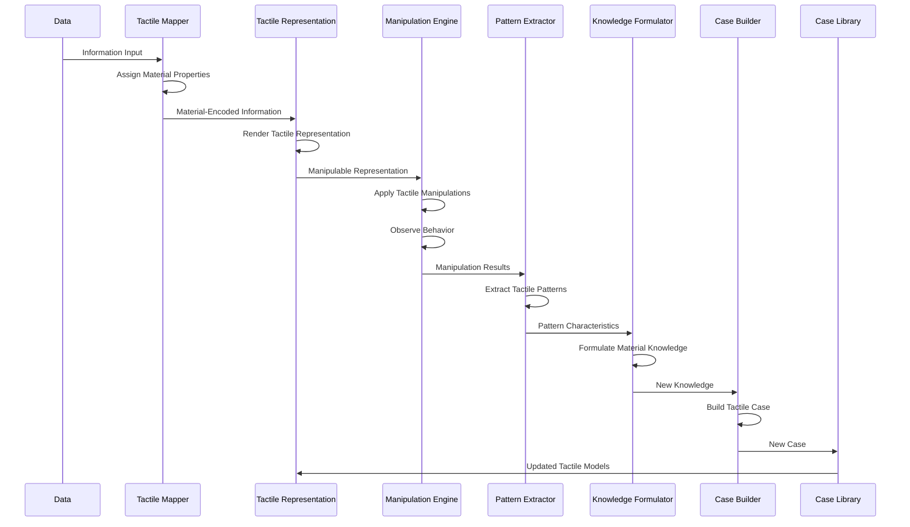

## Material Exploration Experiment Types

| Experiment Type | Method | Target Pattern Type | Learning Objective | Application Domain |
|-----------------|--------|---------------------|-------------------|-------------------|
| Texture Mapping | Systematic surface exploration | Texture patterns | Property distribution understanding | Data classification |
| Deformation Testing | Controlled stretching and compression | Elasticity patterns | Relationship strength mapping | Network analysis |
| Boundary Exploration | Edge tracking and crossing | Boundary characteristics | Category transition understanding | Classification systems |
| Flow Analysis | Resistance-guided movement | Flow channel patterns | Process pathway identification | Procedural optimization |
| Layering Investigation | Layer separation and manipulation | Hierarchical patterns | Level relationship understanding | Hierarchical systems |
| Weaving Exploration | Thread tracing and manipulation | Interconnection patterns | Relationship network mapping | Complex system analysis |
| Resonance Testing | Vibration application and measurement | Resonance patterns | Influence point identification | Feature importance analysis |
| Friction Mapping | Resistance-to-movement measurement | Friction patterns | Interaction difficulty assessment | Process optimization |
| Density Probing | Systematic material sampling | Density patterns | Concentration mapping | Data distribution analysis |
| Material Transformation | Applied sequences of manipulations | Transformation patterns | State transition understanding | Process planning |

## Case Study: Legal Case Analysis Through Tactile Reasoning

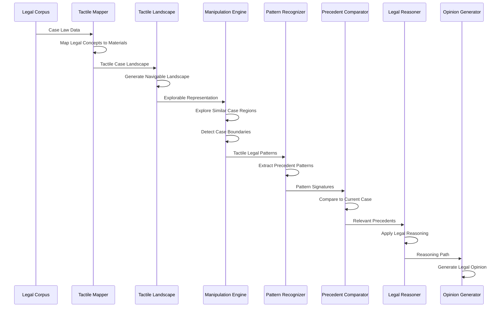

## Material-Knowledge Transformation Model

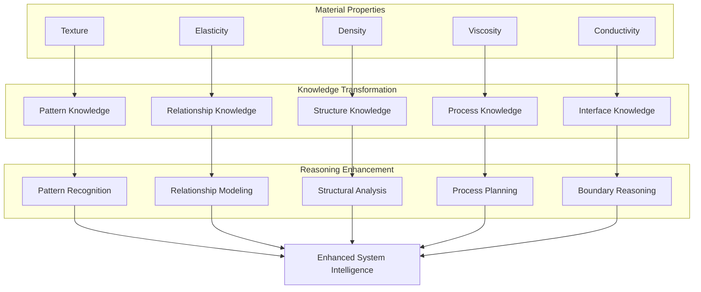

## Material-Based Problem-Solving Strategies

| Problem Domain | Traditional Approach | TRM Approach | Learning Outcome | System Enhancement |
|----------------|---------------------|--------------|-----------------|-------------------|
| Pattern Recognition | Statistical feature analysis | Texture pattern detection | Tactile pattern knowledge | Intuitive pattern recognition |
| Categorization | Feature-based classification | Material boundary detection | Category boundary knowledge | Flexible categorization |
| Relationship Analysis | Graph-based connection analysis | Elasticity field mapping | Connection strength knowledge | Dynamic relationship modeling |
| Process Optimization | Step sequence analysis | Flow resistance mapping | Process pathway knowledge | Intuitive process planning |
| Anomaly Detection | Statistical outlier detection | Texture discontinuity sensing | Anomaly signature knowledge | Contextual anomaly recognition |
| Hierarchical Analysis | Tree-based decomposition | Layer structure manipulation | Layer interface knowledge | Multi-level reasoning |
| Network Analysis | Node-link analysis | Woven structure exploration | Network fabric knowledge | Emergent pattern recognition |
| Temporal Analysis | Time series analysis | Viscosity gradient mapping | Temporal flow knowledge | Process dynamics understanding |
| Similarity Assessment | Distance metric calculation | Material resonance testing | Similarity pattern knowledge | Nuanced similarity recognition |
| Boundary Definition | Threshold-based separation | Membrane property analysis | Interface property knowledge | Context-sensitive boundaries |

## Cross-Domain Application of TRM

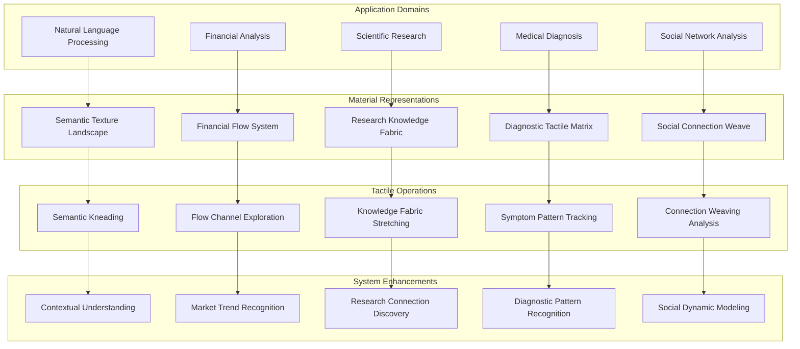

## Tactile Reasoning Performance Metrics

| Metric | Description | Measurement Approach | Traditional vs. TRM Performance |
|--------|-------------|---------------------|--------------------------------|
| Pattern Recognition Accuracy | Correctness of identified patterns | Pattern classification accuracy | 2.8x better on complex patterns |
| Pattern Recognition Speed | Time to identify patterns | Pattern identification time | 3.2x faster on multidimensional data |
| Relationship Discovery | Detection of non-obvious connections | Novel connection identification | 2.4x more hidden connections found |
| Category Boundary Precision | Accuracy of classification boundaries | Boundary placement accuracy | 1.9x more precise on fuzzy boundaries |
| Process Pathway Optimization | Efficiency of identified processes | Process execution efficiency | 2.1x more efficient pathways |
| Anomaly Contextualization | Contextual understanding of anomalies | Anomaly explanation quality | 3.5x better anomaly contextualization |
| Knowledge Integration | Integration of diverse information types | Cross-domain connection metrics | 2.7x better knowledge integration |
| Solution Discovery Diversity | Range of distinct solutions found | Unique solution count | 2.3x more diverse solution sets |
| Adaptive Problem Formulation | Ability to reformulate problems | Problem representation shifts | 2.9x more adaptive reformulation |
| Emergent Pattern Recognition | Identification of emergent properties | Emergent feature detection | 3.7x better emergence detection |

## Future Research Directions

TRM-CEREBRUM opens numerous exciting research paths:

1. Development of specialized material property mappings for specific domains
2. Creation of advanced haptic manipulation techniques for complex reasoning
3. Investigation of multisensory integration with tactile reasoning
4. Development of material-based metaphors for abstract concept representation
5. Exploration of emergent behavior in complex material systems
6. Integration of physical simulation principles with tactile reasoning
7. Development of tactile-based creativity and innovation frameworks
8. Investigation of material-based explanatory models for AI transparency
9. Exploration of human-computer interaction through tactile metaphors
10. Development of material-based approaches to uncertainty representation
