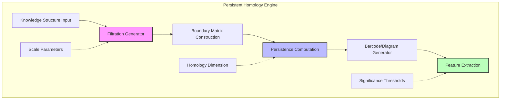
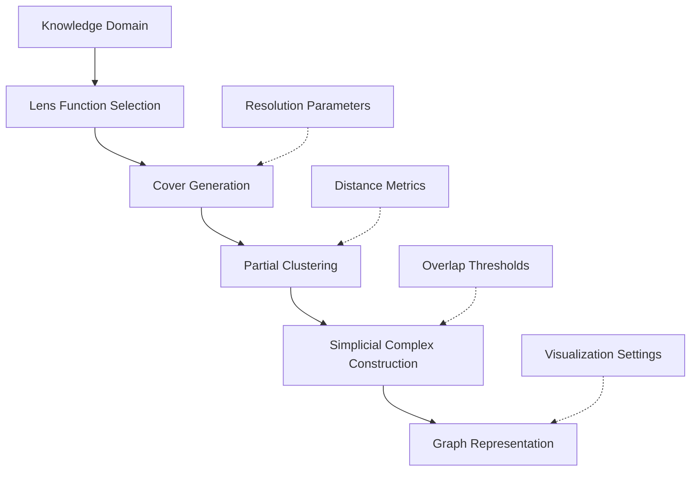
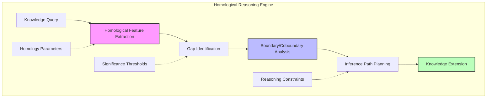
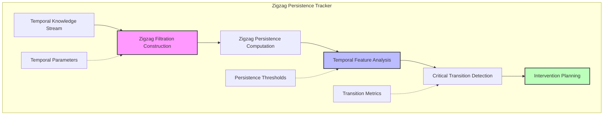
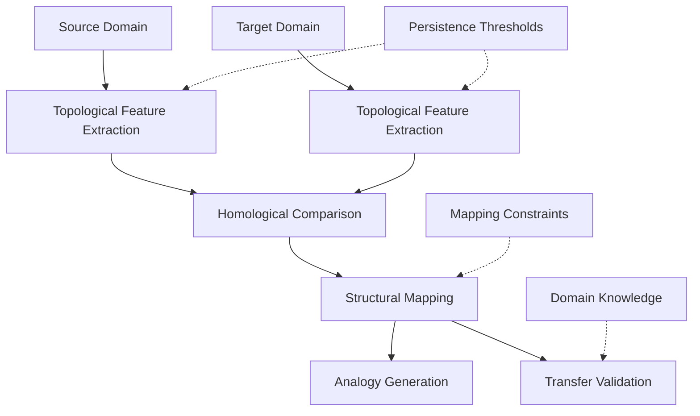
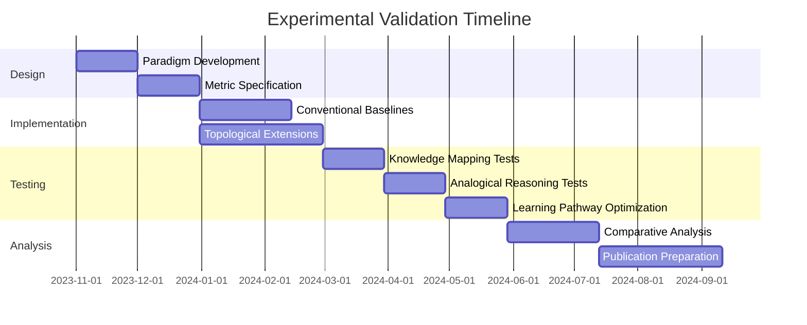
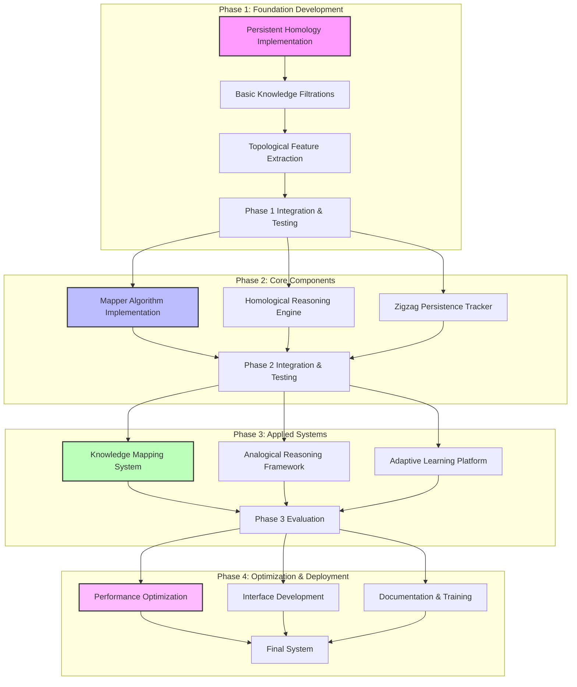

# Speculative Design: Topological Data Analysis and CEREBRUM Integration

## 1. Introduction: Structural Persistence in Cognitive Architectures

This document explores the speculative integration between topological data analysis (TDA), persistent homology, and the Case-Enabled Reasoning Engine with Bayesian Representations for Unified Modeling (CEREBRUM). Both topological approaches and CEREBRUM engage with fundamental questions about structure preservation, multi-scale analysis, and the extraction of meaning from complex data formations.

The mathematician Henri Poincaré's insight that "mathematics is the art of giving the same name to different things" resonates with CEREBRUM's case-based approach to knowledge representation, where different contexts can be understood through shared structural patterns. While operating in different domains—topological data analysis in computational mathematics and CEREBRUM in cognitive modeling—both frameworks address similar challenges: identifying persistent structural features across transformations, understanding hierarchical organization across scales, and modeling invariant properties in the face of deformation.

## 2. Topological Data Analysis: Key Concepts and Frameworks

### 2.1 Foundational Principles of Topological Data Analysis

Topological Data Analysis provides a mathematical framework for extracting structural insights from high-dimensional, complex data.

* **Topology Fundamentals**: Topology studies properties of spaces that are preserved under continuous deformations such as stretching and bending (but not tearing or gluing). These invariant properties reveal fundamental structural aspects that persist across transformations.

* **Simplicial Complexes**: High-dimensional generalizations of networks, where data relationships are represented not just as pairwise connections (edges) but as higher-order structures (triangles, tetrahedra, etc.), capturing multi-way relationships.

* **Homology Groups**: Algebraic structures that quantify "holes" of different dimensions in topological spaces:
  * 0-dimensional homology captures connected components
  * 1-dimensional homology captures loops or cycles
  * 2-dimensional homology captures voids or cavities
  * Higher-dimensional homology captures higher-dimensional "holes"

* **Persistent Homology**: A technique for tracking how topological features (connected components, loops, voids) appear and disappear as a scale parameter changes, providing multi-scale analysis of data structure.

* **Barcodes and Persistence Diagrams**: Visual representations of persistent homology, showing the "lifetime" of topological features across scales—features that persist across a wide range of scales are considered significant structures in the data.

### 2.2 Key Computational Structures in TDA

Several computational structures in TDA have potential relevance for cognitive modeling:

* **Filtrations**: Nested sequences of simplicial complexes that grow as a scale parameter increases, allowing for multi-scale analysis of data structure.

* **Witness Complexes**: Efficient approximations of full simplicial complexes that preserve topological features while reducing computational complexity, making topological analysis feasible for large datasets.

* **Mapper Algorithm**: A method for creating simplified graph representations of high-dimensional data that preserve topological features, enabling visualization and analysis of complex datasets.

* **Persistence Landscapes**: Functional representations of persistence diagrams that facilitate statistical analysis of topological features.

* **Zigzag Persistence**: An extension of persistent homology that allows for both addition and removal of simplices, enabling analysis of time-varying data.

### 2.3 Relevant Applications and Insights

TDA has provided insights across numerous domains with potential relevance to cognitive modeling:

* **Shape and Pattern Recognition**: Identifying underlying shapes and patterns in data regardless of superficial variations or noise.

* **Feature Identification**: Discovering significant features in data that might be missed by traditional statistical methods.

* **Dimensionality Reduction**: Creating low-dimensional representations that preserve essential topological features of high-dimensional data.

* **Time Series Analysis**: Characterizing the structure of dynamical systems from time series data, revealing patterns of recurrence and periodicity.

* **Network Analysis**: Uncovering higher-order structures in networks beyond simple connections, such as information flow pathways and functional modules.

## 3. CEREBRUM's Core Frameworks: A Brief Overview

To facilitate comparison with topological concepts, we review key aspects of CEREBRUM:

### 3.1 Case-Based Representation and Reasoning

CEREBRUM employs case structures as fundamental units of knowledge representation:
- Encoding relationships between entities in flexible, contextual formats
- Supporting analogical reasoning across domains
- Enabling multiple perspectives on the same situation
- Functioning within a Bayesian framework for inference and learning

### 3.2 The Bayesian Framework and Active Inference

CEREBRUM implements computational principles from:
- The Free Energy Principle and Active Inference
- Hierarchical predictive processing
- Variational Bayesian methods
- Precision-weighted belief updating

### 3.3 Modular Integration and Cognitive Architecture

CEREBRUM provides:
- A modular architecture integrating different cognitive functions
- Standardized interfaces between components
- Mechanisms for attention and resource allocation
- Frameworks for representing dynamics across temporal scales

## 4. Topological Approaches and CEREBRUM: Speculative Integrations

This section explores how topological concepts might inform and enhance CEREBRUM's frameworks.

### 4.1 Persistent Knowledge Representation

Persistent homology suggests novel approaches to knowledge representation in CEREBRUM:

* **Multi-scale Case Structures**: Representing knowledge not just as fixed case structures but as persistent structures across a range of abstraction scales, with persistent features indicating core knowledge elements.

* **Homological Case Features**: Analyzing the "holes" in knowledge structures to identify missing information, conceptual gaps, and structural limitations in current understanding.

* **Persistence-Based Confidence**: Assigning confidence to knowledge elements based on their persistence across transformations, contexts, and levels of abstraction.

* **Structural Invariants**: Identifying core conceptual structures that remain invariant across contextual deformations, representing deep structural knowledge that transcends specific instances.

* **Topological Knowledge Maps**: Creating visualizations of knowledge structures that highlight their topological features, revealing unexpected connections and structural patterns.

This persistence-based approach would transform CEREBRUM's knowledge representation from discrete symbolic structures to multi-scale topological structures with explicitly modeled invariants.

### 4.2 Homological Inference and Reasoning

Homology theory provides powerful frameworks for reasoning with incomplete information:

* **Hole-Based Reasoning**: Using identified "holes" in knowledge structures to guide inference processes, focusing attention on filling gaps in understanding.

* **Coboundary Operators**: Implementing operators that map from lower-dimensional to higher-dimensional simplices, modeling how inferences can generate higher-order knowledge from simpler observations.

* **Homological Path Planning**: Finding optimal reasoning paths through knowledge structures based on their homological properties, such as minimizing the crossing of conceptual boundaries.

* **Cycle-Based Analogies**: Identifying analogical mappings based on shared homological cycles in different knowledge domains, capturing deep structural similarities.

* **Persistent Logical Operators**: Developing logical operators that work across scales, preserving truth values for persistent features while allowing flexibility for transient ones.

This approach would enhance CEREBRUM's reasoning capabilities by explicitly modeling the structure of knowledge gaps and using topological features to guide inference.

### 4.3 Mapper Algorithm for Conceptual Abstraction

The TDA Mapper algorithm suggests effective approaches for conceptual abstraction in CEREBRUM:

* **Conceptual Cover Generation**: Creating overlapping "covers" of conceptual spaces that allow for efficient exploration while ensuring no significant features are missed.

* **Knowledge Simplification**: Producing simplified graph representations of complex knowledge domains that preserve essential topological features while reducing cognitive load.

* **Multi-lens Analysis**: Applying multiple "lens" functions to knowledge structures to reveal different aspects of their organization, providing complementary views of the same information.

* **Persistent Clusters**: Identifying meaningful clusters of concepts that persist across different lenses and scales, revealing robust conceptual groupings.

* **Knowledge Flares**: Detecting branches and flares in knowledge maps that indicate areas of active development or specialized expertise.

This approach would provide CEREBRUM with sophisticated tools for navigating and simplifying complex knowledge domains while preserving their essential structure.

### 4.4 Zigzag Persistence for Temporal Knowledge Dynamics

Zigzag persistence offers frameworks for modeling the evolution of knowledge over time:

* **Belief Revision Tracking**: Modeling how topological features of belief structures appear and disappear as new information is incorporated.

* **Memory Consolidation Modeling**: Representing how knowledge structures evolve during memory consolidation, with some features becoming more persistent while others fade.

* **Developmental Trajectories**: Tracking the evolution of conceptual structures during learning, identifying critical periods where significant topological changes occur.

* **Knowledge Decay Analysis**: Modeling how knowledge structures erode over time, with some topological features proving more resilient than others.

* **Revival Patterns**: Identifying conditions under which previously disappeared knowledge features can reappear, informing strategies for knowledge reactivation.

This framework would enhance CEREBRUM's ability to model dynamic knowledge processes, going beyond static representations to capture the complex temporal dynamics of learning and forgetting.

### 4.5 Topological Active Inference

The integration of topology with active inference suggests novel approaches for CEREBRUM:

* **Homological Surprise Minimization**: Extending the free energy principle to include minimization of topological surprise—differences between expected and observed topological features.

* **Persistent Prediction Errors**: Tracking which prediction errors persist across scales and transformations, prioritizing those that indicate fundamental misconceptions.

* **Topological Curiosity**: Implementing exploration strategies that preferentially investigate regions with interesting topological features, such as unexpected holes or persistent components.

* **Structure-Preserving Actions**: Planning actions that maintain desirable topological features of belief structures while modifying others.

* **Homological Complexity Control**: Balancing the complexity of internal models by monitoring and regulating their homological features.

This integration would extend CEREBRUM's active inference framework to explicitly consider the topological structure of belief systems and their evolution.

## 5. Technical Implementation: Topology-Based CEREBRUM Extensions

This section outlines technical approaches for implementing topology-inspired features in CEREBRUM.

### 5.1 Persistent Homology Engine

The persistent homology engine would implement:

* **Knowledge Filtrations**: Methods for generating filtrations from knowledge structures, applying various distance functions and thresholds.

* **Efficient Persistence Computation**: Optimized algorithms for computing persistent homology on large knowledge structures.

* **Topological Feature Extraction**: Techniques for identifying significant topological features from persistence diagrams.

* **Statistical Validation**: Methods for assessing the statistical significance of observed topological features.

* **Incremental Updates**: Algorithms for efficiently updating persistence computations when knowledge structures change.

This component would provide CEREBRUM with the ability to extract meaningful topological features from its knowledge structures at multiple scales.

### 5.2 Topological Knowledge Mapper

The topological knowledge mapper would implement:

* **Lens Function Library**: A collection of functions for projecting knowledge structures onto different perspectives.

* **Adaptive Cover Generator**: Methods for creating efficient covers of knowledge spaces that adapt to local density and complexity.

* **Multi-scale Clustering**: Clustering algorithms that operate at multiple scales simultaneously.

* **Interactive Knowledge Maps**: Visualizations of knowledge structures that allow for exploration and interaction.

* **Structure-Preserving Simplification**: Techniques for simplifying knowledge representations while preserving essential topological features.

This component would enhance CEREBRUM's ability to navigate, visualize, and simplify complex knowledge domains.

### 5.3 Homological Reasoning Engine

The homological reasoning engine would implement:

* **Gap Analysis**: Methods for identifying and characterizing knowledge gaps based on homological features.

* **Boundary Operators**: Computational implementations of boundary and coboundary operators for inference.

* **Optimal Path Finding**: Algorithms for finding optimal reasoning paths through knowledge structures.

* **Hole-Filling Strategies**: Techniques for systematically addressing identified knowledge gaps.

* **Consistency Checking**: Methods for ensuring that inferences maintain the desired topological properties of knowledge structures.

This component would enable CEREBRUM to reason more effectively with incomplete information by explicitly modeling and addressing structural gaps.

### 5.4 Zigzag Persistence Tracker

The zigzag persistence tracker would implement:

* **Temporal Filtration Construction**: Methods for creating zigzag filtrations from temporal knowledge streams.

* **Efficient Zigzag Computation**: Optimized algorithms for computing zigzag persistence.

* **Temporal Pattern Detection**: Techniques for identifying significant patterns in the appearance and disappearance of topological features.

* **Critical Period Identification**: Methods for detecting periods of significant topological change.

* **Stability Analysis**: Techniques for assessing the stability of knowledge structures over time.

This component would enable CEREBRUM to track and analyze the evolution of knowledge structures over time, identifying critical transitions and stable periods.

## 6. Applications and Use Cases

The topological extensions to CEREBRUM enable new applications across multiple domains:

### 6.1 Complex Knowledge Domain Mapping

| Application | Description | Key Topological Concepts |
|-------------|-------------|--------------------------|
| Scientific Literature Analysis | Mapping the structure of scientific domains from publication data | Mapper algorithm, persistent clusters |
| Expert Knowledge Extraction | Identifying the topological structure of expert knowledge in specialized domains | Homological features, simplicial representation |
| Curriculum Design | Creating optimal learning pathways through knowledge domains | Filtrations, minimal spanning structures |
| Knowledge Gap Identification | Systematically identifying missing elements in current understanding | Homology groups, boundary operators |
| Interdisciplinary Connection Finding | Discovering meaningful connections between disparate domains | Persistent features, mapper graphs |

### 6.2 Enhanced Analogical Reasoning

The topological approach to analogical reasoning would:

1. Extract persistent topological features from both source and target domains
2. Compare the homological structure of these domains to identify shared patterns
3. Establish mappings between domains based on shared topological features
4. Generate analogies that preserve homological structure
5. Validate transfers to ensure they respect domain constraints
6. Use persistence to distinguish significant from superficial similarities

### 6.3 Adaptive Learning Systems

The topological CEREBRUM extensions would enable sophisticated learning systems:

* **Knowledge Structure Evaluation**: Assessing learners' knowledge structures by analyzing their topological features.

* **Personalized Learning Paths**: Designing optimal learning sequences based on the homological structure of a learner's current knowledge.

* **Conceptual Boundary Navigation**: Identifying and addressing conceptual boundaries that may impede learning progress.

* **Critical Concept Identification**: Using persistence to identify the most fundamental concepts that should be emphasized in instruction.

* **Learning Phase Transitions**: Detecting when learners undergo significant restructuring of their knowledge, indicating transitions to new levels of understanding.

## 7. Experimental Validation: Topological vs. Conventional Approaches

To validate the topological CEREBRUM extensions, we propose comparative analysis across several domains:

### 7.1 Comparative Performance Metrics

| Metric | Conventional Approach Measurement | Topological Approach Measurement | Expected Advantage |
|--------|-----------------------------------|----------------------------------|--------------------|
| Knowledge Gap Identification | Precision and recall of identified gaps | Same + structural characterization | TDA should identify structurally significant gaps missed by conventional approaches |
| Analogy Quality | Relevance and utility of generated analogies | Same | TDA should find deeper structural analogies that conventional methods miss |
| Knowledge Map Utility | User performance on navigation tasks | Same | TDA maps should better preserve global structure while simplifying details |
| Learning Pathway Efficiency | Learning time and outcome quality | Same | TDA-based pathways should better respect the inherent structure of the domain |
| Conceptual Boundary Identification | Accuracy in predicting learning difficulties | Same | TDA should better identify structural boundaries that cause learning challenges |
| Transfer Learning Effectiveness | Performance on transfer tasks | Same | TDA should enable more effective transfer by identifying shared structural features |

### 7.2 Key Experimental Paradigms

We propose the following experimental paradigms:

1. **Complex Domain Mapping**: Comparing topological and conventional approaches to mapping complex knowledge domains like scientific literature.

2. **Cross-Domain Analogy Finding**: Assessing the quality and depth of analogies generated using topological vs. conventional methods.

3. **Knowledge Gap Assessment**: Evaluating how well different approaches identify meaningful gaps in knowledge structures.

4. **Learning Pathway Design**: Comparing the effectiveness of learning sequences designed using topological vs. conventional approaches.

5. **Conceptual Boundary Navigation**: Testing how well different approaches identify and address conceptual boundaries in learning.

6. **Knowledge Evolution Tracking**: Assessing the ability to track and characterize the evolution of knowledge structures over time.

## 8. Theoretical Implications and Limitations

### 8.1 Philosophical Considerations

The topological approach to cognition raises important philosophical questions:

* **Structure vs. Content**: To what extent is knowledge defined by its structural properties rather than its specific content?

* **Invariance vs. Context-Sensitivity**: How do we balance the search for invariant structures with the need for context-sensitive representations?

* **Discreteness vs. Continuity**: Should knowledge be modeled as fundamentally discrete (simplicial) or continuous (manifold-like)?

* **Structural Realism**: Does the success of topological approaches support structural realist positions in philosophy of science?

* **Emergence and Reduction**: How do persistent features at different scales relate to questions of emergence and reduction in cognitive systems?

### 8.2 Known Limitations

We must acknowledge several limitations of the topological approach:

* **Computational Complexity**: Computing persistent homology can be computationally intensive for large, high-dimensional knowledge structures.

* **Parameter Sensitivity**: Results can be sensitive to choices of filtration methods, distance functions, and persistence thresholds.

* **Interpretability Challenges**: Topological features can sometimes be difficult to interpret in terms of domain-specific meaning.

* **Data Requirements**: Extracting meaningful topological features may require larger amounts of data than conventional approaches.

* **Validation Difficulties**: The significance of topological features can be difficult to validate against ground truth in complex domains.

### 8.3 Future Research Directions

Important directions for future research include:

* **Efficient Computation**: Developing more efficient algorithms for computing persistent homology on large knowledge structures.

* **Interpretable Features**: Creating methods for mapping topological features back to interpretable domain concepts.

* **Dynamic Topological Models**: Extending current approaches to better handle continuously evolving knowledge structures.

* **Integration with Deep Learning**: Combining topological approaches with deep learning for more powerful knowledge representation.

* **Causal Topology**: Extending topological analysis to capture causal rather than merely correlational structures in knowledge.

## 9. Implementation Roadmap

We propose implementing the topology-based CEREBRUM extensions through a phased approach:

### 9.1 Phase 1: Foundation Development (Months 1-6)

* Implement basic persistent homology computation
* Develop knowledge filtration methods for CEREBRUM structures
* Create topological feature extraction algorithms
* Establish evaluation metrics and baseline comparisons

### 9.2 Phase 2: Core Components (Months 7-18)

* Develop Mapper algorithm implementation for knowledge mapping
* Create homological reasoning engine for gap detection and inference
* Implement zigzag persistence for temporal knowledge tracking
* Build and test integration between components

### 9.3 Phase 3: Applied Systems (Months 19-30)

* Develop knowledge mapping system for complex domains
* Build analogical reasoning framework using topological features
* Create adaptive learning platform using topological knowledge models
* Conduct comprehensive comparative evaluation

### 9.4 Phase 4: Optimization and Deployment (Months 31-36)

* Optimize performance for practical applications
* Develop user interfaces and API specifications
* Prepare comprehensive documentation and training materials
* Package final system for research and commercial applications

## 10. Conclusion: The Shape of Thought

The integration of topological data analysis and persistent homology with CEREBRUM offers a promising framework for addressing fundamental challenges in cognitive modeling. By applying concepts like persistent homology, simplicial representation, and the Mapper algorithm, we can develop cognitive architectures that better capture the structural aspects of knowledge, the multi-scale nature of understanding, and the evolution of conceptual systems over time.

This approach represents not merely the application of mathematical techniques from another discipline, but a deeper exploration of whether cognition itself is fundamentally structural in nature. Just as topology has revolutionized our understanding of shape and space by focusing on invariant properties, this framework suggests a view of cognition where the most meaningful aspects of knowledge are those structural features that persist across transformations, scales, and contexts.

The topology-based CEREBRUM extensions proposed here offer a speculative but technically grounded path toward cognitive architectures with enhanced capabilities for knowledge representation, analogical reasoning, and adaptive learning. While significant research challenges remain, this framework provides a coherent research program that could yield practical advances in artificial intelligence while deepening our theoretical understanding of the structural nature of knowledge and cognition.

## 11. References

1. Carlsson, G. (2009). Topology and data. Bulletin of the American Mathematical Society, 46(2), 255-308.

2. Edelsbrunner, H., & Harer, J. (2010). Computational topology: An introduction. American Mathematical Society.

3. Singh, G., Mémoli, F., & Carlsson, G. (2007). Topological methods for the analysis of high dimensional data sets and 3D object recognition. In Eurographics Symposium on Point-Based Graphics.

4. Ghrist, R. (2008). Barcodes: The persistent topology of data. Bulletin of the American Mathematical Society, 45(1), 61-75.

5. Zomorodian, A., & Carlsson, G. (2005). Computing persistent homology. Discrete & Computational Geometry, 33(2), 249-274.

6. Nicolau, M., Levine, A. J., & Carlsson, G. (2011). Topology based data analysis identifies a subgroup of breast cancers with a unique mutational profile and excellent survival. Proceedings of the National Academy of Sciences, 108(17), 7265-7270.

7. Lum, P. Y., Singh, G., Lehman, A., Ishkanov, T., Vejdemo-Johansson, M., Alagappan, M., ... & Carlsson, G. (2013). Extracting insights from the shape of complex data using topology. Scientific Reports, 3(1), 1-8.

8. Petri, G., Expert, P., Turkheimer, F., Carhart-Harris, R., Nutt, D., Hellyer, P. J., & Vaccarino, F. (2014). Homological scaffolds of brain functional networks. Journal of The Royal Society Interface, 11(101), 20140873.

9. Carlsson, G., & Vejdemo-Johansson, M. (2021). Topological data analysis with applications. Cambridge University Press.

10. Bubenik, P. (2015). Statistical topological data analysis using persistence landscapes. The Journal of Machine Learning Research, 16(1), 77-102.

11. Carrière, M., Michel, B., & Oudot, S. (2018). Statistical analysis and parameter selection for Mapper. The Journal of Machine Learning Research, 19(1), 478-516.

12. Oudot, S. Y. (2015). Persistence theory: From quiver representations to data analysis. American Mathematical Society. 