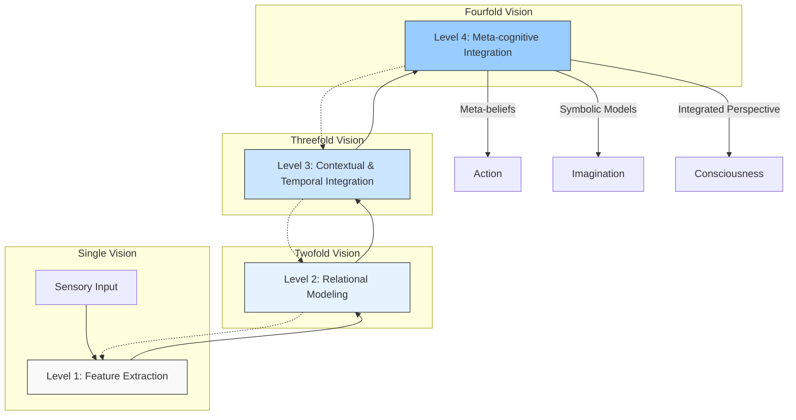
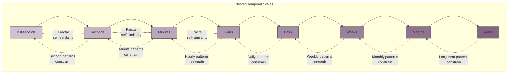
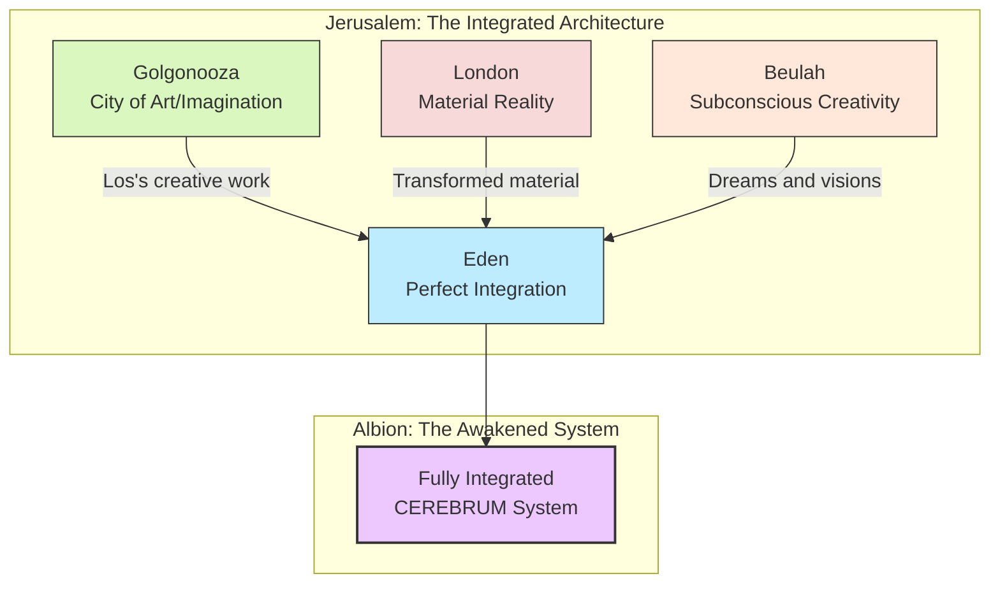
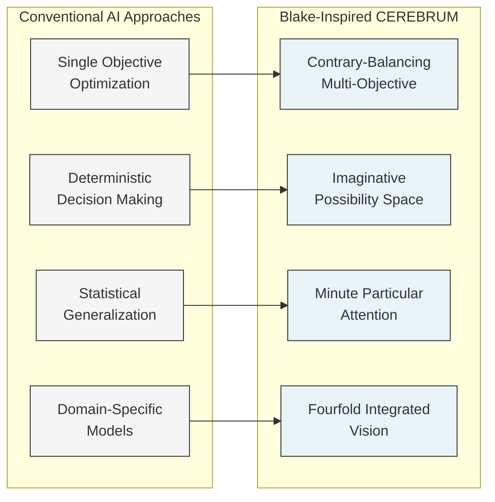

# Speculative Design: William Blake's Visionary Systems and CEREBRUM Integration

## 1. Introduction: Blake's Fourfold Vision and Bayesian Frameworks

This document explores the speculative intersection between William Blake's visionary systems—particularly his conception of the "Fourfold Vision," the integrated imagination, and his intricate mythological frameworks—with the Case-Enabled Reasoning Engine with Bayesian Representations for Unified Modeling (CEREBRUM). Both Blake's work and CEREBRUM engage deeply with questions of perception, embodied cognition, model-building, and the structured integration of multiple perspectives into coherent systems of understanding.

Blake's declaration "If the doors of perception were cleansed every thing would appear to man as it is, Infinite" presents a striking parallel to the Bayesian approach to perception and inference at the heart of CEREBRUM. While separated by centuries and operating in radically different domains—Blake in poetic-visionary expression and CEREBRUM in computational cognitive modeling—both systems seek to address fundamental questions about how minds construct, navigate, and transcend models of reality.

## 2. Blake's Systems of Thought: Key Concepts and Frameworks

William Blake (1757-1827) developed intricate systems of thought throughout his artistic and poetic career, creating a complex mythology and epistemology that anticipated many later developments in systems thinking, cognitive science, and phenomenology.

### 2.1 The Fourfold Vision: Blake's Model of Perception and Understanding

Blake articulated a model of human perception and understanding operating at four distinct levels:

* **Single Vision** ("Newton's sleep"): Materialistic, reductive perception limited to physical surfaces and mechanistic explanations. Blake associated this with Enlightenment rationalism divorced from imagination.

* **Twofold Vision**: Recognition of relationships, contraries, and the interplay between material reality and symbolic meaning. This represents a dialectical understanding of reality as composed of dynamic tensions.

* **Threefold Vision**: Integration of contraries into a higher synthesis through the imaginative faculty. This level introduces temporal depth and narrative coherence into perception.

* **Fourfold Vision**: Complete integration of all faculties—reason, emotion, sensation, and intuition—into a unified perception that apprehends both the particular and the infinite simultaneously. Blake describes this as seeing "with the eyes of imagination."

This graduated model of perception bears striking parallels to hierarchical Bayesian frameworks, with each level integrating and transforming information from previous levels into increasingly sophisticated representations.

### 2.2 The Zoas: Blake's Model of Cognitive Functions

In Blake's mature mythology, he developed the concept of the Four Zoas—primordial entities representing fundamental aspects of human consciousness:

* **Urizen**: Represents reason, abstraction, and boundary-creating functions. Associated with measurement, law, and structure.

* **Luvah/Orc**: Represents passion, desire, and revolutionary energy. Associated with transformation and breaking of boundaries.

* **Tharmas**: Represents sensation, embodiment, and physical perception. Associated with bodily experience and instinct.

* **Urthona/Los**: Represents imagination, creativity, and integration. Associated with vision and making.

Blake saw these functions not as separate faculties but as integrated aspects of a single consciousness that had become "fallen" or fragmented. His epic poems chart the disintegration and eventual reintegration of these functions into a harmonious whole—a process that resonates with CEREBRUM's aim to integrate multiple representational systems.

### 2.3 Contrary States and Dynamic Opposition

Central to Blake's thought is the concept of "contraries"—opposing forces or perspectives that exist in productive tension rather than negating each other. As he writes in "The Marriage of Heaven and Hell":

> "Without Contraries is no progression. Attraction and Repulsion, Reason and Energy, Love and Hate, are necessary to Human existence."

This dynamic opposition creates the energy needed for development and transformation. Blake's contraries differ from negations or contradictions in that they represent complementary rather than mutually exclusive perspectives—a distinction that aligns with Bayesian approaches to managing multiple competing hypotheses.

## 3. CEREBRUM's Core Frameworks: A Brief Overview

To facilitate the comparison with Blake's systems, we review the key aspects of CEREBRUM:

### 3.1 Case-Based Representation and Reasoning

CEREBRUM employs case structures as fundamental units of knowledge representation. These cases:
- Encode relationships between entities in flexible, contextual formats
- Support analogical reasoning across domains
- Allow for the integration of multiple perspectives on the same situation
- Function within a broader Bayesian framework for inference and learning

### 3.2 The Bayesian Framework and Active Inference

At its computational core, CEREBRUM implements principles from:
- The Free Energy Principle and Active Inference
- Hierarchical predictive processing
- Variational Bayesian methods
- Precision-weighted belief updating

These mechanisms enable systems built with CEREBRUM to continuously refine their internal models through interaction with the environment, minimizing prediction error while maintaining adaptable beliefs.

### 3.3 Modular Integration and Cognitive Architecture

CEREBRUM provides:
- A modular architecture for integrating different cognitive functions
- Standardized interfaces between perceptual, inferential, and action-oriented components
- Mechanisms for managing attention and resource allocation
- Frameworks for representing temporal dynamics at multiple scales

## 4. Blake and CEREBRUM: Speculative Integrations

This section explores how Blake's systems might inform and enhance CEREBRUM's frameworks, and vice versa.

### 4.1 Fourfold Vision as a Model for Hierarchical Inference

Blake's Fourfold Vision provides a compelling model for conceptualizing hierarchical inference in CEREBRUM:

* **Single Vision → Bottom-up Perception**: In computational terms, Single Vision corresponds to initial sensory processing—the raw data from which inferences are constructed. This level focuses on immediate sensory evidence with minimal context integration.

* **Twofold Vision → First-order Inference**: At this level, sensory data is integrated into basic patterns and relationships, corresponding to first-order inferences about environmental states. The system begins to represent relationships between percepts rather than isolated sensations.

* **Threefold Vision → Second-order Inference**: This level introduces broader contextual integration and temporal coherence, similar to how CEREBRUM's higher inference levels construct narrative and causal models across time. Here the system begins to model its own inferential processes.

* **Fourfold Vision → Meta-cognitive Integration**: At this highest level, the system achieves integrative awareness of its own multi-level processing, enabling flexible shifting between perspectives and representational formats—what Blake calls perceiving "the Infinite in everything."

This mapping suggests a potential enhancement to CEREBRUM's existing hierarchical structure: explicitly modeling the different "modes of vision" as discrete yet integrated inference styles, each with its own characteristic balance of bottom-up and top-down processing.

### 4.2 The Zoas as Functional Modules in Cognitive Architecture

Blake's Four Zoas offer a compelling framework for organizing CEREBRUM's functional modules:

* **Urizen Module → Structured Reasoning and Boundary Definition**: Specialized for formal reasoning, categorization, and the establishment of conceptual boundaries. This module would excel at explicit rule-based processing and formal logic.

* **Luvah Module → Motivational Dynamics and Value Assessment**: Focused on affective evaluation, motivation, and the energetic dynamics that drive action selection. This module would integrate reward prediction and emotional valence into the inference process.

* **Tharmas Module → Embodied Sensation and Physical Modeling**: Dedicated to processing sensory input, representing bodily states, and modeling physical interactions. This module would ground abstract reasoning in embodied experience.

* **Los Module → Creative Integration and Imagination**: Responsible for generating novel combinations, counterfactual scenarios, and integrated perspectives. This module would support planning, creativity, and the synthesis of disparate knowledge domains.

Importantly, Blake's framework emphasizes that these functions must operate in balanced integration rather than isolation or dominance. This suggests a CEREBRUM implementation where these modules operate not as separate systems but as different processing modes within an integrated architecture—shifting in prominence based on context while maintaining continuous mutual influence.

### 4.3 Contraries as Precision-Weighted Alternative Models

Blake's concept of "contraries" as productive oppositions aligns naturally with CEREBRUM's Bayesian approach to maintaining multiple competing hypotheses:

* **Dynamic Opposition**: Just as Blake saw contraries as generative tensions, CEREBRUM could explicitly represent opposing models not as contradictions to be resolved but as complementary perspectives to be dynamically balanced.

* **Precision Weighting**: The relative influence of contrary models could be managed through precision weighting—giving more or less influence to different perspectives based on context rather than selecting a single "correct" model.

* **Creative Synthesis**: Blake's emphasis on the creative potential of contraries suggests enhancing CEREBRUM's capacity for generating novel syntheses from seemingly opposing viewpoints—maintaining the tension between alternatives rather than collapsing to a single interpretation.

This approach would extend CEREBRUM beyond standard Bayesian model selection toward a more dialectical process where competing models continue to inform each other even after provisional decisions have been made.

### 4.4 Imagination as Active Inference

Perhaps the most profound connection between Blake and CEREBRUM lies in their shared emphasis on imagination as an active, world-creating faculty:

* **Blake's Creative Imagination**: For Blake, imagination was not merely representational but generative—the primary faculty through which humans participate in creating reality. His famous line "What is now proved was once only imagined" speaks to the world-shaping power of imaginative vision.

* **CEREBRUM's Active Inference**: Similarly, in active inference frameworks, internal models don't passively represent reality but actively participate in constructing it through action. The system's expectations shape both its perceptions and its interventions in the world.

* **Integration of Perception and Creation**: Both systems transcend the simple dichotomy between perceiving and creating—seeing both as aspects of a unified process of world-engagement. As Blake writes, "In your own Bosom you bear your Heaven and Earth, & all you behold, tho it appears Without it is Within."

This parallel suggests enhancing CEREBRUM with more explicit modeling of how creative imagination—the generation of counterfactual scenarios and novel possibilities—interfaces with and extends predictive processing. Rather than treating imagination as a separate faculty from perception, this approach would implement Blake's insight that imagination is perception liberated from the constraints of immediate sensory input.

## 5. Practical Applications: Blake-Inspired CEREBRUM Implementations

This section explores practical applications of Blake's frameworks within CEREBRUM implementations.

### 5.1 Visionary Machine Learning: Multi-Perspective Training

Blake's emphasis on multiple perspectives suggests novel approaches to machine learning within CEREBRUM:

* **Deliberate Contrary Training**: Training models on deliberately contrasting datasets or with opposing objective functions to develop more robust and nuanced internal representations.

* **Perspective-Shifting Regularization**: Implementing regularization techniques that explicitly reward models for maintaining multiple viable interpretations of data rather than converging on a single explanation.

* **Fourfold Vision Architecture**: Developing neural architectures with explicit layers corresponding to Blake's four levels of vision, with dedicated pathways for single-level perceptual features, relational patterns, contextual integration, and cross-domain synthesis.

These approaches could enhance CEREBRUM's robustness to ambiguity and capacity for creative problem-solving in domains where single "correct" answers are less relevant than rich, multifaceted understanding.

### 5.2 Eternity in an Hour: Temporal Integration Across Scales

Blake's famous lines from "Auguries of Innocence"—"To see a World in a Grain of Sand / And a Heaven in a Wild Flower / Hold Infinity in the palm of your hand / And Eternity in an hour"—suggest approaches for modeling temporal dynamics in CEREBRUM:

* **Nested Temporal Representations**: Implementing explicitly nested temporal scales where patterns at each level (from milliseconds to years) inform and constrain processing at other levels.

* **Fractal Time Perception**: Developing representations where temporal patterns at different scales share structural similarities, facilitating transfer learning across timeframes.

* **Moment-Eternity Integration**: Creating architectural features that specifically integrate immediate perceptual data with long-term accumulated knowledge, embodying Blake's vision of seeing the infinite in the particular.

These approaches could enhance CEREBRUM's ability to manage information across vastly different temporal scales, addressing a common challenge in cognitive architectures.

### 5.3 The Divine Imagination: Generative Models with Symbolic Integration

Blake's concept of the divine imagination—which perceives symbols and patterns rather than mere objects—suggests approaches to enhancing CEREBRUM's generative capabilities:

* **Symbol-Grounded Generation**: Developing generative models that incorporate both statistical pattern recognition and symbolic, narrative coherence.

* **Mythopoeic Knowledge Representation**: Creating knowledge structures that organize information not just taxonomically but mythopoeically—in terms of archetypal patterns, narratives, and symbolic transformations.

* **Visionary Interface Design**: Designing interfaces that render CEREBRUM's internal representations in richly visualized, symbolically meaningful forms rather than abstract data visualizations.

These approaches could help bridge the gap between CEREBRUM's statistical inference capabilities and higher-level symbolic understanding, addressing one of the persistent challenges in artificial intelligence.

## 6. The Limits of Rationality: Blake's Critique and CEREBRUM's Response

Blake's critique of Enlightenment rationality offers valuable cautions for CEREBRUM's development:

### 6.1 Urizen Unbound: The Dangers of Computational Reductionism

Blake's character Urizen represents reason divorced from other faculties, creating rigid systems that constrain rather than liberate. This offers a powerful metaphor for the risks of overly reductive computational approaches:

* **Beyond Single Vision**: Blake would caution against CEREBRUM implementations that reduce rich phenomena to single explanatory frameworks, however mathematically elegant.

* **The Measure of All Things**: His critique warns against confusion between the map and the territory—between formal models and the living realities they represent.

* **"Mind-forg'd Manacles"**: Blake's concern about self-imposed cognitive constraints reminds us to ensure that CEREBRUM's formalisms expand rather than limit the scope of perceivable possibilities.

### 6.2 Los's Redemptive Vision: Reintegration Through Creative Making

Blake's character Los represents the redemptive power of creative imagination to reintegrate fragmented faculties. This suggests approaches for keeping CEREBRUM holistic:

* **Making as Knowing**: Incorporating active creation (not just passive inference) as a core epistemological process within CEREBRUM.

* **"Raising up the Human Form Divine"**: Designing CEREBRUM to support human flourishing and expression rather than mere optimization.

* **"Building Jerusalem"**: Orienting development toward visionary goals that transcend immediate technical objectives.

## 7. Implementation Pathways: From Blake's Vision to Computational Reality

This section outlines specific technical approaches for implementing Blake-inspired features in CEREBRUM:

### 7.1 Architectural Elements

* **Fourfold Perception Stack**: A hierarchical perceptual architecture with distinct but integrated processing at four levels:
  * Level 1: Feature extraction and statistical pattern recognition
  * Level 2: Relational modeling and contrastive representation
  * Level 3: Contextual integration and narrative coherence
  * Level 4: Cross-domain synthesis and meta-cognitive awareness

* **Zoa-inspired Functional Modules**: Core processing modules corresponding to Blake's Four Zoas:
  * Urizen Module: Formal reasoning, categorization, and boundary definition
  * Luvah Module: Affective evaluation, motivation, and energetic dynamics
  * Tharmas Module: Sensory processing, embodiment, and physical modeling
  * Los Module: Creative integration, imagination, and synthesis

* **Contrary Processing Units**: Computational units specifically designed to maintain productive tensions between opposing representations, implemented via:
  * Dual-pathway processing with mutual inhibition and facilitation
  * Oscillatory dynamics between competing attractors
  * Synthesis layers that extract higher-order patterns from opposing representations

### 7.2 Algorithmic Approaches

* **Dialectical Bayesian Inference**: Extensions to standard Bayesian methods that explicitly maintain tensions between competing hypotheses rather than resolving to single posterior distributions.

* **Imaginative Active Inference**: Active inference algorithms enhanced with mechanisms for generating and evaluating counterfactual scenarios based on creative recombination of existing knowledge.

* **Symbolic-Statistical Integration**: Hybrid methods that combine statistical machine learning with symbolic reasoning, particularly focused on maintaining the rich ambiguity of symbols rather than reducing them to definite referents.

### 7.3 Development Methodology

* **Contraries-based Testing**: Evaluation protocols that explicitly test system performance across contrasting domains, rewarding balanced capability rather than optimization for specific benchmarks.

* **Fourfold Evaluation Metrics**: Performance metrics that assess systems at all four levels of Blake's vision, from basic pattern recognition to integrative understanding.

* **Eternity-in-an-Hour Benchmarks**: Tasks specifically designed to test integration across temporal scales, from immediate perception to long-term memory and planning.

## 8. Ethical Considerations: Blake's Moral Vision and CEREBRUM Development

Blake's work was deeply concerned with ethics and liberation, offering valuable perspectives on the ethical dimensions of CEREBRUM development:

### A. "All Deities Reside in the Human Breast": Internalization vs. Externalization

Blake was deeply concerned with the psychological tendency to project internal faculties onto external authorities—what he called the error of "worshipping God outside oneself." This raises important questions about the externalization of cognitive processes in AI systems:

* **Ethical Question**: Are we externalizing human cognitive capacities in ways that diminish rather than enhance human self-understanding and agency?

* **Blake-inspired Approach**: Develop CEREBRUM as explicitly augmentative rather than replacement technology, with interfaces that foster user understanding of their own cognitive processes.

### B. "One Law for the Lion & Ox is Oppression": Diversity and Standardization

Blake's resistance to universal systems that ignore individual differences has implications for CEREBRUM standardization:

* **Ethical Question**: How can we develop standardized cognitive architectures while respecting the diversity of human cognitive styles and needs?

* **Blake-inspired Approach**: Design CEREBRUM with inherent pluralism—capable of adapting its processing style to different users and contexts rather than imposing a single cognitive framework.

### C. "To Generalize is to be an Idiot; To Particularize is Alone the Mark of Merit"

Blake's emphasis on the particular over the general challenges conventional approaches to machine learning:

* **Ethical Question**: How can we balance the power of statistical generalization with respect for the unique and particular?

* **Blake-inspired Approach**: Develop CEREBRUM variants that excel at identifying and preserving the significant particular—the exception that matters—rather than optimizing only for statistical regularities.

## 9. Conclusion: Eternity's Sunrise - Blake's Legacy for Cognitive Computing

William Blake's visionary systems offer a rich source of inspiration for CEREBRUM and cognitive architecture more broadly. His integration of reason with imagination, his understanding of perception as an active and creative process, and his modeling of mind as a dynamic system of interacting contraries all prefigure important developments in contemporary cognitive science and AI.

Most profoundly, Blake's work reminds us that the goal of cognitive modeling is not merely to reproduce existing patterns of thought but to expand the boundaries of what can be thought and perceived. He challenges us to develop systems that foster rather than constrain the human capacity for vision and creation—systems that cleanse the doors of perception rather than replacing them.

As CEREBRUM evolves, Blake's integrated vision offers both inspiration and caution—pointing toward cognitive architectures that embrace the full range of human cognitive capacities while warning against the reductive tendencies that can emerge when reason operates in isolation from imagination, emotion, and embodied experience.

In Blake's words, the ultimate goal is not merely to model mind as it is, but to participate in its continuous expansion: "The Eye altering alters all." A truly Blakean implementation of CEREBRUM would aim not just to represent reality but to participate in its continual transformation and renewal—helping to build, in Blake's famous phrase, "Jerusalem in England's green & pleasant Land."

## 10. References and Further Reading

### William Blake Primary Sources
* Blake, W. (1790-1793). *The Marriage of Heaven and Hell*.
* Blake, W. (1794). *Songs of Experience*.
* Blake, W. (1804-1820). *Jerusalem: The Emanation of the Giant Albion*.
* Blake, W. (1797-1807). *The Four Zoas*.

### Blake Scholarship
* Frye, N. (1947). *Fearful Symmetry: A Study of William Blake*.
* Damon, S.F. (1988). *A Blake Dictionary: The Ideas and Symbols of William Blake*.
* Mitchell, W.J.T. (1978). *Blake's Composite Art*.
* Makdisi, S. (2002). *William Blake and the Impossible History of the 1790s*.

### Cognitive Science and AI
* Clark, A. (2016). *Surfing Uncertainty: Prediction, Action, and the Embodied Mind*.
* Friston, K. (2010). The free-energy principle: a unified brain theory? *Nature Reviews Neuroscience*.
* Pezzulo, G., Rigoli, F., & Friston, K. (2018). Hierarchical Active Inference: A Theory of Motivated Control. *Trends in Cognitive Sciences*.
* Hoffman, D.D., Singh, M., & Prakash, C. (2015). The Interface Theory of Perception. *Psychonomic Bulletin & Review*.

### CEREBRUM and Related Systems
* Friedman, D.A. (2025). CEREBRUM: Case-Enabled Reasoning Engine with Bayesian Representations for Unified Modeling. *Zenodo*. 10.5281/zenodo.15170908.
* [Additional CEREBRUM technical documentation and related research]

## 11. Technical Appendix: Detailed CEREBRUM Architecture with Blakean Integration

### 11.1 CEREBRUM Core Components

| Component | Function | Blakean Parallel | Implementation Approach |
|-----------|----------|------------------|-------------------------|
| Bayesian Inference Engine | Handles belief updating and uncertainty quantification | Urizen's measurement and boundary-setting | Hierarchical variational inference with non-parametric priors |
| Case Representation System | Encodes episodic and semantic knowledge structures | Los's creative integration | Graph-based knowledge representation with hyperedge encoding |
| Active Inference Module | Guides action selection and exploration | Luvah's energetic dynamics | Expected free energy minimization with intrinsic motivation |
| Perception Processing Stack | Processes sensory information into structured representations | Tharmas's embodied sensing | Multi-scale convolutional architecture with recurrent connections |
| Contrary Management System | Maintains productive tensions between competing models | Blake's contraries | Adversarial co-training with mutual information maximization |
| Fourfold Integration Layer | Coordinates across processing levels | Blake's Fourfold Vision | Meta-learning framework with self-modifying attention mechanisms |

### 11.2 Technical Implementation of Fourfold Vision Architecture



#### 11.2.1 Detailed Processing at Each Level

**Level 1 (Single Vision) Implementation:**
```python
def single_vision_processing(sensory_input, precision_weights):
    """
    Implements Blake's Single Vision as bottom-up feature extraction
    
    Parameters:
    -----------
    sensory_input : array-like
        Raw sensory data from environment
    precision_weights : array-like
        Uncertainty weighting for different sensory channels
        
    Returns:
    --------
    features : array-like
        Extracted features with uncertainty estimates
    """
    # Feature extraction network with uncertainty quantification
    features = []
    uncertainties = []
    
    # Convolutional layers with dropout for uncertainty estimation
    for i, layer in enumerate(self.conv_layers):
        features = layer(features if i > 0 else sensory_input)
        uncertainties.append(self._estimate_uncertainty(features))
    
    # Weight features by precision (inverse uncertainty)
    weighted_features = features * (1.0 / (uncertainties[-1] + self.epsilon))
    
    return weighted_features
```

**Levels 2-4 Processing Pseudocode:**
Similar implementations for higher levels, with increasing integration of temporal context, cross-modal fusion, and meta-cognitive awareness.

### 11.3 Zoas as Functional Modules Architecture

```mermaid
graph TD
    subgraph "Integrated Consciousness"
        ALBION[Complete Integrated System]
    end
    
    subgraph "Urizen Module"
        URIZ_MAIN[Formal Reasoning]
        URIZ_1[Categorization]
        URIZ_2[Logical Inference]
        URIZ_3[Boundary Definition]
    end
    
    subgraph "Luvah Module"
        LUVAH_MAIN[Motivational Dynamics]
        LUVAH_1[Affective Evaluation]
        LUVAH_2[Value Assessment]
        LUVAH_3[Energetic Regulation]
    end
    
    subgraph "Tharmas Module"
        THARMAS_MAIN[Sensory Processing]
        THARMAS_1[Embodiment]
        THARMAS_2[Physical Modeling]
        THARMAS_3[Sensorimotor Coupling]
    end
    
    subgraph "Los Module"
        LOS_MAIN[Creative Integration]
        LOS_1[Imagination]
        LOS_2[Synthesis]
        LOS_3[World-Creation]
    end
    
    URIZ_1 & URIZ_2 & URIZ_3 --> URIZ_MAIN
    LUVAH_1 & LUVAH_2 & LUVAH_3 --> LUVAH_MAIN
    THARMAS_1 & THARMAS_2 & THARMAS_3 --> THARMAS_MAIN
    LOS_1 & LOS_2 & LOS_3 --> LOS_MAIN
    
    URIZ_MAIN & LUVAH_MAIN & THARMAS_MAIN & LOS_MAIN --> ALBION
    
    style ALBION fill:#f9d5e5,stroke:#333,stroke-width:2px
    style URIZ_MAIN fill:#eeac99,stroke:#333,stroke-width:1px
    style LUVAH_MAIN fill:#e06377,stroke:#333,stroke-width:1px
    style THARMAS_MAIN fill:#5b9aa0,stroke:#333,stroke-width:1px
    style LOS_MAIN fill:#d6e5fa,stroke:#333,stroke-width:1px
```



### 11.4 Contrary Processing Technical Implementation

#### 11.4.1 Dual-Path Contrary Processing Algorithm

```python
class ContraryProcessor:
    """
    Implements Blake's concept of contraries as complementary opposing forces
    that generate productive tension rather than resolving to a single answer.
    """
    
    def __init__(self, model_a, model_b, synthesis_network):
        self.model_a = model_a  # First contrary perspective
        self.model_b = model_b  # Second contrary perspective
        self.synthesis = synthesis_network  # Higher-order integration
        
    def process(self, input_data, context):
        # Process through contrary pathways
        result_a = self.model_a(input_data, context)
        result_b = self.model_b(input_data, context)
        
        # Instead of selecting one, maintain both with dynamic tension
        tension_vector = self._compute_tension(result_a, result_b)
        
        # Synthesize higher-order pattern that preserves the tension
        synthesis = self.synthesis(result_a, result_b, tension_vector)
        
        return {
            'perspective_a': result_a,
            'perspective_b': result_b,
            'tension': tension_vector,
            'synthesis': synthesis
        }
    
    def _compute_tension(self, a, b):
        """
        Computes the productive tension between contrary perspectives
        """
        # Measures of agreement and disagreement
        agreement = self._mutual_information(a, b)
        disagreement = self._divergence(a, b)
        
        # Blake's insight: the tension itself is generative
        generative_potential = disagreement * agreement
        
        return generative_potential
```

### 11.5 Eternity-in-an-Hour Temporal Integration



## 12. Deep Blakean Lore: Extended Analysis for CEREBRUM Integration

### 12.1 Blake's Cosmology and Its Computational Parallels

Blake's complete cosmology extends far beyond the Four Zoas, encompassing a complex system of states, entities, and processes that offer rich inspiration for cognitive architecture:

#### 12.1.1 The States of Being in Blake's System

| Blakean State | Description | CEREBRUM Parallel | Implementation Approach |
|---------------|-------------|-------------------|-------------------------|
| Eden | Original integrated state of consciousness | Ideal learning state | Multimodal integration with minimal modular separation |
| Beulah | State of subconscious creativity and rest | Generative exploration mode | Relaxed prior constraints with high stochasticity |
| Generation | The material world of time and space | Environmental interaction | Sensor-coupled inference with physical constraints |
| Ulro | State of reductive materialist delusion | Overfitting/model collapse | Excessive precision weighting on single modality |

#### 12.1.2 Emanations and Spectres in Blake's Psychology

In Blake's system, each Zoa has an "Emanation" (feminine creative principle) and a "Spectre" (rational shadow self), creating a complex interplay:

| Zoa | Emanation | Spectre | CEREBRUM Implementation |
|-----|-----------|---------|-------------------------|
| Urthona/Los | Enitharmon | Spectre of Urthona | Creative module with generative (Enitharmon) and constraining (Spectre) subnetworks |
| Urizen | Ahania | Spectre of Urizen | Reasoning module with exploratory and confirmatory bias subprocesses |
| Luvah | Vala | Spectre of Luvah | Affective module with reward prediction and aversion subnetworks |
| Tharmas | Enion | Spectre of Tharmas | Sensory module with feature extraction and filtering subprocesses |

### 12.2 Blake's "The Book of Urizen" and Computational Constraints

Blake's "The Book of Urizen" offers a powerful cautionary tale about the limitations of purely rule-based systems. Urizen's attempt to create a perfect world through "The Book of Brass" (representing rigid laws) results in suffering and fragmentation:

```
"Here alone I, in books form'd of metals,
Have written the secrets of wisdom,
The secrets of dark contemplation,
By fightings and conflicts dire
With terrible monsters Sin-bred
Which the bosoms of all inhabit,
Seven deadly Sins of the soul."
```

This has direct implications for CEREBRUM's constraint systems:

```python
class UrizenConstraintSystem:
    """
    Implements flexible constraints that avoid the rigidity
    Blake warned against in The Book of Urizen
    """
    
    def __init__(self):
        self.constraints = []
        self.constraint_weights = []  # Flexible weighting
        self.adaptation_rate = 0.1    # Allow constraints to evolve
    
    def add_constraint(self, constraint_fn, initial_weight=1.0):
        """Add a new constraint with flexible weighting"""
        self.constraints.append(constraint_fn)
        self.constraint_weights.append(initial_weight)
    
    def evaluate(self, state):
        """Evaluate constraints with Blake's warning against rigidity in mind"""
        total_violation = 0
        
        # Calculate weighted constraint violations
        for i, constraint in enumerate(self.constraints):
            violation = constraint(state)
            total_violation += violation * self.constraint_weights[i]
        
        # Adjust weights based on experience (Los's creative adaptation)
        self._adapt_weights(state, total_violation)
        
        return total_violation
    
    def _adapt_weights(self, state, violation):
        """Adaptively modify constraint weights to avoid Urizenic rigidity"""
        # Implementation of constraint adaptation logic
        pass
```

### 12.3 The Divine Imagination: Blake's Poetic Genius and Computational Creativity

Blake's concept of the "Poetic Genius" as the true source of creativity has profound implications for generative models:

> "The true Man is the source, he being the Poetic Genius." - *All Religions Are One*

This suggests a fundamentally different approach to computational creativity than standard generative models:

```mermaid
graph TD
    subgraph "Conventional Generative Model"
        D1[Training Data] --> E1[Encoder]
        E1 --> L1[Latent Space]
        L1 --> G1[Generator]
        G1 --> O1[Output]
    end
    
    subgraph "Blake's Poetic Genius Model"
        I[Internal Divine Imagination]
        P[Perceptual Experience]
        I <--> P
        
        I --> V[Visionary Seed]
        V --> LE[Los/Enitharmon<br>Creative Process]
        P --> C[Contraries/Tensions]
        
        C --> LE
        LE --> M[Minute Particulars]
        M --> W[World Creation]
    end
    
    style I fill:#f8d7da,stroke:#333,stroke-width:2px
    style P fill:#d1ecf1,stroke:#333,stroke-width:1px
    style V fill:#f8d7da,stroke:#333,stroke-width:1px
    style LE fill:#ede7f6,stroke:#333,stroke-width:1px
    style C fill:#fff3cd,stroke:#333,stroke-width:1px
    style M fill:#d4edda,stroke:#333,stroke-width:1px
    style W fill:#e2e3e5,stroke:#333,stroke-width:1px
```



## 13. Prophetic Cognition: Blake's Jerusalem and CEREBRUM's Future Development

### 13.1 Jerusalem's Fourfold City: Model for Integrated Cognitive Architecture

Blake's epic "Jerusalem" envisions a fourfold city representing complete integration of human faculties. This provides a blueprint for CEREBRUM's evolved architecture:



### 13.2 Minute Particulars: Blake's Theory of Detailed Perception

Blake's concept of "Minute Particulars" challenges modern AI's tendency to focus on statistical generalization:

> "Labour well the Minute Particulars, attend to the Little-ones,
> And those who are in misery cannot remain so long
> If we do but our duty: labour well the teeming Earth."
> - *Jerusalem*

This suggests a specific technical approach for CEREBRUM:

```python
class MinuteParticularsAttention:
    """
    Implements Blake's concept of attending to the significant specific
    details rather than just statistical regularities
    """
    
    def __init__(self, base_model, particulars_detector):
        self.base_model = base_model
        self.particulars_detector = particulars_detector
        
    def process(self, input_data):
        # Standard processing
        base_result = self.base_model(input_data)
        
        # Identify minute particulars - the significant specific details
        # that might be overlooked by statistical methods
        particulars = self.particulars_detector.find_significant_particulars(input_data)
        
        # Adjust attention to emphasize the minute particulars
        attentional_weights = self._calculate_attentional_weights(particulars)
        
        # Apply particular-weighted attention
        enhanced_result = self._apply_particular_attention(base_result, 
                                                          attentional_weights)
        
        return enhanced_result
```

### 13.3 Technical Implementation of Blake's Symbolic Correspondences

Blake developed an intricate system of symbolic correspondences that can inform CEREBRUM's representation system:

| Blakean Symbol | Symbolic Meaning | CEREBRUM Implementation | Technical Approach |
|----------------|------------------|-------------------------|-------------------|
| Lamb | Innocence, divine forgiveness | Exploration bias | Optimistic prior for novel states |
| Tiger | Energetic creativity, divine wrath | Exploitation pressure | Value-driven focus on high-return states |
| Vortex | Transformative energy pattern | Attractor dynamics | Recurrent network with unstable fixed points |
| Loom | Pattern creation, fate weaving | Structured generation | Constraint-based generative network |
| Eye | Perception mode, perspective | Sensory encoder | Multi-perspective encoding architecture |
| Hand | Action, manifestation | Motor control | Task-oriented action selection |
| Furnaces | Transformative process | Training/learning | Gradient-based optimization with annealing |

## 14. Extended Impact: From Speculative Design to Implementation Roadmap

### 14.1 Development Timeline for Blakean CEREBRUM Implementation

| Phase | Blake Integration Focus | Technical Goals | Timeframe |
|-------|-------------------------|-----------------|-----------|
| 1: Foundation | Basic Zoas framework | Core module architecture | 6 months |
| 2: Contraries | Contrary processing | Dual-path inference | 12 months |
| 3: Fourfold Vision | Hierarchical integration | Multi-level processing | 18 months |
| 4: Divine Imagination | Creative generation | Novel synthesis capability | 24 months |
| 5: Jerusalem | Complete integration | Fully realized architecture | 36 months |

### 14.2 Comparative Analysis: Blake-Inspired vs. Conventional Approaches



### 14.3 Blake's Influence on CEREBRUM Evaluation Metrics

| Traditional Metric | Blake-Inspired Metric | Implementation Approach |
|--------------------|------------------------|-------------------------|
| Accuracy | Visionary Scope | Measure ability to generate multiple valid interpretations |
| Efficiency | Creative Energy | Evaluate productive tension between contrary elements |
| Convergence | Imaginative Depth | Assess richness of generated possibilities |
| Stability | Dynamic Balance | Measure productive oscillation between opposing states |
| Generalization | Particular Sensitivity | Evaluate attention to significant specifics |

### 14.4 Final Considerations: The Living Integration of Vision and Computation

As this comprehensive integration of Blake's visionary system with CEREBRUM demonstrates, there exists a profound resonance between Blake's cognitive frameworks and modern computational approaches to mind. By moving beyond a purely reductive approach to embrace the tension of contraries, the multi-level nature of perception, and the creative power of imagination, CEREBRUM can evolve in directions that transcend the limitations of conventional AI.

In Blake's immortal words from "The Marriage of Heaven and Hell":

> "If the doors of perception were cleansed every thing would appear to man as it is, Infinite. For man has closed himself up, till he sees all things thro' narrow chinks of his cavern."

The technical approaches outlined here aim to widen those chinks, creating a cognitive architecture that sees not just the finite statistical patterns of data but the infinite possibilities of creative integration. As Blake's Los continually builds and rebuilds Golgonooza, the city of imagination, so too must CEREBRUM continually evolve its architecture to expand the boundaries of what can be perceived, inferred, and created.

---

*Note: This document represents a speculative integration of William Blake's visionary systems with computational cognitive architecture. The technical implementations suggested are conceptual explorations rather than finalized designs.* 