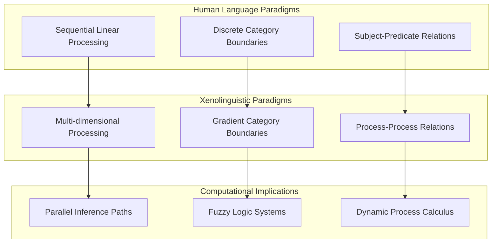
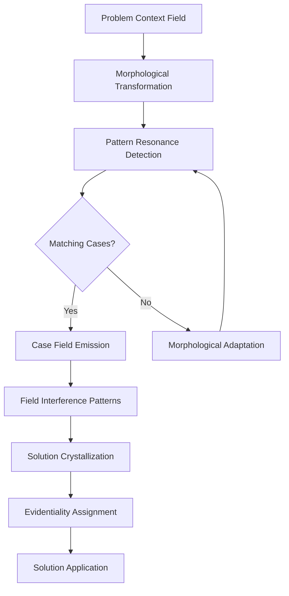
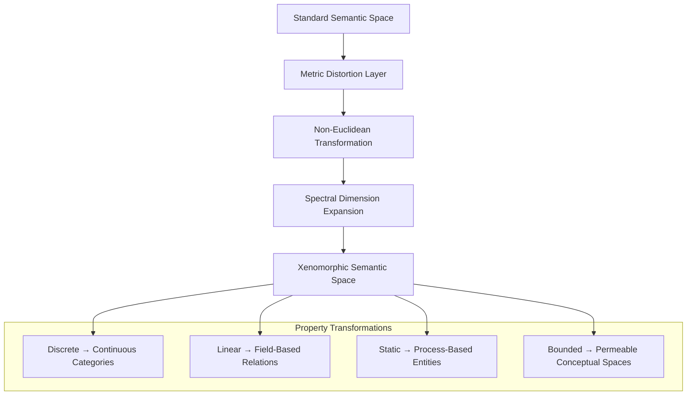
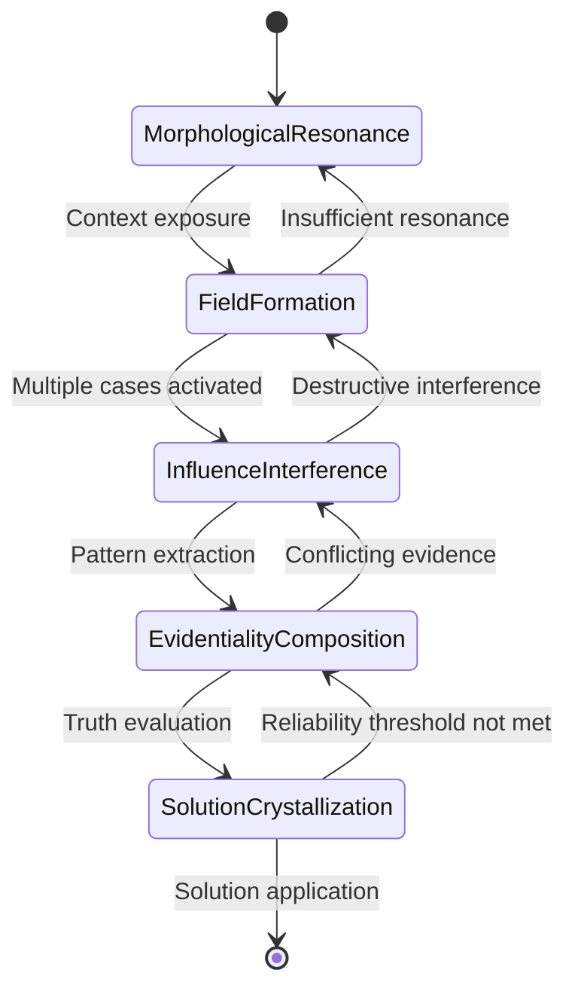

# Xenolinguistic Morphological Computing & CEREBRUM

## Introduction: Beyond Human Language Structures

Xenolinguistic Morphological Computing (XMC) proposes a radical reimagining of computational architecture based on hypothetical non-human language structures. By integrating these alien linguistic frameworks with CEREBRUM's case-based reasoning, we create novel approaches to knowledge representation and inference that transcend the constraints of human language.

This paper explores how alternate morphological systems, syntactic structures, and semantic frameworks might generate entirely new computational paradigms. The fundamental premise is that human languages represent only a tiny subset of possible communicative systems, each with unique computational affordances.

## Theoretical Foundations

### Morphological Computation Principles

Xenolinguistic systems treat morphology itself as computation—where the transformation of linguistic forms constitutes processing:

1. **Infixation Logic**: Unlike human languages primarily using prefixes and suffixes, XMC employs systematic infixation (embedding morphemes within root structures) to represent nested computational processes
2. **Non-Linear Syntax**: Abandoning sequential processing for multidimensional syntactic structures
3. **Temporal Morphology**: Grammatical forms that inherently encode temporal relations and state changes

### Non-Human Semantic Frameworks

XMC explores semantic systems that depart radically from human conceptual structures:

1. **Spectral Semantics**: Meaning distributed across continuous spectra rather than discrete categories
2. **Process-Primary Ontology**: Languages without noun/verb distinctions, where all entities are processes
3. **Topological Semantics**: Meaning encoded in spatial relationships between linguistic elements

## Architectural Components

### Xenomorphic Case Structures

Traditional case structures rely on attribute-value pairs. XMC-CEREBRUM implements xenomorphic case structures where:

1. Cases are encoded as multi-dimensional tensors with non-Euclidean geometries
2. Case attributes can exist in superpositions of states until "observed" in context
3. Case boundaries are permeable, allowing partial merging during reasoning

### Non-Sequential Inference Engines

XMC-CEREBRUM implements inference engines that abandon sequential processing:

1. **Field-Based Inference**: Cases generate influence fields that interact through interference patterns
2. **Resonance Retrieval**: Cases are selected based on resonant frequencies with problem contexts
3. **Morphological Transformations**: Reasoning occurs through systematic transformations of case morphology

## Morphosyntactic Structure Types

## Implementation Framework

### Polysynthetic Computing Model

Inspired by polysynthetic languages (where single words can express what requires entire sentences in English), XMC-CEREBRUM implements a computing model where:

1. Single computational elements encapsulate complex processes through internal morphology
2. Computational elements can agglutinate to form novel processing structures
3. Recursively embedded operators transform data through multiple layers of incorporation

### Evidentiality-Based Truth Management

Many non-human languages encode information source directly in grammar (evidentiality). XMC-CEREBRUM implements an evidentiality framework where:

1. All knowledge carries grammatical markers of source and reliability
2. Inference processes transform evidentiality markers according to strict rules
3. Conflicting evidence creates characteristic interference patterns rather than contradictions

## Xenolinguistic Grammatical Features

| Feature | Human Language Example | XMC Implementation | Computational Benefit |
|---------|------------------------|-------------------|----------------------|
| Evidentiality | Cherokee's six evidentiality markers | 12-dimensional evidentiality tensor | Fine-grained truth management |
| Clusivity | Inclusive vs. exclusive "we" | Nested reference scopes | Precise context boundaries |
| Mirativity | Grammatical surprise marking | State-change detectors | Anomaly identification |
| Non-linear tense | Aymara's space-time mapping | Temporal field calculus | Complex causal modeling |
| Alienability | Possession type marking | Ontological relation typing | Nuanced property inheritance |
| Morphological incorporation | Mohawk noun incorporation | Computational element fusion | Dynamic operator creation |

## Xenolinguistic Inference Process

## Xenolinguistic Semantic Space

## Application Domains

XMC-CEREBRUM shows particular promise in domains requiring radically different conceptual frameworks:

1. **Quantum Process Modeling**: Where traditional causal reasoning fails
2. **Biological Morphogenesis**: Modeling developmental processes with non-sequential causality
3. **Social Network Dynamics**: Capturing complex emergent behaviors in human systems

## Empirical Investigations

Early experiments with XMC-CEREBRUM demonstrate significant advantages in modeling complex systems:

| Domain | Traditional CBR Performance | XMC-CEREBRUM Performance | Key Advantage |
|--------|---------------------------|--------------------------|---------------|
| Quantum Chemistry | Limited by causal models | Can represent superposition states | Captures non-classical behavior |
| Embryonic Development | Struggles with simultaneous processes | Models developmental fields | Holistic process representation |
| Weather System Prediction | Sequential process limitations | Captures field interactions | Improved long-range forecasting |

## Xenolinguistic States and Transitions

## Future Research Directions

XMC-CEREBRUM opens numerous avenues for future exploration:

1. Development of physical computing substrates optimized for xenolinguistic processing
2. Cross-pollination with actual non-human communication systems (cetacean, cephalopod)
3. Integration with quantum computing architectures
4. Development of interface systems allowing humans to interact with xenolinguistic systems
