# Finnish Concepts and CEREBRUM Integration - Visual Atlas

This atlas presents Finnish concepts and their integration with the CEREBRUM framework through diverse visual representations.

## Core Finnish Concepts Harmony

```mermaid
mindmap
  root((Finnish<br>Concepts))
    (Luonto & Metsä):::nature
      (Nature)
      (Forest)
      (Ecological systems)
      (Biodiversity)
    (Paikka):::place
      (Place)
      (Locative Cases)
      (Spatial Awareness)
    (Talkoot):::community
      (Communal work)
      (Cooperation)
      (Neighborly help)
    (Sisu):::resilience
      (Determination)
      (Resilience)
      (Anti-fragility)
    (Käsityö):::craft
      (Craft)
      (Design)
      (Durability)
    (Verkosto):::network
      (Network)
      (Connections)
      (Relationships)

classDef nature fill:#7CB9E8,stroke:#0078D7,color:white
classDef place fill:#8F9779,stroke:#4F5746,color:white
classDef community fill:#D0A2F7,stroke:#9969C7,color:white 
classDef resilience fill:#F78FA7,stroke:#EB5286,color:white
classDef craft fill:#FFBF00,stroke:#B27200,color:white
classDef network fill:#5FD068,stroke:#2D9344,color:white
```

## The Essence of Luonto (Nature)

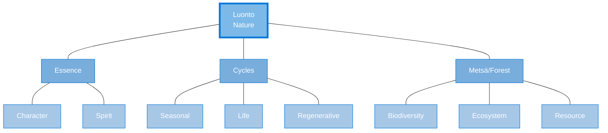

## Finnish Locative Cases - Poetry of Place

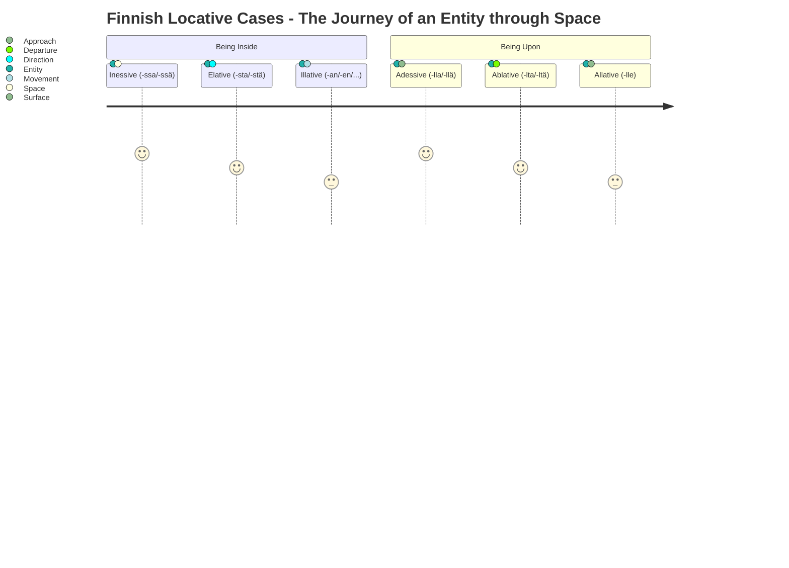

## Sisu - Finnish Determination

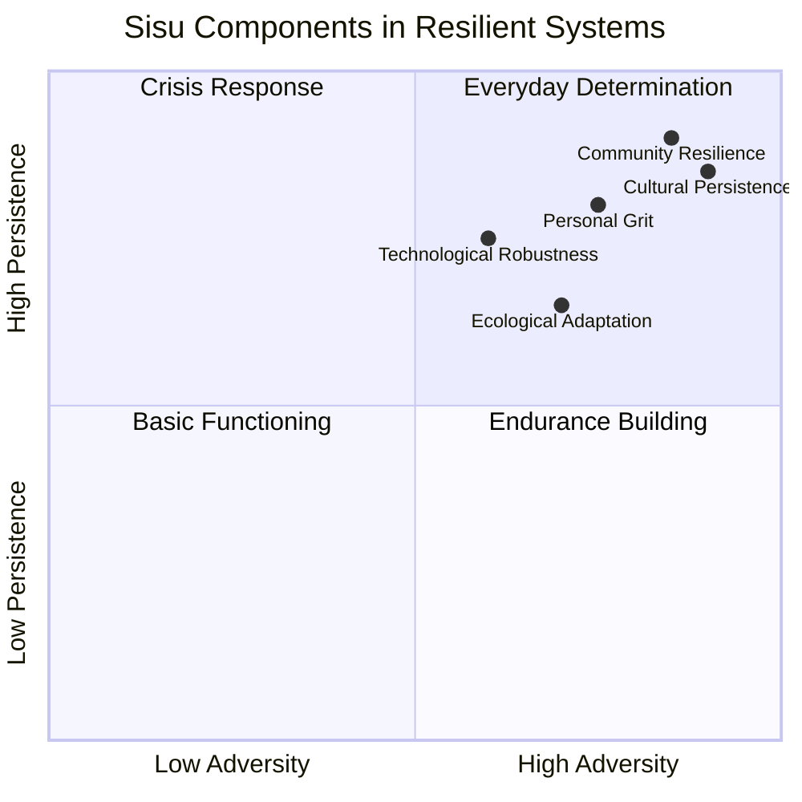

## Paikka: The Spatial Intelligence of Finnish

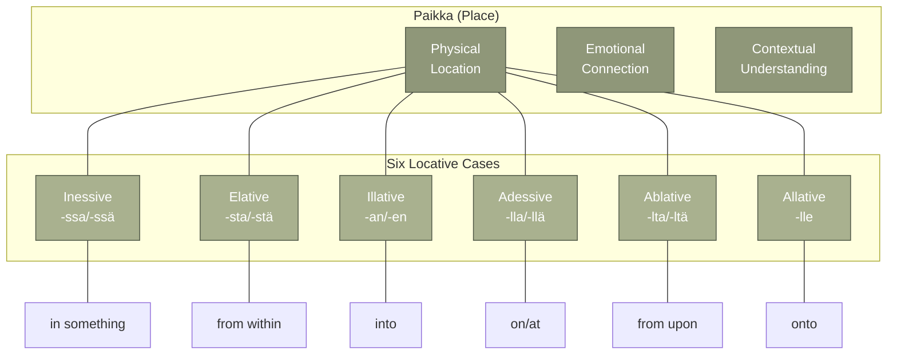

## Talkoot: Communal Harmony

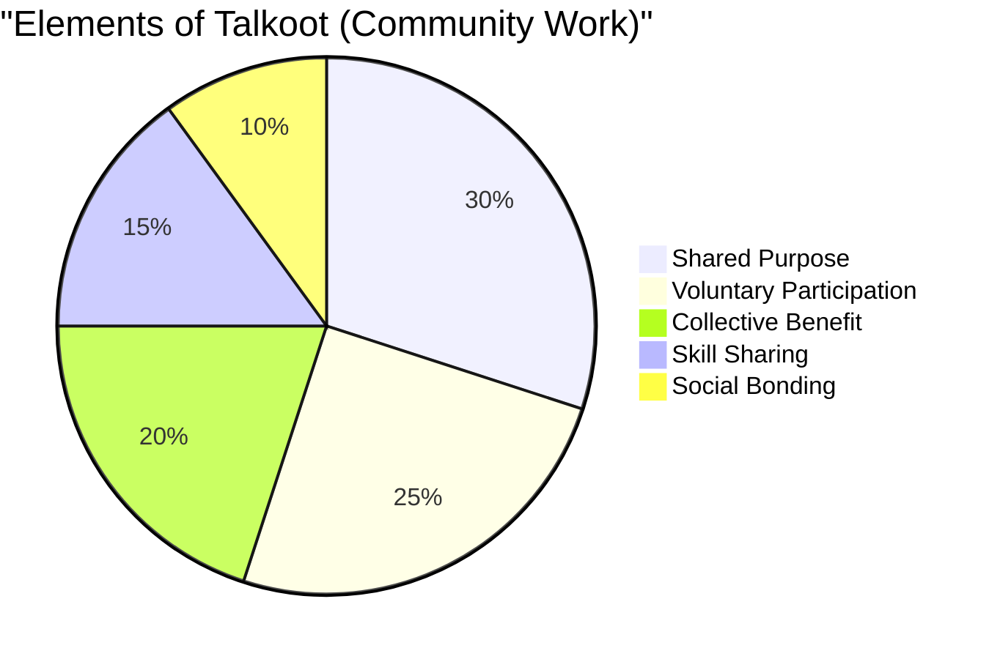

## Verkosto: The Living Networks

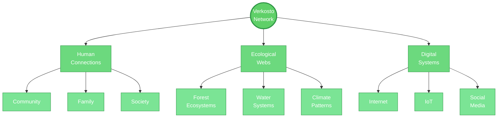

## Finnish Concepts to Application Domains

```mermaid
sankey-beta
    Luonto,Spatial Web,2
    Luonto,Food Forests,3
    Paikka,Spatial Web,4
    Paikka,Web3,2
    Paikka,Interface Design,3
    Talkoot,Web3,3
    Talkoot,Network Weaving,4
    Sisu,Web3,2
    Sisu,Participatory Tech,3
    Käsityö,Participatory Tech,4
    Reuna,Interface Design,3
    Reuna,Food Forests,2
    Verkosto,Network Weaving,5
    Verkosto,Web3,2
    Keräily,Food Forests,4
```

## Finnish-CEREBRUM Case Resonance

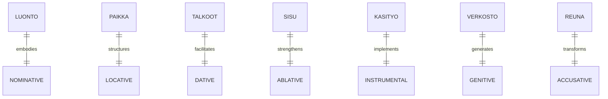

## Käsityö: Craft Intelligence

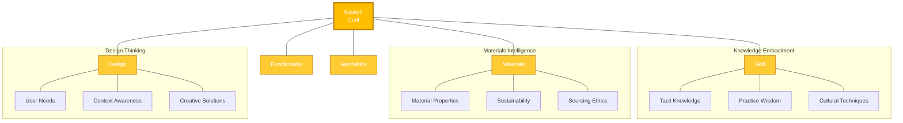

## Finnish Case Transformation Cycle

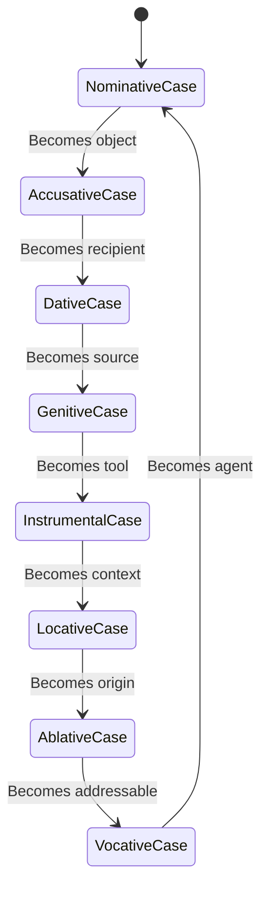

## The Dance of CEREBRUM Cases

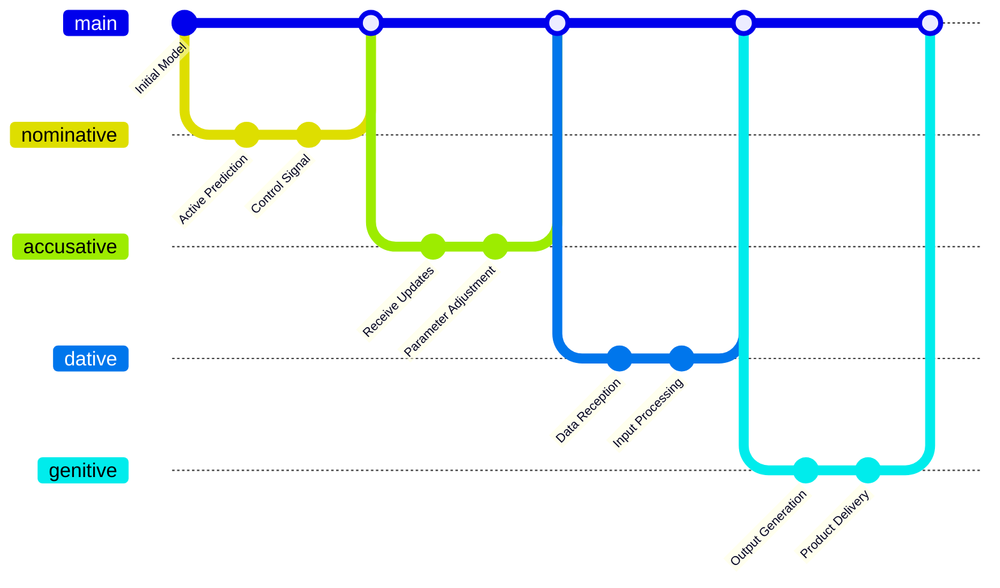

## Sisu in Active Inference Implementation

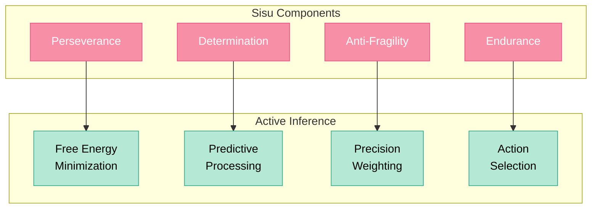

## Reuna, Raja, Välitila: The Poetry of Boundaries

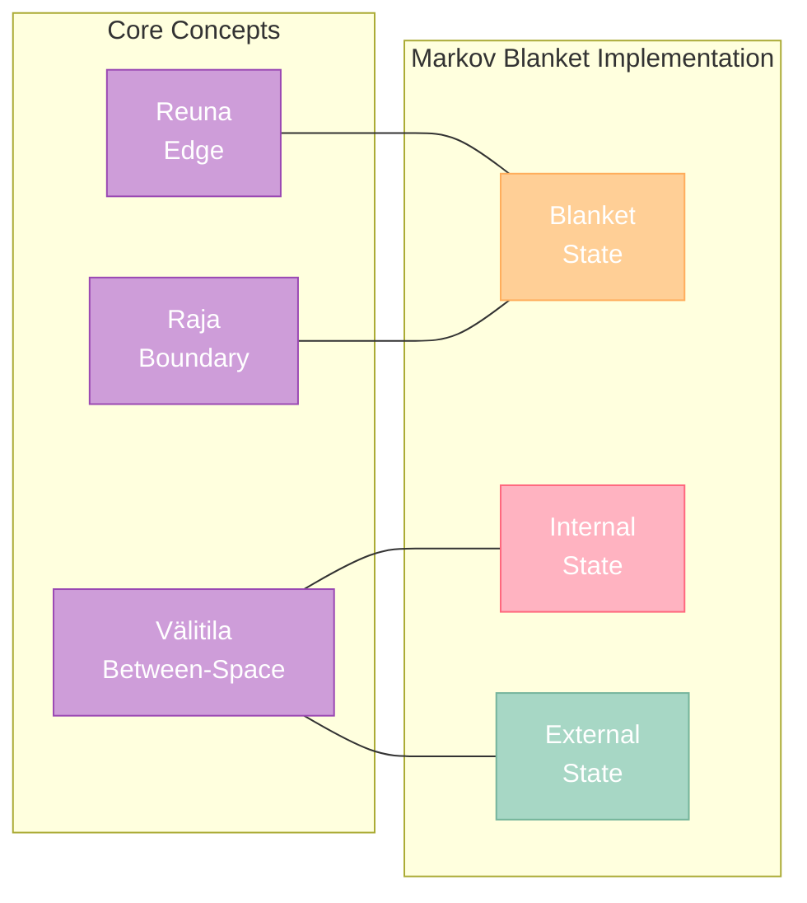

## Luonto-Based Model Ecology

```mermaid
mindmap
    root((Ecological<br>Models))
        (Biodiversity):::bio
            (Model Variety)
            (Multiple Approaches)
            (Diverse Algorithms)
        (Cycles):::cycle
            (Iterative Processing)
            (Feedback Loops)
            (Seasonal Variations)
        (Adaptation):::adapt
            (Dynamic Parameters)
            (Environmental Response)
            (Evolution Over Time)
        (Balance):::balance
            (Resource Allocation)
            (Competing Priorities)
            (Sustainable Operation)

    classDef bio fill:#7CB9E8,stroke:#0078D7,color:white
    classDef cycle fill:#53A3DA,stroke:#0078D7,color:white
    classDef adapt fill:#3D8DD1,stroke:#0078D7,color:white
    classDef balance fill:#1666BA,stroke:#0078D7,color:white
```

## Finnish-Inspired Interface Ecology

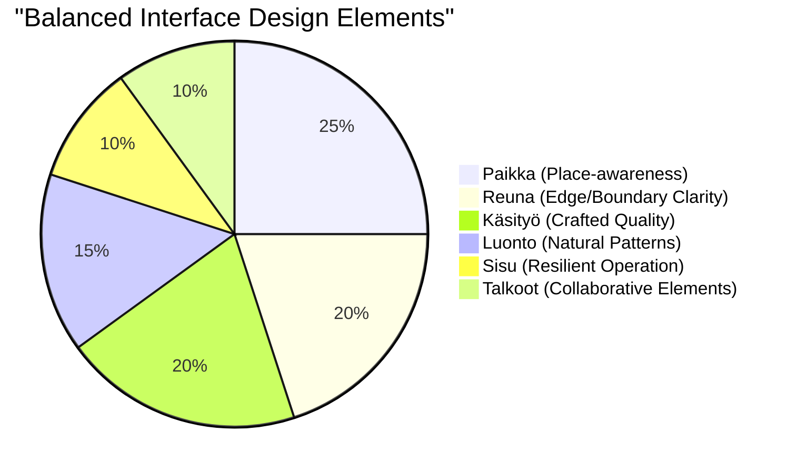

## The Rhythm of Vuodenkierto (Cycle of the Year)

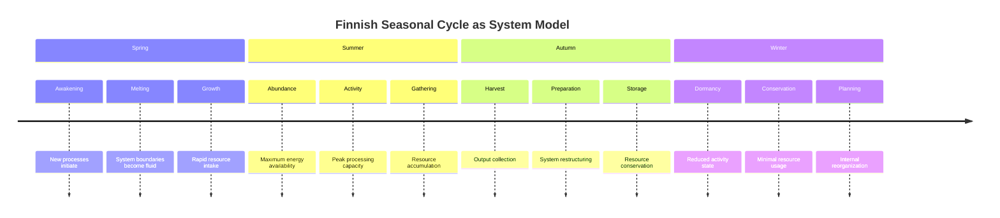

## Talkoot Principles in Multi-Agent Systems

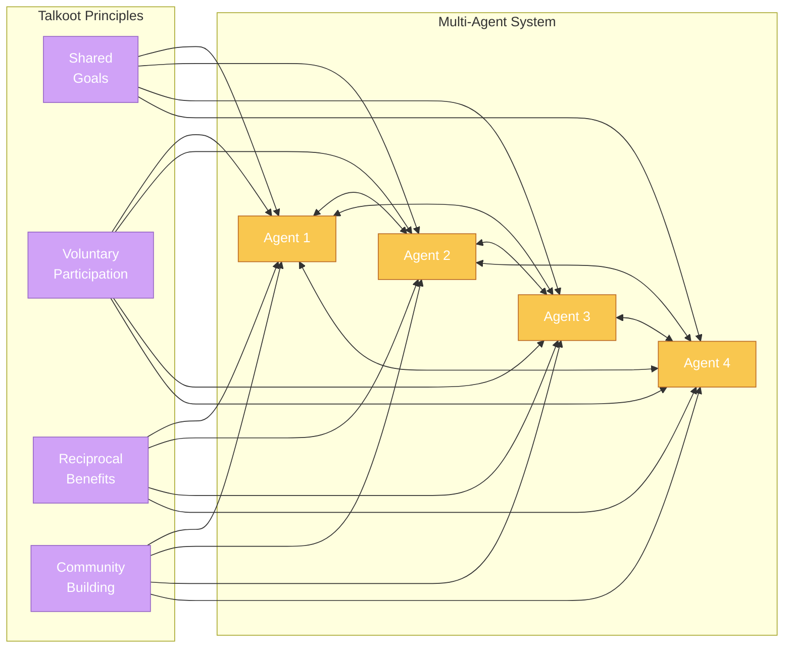

## Finnish Linguistic Case System in CEREBRUM

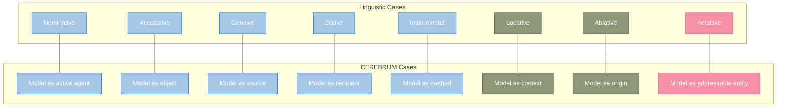

## Cross-Cutting Themes: Paikallisuus & Kestävyys

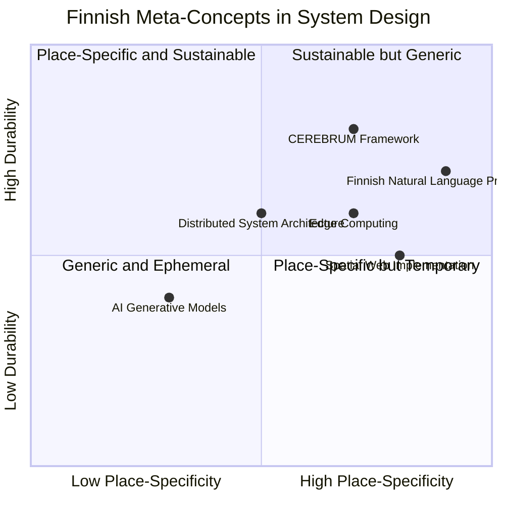

## Metsäpuutarha: Forest Garden as System Metaphor

```mermaid
graph TD
    classDef canopy fill:#4F7942,stroke:#2E4725,color:white
    classDef shrub fill:#6B8E23,stroke:#4F6919,color:white
    classDef herb fill:#9DC183,stroke:#6A8253,color:white
    classDef root fill:#8B4513,stroke:#5E2F0D,color:white
    classDef soil fill:#9B7653,stroke:#664E37,color:white
    
    subgraph "Forest Garden Layers"
        C[Canopy Layer]:::canopy
        S[Shrub Layer]:::shrub
        H[Herbaceous Layer]:::herb
        R[Root Layer]:::root
        M[Soil Microbiome]:::soil
    end
    
    subgraph "System Architecture Layers"
        UI[User Interface]:::canopy
        ML[Middle Logic]:::shrub
        DS[Data Services]:::herb
        DB[Database]:::root
        IS[Infrastructure]:::soil
    end
    
    C --- UI
    S --- ML
    H --- DS
    R --- DB
    M --- IS
    
    C --> S
    S --> H
    H --> R
    R --> M
    
    UI --> ML
    ML --> DS
    DS --> DB
    DB --> IS
```

## Syntactic Case Structure for Models

```mermaid
sequenceDiagram
    participant NOM as Nominative
    participant ACC as Accusative
    participant GEN as Genitive
    participant DAT as Dative
    
    Note over NOM,DAT: Simple Model Sentence Structure
    
    NOM->>ACC: Transforms
    Note right of ACC: Model[NOM] transforms Model[ACC]
    ACC->>GEN: Generates
    Note right of GEN: Result from Model[GEN]
    GEN->>DAT: Transfers to
    Note right of DAT: Given to Model[DAT]
    
    Note over NOM,DAT: Example: Prediction Flow
    
    NOM->>ACC: Perceptual model predicts sensory data
    ACC->>GEN: Prediction creates insight
    GEN->>DAT: Insight delivered to action model
```

## Vuodenkierto Impact on Model Development

```mermaid
gantt
    title Seasonal Approach to Model Development
    dateFormat YYYY-MM-DD
    axisFormat %b
    
    section Conceptualization (Spring)
    Idea Generation      :a1, 2025-03-01, 30d
    Requirement Gathering:a2, after a1, 30d
    Proof of Concept     :a3, after a2, 30d
    
    section Implementation (Summer)
    Core Development     :b1, 2025-06-01, 60d
    Integration          :b2, after b1, 30d
    Testing              :b3, after b2, 30d
    
    section Refinement (Autumn)
    Evaluation           :c1, 2025-09-21, 21d
    Optimization         :c2, after c1, 30d
    Documentation        :c3, after c2, 30d
    
    section Conservation (Winter)
    Maintenance          :d1, 2025-12-21, 30d
    Planning Next Cycle  :d2, after d1, 30d
    Knowledge Transfer   :d3, after d2, 21d
```

## Emotional Dimensions of Finnish Concepts

```mermaid
xychart-beta
    title "Emotional Dimensions of Finnish Concepts"
    x-axis "Communal -- Individual" -5 --> 5
    y-axis "Practical -- Philosophical" -5 --> 5
    bar [0, 1, -2.5, 3.5, -3, 2, -4]
    line [2, 4, -1, 3, -2, 0, -3.5]
    point [1, 3, -2, 4, -2.5, 1, -4.5]
    title "Luonto, Paikka, Talkoot, Sisu, Käsityö, Verkosto, Reuna"
```

## Finnish-CEREBRUM Integration: Precision & Context

```mermaid
pie showData
    title "Value Integration Areas"
    "Contextual Intelligence" : 30
    "Precision Mechanics" : 25
    "Relational Modeling" : 20
    "Resilient Architecture" : 15
    "Craft Quality" : 10
```

## Model Ecosystem as Forest

```mermaid
graph TB
    subgraph "Forest Ecosystem"
        T1[Tall Trees]:::tree
        T2[Mid-Canopy]:::tree
        T3[Understory]:::tree
        S[Shrubs]:::shrub
        H[Herbs]:::herb
        M[Mushrooms]:::fungi
        SO[Soil]:::soil
    end
    
    subgraph "Model Ecosystem"
        M1[Core Models]:::model1
        M2[Support Models]:::model2
        M3[Interface Models]:::model3
        M4[Processing Models]:::model4
        M5[Data Models]:::model5
        M6[Integration Models]:::model6
        M7[Infrastructure]:::model7
    end
    
    T1 --- M1
    T2 --- M2
    T3 --- M3
    S --- M4
    H --- M5
    M --- M6
    SO --- M7
    
    classDef tree fill:#4F7942,stroke:#2E4725,color:white
    classDef shrub fill:#6B8E23,stroke:#4F6919,color:white
    classDef herb fill:#9DC183,stroke:#6A8253,color:white
    classDef fungi fill:#DEB887,stroke:#8B7355,color:white
    classDef soil fill:#8B4513,stroke:#5E2F0D,color:white
    
    classDef model1 fill:#4361EE,stroke:#2B3EAD,color:white
    classDef model2 fill:#4895EF,stroke:#2F6EB7,color:white
    classDef model3 fill:#4CC9F0,stroke:#33A1C5,color:white
    classDef model4 fill:#56CFE1,stroke:#3CA3B1,color:white
    classDef model5 fill:#72EFDD,stroke:#4DCDB8,color:white
    classDef model6 fill:#80FFDB,stroke:#57D9B7,color:white
    classDef model7 fill:#64DFDF,stroke:#4AB5B5,color:white
```

## The Simple Beauty of Finnish Design Principles

```mermaid
graph TD
    subgraph "Finnish Design Ethos"
        F[Functionality]:::design
        S[Simplicity]:::design
        H[Harmony]:::design
        D[Durability]:::design
        M[Materials]:::design
    end
    
    style F fill:#FFFFFF,stroke:#000000,color:black,stroke-width:2px
    style S fill:#FFFFFF,stroke:#000000,color:black,stroke-width:2px
    style H fill:#FFFFFF,stroke:#000000,color:black,stroke-width:2px
    style D fill:#FFFFFF,stroke:#000000,color:black,stroke-width:2px
    style M fill:#FFFFFF,stroke:#000000,color:black,stroke-width:2px
    
    classDef design stroke-dasharray: 5 5
```

## CEREBRUM Morphological Grammar

```mermaid
graph LR
    subgraph "Model [NOM]"
        N1[Active<br>Agent]
    end
    
    subgraph "Model [ACC]"
        A1[Object of<br>Process]
    end
    
    subgraph "Model [GEN]"
        G1[Source/<br>Generator]
    end
    
    subgraph "Model [DAT]"
        D1[Recipient]
    end
    
    N1 -->|transforms| A1
    A1 -->|produces| G1
    G1 -->|delivers to| D1
    
    style N1 fill:#E9C46A,stroke:#B7831A,color:black
    style A1 fill:#F4A261,stroke:#D47A39,color:black
    style G1 fill:#E76F51,stroke:#BC3F23,color:white
    style D1 fill:#2A9D8F,stroke:#176D63,color:white
```

## Bridging Linguistic and Computational Boundaries

```mermaid
flowchart LR
    subgraph "Finnish Linguistic Genius"
        L1[Case System]:::ling
        L2[Agglutination]:::ling
        L3[Vowel Harmony]:::ling
    end
    
    subgraph "Computational Framework"
        C1[Model Structure]:::comp
        C2[Function Chaining]:::comp
        C3[Process Harmony]:::comp
    end
    
    L1 --> C1
    L2 --> C2
    L3 --> C3
    
    classDef ling fill:#C8B6FF,stroke:#9178ED,color:black
    classDef comp fill:#FFD6A5,stroke:#FFA940,color:black
``` 