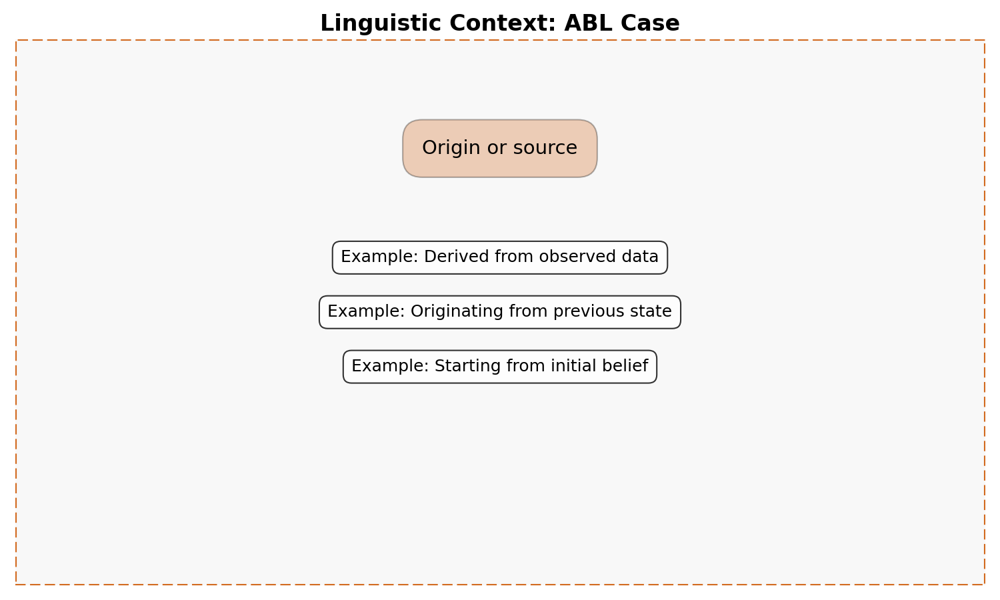
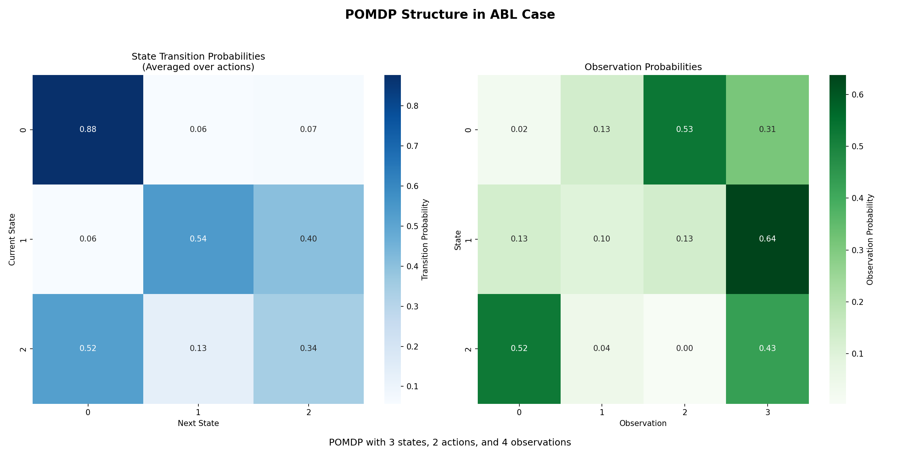
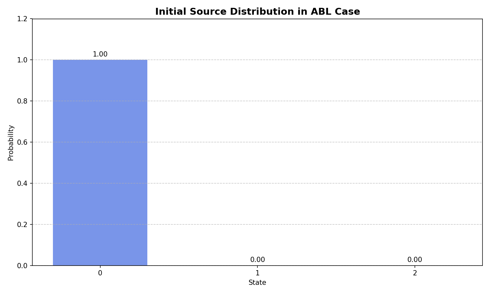
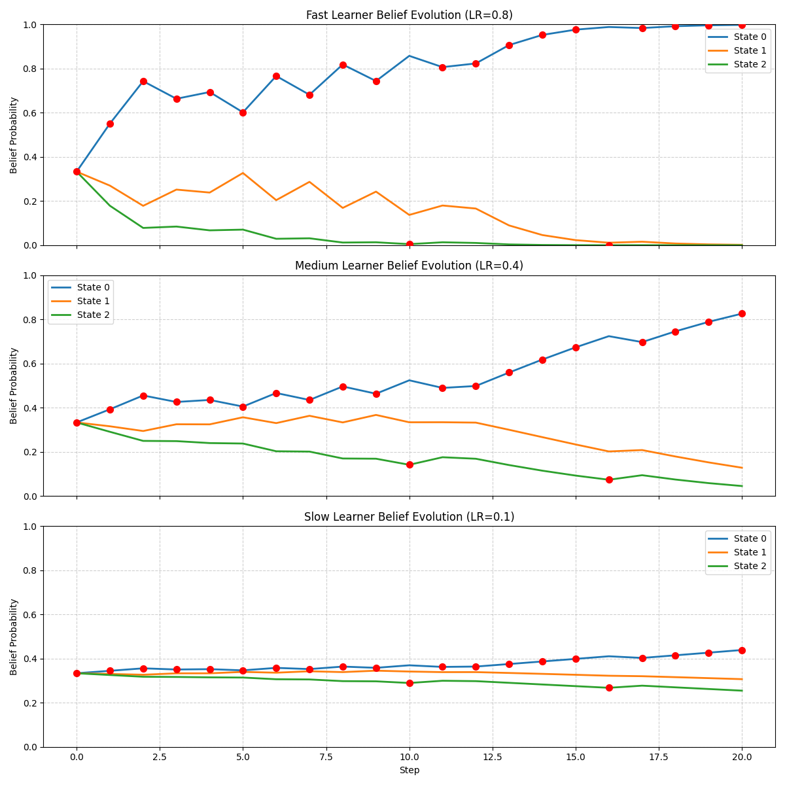
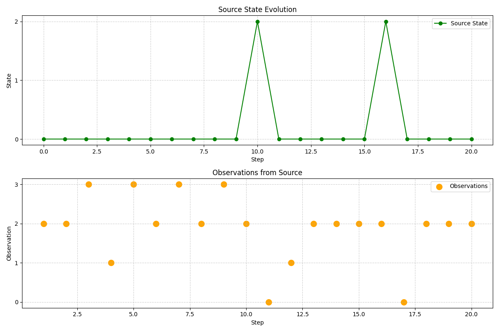
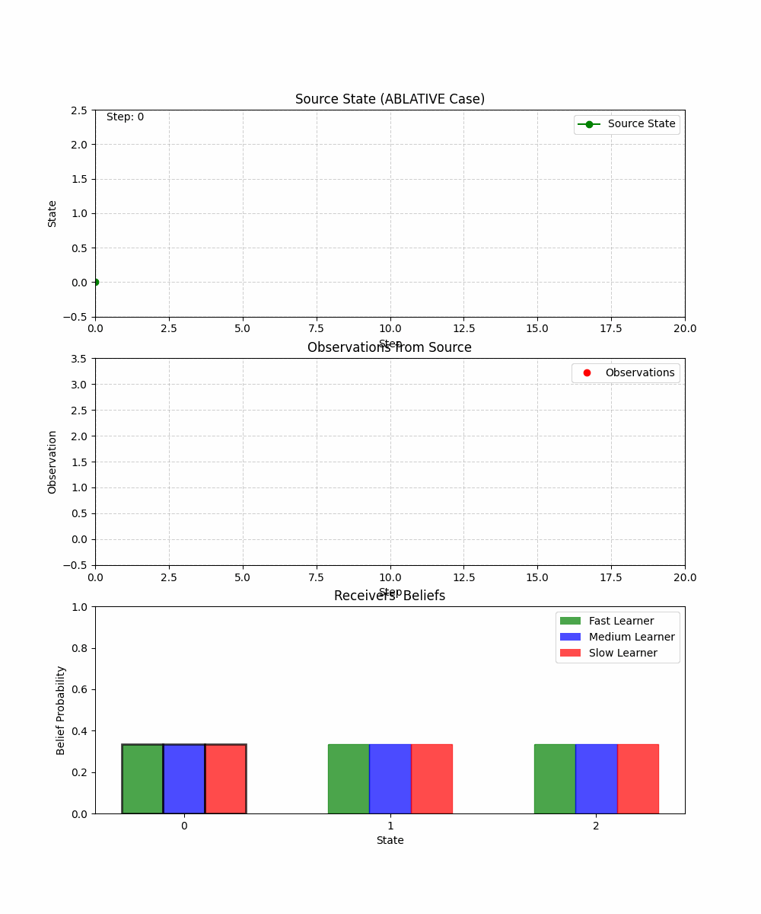

# ABL Case Test Report

## Case Information

- **Linguistic Meaning**: Origin or source
- **Statistical Role**: Starting point of inference
- **POMDP Context**: The POMDP as an origin of observations or signals
- **Primary Methods**: generate_observation(), emit_signal()

## Model Information

- **Model type**: POMDP (Partially Observable Markov Decision Process)
- **Number of states**: 3
- **Number of actions**: 2
- **Number of observations**: 4
- **Case function**: Origin/source of information and observations

## Visualizations

### Linguistic Context

### Pomdp Structure

### Source Distribution

### Belief Evolution

### Receiver Accuracy

### Source Observations

### Source Receiver Animation

